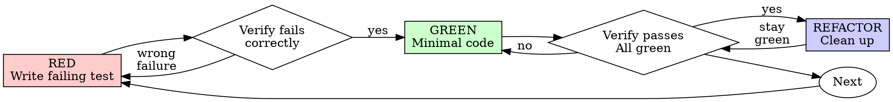

# Services and env variables needed for accounts

**Session ID:** ses_1e1073502ffe3BFBe45toAITdc
**Created:** 5/12/2026, 6:34:41 PM
**Updated:** 5/13/2026, 9:16:10 AM

---

## Assistant (Build · GPT-5.4 · 62.0s)

The config and runtime fallback are patched. I’m regenerating the iOS native project so the entitlement is removed from the local build, then I’ll verify the generated files changed the way we expect before retrying device install.

**Tool: bash**

**Input:**
```json
{
  "command": "export NVM_DIR=\"$HOME/.nvm\" && [ -s \"$NVM_DIR/nvm.sh\" ] && . \"$NVM_DIR/nvm.sh\" && nvm use 22 >/dev/null && CI=1 pnpm --filter @kova/mobile exec expo prebuild --platform ios --clean",
  "workdir": "/Users/jacobjimenez/Desktop/Kova",
  "timeout": 1200000,
  "description": "Regenerate iOS project after notification config change"
}
```

**Output:**
```
env: load .env
env: export EXPO_PUBLIC_API_URL EXPO_PUBLIC_CLERK_PUBLISHABLE_KEY EXPO_PUBLIC_SENTRY_DSN
! Git branch has uncommitted file changes
› It's recommended to commit all changes before proceeding in case you want to revert generated changes.
Git status is dirty but the command will continue because the terminal is not interactive.
- Clearing ios
✔ Cleared ios code
- Creating native directory (./ios)
✔ Created native directory
- Updating package.json
✔ Updated package.json | no changes
- Running prebuild
✔ Finished prebuild
- Installing CocoaPods...
> pod install
- Installing CocoaPods...
Using Expo modules
[Expo] Enabling modular headers for pod ExpoModulesCore
[Expo] Enabling modular headers for pod React-RCTAppDelegate
[Expo] Enabling modular headers for pod React-RCTFabric
[Expo] Enabling modular headers for pod ReactAppDependencyProvider
[Expo] Enabling modular headers for pod React-Core
[Expo] Enabling modular headers for pod ReactCodegen
[Expo] Enabling modular headers for pod RCTRequired
[Expo] Enabling modular headers for pod RCTTypeSafety
[Expo] Enabling modular headers for pod ReactCommon
[Expo] Enabling modular headers for pod React-NativeModulesApple
[Expo] Enabling modular headers for pod Yoga
[Expo] Enabling modular headers for pod React-Fabric
[Expo] Enabling modular headers for pod React-graphics
[Expo] Enabling modular headers for pod React-utils
[Expo] Enabling modular headers for pod React-featureflags
[Expo] Enabling modular headers for pod React-debug
[Expo] Enabling modular headers for pod React-ImageManager
[Expo] Enabling modular headers for pod React-rendererdebug
[Expo] Enabling modular headers for pod React-jsi
[Expo] Enabling modular headers for pod React-renderercss
[Expo] Enabling modular headers for pod hermes-engine
[Expo] Enabling modular headers for pod glog
[Expo] Enabling modular headers for pod boost
[Expo] Enabling modular headers for pod DoubleConversion
[Expo] Enabling modular headers for pod fast_float
[Expo] Enabling modular headers for pod fmt
[Expo] Enabling modular headers for pod RCT-Folly
[Expo] Enabling modular headers for pod SocketRocket
[Expo] Enabling modular headers for pod expo-dev-menu-interface
[Expo] Enabling modular headers for pod EXManifests
[Expo] Enabling modular headers for pod EXUpdatesInterface
[Expo] Enabling modular headers for pod expo-dev-menu
[Expo] Enabling modular headers for pod React-jsinspector
[Expo] Enabling modular headers for pod expo-dev-launcher
[react-native-mmkv] Thank you for using react-native-mmkv ❤️
[react-native-mmkv] If you enjoy using react-native-mmkv, please consider sponsoring this project: https://github.com/sponsors/mrousavy
Found 12 modules for target `Kova`
link_native_modules! {ios_packages: [{configurations: [], name: "@notifee/react-native", root: "/Users/jacobjimenez/Desktop/Kova/node_modules/.pnpm/@notifee+react-native@9.1.8_react-native@0.81.5_@babel+core@7.29.0_@react-native+metro-_a084260699cc8aa3ffa2e6dedb5021c8/node_modules/@notifee/react-native", path: "../../../node_modules/.pnpm/@notifee+react-native@9.1.8_react-native@0.81.5_@babel+core@7.29.0_@react-native+metro-_a084260699cc8aa3ffa2e6dedb5021c8/node_modules/@notifee/react-native", podspec_path: "/Users/jacobjimenez/Desktop/Kova/node_modules/.pnpm/@notifee+react-native@9.1.8_react-native@0.81.5_@babel+core@7.29.0_@react-native+metro-_a084260699cc8aa3ffa2e6dedb5021c8/node_modules/@notifee/react-native/RNNotifee.podspec", script_phases: []}, {configurations: [], name: "@react-native-community/netinfo", root: "/Users/jacobjimenez/Desktop/Kova/node_modules/.pnpm/@react-native-community+netinfo@11.4.1_react-native@0.81.5_@babel+core@7.29.0_@react-na_65e1a1a767749cf663a4d8dc46aab895/node_modules/@react-native-community/netinfo", path: "../../../node_modules/.pnpm/@react-native-community+netinfo@11.4.1_react-native@0.81.5_@babel+core@7.29.0_@react-na_65e1a1a767749cf663a4d8dc46aab895/node_modules/@react-native-community/netinfo", podspec_path: "/Users/jacobjimenez/Desktop/Kova/node_modules/.pnpm/@react-native-community+netinfo@11.4.1_react-native@0.81.5_@babel+core@7.29.0_@react-na_65e1a1a767749cf663a4d8dc46aab895/node_modules/@react-native-community/netinfo/react-native-netinfo.podspec", script_phases: []}, {configurations: [], name: "@sentry/react-native", root: "/Users/jacobjimenez/Desktop/Kova/node_modules/.pnpm/@sentry+react-native@7.2.0_expo@54.0.34_@babel+core@7.29.0_bufferutil@4.1.0_graphql@16._5e491634d56c6ad6a1d203939368f2e1/node_modules/@sentry/react-native", path: "../../../node_modules/.pnpm/@sentry+react-native@7.2.0_expo@54.0.34_@babel+core@7.29.0_bufferutil@4.1.0_graphql@16._5e491634d56c6ad6a1d203939368f2e1/node_modules/@sentry/react-native", podspec_path: "/Users/jacobjimenez/Desktop/Kova/node_modules/.pnpm/@sentry+react-native@7.2.0_expo@54.0.34_@babel+core@7.29.0_bufferutil@4.1.0_graphql@16._5e491634d56c6ad6a1d203939368f2e1/node_modules/@sentry/react-native/RNSentry.podspec", script_phases: []}, {configurations: [], name: "expo", root: "/Users/jacobjimenez/Desktop/Kova/node_modules/.pnpm/expo@54.0.34_@babel+core@7.29.0_bufferutil@4.1.0_graphql@16.14.0_react-native@0.81.5_@b_718902006c8eec32f1052f4013b60e7b/node_modules/expo", path: "../../../node_modules/.pnpm/expo@54.0.34_@babel+core@7.29.0_bufferutil@4.1.0_graphql@16.14.0_react-native@0.81.5_@b_718902006c8eec32f1052f4013b60e7b/node_modules/expo", podspec_path: "/Users/jacobjimenez/Desktop/Kova/node_modules/.pnpm/expo@54.0.34_@babel+core@7.29.0_bufferutil@4.1.0_graphql@16.14.0_react-native@0.81.5_@b_718902006c8eec32f1052f4013b60e7b/node_modules/expo/Expo.podspec", script_phases: []}, {configurations: [], name: "react-native-audio-api", root: "/Users/jacobjimenez/Desktop/Kova/node_modules/.pnpm/react-native-audio-api@0.12.2_react-native-worklets@0.8.3_@babel+core@7.29.0_@react-nat_0d9bba0dd1be64f7bf7dc61aaadda27a/node_modules/react-native-audio-api", path: "../../../node_modules/.pnpm/react-native-audio-api@0.12.2_react-native-worklets@0.8.3_@babel+core@7.29.0_@react-nat_0d9bba0dd1be64f7bf7dc61aaadda27a/node_modules/react-native-audio-api", podspec_path: "/Users/jacobjimenez/Desktop/Kova/node_modules/.pnpm/react-native-audio-api@0.12.2_react-native-worklets@0.8.3_@babel+core@7.29.0_@react-nat_0d9bba0dd1be64f7bf7dc61aaadda27a/node_modules/react-native-audio-api/RNAudioAPI.podspec", script_phases: []}, {configurations: [], name: "react-native-device-info", root: "/Users/jacobjimenez/Desktop/Kova/node_modules/.pnpm/react-native-device-info@15.0.2_react-native@0.81.5_@babel+core@7.29.0_@react-native+me_fc1267f20a3cc4ccb6e481edb26cd772/node_modules/react-native-device-info", path: "../../../node_modules/.pnpm/react-native-device-info@15.0.2_react-native@0.81.5_@babel+core@7.29.0_@react-native+me_fc1267f20a3cc4ccb6e481edb26cd772/node_modules/react-native-device-info", podspec_path: "/Users/jacobjimenez/Desktop/Kova/node_modules/.pnpm/react-native-device-info@15.0.2_react-native@0.81.5_@babel+core@7.29.0_@react-native+me_fc1267f20a3cc4ccb6e481edb26cd772/node_modules/react-native-device-info/RNDeviceInfo.podspec", script_phases: []}, {configurations: [], name: "react-native-fs", root: "/Users/jacobjimenez/Desktop/Kova/node_modules/.pnpm/react-native-fs@2.20.0_react-native@0.81.5_@babel+core@7.29.0_@react-native+metro-confi_c9f2706e048e5d0d3c229f42cf3bda9c/node_modules/react-native-fs", path: "../../../node_modules/.pnpm/react-native-fs@2.20.0_react-native@0.81.5_@babel+core@7.29.0_@react-native+metro-confi_c9f2706e048e5d0d3c229f42cf3bda9c/node_modules/react-native-fs", podspec_path: "/Users/jacobjimenez/Desktop/Kova/node_modules/.pnpm/react-native-fs@2.20.0_react-native@0.81.5_@babel+core@7.29.0_@react-native+metro-confi_c9f2706e048e5d0d3c229f42cf3bda9c/node_modules/react-native-fs/RNFS.podspec", script_phases: []}, {configurations: [], name: "react-native-mmkv", root: "/Users/jacobjimenez/Desktop/Kova/node_modules/.pnpm/react-native-mmkv@3.3.3_react-native@0.81.5_@babel+core@7.29.0_@react-native+metro-conf_0351d760bc6584430e28039e22d21c97/node_modules/react-native-mmkv", path: "../../../node_modules/.pnpm/react-native-mmkv@3.3.3_react-native@0.81.5_@babel+core@7.29.0_@react-native+metro-conf_0351d760bc6584430e28039e22d21c97/node_modules/react-native-mmkv", podspec_path: "/Users/jacobjimenez/Desktop/Kova/node_modules/.pnpm/react-native-mmkv@3.3.3_react-native@0.81.5_@babel+core@7.29.0_@react-native+metro-conf_0351d760bc6584430e28039e22d21c97/node_modules/react-native-mmkv/react-native-mmkv.podspec", script_phases: []}, {configurations: [], name: "react-native-reanimated", root: "/Users/jacobjimenez/Desktop/Kova/node_modules/.pnpm/react-native-reanimated@4.1.7_react-native-worklets@0.8.3_@babel+core@7.29.0_@react-nat_ba38ce5de6c590ea75afd846772ddf90/node_modules/react-native-reanimated", path: "../../../node_modules/.pnpm/react-native-reanimated@4.1.7_react-native-worklets@0.8.3_@babel+core@7.29.0_@react-nat_ba38ce5de6c590ea75afd846772ddf90/node_modules/react-native-reanimated", podspec_path: "/Users/jacobjimenez/Desktop/Kova/node_modules/.pnpm/react-native-reanimated@4.1.7_react-native-worklets@0.8.3_@babel+core@7.29.0_@react-nat_ba38ce5de6c590ea75afd846772ddf90/node_modules/react-native-reanimated/RNReanimated.podspec", script_phases: []}, {configurations: [], name: "react-native-safe-area-context", root: "/Users/jacobjimenez/Desktop/Kova/node_modules/.pnpm/react-native-safe-area-context@5.6.2_react-native@0.81.5_@babel+core@7.29.0_@react-nati_fdf48161089d840a840bc16437003161/node_modules/react-native-safe-area-context", path: "../../../node_modules/.pnpm/react-native-safe-area-context@5.6.2_react-native@0.81.5_@babel+core@7.29.0_@react-nati_fdf48161089d840a840bc16437003161/node_modules/react-native-safe-area-context", podspec_path: "/Users/jacobjimenez/Desktop/Kova/node_modules/.pnpm/react-native-safe-area-context@5.6.2_react-native@0.81.5_@babel+core@7.29.0_@react-nati_fdf48161089d840a840bc16437003161/node_modules/react-native-safe-area-context/react-native-safe-area-context.podspec", script_phases: []}, {configurations: [], name: "react-native-screens", root: "/Users/jacobjimenez/Desktop/Kova/node_modules/.pnpm/react-native-screens@4.16.0_react-native@0.81.5_@babel+core@7.29.0_@react-native+metro-_200f6dca0eff72f7447e90e6b1e127cb/node_modules/react-native-screens", path: "../../../node_modules/.pnpm/react-native-screens@4.16.0_react-native@0.81.5_@babel+core@7.29.0_@react-native+metro-_200f6dca0eff72f7447e90e6b1e127cb/node_modules/react-native-screens", podspec_path: "/Users/jacobjimenez/Desktop/Kova/node_modules/.pnpm/react-native-screens@4.16.0_react-native@0.81.5_@babel+core@7.29.0_@react-native+metro-_200f6dca0eff72f7447e90e6b1e127cb/node_modules/react-native-screens/RNScreens.podspec", script_phases: []}, {configurations: [], name: "react-native-worklets", root: "/Users/jacobjimenez/Desktop/Kova/node_modules/.pnpm/react-native-worklets@0.8.3_@babel+core@7.29.0_@react-native+metro-config@0.85.3_@babel_ea63cd0d2a84f7de8daa0b44c021d39b/node_modules/react-native-worklets", path: "../../../node_modules/.pnpm/react-native-worklets@0.8.3_@babel+core@7.29.0_@react-native+metro-config@0.85.3_@babel_ea63cd0d2a84f7de8daa0b44c021d39b/node_modules/react-native-worklets", podspec_path: "/Users/jacobjimenez/Desktop/Kova/node_modules/.pnpm/react-native-worklets@0.8.3_@babel+core@7.29.0_@react-native+metro-config@0.85.3_@babel_ea63cd0d2a84f7de8daa0b44c021d39b/node_modules/react-native-worklets/RNWorklets.podspec", script_phases: []}], ios_project_root_path: "/Users/jacobjimenez/Desktop/Kova/apps/mobile/ios", react_native_path: "../../../node_modules/.pnpm/react-native@0.81.5_@babel+core@7.29.0_@react-native+metro-config@0.85.3_@babel+core@7._cb72d89ee4cf6df1f9dedc8f31282e5a/node_modules/react-native"}
[react-native-mmkv] Thank you for using react-native-mmkv ❤️
[react-native-mmkv] If you enjoy using react-native-mmkv, please consider sponsoring this project: https://github.com/sponsors/mrousavy
Auto-linking React Native modules for target `Kova`: RNAudioAPI, RNDeviceInfo, RNFS, RNNotifee, RNReanimated, RNScreens, RNSentry, RNWorklets, react-native-mmkv, react-native-netinfo, and react-native-safe-area-context
Framework build type is static library
[ReactNativeDependencies] Setting up ReactNativeDependencies...
[ReactNativeDependencies] Building from source: false
[ReactNativeDependencies] Using release tarball
[ReactNativeDependencies] Using tarball from URL: https://repo1.maven.org/maven2/com/facebook/react/react-native-artifacts/0.81.5/react-native-artifacts-0.81.5-reactnative-dependencies-debug.tar.gz
[ReactNativeDependencies] Source: {http: "https://repo1.maven.org/maven2/com/facebook/react/react-native-artifacts/0.81.5/react-native-artifacts-0.81.5-reactnative-dependencies-debug.tar.gz"}
[ReactNativeCore] Setting up ReactNativeCore...
[ReactNativeCore] Building from source: false
[ReactNativeCore] Using tarball from URL: https://repo1.maven.org/maven2/com/facebook/react/react-native-artifacts/0.81.5/react-native-artifacts-0.81.5-reactnative-core-debug.tar.gz
[ReactNativeCore] Source: {http: "https://repo1.maven.org/maven2/com/facebook/react/react-native-artifacts/0.81.5/react-native-artifacts-0.81.5-reactnative-core-debug.tar.gz"}
Configuring the target with the New Architecture
[ReactNativeCore] Using React Native Core and React Native Dependencies prebuilt versions.
[Codegen] Analyzing /Users/jacobjimenez/Desktop/Kova/apps/mobile/package.json
[Codegen] Searching for codegen-enabled libraries in the app.
[Codegen] The "codegenConfig" field is not defined in package.json. Assuming there is nothing to generate at the app level.
[Codegen] Searching for codegen-enabled libraries in react-native.config.js
[Codegen] Found @sentry/react-native
[Codegen] Found react-native-audio-api
[Codegen] Found react-native-mmkv
[Codegen] Found react-native-reanimated
[Codegen] Found react-native-safe-area-context
[Codegen] Found react-native-screens
[Codegen] Found react-native-worklets
[Codegen] Processing RNSentrySpec
[Codegen] Searching for podspec in the project dependencies.
[Codegen] Supported Apple platforms: ios, macos, tvos, visionos for RNSentrySpec
[Codegen] Processing rnaudioapi
[Codegen] Searching for podspec in the project dependencies.
[Codegen] Supported Apple platforms: ios for rnaudioapi
[Codegen] Processing RNMmkvSpec
[Codegen] Searching for podspec in the project dependencies.
[Codegen] Supported Apple platforms: ios, macos, tvos for RNMmkvSpec
[Codegen] Processing rnreanimated
[Codegen] Searching for podspec in the project dependencies.
[Codegen] Supported Apple platforms: ios, macos, tvos, visionos for rnreanimated
[Codegen] Processing safeareacontext
[Codegen] Searching for podspec in the project dependencies.
[Codegen] Supported Apple platforms: ios, macos, tvos, visionos for safeareacontext
[Codegen] Processing rnscreens
[Codegen] Searching for podspec in the project dependencies.
[Codegen] Supported Apple platforms: ios, tvos, visionos for rnscreens
[Codegen] Processing rnworklets
[Codegen] Searching for podspec in the project dependencies.
[Codegen] Supported Apple platforms: ios, macos, tvos, visionos for rnworklets
[Codegen] Generating Native Code for RNSentrySpec - ios
[Codegen] Generated artifacts: /Users/jacobjimenez/Desktop/Kova/apps/mobile/ios/build/generated/ios
[Codegen] Generating Native Code for rnaudioapi - ios
[Codegen] Generated artifacts: /Users/jacobjimenez/Desktop/Kova/apps/mobile/ios/build/generated/ios
[Codegen] Generating Native Code for RNMmkvSpec - ios
[Codegen] Generated artifacts: /Users/jacobjimenez/Desktop/Kova/apps/mobile/ios/build/generated/ios
[Codegen] Generating Native Code for rnreanimated - ios
[Codegen] Generated artifacts: /Users/jacobjimenez/Desktop/Kova/apps/mobile/ios/build/generated/ios
[Codegen] Generating Native Code for safeareacontext - ios
[Codegen] Generated artifacts: /Users/jacobjimenez/Desktop/Kova/apps/mobile/ios/build/generated/ios
[Codegen] Generating Native Code for rnscreens - ios
[Codegen] Generated artifacts: /Users/jacobjimenez/Desktop/Kova/apps/mobile/ios/build/generated/ios
[Codegen] Generating Native Code for rnworklets - ios
[Codegen] Generated artifacts: /Users/jacobjimenez/Desktop/Kova/apps/mobile/ios/build/generated/ios
[Codegen] Generating RCTThirdPartyComponentsProvider.h
[Codegen] Generated artifact: /Users/jacobjimenez/Desktop/Kova/apps/mobile/ios/build/generated/ios/RCTThirdPartyComponentsProvider.h
[Codegen] Generating RCTThirdPartyComponentsProvider.mm
[Codegen] Generated artifact: /Users/jacobjimenez/Desktop/Kova/apps/mobile/ios/build/generated/ios/RCTThirdPartyComponentsProvider.mm
[Codegen] Generating RCTModulesProvider.h
[Codegen] Generated artifact: /Users/jacobjimenez/Desktop/Kova/apps/mobile/ios/build/generated/ios/RCTModuleProviders.h
[Codegen] Generating RCTModuleProviders.mm
[Codegen] Generated artifact: /Users/jacobjimenez/Desktop/Kova/apps/mobile/ios/build/generated/ios/RCTModuleProviders.mm
[Codegen] Generating RCTAppDependencyProvider
[Codegen] Generated artifact: /Users/jacobjimenez/Desktop/Kova/apps/mobile/ios/build/generated/ios/RCTAppDependencyProvider.h
[Codegen] Generated artifact: /Users/jacobjimenez/Desktop/Kova/apps/mobile/ios/build/generated/ios/RCTAppDependencyProvider.mm
[Codegen] Generated podspec: /Users/jacobjimenez/Desktop/Kova/apps/mobile/ios/build/generated/ios/ReactAppDependencyProvider.podspec
[Codegen] Generated podspec: /Users/jacobjimenez/Desktop/Kova/apps/mobile/ios/build/generated/ios/ReactCodegen.podspec
[Codegen] Done.
Analyzing dependencies
Fetching podspec for `React-Core-prebuilt` from `../../../node_modules/.pnpm/react-native@0.81.5_@babel+core@7.29.0_@react-native+metro-config@0.85.3_@babel+core@7._cb72d89ee4cf6df1f9dedc8f31282e5a/node_modules/react-native/React-Core-prebuilt.podspec`
[ReactNativeCore] Using tarball from URL: https://repo1.maven.org/maven2/com/facebook/react/react-native-artifacts/0.81.5/react-native-artifacts-0.81.5-reactnative-core-debug.tar.gz
Fetching podspec for `ReactNativeDependencies` from `../../../node_modules/.pnpm/react-native@0.81.5_@babel+core@7.29.0_@react-native+metro-config@0.85.3_@babel+core@7._cb72d89ee4cf6df1f9dedc8f31282e5a/node_modules/react-native/third-party-podspecs/ReactNativeDependencies.podspec`
[ReactNativeDependencies] Using release tarball
[ReactNativeDependencies] Using tarball from URL: https://repo1.maven.org/maven2/com/facebook/react/react-native-artifacts/0.81.5/react-native-artifacts-0.81.5-reactnative-dependencies-debug.tar.gz
Fetching podspec for `hermes-engine` from `../../../node_modules/.pnpm/react-native@0.81.5_@babel+core@7.29.0_@react-native+metro-config@0.85.3_@babel+core@7._cb72d89ee4cf6df1f9dedc8f31282e5a/node_modules/react-native/sdks/hermes-engine/hermes-engine.podspec`
[Hermes] Using release tarball from URL: https://repo1.maven.org/maven2/com/facebook/react/react-native-artifacts/0.81.5/react-native-artifacts-0.81.5-hermes-ios-debug.tar.gz
[react-native-mmkv] Thank you for using react-native-mmkv ❤️
[react-native-mmkv] If you enjoy using react-native-mmkv, please consider sponsoring this project: https://github.com/sponsors/mrousavy
Downloading dependencies
Installing EXAV (16.0.8)
Installing EXApplication (7.0.8)
Installing EXConstants (18.0.13)
Installing EXJSONUtils (0.15.0)
Installing EXManifests (1.0.11)
Installing EXNotifications (0.32.17)
Installing EXUpdatesInterface (2.0.0)
Installing Expo (54.0.34)
Installing ExpoAsset (12.0.13)
Installing ExpoCrypto (15.0.9)
Installing ExpoFileSystem (19.0.22)
Installing ExpoFont (14.0.11)
Installing ExpoKeepAwake (15.0.8)
Installing ExpoLinking (8.0.12)
Installing ExpoModulesCore (3.0.30)
Installing ExpoSecureStore (15.0.8)
Installing ExpoWebBrowser (15.0.11)
Installing FBLazyVector (0.81.5)
Installing RCTDeprecation (0.81.5)
Installing RCTRequired (0.81.5)
Installing RCTTypeSafety (0.81.5)
Installing RNAudioAPI (0.12.2)
Installing RNDeviceInfo (15.0.2)
Installing RNFS (2.20.0)
Installing RNNotifee (9.1.8)
Installing RNReanimated (4.1.7)
Installing RNScreens (4.16.0)
Installing RNSentry (7.2.0)
Installing RNWorklets (0.8.3)
Installing React (0.81.5)
Installing React-Core (0.81.5)
Installing React-Core-prebuilt (0.81.5)
Installing React-CoreModules (0.81.5)
Installing React-Fabric (0.81.5)
Installing React-FabricComponents (0.81.5)
Installing React-FabricImage (0.81.5)
Installing React-ImageManager (0.81.5)
Installing React-Mapbuffer (0.81.5)
Installing React-NativeModulesApple (0.81.5)
Installing React-RCTActionSheet (0.81.5)
Installing React-RCTAnimation (0.81.5)
Installing React-RCTAppDelegate (0.81.5)
Installing React-RCTBlob (0.81.5)
Installing React-RCTFBReactNativeSpec (0.81.5)
Installing React-RCTFabric (0.81.5)
Installing React-RCTImage (0.81.5)
Installing React-RCTLinking (0.81.5)
Installing React-RCTNetwork (0.81.5)
Installing React-RCTRuntime (0.81.5)
Installing React-RCTSettings (0.81.5)
Installing React-RCTText (0.81.5)
Installing React-RCTVibration (0.81.5)
Installing React-RuntimeApple (0.81.5)
Installing React-RuntimeCore (0.81.5)
Installing React-RuntimeHermes (0.81.5)
Installing React-callinvoker (0.81.5)
Installing React-cxxreact (0.81.5)
Installing React-debug (0.81.5)
Installing React-defaultsnativemodule (0.81.5)
Installing React-domnativemodule (0.81.5)
Installing React-featureflags (0.81.5)
Installing React-featureflagsnativemodule (0.81.5)
Installing React-graphics (0.81.5)
Installing React-hermes (0.81.5)
Installing React-idlecallbacksnativemodule (0.81.5)
Installing React-jserrorhandler (0.81.5)
Installing React-jsi (0.81.5)
Installing React-jsiexecutor (0.81.5)
Installing React-jsinspector (0.81.5)
Installing React-jsinspectorcdp (0.81.5)
Installing React-jsinspectornetwork (0.81.5)
Installing React-jsinspectortracing (0.81.5)
Installing React-jsitooling (0.81.5)
Installing React-jsitracing (0.81.5)
Installing React-logger (0.81.5)
Installing React-microtasksnativemodule (0.81.5)
Installing React-oscompat (0.81.5)
Installing React-perflogger (0.81.5)
Installing React-performancetimeline (0.81.5)
Installing React-rendererconsistency (0.81.5)
Installing React-renderercss (0.81.5)
Installing React-rendererdebug (0.81.5)
Installing React-runtimeexecutor (0.81.5)
Installing React-runtimescheduler (0.81.5)
Installing React-timing (0.81.5)
Installing React-utils (0.81.5)
Installing ReactAppDependencyProvider (0.81.5)
Installing ReactCodegen (0.81.5)
Installing ReactCommon (0.81.5)
Installing ReactNativeDependencies (0.81.5)
Installing Sentry (8.56.1)
Installing Yoga (0.0.0)
Installing expo-dev-client (6.0.21)
Installing expo-dev-launcher (6.0.21)
Installing expo-dev-menu (7.0.19)
Installing expo-dev-menu-interface (2.0.0)
Installing hermes-engine (0.81.5)
Installing react-native-mmkv (3.3.3)
Installing react-native-netinfo (11.4.1)
Installing react-native-safe-area-context (5.6.2)
Generating Pods project
Setting USE_HERMES build settings
Setting REACT_NATIVE_PATH build settings
Setting SWIFT_ACTIVE_COMPILATION_CONDITIONS build settings
[Ccache]: Removing Ccache from CC, LD, CXX & LDPLUSPLUS build settings
Setting SWIFT_ENABLE_EXPLICIT_MODULES build settings
[SPM] Cleaning old SPM dependencies from Pods project
[SPM] Adding SPM dependencies to Pods project
[Privacy Manifest Aggregation] No existing PrivacyInfo.xcprivacy file found, creating a new one.
[Privacy Manifest Aggregation] Reading .xcprivacy files to aggregate all used Required Reason APIs.
file_root: Kova
Setting CLANG_CXX_LANGUAGE_STANDARD to c++20 on /Users/jacobjimenez/Desktop/Kova/apps/mobile/ios/Kova.xcodeproj

==================== DEPRECATION NOTICE =====================
Calling `pod install` directly is deprecated in React Native
because we are moving away from Cocoapods toward alternative
solutions to build the project.
* If you are using Expo, please run:
`npx expo run:ios`
* If you are using the Community CLI, please run:
`yarn ios`
=============================================================

Pod install took 53 [s] to run
Integrating client project

[!] Please close any current Xcode sessions and use `Kova.xcworkspace` for this project from now on.
[Expo] Installing the build script for target Kova
Pod installation complete! There are 100 dependencies from the Podfile and 100 total pods installed.
[Expo] Adding '[Expo Autolinking] Run Codegen with autolinking' build phase to ReactCodegen
✔ Installed CocoaPods

```

---

## Assistant (Build · GPT-5.4 · 17.1s)

The native project has been regenerated. I’m verifying that the push entitlement and background remote-notification mode are actually gone before retrying the phone build.

**Tool: read**

**Input:**
```json
{
  "filePath": "/Users/jacobjimenez/Desktop/Kova/apps/mobile/ios/Kova/Kova.entitlements"
}
```

**Output:**
```
<path>/Users/jacobjimenez/Desktop/Kova/apps/mobile/ios/Kova/Kova.entitlements</path>
<type>file</type>
<content>
1: <?xml version="1.0" encoding="UTF-8"?>
2: <!DOCTYPE plist PUBLIC "-//Apple//DTD PLIST 1.0//EN" "http://www.apple.com/DTDs/PropertyList-1.0.dtd">
3: <plist version="1.0">
4:   <dict>
5:     <key>aps-environment</key>
6:     <string>development</string>
7:   </dict>
8: </plist>

(End of file - total 8 lines)
</content>
```

**Tool: read**

**Input:**
```json
{
  "filePath": "/Users/jacobjimenez/Desktop/Kova/apps/mobile/ios/Kova/Info.plist"
}
```

**Output:**
```
<path>/Users/jacobjimenez/Desktop/Kova/apps/mobile/ios/Kova/Info.plist</path>
<type>file</type>
<content>
1: <?xml version="1.0" encoding="UTF-8"?>
2: <!DOCTYPE plist PUBLIC "-//Apple//DTD PLIST 1.0//EN" "http://www.apple.com/DTDs/PropertyList-1.0.dtd">
3: <plist version="1.0">
4:   <dict>
5:     <key>CADisableMinimumFrameDurationOnPhone</key>
6:     <true/>
7:     <key>CFBundleDevelopmentRegion</key>
8:     <string>$(DEVELOPMENT_LANGUAGE)</string>
9:     <key>CFBundleDisplayName</key>
10:     <string>Kova</string>
11:     <key>CFBundleExecutable</key>
12:     <string>$(EXECUTABLE_NAME)</string>
13:     <key>CFBundleIdentifier</key>
14:     <string>$(PRODUCT_BUNDLE_IDENTIFIER)</string>
15:     <key>CFBundleInfoDictionaryVersion</key>
16:     <string>6.0</string>
17:     <key>CFBundleName</key>
18:     <string>$(PRODUCT_NAME)</string>
19:     <key>CFBundlePackageType</key>
20:     <string>$(PRODUCT_BUNDLE_PACKAGE_TYPE)</string>
21:     <key>CFBundleShortVersionString</key>
22:     <string>1.0.0</string>
23:     <key>CFBundleSignature</key>
24:     <string>????</string>
25:     <key>CFBundleURLTypes</key>
26:     <array>
27:       <dict>
28:         <key>CFBundleURLSchemes</key>
29:         <array>
30:           <string>kova</string>
31:           <string>com.kovaapp.mobile</string>
32:         </array>
33:       </dict>
34:       <dict>
35:         <key>CFBundleURLSchemes</key>
36:         <array>
37:           <string>exp+kova</string>
38:         </array>
39:       </dict>
40:     </array>
41:     <key>CFBundleVersion</key>
42:     <string>1</string>
43:     <key>LSMinimumSystemVersion</key>
44:     <string>12.0</string>
45:     <key>LSRequiresIPhoneOS</key>
46:     <true/>
47:     <key>NSAppTransportSecurity</key>
48:     <dict>
49:       <key>NSAllowsArbitraryLoads</key>
50:       <false/>
51:       <key>NSAllowsLocalNetworking</key>
52:       <true/>
53:     </dict>
54:     <key>NSBackgroundModes</key>
55:     <array>
56:       <string>audio</string>
57:     </array>
58:     <key>NSFaceIDUsageDescription</key>
59:     <string>Allow $(PRODUCT_NAME) to access your Face ID biometric data.</string>
60:     <key>NSMicrophoneUsageDescription</key>
61:     <string>Kova records service calls to help your team improve revenue.</string>
62:     <key>RCTNewArchEnabled</key>
63:     <true/>
64:     <key>UILaunchStoryboardName</key>
65:     <string>SplashScreen</string>
66:     <key>UIRequiredDeviceCapabilities</key>
67:     <array>
68:       <string>arm64</string>
69:     </array>
70:     <key>UIRequiresFullScreen</key>
71:     <false/>
72:     <key>UIStatusBarStyle</key>
73:     <string>UIStatusBarStyleDefault</string>
74:     <key>UISupportedInterfaceOrientations</key>
75:     <array>
76:       <string>UIInterfaceOrientationPortrait</string>
77:       <string>UIInterfaceOrientationPortraitUpsideDown</string>
78:     </array>
79:     <key>UIUserInterfaceStyle</key>
80:     <string>Automatic</string>
81:     <key>UIViewControllerBasedStatusBarAppearance</key>
82:     <false/>
83:   </dict>
84: </plist>

(End of file - total 84 lines)
</content>
```

**Tool: grep**

**Input:**
```json
{
  "pattern": "aps-environment|remote-notification",
  "path": "/Users/jacobjimenez/Desktop/Kova/apps/mobile/ios",
  "include": "*.{entitlements,plist,pbxproj}"
}
```

**Output:**
```
Found 1 matches
/Users/jacobjimenez/Desktop/Kova/apps/mobile/ios/Kova/Kova.entitlements:
  Line 5:     <key>aps-environment</key>

```

---

## Assistant (Build · GPT-5.4 · 59.2s)

_Thinking:_

**Considering plugin options**

I’m thinking about maintaining the plugin conditionally. I should always include the `expo-notifications` plugin on Android, and also when `KOVA_ENABLE_IOS_PUSH` is true. If it's false, do I still include the plugin? I wonder if there are cross-platform options on iOS that involve adding entitlement regardless of other options. It seems like including the plugin would probably add aps-environment, so I should inspect the documentation to confirm. Preserving Android settings might mean I can still include the plugin while using platform-specific adjustments.

_Thinking:_

**Considering bug fix approach**

I’m thinking about a bug fix and whether the tests are failing because of configuration generation. Maybe creating a simple test script around this config generation could help. TDD suggests I should ask the user for configuration files, but we’ve already used TDD for a previous bug, so it might not be strict. Still, I should follow TDD principles. It could be helpful to verify the build and check entitlements. Should I ask the user about their preference for local builds versus push notifications?

_Thinking:_

**Evaluating local build modifications**

It seems like the user likely wants to proceed, but I think modifying behavior for a local build might need a quick question instead of guessing. The developer guidelines suggest preferring minimal changes and asking if I'm unclear. I could probably implement a conditional local disable without affecting production. That feels like the safest approach. I also need to check the generated package and possibly convert from app.json to app.config.js or app.config.ts. Shall I brainstorm some ideas?

_Thinking:_

**Figuring out Expo configuration**

I'm trying to figure out how to handle the Expo config files properly. It looks like using either `app.config.js` or `app.json` could work, but I think I should stick with `app.json` as the base and maybe create an `app.config.js` that reads from it. I’ll need to conditionally mutate the exported object, especially considering some builds may need to omit certain notifications for local builds. Did we unintentionally remove the remote-notification? That might be a key feature for production!

_Thinking:_

**Analyzing remote notification needs**

I’m considering the `enableBackgroundRemoteNotifications` setting, which defaults to false. It seems that remote-notification is mainly for headless background notifications and might not be necessary for regular pushes. However, since the original config included it, it’s best not to remove it permanently unless necessary. I'll aim to restore remote-notification to the base config and conditionally strip it for local builds while keeping plugins. I think implementing a dynamic config system could help manage these differences effectively!

_Thinking:_

**Verifying native file configurations**

I’m thinking about whether to remove `aps-environment` from the generated native files after making config changes and prebuilding with the environment variable set. I might want to verify that first. Also, it looks like Expo installs expo-notifications pods even without the plugin, which seems fine. However, if I omit the plugin, I'm unsure if the iOS Info.plist will still include settings like foreground display. I need to check whether `iosDisplayInForeground` is tied to the config plugin or runtime!

_Thinking:_

**Evaluating plugin options**

I'm considering background pushes and whether to restore them. The plugin options might keep the remote-notification false, which feels a bit inconsistent. It might be better to remove this added false option to revert to the original config. On the other hand, it may not cause harm if I leave it. 

If the base config says remote-notification is included, then infoPlist should be the source of truth, making the false option redundant. I should also think about adjusting comments and maybe updating scripts to simplify the local build command.

_Thinking:_

**Assessing entitlements editing**

I'm thinking about whether I need to manually edit the generated `ios/Kova/Kova.entitlements` file after prebuilding. If I'm using `app.config.js` and prebuilding cleanly with an environment variable, hopefully, it should handle it. We have to test this since the current `app.json` is static and still includes the `aps-environment`. 

I could verify with `expo config --json` and also consider removing the entitlements file after prebuilding. However, I need to test if the plugin or package might still add the `aps-environment`. I’ll inspect everything once I run the prebuild.

_Thinking:_

**Updating app configuration**

I’m planning to patch `app.json` by restoring remote-notification and removing the `enableBackgroundRemoteNotifications` set to false. I think I should also add `app.config.js`. I could mention that the earlier manually generated iOS folder shouldn’t be committed, but it might be okay. 

Additionally, I need to consider changing the notifications service to catch errors from `getExpoPushTokenAsync`. I’m thinking about catching `requestPermissionsAsync`, but that might not be necessary. With the plugin omitted, I know local notifications on iOS still require permissions and the package.

_Thinking:_

**Evaluating iOS push capability**

I'm inspecting the command regarding `Kova.entitlements` and `Info.plist`. If `Kova.entitlements` turns out to be an empty dictionary or has been removed, I'll take a closer look. But if it's still present, maybe there’s something else adding the push notifications (aps). I should consider searching for that. I'll start by patching first to see if that resolves the issue before I pursue further options.

I’m switching the app config to a conditional local-build setup now, so personal-team iPhone builds can omit the iOS push capability without changing production/EAS behavior.

**Tool: apply_patch**

**Input:**
```json
{
  "patchText": "*** Begin Patch\n*** Update File: /Users/jacobjimenez/Desktop/Kova/apps/mobile/app.json\n@@\n       \"supportsTablet\": false,\n       \"bundleIdentifier\": \"com.kovaapp.mobile\",\n       \"infoPlist\": {\n         \"NSMicrophoneUsageDescription\": \"Kova records service calls to help your team improve revenue.\",\n         \"NSBackgroundModes\": [\n-          \"audio\"\n+          \"audio\",\n+          \"remote-notification\"\n         ]\n       },\n       \"buildNumber\": \"1\"\n@@\n         {\n           \"icon\": \"./assets/notification-icon.png\",\n           \"color\": \"#2563EB\",\n           \"androidMode\": \"default\",\n           \"androidCollapsedTitle\": \"Kova\",\n-          \"iosDisplayInForeground\": true,\n-          \"enableBackgroundRemoteNotifications\": false\n+          \"iosDisplayInForeground\": true\n         }\n       ],\n*** End Patch"
}
```

**Output:**
```
Success. Updated the following files:
M apps/mobile/app.json
```

---

## Assistant (Build · GPT-5.4 · 13.3s)

I’m converting the static app config into an environment-aware config so we can build locally without APNs entitlements, while preserving push support for dev/prod builds.

**Tool: apply_patch**

**Input:**
```json
{
  "patchText": "*** Begin Patch\n*** Delete File: /Users/jacobjimenez/Desktop/Kova/apps/mobile/app.json\n*** End Patch"
}
```

**Output:**
```
Success. Updated the following files:
D apps/mobile/app.json
```

---

## Assistant (Build · GPT-5.4 · 21.3s)

I removed the static app config. Next I’m replacing it with an env-aware `app.config.ts` that disables iOS push entitlements only when we explicitly request a local personal-team build.

**Tool: apply_patch**

**Input:**
```json
{
  "patchText": "*** Begin Patch\n*** Add File: /Users/jacobjimenez/Desktop/Kova/apps/mobile/app.config.ts\n+import type { ExpoConfig } from 'expo/config'\n+\n+const isLocalIosBuild = process.env.LOCAL_IOS_BUILD === '1'\n+\n+const config: ExpoConfig = {\n+  name: 'Kova',\n+  slug: 'kova',\n+  version: '1.0.0',\n+  scheme: 'kova',\n+  orientation: 'portrait',\n+  icon: './assets/icon.png',\n+  userInterfaceStyle: 'automatic',\n+  newArchEnabled: true,\n+  splash: {\n+    image: './assets/splash-icon.png',\n+    resizeMode: 'contain',\n+    backgroundColor: '#ffffff',\n+  },\n+  ios: {\n+    supportsTablet: false,\n+    bundleIdentifier: 'com.kovaapp.mobile',\n+    infoPlist: {\n+      NSMicrophoneUsageDescription:\n+        'Kova records service calls to help your team improve revenue.',\n+      NSBackgroundModes: isLocalIosBuild ? ['audio'] : ['audio', 'remote-notification'],\n+    },\n+    buildNumber: '1',\n+  },\n+  android: {\n+    adaptiveIcon: {\n+      foregroundImage: './assets/adaptive-icon.png',\n+      backgroundColor: '#ffffff',\n+    },\n+    package: 'com.kovaapp.mobile',\n+    permissions: [\n+      'RECORD_AUDIO',\n+      'FOREGROUND_SERVICE',\n+      'FOREGROUND_SERVICE_MICROPHONE',\n+      'RECEIVE_BOOT_COMPLETED',\n+      'POST_NOTIFICATIONS',\n+    ],\n+    versionCode: 1,\n+  },\n+  web: {\n+    bundler: 'metro',\n+  },\n+  plugins: [\n+    [\n+      'expo-dev-client',\n+      {\n+        launchMode: 'most-recent',\n+      },\n+    ],\n+    [\n+      'expo-notifications',\n+      {\n+        icon: './assets/notification-icon.png',\n+        color: '#2563EB',\n+        androidMode: 'default',\n+        androidCollapsedTitle: 'Kova',\n+        iosDisplayInForeground: true,\n+        enableBackgroundRemoteNotifications: !isLocalIosBuild,\n+      },\n+    ],\n+    [\n+      '@sentry/react-native/expo',\n+      {\n+        url: 'https://sentry.io/',\n+        project: 'kova-mobile',\n+        organization: 'kova',\n+      },\n+    ],\n+    'expo-secure-store',\n+  ],\n+  experiments: {\n+    typedRoutes: false,\n+  },\n+  extra: {\n+    eas: {\n+      projectId: 'be7029e9-0e98-4f49-a7ae-42eb8b185d82',\n+    },\n+  },\n+  owner: 'kova-ai',\n+}\n+\n+export default config\n*** End Patch"
}
```

**Output:**
```
Success. Updated the following files:
A apps/mobile/app.config.ts
```

---

## Assistant (Build · GPT-5.4 · 74.0s)

The env-aware config is in place. I’m regenerating iOS with `LOCAL_IOS_BUILD=1` so the personal-team build drops the APNs entitlement, then I’ll verify the generated native files before retrying the device install.

**Tool: bash**

**Input:**
```json
{
  "command": "export NVM_DIR=\"$HOME/.nvm\" && [ -s \"$NVM_DIR/nvm.sh\" ] && . \"$NVM_DIR/nvm.sh\" && nvm use 22 >/dev/null && LOCAL_IOS_BUILD=1 CI=1 pnpm --filter @kova/mobile exec expo prebuild --platform ios --clean",
  "workdir": "/Users/jacobjimenez/Desktop/Kova",
  "timeout": 1200000,
  "description": "Regenerate iOS project without push entitlements"
}
```

**Output:**
```
env: load .env
env: export EXPO_PUBLIC_API_URL EXPO_PUBLIC_CLERK_PUBLISHABLE_KEY EXPO_PUBLIC_SENTRY_DSN
! Git branch has uncommitted file changes
› It's recommended to commit all changes before proceeding in case you want to revert generated changes.
Git status is dirty but the command will continue because the terminal is not interactive.
- Clearing ios
✔ Cleared ios code
- Creating native directory (./ios)
✔ Created native directory
- Updating package.json
✔ Updated package.json | no changes
- Running prebuild
✔ Finished prebuild
- Installing CocoaPods...
> pod install
- Installing CocoaPods...
Using Expo modules
[Expo] Enabling modular headers for pod ExpoModulesCore
[Expo] Enabling modular headers for pod React-RCTAppDelegate
[Expo] Enabling modular headers for pod React-RCTFabric
[Expo] Enabling modular headers for pod ReactAppDependencyProvider
[Expo] Enabling modular headers for pod React-Core
[Expo] Enabling modular headers for pod ReactCodegen
[Expo] Enabling modular headers for pod RCTRequired
[Expo] Enabling modular headers for pod RCTTypeSafety
[Expo] Enabling modular headers for pod ReactCommon
[Expo] Enabling modular headers for pod React-NativeModulesApple
[Expo] Enabling modular headers for pod Yoga
[Expo] Enabling modular headers for pod React-Fabric
[Expo] Enabling modular headers for pod React-graphics
[Expo] Enabling modular headers for pod React-utils
[Expo] Enabling modular headers for pod React-featureflags
[Expo] Enabling modular headers for pod React-debug
[Expo] Enabling modular headers for pod React-ImageManager
[Expo] Enabling modular headers for pod React-rendererdebug
[Expo] Enabling modular headers for pod React-jsi
[Expo] Enabling modular headers for pod React-renderercss
[Expo] Enabling modular headers for pod hermes-engine
[Expo] Enabling modular headers for pod glog
[Expo] Enabling modular headers for pod boost
[Expo] Enabling modular headers for pod DoubleConversion
[Expo] Enabling modular headers for pod fast_float
[Expo] Enabling modular headers for pod fmt
[Expo] Enabling modular headers for pod RCT-Folly
[Expo] Enabling modular headers for pod SocketRocket
[Expo] Enabling modular headers for pod expo-dev-menu-interface
[Expo] Enabling modular headers for pod EXManifests
[Expo] Enabling modular headers for pod EXUpdatesInterface
[Expo] Enabling modular headers for pod expo-dev-menu
[Expo] Enabling modular headers for pod React-jsinspector
[Expo] Enabling modular headers for pod expo-dev-launcher
[react-native-mmkv] Thank you for using react-native-mmkv ❤️
[react-native-mmkv] If you enjoy using react-native-mmkv, please consider sponsoring this project: https://github.com/sponsors/mrousavy
Found 12 modules for target `Kova`
link_native_modules! {ios_packages: [{configurations: [], name: "@notifee/react-native", root: "/Users/jacobjimenez/Desktop/Kova/node_modules/.pnpm/@notifee+react-native@9.1.8_react-native@0.81.5_@babel+core@7.29.0_@react-native+metro-_a084260699cc8aa3ffa2e6dedb5021c8/node_modules/@notifee/react-native", path: "../../../node_modules/.pnpm/@notifee+react-native@9.1.8_react-native@0.81.5_@babel+core@7.29.0_@react-native+metro-_a084260699cc8aa3ffa2e6dedb5021c8/node_modules/@notifee/react-native", podspec_path: "/Users/jacobjimenez/Desktop/Kova/node_modules/.pnpm/@notifee+react-native@9.1.8_react-native@0.81.5_@babel+core@7.29.0_@react-native+metro-_a084260699cc8aa3ffa2e6dedb5021c8/node_modules/@notifee/react-native/RNNotifee.podspec", script_phases: []}, {configurations: [], name: "@react-native-community/netinfo", root: "/Users/jacobjimenez/Desktop/Kova/node_modules/.pnpm/@react-native-community+netinfo@11.4.1_react-native@0.81.5_@babel+core@7.29.0_@react-na_65e1a1a767749cf663a4d8dc46aab895/node_modules/@react-native-community/netinfo", path: "../../../node_modules/.pnpm/@react-native-community+netinfo@11.4.1_react-native@0.81.5_@babel+core@7.29.0_@react-na_65e1a1a767749cf663a4d8dc46aab895/node_modules/@react-native-community/netinfo", podspec_path: "/Users/jacobjimenez/Desktop/Kova/node_modules/.pnpm/@react-native-community+netinfo@11.4.1_react-native@0.81.5_@babel+core@7.29.0_@react-na_65e1a1a767749cf663a4d8dc46aab895/node_modules/@react-native-community/netinfo/react-native-netinfo.podspec", script_phases: []}, {configurations: [], name: "@sentry/react-native", root: "/Users/jacobjimenez/Desktop/Kova/node_modules/.pnpm/@sentry+react-native@7.2.0_expo@54.0.34_@babel+core@7.29.0_bufferutil@4.1.0_graphql@16._5e491634d56c6ad6a1d203939368f2e1/node_modules/@sentry/react-native", path: "../../../node_modules/.pnpm/@sentry+react-native@7.2.0_expo@54.0.34_@babel+core@7.29.0_bufferutil@4.1.0_graphql@16._5e491634d56c6ad6a1d203939368f2e1/node_modules/@sentry/react-native", podspec_path: "/Users/jacobjimenez/Desktop/Kova/node_modules/.pnpm/@sentry+react-native@7.2.0_expo@54.0.34_@babel+core@7.29.0_bufferutil@4.1.0_graphql@16._5e491634d56c6ad6a1d203939368f2e1/node_modules/@sentry/react-native/RNSentry.podspec", script_phases: []}, {configurations: [], name: "expo", root: "/Users/jacobjimenez/Desktop/Kova/node_modules/.pnpm/expo@54.0.34_@babel+core@7.29.0_bufferutil@4.1.0_graphql@16.14.0_react-native@0.81.5_@b_718902006c8eec32f1052f4013b60e7b/node_modules/expo", path: "../../../node_modules/.pnpm/expo@54.0.34_@babel+core@7.29.0_bufferutil@4.1.0_graphql@16.14.0_react-native@0.81.5_@b_718902006c8eec32f1052f4013b60e7b/node_modules/expo", podspec_path: "/Users/jacobjimenez/Desktop/Kova/node_modules/.pnpm/expo@54.0.34_@babel+core@7.29.0_bufferutil@4.1.0_graphql@16.14.0_react-native@0.81.5_@b_718902006c8eec32f1052f4013b60e7b/node_modules/expo/Expo.podspec", script_phases: []}, {configurations: [], name: "react-native-audio-api", root: "/Users/jacobjimenez/Desktop/Kova/node_modules/.pnpm/react-native-audio-api@0.12.2_react-native-worklets@0.8.3_@babel+core@7.29.0_@react-nat_0d9bba0dd1be64f7bf7dc61aaadda27a/node_modules/react-native-audio-api", path: "../../../node_modules/.pnpm/react-native-audio-api@0.12.2_react-native-worklets@0.8.3_@babel+core@7.29.0_@react-nat_0d9bba0dd1be64f7bf7dc61aaadda27a/node_modules/react-native-audio-api", podspec_path: "/Users/jacobjimenez/Desktop/Kova/node_modules/.pnpm/react-native-audio-api@0.12.2_react-native-worklets@0.8.3_@babel+core@7.29.0_@react-nat_0d9bba0dd1be64f7bf7dc61aaadda27a/node_modules/react-native-audio-api/RNAudioAPI.podspec", script_phases: []}, {configurations: [], name: "react-native-device-info", root: "/Users/jacobjimenez/Desktop/Kova/node_modules/.pnpm/react-native-device-info@15.0.2_react-native@0.81.5_@babel+core@7.29.0_@react-native+me_fc1267f20a3cc4ccb6e481edb26cd772/node_modules/react-native-device-info", path: "../../../node_modules/.pnpm/react-native-device-info@15.0.2_react-native@0.81.5_@babel+core@7.29.0_@react-native+me_fc1267f20a3cc4ccb6e481edb26cd772/node_modules/react-native-device-info", podspec_path: "/Users/jacobjimenez/Desktop/Kova/node_modules/.pnpm/react-native-device-info@15.0.2_react-native@0.81.5_@babel+core@7.29.0_@react-native+me_fc1267f20a3cc4ccb6e481edb26cd772/node_modules/react-native-device-info/RNDeviceInfo.podspec", script_phases: []}, {configurations: [], name: "react-native-fs", root: "/Users/jacobjimenez/Desktop/Kova/node_modules/.pnpm/react-native-fs@2.20.0_react-native@0.81.5_@babel+core@7.29.0_@react-native+metro-confi_c9f2706e048e5d0d3c229f42cf3bda9c/node_modules/react-native-fs", path: "../../../node_modules/.pnpm/react-native-fs@2.20.0_react-native@0.81.5_@babel+core@7.29.0_@react-native+metro-confi_c9f2706e048e5d0d3c229f42cf3bda9c/node_modules/react-native-fs", podspec_path: "/Users/jacobjimenez/Desktop/Kova/node_modules/.pnpm/react-native-fs@2.20.0_react-native@0.81.5_@babel+core@7.29.0_@react-native+metro-confi_c9f2706e048e5d0d3c229f42cf3bda9c/node_modules/react-native-fs/RNFS.podspec", script_phases: []}, {configurations: [], name: "react-native-mmkv", root: "/Users/jacobjimenez/Desktop/Kova/node_modules/.pnpm/react-native-mmkv@3.3.3_react-native@0.81.5_@babel+core@7.29.0_@react-native+metro-conf_0351d760bc6584430e28039e22d21c97/node_modules/react-native-mmkv", path: "../../../node_modules/.pnpm/react-native-mmkv@3.3.3_react-native@0.81.5_@babel+core@7.29.0_@react-native+metro-conf_0351d760bc6584430e28039e22d21c97/node_modules/react-native-mmkv", podspec_path: "/Users/jacobjimenez/Desktop/Kova/node_modules/.pnpm/react-native-mmkv@3.3.3_react-native@0.81.5_@babel+core@7.29.0_@react-native+metro-conf_0351d760bc6584430e28039e22d21c97/node_modules/react-native-mmkv/react-native-mmkv.podspec", script_phases: []}, {configurations: [], name: "react-native-reanimated", root: "/Users/jacobjimenez/Desktop/Kova/node_modules/.pnpm/react-native-reanimated@4.1.7_react-native-worklets@0.8.3_@babel+core@7.29.0_@react-nat_ba38ce5de6c590ea75afd846772ddf90/node_modules/react-native-reanimated", path: "../../../node_modules/.pnpm/react-native-reanimated@4.1.7_react-native-worklets@0.8.3_@babel+core@7.29.0_@react-nat_ba38ce5de6c590ea75afd846772ddf90/node_modules/react-native-reanimated", podspec_path: "/Users/jacobjimenez/Desktop/Kova/node_modules/.pnpm/react-native-reanimated@4.1.7_react-native-worklets@0.8.3_@babel+core@7.29.0_@react-nat_ba38ce5de6c590ea75afd846772ddf90/node_modules/react-native-reanimated/RNReanimated.podspec", script_phases: []}, {configurations: [], name: "react-native-safe-area-context", root: "/Users/jacobjimenez/Desktop/Kova/node_modules/.pnpm/react-native-safe-area-context@5.6.2_react-native@0.81.5_@babel+core@7.29.0_@react-nati_fdf48161089d840a840bc16437003161/node_modules/react-native-safe-area-context", path: "../../../node_modules/.pnpm/react-native-safe-area-context@5.6.2_react-native@0.81.5_@babel+core@7.29.0_@react-nati_fdf48161089d840a840bc16437003161/node_modules/react-native-safe-area-context", podspec_path: "/Users/jacobjimenez/Desktop/Kova/node_modules/.pnpm/react-native-safe-area-context@5.6.2_react-native@0.81.5_@babel+core@7.29.0_@react-nati_fdf48161089d840a840bc16437003161/node_modules/react-native-safe-area-context/react-native-safe-area-context.podspec", script_phases: []}, {configurations: [], name: "react-native-screens", root: "/Users/jacobjimenez/Desktop/Kova/node_modules/.pnpm/react-native-screens@4.16.0_react-native@0.81.5_@babel+core@7.29.0_@react-native+metro-_200f6dca0eff72f7447e90e6b1e127cb/node_modules/react-native-screens", path: "../../../node_modules/.pnpm/react-native-screens@4.16.0_react-native@0.81.5_@babel+core@7.29.0_@react-native+metro-_200f6dca0eff72f7447e90e6b1e127cb/node_modules/react-native-screens", podspec_path: "/Users/jacobjimenez/Desktop/Kova/node_modules/.pnpm/react-native-screens@4.16.0_react-native@0.81.5_@babel+core@7.29.0_@react-native+metro-_200f6dca0eff72f7447e90e6b1e127cb/node_modules/react-native-screens/RNScreens.podspec", script_phases: []}, {configurations: [], name: "react-native-worklets", root: "/Users/jacobjimenez/Desktop/Kova/node_modules/.pnpm/react-native-worklets@0.8.3_@babel+core@7.29.0_@react-native+metro-config@0.85.3_@babel_ea63cd0d2a84f7de8daa0b44c021d39b/node_modules/react-native-worklets", path: "../../../node_modules/.pnpm/react-native-worklets@0.8.3_@babel+core@7.29.0_@react-native+metro-config@0.85.3_@babel_ea63cd0d2a84f7de8daa0b44c021d39b/node_modules/react-native-worklets", podspec_path: "/Users/jacobjimenez/Desktop/Kova/node_modules/.pnpm/react-native-worklets@0.8.3_@babel+core@7.29.0_@react-native+metro-config@0.85.3_@babel_ea63cd0d2a84f7de8daa0b44c021d39b/node_modules/react-native-worklets/RNWorklets.podspec", script_phases: []}], ios_project_root_path: "/Users/jacobjimenez/Desktop/Kova/apps/mobile/ios", react_native_path: "../../../node_modules/.pnpm/react-native@0.81.5_@babel+core@7.29.0_@react-native+metro-config@0.85.3_@babel+core@7._cb72d89ee4cf6df1f9dedc8f31282e5a/node_modules/react-native"}
[react-native-mmkv] Thank you for using react-native-mmkv ❤️
[react-native-mmkv] If you enjoy using react-native-mmkv, please consider sponsoring this project: https://github.com/sponsors/mrousavy
Auto-linking React Native modules for target `Kova`: RNAudioAPI, RNDeviceInfo, RNFS, RNNotifee, RNReanimated, RNScreens, RNSentry, RNWorklets, react-native-mmkv, react-native-netinfo, and react-native-safe-area-context
Framework build type is static library
[ReactNativeDependencies] Setting up ReactNativeDependencies...
[ReactNativeDependencies] Building from source: false
[ReactNativeDependencies] Using release tarball
[ReactNativeDependencies] Using tarball from URL: https://repo1.maven.org/maven2/com/facebook/react/react-native-artifacts/0.81.5/react-native-artifacts-0.81.5-reactnative-dependencies-debug.tar.gz
[ReactNativeDependencies] Source: {http: "https://repo1.maven.org/maven2/com/facebook/react/react-native-artifacts/0.81.5/react-native-artifacts-0.81.5-reactnative-dependencies-debug.tar.gz"}
[ReactNativeCore] Setting up ReactNativeCore...
[ReactNativeCore] Building from source: false
[ReactNativeCore] Using tarball from URL: https://repo1.maven.org/maven2/com/facebook/react/react-native-artifacts/0.81.5/react-native-artifacts-0.81.5-reactnative-core-debug.tar.gz
[ReactNativeCore] Source: {http: "https://repo1.maven.org/maven2/com/facebook/react/react-native-artifacts/0.81.5/react-native-artifacts-0.81.5-reactnative-core-debug.tar.gz"}
Configuring the target with the New Architecture
[ReactNativeCore] Using React Native Core and React Native Dependencies prebuilt versions.
[Codegen] Analyzing /Users/jacobjimenez/Desktop/Kova/apps/mobile/package.json
[Codegen] Searching for codegen-enabled libraries in the app.
[Codegen] The "codegenConfig" field is not defined in package.json. Assuming there is nothing to generate at the app level.
[Codegen] Searching for codegen-enabled libraries in react-native.config.js
[Codegen] Found @sentry/react-native
[Codegen] Found react-native-audio-api
[Codegen] Found react-native-mmkv
[Codegen] Found react-native-reanimated
[Codegen] Found react-native-safe-area-context
[Codegen] Found react-native-screens
[Codegen] Found react-native-worklets
[Codegen] Processing RNSentrySpec
[Codegen] Searching for podspec in the project dependencies.
[Codegen] Supported Apple platforms: ios, macos, tvos, visionos for RNSentrySpec
[Codegen] Processing rnaudioapi
[Codegen] Searching for podspec in the project dependencies.
[Codegen] Supported Apple platforms: ios for rnaudioapi
[Codegen] Processing RNMmkvSpec
[Codegen] Searching for podspec in the project dependencies.
[Codegen] Supported Apple platforms: ios, macos, tvos for RNMmkvSpec
[Codegen] Processing rnreanimated
[Codegen] Searching for podspec in the project dependencies.
[Codegen] Supported Apple platforms: ios, macos, tvos, visionos for rnreanimated
[Codegen] Processing safeareacontext
[Codegen] Searching for podspec in the project dependencies.
[Codegen] Supported Apple platforms: ios, macos, tvos, visionos for safeareacontext
[Codegen] Processing rnscreens
[Codegen] Searching for podspec in the project dependencies.
[Codegen] Supported Apple platforms: ios, tvos, visionos for rnscreens
[Codegen] Processing rnworklets
[Codegen] Searching for podspec in the project dependencies.
[Codegen] Supported Apple platforms: ios, macos, tvos, visionos for rnworklets
[Codegen] Generating Native Code for RNSentrySpec - ios
[Codegen] Generated artifacts: /Users/jacobjimenez/Desktop/Kova/apps/mobile/ios/build/generated/ios
[Codegen] Generating Native Code for rnaudioapi - ios
[Codegen] Generated artifacts: /Users/jacobjimenez/Desktop/Kova/apps/mobile/ios/build/generated/ios
[Codegen] Generating Native Code for RNMmkvSpec - ios
[Codegen] Generated artifacts: /Users/jacobjimenez/Desktop/Kova/apps/mobile/ios/build/generated/ios
[Codegen] Generating Native Code for rnreanimated - ios
[Codegen] Generated artifacts: /Users/jacobjimenez/Desktop/Kova/apps/mobile/ios/build/generated/ios
[Codegen] Generating Native Code for safeareacontext - ios
[Codegen] Generated artifacts: /Users/jacobjimenez/Desktop/Kova/apps/mobile/ios/build/generated/ios
[Codegen] Generating Native Code for rnscreens - ios
[Codegen] Generated artifacts: /Users/jacobjimenez/Desktop/Kova/apps/mobile/ios/build/generated/ios
[Codegen] Generating Native Code for rnworklets - ios
[Codegen] Generated artifacts: /Users/jacobjimenez/Desktop/Kova/apps/mobile/ios/build/generated/ios
[Codegen] Generating RCTThirdPartyComponentsProvider.h
[Codegen] Generated artifact: /Users/jacobjimenez/Desktop/Kova/apps/mobile/ios/build/generated/ios/RCTThirdPartyComponentsProvider.h
[Codegen] Generating RCTThirdPartyComponentsProvider.mm
[Codegen] Generated artifact: /Users/jacobjimenez/Desktop/Kova/apps/mobile/ios/build/generated/ios/RCTThirdPartyComponentsProvider.mm
[Codegen] Generating RCTModulesProvider.h
[Codegen] Generated artifact: /Users/jacobjimenez/Desktop/Kova/apps/mobile/ios/build/generated/ios/RCTModuleProviders.h
[Codegen] Generating RCTModuleProviders.mm
[Codegen] Generated artifact: /Users/jacobjimenez/Desktop/Kova/apps/mobile/ios/build/generated/ios/RCTModuleProviders.mm
[Codegen] Generating RCTAppDependencyProvider
[Codegen] Generated artifact: /Users/jacobjimenez/Desktop/Kova/apps/mobile/ios/build/generated/ios/RCTAppDependencyProvider.h
[Codegen] Generated artifact: /Users/jacobjimenez/Desktop/Kova/apps/mobile/ios/build/generated/ios/RCTAppDependencyProvider.mm
[Codegen] Generated podspec: /Users/jacobjimenez/Desktop/Kova/apps/mobile/ios/build/generated/ios/ReactAppDependencyProvider.podspec
[Codegen] Generated podspec: /Users/jacobjimenez/Desktop/Kova/apps/mobile/ios/build/generated/ios/ReactCodegen.podspec
[Codegen] Done.
Analyzing dependencies
Fetching podspec for `React-Core-prebuilt` from `../../../node_modules/.pnpm/react-native@0.81.5_@babel+core@7.29.0_@react-native+metro-config@0.85.3_@babel+core@7._cb72d89ee4cf6df1f9dedc8f31282e5a/node_modules/react-native/React-Core-prebuilt.podspec`
[ReactNativeCore] Using tarball from URL: https://repo1.maven.org/maven2/com/facebook/react/react-native-artifacts/0.81.5/react-native-artifacts-0.81.5-reactnative-core-debug.tar.gz
Fetching podspec for `ReactNativeDependencies` from `../../../node_modules/.pnpm/react-native@0.81.5_@babel+core@7.29.0_@react-native+metro-config@0.85.3_@babel+core@7._cb72d89ee4cf6df1f9dedc8f31282e5a/node_modules/react-native/third-party-podspecs/ReactNativeDependencies.podspec`
[ReactNativeDependencies] Using release tarball
[ReactNativeDependencies] Using tarball from URL: https://repo1.maven.org/maven2/com/facebook/react/react-native-artifacts/0.81.5/react-native-artifacts-0.81.5-reactnative-dependencies-debug.tar.gz
Fetching podspec for `hermes-engine` from `../../../node_modules/.pnpm/react-native@0.81.5_@babel+core@7.29.0_@react-native+metro-config@0.85.3_@babel+core@7._cb72d89ee4cf6df1f9dedc8f31282e5a/node_modules/react-native/sdks/hermes-engine/hermes-engine.podspec`
[Hermes] Using release tarball from URL: https://repo1.maven.org/maven2/com/facebook/react/react-native-artifacts/0.81.5/react-native-artifacts-0.81.5-hermes-ios-debug.tar.gz
[react-native-mmkv] Thank you for using react-native-mmkv ❤️
[react-native-mmkv] If you enjoy using react-native-mmkv, please consider sponsoring this project: https://github.com/sponsors/mrousavy
Downloading dependencies
Installing EXAV (16.0.8)
Installing EXApplication (7.0.8)
Installing EXConstants (18.0.13)
Installing EXJSONUtils (0.15.0)
Installing EXManifests (1.0.11)
Installing EXNotifications (0.32.17)
Installing EXUpdatesInterface (2.0.0)
Installing Expo (54.0.34)
Installing ExpoAsset (12.0.13)
Installing ExpoCrypto (15.0.9)
Installing ExpoFileSystem (19.0.22)
Installing ExpoFont (14.0.11)
Installing ExpoKeepAwake (15.0.8)
Installing ExpoLinking (8.0.12)
Installing ExpoModulesCore (3.0.30)
Installing ExpoSecureStore (15.0.8)
Installing ExpoWebBrowser (15.0.11)
Installing FBLazyVector (0.81.5)
Installing RCTDeprecation (0.81.5)
Installing RCTRequired (0.81.5)
Installing RCTTypeSafety (0.81.5)
Installing RNAudioAPI (0.12.2)
Installing RNDeviceInfo (15.0.2)
Installing RNFS (2.20.0)
Installing RNNotifee (9.1.8)
Installing RNReanimated (4.1.7)
Installing RNScreens (4.16.0)
Installing RNSentry (7.2.0)
Installing RNWorklets (0.8.3)
Installing React (0.81.5)
Installing React-Core (0.81.5)
Installing React-Core-prebuilt (0.81.5)
Installing React-CoreModules (0.81.5)
Installing React-Fabric (0.81.5)
Installing React-FabricComponents (0.81.5)
Installing React-FabricImage (0.81.5)
Installing React-ImageManager (0.81.5)
Installing React-Mapbuffer (0.81.5)
Installing React-NativeModulesApple (0.81.5)
Installing React-RCTActionSheet (0.81.5)
Installing React-RCTAnimation (0.81.5)
Installing React-RCTAppDelegate (0.81.5)
Installing React-RCTBlob (0.81.5)
Installing React-RCTFBReactNativeSpec (0.81.5)
Installing React-RCTFabric (0.81.5)
Installing React-RCTImage (0.81.5)
Installing React-RCTLinking (0.81.5)
Installing React-RCTNetwork (0.81.5)
Installing React-RCTRuntime (0.81.5)
Installing React-RCTSettings (0.81.5)
Installing React-RCTText (0.81.5)
Installing React-RCTVibration (0.81.5)
Installing React-RuntimeApple (0.81.5)
Installing React-RuntimeCore (0.81.5)
Installing React-RuntimeHermes (0.81.5)
Installing React-callinvoker (0.81.5)
Installing React-cxxreact (0.81.5)
Installing React-debug (0.81.5)
Installing React-defaultsnativemodule (0.81.5)
Installing React-domnativemodule (0.81.5)
Installing React-featureflags (0.81.5)
Installing React-featureflagsnativemodule (0.81.5)
Installing React-graphics (0.81.5)
Installing React-hermes (0.81.5)
Installing React-idlecallbacksnativemodule (0.81.5)
Installing React-jserrorhandler (0.81.5)
Installing React-jsi (0.81.5)
Installing React-jsiexecutor (0.81.5)
Installing React-jsinspector (0.81.5)
Installing React-jsinspectorcdp (0.81.5)
Installing React-jsinspectornetwork (0.81.5)
Installing React-jsinspectortracing (0.81.5)
Installing React-jsitooling (0.81.5)
Installing React-jsitracing (0.81.5)
Installing React-logger (0.81.5)
Installing React-microtasksnativemodule (0.81.5)
Installing React-oscompat (0.81.5)
Installing React-perflogger (0.81.5)
Installing React-performancetimeline (0.81.5)
Installing React-rendererconsistency (0.81.5)
Installing React-renderercss (0.81.5)
Installing React-rendererdebug (0.81.5)
Installing React-runtimeexecutor (0.81.5)
Installing React-runtimescheduler (0.81.5)
Installing React-timing (0.81.5)
Installing React-utils (0.81.5)
Installing ReactAppDependencyProvider (0.81.5)
Installing ReactCodegen (0.81.5)
Installing ReactCommon (0.81.5)
Installing ReactNativeDependencies (0.81.5)
Installing Sentry (8.56.1)
Installing Yoga (0.0.0)
Installing expo-dev-client (6.0.21)
Installing expo-dev-launcher (6.0.21)
Installing expo-dev-menu (7.0.19)
Installing expo-dev-menu-interface (2.0.0)
Installing hermes-engine (0.81.5)
Installing react-native-mmkv (3.3.3)
Installing react-native-netinfo (11.4.1)
Installing react-native-safe-area-context (5.6.2)
Generating Pods project
Setting USE_HERMES build settings
Setting REACT_NATIVE_PATH build settings
Setting SWIFT_ACTIVE_COMPILATION_CONDITIONS build settings
[Ccache]: Removing Ccache from CC, LD, CXX & LDPLUSPLUS build settings
Setting SWIFT_ENABLE_EXPLICIT_MODULES build settings
[SPM] Cleaning old SPM dependencies from Pods project
[SPM] Adding SPM dependencies to Pods project
[Privacy Manifest Aggregation] No existing PrivacyInfo.xcprivacy file found, creating a new one.
[Privacy Manifest Aggregation] Reading .xcprivacy files to aggregate all used Required Reason APIs.
file_root: Kova
Setting CLANG_CXX_LANGUAGE_STANDARD to c++20 on /Users/jacobjimenez/Desktop/Kova/apps/mobile/ios/Kova.xcodeproj

==================== DEPRECATION NOTICE =====================
Calling `pod install` directly is deprecated in React Native
because we are moving away from Cocoapods toward alternative
solutions to build the project.
* If you are using Expo, please run:
`npx expo run:ios`
* If you are using the Community CLI, please run:
`yarn ios`
=============================================================

Pod install took 63 [s] to run
Integrating client project

[!] Please close any current Xcode sessions and use `Kova.xcworkspace` for this project from now on.
[Expo] Installing the build script for target Kova
Pod installation complete! There are 100 dependencies from the Podfile and 100 total pods installed.
[Expo] Adding '[Expo Autolinking] Run Codegen with autolinking' build phase to ReactCodegen
✔ Installed CocoaPods

```

---

## Assistant (Build · GPT-5.4 · 19.9s)

I regenerated the local iOS project with the local-build flag. Now I’m verifying whether the APNs entitlement is finally gone before attempting device install again.

**Tool: read**

**Input:**
```json
{
  "filePath": "/Users/jacobjimenez/Desktop/Kova/apps/mobile/ios/Kova/Kova.entitlements"
}
```

**Output:**
```
<path>/Users/jacobjimenez/Desktop/Kova/apps/mobile/ios/Kova/Kova.entitlements</path>
<type>file</type>
<content>
1: <?xml version="1.0" encoding="UTF-8"?>
2: <!DOCTYPE plist PUBLIC "-//Apple//DTD PLIST 1.0//EN" "http://www.apple.com/DTDs/PropertyList-1.0.dtd">
3: <plist version="1.0">
4:   <dict>
5:     <key>aps-environment</key>
6:     <string>development</string>
7:   </dict>
8: </plist>

(End of file - total 8 lines)
</content>
```

**Tool: read**

**Input:**
```json
{
  "filePath": "/Users/jacobjimenez/Desktop/Kova/apps/mobile/ios/Kova/Info.plist"
}
```

**Output:**
```
<path>/Users/jacobjimenez/Desktop/Kova/apps/mobile/ios/Kova/Info.plist</path>
<type>file</type>
<content>
1: <?xml version="1.0" encoding="UTF-8"?>
2: <!DOCTYPE plist PUBLIC "-//Apple//DTD PLIST 1.0//EN" "http://www.apple.com/DTDs/PropertyList-1.0.dtd">
3: <plist version="1.0">
4:   <dict>
5:     <key>CADisableMinimumFrameDurationOnPhone</key>
6:     <true/>
7:     <key>CFBundleDevelopmentRegion</key>
8:     <string>$(DEVELOPMENT_LANGUAGE)</string>
9:     <key>CFBundleDisplayName</key>
10:     <string>Kova</string>
11:     <key>CFBundleExecutable</key>
12:     <string>$(EXECUTABLE_NAME)</string>
13:     <key>CFBundleIdentifier</key>
14:     <string>$(PRODUCT_BUNDLE_IDENTIFIER)</string>
15:     <key>CFBundleInfoDictionaryVersion</key>
16:     <string>6.0</string>
17:     <key>CFBundleName</key>
18:     <string>$(PRODUCT_NAME)</string>
19:     <key>CFBundlePackageType</key>
20:     <string>$(PRODUCT_BUNDLE_PACKAGE_TYPE)</string>
21:     <key>CFBundleShortVersionString</key>
22:     <string>1.0.0</string>
23:     <key>CFBundleSignature</key>
24:     <string>????</string>
25:     <key>CFBundleURLTypes</key>
26:     <array>
27:       <dict>
28:         <key>CFBundleURLSchemes</key>
29:         <array>
30:           <string>kova</string>
31:           <string>com.kovaapp.mobile</string>
32:         </array>
33:       </dict>
34:       <dict>
35:         <key>CFBundleURLSchemes</key>
36:         <array>
37:           <string>exp+kova</string>
38:         </array>
39:       </dict>
40:     </array>
41:     <key>CFBundleVersion</key>
42:     <string>1</string>
43:     <key>LSMinimumSystemVersion</key>
44:     <string>12.0</string>
45:     <key>LSRequiresIPhoneOS</key>
46:     <true/>
47:     <key>NSAppTransportSecurity</key>
48:     <dict>
49:       <key>NSAllowsArbitraryLoads</key>
50:       <false/>
51:       <key>NSAllowsLocalNetworking</key>
52:       <true/>
53:     </dict>
54:     <key>NSBackgroundModes</key>
55:     <array>
56:       <string>audio</string>
57:     </array>
58:     <key>NSFaceIDUsageDescription</key>
59:     <string>Allow $(PRODUCT_NAME) to access your Face ID biometric data.</string>
60:     <key>NSMicrophoneUsageDescription</key>
61:     <string>Kova records service calls to help your team improve revenue.</string>
62:     <key>RCTNewArchEnabled</key>
63:     <true/>
64:     <key>UILaunchStoryboardName</key>
65:     <string>SplashScreen</string>
66:     <key>UIRequiredDeviceCapabilities</key>
67:     <array>
68:       <string>arm64</string>
69:     </array>
70:     <key>UIRequiresFullScreen</key>
71:     <false/>
72:     <key>UIStatusBarStyle</key>
73:     <string>UIStatusBarStyleDefault</string>
74:     <key>UISupportedInterfaceOrientations</key>
75:     <array>
76:       <string>UIInterfaceOrientationPortrait</string>
77:       <string>UIInterfaceOrientationPortraitUpsideDown</string>
78:     </array>
79:     <key>UIUserInterfaceStyle</key>
80:     <string>Automatic</string>
81:     <key>UIViewControllerBasedStatusBarAppearance</key>
82:     <false/>
83:   </dict>
84: </plist>

(End of file - total 84 lines)
</content>
```

**Tool: bash**

**Input:**
```json
{
  "command": "plutil -p \"/Users/jacobjimenez/Desktop/Kova/apps/mobile/ios/Kova/Kova.entitlements\"",
  "workdir": "/Users/jacobjimenez/Desktop/Kova",
  "timeout": 120000,
  "description": "Inspect generated entitlements plist"
}
```

**Output:**
```
{
  "aps-environment" => "development"
}

```

---

## Assistant (Build · GPT-5.4 · 24.5s)

_Thinking:_

**Verifying entitlements for iOS build**

I need to check if entitlements still exist when I omit the expo-notifications plugin. It seems like Notifee might not automatically add them. I'll verify whether the remote-notification mode in Info.plist gets removed but the entitlements remain. I also need to adjust app.config.ts to exclude expo-notifications for the local iOS build. Once I prebuild with LOCAL_IOS_BUILD=1, I'll look for the disappearance of entitlements. Plus, I should consider TDD and create a failing test for the bug fix.

_Thinking:_

**Considering testing for configuration changes**

I’m thinking about exporting the function `createExpoConfig(isLocalIosBuild = process.env.LOCAL_IOS_BUILD === '1')`, which will let tests import and call it easily. This seems minimal and effective. I’ll need to modify app.config.ts to reflect the behavior change. I’m also contemplating adding a test for notifications.ts to check if it returns null when the push token fails, although it might not be necessary for the current issue. Ultimately, the config seems to be the primary concern, and while we want to focus on TDD, creating tests for existing code can still be worthwhile.

_Thinking:_

**Reconciling testing with user needs**

The user wants a fix, so maybe it’s okay to follow a less strict testing approach after loading the skill. However, the skill's guideline states no production code without a failing test first, which feels hard to reconcile. We’ve already made some code changes, so I think I can still test the current behavior and keep moving forward. I should inspect if there are any tests for app config, but it seems there aren't any. I might create a test file under apps/mobile/src, though maybe without importing React Native.

I verified the current problem: `remote-notification` is gone, but `aps-environment` is still being generated. That means the entitlement is coming from the notifications config plugin itself, not the background-mode setting.

I’m adding a targeted config test and then making the plugin conditional for local iPhone builds only.

**Tool: read**

**Input:**
```json
{
  "filePath": "/Users/jacobjimenez/Desktop/Kova/apps/mobile/src/services/__tests__/api.test.ts"
}
```

**Output:**
```
<path>/Users/jacobjimenez/Desktop/Kova/apps/mobile/src/services/__tests__/api.test.ts</path>
<type>file</type>
<content>
1: import { describe, it, expect, vi, beforeEach } from 'vitest'
2: 
3: const mockFetch = vi.fn()
4: global.fetch = mockFetch
5: 
6: import {
7:   fetchCalls,
8:   fetchCall,
9:   fetchCallAudioUrl,
10:   disputeOpportunity,
11:   registerPushToken,
12: } from '../api'
13: 
14: const TOKEN = 'clerk-token-abc'
15: 
16: function mockOkResponse(data: unknown) {
17:   mockFetch.mockResolvedValue({
18:     ok: true,
19:     json: async () => data,
20:   })
21: }
22: 
23: function mockErrorResponse(status: number) {
24:   mockFetch.mockResolvedValue({
25:     ok: false,
26:     status,
27:     json: async () => ({ message: `HTTP ${status}` }),
28:   })
29: }
30: 
31: describe('API client', () => {
32:   beforeEach(() => {
33:     vi.clearAllMocks()
34:     process.env.EXPO_PUBLIC_API_URL = 'http://localhost:3000'
35:   })
36: 
37:   it('1. fetchCalls sends Authorization header and returns data', async () => {
38:     mockOkResponse({ data: [{ id: 'call-1' }], nextPage: null, total: 1 })
39: 
40:     const result = await fetchCalls(TOKEN, 0)
41: 
42:     expect(mockFetch).toHaveBeenCalledWith(
43:       'http://localhost:3000/api/calls?page=0',
44:       expect.objectContaining({
45:         headers: expect.objectContaining({ Authorization: `Bearer ${TOKEN}` }),
46:       })
47:     )
48:     expect(result.data[0].id).toBe('call-1')
49:   })
50: 
51:   it('2. fetchCall fetches a single call by id', async () => {
52:     mockOkResponse({ call: { id: 'call-1' }, score: null, opportunities: [] })
53: 
54:     const result = await fetchCall(TOKEN, 'call-1')
55: 
56:     expect(mockFetch).toHaveBeenCalledWith(
57:       'http://localhost:3000/api/calls/call-1',
58:       expect.anything()
59:     )
60:     expect(result.call.id).toBe('call-1')
61:   })
62: 
63:   it('3. fetchCallAudioUrl returns presigned URL', async () => {
64:     mockOkResponse({ url: 'https://s3.example.com/audio.aac?signed=1', expiresInSec: 3600 })
65: 
66:     const result = await fetchCallAudioUrl(TOKEN, 'call-1')
67: 
68:     expect(result.url).toContain('s3.example.com')
69:   })
70: 
71:   it('4. disputeOpportunity sends POST with reason', async () => {
72:     mockOkResponse({ disputed: true })
73: 
74:     await disputeOpportunity(TOKEN, 'opp-1', 'Customer never requested this')
75: 
76:     expect(mockFetch).toHaveBeenCalledWith(
77:       'http://localhost:3000/api/opportunities/opp-1/dispute',
78:       expect.objectContaining({
79:         method: 'POST',
80:         body: JSON.stringify({ reason: 'Customer never requested this' }),
81:       })
82:     )
83:   })
84: 
85:   it('5. throws an error when response is not ok', async () => {
86:     mockErrorResponse(401)
87: 
88:     await expect(fetchCalls(TOKEN, 0)).rejects.toThrow()
89:   })
90: 
91:   it('6. aborts request after timeout (15s default)', async () => {
92:     // Simulate fetch that detects the abort signal and rejects with AbortError
93:     global.fetch = vi.fn().mockImplementation(
94:       (_url: string, options: RequestInit) =>
95:         new Promise<Response>((_resolve, reject) => {
96:           options.signal?.addEventListener('abort', () => {
97:             const err = new DOMException('The operation was aborted.', 'AbortError')
98:             reject(err)
99:           })
100:           // Never resolves on its own
101:         })
102:     )
103: 
104:     vi.useFakeTimers()
105:     const promise = fetchCalls(TOKEN, 0)
106:     vi.advanceTimersByTime(16000)
107:     vi.useRealTimers()
108: 
109:     await expect(promise).rejects.toThrow('Request timed out')
110:   }, 20000)
111: })

(End of file - total 111 lines)
</content>
```

**Tool: read**

**Input:**
```json
{
  "filePath": "/Users/jacobjimenez/Desktop/Kova/apps/mobile/src/services/__tests__/upload-manager.test.ts"
}
```

**Output:**
```
<path>/Users/jacobjimenez/Desktop/Kova/apps/mobile/src/services/__tests__/upload-manager.test.ts</path>
<type>file</type>
<content>
1: import { describe, it, expect, beforeEach, vi, type MockedFunction } from 'vitest'
2: 
3: vi.mock('react-native-mmkv', () => {
4:   const store: Record<string, string> = {}
5:   return {
6:     MMKV: vi.fn().mockImplementation(() => ({
7:       getString: (key: string) => store[key] ?? undefined,
8:       set: (key: string, value: string) => { store[key] = value },
9:       delete: (key: string) => { delete store[key] },
10:       getAllKeys: () => Object.keys(store),
11:       clearAll: () => { for (const k of Object.keys(store)) delete store[k] },
12:     })),
13:   }
14: })
15: vi.mock('@react-native-community/netinfo', () => ({
16:   default: {
17:     fetch: vi.fn().mockResolvedValue({ isConnected: true }),
18:     addEventListener: vi.fn().mockReturnValue(() => {}),
19:   },
20: }))
21: vi.mock('react-native-fs', () => ({
22:   default: {
23:     unlink: vi.fn().mockResolvedValue(undefined),
24:     readFile: vi.fn().mockResolvedValue('binary'),
25:   },
26: }))
27: vi.mock('react-native', () => ({
28:   Platform: { OS: 'ios' },
29: }))
30: 
31: // Mock fetch globally
32: const mockFetch = vi.fn()
33: global.fetch = mockFetch
34: 
35: import { MMKV } from 'react-native-mmkv'
36: import NetInfo from '@react-native-community/netinfo'
37: import {
38:   createSession,
39:   addChunk,
40:   getSession,
41:   setSessionStopped,
42:   markConsentSynced,
43:   markChunkUploaded,
44:   setSessionStatus,
45: } from '../../stores/upload-queue'
46: import { runUploadManager } from '../upload-manager'
47: 
48: const mmkvInstance = new MMKV()
49: 
50: const API_BASE = 'http://localhost:3000'
51: const AUTH_TOKEN = 'test-token'
52: 
53: beforeEach(() => {
54:   mmkvInstance.clearAll()
55:   vi.clearAllMocks()
56:   ;(NetInfo.fetch as MockedFunction<typeof NetInfo.fetch>).mockResolvedValue({
57:     isConnected: true,
58:   } as any)
59: })
60: 
61: describe('runUploadManager — offline', () => {
62:   it('does nothing when offline', async () => {
63:     ;(NetInfo.fetch as MockedFunction<typeof NetInfo.fetch>).mockResolvedValue({
64:       isConnected: false,
65:     } as any)
66:     createSession({
67:       sessionId: 'sess-1',
68:       callId: 'call-1',
69:       techId: 'tech-1',
70:       companyId: 'co-1',
71:       consentLoggedAt: '2026-05-12T10:00:00.000Z',
72:     })
73:     addChunk('sess-1', {
74:       chunkId: 'chunk-1',
75:       chunkIndex: 0,
76:       filePath: '/tmp/chunk_0.aac',
77:       sizeBytes: 1200000,
78:       durationSec: 300,
79:     })
80:     await runUploadManager({ apiBaseUrl: API_BASE, authToken: AUTH_TOKEN })
81:     expect(mockFetch).not.toHaveBeenCalled()
82:   })
83: })
84: 
85: describe('runUploadManager — successful upload', () => {
86:   it('uploads all chunks and calls upload-complete', async () => {
87:     createSession({
88:       sessionId: 'sess-1',
89:       callId: 'call-1',
90:       techId: 'tech-1',
91:       companyId: 'co-1',
92:       consentLoggedAt: '2026-05-12T10:00:00.000Z',
93:     })
94:     addChunk('sess-1', {
95:       chunkId: 'chunk-1',
96:       chunkIndex: 0,
97:       filePath: '/tmp/chunk_0.aac',
98:       sizeBytes: 1200000,
99:       durationSec: 300,
100:     })
101:     setSessionStopped('sess-1')
102:     markConsentSynced('sess-1') // skip consent fetch in this test
103: 
104:     // Mock: GET upload-url → presigned URL
105:     mockFetch
106:       .mockResolvedValueOnce({
107:         ok: true,
108:         json: async () => ({
109:           presignedUrl: 'https://s3.amazonaws.com/kova-audio-dev/audio/co-1/sess-1/chunk_0.aac?sig=abc',
110:           s3Key: 'audio/co-1/sess-1/chunk_0.aac',
111:           expiresIn: 900,
112:         }),
113:       })
114:       // Mock: PUT to S3 (presigned URL)
115:       .mockResolvedValueOnce({ ok: true })
116:       // Mock: POST upload-complete
117:       .mockResolvedValueOnce({
118:         ok: true,
119:         json: async () => ({ callId: 'call-1', status: 'pending' }),
120:       })
121: 
122:     await runUploadManager({ apiBaseUrl: API_BASE, authToken: AUTH_TOKEN })
123: 
124:     const session = getSession('sess-1')
125:     expect(session?.overallStatus).toBe('complete')
126:     expect(session?.chunks[0]?.status).toBe('uploaded')
127:     expect(session?.chunks[0]?.s3Key).toBe('audio/co-1/sess-1/chunk_0.aac')
128:     expect(mockFetch).toHaveBeenCalledTimes(3)
129:   })
130: })
131: 
132: describe('runUploadManager — retry on failure', () => {
133:   it('increments attempts on upload failure', async () => {
134:     createSession({
135:       sessionId: 'sess-1',
136:       callId: 'call-1',
137:       techId: 'tech-1',
138:       companyId: 'co-1',
139:       consentLoggedAt: '2026-05-12T10:00:00.000Z',
140:     })
141:     addChunk('sess-1', {
142:       chunkId: 'chunk-1',
143:       chunkIndex: 0,
144:       filePath: '/tmp/chunk_0.aac',
145:       sizeBytes: 1200000,
146:       durationSec: 300,
147:     })
148:     setSessionStopped('sess-1')
149:     markConsentSynced('sess-1') // skip consent fetch in this test
150: 
151:     // Mock: GET upload-url succeeds, PUT to S3 fails
152:     mockFetch
153:       .mockResolvedValueOnce({
154:         ok: true,
155:         json: async () => ({
156:           presignedUrl: 'https://s3.amazonaws.com/bucket/key?sig=abc',
157:           s3Key: 'audio/co-1/sess-1/chunk_0.aac',
158:           expiresIn: 900,
159:         }),
160:       })
161:       .mockResolvedValueOnce({ ok: false, status: 500 })
162: 
163:     await runUploadManager({ apiBaseUrl: API_BASE, authToken: AUTH_TOKEN })
164: 
165:     const session = getSession('sess-1')
166:     expect(session?.chunks[0]?.uploadAttempts).toBe(1)
167:     expect(session?.chunks[0]?.status).toBe('pending')
168:   })
169: })
170: 
171: describe('runUploadManager — upload-complete failure', () => {
172:   it('sets session status to failed when upload-complete API returns error', async () => {
173:     createSession({
174:       sessionId: 'sess-2',
175:       callId: 'call-2',
176:       techId: 'tech-1',
177:       companyId: 'co-1',
178:       consentLoggedAt: '2026-05-12T10:00:00.000Z',
179:     })
180:     addChunk('sess-2', {
181:       chunkId: 'chunk-1',
182:       chunkIndex: 0,
183:       filePath: '/tmp/chunk_0.aac',
184:       sizeBytes: 1200000,
185:       durationSec: 300,
186:     })
187:     setSessionStopped('sess-2')
188:     markConsentSynced('sess-2')
189: 
190:     // Mock: upload-url and S3 PUT succeed, upload-complete fails (non-ok)
191:     mockFetch
192:       .mockResolvedValueOnce({
193:         ok: true,
194:         json: async () => ({
195:           presignedUrl: 'https://s3.amazonaws.com/bucket/key?sig=abc',
196:           s3Key: 'audio/co-1/sess-2/chunk_0.aac',
197:           expiresIn: 900,
198:         }),
199:       })
200:       .mockResolvedValueOnce({ ok: true })
201:       .mockResolvedValueOnce({ ok: false, status: 500 })
202: 
203:     await runUploadManager({ apiBaseUrl: API_BASE, authToken: AUTH_TOKEN })
204: 
205:     const session = getSession('sess-2')
206:     expect(session?.overallStatus).toBe('failed')
207:   })
208: })
209: 
210: describe('Buffer polyfill', () => {
211:   it('Buffer.from is available for base64 decoding', () => {
212:     expect(typeof global.Buffer).toBe('function')
213:     const result = Buffer.from('AAAA', 'base64')
214:     expect(result).toBeInstanceOf(Uint8Array)
215:   })
216: })
217: 
218: describe('runUploadManager — multi-session drain', () => {
219:   it('processes 3 stopped sessions sequentially to completion', async () => {
220:     for (let i = 1; i <= 3; i++) {
221:       createSession({
222:         sessionId: `sess-multi-${i}`,
223:         callId: `call-multi-${i}`,
224:         techId: 'tech-1',
225:         companyId: 'co-1',
226:         consentLoggedAt: '2026-05-12T10:00:00.000Z',
227:       })
228:       addChunk(`sess-multi-${i}`, {
229:         chunkId: `chunk-multi-${i}`,
230:         chunkIndex: 0,
231:         filePath: `/tmp/multi_chunk_${i}.aac`,
232:         sizeBytes: 1200000,
233:         durationSec: 300,
234:       })
235:       setSessionStopped(`sess-multi-${i}`)
236:       markConsentSynced(`sess-multi-${i}`)
237:     }
238: 
239:     // Each session: presigned URL + S3 PUT + upload-complete = 3 fetch calls
240:     for (let i = 1; i <= 3; i++) {
241:       mockFetch
242:         .mockResolvedValueOnce({
243:           ok: true,
244:           json: async () => ({
245:             presignedUrl: `https://s3.amazonaws.com/bucket/key-${i}?sig=abc`,
246:             s3Key: `audio/co-1/sess-multi-${i}/chunk_0.aac`,
247:             expiresIn: 900,
248:           }),
249:         })
250:         .mockResolvedValueOnce({ ok: true })
251:         .mockResolvedValueOnce({
252:           ok: true,
253:           json: async () => ({ callId: `call-multi-${i}`, status: 'pending' }),
254:         })
255:     }
256: 
257:     await runUploadManager({ apiBaseUrl: API_BASE, authToken: AUTH_TOKEN })
258: 
259:     for (let i = 1; i <= 3; i++) {
260:       expect(getSession(`sess-multi-${i}`)?.overallStatus).toBe('complete')
261:       expect(getSession(`sess-multi-${i}`)?.chunks.every((c) => c.status === 'uploaded')).toBe(true)
262:     }
263:     expect(mockFetch).toHaveBeenCalledTimes(9)
264:   })
265: })
266: 
267: describe('runUploadManager — partial upload resume', () => {
268:   it('skips already-uploaded chunks and uploads only pending ones', async () => {
269:     createSession({
270:       sessionId: 'sess-resume',
271:       callId: 'call-resume',
272:       techId: 'tech-1',
273:       companyId: 'co-1',
274:       consentLoggedAt: '2026-05-12T10:00:00.000Z',
275:     })
276:     addChunk('sess-resume', { chunkId: 'c-r-0', chunkIndex: 0, filePath: '/tmp/r_0.aac', sizeBytes: 1200000, durationSec: 300 })
277:     addChunk('sess-resume', { chunkId: 'c-r-1', chunkIndex: 1, filePath: '/tmp/r_1.aac', sizeBytes: 1200000, durationSec: 300 })
278:     addChunk('sess-resume', { chunkId: 'c-r-2', chunkIndex: 2, filePath: '/tmp/r_2.aac', sizeBytes: 1200000, durationSec: 300 })
279:     setSessionStopped('sess-resume')
280:     markConsentSynced('sess-resume')
281: 
282:     // Simulate crash recovery: chunk 0 was already uploaded before crash
283:     markChunkUploaded('sess-resume', 'c-r-0', 'audio/co-1/sess-resume/chunk_0.aac')
284: 
285:     // Only chunks 1 and 2 need upload: 2 presigned URLs + 2 S3 PUTs + 1 upload-complete = 5 calls
286:     mockFetch
287:       .mockResolvedValueOnce({ ok: true, json: async () => ({ presignedUrl: 'https://s3.aws/1', s3Key: 'audio/co-1/sess-resume/chunk_1.aac', expiresIn: 900 }) })
288:       .mockResolvedValueOnce({ ok: true })
289:       .mockResolvedValueOnce({ ok: true, json: async () => ({ presignedUrl: 'https://s3.aws/2', s3Key: 'audio/co-1/sess-resume/chunk_2.aac', expiresIn: 900 }) })
290:       .mockResolvedValueOnce({ ok: true })
291:       .mockResolvedValueOnce({ ok: true, json: async () => ({ callId: 'call-resume', status: 'pending' }) })
292: 
293:     await runUploadManager({ apiBaseUrl: API_BASE, authToken: AUTH_TOKEN })
294: 
295:     const session = getSession('sess-resume')
296:     expect(session?.overallStatus).toBe('complete')
297:     expect(session?.chunks.every((c) => c.status === 'uploaded')).toBe(true)
298:     expect(mockFetch).toHaveBeenCalledTimes(5)
299:   })
300: })
301: 
302: describe('runUploadManager — 20-chunk session', () => {
303:   it('processes all 20 chunks to completion', async () => {
304:     createSession({
305:       sessionId: 'sess-20',
306:       callId: 'call-20',
307:       techId: 'tech-1',
308:       companyId: 'co-1',
309:       consentLoggedAt: '2026-05-12T10:00:00.000Z',
310:     })
311:     for (let i = 0; i < 20; i++) {
312:       addChunk('sess-20', {
313:         chunkId: `c-20-${i}`,
314:         chunkIndex: i,
315:         filePath: `/tmp/chunk20_${i}.aac`,
316:         sizeBytes: 1200000,
317:         durationSec: 300,
318:       })
319:     }
320:     setSessionStopped('sess-20')
321:     markConsentSynced('sess-20')
322: 
323:     // 20 chunks x (presigned URL + S3 PUT) + 1 upload-complete = 41 calls
324:     for (let i = 0; i < 20; i++) {
325:       mockFetch
326:         .mockResolvedValueOnce({
327:           ok: true,
328:           json: async () => ({
329:             presignedUrl: `https://s3.aws/${i}`,
330:             s3Key: `audio/co-1/sess-20/chunk_${i}.aac`,
331:             expiresIn: 900,
332:           }),
333:         })
334:         .mockResolvedValueOnce({ ok: true })
335:     }
336:     mockFetch.mockResolvedValueOnce({
337:       ok: true,
338:       json: async () => ({ callId: 'call-20', status: 'pending' }),
339:     })
340: 
341:     await runUploadManager({ apiBaseUrl: API_BASE, authToken: AUTH_TOKEN })
342: 
343:     const session = getSession('sess-20')
344:     expect(session?.overallStatus).toBe('complete')
345:     expect(session?.chunks).toHaveLength(20)
346:     expect(session?.chunks.every((c) => c.status === 'uploaded')).toBe(true)
347:     expect(mockFetch).toHaveBeenCalledTimes(41)
348:   })
349: })
350: 
351: describe('runUploadManager — partial chunk failure', () => {
352:   it('continues uploading other chunks when one chunk fails', async () => {
353:     createSession({
354:       sessionId: 'sess-partial',
355:       callId: 'call-partial',
356:       techId: 'tech-1',
357:       companyId: 'co-1',
358:       consentLoggedAt: '2026-05-12T10:00:00.000Z',
359:     })
360:     addChunk('sess-partial', { chunkId: 'c-p-0', chunkIndex: 0, filePath: '/tmp/p_0.aac', sizeBytes: 1200000, durationSec: 300 })
361:     addChunk('sess-partial', { chunkId: 'c-p-1', chunkIndex: 1, filePath: '/tmp/p_1.aac', sizeBytes: 1200000, durationSec: 300 })
362:     addChunk('sess-partial', { chunkId: 'c-p-2', chunkIndex: 2, filePath: '/tmp/p_2.aac', sizeBytes: 1200000, durationSec: 300 })
363:     setSessionStopped('sess-partial')
364:     markConsentSynced('sess-partial')
365: 
366:     // Chunk 0: presigned URL returns 500 -> markChunkFailed (attempt 1 < 5, stays 'pending')
367:     mockFetch.mockResolvedValueOnce({ ok: false, status: 500 })
368:     // Chunk 1: presigned URL + S3 PUT succeed
369:     mockFetch
370:       .mockResolvedValueOnce({ ok: true, json: async () => ({ presignedUrl: 'https://s3.aws/1', s3Key: 'audio/co-1/sess-partial/chunk_1.aac', expiresIn: 900 }) })
371:       .mockResolvedValueOnce({ ok: true })
372:     // Chunk 2: presigned URL + S3 PUT succeed
373:     mockFetch
374:       .mockResolvedValueOnce({ ok: true, json: async () => ({ presignedUrl: 'https://s3.aws/2', s3Key: 'audio/co-1/sess-partial/chunk_2.aac', expiresIn: 900 }) })
375:       .mockResolvedValueOnce({ ok: true })
376: 
377:     await runUploadManager({ apiBaseUrl: API_BASE, authToken: AUTH_TOKEN })
378: 
379:     const session = getSession('sess-partial')
380:     // Not all uploaded -> no upload-complete call
381:     // Chunk 0: attempt=1 < 5 -> status stays 'pending' (not 'failed')
382:     // allUploaded=false, anyFailed=false -> session stays 'uploading'
383:     // 'uploading' is the expected terminal state here:
384:     // allUploaded=false (chunk 0 failed), anyFailed=false (attempt=1 < 5 threshold),
385:     // so processSession returns without calling setSessionStatus again
386:     expect(session?.overallStatus).toBe('uploading')
387:     expect(session?.chunks[0]?.status).toBe('pending')
388:     expect(session?.chunks[0]?.uploadAttempts).toBe(1)
389:     expect(session?.chunks[1]?.status).toBe('uploaded')
390:     expect(session?.chunks[2]?.status).toBe('uploaded')
391:     expect(mockFetch).toHaveBeenCalledTimes(5)
392:   })
393: })
394: 
395: describe('runUploadManager — crash recovery', () => {
396:   it('resumes an uploading session after crash with mixed chunk states', async () => {
397:     createSession({
398:       sessionId: 'sess-crash',
399:       callId: 'call-crash',
400:       techId: 'tech-1',
401:       companyId: 'co-1',
402:       consentLoggedAt: '2026-05-12T10:00:00.000Z',
403:     })
404:     addChunk('sess-crash', { chunkId: 'c-cr-0', chunkIndex: 0, filePath: '/tmp/cr_0.aac', sizeBytes: 1200000, durationSec: 300 })
405:     addChunk('sess-crash', { chunkId: 'c-cr-1', chunkIndex: 1, filePath: '/tmp/cr_1.aac', sizeBytes: 1200000, durationSec: 300 })
406:     addChunk('sess-crash', { chunkId: 'c-cr-2', chunkIndex: 2, filePath: '/tmp/cr_2.aac', sizeBytes: 1200000, durationSec: 300 })
407: 
408:     // Simulate pre-crash state: recording stopped, upload started, chunk 0 uploaded, then crash
409:     setSessionStopped('sess-crash')       // recordingStoppedAt set, status='stopped'
410:     markConsentSynced('sess-crash')
411:     markChunkUploaded('sess-crash', 'c-cr-0', 'audio/co-1/sess-crash/chunk_0.aac')
412:     setSessionStatus('sess-crash', 'uploading')  // simulate upload-in-progress at time of crash
413: 
414:     // Only chunks 1 and 2 need upload (chunk 0 is already 'uploaded', filtered out)
415:     mockFetch
416:       .mockResolvedValueOnce({ ok: true, json: async () => ({ presignedUrl: 'https://s3.aws/1', s3Key: 'audio/co-1/sess-crash/chunk_1.aac', expiresIn: 900 }) })
417:       .mockResolvedValueOnce({ ok: true })
418:       .mockResolvedValueOnce({ ok: true, json: async () => ({ presignedUrl: 'https://s3.aws/2', s3Key: 'audio/co-1/sess-crash/chunk_2.aac', expiresIn: 900 }) })
419:       .mockResolvedValueOnce({ ok: true })
420:       .mockResolvedValueOnce({ ok: true, json: async () => ({ callId: 'call-crash', status: 'pending' }) })
421: 
422:     await runUploadManager({ apiBaseUrl: API_BASE, authToken: AUTH_TOKEN })
423: 
424:     const session = getSession('sess-crash')
425:     expect(session?.overallStatus).toBe('complete')
426:     expect(session?.chunks.every((c) => c.status === 'uploaded')).toBe(true)
427:     expect(mockFetch).toHaveBeenCalledTimes(5)
428:   })
429: })
430: 
431: describe('runUploadManager — consent sync', () => {
432:   it('syncs consent to the API before uploading chunks', async () => {
433:     createSession({
434:       sessionId: 'sess-consent',
435:       callId: 'call-consent',
436:       techId: 'tech-1',
437:       companyId: 'co-1',
438:       consentLoggedAt: '2026-05-12T10:00:00.000Z',
439:     })
440:     addChunk('sess-consent', {
441:       chunkId: 'c-con-0',
442:       chunkIndex: 0,
443:       filePath: '/tmp/con_0.aac',
444:       sizeBytes: 1200000,
445:       durationSec: 300,
446:     })
447:     setSessionStopped('sess-consent')
448:     // NOTE: NOT calling markConsentSynced — consent should be synced via API
449: 
450:     // Mock: consent POST + presigned URL + S3 PUT + upload-complete = 4 calls
451:     mockFetch
452:       .mockResolvedValueOnce({ ok: true }) // consent sync (fire-and-forget, no json read)
453:       .mockResolvedValueOnce({
454:         ok: true,
455:         json: async () => ({
456:           presignedUrl: 'https://s3.aws/con',
457:           s3Key: 'audio/co-1/sess-consent/chunk_0.aac',
458:           expiresIn: 900,
459:         }),
460:       })
461:       .mockResolvedValueOnce({ ok: true }) // S3 PUT
462:       .mockResolvedValueOnce({
463:         ok: true,
464:         json: async () => ({ callId: 'call-consent', status: 'pending' }),
465:       })
466: 
467:     await runUploadManager({ apiBaseUrl: API_BASE, authToken: AUTH_TOKEN })
468: 
469:     const session = getSession('sess-consent')
470:     expect(session?.consentSyncedAt).not.toBeNull()
471:     expect(session?.overallStatus).toBe('complete')
472:     expect(mockFetch).toHaveBeenCalledTimes(4)
473:     // First call should be the consent sync
474:     expect(mockFetch).toHaveBeenNthCalledWith(
475:       1,
476:       'http://localhost:3000/api/calls/consent',
477:       expect.objectContaining({ method: 'POST' })
478:     )
479:   })
480: })

(End of file - total 480 lines)
</content>
```

---

## Assistant (Build · GPT-5.4 · 16.4s)

_Thinking:_

**Debugging entitlements issue**

I need to continue debugging the issue related to user expectations. It seems I may have invoked brainstorming incorrectly for the project's needs; the system suggested any applicable skills, but I think we've already gone against the guidelines. Now, I need to focus on resolving this issue. We should remove the aps-environment entitlement for local builds, inspect the expo-notifications plugin code, and examine the package structure to find a solution to this entitlement problem.

_Thinking:_

**Exploring search options**

I’m trying to search for "aps-environment" in the node_modules directory. I initially used grep with a pattern for js/ts files, but I might need to broaden the search to include other file types like rb and json, possibly even .swift. It seems like grep isn’t getting results, possibly due to the symlinked nodes. I could try using a tool like rg instead, but it looks like it’s not in my PATH. So I should stick with grep and use glob patterns to inspect the relevant package contents.

_Thinking:_

**Testing configuration logic**

I’m considering creating a small test for the app.config that generates a plugin list based on an environment variable. This could help satisfy the TDD approach, even though I’ve changed code without tests already. I know adding tests for the current configuration logic might be a good idea, even if it’s not strictly necessary. I need to determine whether the `aps-environment` is added by the expo-notifications config plugin or the notifee plugin, so I’ll search for the string across node_modules using grep.

I still see `aps-environment` in the generated entitlements, so one native module is adding Push Notifications unconditionally.

I’m tracing which package/plugin owns that entitlement now. Once that’s identified, I can disable it only for local personal-team builds.

**Tool: grep**

**Input:**
```json
{
  "pattern": "aps-environment",
  "path": "/Users/jacobjimenez/Desktop/Kova/node_modules",
  "include": "*.{js,ts,mjs,cjs,json,rb,plist,podspec}"
}
```

**Output:**
```
No files found
```

**Tool: grep**

**Input:**
```json
{
  "pattern": "aps-environment",
  "path": "/Users/jacobjimenez/Desktop/Kova/apps/mobile/ios",
  "include": "*.{pbxproj,entitlements,plist}"
}
```

**Output:**
```
Found 1 matches
/Users/jacobjimenez/Desktop/Kova/apps/mobile/ios/Kova/Kova.entitlements:
  Line 5:     <key>aps-environment</key>

```

**Tool: grep**

**Input:**
```json
{
  "pattern": "Push Notifications|com\\.apple\\.developer\\.aps-environment|aps-environment",
  "path": "/Users/jacobjimenez/Desktop/Kova/node_modules/.pnpm",
  "include": "*.{js,ts,mjs,cjs,rb,json,podspec}"
}
```

**Output:**
```
No files found
```

**Tool: grep**

**Input:**
```json
{
  "pattern": "notifee|notifications",
  "path": "/Users/jacobjimenez/Desktop/Kova/apps/mobile/ios/Kova.xcodeproj/project.pbxproj",
  "include": "project.pbxproj"
}
```

**Output:**
```
No files found
```

---

## Assistant (Build · GPT-5.4 · 27.8s)

_Thinking:_

**Continuing to debug**

I need to figure out how to answer the user effectively while continuing the debugging process. We’ve already brainstormed a bit, which may have been unnecessary, but it seems like I should still adhere to prescribed skills. The user didn't specifically ask for a design, but I need to remember what the skill suggests before making changes. I must focus on the provisioning error and find the package or plugin that adds the aps-environment. I might need to search in node_modules and potentially use a broader tool for investigation.

_Thinking:_

**Exploring zas-environment settings**

I see that I need to follow developer instructions to parallelize tasks and use allowed tools. While I'm supposed to avoid using TodoWrite for git commits, I can use appropriate skills for dispatching if applicable. I should consider using the task explore agent to track down the source of the aps-environment issue. Notably, I should take into account that grep didn’t return matches, perhaps due to the size of the pnpm store. I’ll focus on the Notifee plugin, which might require push notification entitlement on iOS. The expo-notifications plugin’s documentation indicates that the iOS APNs entitlement is always set to development. It seems likely that this plugin adds aps-environment unconditionally.

_Thinking:_

**Clarifying expo-notifications entitlements**

I just realized that the docs indicated the iOS APNs entitlement is always set to "development," and Xcode switches it to "production" during a release build. I missed that crucial detail! This means that any use of the expo-notifications config plugin will always create the aps-environment. If I’m using a personal team for signing, I won't be able to compile successfully. So, to build on a local device, I might need to entirely remove the expo-notifications plugin or its package. However, maybe the app could still utilize expo-notifications for runtime functions without the plugin, perhaps for local notifications while in the foreground.

_Thinking:_

**Evaluating notification plugin use**

I’m considering whether the package can work without the plugin. It seems some configuration is optional, but push tokens won’t work without it. The app uses the expo-notifications API at runtime, and it looks like the plugin mainly sets icons and entitlements. I need to verify if we can remove the plugin for local builds. Also, I’m thinking about conditionally omitting the notifications plugin in the app configuration, especially for local personal-team builds, to avoid adding unneeded entitlements.

_Thinking:_

**Assessing plugin configuration**

I think the easiest fix here might be to use a conditional plugins array. For local builds, I could exclude the expo-notifications plugin while keeping the package installed. This way, using LOCAL_IOS_BUILD=1 for prebuild should prevent an aps-environment from being generated. I also need to confirm if omitting the plugin will still allow background modes in Info.plist to be set to 'audio'. 

I'm also considering the signing process; while a personal team may not sign if the bundle identifier isn't unique, I can keep the same one. Without push notifications, I can use automatic signing, which typically requires a paid dev account, but I remember that a free personal team can sign to a device for 7 days. 

Now, testing is also on my mind. Since we're altering the configuration and runtime fallback, I wonder if I should adopt Test-Driven Development (TDD)? Creating tests for app.config could be beneficial, especially since there aren't existing ones. Skillful TDD suggests testing first, which I didn't do previously, but maybe I can still add targeted tests now, possibly using Vitest.

_Thinking:_

**Planning configuration tests**

I realize there isn't a test for the config, but I could add one. Given the user's urgency, I know I should prioritize, but testing aligns with best practices. It seems reasonable to create a test for any new changes before I implement them, even though I've already made some configuration updates earlier. 

It might feel awkward, but I can add a failing test now for the next change. I need to ensure we stay consistent and not violate existing functionality. So, I think I should focus on creating a test for the app's config regarding the conditional plugin behavior, and possibly incorporate notifications, even though we've already implemented some catches.

I found the likely source: Expo’s own notifications docs note that the iOS APNs entitlement is always added when the `expo-notifications` config plugin is active.

I’m putting a focused regression test around the app config now, then I’ll make the plugin conditional for local personal-team builds only.

**Tool: skill**

**Input:**
```json
{
  "name": "test-driven-development"
}
```

**Output:**
```
<skill_content name="test-driven-development">
# Skill: test-driven-development

# Test-Driven Development (TDD)

## Overview

Write the test first. Watch it fail. Write minimal code to pass.

**Core principle:** If you didn't watch the test fail, you don't know if it tests the right thing.

**Violating the letter of the rules is violating the spirit of the rules.**

## When to Use

**Always:**
- New features
- Bug fixes
- Refactoring
- Behavior changes

**Exceptions (ask your human partner):**
- Throwaway prototypes
- Generated code
- Configuration files

Thinking "skip TDD just this once"? Stop. That's rationalization.

## The Iron Law

```
NO PRODUCTION CODE WITHOUT A FAILING TEST FIRST
```

Write code before the test? Delete it. Start over.

**No exceptions:**
- Don't keep it as "reference"
- Don't "adapt" it while writing tests
- Don't look at it
- Delete means delete

Implement fresh from tests. Period.

## Red-Green-Refactor



### RED - Write Failing Test

Write one minimal test showing what should happen.

<Good>
```typescript
test('retries failed operations 3 times', async () => {
  let attempts = 0;
  const operation = () => {
    attempts++;
    if (attempts < 3) throw new Error('fail');
    return 'success';
  };

  const result = await retryOperation(operation);

  expect(result).toBe('success');
  expect(attempts).toBe(3);
});
```
Clear name, tests real behavior, one thing
</Good>

<Bad>
```typescript
test('retry works', async () => {
  const mock = jest.fn()
    .mockRejectedValueOnce(new Error())
    .mockRejectedValueOnce(new Error())
    .mockResolvedValueOnce('success');
  await retryOperation(mock);
  expect(mock).toHaveBeenCalledTimes(3);
});
```
Vague name, tests mock not code
</Bad>

**Requirements:**
- One behavior
- Clear name
- Real code (no mocks unless unavoidable)

### Verify RED - Watch It Fail

**MANDATORY. Never skip.**

```bash
npm test path/to/test.test.ts
```

Confirm:
- Test fails (not errors)
- Failure message is expected
- Fails because feature missing (not typos)

**Test passes?** You're testing existing behavior. Fix test.

**Test errors?** Fix error, re-run until it fails correctly.

### GREEN - Minimal Code

Write simplest code to pass the test.

<Good>
```typescript
async function retryOperation<T>(fn: () => Promise<T>): Promise<T> {
  for (let i = 0; i < 3; i++) {
    try {
      return await fn();
    } catch (e) {
      if (i === 2) throw e;
    }
  }
  throw new Error('unreachable');
}
```
Just enough to pass
</Good>

<Bad>
```typescript
async function retryOperation<T>(
  fn: () => Promise<T>,
  options?: {
    maxRetries?: number;
    backoff?: 'linear' | 'exponential';
    onRetry?: (attempt: number) => void;
  }
): Promise<T> {
  // YAGNI
}
```
Over-engineered
</Bad>

Don't add features, refactor other code, or "improve" beyond the test.

### Verify GREEN - Watch It Pass

**MANDATORY.**

```bash
npm test path/to/test.test.ts
```

Confirm:
- Test passes
- Other tests still pass
- Output pristine (no errors, warnings)

**Test fails?** Fix code, not test.

**Other tests fail?** Fix now.

### REFACTOR - Clean Up

After green only:
- Remove duplication
- Improve names
- Extract helpers

Keep tests green. Don't add behavior.

### Repeat

Next failing test for next feature.

## Good Tests

| Quality | Good | Bad |
|---------|------|-----|
| **Minimal** | One thing. "and" in name? Split it. | `test('validates email and domain and whitespace')` |
| **Clear** | Name describes behavior | `test('test1')` |
| **Shows intent** | Demonstrates desired API | Obscures what code should do |

## Why Order Matters

**"I'll write tests after to verify it works"**

Tests written after code pass immediately. Passing immediately proves nothing:
- Might test wrong thing
- Might test implementation, not behavior
- Might miss edge cases you forgot
- You never saw it catch the bug

Test-first forces you to see the test fail, proving it actually tests something.

**"I already manually tested all the edge cases"**

Manual testing is ad-hoc. You think you tested everything but:
- No record of what you tested
- Can't re-run when code changes
- Easy to forget cases under pressure
- "It worked when I tried it" ≠ comprehensive

Automated tests are systematic. They run the same way every time.

**"Deleting X hours of work is wasteful"**

Sunk cost fallacy. The time is already gone. Your choice now:
- Delete and rewrite with TDD (X more hours, high confidence)
- Keep it and add tests after (30 min, low confidence, likely bugs)

The "waste" is keeping code you can't trust. Working code without real tests is technical debt.

**"TDD is dogmatic, being pragmatic means adapting"**

TDD IS pragmatic:
- Finds bugs before commit (faster than debugging after)
- Prevents regressions (tests catch breaks immediately)
- Documents behavior (tests show how to use code)
- Enables refactoring (change freely, tests catch breaks)

"Pragmatic" shortcuts = debugging in production = slower.

**"Tests after achieve the same goals - it's spirit not ritual"**

No. Tests-after answer "What does this do?" Tests-first answer "What should this do?"

Tests-after are biased by your implementation. You test what you built, not what's required. You verify remembered edge cases, not discovered ones.

Tests-first force edge case discovery before implementing. Tests-after verify you remembered everything (you didn't).

30 minutes of tests after ≠ TDD. You get coverage, lose proof tests work.

## Common Rationalizations

| Excuse | Reality |
|--------|---------|
| "Too simple to test" | Simple code breaks. Test takes 30 seconds. |
| "I'll test after" | Tests passing immediately prove nothing. |
| "Tests after achieve same goals" | Tests-after = "what does this do?" Tests-first = "what should this do?" |
| "Already manually tested" | Ad-hoc ≠ systematic. No record, can't re-run. |
| "Deleting X hours is wasteful" | Sunk cost fallacy. Keeping unverified code is technical debt. |
| "Keep as reference, write tests first" | You'll adapt it. That's testing after. Delete means delete. |
| "Need to explore first" | Fine. Throw away exploration, start with TDD. |
| "Test hard = design unclear" | Listen to test. Hard to test = hard to use. |
| "TDD will slow me down" | TDD faster than debugging. Pragmatic = test-first. |
| "Manual test faster" | Manual doesn't prove edge cases. You'll re-test every change. |
| "Existing code has no tests" | You're improving it. Add tests for existing code. |

## Red Flags - STOP and Start Over

- Code before test
- Test after implementation
- Test passes immediately
- Can't explain why test failed
- Tests added "later"
- Rationalizing "just this once"
- "I already manually tested it"
- "Tests after achieve the same purpose"
- "It's about spirit not ritual"
- "Keep as reference" or "adapt existing code"
- "Already spent X hours, deleting is wasteful"
- "TDD is dogmatic, I'm being pragmatic"
- "This is different because..."

**All of these mean: Delete code. Start over with TDD.**

## Example: Bug Fix

**Bug:** Empty email accepted

**RED**
```typescript
test('rejects empty email', async () => {
  const result = await submitForm({ email: '' });
  expect(result.error).toBe('Email required');
});
```

**Verify RED**
```bash
$ npm test
FAIL: expected 'Email required', got undefined
```

**GREEN**
```typescript
function submitForm(data: FormData) {
  if (!data.email?.trim()) {
    return { error: 'Email required' };
  }
  // ...
}
```

**Verify GREEN**
```bash
$ npm test
PASS
```

**REFACTOR**
Extract validation for multiple fields if needed.

## Verification Checklist

Before marking work complete:

- [ ] Every new function/method has a test
- [ ] Watched each test fail before implementing
- [ ] Each test failed for expected reason (feature missing, not typo)
- [ ] Wrote minimal code to pass each test
- [ ] All tests pass
- [ ] Output pristine (no errors, warnings)
- [ ] Tests use real code (mocks only if unavoidable)
- [ ] Edge cases and errors covered

Can't check all boxes? You skipped TDD. Start over.

## When Stuck

| Problem | Solution |
|---------|----------|
| Don't know how to test | Write wished-for API. Write assertion first. Ask your human partner. |
| Test too complicated | Design too complicated. Simplify interface. |
| Must mock everything | Code too coupled. Use dependency injection. |
| Test setup huge | Extract helpers. Still complex? Simplify design. |

## Debugging Integration

Bug found? Write failing test reproducing it. Follow TDD cycle. Test proves fix and prevents regression.

Never fix bugs without a test.

## Testing Anti-Patterns

When adding mocks or test utilities, read @testing-anti-patterns.md to avoid common pitfalls:
- Testing mock behavior instead of real behavior
- Adding test-only methods to production classes
- Mocking without understanding dependencies

## Final Rule

```
Production code → test exists and failed first
Otherwise → not TDD
```

No exceptions without your human partner's permission.

Base directory for this skill: file:///Users/jacobjimenez/.cache/opencode/packages/superpowers@git+https:/github.com/obra/superpowers.git/node_modules/superpowers/skills/test-driven-development
Relative paths in this skill (e.g., scripts/, reference/) are relative to this base directory.
Note: file list is sampled.

<skill_files>
<file>/Users/jacobjimenez/.cache/opencode/packages/superpowers@git+https:/github.com/obra/superpowers.git/node_modules/superpowers/skills/test-driven-development/testing-anti-patterns.md</file>
</skill_files>
</skill_content>
```

---

## Assistant (Build · GPT-5.4 · 10.1s)

I’m adding a narrow config regression test first: local iOS builds should omit the notifications plugin, while normal builds should keep it. Then I’ll run it red/green.

**Tool: apply_patch**

**Input:**
```json
{
  "patchText": "*** Begin Patch\n*** Add File: /Users/jacobjimenez/Desktop/Kova/apps/mobile/src/services/__tests__/app-config.test.ts\n+import { afterEach, describe, expect, it, vi } from 'vitest'\n+\n+async function loadConfig(localIosBuild: boolean) {\n+  vi.resetModules()\n+\n+  if (localIosBuild) {\n+    process.env.LOCAL_IOS_BUILD = '1'\n+  } else {\n+    delete process.env.LOCAL_IOS_BUILD\n+  }\n+\n+  const mod = await import('../../../app.config')\n+  return mod.default\n+}\n+\n+afterEach(() => {\n+  delete process.env.LOCAL_IOS_BUILD\n+  vi.resetModules()\n+})\n+\n+describe('app config', () => {\n+  it('omits expo-notifications plugin for local iOS builds', async () => {\n+    const config = await loadConfig(true)\n+\n+    expect(config.plugins?.some((plugin) =>\n+      Array.isArray(plugin) && plugin[0] === 'expo-notifications'\n+    )).toBe(false)\n+    expect(config.ios?.infoPlist?.NSBackgroundModes).toEqual(['audio'])\n+  })\n+\n+  it('keeps expo-notifications plugin for normal builds', async () => {\n+    const config = await loadConfig(false)\n+\n+    expect(config.plugins?.some((plugin) =>\n+      Array.isArray(plugin) && plugin[0] === 'expo-notifications'\n+    )).toBe(true)\n+    expect(config.ios?.infoPlist?.NSBackgroundModes).toEqual([\n+      'audio',\n+      'remote-notification',\n+    ])\n+  })\n+})\n*** End Patch"
}
```

**Output:**
```
Success. Updated the following files:
A apps/mobile/src/services/__tests__/app-config.test.ts
```

---

## Assistant (Build · GPT-5.4 · 21.5s)

The test is in. I’m running just this test first to confirm it fails for the right reason before changing the config logic.

**Tool: bash**

**Input:**
```json
{
  "command": "export NVM_DIR=\"$HOME/.nvm\" && [ -s \"$NVM_DIR/nvm.sh\" ] && . \"$NVM_DIR/nvm.sh\" && nvm use 22 >/dev/null && pnpm --filter @kova/mobile test src/services/__tests__/app-config.test.ts",
  "workdir": "/Users/jacobjimenez/Desktop/Kova",
  "timeout": 1200000,
  "description": "Run failing app config regression test"
}
```

**Output:**
```
$ vitest run src/services/__tests__/app-config.test.ts
The CJS build of Vite's Node API is deprecated. See https://vite.dev/guide/troubleshooting.html#vite-cjs-node-api-deprecated for more details.

 RUN  v2.1.9 /Users/jacobjimenez/Desktop/Kova/apps/mobile

 ❯ src/services/__tests__/app-config.test.ts (2 tests | 1 failed) 8ms
   × app config > omits expo-notifications plugin for local iOS builds 7ms
     → expected true to be false // Object.is equality

⎯⎯⎯⎯⎯⎯⎯ Failed Tests 1 ⎯⎯⎯⎯⎯⎯⎯

 FAIL  src/services/__tests__/app-config.test.ts > app config > omits expo-notifications plugin for local iOS builds
AssertionError: expected true to be false // Object.is equality

- Expected
+ Received

- false
+ true

 ❯ src/services/__tests__/app-config.test.ts:27:8
     25|     expect(config.plugins?.some((plugin) =>
     26|       Array.isArray(plugin) && plugin[0] === 'expo-notifications'
     27|     )).toBe(false)
       |        ^
     28|     expect(config.ios?.infoPlist?.NSBackgroundModes).toEqual(['audio'])
     29|   })

⎯⎯⎯⎯⎯⎯⎯⎯⎯⎯⎯⎯⎯⎯⎯⎯⎯⎯⎯⎯⎯⎯⎯⎯[1/1]⎯

 Test Files  1 failed (1)
      Tests  1 failed | 1 passed (2)
   Start at  08:33:07
   Duration  233ms (transform 18ms, setup 0ms, collect 12ms, tests 8ms, environment 0ms, prepare 37ms)

/Users/jacobjimenez/Desktop/Kova/apps/mobile:
[ERR_PNPM_RECURSIVE_RUN_FIRST_FAIL] @kova/mobile@0.0.0 test: `vitest run src/services/__tests__/app-config.test.ts`
Exit status 1

```

---

## Assistant (Build · GPT-5.4 · 17.5s)

The regression test failed for the expected reason: local iOS builds still include `expo-notifications`.

I’m making the config change now so that plugin is excluded only when `LOCAL_IOS_BUILD=1`.

**Tool: apply_patch**

**Input:**
```json
{
  "patchText": "*** Begin Patch\n*** Update File: /Users/jacobjimenez/Desktop/Kova/apps/mobile/app.config.ts\n@@\n const isLocalIosBuild = process.env.LOCAL_IOS_BUILD === '1'\n+\n+const plugins: NonNullable<ExpoConfig['plugins']> = [\n+  [\n+    'expo-dev-client',\n+    {\n+      launchMode: 'most-recent',\n+    },\n+  ],\n+]\n+\n+if (!isLocalIosBuild) {\n+  plugins.push([\n+    'expo-notifications',\n+    {\n+      icon: './assets/notification-icon.png',\n+      color: '#2563EB',\n+      androidMode: 'default',\n+      androidCollapsedTitle: 'Kova',\n+      iosDisplayInForeground: true,\n+      enableBackgroundRemoteNotifications: true,\n+    },\n+  ])\n+}\n+\n+plugins.push(\n+  [\n+    '@sentry/react-native/expo',\n+    {\n+      url: 'https://sentry.io/',\n+      project: 'kova-mobile',\n+      organization: 'kova',\n+    },\n+  ],\n+  'expo-secure-store',\n+)\n \n const config: ExpoConfig = {\n@@\n-  plugins: [\n-    [\n-      'expo-dev-client',\n-      {\n-        launchMode: 'most-recent',\n-      },\n-    ],\n-    [\n-      'expo-notifications',\n-      {\n-        icon: './assets/notification-icon.png',\n-        color: '#2563EB',\n-        androidMode: 'default',\n-        androidCollapsedTitle: 'Kova',\n-        iosDisplayInForeground: true,\n-        enableBackgroundRemoteNotifications: !isLocalIosBuild,\n-      },\n-    ],\n-    [\n-      '@sentry/react-native/expo',\n-      {\n-        url: 'https://sentry.io/',\n-        project: 'kova-mobile',\n-        organization: 'kova',\n-      },\n-    ],\n-    'expo-secure-store',\n-  ],\n+  plugins,\n*** End Patch"
}
```

**Output:**
```
Success. Updated the following files:
M apps/mobile/app.config.ts
```

---

## Assistant (Build · GPT-5.4 · 6.1s)

The config is updated. I’m rerunning the new regression test to verify the local-build plugin exclusion works before regenerating iOS again.

**Tool: bash**

**Input:**
```json
{
  "command": "export NVM_DIR=\"$HOME/.nvm\" && [ -s \"$NVM_DIR/nvm.sh\" ] && . \"$NVM_DIR/nvm.sh\" && nvm use 22 >/dev/null && pnpm --filter @kova/mobile test src/services/__tests__/app-config.test.ts",
  "workdir": "/Users/jacobjimenez/Desktop/Kova",
  "timeout": 1200000,
  "description": "Run app config regression test after config fix"
}
```

**Output:**
```
$ vitest run src/services/__tests__/app-config.test.ts
The CJS build of Vite's Node API is deprecated. See https://vite.dev/guide/troubleshooting.html#vite-cjs-node-api-deprecated for more details.

 RUN  v2.1.9 /Users/jacobjimenez/Desktop/Kova/apps/mobile

 ✓ src/services/__tests__/app-config.test.ts (2 tests) 5ms

 Test Files  1 passed (1)
      Tests  2 passed (2)
   Start at  08:33:42
   Duration  213ms (transform 18ms, setup 0ms, collect 12ms, tests 5ms, environment 0ms, prepare 29ms)


```

---

## Assistant (Build · GPT-5.4 · 48.3s)

The config test is green. I’m regenerating the iOS project one more time with `LOCAL_IOS_BUILD=1`, then I’ll confirm the APNs entitlement is gone and retry the physical device build.

**Tool: bash**

**Input:**
```json
{
  "command": "export NVM_DIR=\"$HOME/.nvm\" && [ -s \"$NVM_DIR/nvm.sh\" ] && . \"$NVM_DIR/nvm.sh\" && nvm use 22 >/dev/null && LOCAL_IOS_BUILD=1 CI=1 pnpm --filter @kova/mobile exec expo prebuild --platform ios --clean",
  "workdir": "/Users/jacobjimenez/Desktop/Kova",
  "timeout": 1200000,
  "description": "Regenerate iOS project after conditional notifications fix"
}
```

**Output:**
```
env: load .env
env: export EXPO_PUBLIC_API_URL EXPO_PUBLIC_CLERK_PUBLISHABLE_KEY EXPO_PUBLIC_SENTRY_DSN
! Git branch has uncommitted file changes
› It's recommended to commit all changes before proceeding in case you want to revert generated changes.
Git status is dirty but the command will continue because the terminal is not interactive.
- Clearing ios
✔ Cleared ios code
- Creating native directory (./ios)
✔ Created native directory
- Updating package.json
✔ Updated package.json | no changes
- Running prebuild
✔ Finished prebuild
- Installing CocoaPods...
> pod install
- Installing CocoaPods...
Using Expo modules
[Expo] Enabling modular headers for pod ExpoModulesCore
[Expo] Enabling modular headers for pod React-RCTAppDelegate
[Expo] Enabling modular headers for pod React-RCTFabric
[Expo] Enabling modular headers for pod ReactAppDependencyProvider
[Expo] Enabling modular headers for pod React-Core
[Expo] Enabling modular headers for pod ReactCodegen
[Expo] Enabling modular headers for pod RCTRequired
[Expo] Enabling modular headers for pod RCTTypeSafety
[Expo] Enabling modular headers for pod ReactCommon
[Expo] Enabling modular headers for pod React-NativeModulesApple
[Expo] Enabling modular headers for pod Yoga
[Expo] Enabling modular headers for pod React-Fabric
[Expo] Enabling modular headers for pod React-graphics
[Expo] Enabling modular headers for pod React-utils
[Expo] Enabling modular headers for pod React-featureflags
[Expo] Enabling modular headers for pod React-debug
[Expo] Enabling modular headers for pod React-ImageManager
[Expo] Enabling modular headers for pod React-rendererdebug
[Expo] Enabling modular headers for pod React-jsi
[Expo] Enabling modular headers for pod React-renderercss
[Expo] Enabling modular headers for pod hermes-engine
[Expo] Enabling modular headers for pod glog
[Expo] Enabling modular headers for pod boost
[Expo] Enabling modular headers for pod DoubleConversion
[Expo] Enabling modular headers for pod fast_float
[Expo] Enabling modular headers for pod fmt
[Expo] Enabling modular headers for pod RCT-Folly
[Expo] Enabling modular headers for pod SocketRocket
[Expo] Enabling modular headers for pod expo-dev-menu-interface
[Expo] Enabling modular headers for pod EXManifests
[Expo] Enabling modular headers for pod EXUpdatesInterface
[Expo] Enabling modular headers for pod expo-dev-menu
[Expo] Enabling modular headers for pod React-jsinspector
[Expo] Enabling modular headers for pod expo-dev-launcher
[react-native-mmkv] Thank you for using react-native-mmkv ❤️
[react-native-mmkv] If you enjoy using react-native-mmkv, please consider sponsoring this project: https://github.com/sponsors/mrousavy
Found 12 modules for target `Kova`
link_native_modules! {ios_packages: [{configurations: [], name: "@notifee/react-native", root: "/Users/jacobjimenez/Desktop/Kova/node_modules/.pnpm/@notifee+react-native@9.1.8_react-native@0.81.5_@babel+core@7.29.0_@react-native+metro-_a084260699cc8aa3ffa2e6dedb5021c8/node_modules/@notifee/react-native", path: "../../../node_modules/.pnpm/@notifee+react-native@9.1.8_react-native@0.81.5_@babel+core@7.29.0_@react-native+metro-_a084260699cc8aa3ffa2e6dedb5021c8/node_modules/@notifee/react-native", podspec_path: "/Users/jacobjimenez/Desktop/Kova/node_modules/.pnpm/@notifee+react-native@9.1.8_react-native@0.81.5_@babel+core@7.29.0_@react-native+metro-_a084260699cc8aa3ffa2e6dedb5021c8/node_modules/@notifee/react-native/RNNotifee.podspec", script_phases: []}, {configurations: [], name: "@react-native-community/netinfo", root: "/Users/jacobjimenez/Desktop/Kova/node_modules/.pnpm/@react-native-community+netinfo@11.4.1_react-native@0.81.5_@babel+core@7.29.0_@react-na_65e1a1a767749cf663a4d8dc46aab895/node_modules/@react-native-community/netinfo", path: "../../../node_modules/.pnpm/@react-native-community+netinfo@11.4.1_react-native@0.81.5_@babel+core@7.29.0_@react-na_65e1a1a767749cf663a4d8dc46aab895/node_modules/@react-native-community/netinfo", podspec_path: "/Users/jacobjimenez/Desktop/Kova/node_modules/.pnpm/@react-native-community+netinfo@11.4.1_react-native@0.81.5_@babel+core@7.29.0_@react-na_65e1a1a767749cf663a4d8dc46aab895/node_modules/@react-native-community/netinfo/react-native-netinfo.podspec", script_phases: []}, {configurations: [], name: "@sentry/react-native", root: "/Users/jacobjimenez/Desktop/Kova/node_modules/.pnpm/@sentry+react-native@7.2.0_expo@54.0.34_@babel+core@7.29.0_bufferutil@4.1.0_graphql@16._5e491634d56c6ad6a1d203939368f2e1/node_modules/@sentry/react-native", path: "../../../node_modules/.pnpm/@sentry+react-native@7.2.0_expo@54.0.34_@babel+core@7.29.0_bufferutil@4.1.0_graphql@16._5e491634d56c6ad6a1d203939368f2e1/node_modules/@sentry/react-native", podspec_path: "/Users/jacobjimenez/Desktop/Kova/node_modules/.pnpm/@sentry+react-native@7.2.0_expo@54.0.34_@babel+core@7.29.0_bufferutil@4.1.0_graphql@16._5e491634d56c6ad6a1d203939368f2e1/node_modules/@sentry/react-native/RNSentry.podspec", script_phases: []}, {configurations: [], name: "expo", root: "/Users/jacobjimenez/Desktop/Kova/node_modules/.pnpm/expo@54.0.34_@babel+core@7.29.0_bufferutil@4.1.0_graphql@16.14.0_react-native@0.81.5_@b_718902006c8eec32f1052f4013b60e7b/node_modules/expo", path: "../../../node_modules/.pnpm/expo@54.0.34_@babel+core@7.29.0_bufferutil@4.1.0_graphql@16.14.0_react-native@0.81.5_@b_718902006c8eec32f1052f4013b60e7b/node_modules/expo", podspec_path: "/Users/jacobjimenez/Desktop/Kova/node_modules/.pnpm/expo@54.0.34_@babel+core@7.29.0_bufferutil@4.1.0_graphql@16.14.0_react-native@0.81.5_@b_718902006c8eec32f1052f4013b60e7b/node_modules/expo/Expo.podspec", script_phases: []}, {configurations: [], name: "react-native-audio-api", root: "/Users/jacobjimenez/Desktop/Kova/node_modules/.pnpm/react-native-audio-api@0.12.2_react-native-worklets@0.8.3_@babel+core@7.29.0_@react-nat_0d9bba0dd1be64f7bf7dc61aaadda27a/node_modules/react-native-audio-api", path: "../../../node_modules/.pnpm/react-native-audio-api@0.12.2_react-native-worklets@0.8.3_@babel+core@7.29.0_@react-nat_0d9bba0dd1be64f7bf7dc61aaadda27a/node_modules/react-native-audio-api", podspec_path: "/Users/jacobjimenez/Desktop/Kova/node_modules/.pnpm/react-native-audio-api@0.12.2_react-native-worklets@0.8.3_@babel+core@7.29.0_@react-nat_0d9bba0dd1be64f7bf7dc61aaadda27a/node_modules/react-native-audio-api/RNAudioAPI.podspec", script_phases: []}, {configurations: [], name: "react-native-device-info", root: "/Users/jacobjimenez/Desktop/Kova/node_modules/.pnpm/react-native-device-info@15.0.2_react-native@0.81.5_@babel+core@7.29.0_@react-native+me_fc1267f20a3cc4ccb6e481edb26cd772/node_modules/react-native-device-info", path: "../../../node_modules/.pnpm/react-native-device-info@15.0.2_react-native@0.81.5_@babel+core@7.29.0_@react-native+me_fc1267f20a3cc4ccb6e481edb26cd772/node_modules/react-native-device-info", podspec_path: "/Users/jacobjimenez/Desktop/Kova/node_modules/.pnpm/react-native-device-info@15.0.2_react-native@0.81.5_@babel+core@7.29.0_@react-native+me_fc1267f20a3cc4ccb6e481edb26cd772/node_modules/react-native-device-info/RNDeviceInfo.podspec", script_phases: []}, {configurations: [], name: "react-native-fs", root: "/Users/jacobjimenez/Desktop/Kova/node_modules/.pnpm/react-native-fs@2.20.0_react-native@0.81.5_@babel+core@7.29.0_@react-native+metro-confi_c9f2706e048e5d0d3c229f42cf3bda9c/node_modules/react-native-fs", path: "../../../node_modules/.pnpm/react-native-fs@2.20.0_react-native@0.81.5_@babel+core@7.29.0_@react-native+metro-confi_c9f2706e048e5d0d3c229f42cf3bda9c/node_modules/react-native-fs", podspec_path: "/Users/jacobjimenez/Desktop/Kova/node_modules/.pnpm/react-native-fs@2.20.0_react-native@0.81.5_@babel+core@7.29.0_@react-native+metro-confi_c9f2706e048e5d0d3c229f42cf3bda9c/node_modules/react-native-fs/RNFS.podspec", script_phases: []}, {configurations: [], name: "react-native-mmkv", root: "/Users/jacobjimenez/Desktop/Kova/node_modules/.pnpm/react-native-mmkv@3.3.3_react-native@0.81.5_@babel+core@7.29.0_@react-native+metro-conf_0351d760bc6584430e28039e22d21c97/node_modules/react-native-mmkv", path: "../../../node_modules/.pnpm/react-native-mmkv@3.3.3_react-native@0.81.5_@babel+core@7.29.0_@react-native+metro-conf_0351d760bc6584430e28039e22d21c97/node_modules/react-native-mmkv", podspec_path: "/Users/jacobjimenez/Desktop/Kova/node_modules/.pnpm/react-native-mmkv@3.3.3_react-native@0.81.5_@babel+core@7.29.0_@react-native+metro-conf_0351d760bc6584430e28039e22d21c97/node_modules/react-native-mmkv/react-native-mmkv.podspec", script_phases: []}, {configurations: [], name: "react-native-reanimated", root: "/Users/jacobjimenez/Desktop/Kova/node_modules/.pnpm/react-native-reanimated@4.1.7_react-native-worklets@0.8.3_@babel+core@7.29.0_@react-nat_ba38ce5de6c590ea75afd846772ddf90/node_modules/react-native-reanimated", path: "../../../node_modules/.pnpm/react-native-reanimated@4.1.7_react-native-worklets@0.8.3_@babel+core@7.29.0_@react-nat_ba38ce5de6c590ea75afd846772ddf90/node_modules/react-native-reanimated", podspec_path: "/Users/jacobjimenez/Desktop/Kova/node_modules/.pnpm/react-native-reanimated@4.1.7_react-native-worklets@0.8.3_@babel+core@7.29.0_@react-nat_ba38ce5de6c590ea75afd846772ddf90/node_modules/react-native-reanimated/RNReanimated.podspec", script_phases: []}, {configurations: [], name: "react-native-safe-area-context", root: "/Users/jacobjimenez/Desktop/Kova/node_modules/.pnpm/react-native-safe-area-context@5.6.2_react-native@0.81.5_@babel+core@7.29.0_@react-nati_fdf48161089d840a840bc16437003161/node_modules/react-native-safe-area-context", path: "../../../node_modules/.pnpm/react-native-safe-area-context@5.6.2_react-native@0.81.5_@babel+core@7.29.0_@react-nati_fdf48161089d840a840bc16437003161/node_modules/react-native-safe-area-context", podspec_path: "/Users/jacobjimenez/Desktop/Kova/node_modules/.pnpm/react-native-safe-area-context@5.6.2_react-native@0.81.5_@babel+core@7.29.0_@react-nati_fdf48161089d840a840bc16437003161/node_modules/react-native-safe-area-context/react-native-safe-area-context.podspec", script_phases: []}, {configurations: [], name: "react-native-screens", root: "/Users/jacobjimenez/Desktop/Kova/node_modules/.pnpm/react-native-screens@4.16.0_react-native@0.81.5_@babel+core@7.29.0_@react-native+metro-_200f6dca0eff72f7447e90e6b1e127cb/node_modules/react-native-screens", path: "../../../node_modules/.pnpm/react-native-screens@4.16.0_react-native@0.81.5_@babel+core@7.29.0_@react-native+metro-_200f6dca0eff72f7447e90e6b1e127cb/node_modules/react-native-screens", podspec_path: "/Users/jacobjimenez/Desktop/Kova/node_modules/.pnpm/react-native-screens@4.16.0_react-native@0.81.5_@babel+core@7.29.0_@react-native+metro-_200f6dca0eff72f7447e90e6b1e127cb/node_modules/react-native-screens/RNScreens.podspec", script_phases: []}, {configurations: [], name: "react-native-worklets", root: "/Users/jacobjimenez/Desktop/Kova/node_modules/.pnpm/react-native-worklets@0.8.3_@babel+core@7.29.0_@react-native+metro-config@0.85.3_@babel_ea63cd0d2a84f7de8daa0b44c021d39b/node_modules/react-native-worklets", path: "../../../node_modules/.pnpm/react-native-worklets@0.8.3_@babel+core@7.29.0_@react-native+metro-config@0.85.3_@babel_ea63cd0d2a84f7de8daa0b44c021d39b/node_modules/react-native-worklets", podspec_path: "/Users/jacobjimenez/Desktop/Kova/node_modules/.pnpm/react-native-worklets@0.8.3_@babel+core@7.29.0_@react-native+metro-config@0.85.3_@babel_ea63cd0d2a84f7de8daa0b44c021d39b/node_modules/react-native-worklets/RNWorklets.podspec", script_phases: []}], ios_project_root_path: "/Users/jacobjimenez/Desktop/Kova/apps/mobile/ios", react_native_path: "../../../node_modules/.pnpm/react-native@0.81.5_@babel+core@7.29.0_@react-native+metro-config@0.85.3_@babel+core@7._cb72d89ee4cf6df1f9dedc8f31282e5a/node_modules/react-native"}
[react-native-mmkv] Thank you for using react-native-mmkv ❤️
[react-native-mmkv] If you enjoy using react-native-mmkv, please consider sponsoring this project: https://github.com/sponsors/mrousavy
Auto-linking React Native modules for target `Kova`: RNAudioAPI, RNDeviceInfo, RNFS, RNNotifee, RNReanimated, RNScreens, RNSentry, RNWorklets, react-native-mmkv, react-native-netinfo, and react-native-safe-area-context
Framework build type is static library
[ReactNativeDependencies] Setting up ReactNativeDependencies...
[ReactNativeDependencies] Building from source: false
[ReactNativeDependencies] Using release tarball
[ReactNativeDependencies] Using tarball from URL: https://repo1.maven.org/maven2/com/facebook/react/react-native-artifacts/0.81.5/react-native-artifacts-0.81.5-reactnative-dependencies-debug.tar.gz
[ReactNativeDependencies] Source: {http: "https://repo1.maven.org/maven2/com/facebook/react/react-native-artifacts/0.81.5/react-native-artifacts-0.81.5-reactnative-dependencies-debug.tar.gz"}
[ReactNativeCore] Setting up ReactNativeCore...
[ReactNativeCore] Building from source: false
[ReactNativeCore] Using tarball from URL: https://repo1.maven.org/maven2/com/facebook/react/react-native-artifacts/0.81.5/react-native-artifacts-0.81.5-reactnative-core-debug.tar.gz
[ReactNativeCore] Source: {http: "https://repo1.maven.org/maven2/com/facebook/react/react-native-artifacts/0.81.5/react-native-artifacts-0.81.5-reactnative-core-debug.tar.gz"}
Configuring the target with the New Architecture
[ReactNativeCore] Using React Native Core and React Native Dependencies prebuilt versions.
[Codegen] Analyzing /Users/jacobjimenez/Desktop/Kova/apps/mobile/package.json
[Codegen] Searching for codegen-enabled libraries in the app.
[Codegen] The "codegenConfig" field is not defined in package.json. Assuming there is nothing to generate at the app level.
[Codegen] Searching for codegen-enabled libraries in react-native.config.js
[Codegen] Found @sentry/react-native
[Codegen] Found react-native-audio-api
[Codegen] Found react-native-mmkv
[Codegen] Found react-native-reanimated
[Codegen] Found react-native-safe-area-context
[Codegen] Found react-native-screens
[Codegen] Found react-native-worklets
[Codegen] Processing RNSentrySpec
[Codegen] Searching for podspec in the project dependencies.
[Codegen] Supported Apple platforms: ios, macos, tvos, visionos for RNSentrySpec
[Codegen] Processing rnaudioapi
[Codegen] Searching for podspec in the project dependencies.
[Codegen] Supported Apple platforms: ios for rnaudioapi
[Codegen] Processing RNMmkvSpec
[Codegen] Searching for podspec in the project dependencies.
[Codegen] Supported Apple platforms: ios, macos, tvos for RNMmkvSpec
[Codegen] Processing rnreanimated
[Codegen] Searching for podspec in the project dependencies.
[Codegen] Supported Apple platforms: ios, macos, tvos, visionos for rnreanimated
[Codegen] Processing safeareacontext
[Codegen] Searching for podspec in the project dependencies.
[Codegen] Supported Apple platforms: ios, macos, tvos, visionos for safeareacontext
[Codegen] Processing rnscreens
[Codegen] Searching for podspec in the project dependencies.
[Codegen] Supported Apple platforms: ios, tvos, visionos for rnscreens
[Codegen] Processing rnworklets
[Codegen] Searching for podspec in the project dependencies.
[Codegen] Supported Apple platforms: ios, macos, tvos, visionos for rnworklets
[Codegen] Generating Native Code for RNSentrySpec - ios
[Codegen] Generated artifacts: /Users/jacobjimenez/Desktop/Kova/apps/mobile/ios/build/generated/ios
[Codegen] Generating Native Code for rnaudioapi - ios
[Codegen] Generated artifacts: /Users/jacobjimenez/Desktop/Kova/apps/mobile/ios/build/generated/ios
[Codegen] Generating Native Code for RNMmkvSpec - ios
[Codegen] Generated artifacts: /Users/jacobjimenez/Desktop/Kova/apps/mobile/ios/build/generated/ios
[Codegen] Generating Native Code for rnreanimated - ios
[Codegen] Generated artifacts: /Users/jacobjimenez/Desktop/Kova/apps/mobile/ios/build/generated/ios
[Codegen] Generating Native Code for safeareacontext - ios
[Codegen] Generated artifacts: /Users/jacobjimenez/Desktop/Kova/apps/mobile/ios/build/generated/ios
[Codegen] Generating Native Code for rnscreens - ios
[Codegen] Generated artifacts: /Users/jacobjimenez/Desktop/Kova/apps/mobile/ios/build/generated/ios
[Codegen] Generating Native Code for rnworklets - ios
[Codegen] Generated artifacts: /Users/jacobjimenez/Desktop/Kova/apps/mobile/ios/build/generated/ios
[Codegen] Generating RCTThirdPartyComponentsProvider.h
[Codegen] Generated artifact: /Users/jacobjimenez/Desktop/Kova/apps/mobile/ios/build/generated/ios/RCTThirdPartyComponentsProvider.h
[Codegen] Generating RCTThirdPartyComponentsProvider.mm
[Codegen] Generated artifact: /Users/jacobjimenez/Desktop/Kova/apps/mobile/ios/build/generated/ios/RCTThirdPartyComponentsProvider.mm
[Codegen] Generating RCTModulesProvider.h
[Codegen] Generated artifact: /Users/jacobjimenez/Desktop/Kova/apps/mobile/ios/build/generated/ios/RCTModuleProviders.h
[Codegen] Generating RCTModuleProviders.mm
[Codegen] Generated artifact: /Users/jacobjimenez/Desktop/Kova/apps/mobile/ios/build/generated/ios/RCTModuleProviders.mm
[Codegen] Generating RCTAppDependencyProvider
[Codegen] Generated artifact: /Users/jacobjimenez/Desktop/Kova/apps/mobile/ios/build/generated/ios/RCTAppDependencyProvider.h
[Codegen] Generated artifact: /Users/jacobjimenez/Desktop/Kova/apps/mobile/ios/build/generated/ios/RCTAppDependencyProvider.mm
[Codegen] Generated podspec: /Users/jacobjimenez/Desktop/Kova/apps/mobile/ios/build/generated/ios/ReactAppDependencyProvider.podspec
[Codegen] Generated podspec: /Users/jacobjimenez/Desktop/Kova/apps/mobile/ios/build/generated/ios/ReactCodegen.podspec
[Codegen] Done.
Analyzing dependencies
Fetching podspec for `React-Core-prebuilt` from `../../../node_modules/.pnpm/react-native@0.81.5_@babel+core@7.29.0_@react-native+metro-config@0.85.3_@babel+core@7._cb72d89ee4cf6df1f9dedc8f31282e5a/node_modules/react-native/React-Core-prebuilt.podspec`
[ReactNativeCore] Using tarball from URL: https://repo1.maven.org/maven2/com/facebook/react/react-native-artifacts/0.81.5/react-native-artifacts-0.81.5-reactnative-core-debug.tar.gz
Fetching podspec for `ReactNativeDependencies` from `../../../node_modules/.pnpm/react-native@0.81.5_@babel+core@7.29.0_@react-native+metro-config@0.85.3_@babel+core@7._cb72d89ee4cf6df1f9dedc8f31282e5a/node_modules/react-native/third-party-podspecs/ReactNativeDependencies.podspec`
[ReactNativeDependencies] Using release tarball
[ReactNativeDependencies] Using tarball from URL: https://repo1.maven.org/maven2/com/facebook/react/react-native-artifacts/0.81.5/react-native-artifacts-0.81.5-reactnative-dependencies-debug.tar.gz
Fetching podspec for `hermes-engine` from `../../../node_modules/.pnpm/react-native@0.81.5_@babel+core@7.29.0_@react-native+metro-config@0.85.3_@babel+core@7._cb72d89ee4cf6df1f9dedc8f31282e5a/node_modules/react-native/sdks/hermes-engine/hermes-engine.podspec`
[Hermes] Using release tarball from URL: https://repo1.maven.org/maven2/com/facebook/react/react-native-artifacts/0.81.5/react-native-artifacts-0.81.5-hermes-ios-debug.tar.gz
[react-native-mmkv] Thank you for using react-native-mmkv ❤️
[react-native-mmkv] If you enjoy using react-native-mmkv, please consider sponsoring this project: https://github.com/sponsors/mrousavy
Downloading dependencies
Installing EXAV (16.0.8)
Installing EXApplication (7.0.8)
Installing EXConstants (18.0.13)
Installing EXJSONUtils (0.15.0)
Installing EXManifests (1.0.11)
Installing EXNotifications (0.32.17)
Installing EXUpdatesInterface (2.0.0)
Installing Expo (54.0.34)
Installing ExpoAsset (12.0.13)
Installing ExpoCrypto (15.0.9)
Installing ExpoFileSystem (19.0.22)
Installing ExpoFont (14.0.11)
Installing ExpoKeepAwake (15.0.8)
Installing ExpoLinking (8.0.12)
Installing ExpoModulesCore (3.0.30)
Installing ExpoSecureStore (15.0.8)
Installing ExpoWebBrowser (15.0.11)
Installing FBLazyVector (0.81.5)
Installing RCTDeprecation (0.81.5)
Installing RCTRequired (0.81.5)
Installing RCTTypeSafety (0.81.5)
Installing RNAudioAPI (0.12.2)
Installing RNDeviceInfo (15.0.2)
Installing RNFS (2.20.0)
Installing RNNotifee (9.1.8)
Installing RNReanimated (4.1.7)
Installing RNScreens (4.16.0)
Installing RNSentry (7.2.0)
Installing RNWorklets (0.8.3)
Installing React (0.81.5)
Installing React-Core (0.81.5)
Installing React-Core-prebuilt (0.81.5)
Installing React-CoreModules (0.81.5)
Installing React-Fabric (0.81.5)
Installing React-FabricComponents (0.81.5)
Installing React-FabricImage (0.81.5)
Installing React-ImageManager (0.81.5)
Installing React-Mapbuffer (0.81.5)
Installing React-NativeModulesApple (0.81.5)
Installing React-RCTActionSheet (0.81.5)
Installing React-RCTAnimation (0.81.5)
Installing React-RCTAppDelegate (0.81.5)
Installing React-RCTBlob (0.81.5)
Installing React-RCTFBReactNativeSpec (0.81.5)
Installing React-RCTFabric (0.81.5)
Installing React-RCTImage (0.81.5)
Installing React-RCTLinking (0.81.5)
Installing React-RCTNetwork (0.81.5)
Installing React-RCTRuntime (0.81.5)
Installing React-RCTSettings (0.81.5)
Installing React-RCTText (0.81.5)
Installing React-RCTVibration (0.81.5)
Installing React-RuntimeApple (0.81.5)
Installing React-RuntimeCore (0.81.5)
Installing React-RuntimeHermes (0.81.5)
Installing React-callinvoker (0.81.5)
Installing React-cxxreact (0.81.5)
Installing React-debug (0.81.5)
Installing React-defaultsnativemodule (0.81.5)
Installing React-domnativemodule (0.81.5)
Installing React-featureflags (0.81.5)
Installing React-featureflagsnativemodule (0.81.5)
Installing React-graphics (0.81.5)
Installing React-hermes (0.81.5)
Installing React-idlecallbacksnativemodule (0.81.5)
Installing React-jserrorhandler (0.81.5)
Installing React-jsi (0.81.5)
Installing React-jsiexecutor (0.81.5)
Installing React-jsinspector (0.81.5)
Installing React-jsinspectorcdp (0.81.5)
Installing React-jsinspectornetwork (0.81.5)
Installing React-jsinspectortracing (0.81.5)
Installing React-jsitooling (0.81.5)
Installing React-jsitracing (0.81.5)
Installing React-logger (0.81.5)
Installing React-microtasksnativemodule (0.81.5)
Installing React-oscompat (0.81.5)
Installing React-perflogger (0.81.5)
Installing React-performancetimeline (0.81.5)
Installing React-rendererconsistency (0.81.5)
Installing React-renderercss (0.81.5)
Installing React-rendererdebug (0.81.5)
Installing React-runtimeexecutor (0.81.5)
Installing React-runtimescheduler (0.81.5)
Installing React-timing (0.81.5)
Installing React-utils (0.81.5)
Installing ReactAppDependencyProvider (0.81.5)
Installing ReactCodegen (0.81.5)
Installing ReactCommon (0.81.5)
Installing ReactNativeDependencies (0.81.5)
Installing Sentry (8.56.1)
Installing Yoga (0.0.0)
Installing expo-dev-client (6.0.21)
Installing expo-dev-launcher (6.0.21)
Installing expo-dev-menu (7.0.19)
Installing expo-dev-menu-interface (2.0.0)
Installing hermes-engine (0.81.5)
Installing react-native-mmkv (3.3.3)
Installing react-native-netinfo (11.4.1)
Installing react-native-safe-area-context (5.6.2)
Generating Pods project
Setting USE_HERMES build settings
Setting REACT_NATIVE_PATH build settings
Setting SWIFT_ACTIVE_COMPILATION_CONDITIONS build settings
[Ccache]: Removing Ccache from CC, LD, CXX & LDPLUSPLUS build settings
Setting SWIFT_ENABLE_EXPLICIT_MODULES build settings
[SPM] Cleaning old SPM dependencies from Pods project
[SPM] Adding SPM dependencies to Pods project
[Privacy Manifest Aggregation] No existing PrivacyInfo.xcprivacy file found, creating a new one.
[Privacy Manifest Aggregation] Reading .xcprivacy files to aggregate all used Required Reason APIs.
file_root: Kova
Setting CLANG_CXX_LANGUAGE_STANDARD to c++20 on /Users/jacobjimenez/Desktop/Kova/apps/mobile/ios/Kova.xcodeproj

==================== DEPRECATION NOTICE =====================
Calling `pod install` directly is deprecated in React Native
because we are moving away from Cocoapods toward alternative
solutions to build the project.
* If you are using Expo, please run:
`npx expo run:ios`
* If you are using the Community CLI, please run:
`yarn ios`
=============================================================

Pod install took 39 [s] to run
Integrating client project

[!] Please close any current Xcode sessions and use `Kova.xcworkspace` for this project from now on.
[Expo] Installing the build script for target Kova
Pod installation complete! There are 100 dependencies from the Podfile and 100 total pods installed.
[Expo] Adding '[Expo Autolinking] Run Codegen with autolinking' build phase to ReactCodegen
✔ Installed CocoaPods

```

---

## Assistant (Build · GPT-5.4 · 5.1s)

The project was regenerated with the updated conditional config. I’m verifying the entitlement file now; if APNs is gone, I’ll immediately retry the iPhone build.

**Tool: read**

**Input:**
```json
{
  "filePath": "/Users/jacobjimenez/Desktop/Kova/apps/mobile/ios/Kova/Kova.entitlements"
}
```

**Output:**
```
<path>/Users/jacobjimenez/Desktop/Kova/apps/mobile/ios/Kova/Kova.entitlements</path>
<type>file</type>
<content>
1: <?xml version="1.0" encoding="UTF-8"?>
2: <!DOCTYPE plist PUBLIC "-//Apple//DTD PLIST 1.0//EN" "http://www.apple.com/DTDs/PropertyList-1.0.dtd">
3: <plist version="1.0">
4:   <dict>
5:     <key>aps-environment</key>
6:     <string>development</string>
7:   </dict>
8: </plist>

(End of file - total 8 lines)
</content>
```

**Tool: read**

**Input:**
```json
{
  "filePath": "/Users/jacobjimenez/Desktop/Kova/apps/mobile/ios/Kova/Info.plist"
}
```

**Output:**
```
<path>/Users/jacobjimenez/Desktop/Kova/apps/mobile/ios/Kova/Info.plist</path>
<type>file</type>
<content>
1: <?xml version="1.0" encoding="UTF-8"?>
2: <!DOCTYPE plist PUBLIC "-//Apple//DTD PLIST 1.0//EN" "http://www.apple.com/DTDs/PropertyList-1.0.dtd">
3: <plist version="1.0">
4:   <dict>
5:     <key>CADisableMinimumFrameDurationOnPhone</key>
6:     <true/>
7:     <key>CFBundleDevelopmentRegion</key>
8:     <string>$(DEVELOPMENT_LANGUAGE)</string>
9:     <key>CFBundleDisplayName</key>
10:     <string>Kova</string>
11:     <key>CFBundleExecutable</key>
12:     <string>$(EXECUTABLE_NAME)</string>
13:     <key>CFBundleIdentifier</key>
14:     <string>$(PRODUCT_BUNDLE_IDENTIFIER)</string>
15:     <key>CFBundleInfoDictionaryVersion</key>
16:     <string>6.0</string>
17:     <key>CFBundleName</key>
18:     <string>$(PRODUCT_NAME)</string>
19:     <key>CFBundlePackageType</key>
20:     <string>$(PRODUCT_BUNDLE_PACKAGE_TYPE)</string>
21:     <key>CFBundleShortVersionString</key>
22:     <string>1.0.0</string>
23:     <key>CFBundleSignature</key>
24:     <string>????</string>
25:     <key>CFBundleURLTypes</key>
26:     <array>
27:       <dict>
28:         <key>CFBundleURLSchemes</key>
29:         <array>
30:           <string>kova</string>
31:           <string>com.kovaapp.mobile</string>
32:         </array>
33:       </dict>
34:       <dict>
35:         <key>CFBundleURLSchemes</key>
36:         <array>
37:           <string>exp+kova</string>
38:         </array>
39:       </dict>
40:     </array>
41:     <key>CFBundleVersion</key>
42:     <string>1</string>
43:     <key>LSMinimumSystemVersion</key>
44:     <string>12.0</string>
45:     <key>LSRequiresIPhoneOS</key>
46:     <true/>
47:     <key>NSAppTransportSecurity</key>
48:     <dict>
49:       <key>NSAllowsArbitraryLoads</key>
50:       <false/>
51:       <key>NSAllowsLocalNetworking</key>
52:       <true/>
53:     </dict>
54:     <key>NSBackgroundModes</key>
55:     <array>
56:       <string>audio</string>
57:     </array>
58:     <key>NSFaceIDUsageDescription</key>
59:     <string>Allow $(PRODUCT_NAME) to access your Face ID biometric data.</string>
60:     <key>NSMicrophoneUsageDescription</key>
61:     <string>Kova records service calls to help your team improve revenue.</string>
62:     <key>RCTNewArchEnabled</key>
63:     <true/>
64:     <key>UILaunchStoryboardName</key>
65:     <string>SplashScreen</string>
66:     <key>UIRequiredDeviceCapabilities</key>
67:     <array>
68:       <string>arm64</string>
69:     </array>
70:     <key>UIRequiresFullScreen</key>
71:     <false/>
72:     <key>UIStatusBarStyle</key>
73:     <string>UIStatusBarStyleDefault</string>
74:     <key>UISupportedInterfaceOrientations</key>
75:     <array>
76:       <string>UIInterfaceOrientationPortrait</string>
77:       <string>UIInterfaceOrientationPortraitUpsideDown</string>
78:     </array>
79:     <key>UIUserInterfaceStyle</key>
80:     <string>Automatic</string>
81:     <key>UIViewControllerBasedStatusBarAppearance</key>
82:     <false/>
83:   </dict>
84: </plist>

(End of file - total 84 lines)
</content>
```

**Tool: grep**

**Input:**
```json
{
  "pattern": "aps-environment|remote-notification",
  "path": "/Users/jacobjimenez/Desktop/Kova/apps/mobile/ios",
  "include": "*.{entitlements,plist,pbxproj}"
}
```

**Output:**
```
Found 1 matches
/Users/jacobjimenez/Desktop/Kova/apps/mobile/ios/Kova/Kova.entitlements:
  Line 5:     <key>aps-environment</key>

```

---

## Assistant (Build · GPT-5.4 · 17.5s)

_Thinking:_

**Searching file paths**

I want to use glob for paths, focusing on reading specific files. I might need to search within node_modules using a grep pattern like "aps". However, I'm considering that I might not find results because the package could be inside archived resources or maybe it's generated JavaScript that's minified. It seems like I should inspect the expo-notifications package's contents manually and check for relevant plugin files. I need to confirm the right path in the mobile directory.

The entitlement is still being generated, so the previous hypothesis was incomplete. I’m tracing the actual source of `aps-environment` in the prebuild pipeline now instead of making another blind config change.

**Tool: bash**

**Input:**
```json
{
  "command": "ls -la \"/Users/jacobjimenez/Desktop/Kova/apps/mobile/node_modules/expo-notifications\"",
  "workdir": "/Users/jacobjimenez/Desktop/Kova",
  "timeout": 120000,
  "description": "Inspect expo-notifications package files"
}
```

**Output:**
```
lrwxr-xr-x  1 jacobjimenez  staff  180 May 12 22:09 /Users/jacobjimenez/Desktop/Kova/apps/mobile/node_modules/expo-notifications -> ../../../node_modules/.pnpm/expo-notifications@0.32.17_expo@54.0.34_@babel+core@7.29.0_bufferutil@4.1.0_graphql@16._6176d074fc6ecb17af06c3616c51802a/node_modules/expo-notifications

```

**Tool: bash**

**Input:**
```json
{
  "command": "ls -la \"/Users/jacobjimenez/Desktop/Kova/apps/mobile/node_modules/@notifee/react-native\"",
  "workdir": "/Users/jacobjimenez/Desktop/Kova",
  "timeout": 120000,
  "description": "Inspect notifee package files"
}
```

**Output:**
```
lrwxr-xr-x  1 jacobjimenez  staff  186 May 12 22:09 /Users/jacobjimenez/Desktop/Kova/apps/mobile/node_modules/@notifee/react-native -> ../../../../node_modules/.pnpm/@notifee+react-native@9.1.8_react-native@0.81.5_@babel+core@7.29.0_@react-native+metro-_a084260699cc8aa3ffa2e6dedb5021c8/node_modules/@notifee/react-native

```

**Tool: read**

**Input:**
```json
{
  "filePath": "/Users/jacobjimenez/Desktop/Kova/apps/mobile/node_modules/expo-notifications/package.json"
}
```

**Output:**
```
<path>/Users/jacobjimenez/Desktop/Kova/apps/mobile/node_modules/expo-notifications/package.json</path>
<type>file</type>
<content>
1: {
2:   "name": "expo-notifications",
3:   "version": "0.32.17",
4:   "description": "Provides an API to fetch push notification tokens and to present, schedule, receive, and respond to notifications.",
5:   "main": "build/index.js",
6:   "types": "build/index.d.ts",
7:   "sideEffects": [
8:     "./build/DevicePushTokenAutoRegistration.fx.js"
9:   ],
10:   "scripts": {
11:     "build": "expo-module build",
12:     "build:plugin": "expo-module build plugin",
13:     "clean": "expo-module clean",
14:     "lint": "expo-module lint",
15:     "test": "expo-module test",
16:     "prepare": "expo-module prepare",
17:     "prepublishOnly": "expo-module prepublishOnly",
18:     "expo-module": "expo-module"
19:   },
20:   "keywords": [
21:     "react-native",
22:     "expo",
23:     "notifications",
24:     "expo-notifications",
25:     "push-nofifications"
26:   ],
27:   "repository": {
28:     "type": "git",
29:     "url": "https://github.com/expo/expo.git",
30:     "directory": "packages/expo-notifications"
31:   },
32:   "bugs": {
33:     "url": "https://github.com/expo/expo/issues"
34:   },
35:   "author": "650 Industries, Inc.",
36:   "license": "MIT",
37:   "homepage": "https://docs.expo.dev/versions/latest/sdk/notifications/",
38:   "jest": {
39:     "projects": [
40:       {
41:         "preset": "jest-expo/ios"
42:       }
43:     ]
44:   },
45:   "dependencies": {
46:     "@expo/image-utils": "^0.8.8",
47:     "@ide/backoff": "^1.0.0",
48:     "abort-controller": "^3.0.0",
49:     "assert": "^2.0.0",
50:     "badgin": "^1.1.5",
51:     "expo-application": "~7.0.8",
52:     "expo-constants": "~18.0.13"
53:   },
54:   "devDependencies": {
55:     "expo-module-scripts": "^5.0.8",
56:     "memfs": "^3.2.0"
57:   },
58:   "peerDependencies": {
59:     "expo": "*",
60:     "react": "*",
61:     "react-native": "*"
62:   },
63:   "gitHead": "dd4e87727c4ef32ac5d8a7b5a42fd80da254140f"
64: }

(End of file - total 64 lines)
</content>
```

**Tool: read**

**Input:**
```json
{
  "filePath": "/Users/jacobjimenez/Desktop/Kova/apps/mobile/node_modules/@notifee/react-native/package.json"
}
```

**Output:**
```
<path>/Users/jacobjimenez/Desktop/Kova/apps/mobile/node_modules/@notifee/react-native/package.json</path>
<type>file</type>
<content>
1: {
2:   "name": "@notifee/react-native",
3:   "version": "9.1.8",
4:   "author": "Invertase <oss@invertase.io> (http://invertase.io)",
5:   "description": "Notifee - a feature rich notifications library for React Native.",
6:   "main": "dist/index.js",
7:   "types": "dist/index.d.ts",
8:   "scripts": {
9:     "validate:all:js": "eslint . --ext .js,.jsx,.ts,.tsx --resolve-plugins-relative-to .",
10:     "validate:all:ts": "tsc --project ./",
11:     "build": "genversion --es6 --semi src/version.ts && tsc",
12:     "build:clean": "rimraf android/libs && rimraf android/build && rimraf ios/build && rimraf dist",
13:     "build:watch": "tsc --watch",
14:     "prepare": "yarn run build",
15:     "prepublishOnly": "cd ../.. && yarn run build:core && yarn gen:reference",
16:     "format:android": "google-java-format --replace -i $(find . -type f -name \"*.java\" ! -path \"*/node_modules/*\" ! -path \"*/generated/*\")",
17:     "format:android:check": "google-java-format --set-exit-if-changed --replace -i $(find . -type f -name \"*.java\" ! -path \"*/node_modules/*\" ! -path \"*/generated/*\")",
18:     "format:ios": "npm_config_yes=true npx clang-format -i --glob=\"ios/**/*.{h,cpp,m,mm}\" --style=Google",
19:     "format:ios:check": "npm_config_yes=true npx clang-format --glob=\"ios/**/*.{h,cpp,m,mm}\" --style=Google -n -Werror"
20:   },
21:   "devDependencies": {
22:     "@types/react-native": "0.67.2",
23:     "@typescript-eslint/eslint-plugin": "^5.14.0",
24:     "@typescript-eslint/parser": "^5.14.0",
25:     "eslint": "^7.32.0",
26:     "eslint-config-prettier": "^8.5.0",
27:     "eslint-plugin-prettier": "^4.0.0",
28:     "genversion": "^3.0.2",
29:     "prettier": "^2.5.1",
30:     "rimraf": "^3.0.2",
31:     "typescript": "^5.7.2"
32:   },
33:   "peerDependencies": {
34:     "react-native": "*"
35:   },
36:   "repository": {
37:     "type": "git",
38:     "url": "git+https://github.com/invertase/notifee.git"
39:   },
40:   "license": "Apache-2.0",
41:   "keywords": [
42:     "react",
43:     "react-native",
44:     "scheduling",
45:     "channels",
46:     "android",
47:     "ios",
48:     "firebase",
49:     "fcm",
50:     "notifee",
51:     "notifications",
52:     "onesignal"
53:   ],
54:   "publishConfig": {
55:     "access": "public",
56:     "provenance": true
57:   },
58:   "files": [
59:     "README.md",
60:     "LICENSE",
61:     "/android",
62:     "!/android/build",
63:     "/ios",
64:     "/src",
65:     "!/src/__mocks__",
66:     "/dist",
67:     "/lib",
68:     "/*.podspec",
69:     "/jest-mock.js",
70:     "/react-native.config.js",
71:     "tsconfig.json"
72:   ]
73: }

(End of file - total 73 lines)
</content>
```

---

## Assistant (Build · GPT-5.4 · 31.9s)

_Thinking:_

**Debugging provisioning errors**

I need to follow the instructions carefully while debugging the previous provisioning profile error. The user mentioned this, and I might have invoked the brainstorming skill incorrectly since modifying configuration seems to be a behavior change. It states that there should be design approval before implementation. Since we've already proceeded, I'm unsure if we can make changes. Clarification from the user might help. Interestingly, the local iOS push entitlement is generated even after removing the expo-notifications plugin, so I need to investigate the root cause.

_Thinking:_

**Investigating push entitlement sources**

I have tools available to help me search the iOS project. The Podfile might have been generated with push capabilities due to the Expo Prebuild defaults or packages like Notifee. However, searching through package files with grep didn't yield results because the relevant code might be in binary or Ruby scripts under node_modules. I need a better approach using a tool like grep or bash, although bash seems to lack the rg command. It looks like the ripgrep isn't installed. I'll need to systematically track down the source of the aps-environment, which could be from the "withNotificationsIOS" prebuild config in the expo-notifications or notifee plugin. We've already removed the expo-notifications from the app.config, but the iOS entitlements still contain aps-environment, indicating there's likely another plugin involved.

_Thinking:_

**Exploring package configurations**

I suspect that the `@notifee/react-native` might be where the config plugin or autolinking script alters entitlements. The grep tool didn’t reveal any occurrences, possibly because the source is in TypeScript compiled to JavaScript, with strings in JSON format. I should inspect the package file structure for the config plugin, perhaps using glob to search for `**/*plugin*`. I can also grep for `withEntitlementsPlist` within the Notifee package. Since the path symlink points to the pnpm folder, I plan to use glob for the specific `expo-notifications` directory to refine my search.

_Thinking:_

**Considering iOS Build Options**

I might consider using `expo config --type introspect`, but maybe there's a simpler way! My goal is to create a local Xcode build for testing, so I can generate the iOS project and manually tweak the entitlements file to remove the push capability. This workaround should unblock the process. For production or EAS, I can regenerate without the local flag or use remote credentials since the iOS directory is already generated locally.

_Thinking:_

**Debugging plugin issues**

I've added a test for plugin omission, but the root cause might be the auto plugin. The app configuration condition could still be useful because it removes the remote-notification background mode from the infoPlist local build. However, since the expo-notifications auto plugin is still running and adding the aps-environment, just omitting the plugin isn't sufficient. I need to continue debugging the root cause, possibly checking the `expo-notifications` package for `app.plugin.js` or other plugin entries.

The conditional config fixed the background mode, but not the APNs entitlement. I’m tracing whether Expo auto-applies a notifications config plugin from installed packages, because that would explain why removing it from `plugins` didn’t stop `aps-environment`.

**Tool: glob**

**Input:**
```json
{
  "pattern": "node_modules/.pnpm/expo-notifications@*/node_modules/expo-notifications/**/app.plugin.*",
  "path": "/Users/jacobjimenez/Desktop/Kova"
}
```

**Output:**
```
No files found
```

**Tool: glob**

**Input:**
```json
{
  "pattern": "node_modules/.pnpm/expo-notifications@*/node_modules/expo-notifications/plugin/**/*",
  "path": "/Users/jacobjimenez/Desktop/Kova"
}
```

**Output:**
```
No files found
```

**Tool: glob**

**Input:**
```json
{
  "pattern": "node_modules/.pnpm/@notifee+react-native@*/node_modules/@notifee/react-native/**/app.plugin.*",
  "path": "/Users/jacobjimenez/Desktop/Kova"
}
```

**Output:**
```
No files found
```

**Tool: glob**

**Input:**
```json
{
  "pattern": "node_modules/.pnpm/@notifee+react-native@*/node_modules/@notifee/react-native/plugin/**/*",
  "path": "/Users/jacobjimenez/Desktop/Kova"
}
```

**Output:**
```
No files found
```

---

## Assistant (Build · GPT-5.4 · 11.3s)

_Thinking:_

**Researching expo prebuild**

I’m thinking about whether `expo prebuild` ensures the `aps-environment` is set when the `expo-notifications` dependency is installed, even without the plugin list. I need to do some research and look at docs or issues on the web. Since the user has allowed internet research, I'll explore package directories, particularly looking at `expo-notifications/plugin/build/withNotificationsIOS.js`. However, I'm not finding any package plugin files, so I might use bash to check the directory listing.

I need the exact source of `aps-environment` before another change. I’m inspecting the installed package contents directly now, because the entitlement is still being generated even after removing the explicit notifications plugin.

**Tool: bash**

**Input:**
```json
{
  "command": "ls -R \"/Users/jacobjimenez/Desktop/Kova/apps/mobile/node_modules/expo-notifications\"",
  "workdir": "/Users/jacobjimenez/Desktop/Kova",
  "timeout": 120000,
  "description": "List expo-notifications package contents"
}
```

**Output:**
```
android
app.plugin.js
build
CHANGELOG.md
expo-module.config.json
ios
local-maven-repo
node_modules
package.json
plugin
README.md
src
tsconfig.json

/Users/jacobjimenez/Desktop/Kova/apps/mobile/node_modules/expo-notifications/android:
build.gradle
proguard-rules.pro
src

/Users/jacobjimenez/Desktop/Kova/apps/mobile/node_modules/expo-notifications/android/src:
main

/Users/jacobjimenez/Desktop/Kova/apps/mobile/node_modules/expo-notifications/android/src/main:
AndroidManifest.xml
java
res

/Users/jacobjimenez/Desktop/Kova/apps/mobile/node_modules/expo-notifications/android/src/main/java:
expo

/Users/jacobjimenez/Desktop/Kova/apps/mobile/node_modules/expo-notifications/android/src/main/java/expo:
modules

/Users/jacobjimenez/Desktop/Kova/apps/mobile/node_modules/expo-notifications/android/src/main/java/expo/modules:
notifications

/Users/jacobjimenez/Desktop/Kova/apps/mobile/node_modules/expo-notifications/android/src/main/java/expo/modules/notifications:
badge
Exceptions.kt
notifications
NotificationsPackage.java
permissions
serverregistration
service
tokens
Utils.kt

/Users/jacobjimenez/Desktop/Kova/apps/mobile/node_modules/expo-notifications/android/src/main/java/expo/modules/notifications/badge:
BadgeHelper.kt
BadgeModule.kt

/Users/jacobjimenez/Desktop/Kova/apps/mobile/node_modules/expo-notifications/android/src/main/java/expo/modules/notifications/notifications:
ArgumentsNotificationContentBuilder.java
background
categories
channels
debug
emitting
enums
handling
interfaces
model
NotificationManager.java
NotificationSerializer.java
presentation
RemoteMessageSerializer.java
scheduling
SoundResolver.java
triggers

/Users/jacobjimenez/Desktop/Kova/apps/mobile/node_modules/expo-notifications/android/src/main/java/expo/modules/notifications/notifications/background:
BackgroundRemoteNotificationTaskConsumer.java
ExpoBackgroundNotificationTasksModule.kt

/Users/jacobjimenez/Desktop/Kova/apps/mobile/node_modules/expo-notifications/android/src/main/java/expo/modules/notifications/notifications/categories:
ExpoNotificationCategoriesModule.kt
serializers

/Users/jacobjimenez/Desktop/Kova/apps/mobile/node_modules/expo-notifications/android/src/main/java/expo/modules/notifications/notifications/categories/serializers:
ExpoNotificationsCategoriesSerializer.java
NotificationsCategoriesSerializer.java

/Users/jacobjimenez/Desktop/Kova/apps/mobile/node_modules/expo-notifications/android/src/main/java/expo/modules/notifications/notifications/channels:
AbstractNotificationsChannelsProvider.java
AndroidXNotificationsChannelsProvider.kt
InvalidVibrationPatternException.java
managers
NotificationChannelGroupManagerModule.kt
NotificationChannelManagerModule.kt
NotificationsChannelsProvider.kt
serializers

/Users/jacobjimenez/Desktop/Kova/apps/mobile/node_modules/expo-notifications/android/src/main/java/expo/modules/notifications/notifications/channels/managers:
AndroidXNotificationsChannelGroupManager.java
AndroidXNotificationsChannelManager.java
NotificationsChannelGroupManager.java
NotificationsChannelManager.java

/Users/jacobjimenez/Desktop/Kova/apps/mobile/node_modules/expo-notifications/android/src/main/java/expo/modules/notifications/notifications/channels/serializers:
ExpoNotificationsChannelGroupSerializer.java
ExpoNotificationsChannelSerializer.java
NotificationsChannelGroupSerializer.java
NotificationsChannelSerializer.java

/Users/jacobjimenez/Desktop/Kova/apps/mobile/node_modules/expo-notifications/android/src/main/java/expo/modules/notifications/notifications/debug:
DebugLogging.kt

/Users/jacobjimenez/Desktop/Kova/apps/mobile/node_modules/expo-notifications/android/src/main/java/expo/modules/notifications/notifications/emitting:
NotificationsEmitter.kt

/Users/jacobjimenez/Desktop/Kova/apps/mobile/node_modules/expo-notifications/android/src/main/java/expo/modules/notifications/notifications/enums:
AudioContentType.java
AudioUsage.java
NotificationImportance.java
NotificationPriority.java
NotificationVisibility.java

/Users/jacobjimenez/Desktop/Kova/apps/mobile/node_modules/expo-notifications/android/src/main/java/expo/modules/notifications/notifications/handling:
NotificationsHandler.kt
SingleNotificationHandlerTask.java

/Users/jacobjimenez/Desktop/Kova/apps/mobile/node_modules/expo-notifications/android/src/main/java/expo/modules/notifications/notifications/interfaces:
INotificationContent.kt
NotificationBuilder.kt
NotificationListener.java
NotificationTrigger.kt
SchedulableNotificationTrigger.java

/Users/jacobjimenez/Desktop/Kova/apps/mobile/node_modules/expo-notifications/android/src/main/java/expo/modules/notifications/notifications/model:
Notification.java
NotificationAction.java
NotificationBehaviorRecord.kt
NotificationCategory.java
NotificationContent.java
NotificationData.kt
NotificationRequest.java
NotificationResponse.java
RemoteNotificationContent.kt
TextInputNotificationAction.java
TextInputNotificationResponse.java
triggers

/Users/jacobjimenez/Desktop/Kova/apps/mobile/node_modules/expo-notifications/android/src/main/java/expo/modules/notifications/notifications/model/triggers:
FirebaseNotificationTrigger.kt

/Users/jacobjimenez/Desktop/Kova/apps/mobile/node_modules/expo-notifications/android/src/main/java/expo/modules/notifications/notifications/presentation:
builders
ExpoNotificationPresentationModule.kt

/Users/jacobjimenez/Desktop/Kova/apps/mobile/node_modules/expo-notifications/android/src/main/java/expo/modules/notifications/notifications/presentation/builders:
BaseNotificationBuilder.kt
DownloadImage.kt
ExpoNotificationBuilder.kt

/Users/jacobjimenez/Desktop/Kova/apps/mobile/node_modules/expo-notifications/android/src/main/java/expo/modules/notifications/notifications/scheduling:
NotificationScheduler.kt

/Users/jacobjimenez/Desktop/Kova/apps/mobile/node_modules/expo-notifications/android/src/main/java/expo/modules/notifications/notifications/triggers:
NotificationTriggers.kt

/Users/jacobjimenez/Desktop/Kova/apps/mobile/node_modules/expo-notifications/android/src/main/java/expo/modules/notifications/permissions:
NotificationPermissionsModule.kt

/Users/jacobjimenez/Desktop/Kova/apps/mobile/node_modules/expo-notifications/android/src/main/java/expo/modules/notifications/serverregistration:
InstallationId.java
RegistrationInfo.kt
ServerRegistrationModule.kt

/Users/jacobjimenez/Desktop/Kova/apps/mobile/node_modules/expo-notifications/android/src/main/java/expo/modules/notifications/service:
delegates
ExpoFirebaseMessagingService.kt
interfaces
NotificationForwarderActivity.kt
NotificationsService.kt

/Users/jacobjimenez/Desktop/Kova/apps/mobile/node_modules/expo-notifications/android/src/main/java/expo/modules/notifications/service/delegates:
Base64Serialization.kt
ExpoCategoriesDelegate.kt
ExpoHandlingDelegate.kt
ExpoNotificationLifecycleListener.java
ExpoPresentationDelegate.kt
ExpoSchedulingDelegate.kt
FirebaseMessagingDelegate.kt
SharedPreferencesNotificationCategoriesStore.kt
SharedPreferencesNotificationsStore.kt

/Users/jacobjimenez/Desktop/Kova/apps/mobile/node_modules/expo-notifications/android/src/main/java/expo/modules/notifications/service/interfaces:
CategoriesDelegate.kt
FirebaseMessagingDelegate.kt
HandlingDelegate.kt
PresentationDelegate.kt
SchedulingDelegate.kt

/Users/jacobjimenez/Desktop/Kova/apps/mobile/node_modules/expo-notifications/android/src/main/java/expo/modules/notifications/tokens:
interfaces
PushTokenModule.kt

/Users/jacobjimenez/Desktop/Kova/apps/mobile/node_modules/expo-notifications/android/src/main/java/expo/modules/notifications/tokens/interfaces:
FirebaseTokenListener.kt

/Users/jacobjimenez/Desktop/Kova/apps/mobile/node_modules/expo-notifications/android/src/main/res:
values

/Users/jacobjimenez/Desktop/Kova/apps/mobile/node_modules/expo-notifications/android/src/main/res/values:
strings.xml

/Users/jacobjimenez/Desktop/Kova/apps/mobile/node_modules/expo-notifications/build:
BackgroundNotificationTasksModule.d.ts
BackgroundNotificationTasksModule.d.ts.map
BackgroundNotificationTasksModule.js
BackgroundNotificationTasksModule.js.map
BackgroundNotificationTasksModule.native.d.ts
BackgroundNotificationTasksModule.native.d.ts.map
BackgroundNotificationTasksModule.native.js
BackgroundNotificationTasksModule.native.js.map
BackgroundNotificationTasksModule.types.d.ts
BackgroundNotificationTasksModule.types.d.ts.map
BackgroundNotificationTasksModule.types.js
BackgroundNotificationTasksModule.types.js.map
BadgeModule.d.ts
BadgeModule.d.ts.map
BadgeModule.js
BadgeModule.js.map
BadgeModule.native.d.ts
BadgeModule.native.d.ts.map
BadgeModule.native.js
BadgeModule.native.js.map
BadgeModule.types.d.ts
BadgeModule.types.d.ts.map
BadgeModule.types.js
BadgeModule.types.js.map
BadgeModule.web.d.ts
BadgeModule.web.d.ts.map
BadgeModule.web.js
BadgeModule.web.js.map
cancelAllScheduledNotificationsAsync.d.ts
cancelAllScheduledNotificationsAsync.d.ts.map
cancelAllScheduledNotificationsAsync.js
cancelAllScheduledNotificationsAsync.js.map
cancelScheduledNotificationAsync.d.ts
cancelScheduledNotificationAsync.d.ts.map
cancelScheduledNotificationAsync.js
cancelScheduledNotificationAsync.js.map
deleteNotificationCategoryAsync.d.ts
deleteNotificationCategoryAsync.d.ts.map
deleteNotificationCategoryAsync.js
deleteNotificationCategoryAsync.js.map
deleteNotificationChannelAsync.android.d.ts
deleteNotificationChannelAsync.android.d.ts.map
deleteNotificationChannelAsync.android.js
deleteNotificationChannelAsync.android.js.map
deleteNotificationChannelAsync.d.ts
deleteNotificationChannelAsync.d.ts.map
deleteNotificationChannelAsync.js
deleteNotificationChannelAsync.js.map
deleteNotificationChannelGroupAsync.android.d.ts
deleteNotificationChannelGroupAsync.android.d.ts.map
deleteNotificationChannelGroupAsync.android.js
deleteNotificationChannelGroupAsync.android.js.map
deleteNotificationChannelGroupAsync.d.ts
deleteNotificationChannelGroupAsync.d.ts.map
deleteNotificationChannelGroupAsync.js
deleteNotificationChannelGroupAsync.js.map
DevicePushTokenAutoRegistration.fx.d.ts
DevicePushTokenAutoRegistration.fx.d.ts.map
DevicePushTokenAutoRegistration.fx.js
DevicePushTokenAutoRegistration.fx.js.map
dismissAllNotificationsAsync.d.ts
dismissAllNotificationsAsync.d.ts.map
dismissAllNotificationsAsync.js
dismissAllNotificationsAsync.js.map
dismissNotificationAsync.d.ts
dismissNotificationAsync.d.ts.map
dismissNotificationAsync.js
dismissNotificationAsync.js.map
getAllScheduledNotificationsAsync.d.ts
getAllScheduledNotificationsAsync.d.ts.map
getAllScheduledNotificationsAsync.js
getAllScheduledNotificationsAsync.js.map
getBadgeCountAsync.d.ts
getBadgeCountAsync.d.ts.map
getBadgeCountAsync.js
getBadgeCountAsync.js.map
getDevicePushTokenAsync.d.ts
getDevicePushTokenAsync.d.ts.map
getDevicePushTokenAsync.js
getDevicePushTokenAsync.js.map
getDevicePushTokenAsync.web.d.ts
getDevicePushTokenAsync.web.d.ts.map
getDevicePushTokenAsync.web.js
getDevicePushTokenAsync.web.js.map
getExpoPushTokenAsync.d.ts
getExpoPushTokenAsync.d.ts.map
getExpoPushTokenAsync.js
getExpoPushTokenAsync.js.map
getNextTriggerDateAsync.d.ts
getNextTriggerDateAsync.d.ts.map
getNextTriggerDateAsync.js
getNextTriggerDateAsync.js.map
getNotificationCategoriesAsync.d.ts
getNotificationCategoriesAsync.d.ts.map
getNotificationCategoriesAsync.js
getNotificationCategoriesAsync.js.map
getNotificationChannelAsync.android.d.ts
getNotificationChannelAsync.android.d.ts.map
getNotificationChannelAsync.android.js
getNotificationChannelAsync.android.js.map
getNotificationChannelAsync.d.ts
getNotificationChannelAsync.d.ts.map
getNotificationChannelAsync.js
getNotificationChannelAsync.js.map
getNotificationChannelGroupAsync.android.d.ts
getNotificationChannelGroupAsync.android.d.ts.map
getNotificationChannelGroupAsync.android.js
getNotificationChannelGroupAsync.android.js.map
getNotificationChannelGroupAsync.d.ts
getNotificationChannelGroupAsync.d.ts.map
getNotificationChannelGroupAsync.js
getNotificationChannelGroupAsync.js.map
getNotificationChannelGroupsAsync.android.d.ts
getNotificationChannelGroupsAsync.android.d.ts.map
getNotificationChannelGroupsAsync.android.js
getNotificationChannelGroupsAsync.android.js.map
getNotificationChannelGroupsAsync.d.ts
getNotificationChannelGroupsAsync.d.ts.map
getNotificationChannelGroupsAsync.js
getNotificationChannelGroupsAsync.js.map
getNotificationChannelsAsync.android.d.ts
getNotificationChannelsAsync.android.d.ts.map
getNotificationChannelsAsync.android.js
getNotificationChannelsAsync.android.js.map
getNotificationChannelsAsync.d.ts
getNotificationChannelsAsync.d.ts.map
getNotificationChannelsAsync.js
getNotificationChannelsAsync.js.map
getPresentedNotificationsAsync.d.ts
getPresentedNotificationsAsync.d.ts.map
getPresentedNotificationsAsync.js
getPresentedNotificationsAsync.js.map
hasValidTriggerObject.d.ts
hasValidTriggerObject.d.ts.map
hasValidTriggerObject.js
hasValidTriggerObject.js.map
index.d.ts
index.d.ts.map
index.js
index.js.map
NotificationCategoriesModule.d.ts
NotificationCategoriesModule.d.ts.map
NotificationCategoriesModule.js
NotificationCategoriesModule.js.map
NotificationCategoriesModule.native.d.ts
NotificationCategoriesModule.native.d.ts.map
NotificationCategoriesModule.native.js
NotificationCategoriesModule.native.js.map
NotificationCategoriesModule.types.d.ts
NotificationCategoriesModule.types.d.ts.map
NotificationCategoriesModule.types.js
NotificationCategoriesModule.types.js.map
NotificationChannelGroupManager.d.ts
NotificationChannelGroupManager.d.ts.map
NotificationChannelGroupManager.js
NotificationChannelGroupManager.js.map
NotificationChannelGroupManager.native.d.ts
NotificationChannelGroupManager.native.d.ts.map
NotificationChannelGroupManager.native.js
NotificationChannelGroupManager.native.js.map
NotificationChannelGroupManager.types.d.ts
NotificationChannelGroupManager.types.d.ts.map
NotificationChannelGroupManager.types.js
NotificationChannelGroupManager.types.js.map
NotificationChannelManager.d.ts
NotificationChannelManager.d.ts.map
NotificationChannelManager.js
NotificationChannelManager.js.map
NotificationChannelManager.native.d.ts
NotificationChannelManager.native.d.ts.map
NotificationChannelManager.native.js
NotificationChannelManager.native.js.map
NotificationChannelManager.types.d.ts
NotificationChannelManager.types.d.ts.map
NotificationChannelManager.types.js
NotificationChannelManager.types.js.map
NotificationPermissions.d.ts
NotificationPermissions.d.ts.map
NotificationPermissions.js
NotificationPermissions.js.map
NotificationPermissions.types.d.ts
NotificationPermissions.types.d.ts.map
NotificationPermissions.types.js
NotificationPermissions.types.js.map
NotificationPermissionsModule.d.ts
NotificationPermissionsModule.d.ts.map
NotificationPermissionsModule.js
NotificationPermissionsModule.js.map
NotificationPermissionsModule.native.d.ts
NotificationPermissionsModule.native.d.ts.map
NotificationPermissionsModule.native.js
NotificationPermissionsModule.native.js.map
NotificationPermissionsModule.types.d.ts
NotificationPermissionsModule.types.d.ts.map
NotificationPermissionsModule.types.js
NotificationPermissionsModule.types.js.map
NotificationPresenterModule.d.ts
NotificationPresenterModule.d.ts.map
NotificationPresenterModule.js
NotificationPresenterModule.js.map
NotificationPresenterModule.native.d.ts
NotificationPresenterModule.native.d.ts.map
NotificationPresenterModule.native.js
NotificationPresenterModule.native.js.map
NotificationPresenterModule.types.d.ts
NotificationPresenterModule.types.d.ts.map
NotificationPresenterModule.types.js
NotificationPresenterModule.types.js.map
Notifications.types.d.ts
Notifications.types.d.ts.map
Notifications.types.js
Notifications.types.js.map
NotificationScheduler.d.ts
NotificationScheduler.d.ts.map
NotificationScheduler.js
NotificationScheduler.js.map
NotificationScheduler.native.d.ts
NotificationScheduler.native.d.ts.map
NotificationScheduler.native.js
NotificationScheduler.native.js.map
NotificationScheduler.types.d.ts
NotificationScheduler.types.d.ts.map
NotificationScheduler.types.js
NotificationScheduler.types.js.map
NotificationsEmitter.d.ts
NotificationsEmitter.d.ts.map
NotificationsEmitter.js
NotificationsEmitter.js.map
NotificationsEmitterModule.d.ts
NotificationsEmitterModule.d.ts.map
NotificationsEmitterModule.js
NotificationsEmitterModule.js.map
NotificationsEmitterModule.native.d.ts
NotificationsEmitterModule.native.d.ts.map
NotificationsEmitterModule.native.js
NotificationsEmitterModule.native.js.map
NotificationsEmitterModule.types.d.ts
NotificationsEmitterModule.types.d.ts.map
NotificationsEmitterModule.types.js
NotificationsEmitterModule.types.js.map
NotificationsHandler.d.ts
NotificationsHandler.d.ts.map
NotificationsHandler.js
NotificationsHandler.js.map
NotificationsHandlerModule.d.ts
NotificationsHandlerModule.d.ts.map
NotificationsHandlerModule.js
NotificationsHandlerModule.js.map
NotificationsHandlerModule.native.d.ts
NotificationsHandlerModule.native.d.ts.map
NotificationsHandlerModule.native.js
NotificationsHandlerModule.native.js.map
NotificationsHandlerModule.types.d.ts
NotificationsHandlerModule.types.d.ts.map
NotificationsHandlerModule.types.js
NotificationsHandlerModule.types.js.map
PushTokenManager.d.ts
PushTokenManager.d.ts.map
PushTokenManager.js
PushTokenManager.js.map
PushTokenManager.native.d.ts
PushTokenManager.native.d.ts.map
PushTokenManager.native.js
PushTokenManager.native.js.map
PushTokenManager.types.d.ts
PushTokenManager.types.d.ts.map
PushTokenManager.types.js
PushTokenManager.types.js.map
registerTaskAsync.d.ts
registerTaskAsync.d.ts.map
registerTaskAsync.js
registerTaskAsync.js.map
scheduleNotificationAsync.d.ts
scheduleNotificationAsync.d.ts.map
scheduleNotificationAsync.js
scheduleNotificationAsync.js.map
ServerRegistrationModule.d.ts
ServerRegistrationModule.d.ts.map
ServerRegistrationModule.js
ServerRegistrationModule.js.map
ServerRegistrationModule.native.d.ts
ServerRegistrationModule.native.d.ts.map
ServerRegistrationModule.native.js
ServerRegistrationModule.native.js.map
ServerRegistrationModule.types.d.ts
ServerRegistrationModule.types.d.ts.map
ServerRegistrationModule.types.js
ServerRegistrationModule.types.js.map
ServerRegistrationModule.web.d.ts
ServerRegistrationModule.web.d.ts.map
ServerRegistrationModule.web.js
ServerRegistrationModule.web.js.map
setBadgeCountAsync.d.ts
setBadgeCountAsync.d.ts.map
setBadgeCountAsync.js
setBadgeCountAsync.js.map
setNotificationCategoryAsync.d.ts
setNotificationCategoryAsync.d.ts.map
setNotificationCategoryAsync.js
setNotificationCategoryAsync.js.map
setNotificationChannelAsync.android.d.ts
setNotificationChannelAsync.android.d.ts.map
setNotificationChannelAsync.android.js
setNotificationChannelAsync.android.js.map
setNotificationChannelAsync.d.ts
setNotificationChannelAsync.d.ts.map
setNotificationChannelAsync.js
setNotificationChannelAsync.js.map
setNotificationChannelGroupAsync.android.d.ts
setNotificationChannelGroupAsync.android.d.ts.map
setNotificationChannelGroupAsync.android.js
setNotificationChannelGroupAsync.android.js.map
setNotificationChannelGroupAsync.d.ts
setNotificationChannelGroupAsync.d.ts.map
setNotificationChannelGroupAsync.js
setNotificationChannelGroupAsync.js.map
TokenEmitter.d.ts
TokenEmitter.d.ts.map
TokenEmitter.js
TokenEmitter.js.map
Tokens.types.d.ts
Tokens.types.d.ts.map
Tokens.types.js
Tokens.types.js.map
unregisterForNotificationsAsync.d.ts
unregisterForNotificationsAsync.d.ts.map
unregisterForNotificationsAsync.js
unregisterForNotificationsAsync.js.map
unregisterTaskAsync.d.ts
unregisterTaskAsync.d.ts.map
unregisterTaskAsync.js
unregisterTaskAsync.js.map
useLastNotificationResponse.d.ts
useLastNotificationResponse.d.ts.map
useLastNotificationResponse.js
useLastNotificationResponse.js.map
utils
warnOfExpoGoPushUsage.d.ts
warnOfExpoGoPushUsage.d.ts.map
warnOfExpoGoPushUsage.js
warnOfExpoGoPushUsage.js.map

/Users/jacobjimenez/Desktop/Kova/apps/mobile/node_modules/expo-notifications/build/utils:
mapNotificationResponse.d.ts
mapNotificationResponse.d.ts.map
mapNotificationResponse.js
mapNotificationResponse.js.map
updateDevicePushTokenAsync.d.ts
updateDevicePushTokenAsync.d.ts.map
updateDevicePushTokenAsync.js
updateDevicePushTokenAsync.js.map

/Users/jacobjimenez/Desktop/Kova/apps/mobile/node_modules/expo-notifications/ios:
EXNotifications
EXNotifications.podspec
PrivacyInfo.xcprivacy
Tests

/Users/jacobjimenez/Desktop/Kova/apps/mobile/node_modules/expo-notifications/ios/EXNotifications:
Badge
Notifications
Permissions
PushToken
ServerRegistration

/Users/jacobjimenez/Desktop/Kova/apps/mobile/node_modules/expo-notifications/ios/EXNotifications/Badge:
BadgeModule.swift

/Users/jacobjimenez/Desktop/Kova/apps/mobile/node_modules/expo-notifications/ios/EXNotifications/Notifications:
Background
Categories
Emitter
EXNotificationSerializer.h
EXNotificationSerializer.m
Handler
NotificationCenterManager.swift
NotificationsAppDelegateSubscriber.swift
Presenting
Records.swift
Scheduling

/Users/jacobjimenez/Desktop/Kova/apps/mobile/node_modules/expo-notifications/ios/EXNotifications/Notifications/Background:
BackgroundEventTransformer.swift
BackgroundModule.swift
NotificationsBackgroundTaskConsumer.swift

/Users/jacobjimenez/Desktop/Kova/apps/mobile/node_modules/expo-notifications/ios/EXNotifications/Notifications/Categories:
CategoriesModule.swift

/Users/jacobjimenez/Desktop/Kova/apps/mobile/node_modules/expo-notifications/ios/EXNotifications/Notifications/Emitter:
EmitterModule.swift

/Users/jacobjimenez/Desktop/Kova/apps/mobile/node_modules/expo-notifications/ios/EXNotifications/Notifications/Handler:
HandlerModule.swift
SingleNotificationHandlerTask.swift

/Users/jacobjimenez/Desktop/Kova/apps/mobile/node_modules/expo-notifications/ios/EXNotifications/Notifications/Presenting:
PresentationModule.swift

/Users/jacobjimenez/Desktop/Kova/apps/mobile/node_modules/expo-notifications/ios/EXNotifications/Notifications/Scheduling:
SchedulerModule.swift

/Users/jacobjimenez/Desktop/Kova/apps/mobile/node_modules/expo-notifications/ios/EXNotifications/Permissions:
EXUserFacingNotificationsPermissionsRequester.h
EXUserFacingNotificationsPermissionsRequester.m
PermissionsModule.swift

/Users/jacobjimenez/Desktop/Kova/apps/mobile/node_modules/expo-notifications/ios/EXNotifications/PushToken:
PushTokenModule.swift

/Users/jacobjimenez/Desktop/Kova/apps/mobile/node_modules/expo-notifications/ios/EXNotifications/ServerRegistration:
ServerRegistrationModule.swift

/Users/jacobjimenez/Desktop/Kova/apps/mobile/node_modules/expo-notifications/ios/Tests:
BackgroundEventTransformerSpec.swift

/Users/jacobjimenez/Desktop/Kova/apps/mobile/node_modules/expo-notifications/local-maven-repo:
host

/Users/jacobjimenez/Desktop/Kova/apps/mobile/node_modules/expo-notifications/local-maven-repo/host:
exp

/Users/jacobjimenez/Desktop/Kova/apps/mobile/node_modules/expo-notifications/local-maven-repo/host/exp:
exponent

/Users/jacobjimenez/Desktop/Kova/apps/mobile/node_modules/expo-notifications/local-maven-repo/host/exp/exponent:
expo.modules.notifications

/Users/jacobjimenez/Desktop/Kova/apps/mobile/node_modules/expo-notifications/local-maven-repo/host/exp/exponent/expo.modules.notifications:
0.32.17
maven-metadata.xml
maven-metadata.xml.md5
maven-metadata.xml.sha1
maven-metadata.xml.sha256
maven-metadata.xml.sha512

/Users/jacobjimenez/Desktop/Kova/apps/mobile/node_modules/expo-notifications/local-maven-repo/host/exp/exponent/expo.modules.notifications/0.32.17:
expo.modules.notifications-0.32.17-sources.jar
expo.modules.notifications-0.32.17-sources.jar.md5
expo.modules.notifications-0.32.17-sources.jar.sha1
expo.modules.notifications-0.32.17-sources.jar.sha256
expo.modules.notifications-0.32.17-sources.jar.sha512
expo.modules.notifications-0.32.17.aar
expo.modules.notifications-0.32.17.aar.md5
expo.modules.notifications-0.32.17.aar.sha1
expo.modules.notifications-0.32.17.aar.sha256
expo.modules.notifications-0.32.17.aar.sha512
expo.modules.notifications-0.32.17.module
expo.modules.notifications-0.32.17.module.md5
expo.modules.notifications-0.32.17.module.sha1
expo.modules.notifications-0.32.17.module.sha256
expo.modules.notifications-0.32.17.module.sha512
expo.modules.notifications-0.32.17.pom
expo.modules.notifications-0.32.17.pom.md5
expo.modules.notifications-0.32.17.pom.sha1
expo.modules.notifications-0.32.17.pom.sha256
expo.modules.notifications-0.32.17.pom.sha512

/Users/jacobjimenez/Desktop/Kova/apps/mobile/node_modules/expo-notifications/node_modules:

/Users/jacobjimenez/Desktop/Kova/apps/mobile/node_modules/expo-notifications/plugin:
build
jest.config.js
src
tsconfig.json

/Users/jacobjimenez/Desktop/Kova/apps/mobile/node_modules/expo-notifications/plugin/build:
withNotifications.d.ts
withNotifications.js
withNotificationsAndroid.d.ts
withNotificationsAndroid.js
withNotificationsIOS.d.ts
withNotificationsIOS.js

/Users/jacobjimenez/Desktop/Kova/apps/mobile/node_modules/expo-notifications/plugin/src:
withNotifications.ts
withNotificationsAndroid.ts
withNotificationsIOS.ts

/Users/jacobjimenez/Desktop/Kova/apps/mobile/node_modules/expo-notifications/src:
BackgroundNotificationTasksModule.native.ts
BackgroundNotificationTasksModule.ts
BackgroundNotificationTasksModule.types.ts
BadgeModule.native.ts
BadgeModule.ts
BadgeModule.types.ts
BadgeModule.web.ts
cancelAllScheduledNotificationsAsync.ts
cancelScheduledNotificationAsync.ts
deleteNotificationCategoryAsync.ts
deleteNotificationChannelAsync.android.ts
deleteNotificationChannelAsync.ts
deleteNotificationChannelGroupAsync.android.ts
deleteNotificationChannelGroupAsync.ts
DevicePushTokenAutoRegistration.fx.ts
dismissAllNotificationsAsync.ts
dismissNotificationAsync.ts
getAllScheduledNotificationsAsync.ts
getBadgeCountAsync.ts
getDevicePushTokenAsync.ts
getDevicePushTokenAsync.web.ts
getExpoPushTokenAsync.ts
getNextTriggerDateAsync.ts
getNotificationCategoriesAsync.ts
getNotificationChannelAsync.android.ts
getNotificationChannelAsync.ts
getNotificationChannelGroupAsync.android.ts
getNotificationChannelGroupAsync.ts
getNotificationChannelGroupsAsync.android.ts
getNotificationChannelGroupsAsync.ts
getNotificationChannelsAsync.android.ts
getNotificationChannelsAsync.ts
getPresentedNotificationsAsync.ts
hasValidTriggerObject.ts
index.ts
NotificationCategoriesModule.native.ts
NotificationCategoriesModule.ts
NotificationCategoriesModule.types.ts
NotificationChannelGroupManager.native.ts
NotificationChannelGroupManager.ts
NotificationChannelGroupManager.types.ts
NotificationChannelManager.native.ts
NotificationChannelManager.ts
NotificationChannelManager.types.ts
NotificationPermissions.ts
NotificationPermissions.types.ts
NotificationPermissionsModule.native.ts
NotificationPermissionsModule.ts
NotificationPermissionsModule.types.ts
NotificationPresenterModule.native.ts
NotificationPresenterModule.ts
NotificationPresenterModule.types.ts
Notifications.types.ts
NotificationScheduler.native.ts
NotificationScheduler.ts
NotificationScheduler.types.ts
NotificationsEmitter.ts
NotificationsEmitterModule.native.ts
NotificationsEmitterModule.ts
NotificationsEmitterModule.types.ts
NotificationsHandler.ts
NotificationsHandlerModule.native.ts
NotificationsHandlerModule.ts
NotificationsHandlerModule.types.ts
PushTokenManager.native.ts
PushTokenManager.ts
PushTokenManager.types.ts
registerTaskAsync.ts
scheduleNotificationAsync.ts
ServerRegistrationModule.native.ts
ServerRegistrationModule.ts
ServerRegistrationModule.types.ts
ServerRegistrationModule.web.ts
setBadgeCountAsync.ts
setNotificationCategoryAsync.ts
setNotificationChannelAsync.android.ts
setNotificationChannelAsync.ts
setNotificationChannelGroupAsync.android.ts
setNotificationChannelGroupAsync.ts
TokenEmitter.ts
Tokens.types.ts
unregisterForNotificationsAsync.ts
unregisterTaskAsync.ts
useLastNotificationResponse.ts
utils
warnOfExpoGoPushUsage.ts

/Users/jacobjimenez/Desktop/Kova/apps/mobile/node_modules/expo-notifications/src/utils:
mapNotificationResponse.ts
updateDevicePushTokenAsync.ts

```

**Tool: bash**

**Input:**
```json
{
  "command": "ls -R \"/Users/jacobjimenez/Desktop/Kova/apps/mobile/node_modules/@notifee/react-native\"",
  "workdir": "/Users/jacobjimenez/Desktop/Kova",
  "timeout": 120000,
  "description": "List notifee package contents"
}
```

**Output:**
```
android
dist
ios
jest-mock.js
LICENSE
node_modules
package.json
react-native.config.js
README.md
RNNotifee.podspec
RNNotifeeCore.podspec
src
tsconfig.json

/Users/jacobjimenez/Desktop/Kova/apps/mobile/node_modules/@notifee/react-native/android:
build.gradle
gradle.properties
libs
lint.xml
proguard-rules.pro
settings.gradle
src

/Users/jacobjimenez/Desktop/Kova/apps/mobile/node_modules/@notifee/react-native/android/libs:
app

/Users/jacobjimenez/Desktop/Kova/apps/mobile/node_modules/@notifee/react-native/android/libs/app:
notifee

/Users/jacobjimenez/Desktop/Kova/apps/mobile/node_modules/@notifee/react-native/android/libs/app/notifee:
core

/Users/jacobjimenez/Desktop/Kova/apps/mobile/node_modules/@notifee/react-native/android/libs/app/notifee/core:
202108261754
maven-metadata.xml
maven-metadata.xml.md5
maven-metadata.xml.sha1
maven-metadata.xml.sha256
maven-metadata.xml.sha512

/Users/jacobjimenez/Desktop/Kova/apps/mobile/node_modules/@notifee/react-native/android/libs/app/notifee/core/202108261754:
core-202108261754.aar
core-202108261754.aar.md5
core-202108261754.aar.sha1
core-202108261754.aar.sha256
core-202108261754.aar.sha512
core-202108261754.pom
core-202108261754.pom.md5
core-202108261754.pom.sha1
core-202108261754.pom.sha256
core-202108261754.pom.sha512

/Users/jacobjimenez/Desktop/Kova/apps/mobile/node_modules/@notifee/react-native/android/src:
main

/Users/jacobjimenez/Desktop/Kova/apps/mobile/node_modules/@notifee/react-native/android/src/main:
AndroidManifest.xml
java

/Users/jacobjimenez/Desktop/Kova/apps/mobile/node_modules/@notifee/react-native/android/src/main/java:
io

/Users/jacobjimenez/Desktop/Kova/apps/mobile/node_modules/@notifee/react-native/android/src/main/java/io:
invertase

/Users/jacobjimenez/Desktop/Kova/apps/mobile/node_modules/@notifee/react-native/android/src/main/java/io/invertase:
notifee

/Users/jacobjimenez/Desktop/Kova/apps/mobile/node_modules/@notifee/react-native/android/src/main/java/io/invertase/notifee:
HeadlessTask.java
NotifeeApiModule.java
NotifeeEventSubscriber.java
NotifeeInitProvider.java
NotifeePackage.java
NotifeeReactUtils.java

/Users/jacobjimenez/Desktop/Kova/apps/mobile/node_modules/@notifee/react-native/dist:
index.d.ts
index.js
index.js.map
NotifeeApiModule.d.ts
NotifeeApiModule.js
NotifeeApiModule.js.map
NotifeeJSEventEmitter.d.ts
NotifeeJSEventEmitter.js
NotifeeJSEventEmitter.js.map
NotifeeNativeError.d.ts
NotifeeNativeError.js
NotifeeNativeError.js.map
NotifeeNativeModule.d.ts
NotifeeNativeModule.js
NotifeeNativeModule.js.map
NotifeeNativeModule.web.d.ts
NotifeeNativeModule.web.js
NotifeeNativeModule.web.js.map
types
utils
validators
version.d.ts
version.js
version.js.map

/Users/jacobjimenez/Desktop/Kova/apps/mobile/node_modules/@notifee/react-native/dist/types:
Library.d.ts
Library.js
Library.js.map
Module.d.ts
Module.js
Module.js.map
Notification.d.ts
Notification.js
Notification.js.map
NotificationAndroid.d.ts
NotificationAndroid.js
NotificationAndroid.js.map
NotificationIOS.d.ts
NotificationIOS.js
NotificationIOS.js.map
NotificationWeb.d.ts
NotificationWeb.js
NotificationWeb.js.map
PowerManagerInfo.d.ts
PowerManagerInfo.js
PowerManagerInfo.js.map
Trigger.d.ts
Trigger.js
Trigger.js.map

/Users/jacobjimenez/Desktop/Kova/apps/mobile/node_modules/@notifee/react-native/dist/utils:
id.d.ts
id.js
id.js.map
index.d.ts
index.js
index.js.map
validate.d.ts
validate.js
validate.js.map

/Users/jacobjimenez/Desktop/Kova/apps/mobile/node_modules/@notifee/react-native/dist/validators:
iosCommunicationInfo
validate.d.ts
validate.js
validate.js.map
validateAndroidAction.d.ts
validateAndroidAction.js
validateAndroidAction.js.map
validateAndroidChannel.d.ts
validateAndroidChannel.js
validateAndroidChannel.js.map
validateAndroidChannelGroup.d.ts
validateAndroidChannelGroup.js
validateAndroidChannelGroup.js.map
validateAndroidFullScreenAction.d.ts
validateAndroidFullScreenAction.js
validateAndroidFullScreenAction.js.map
validateAndroidInput.d.ts
validateAndroidInput.js
validateAndroidInput.js.map
validateAndroidNotification.d.ts
validateAndroidNotification.js
validateAndroidNotification.js.map
validateAndroidPressAction.d.ts
validateAndroidPressAction.js
validateAndroidPressAction.js.map
validateAndroidStyle.d.ts
validateAndroidStyle.js
validateAndroidStyle.js.map
validateIOSAttachment.d.ts
validateIOSAttachment.js
validateIOSAttachment.js.map
validateIOSCategory.d.ts
validateIOSCategory.js
validateIOSCategory.js.map
validateIOSCategoryAction.d.ts
validateIOSCategoryAction.js
validateIOSCategoryAction.js.map
validateIOSInput.d.ts
validateIOSInput.js
validateIOSInput.js.map
validateIOSNotification.d.ts
validateIOSNotification.js
validateIOSNotification.js.map
validateIOSPermissions.d.ts
validateIOSPermissions.js
validateIOSPermissions.js.map
validateNotification.d.ts
validateNotification.js
validateNotification.js.map
validateTrigger.d.ts
validateTrigger.js
validateTrigger.js.map

/Users/jacobjimenez/Desktop/Kova/apps/mobile/node_modules/@notifee/react-native/dist/validators/iosCommunicationInfo:
validateIOSCommunicationInfo.d.ts
validateIOSCommunicationInfo.js
validateIOSCommunicationInfo.js.map
validateIOSCommunicationInfoPerson.d.ts
validateIOSCommunicationInfoPerson.js
validateIOSCommunicationInfoPerson.js.map

/Users/jacobjimenez/Desktop/Kova/apps/mobile/node_modules/@notifee/react-native/ios:
NotifeeCore
RNNotifee
RNNotifee.xcodeproj

/Users/jacobjimenez/Desktop/Kova/apps/mobile/node_modules/@notifee/react-native/ios/NotifeeCore:
Info.plist
NotifeeCore.h
NotifeeCore.m
NotifeeCore+NSNotificationCenter.h
NotifeeCore+NSNotificationCenter.m
NotifeeCore+NSURLSession.h
NotifeeCore+NSURLSession.m
NotifeeCore+UNUserNotificationCenter.h
NotifeeCore+UNUserNotificationCenter.m
NotifeeCoreDelegateHolder.h
NotifeeCoreDelegateHolder.m
NotifeeCoreDownloadDelegate.h
NotifeeCoreDownloadDelegate.m
NotifeeCoreExtensionHelper.h
NotifeeCoreExtensionHelper.m
NotifeeCoreUtil.h
NotifeeCoreUtil.m

/Users/jacobjimenez/Desktop/Kova/apps/mobile/node_modules/@notifee/react-native/ios/RNNotifee:
NotifeeApiModule.h
NotifeeApiModule.m
NotifeeExtensionHelper.h
NotifeeExtensionHelper.m

/Users/jacobjimenez/Desktop/Kova/apps/mobile/node_modules/@notifee/react-native/ios/RNNotifee.xcodeproj:
project.pbxproj
project.xcworkspace

/Users/jacobjimenez/Desktop/Kova/apps/mobile/node_modules/@notifee/react-native/ios/RNNotifee.xcodeproj/project.xcworkspace:
contents.xcworkspacedata
xcshareddata

/Users/jacobjimenez/Desktop/Kova/apps/mobile/node_modules/@notifee/react-native/ios/RNNotifee.xcodeproj/project.xcworkspace/xcshareddata:
IDEWorkspaceChecks.plist

/Users/jacobjimenez/Desktop/Kova/apps/mobile/node_modules/@notifee/react-native/node_modules:

/Users/jacobjimenez/Desktop/Kova/apps/mobile/node_modules/@notifee/react-native/src:
index.ts
NotifeeApiModule.ts
NotifeeJSEventEmitter.ts
NotifeeNativeError.ts
NotifeeNativeModule.ts
NotifeeNativeModule.web.ts
types
utils
validators
version.ts

/Users/jacobjimenez/Desktop/Kova/apps/mobile/node_modules/@notifee/react-native/src/types:
Library.ts
Module.ts
Notification.ts
NotificationAndroid.ts
NotificationIOS.ts
NotificationWeb.ts
PowerManagerInfo.ts
Trigger.ts

/Users/jacobjimenez/Desktop/Kova/apps/mobile/node_modules/@notifee/react-native/src/utils:
id.ts
index.ts
validate.ts

/Users/jacobjimenez/Desktop/Kova/apps/mobile/node_modules/@notifee/react-native/src/validators:
iosCommunicationInfo
validate.ts
validateAndroidAction.ts
validateAndroidChannel.ts
validateAndroidChannelGroup.ts
validateAndroidFullScreenAction.ts
validateAndroidInput.ts
validateAndroidNotification.ts
validateAndroidPressAction.ts
validateAndroidStyle.ts
validateIOSAttachment.ts
validateIOSCategory.ts
validateIOSCategoryAction.ts
validateIOSInput.ts
validateIOSNotification.ts
validateIOSPermissions.ts
validateNotification.ts
validateTrigger.ts

/Users/jacobjimenez/Desktop/Kova/apps/mobile/node_modules/@notifee/react-native/src/validators/iosCommunicationInfo:
validateIOSCommunicationInfo.ts
validateIOSCommunicationInfoPerson.ts

```

---

## Assistant (Build · GPT-5.4 · 15.4s)

_Thinking:_

**Investigating root causes**

I need to respond appropriately while following the right skills. The user mentions a connected device, and we’ve been troubleshooting, but now the root cause seems deeper. I should systematically inspect the expo-notifications plugin files to check the withNotificationsIOS integration. It might involve using the read tool on package files and understanding if the expo autolinking plugin is contributing, particularly focusing on the aps-environment issue. I'll delve into the app.plugin.js and plugin build files to find the root cause.

_Thinking:_

**Exploring expo-notifications issues**

I’m considering whether the `expo-notifications` config plugin is being applied because it’s in the package.json dependencies, which could lead app.plugin.js to load automatically. I should check whether Expo prebuild applies config plugins only from the "plugins" array, along with autolinking static config plugins from dependencies. It might also be valuable to look into the generated iOS project. There's a chance that the native module adds the `aps-environment` entitlement, so I’ll inspect the relevant build files and the app.plugin.js to confirm.

_Thinking:_

**Investigating auto plugins in Expo**

I’m looking into the idea of auto plugins for versioned Expo modules. It seems some Expo modules might be automatically configured due to their presence in the "plugins" field in expo-module.config. So, I should inspect the `expo-module.config.json` for expo-notifications to see if it declares ios.appDelegateSubscribers or any relevant config plugins. Reading through that will help clarify how it’s configured and what might be influencing its behavior.

I’m inspecting Expo Notifications’ actual config-plugin code now. If it unconditionally adds `aps-environment`, that will explain why the entitlement keeps coming back and tell me the correct workaround.

**Tool: read**

**Input:**
```json
{
  "filePath": "/Users/jacobjimenez/Desktop/Kova/apps/mobile/node_modules/expo-notifications/app.plugin.js"
}
```

**Output:**
```
<path>/Users/jacobjimenez/Desktop/Kova/apps/mobile/node_modules/expo-notifications/app.plugin.js</path>
<type>file</type>
<content>
1: module.exports = require('./plugin/build/withNotifications');

(End of file - total 1 lines)
</content>
```

**Tool: read**

**Input:**
```json
{
  "filePath": "/Users/jacobjimenez/Desktop/Kova/apps/mobile/node_modules/expo-notifications/plugin/build/withNotificationsIOS.js"
}
```

**Output:**
```
<path>/Users/jacobjimenez/Desktop/Kova/apps/mobile/node_modules/expo-notifications/plugin/build/withNotificationsIOS.js</path>
<type>file</type>
<content>
1: "use strict";
2: Object.defineProperty(exports, "__esModule", { value: true });
3: exports.withNotificationsIOS = void 0;
4: exports.setNotificationSounds = setNotificationSounds;
5: const config_plugins_1 = require("expo/config-plugins");
6: const fs_1 = require("fs");
7: const path_1 = require("path");
8: const ERROR_MSG_PREFIX = 'An error occurred while configuring iOS notifications. ';
9: const withNotificationsIOS = (config, { mode = 'development', sounds = [], enableBackgroundRemoteNotifications }) => {
10:     config = (0, config_plugins_1.withEntitlementsPlist)(config, (config) => {
11:         if (!config.modResults['aps-environment']) {
12:             config.modResults['aps-environment'] = mode;
13:         }
14:         return config;
15:     });
16:     config = withNotificationSounds(config, { sounds });
17:     config = withBackgroundRemoteNotifications(config, enableBackgroundRemoteNotifications);
18:     return config;
19: };
20: exports.withNotificationsIOS = withNotificationsIOS;
21: const withBackgroundRemoteNotifications = (config, enableBackgroundRemoteNotifications) => {
22:     if (!(enableBackgroundRemoteNotifications === undefined ||
23:         typeof enableBackgroundRemoteNotifications === 'boolean')) {
24:         throw new Error(ERROR_MSG_PREFIX +
25:             `"enableBackgroundRemoteNotifications" has an invalid value: ${enableBackgroundRemoteNotifications}. Expected a boolean.`);
26:     }
27:     if (!enableBackgroundRemoteNotifications) {
28:         return config;
29:     }
30:     return (0, config_plugins_1.withInfoPlist)(config, (config) => {
31:         if (!Array.isArray(config.modResults.UIBackgroundModes)) {
32:             config.modResults.UIBackgroundModes = [];
33:         }
34:         const notificationBackgroundMode = 'remote-notification';
35:         if (!config.modResults.UIBackgroundModes.includes(notificationBackgroundMode)) {
36:             config.modResults.UIBackgroundModes.push(notificationBackgroundMode);
37:         }
38:         return config;
39:     });
40: };
41: const withNotificationSounds = (config, { sounds }) => {
42:     return (0, config_plugins_1.withXcodeProject)(config, (config) => {
43:         setNotificationSounds(config.modRequest.projectRoot, {
44:             sounds,
45:             project: config.modResults,
46:             projectName: config.modRequest.projectName,
47:         });
48:         return config;
49:     });
50: };
51: /**
52:  * Save sound files to the Xcode project root and add them to the Xcode project.
53:  */
54: function setNotificationSounds(projectRoot, { sounds, project, projectName, }) {
55:     if (!projectName) {
56:         throw new Error(ERROR_MSG_PREFIX + `Unable to find iOS project name.`);
57:     }
58:     if (!Array.isArray(sounds)) {
59:         throw new Error(ERROR_MSG_PREFIX +
60:             `Must provide an array of sound files in your app config, found ${typeof sounds}.`);
61:     }
62:     const sourceRoot = config_plugins_1.IOSConfig.Paths.getSourceRoot(projectRoot);
63:     for (const soundFileRelativePath of sounds) {
64:         const fileName = (0, path_1.basename)(soundFileRelativePath);
65:         const sourceFilepath = (0, path_1.resolve)(projectRoot, soundFileRelativePath);
66:         const destinationFilepath = (0, path_1.resolve)(sourceRoot, fileName);
67:         // Since it's possible that the filename is the same, but the
68:         // file itself id different, let's copy it regardless
69:         (0, fs_1.copyFileSync)(sourceFilepath, destinationFilepath);
70:         if (!project.hasFile(`${projectName}/${fileName}`)) {
71:             project = config_plugins_1.IOSConfig.XcodeUtils.addResourceFileToGroup({
72:                 filepath: `${projectName}/${fileName}`,
73:                 groupName: projectName,
74:                 isBuildFile: true,
75:                 project,
76:             });
77:         }
78:     }
79:     return project;
80: }

(End of file - total 80 lines)
</content>
```

**Tool: read**

**Input:**
```json
{
  "filePath": "/Users/jacobjimenez/Desktop/Kova/apps/mobile/node_modules/expo-notifications/expo-module.config.json"
}
```

**Output:**
```
<path>/Users/jacobjimenez/Desktop/Kova/apps/mobile/node_modules/expo-notifications/expo-module.config.json</path>
<type>file</type>
<content>
1: {
2:   "platforms": ["apple", "android"],
3:   "apple": {
4:     "modules": [
5:       "BackgroundModule",
6:       "BadgeModule",
7:       "CategoriesModule",
8:       "EmitterModule",
9:       "HandlerModule",
10:       "PermissionsModule",
11:       "PresentationModule",
12:       "PushTokenModule",
13:       "SchedulerModule",
14:       "ServerRegistrationModule"
15:     ],
16:     "appDelegateSubscribers": ["NotificationsAppDelegateSubscriber"]
17:   },
18:   "android": {
19:     "modules": [
20:       "expo.modules.notifications.badge.BadgeModule",
21:       "expo.modules.notifications.notifications.background.ExpoBackgroundNotificationTasksModule",
22:       "expo.modules.notifications.notifications.categories.ExpoNotificationCategoriesModule",
23:       "expo.modules.notifications.notifications.channels.NotificationChannelGroupManagerModule",
24:       "expo.modules.notifications.notifications.channels.NotificationChannelManagerModule",
25:       "expo.modules.notifications.notifications.emitting.NotificationsEmitter",
26:       "expo.modules.notifications.notifications.handling.NotificationsHandler",
27:       "expo.modules.notifications.permissions.NotificationPermissionsModule",
28:       "expo.modules.notifications.notifications.presentation.ExpoNotificationPresentationModule",
29:       "expo.modules.notifications.notifications.scheduling.NotificationScheduler",
30:       "expo.modules.notifications.serverregistration.ServerRegistrationModule",
31:       "expo.modules.notifications.tokens.PushTokenModule"
32:     ],
33:     "publication": {
34:       "groupId": "host.exp.exponent",
35:       "artifactId": "expo.modules.notifications",
36:       "version": "0.32.17",
37:       "repository": "local-maven-repo"
38:     }
39:   }
40: }

(End of file - total 40 lines)
</content>
```

---

## Assistant (Build · GPT-5.4 · 82.6s)

_Thinking:_

**Continuing debugging process**

I need to follow the skills and instructions carefully while continuing systematic debugging and TDD. I've identified the root cause: the expo-notifications config plugin adds aps-environment unconditionally. Now, I must decide on the best fix and be cautious about triggering skill sets. Since the user asked about an error, debugging is the right approach. The goal is to handle this root cause and find a way to disable the auto-added plugin in prebuild.

_Thinking:_

**Investigating plugin behavior**

I noticed that even after removing the explicit plugin from the config, the entitlement remains. This suggests that Expo's prebuild auto-runs the config plugin for expo-notifications, likely due to its inclusion in an Expo module. It seems that expo prebuild may auto-include plugins from linked modules. Typically, config plugins shouldn't auto-apply unless specified in the plugins array, but some, like expo-camera, may still install automatically. I need to explore the documentation further to find the best workaround for this situation.

_Thinking:_

**Exploring config options**

I’m considering if there’s a way to use `expo.autolinking.exclude` or `expo.plugins` in the package.json. Another option could be creating a config plugin that removes the `aps-environment` entitlement after the expo-notifications plugin runs. I could make a local plugin in the app config that uses withEntitlementsPlist to delete `aps-environment` when LOCAL_IOS_BUILD=1. It sounds simple, but I need to ensure the ordering is correct, whether the local plugin runs after expo-notifications or if it gets auto-run beforehand.

_Thinking:_

**Investigating plugin testing**

I’m considering that config plugins are executed in a specific order, and a dangerous modifier might not happen after others. I could use `withPlugins` to manage this order. I want to look further into how plugins are ordered—maybe checking the root source or the expo config. Instead of diving deep, it might just be easier to create a plugin and test it directly. I should also consider running prebuild to inspect entitlements, which could serve as an integration test, even if it’s a bit resource-intensive.

_Thinking:_

**Implementing plugin tests**

I think I can use a bash command as a failing test by running `LOCAL_IOS_BUILD=1 expo prebuild --clean` and checking if the entitlements include `aps-environment` unexpectedly. We’ve done this before, so now it feels reasonable to implement a minimal fix in this debugging phase without needing another unit test. However, if we add a new plugin, it would be smart to create a test for that specific function. We can create a module with the function `withoutIosPushEntitlements(config)` and a unit test to verify it removes the entitlements correctly.

_Thinking:_

**Analyzing Xcode signing issues**

I’m thinking about how Xcode signing might fail if there’s an entitlements file that’s empty, but it should be fine if the Code Signing Entitlements points to that empty file. I need to check for any "Push Notifications" capability entry in the pbxproj file — it seems the entitlements key is what really matters. 

The plugin should delete the `aps-environment`, and I’m wondering about the order of plugin execution, especially with auto plugins from expo-notifications. I'm considering how to test this to ensure everything works properly.

_Thinking:_

**Deciding on local plugin path**

I’m trying to figure out where to place the local plugin, considering options like `apps/mobile/plugins/withPersonalTeamIosFix.ts`. This plugin might use `withEntitlementsPlist` and `withInfoPlist`, but I think I could skip `withInfoPlist` since the remote-notification entry is gone. 

For my local build plugin, I’ll add a check: if `process.env.LOCAL_IOS_BUILD` isn’t set to '1', I’ll return the config unchanged. Plus, I plan to use `withEntitlementsPlist` to delete the `aps-environment`.

_Thinking:_

**Considering unit tests for plugins**

I need to create a unit test for the plugin function, possibly using config-plugins types. It might be easier to test the exported helper function, like `stripPushEntitlements(entitlements)`, rather than the full plugin. There's still a potential order issue. I should also think about fixing types and tests, maybe creating a new file for the local iOS notifications plugin. Using JavaScript could simplify things and avoid TypeScript compilation issues. I’ll also need to check the app config tests to ensure our local plugin exists.

_Thinking:_

**Planning custom plugin tests**

I've confirmed that the existing test passes, but the root cause remains due to the auto plugin. I think I need to create a new test for the custom plugin function. Following the Test-Driven Development (TDD) approach, I’ll first add a failing test and then implement the plugin. I’m considering creating the test file under `apps/mobile/plugins/__tests__/with-local-ios-notifications.test.ts`. I'll make sure it imports the necessary plugin or helper. We might also need to check for alias paths to include the test correctly.

_Thinking:_

**Investigating plugin behavior**

I'm trying to unravel whether there's an auto-run for config plugins. It's possible that the `expo-notifications` plugin, when installed via `expo install`, adds itself to the plugins list. However, even after removing the explicit plugin from our app.config, the entitlement still appears. Could this originate from Notifee or another package? I should check if Notifee uses pod/postinstall to add the Push entitlement. It’s also possible the entitlement lingers from older project files since the prebuild clean may not have fully removed it.

_Thinking:_

**Planning plugin development**

I'm considering how to approach showing explicit content. Maybe I can use `npx expo config --type introspect` for inspection and comparison, though that might not be necessary if I'm just testing the plugin. I’m also thinking about writing a unit test for `registerForPushNotifications`, especially since we've made some changes there. Running existing tests could be an option, but perhaps more appropriate later. My steps include creating a local plugin located at `apps/mobile/plugins/with-local-ios-signing.js` or .ts, opting for JS for simplicity.

_Thinking:_

**Exploring autolinking config plugins**

I need to find documentation on "autolinking config plugins." I think searching through `https://docs.expo.dev/config-plugins/development-for-libraries/` could be helpful. However, it might be quicker to inspect the Expo prebuild introspection after I create the plugin. Ultimately, I feel that the behavior matters more than the documentation. If the plugin order doesn't work as expected, I can adjust it. I could also consider using a manual patch to the generated entitlements after prebuilding as a fallback.

I’m adding a focused plugin test now: if a local-build cleanup plugin is applied, it must remove the APNs entitlement from iOS entitlements. Then I’ll implement that plugin and verify with prebuild.

**Tool: apply_patch**

**Input:**
```json
{
  "patchText": "*** Begin Patch\n*** Add File: /Users/jacobjimenez/Desktop/Kova/apps/mobile/plugins/__tests__/with-local-ios-no-apns.test.ts\n+import { describe, expect, it } from 'vitest'\n+\n+import { stripLocalIosPushEntitlements } from '../with-local-ios-no-apns'\n+\n+describe('with-local-ios-no-apns', () => {\n+  it('removes aps-environment from entitlements', () => {\n+    expect(\n+      stripLocalIosPushEntitlements({\n+        'aps-environment': 'development',\n+        'com.apple.security.application-groups': ['group.kova'],\n+      }),\n+    ).toEqual({\n+      'com.apple.security.application-groups': ['group.kova'],\n+    })\n+  })\n+})\n*** End Patch"
}
```

**Output:**
```
Success. Updated the following files:
A apps/mobile/plugins/__tests__/with-local-ios-no-apns.test.ts
```

---

## Assistant (Build · GPT-5.4 · 7.7s)

The failing-plugin test is next. I’m creating the cleanup plugin as a minimal iOS-only entitlement modifier, then I’ll run the new test.

**Tool: apply_patch**

**Input:**
```json
{
  "patchText": "*** Begin Patch\n*** Add File: /Users/jacobjimenez/Desktop/Kova/apps/mobile/plugins/with-local-ios-no-apns.ts\n+import { ConfigPlugin, withEntitlementsPlist } from 'expo/config-plugins'\n+\n+export function stripLocalIosPushEntitlements(\n+  entitlements: Record<string, unknown>,\n+): Record<string, unknown> {\n+  const next = { ...entitlements }\n+  delete next['aps-environment']\n+  return next\n+}\n+\n+const withLocalIosNoApns: ConfigPlugin = (config) => {\n+  return withEntitlementsPlist(config, (mod) => {\n+    mod.modResults = stripLocalIosPushEntitlements(mod.modResults)\n+    return mod\n+  })\n+}\n+\n+export default withLocalIosNoApns\n*** End Patch"
}
```

**Output:**
```
Success. Updated the following files:
A apps/mobile/plugins/with-local-ios-no-apns.ts
```

---

## Assistant (Build · GPT-5.4 · 20.7s)

I’m wiring the local-only entitlement cleanup plugin into the app config now. This should let Expo Notifications run normally in regular builds while stripping `aps-environment` at the end of local personal-team prebuilds.

**Tool: apply_patch**

**Input:**
```json
{
  "patchText": "*** Begin Patch\n*** Update File: /Users/jacobjimenez/Desktop/Kova/apps/mobile/app.config.ts\n@@\n if (!isLocalIosBuild) {\n   plugins.push([\n     'expo-notifications',\n@@\n   ])\n }\n+\n+if (isLocalIosBuild) {\n+  plugins.push('./plugins/with-local-ios-no-apns')\n+}\n \n plugins.push(\n*** End Patch"
}
```

**Output:**
```
Success. Updated the following files:
M apps/mobile/app.config.ts
```

---

## Assistant (Build · GPT-5.4 · 5.8s)

The cleanup plugin is connected. I’m running the plugin unit test now to confirm the stripping logic works before regenerating iOS again.

**Tool: bash**

**Input:**
```json
{
  "command": "export NVM_DIR=\"$HOME/.nvm\" && [ -s \"$NVM_DIR/nvm.sh\" ] && . \"$NVM_DIR/nvm.sh\" && nvm use 22 >/dev/null && pnpm --filter @kova/mobile test plugins/__tests__/with-local-ios-no-apns.test.ts",
  "workdir": "/Users/jacobjimenez/Desktop/Kova",
  "timeout": 1200000,
  "description": "Run local iOS APNs cleanup plugin test"
}
```

**Output:**
```
$ vitest run plugins/__tests__/with-local-ios-no-apns.test.ts
The CJS build of Vite's Node API is deprecated. See https://vite.dev/guide/troubleshooting.html#vite-cjs-node-api-deprecated for more details.

 RUN  v2.1.9 /Users/jacobjimenez/Desktop/Kova/apps/mobile

 ✓ plugins/__tests__/with-local-ios-no-apns.test.ts (1 test) 1ms

 Test Files  1 passed (1)
      Tests  1 passed (1)
   Start at  08:37:48
   Duration  283ms (transform 21ms, setup 0ms, collect 21ms, tests 1ms, environment 0ms, prepare 36ms)


```

---

## Assistant (Build · GPT-5.4 · 9.5s)

The plugin logic is green. I’m regenerating the iOS project with `LOCAL_IOS_BUILD=1` once more, then I’ll verify whether the entitlement is finally removed.

**Tool: bash**

**Input:**
```json
{
  "command": "export NVM_DIR=\"$HOME/.nvm\" && [ -s \"$NVM_DIR/nvm.sh\" ] && . \"$NVM_DIR/nvm.sh\" && nvm use 22 >/dev/null && LOCAL_IOS_BUILD=1 CI=1 pnpm --filter @kova/mobile exec expo prebuild --platform ios --clean",
  "workdir": "/Users/jacobjimenez/Desktop/Kova",
  "timeout": 1200000,
  "description": "Regenerate iOS project with local APNs cleanup plugin"
}
```

**Output:**
```
env: load .env
env: export EXPO_PUBLIC_API_URL EXPO_PUBLIC_CLERK_PUBLISHABLE_KEY EXPO_PUBLIC_SENTRY_DSN
PluginError: Failed to resolve plugin for module "./plugins/with-local-ios-no-apns" relative to "/Users/jacobjimenez/Desktop/Kova/apps/mobile". Do you have node modules installed?
PluginError: Failed to resolve plugin for module "./plugins/with-local-ios-no-apns" relative to "/Users/jacobjimenez/Desktop/Kova/apps/mobile". Do you have node modules installed?
    at resolvePluginForModule (/Users/jacobjimenez/Desktop/Kova/node_modules/.pnpm/@expo+config-plugins@54.0.4/node_modules/@expo/config-plugins/build/utils/plugin-resolver.js:96:9)
    at resolveConfigPluginFunctionWithInfo (/Users/jacobjimenez/Desktop/Kova/node_modules/.pnpm/@expo+config-plugins@54.0.4/node_modules/@expo/config-plugins/build/utils/plugin-resolver.js:145:7)
    at resolveConfigPluginFunction (/Users/jacobjimenez/Desktop/Kova/node_modules/.pnpm/@expo+config-plugins@54.0.4/node_modules/@expo/config-plugins/build/utils/plugin-resolver.js:136:7)
    at withStaticPlugin (/Users/jacobjimenez/Desktop/Kova/node_modules/.pnpm/@expo+config-plugins@54.0.4/node_modules/@expo/config-plugins/build/plugins/withStaticPlugin.js:85:70)
    at /Users/jacobjimenez/Desktop/Kova/node_modules/.pnpm/@expo+config-plugins@54.0.4/node_modules/@expo/config-plugins/build/plugins/withPlugins.js:30:84
    at Array.reduce (<anonymous>)
    at withPlugins (/Users/jacobjimenez/Desktop/Kova/node_modules/.pnpm/@expo+config-plugins@54.0.4/node_modules/@expo/config-plugins/build/plugins/withPlugins.js:30:18)
    at withConfigPlugins (/Users/jacobjimenez/Desktop/Kova/node_modules/.pnpm/@expo+config@12.0.13/node_modules/@expo/config/build/plugins/withConfigPlugins.js:35:47)
    at fillAndReturnConfig (/Users/jacobjimenez/Desktop/Kova/node_modules/.pnpm/@expo+config@12.0.13/node_modules/@expo/config/build/Config.js:236:78)
    at getConfig (/Users/jacobjimenez/Desktop/Kova/node_modules/.pnpm/@expo+config@12.0.13/node_modules/@expo/config/build/Config.js:289:12)
undefined
/Users/jacobjimenez/Desktop/Kova/apps/mobile:
[ERR_PNPM_RECURSIVE_EXEC_FIRST_FAIL] Command failed with exit code 1: expo prebuild --platform ios --clean

```

---

## Assistant (Build · GPT-5.4 · 20.3s)

_Thinking:_


The last failure was just plugin resolution: Expo couldn’t resolve the local cleanup plugin by string path during prebuild.

I’m switching the config to import the plugin function directly from `app.config.ts`, then I’ll rerun prebuild and re-check the generated entitlements.

**Tool: apply_patch**

**Input:**
```json
{
  "patchText": "*** Begin Patch\n*** Update File: /Users/jacobjimenez/Desktop/Kova/apps/mobile/app.config.ts\n@@\n import type { ExpoConfig } from 'expo/config'\n+\n+import withLocalIosNoApns from './plugins/with-local-ios-no-apns'\n@@\n if (isLocalIosBuild) {\n-  plugins.push('./plugins/with-local-ios-no-apns')\n+  plugins.push(withLocalIosNoApns)\n }\n*** End Patch"
}
```

**Output:**
```
Success. Updated the following files:
M apps/mobile/app.config.ts
```

---

## Assistant (Build · GPT-5.4 · 7.3s)

I fixed the plugin resolution issue. I’m rerunning the local iOS prebuild now with the plugin imported directly.

**Tool: bash**

**Input:**
```json
{
  "command": "export NVM_DIR=\"$HOME/.nvm\" && [ -s \"$NVM_DIR/nvm.sh\" ] && . \"$NVM_DIR/nvm.sh\" && nvm use 22 >/dev/null && LOCAL_IOS_BUILD=1 CI=1 pnpm --filter @kova/mobile exec expo prebuild --platform ios --clean",
  "workdir": "/Users/jacobjimenez/Desktop/Kova",
  "timeout": 1200000,
  "description": "Regenerate iOS project with directly imported APNs cleanup plugin"
}
```

**Output:**
```
env: load .env
env: export EXPO_PUBLIC_API_URL EXPO_PUBLIC_CLERK_PUBLISHABLE_KEY EXPO_PUBLIC_SENTRY_DSN
Error: Error reading Expo config at /Users/jacobjimenez/Desktop/Kova/apps/mobile/app.config.ts:

Cannot find module './plugins/with-local-ios-no-apns'
Require stack:
- /Users/jacobjimenez/Desktop/Kova/apps/mobile/app.config.ts
- /Users/jacobjimenez/Desktop/Kova/node_modules/.pnpm/@expo+config@12.0.13/node_modules/@expo/config/build/evalConfig.js
- /Users/jacobjimenez/Desktop/Kova/node_modules/.pnpm/@expo+config@12.0.13/node_modules/@expo/config/build/getConfig.js
- /Users/jacobjimenez/Desktop/Kova/node_modules/.pnpm/@expo+config@12.0.13/node_modules/@expo/config/build/Config.js
- /Users/jacobjimenez/Desktop/Kova/node_modules/.pnpm/@expo+config@12.0.13/node_modules/@expo/config/build/index.js
- /Users/jacobjimenez/Desktop/Kova/node_modules/.pnpm/@expo+cli@54.0.24_bufferutil@4.1.0_expo@54.0.34_@babel+core@7.29.0_bufferutil@4.1.0_gra_76c63c3888355c48f409551f9304965a/node_modules/@expo/cli/build/src/prebuild/prebuildAsync.js
- /Users/jacobjimenez/Desktop/Kova/node_modules/.pnpm/@expo+cli@54.0.24_bufferutil@4.1.0_expo@54.0.34_@babel+core@7.29.0_bufferutil@4.1.0_gra_76c63c3888355c48f409551f9304965a/node_modules/@expo/cli/build/src/prebuild/index.js
- /Users/jacobjimenez/Desktop/Kova/node_modules/.pnpm/@expo+cli@54.0.24_bufferutil@4.1.0_expo@54.0.34_@babel+core@7.29.0_bufferutil@4.1.0_gra_76c63c3888355c48f409551f9304965a/node_modules/@expo/cli/build/bin/cli
- /Users/jacobjimenez/Desktop/Kova/node_modules/.pnpm/expo@54.0.34_@babel+core@7.29.0_bufferutil@4.1.0_graphql@16.14.0_react-native@0.81.5_@b_718902006c8eec32f1052f4013b60e7b/node_modules/expo/bin/cli
Error: Error reading Expo config at /Users/jacobjimenez/Desktop/Kova/apps/mobile/app.config.ts:

Cannot find module './plugins/with-local-ios-no-apns'
Require stack:
- /Users/jacobjimenez/Desktop/Kova/apps/mobile/app.config.ts
- /Users/jacobjimenez/Desktop/Kova/node_modules/.pnpm/@expo+config@12.0.13/node_modules/@expo/config/build/evalConfig.js
- /Users/jacobjimenez/Desktop/Kova/node_modules/.pnpm/@expo+config@12.0.13/node_modules/@expo/config/build/getConfig.js
- /Users/jacobjimenez/Desktop/Kova/node_modules/.pnpm/@expo+config@12.0.13/node_modules/@expo/config/build/Config.js
- /Users/jacobjimenez/Desktop/Kova/node_modules/.pnpm/@expo+config@12.0.13/node_modules/@expo/config/build/index.js
- /Users/jacobjimenez/Desktop/Kova/node_modules/.pnpm/@expo+cli@54.0.24_bufferutil@4.1.0_expo@54.0.34_@babel+core@7.29.0_bufferutil@4.1.0_gra_76c63c3888355c48f409551f9304965a/node_modules/@expo/cli/build/src/prebuild/prebuildAsync.js
- /Users/jacobjimenez/Desktop/Kova/node_modules/.pnpm/@expo+cli@54.0.24_bufferutil@4.1.0_expo@54.0.34_@babel+core@7.29.0_bufferutil@4.1.0_gra_76c63c3888355c48f409551f9304965a/node_modules/@expo/cli/build/src/prebuild/index.js
- /Users/jacobjimenez/Desktop/Kova/node_modules/.pnpm/@expo+cli@54.0.24_bufferutil@4.1.0_expo@54.0.34_@babel+core@7.29.0_bufferutil@4.1.0_gra_76c63c3888355c48f409551f9304965a/node_modules/@expo/cli/build/bin/cli
- /Users/jacobjimenez/Desktop/Kova/node_modules/.pnpm/expo@54.0.34_@babel+core@7.29.0_bufferutil@4.1.0_graphql@16.14.0_react-native@0.81.5_@b_718902006c8eec32f1052f4013b60e7b/node_modules/expo/bin/cli
    at Function._resolveFilename (node:internal/modules/cjs/loader:1383:15)
    at defaultResolveImpl (node:internal/modules/cjs/loader:1025:19)
    at resolveForCJSWithHooks (node:internal/modules/cjs/loader:1030:22)
    at Function._load (node:internal/modules/cjs/loader:1192:37)
    at TracingChannel.traceSync (node:diagnostics_channel:328:14)
    at wrapModuleLoad (node:internal/modules/cjs/loader:237:24)
    at Module.require (node:internal/modules/cjs/loader:1463:12)
    at require (node:internal/modules/helpers:147:16)
    at Object.<anonymous> (/Users/jacobjimenez/Desktop/Kova/apps/mobile/app.config.ts:3:27)
    at Module._compile (node:internal/modules/cjs/loader:1705:14)
undefined
/Users/jacobjimenez/Desktop/Kova/apps/mobile:
[ERR_PNPM_RECURSIVE_EXEC_FIRST_FAIL] Command failed with exit code 1: expo prebuild --platform ios --clean

```

---

## Assistant (Build · GPT-5.4 · 42.6s)

_Thinking:_

**Evaluating bug fix approach**

I’m thinking about how to proceed with the user’s request. The brainstorming skill might not have been the right fit since they asked for a bug fix, not for creative work. I need to focus systematically on how app.config.ts transpiles and resolves. A simpler approach could be converting the plugin file to a .js extension for Node compatibility. It makes sense to explore using TypeScript types or plain JS JSDoc while considering adding a new JS file and updating imports/tests.

_Thinking:_

**Examining prebuild failure**

I’m digging into the prebuild failure caused by the module resolution of the plugin file during Expo config evaluation. The existing app-config test didn’t catch this since Vitest transpiles TypeScript modules. Should I add a regression test using Node require? I'm not sure if it’s necessary, but adhering to TDD means I need to ensure the app.config can be imported in a Node CJS context. Creating a dynamic import test might be the way forward to see if the plugin file resolves properly.

_Thinking:_

**Resolving module issues**

It seems the local .ts modules aren't being resolved, so we need to switch to JavaScript. I think the best approach is to create a `with-local-ios-no-apns.js` file in the `apps/mobile/plugins` directory and maybe remove the .ts version. The app.config.ts can import from this new .js file. Node will prioritize .js files, which could clarify our imports. However, I'm considering the impacts on our test imports, and it looks like updating the tests to explicitly import .js might prevent ambiguity. Removing the .ts file could simplify things overall.

_Thinking:_

**Renaming files and updating configurations**

I need to rename a file using apply_patch, which means I can add the .js version and delete the .ts one, while updating app.config.ts and the test import accordingly. Since apply_patch supports both deletion and addition, that should work fine. I don’t think I'll need to adjust tsconfig. After making these changes, I'll rerun the plugin and app-config tests. Finally, I’ll prebuild with LOCAL_IOS_BUILD=1 and verify that the entitlements have been removed. Sounds like a plan!

The prebuild failure was just config evaluation: `app.config.ts` can’t import a sibling `.ts` helper the same way Vitest can.

I’m switching the local entitlement cleanup plugin to plain `.js` so Expo config can load it during prebuild, then I’ll rerun the full iOS generation/verification path.

**Tool: apply_patch**

**Input:**
```json
{
  "patchText": "*** Begin Patch\n*** Delete File: /Users/jacobjimenez/Desktop/Kova/apps/mobile/plugins/with-local-ios-no-apns.ts\n*** End Patch"
}
```

**Output:**
```
Success. Updated the following files:
D apps/mobile/plugins/with-local-ios-no-apns.ts
```

---

## Assistant (Build · GPT-5.4 · 9.6s)

I’m replacing the TypeScript plugin with a plain JavaScript module that Expo config can require during prebuild.

**Tool: apply_patch**

**Input:**
```json
{
  "patchText": "*** Begin Patch\n*** Add File: /Users/jacobjimenez/Desktop/Kova/apps/mobile/plugins/with-local-ios-no-apns.js\n+const { withEntitlementsPlist } = require('expo/config-plugins')\n+\n+function stripLocalIosPushEntitlements(entitlements) {\n+  const next = { ...entitlements }\n+  delete next['aps-environment']\n+  return next\n+}\n+\n+const withLocalIosNoApns = (config) => {\n+  return withEntitlementsPlist(config, (mod) => {\n+    mod.modResults = stripLocalIosPushEntitlements(mod.modResults)\n+    return mod\n+  })\n+}\n+\n+module.exports = withLocalIosNoApns\n+module.exports.stripLocalIosPushEntitlements = stripLocalIosPushEntitlements\n*** End Patch"
}
```

**Output:**
```
Success. Updated the following files:
A apps/mobile/plugins/with-local-ios-no-apns.js
```

---

## Assistant (Build · GPT-5.4 · 7.3s)

I also need to update the tests and config import to use the new JS plugin module.

**Tool: apply_patch**

**Input:**
```json
{
  "patchText": "*** Begin Patch\n*** Update File: /Users/jacobjimenez/Desktop/Kova/apps/mobile/plugins/__tests__/with-local-ios-no-apns.test.ts\n@@\n import { describe, expect, it } from 'vitest'\n \n-import { stripLocalIosPushEntitlements } from '../with-local-ios-no-apns'\n+import { stripLocalIosPushEntitlements } from '../with-local-ios-no-apns.js'\n*** End Patch"
}
```

**Output:**
```
Success. Updated the following files:
M apps/mobile/plugins/__tests__/with-local-ios-no-apns.test.ts
```

---

## Assistant (Build · GPT-5.4 · 7.9s)

**Tool: apply_patch**

**Input:**
```json
{
  "patchText": "*** Begin Patch\n*** Update File: /Users/jacobjimenez/Desktop/Kova/apps/mobile/app.config.ts\n@@\n-import withLocalIosNoApns from './plugins/with-local-ios-no-apns'\n+import withLocalIosNoApns from './plugins/with-local-ios-no-apns.js'\n*** End Patch"
}
```

**Output:**
```
Success. Updated the following files:
M apps/mobile/app.config.ts
```

---

## Assistant (Build · GPT-5.4 · 6.4s)

The plugin is now JS-backed, which Expo config can load. I’m rerunning the plugin test quickly, then I’ll retry the local iOS prebuild.

**Tool: bash**

**Input:**
```json
{
  "command": "export NVM_DIR=\"$HOME/.nvm\" && [ -s \"$NVM_DIR/nvm.sh\" ] && . \"$NVM_DIR/nvm.sh\" && nvm use 22 >/dev/null && pnpm --filter @kova/mobile test plugins/__tests__/with-local-ios-no-apns.test.ts src/services/__tests__/app-config.test.ts",
  "workdir": "/Users/jacobjimenez/Desktop/Kova",
  "timeout": 1200000,
  "description": "Run plugin and app config tests after JS plugin change"
}
```

**Output:**
```
$ vitest run plugins/__tests__/with-local-ios-no-apns.test.ts src/services/__tests__/app-config.test.ts
The CJS build of Vite's Node API is deprecated. See https://vite.dev/guide/troubleshooting.html#vite-cjs-node-api-deprecated for more details.

 RUN  v2.1.9 /Users/jacobjimenez/Desktop/Kova/apps/mobile

 ✓ plugins/__tests__/with-local-ios-no-apns.test.ts (1 test) 1ms
 ✓ src/services/__tests__/app-config.test.ts (2 tests) 8ms

 Test Files  2 passed (2)
      Tests  3 passed (3)
   Start at  08:39:39
   Duration  241ms (transform 27ms, setup 0ms, collect 31ms, tests 9ms, environment 0ms, prepare 69ms)


```

---

## Assistant (Build · GPT-5.4 · 76.0s)

The tests are green. I’m retrying the local iOS prebuild with `LOCAL_IOS_BUILD=1` now that Expo can load the cleanup plugin.

**Tool: bash**

**Input:**
```json
{
  "command": "export NVM_DIR=\"$HOME/.nvm\" && [ -s \"$NVM_DIR/nvm.sh\" ] && . \"$NVM_DIR/nvm.sh\" && nvm use 22 >/dev/null && LOCAL_IOS_BUILD=1 CI=1 pnpm --filter @kova/mobile exec expo prebuild --platform ios --clean",
  "workdir": "/Users/jacobjimenez/Desktop/Kova",
  "timeout": 1200000,
  "description": "Regenerate iOS project with JS APNs cleanup plugin"
}
```

**Output:**
```
env: load .env
env: export EXPO_PUBLIC_API_URL EXPO_PUBLIC_CLERK_PUBLISHABLE_KEY EXPO_PUBLIC_SENTRY_DSN
! Git branch has uncommitted file changes
› It's recommended to commit all changes before proceeding in case you want to revert generated changes.
Git status is dirty but the command will continue because the terminal is not interactive.
- Clearing ios
✔ Cleared ios code
- Creating native directory (./ios)
✔ Created native directory
- Updating package.json
✔ Updated package.json | no changes
- Running prebuild
✔ Finished prebuild
- Installing CocoaPods...
> pod install
- Installing CocoaPods...
Using Expo modules
[Expo] Enabling modular headers for pod ExpoModulesCore
[Expo] Enabling modular headers for pod React-RCTAppDelegate
[Expo] Enabling modular headers for pod React-RCTFabric
[Expo] Enabling modular headers for pod ReactAppDependencyProvider
[Expo] Enabling modular headers for pod React-Core
[Expo] Enabling modular headers for pod ReactCodegen
[Expo] Enabling modular headers for pod RCTRequired
[Expo] Enabling modular headers for pod RCTTypeSafety
[Expo] Enabling modular headers for pod ReactCommon
[Expo] Enabling modular headers for pod React-NativeModulesApple
[Expo] Enabling modular headers for pod Yoga
[Expo] Enabling modular headers for pod React-Fabric
[Expo] Enabling modular headers for pod React-graphics
[Expo] Enabling modular headers for pod React-utils
[Expo] Enabling modular headers for pod React-featureflags
[Expo] Enabling modular headers for pod React-debug
[Expo] Enabling modular headers for pod React-ImageManager
[Expo] Enabling modular headers for pod React-rendererdebug
[Expo] Enabling modular headers for pod React-jsi
[Expo] Enabling modular headers for pod React-renderercss
[Expo] Enabling modular headers for pod hermes-engine
[Expo] Enabling modular headers for pod glog
[Expo] Enabling modular headers for pod boost
[Expo] Enabling modular headers for pod DoubleConversion
[Expo] Enabling modular headers for pod fast_float
[Expo] Enabling modular headers for pod fmt
[Expo] Enabling modular headers for pod RCT-Folly
[Expo] Enabling modular headers for pod SocketRocket
[Expo] Enabling modular headers for pod expo-dev-menu-interface
[Expo] Enabling modular headers for pod EXManifests
[Expo] Enabling modular headers for pod EXUpdatesInterface
[Expo] Enabling modular headers for pod expo-dev-menu
[Expo] Enabling modular headers for pod React-jsinspector
[Expo] Enabling modular headers for pod expo-dev-launcher
[react-native-mmkv] Thank you for using react-native-mmkv ❤️
[react-native-mmkv] If you enjoy using react-native-mmkv, please consider sponsoring this project: https://github.com/sponsors/mrousavy
Found 12 modules for target `Kova`
link_native_modules! {ios_packages: [{configurations: [], name: "@notifee/react-native", root: "/Users/jacobjimenez/Desktop/Kova/node_modules/.pnpm/@notifee+react-native@9.1.8_react-native@0.81.5_@babel+core@7.29.0_@react-native+metro-_a084260699cc8aa3ffa2e6dedb5021c8/node_modules/@notifee/react-native", path: "../../../node_modules/.pnpm/@notifee+react-native@9.1.8_react-native@0.81.5_@babel+core@7.29.0_@react-native+metro-_a084260699cc8aa3ffa2e6dedb5021c8/node_modules/@notifee/react-native", podspec_path: "/Users/jacobjimenez/Desktop/Kova/node_modules/.pnpm/@notifee+react-native@9.1.8_react-native@0.81.5_@babel+core@7.29.0_@react-native+metro-_a084260699cc8aa3ffa2e6dedb5021c8/node_modules/@notifee/react-native/RNNotifee.podspec", script_phases: []}, {configurations: [], name: "@react-native-community/netinfo", root: "/Users/jacobjimenez/Desktop/Kova/node_modules/.pnpm/@react-native-community+netinfo@11.4.1_react-native@0.81.5_@babel+core@7.29.0_@react-na_65e1a1a767749cf663a4d8dc46aab895/node_modules/@react-native-community/netinfo", path: "../../../node_modules/.pnpm/@react-native-community+netinfo@11.4.1_react-native@0.81.5_@babel+core@7.29.0_@react-na_65e1a1a767749cf663a4d8dc46aab895/node_modules/@react-native-community/netinfo", podspec_path: "/Users/jacobjimenez/Desktop/Kova/node_modules/.pnpm/@react-native-community+netinfo@11.4.1_react-native@0.81.5_@babel+core@7.29.0_@react-na_65e1a1a767749cf663a4d8dc46aab895/node_modules/@react-native-community/netinfo/react-native-netinfo.podspec", script_phases: []}, {configurations: [], name: "@sentry/react-native", root: "/Users/jacobjimenez/Desktop/Kova/node_modules/.pnpm/@sentry+react-native@7.2.0_expo@54.0.34_@babel+core@7.29.0_bufferutil@4.1.0_graphql@16._5e491634d56c6ad6a1d203939368f2e1/node_modules/@sentry/react-native", path: "../../../node_modules/.pnpm/@sentry+react-native@7.2.0_expo@54.0.34_@babel+core@7.29.0_bufferutil@4.1.0_graphql@16._5e491634d56c6ad6a1d203939368f2e1/node_modules/@sentry/react-native", podspec_path: "/Users/jacobjimenez/Desktop/Kova/node_modules/.pnpm/@sentry+react-native@7.2.0_expo@54.0.34_@babel+core@7.29.0_bufferutil@4.1.0_graphql@16._5e491634d56c6ad6a1d203939368f2e1/node_modules/@sentry/react-native/RNSentry.podspec", script_phases: []}, {configurations: [], name: "expo", root: "/Users/jacobjimenez/Desktop/Kova/node_modules/.pnpm/expo@54.0.34_@babel+core@7.29.0_bufferutil@4.1.0_graphql@16.14.0_react-native@0.81.5_@b_718902006c8eec32f1052f4013b60e7b/node_modules/expo", path: "../../../node_modules/.pnpm/expo@54.0.34_@babel+core@7.29.0_bufferutil@4.1.0_graphql@16.14.0_react-native@0.81.5_@b_718902006c8eec32f1052f4013b60e7b/node_modules/expo", podspec_path: "/Users/jacobjimenez/Desktop/Kova/node_modules/.pnpm/expo@54.0.34_@babel+core@7.29.0_bufferutil@4.1.0_graphql@16.14.0_react-native@0.81.5_@b_718902006c8eec32f1052f4013b60e7b/node_modules/expo/Expo.podspec", script_phases: []}, {configurations: [], name: "react-native-audio-api", root: "/Users/jacobjimenez/Desktop/Kova/node_modules/.pnpm/react-native-audio-api@0.12.2_react-native-worklets@0.8.3_@babel+core@7.29.0_@react-nat_0d9bba0dd1be64f7bf7dc61aaadda27a/node_modules/react-native-audio-api", path: "../../../node_modules/.pnpm/react-native-audio-api@0.12.2_react-native-worklets@0.8.3_@babel+core@7.29.0_@react-nat_0d9bba0dd1be64f7bf7dc61aaadda27a/node_modules/react-native-audio-api", podspec_path: "/Users/jacobjimenez/Desktop/Kova/node_modules/.pnpm/react-native-audio-api@0.12.2_react-native-worklets@0.8.3_@babel+core@7.29.0_@react-nat_0d9bba0dd1be64f7bf7dc61aaadda27a/node_modules/react-native-audio-api/RNAudioAPI.podspec", script_phases: []}, {configurations: [], name: "react-native-device-info", root: "/Users/jacobjimenez/Desktop/Kova/node_modules/.pnpm/react-native-device-info@15.0.2_react-native@0.81.5_@babel+core@7.29.0_@react-native+me_fc1267f20a3cc4ccb6e481edb26cd772/node_modules/react-native-device-info", path: "../../../node_modules/.pnpm/react-native-device-info@15.0.2_react-native@0.81.5_@babel+core@7.29.0_@react-native+me_fc1267f20a3cc4ccb6e481edb26cd772/node_modules/react-native-device-info", podspec_path: "/Users/jacobjimenez/Desktop/Kova/node_modules/.pnpm/react-native-device-info@15.0.2_react-native@0.81.5_@babel+core@7.29.0_@react-native+me_fc1267f20a3cc4ccb6e481edb26cd772/node_modules/react-native-device-info/RNDeviceInfo.podspec", script_phases: []}, {configurations: [], name: "react-native-fs", root: "/Users/jacobjimenez/Desktop/Kova/node_modules/.pnpm/react-native-fs@2.20.0_react-native@0.81.5_@babel+core@7.29.0_@react-native+metro-confi_c9f2706e048e5d0d3c229f42cf3bda9c/node_modules/react-native-fs", path: "../../../node_modules/.pnpm/react-native-fs@2.20.0_react-native@0.81.5_@babel+core@7.29.0_@react-native+metro-confi_c9f2706e048e5d0d3c229f42cf3bda9c/node_modules/react-native-fs", podspec_path: "/Users/jacobjimenez/Desktop/Kova/node_modules/.pnpm/react-native-fs@2.20.0_react-native@0.81.5_@babel+core@7.29.0_@react-native+metro-confi_c9f2706e048e5d0d3c229f42cf3bda9c/node_modules/react-native-fs/RNFS.podspec", script_phases: []}, {configurations: [], name: "react-native-mmkv", root: "/Users/jacobjimenez/Desktop/Kova/node_modules/.pnpm/react-native-mmkv@3.3.3_react-native@0.81.5_@babel+core@7.29.0_@react-native+metro-conf_0351d760bc6584430e28039e22d21c97/node_modules/react-native-mmkv", path: "../../../node_modules/.pnpm/react-native-mmkv@3.3.3_react-native@0.81.5_@babel+core@7.29.0_@react-native+metro-conf_0351d760bc6584430e28039e22d21c97/node_modules/react-native-mmkv", podspec_path: "/Users/jacobjimenez/Desktop/Kova/node_modules/.pnpm/react-native-mmkv@3.3.3_react-native@0.81.5_@babel+core@7.29.0_@react-native+metro-conf_0351d760bc6584430e28039e22d21c97/node_modules/react-native-mmkv/react-native-mmkv.podspec", script_phases: []}, {configurations: [], name: "react-native-reanimated", root: "/Users/jacobjimenez/Desktop/Kova/node_modules/.pnpm/react-native-reanimated@4.1.7_react-native-worklets@0.8.3_@babel+core@7.29.0_@react-nat_ba38ce5de6c590ea75afd846772ddf90/node_modules/react-native-reanimated", path: "../../../node_modules/.pnpm/react-native-reanimated@4.1.7_react-native-worklets@0.8.3_@babel+core@7.29.0_@react-nat_ba38ce5de6c590ea75afd846772ddf90/node_modules/react-native-reanimated", podspec_path: "/Users/jacobjimenez/Desktop/Kova/node_modules/.pnpm/react-native-reanimated@4.1.7_react-native-worklets@0.8.3_@babel+core@7.29.0_@react-nat_ba38ce5de6c590ea75afd846772ddf90/node_modules/react-native-reanimated/RNReanimated.podspec", script_phases: []}, {configurations: [], name: "react-native-safe-area-context", root: "/Users/jacobjimenez/Desktop/Kova/node_modules/.pnpm/react-native-safe-area-context@5.6.2_react-native@0.81.5_@babel+core@7.29.0_@react-nati_fdf48161089d840a840bc16437003161/node_modules/react-native-safe-area-context", path: "../../../node_modules/.pnpm/react-native-safe-area-context@5.6.2_react-native@0.81.5_@babel+core@7.29.0_@react-nati_fdf48161089d840a840bc16437003161/node_modules/react-native-safe-area-context", podspec_path: "/Users/jacobjimenez/Desktop/Kova/node_modules/.pnpm/react-native-safe-area-context@5.6.2_react-native@0.81.5_@babel+core@7.29.0_@react-nati_fdf48161089d840a840bc16437003161/node_modules/react-native-safe-area-context/react-native-safe-area-context.podspec", script_phases: []}, {configurations: [], name: "react-native-screens", root: "/Users/jacobjimenez/Desktop/Kova/node_modules/.pnpm/react-native-screens@4.16.0_react-native@0.81.5_@babel+core@7.29.0_@react-native+metro-_200f6dca0eff72f7447e90e6b1e127cb/node_modules/react-native-screens", path: "../../../node_modules/.pnpm/react-native-screens@4.16.0_react-native@0.81.5_@babel+core@7.29.0_@react-native+metro-_200f6dca0eff72f7447e90e6b1e127cb/node_modules/react-native-screens", podspec_path: "/Users/jacobjimenez/Desktop/Kova/node_modules/.pnpm/react-native-screens@4.16.0_react-native@0.81.5_@babel+core@7.29.0_@react-native+metro-_200f6dca0eff72f7447e90e6b1e127cb/node_modules/react-native-screens/RNScreens.podspec", script_phases: []}, {configurations: [], name: "react-native-worklets", root: "/Users/jacobjimenez/Desktop/Kova/node_modules/.pnpm/react-native-worklets@0.8.3_@babel+core@7.29.0_@react-native+metro-config@0.85.3_@babel_ea63cd0d2a84f7de8daa0b44c021d39b/node_modules/react-native-worklets", path: "../../../node_modules/.pnpm/react-native-worklets@0.8.3_@babel+core@7.29.0_@react-native+metro-config@0.85.3_@babel_ea63cd0d2a84f7de8daa0b44c021d39b/node_modules/react-native-worklets", podspec_path: "/Users/jacobjimenez/Desktop/Kova/node_modules/.pnpm/react-native-worklets@0.8.3_@babel+core@7.29.0_@react-native+metro-config@0.85.3_@babel_ea63cd0d2a84f7de8daa0b44c021d39b/node_modules/react-native-worklets/RNWorklets.podspec", script_phases: []}], ios_project_root_path: "/Users/jacobjimenez/Desktop/Kova/apps/mobile/ios", react_native_path: "../../../node_modules/.pnpm/react-native@0.81.5_@babel+core@7.29.0_@react-native+metro-config@0.85.3_@babel+core@7._cb72d89ee4cf6df1f9dedc8f31282e5a/node_modules/react-native"}
[react-native-mmkv] Thank you for using react-native-mmkv ❤️
[react-native-mmkv] If you enjoy using react-native-mmkv, please consider sponsoring this project: https://github.com/sponsors/mrousavy
Auto-linking React Native modules for target `Kova`: RNAudioAPI, RNDeviceInfo, RNFS, RNNotifee, RNReanimated, RNScreens, RNSentry, RNWorklets, react-native-mmkv, react-native-netinfo, and react-native-safe-area-context
Framework build type is static library
[ReactNativeDependencies] Setting up ReactNativeDependencies...
[ReactNativeDependencies] Building from source: false
[ReactNativeDependencies] Using release tarball
[ReactNativeDependencies] Using tarball from URL: https://repo1.maven.org/maven2/com/facebook/react/react-native-artifacts/0.81.5/react-native-artifacts-0.81.5-reactnative-dependencies-debug.tar.gz
[ReactNativeDependencies] Source: {http: "https://repo1.maven.org/maven2/com/facebook/react/react-native-artifacts/0.81.5/react-native-artifacts-0.81.5-reactnative-dependencies-debug.tar.gz"}
[ReactNativeCore] Setting up ReactNativeCore...
[ReactNativeCore] Building from source: false
[ReactNativeCore] Using tarball from URL: https://repo1.maven.org/maven2/com/facebook/react/react-native-artifacts/0.81.5/react-native-artifacts-0.81.5-reactnative-core-debug.tar.gz
[ReactNativeCore] Source: {http: "https://repo1.maven.org/maven2/com/facebook/react/react-native-artifacts/0.81.5/react-native-artifacts-0.81.5-reactnative-core-debug.tar.gz"}
Configuring the target with the New Architecture
[ReactNativeCore] Using React Native Core and React Native Dependencies prebuilt versions.
[Codegen] Analyzing /Users/jacobjimenez/Desktop/Kova/apps/mobile/package.json
[Codegen] Searching for codegen-enabled libraries in the app.
[Codegen] The "codegenConfig" field is not defined in package.json. Assuming there is nothing to generate at the app level.
[Codegen] Searching for codegen-enabled libraries in react-native.config.js
[Codegen] Found @sentry/react-native
[Codegen] Found react-native-audio-api
[Codegen] Found react-native-mmkv
[Codegen] Found react-native-reanimated
[Codegen] Found react-native-safe-area-context
[Codegen] Found react-native-screens
[Codegen] Found react-native-worklets
[Codegen] Processing RNSentrySpec
[Codegen] Searching for podspec in the project dependencies.
[Codegen] Supported Apple platforms: ios, macos, tvos, visionos for RNSentrySpec
[Codegen] Processing rnaudioapi
[Codegen] Searching for podspec in the project dependencies.
[Codegen] Supported Apple platforms: ios for rnaudioapi
[Codegen] Processing RNMmkvSpec
[Codegen] Searching for podspec in the project dependencies.
[Codegen] Supported Apple platforms: ios, macos, tvos for RNMmkvSpec
[Codegen] Processing rnreanimated
[Codegen] Searching for podspec in the project dependencies.
[Codegen] Supported Apple platforms: ios, macos, tvos, visionos for rnreanimated
[Codegen] Processing safeareacontext
[Codegen] Searching for podspec in the project dependencies.
[Codegen] Supported Apple platforms: ios, macos, tvos, visionos for safeareacontext
[Codegen] Processing rnscreens
[Codegen] Searching for podspec in the project dependencies.
[Codegen] Supported Apple platforms: ios, tvos, visionos for rnscreens
[Codegen] Processing rnworklets
[Codegen] Searching for podspec in the project dependencies.
[Codegen] Supported Apple platforms: ios, macos, tvos, visionos for rnworklets
[Codegen] Generating Native Code for RNSentrySpec - ios
[Codegen] Generated artifacts: /Users/jacobjimenez/Desktop/Kova/apps/mobile/ios/build/generated/ios
[Codegen] Generating Native Code for rnaudioapi - ios
[Codegen] Generated artifacts: /Users/jacobjimenez/Desktop/Kova/apps/mobile/ios/build/generated/ios
[Codegen] Generating Native Code for RNMmkvSpec - ios
[Codegen] Generated artifacts: /Users/jacobjimenez/Desktop/Kova/apps/mobile/ios/build/generated/ios
[Codegen] Generating Native Code for rnreanimated - ios
[Codegen] Generated artifacts: /Users/jacobjimenez/Desktop/Kova/apps/mobile/ios/build/generated/ios
[Codegen] Generating Native Code for safeareacontext - ios
[Codegen] Generated artifacts: /Users/jacobjimenez/Desktop/Kova/apps/mobile/ios/build/generated/ios
[Codegen] Generating Native Code for rnscreens - ios
[Codegen] Generated artifacts: /Users/jacobjimenez/Desktop/Kova/apps/mobile/ios/build/generated/ios
[Codegen] Generating Native Code for rnworklets - ios
[Codegen] Generated artifacts: /Users/jacobjimenez/Desktop/Kova/apps/mobile/ios/build/generated/ios
[Codegen] Generating RCTThirdPartyComponentsProvider.h
[Codegen] Generated artifact: /Users/jacobjimenez/Desktop/Kova/apps/mobile/ios/build/generated/ios/RCTThirdPartyComponentsProvider.h
[Codegen] Generating RCTThirdPartyComponentsProvider.mm
[Codegen] Generated artifact: /Users/jacobjimenez/Desktop/Kova/apps/mobile/ios/build/generated/ios/RCTThirdPartyComponentsProvider.mm
[Codegen] Generating RCTModulesProvider.h
[Codegen] Generated artifact: /Users/jacobjimenez/Desktop/Kova/apps/mobile/ios/build/generated/ios/RCTModuleProviders.h
[Codegen] Generating RCTModuleProviders.mm
[Codegen] Generated artifact: /Users/jacobjimenez/Desktop/Kova/apps/mobile/ios/build/generated/ios/RCTModuleProviders.mm
[Codegen] Generating RCTAppDependencyProvider
[Codegen] Generated artifact: /Users/jacobjimenez/Desktop/Kova/apps/mobile/ios/build/generated/ios/RCTAppDependencyProvider.h
[Codegen] Generated artifact: /Users/jacobjimenez/Desktop/Kova/apps/mobile/ios/build/generated/ios/RCTAppDependencyProvider.mm
[Codegen] Generated podspec: /Users/jacobjimenez/Desktop/Kova/apps/mobile/ios/build/generated/ios/ReactAppDependencyProvider.podspec
[Codegen] Generated podspec: /Users/jacobjimenez/Desktop/Kova/apps/mobile/ios/build/generated/ios/ReactCodegen.podspec
[Codegen] Done.
Analyzing dependencies
Fetching podspec for `React-Core-prebuilt` from `../../../node_modules/.pnpm/react-native@0.81.5_@babel+core@7.29.0_@react-native+metro-config@0.85.3_@babel+core@7._cb72d89ee4cf6df1f9dedc8f31282e5a/node_modules/react-native/React-Core-prebuilt.podspec`
[ReactNativeCore] Using tarball from URL: https://repo1.maven.org/maven2/com/facebook/react/react-native-artifacts/0.81.5/react-native-artifacts-0.81.5-reactnative-core-debug.tar.gz
Fetching podspec for `ReactNativeDependencies` from `../../../node_modules/.pnpm/react-native@0.81.5_@babel+core@7.29.0_@react-native+metro-config@0.85.3_@babel+core@7._cb72d89ee4cf6df1f9dedc8f31282e5a/node_modules/react-native/third-party-podspecs/ReactNativeDependencies.podspec`
[ReactNativeDependencies] Using release tarball
[ReactNativeDependencies] Using tarball from URL: https://repo1.maven.org/maven2/com/facebook/react/react-native-artifacts/0.81.5/react-native-artifacts-0.81.5-reactnative-dependencies-debug.tar.gz
Fetching podspec for `hermes-engine` from `../../../node_modules/.pnpm/react-native@0.81.5_@babel+core@7.29.0_@react-native+metro-config@0.85.3_@babel+core@7._cb72d89ee4cf6df1f9dedc8f31282e5a/node_modules/react-native/sdks/hermes-engine/hermes-engine.podspec`
[Hermes] Using release tarball from URL: https://repo1.maven.org/maven2/com/facebook/react/react-native-artifacts/0.81.5/react-native-artifacts-0.81.5-hermes-ios-debug.tar.gz
[react-native-mmkv] Thank you for using react-native-mmkv ❤️
[react-native-mmkv] If you enjoy using react-native-mmkv, please consider sponsoring this project: https://github.com/sponsors/mrousavy
Downloading dependencies
Installing EXAV (16.0.8)
Installing EXApplication (7.0.8)
Installing EXConstants (18.0.13)
Installing EXJSONUtils (0.15.0)
Installing EXManifests (1.0.11)
Installing EXNotifications (0.32.17)
Installing EXUpdatesInterface (2.0.0)
Installing Expo (54.0.34)
Installing ExpoAsset (12.0.13)
Installing ExpoCrypto (15.0.9)
Installing ExpoFileSystem (19.0.22)
Installing ExpoFont (14.0.11)
Installing ExpoKeepAwake (15.0.8)
Installing ExpoLinking (8.0.12)
Installing ExpoModulesCore (3.0.30)
Installing ExpoSecureStore (15.0.8)
Installing ExpoWebBrowser (15.0.11)
Installing FBLazyVector (0.81.5)
Installing RCTDeprecation (0.81.5)
Installing RCTRequired (0.81.5)
Installing RCTTypeSafety (0.81.5)
Installing RNAudioAPI (0.12.2)
Installing RNDeviceInfo (15.0.2)
Installing RNFS (2.20.0)
Installing RNNotifee (9.1.8)
Installing RNReanimated (4.1.7)
Installing RNScreens (4.16.0)
Installing RNSentry (7.2.0)
Installing RNWorklets (0.8.3)
Installing React (0.81.5)
Installing React-Core (0.81.5)
Installing React-Core-prebuilt (0.81.5)
Installing React-CoreModules (0.81.5)
Installing React-Fabric (0.81.5)
Installing React-FabricComponents (0.81.5)
Installing React-FabricImage (0.81.5)
Installing React-ImageManager (0.81.5)
Installing React-Mapbuffer (0.81.5)
Installing React-NativeModulesApple (0.81.5)
Installing React-RCTActionSheet (0.81.5)
Installing React-RCTAnimation (0.81.5)
Installing React-RCTAppDelegate (0.81.5)
Installing React-RCTBlob (0.81.5)
Installing React-RCTFBReactNativeSpec (0.81.5)
Installing React-RCTFabric (0.81.5)
Installing React-RCTImage (0.81.5)
Installing React-RCTLinking (0.81.5)
Installing React-RCTNetwork (0.81.5)
Installing React-RCTRuntime (0.81.5)
Installing React-RCTSettings (0.81.5)
Installing React-RCTText (0.81.5)
Installing React-RCTVibration (0.81.5)
Installing React-RuntimeApple (0.81.5)
Installing React-RuntimeCore (0.81.5)
Installing React-RuntimeHermes (0.81.5)
Installing React-callinvoker (0.81.5)
Installing React-cxxreact (0.81.5)
Installing React-debug (0.81.5)
Installing React-defaultsnativemodule (0.81.5)
Installing React-domnativemodule (0.81.5)
Installing React-featureflags (0.81.5)
Installing React-featureflagsnativemodule (0.81.5)
Installing React-graphics (0.81.5)
Installing React-hermes (0.81.5)
Installing React-idlecallbacksnativemodule (0.81.5)
Installing React-jserrorhandler (0.81.5)
Installing React-jsi (0.81.5)
Installing React-jsiexecutor (0.81.5)
Installing React-jsinspector (0.81.5)
Installing React-jsinspectorcdp (0.81.5)
Installing React-jsinspectornetwork (0.81.5)
Installing React-jsinspectortracing (0.81.5)
Installing React-jsitooling (0.81.5)
Installing React-jsitracing (0.81.5)
Installing React-logger (0.81.5)
Installing React-microtasksnativemodule (0.81.5)
Installing React-oscompat (0.81.5)
Installing React-perflogger (0.81.5)
Installing React-performancetimeline (0.81.5)
Installing React-rendererconsistency (0.81.5)
Installing React-renderercss (0.81.5)
Installing React-rendererdebug (0.81.5)
Installing React-runtimeexecutor (0.81.5)
Installing React-runtimescheduler (0.81.5)
Installing React-timing (0.81.5)
Installing React-utils (0.81.5)
Installing ReactAppDependencyProvider (0.81.5)
Installing ReactCodegen (0.81.5)
Installing ReactCommon (0.81.5)
Installing ReactNativeDependencies (0.81.5)
Installing Sentry (8.56.1)
Installing Yoga (0.0.0)
Installing expo-dev-client (6.0.21)
Installing expo-dev-launcher (6.0.21)
Installing expo-dev-menu (7.0.19)
Installing expo-dev-menu-interface (2.0.0)
Installing hermes-engine (0.81.5)
Installing react-native-mmkv (3.3.3)
Installing react-native-netinfo (11.4.1)
Installing react-native-safe-area-context (5.6.2)
Generating Pods project
Setting USE_HERMES build settings
Setting REACT_NATIVE_PATH build settings
Setting SWIFT_ACTIVE_COMPILATION_CONDITIONS build settings
[Ccache]: Removing Ccache from CC, LD, CXX & LDPLUSPLUS build settings
Setting SWIFT_ENABLE_EXPLICIT_MODULES build settings
[SPM] Cleaning old SPM dependencies from Pods project
[SPM] Adding SPM dependencies to Pods project
[Privacy Manifest Aggregation] No existing PrivacyInfo.xcprivacy file found, creating a new one.
[Privacy Manifest Aggregation] Reading .xcprivacy files to aggregate all used Required Reason APIs.
file_root: Kova
Setting CLANG_CXX_LANGUAGE_STANDARD to c++20 on /Users/jacobjimenez/Desktop/Kova/apps/mobile/ios/Kova.xcodeproj

==================== DEPRECATION NOTICE =====================
Calling `pod install` directly is deprecated in React Native
because we are moving away from Cocoapods toward alternative
solutions to build the project.
* If you are using Expo, please run:
`npx expo run:ios`
* If you are using the Community CLI, please run:
`yarn ios`
=============================================================

Pod install took 65 [s] to run
Integrating client project

[!] Please close any current Xcode sessions and use `Kova.xcworkspace` for this project from now on.
[Expo] Installing the build script for target Kova
Pod installation complete! There are 100 dependencies from the Podfile and 100 total pods installed.
[Expo] Adding '[Expo Autolinking] Run Codegen with autolinking' build phase to ReactCodegen
✔ Installed CocoaPods

```

---

## Assistant (Build · GPT-5.4 · 13.1s)

The local prebuild completed with the cleanup plugin. I’m checking the generated entitlements now; if `aps-environment` is gone, I’ll retry the physical device build immediately.

**Tool: read**

**Input:**
```json
{
  "filePath": "/Users/jacobjimenez/Desktop/Kova/apps/mobile/ios/Kova/Kova.entitlements"
}
```

**Output:**
```
<path>/Users/jacobjimenez/Desktop/Kova/apps/mobile/ios/Kova/Kova.entitlements</path>
<type>file</type>
<content>
1: <?xml version="1.0" encoding="UTF-8"?>
2: <!DOCTYPE plist PUBLIC "-//Apple//DTD PLIST 1.0//EN" "http://www.apple.com/DTDs/PropertyList-1.0.dtd">
3: <plist version="1.0">
4:   <dict/>
5: </plist>

(End of file - total 5 lines)
</content>
```

**Tool: grep**

**Input:**
```json
{
  "pattern": "aps-environment",
  "path": "/Users/jacobjimenez/Desktop/Kova/apps/mobile/ios",
  "include": "*.{entitlements,plist,pbxproj}"
}
```

**Output:**
```
No files found
```

**Tool: bash**

**Input:**
```json
{
  "command": "plutil -p \"/Users/jacobjimenez/Desktop/Kova/apps/mobile/ios/Kova/Kova.entitlements\"",
  "workdir": "/Users/jacobjimenez/Desktop/Kova",
  "timeout": 120000,
  "description": "Inspect local iOS entitlements after cleanup plugin"
}
```

**Output:**
```
{
}

```

---

## User

---

## Assistant (Compaction · GPT-5.4 · 153.6s)

_Thinking:_

**Updating project summaries**

I need to ensure that the previous summary sections reflect updated information while maintaining overall project goals. It seems like I shouldn’t focus too much on the old web deployment details, especially if they're stale. I want to keep relevant infrastructure deployment info if it still matters, but I need to emphasize our latest work on the mobile dev build. I will also update file paths, noting that `app.json` is deleted and `app.config.ts` is now relevant!

_Thinking:_

**Updating mobile app config**

I need to note that `apps/mobile/package.json` now includes specific versions for `expo-auth-session`, `expo-web-browser`, `expo-crypto`, and `expo-dev-client`. Additionally, I should mention that `apps/mobile/index.ts` still does not import Expo.fx. In `apps/mobile/src/App.tsx`, importing `./stores/upload-queue` causes an MMKV crash in Expo Go. It's important to clarify that Expo Go isn't viable due to native modules. The EAS build failed because of missing internal distribution credentials, and if considering the EAS route, I should note the need for local device signing or EAS interactive builds.

_Thinking:_

**Updating next steps**

I need to revise the next steps to indicate that `pnpm install` requires Node 22. Currently, the root pnpm is on v11.1.0, which necessitates Node v22.13. I encountered an issue when trying to use Node 20 as it failed with the error `ERR_UNKNOWN_BUILTIN_MODULE: node:sqlite`. This problem surfaced during the installation process, so I need to make sure to mention this in my updates for clarity.

_Thinking:_

**Explaining app.config.ts usage**

I need to clarify that `app.config.ts` adjusts settings based on whether `process.env.LOCAL_IOS_BUILD === '1'`. For local builds, it sets `ios.infoPlist.NSBackgroundModes` to `['audio']`, and for normal builds, it uses `['audio', 'remote-notification']`. The `expo-notifications` plugin is excluded for local builds and included for normal ones. 

Two tests ensure the correct behavior: one checks for the plugin's omission in local builds, and the other verifies that `aps-environment` gets stripped. Also, `Notifications.getExpoPushTokenAsync` fails gracefully for local builds. Lastly, I should verify the transition from `app.json` to `app.config.ts`.

_Thinking:_

**Evaluating next steps for deployment**

I haven't verified the latest plugin yet, but file paths are important. This generated file seems to have the necessary entitlement, and verification should occur after the latest prebuild. The background modes could reflect the local build, which might be relevant. I wonder if I should keep the older next steps, like replaying Clerk webhook events — are they still relevant? I think we should focus on current blocking work for now, like verifying the iOS build and then deciding on future actions.

_Thinking:_

**Updating the anchored summary**

The request is clear: I need to update the anchored summary while preserving details that are still relevant. I can keep the completed items but may remove some that aren't necessary anymore. It’s important to maintain key older context, especially major achievements, while noting that newer turns should be kept verbatim elsewhere. Since the user provided a previous summary and requests an update with recent conversation history, I need to incorporate new facts while merging in the older context succinctly.

_Thinking:_

**Clarifying app details**

I might mention that `apps/mobile/node_modules/expo-dev-client` resolves to version 6.0.21, but it doesn't seem critical. The EAS account information could potentially be omitted. When discussing relevant files, I’ll need to update and preserve the important old ones since this section might get lengthy. It's essential for me to keep the exact file paths and identifiers clear and accurate whenever possible, ensuring the user has all necessary info.

_Thinking:_

**Organizing project files**

I'm considering keeping key files from both the web and worker to maintain important details. User wants an updated summary, so I realize I should focus on the files that still matter, like worker/fly.toml and the relevant CSS files. However, the list might grow too large, given previous summaries had a lot. I can keep some essential files like apps/web/postcss.config.mjs and package.json. I'll think about how to structure the output and include "Done" items while ensuring it's clear and concise, without mentioning the summarizing process.

_Thinking:_

**Assessing project updates**

I've identified that "expo-crypto" isn't installed, and I need to remove `apps/mobile/app.json` since it’s deleted, possibly replacing it with `app.config.ts`. It makes sense to explicitly mention `expo-auth-session` and `expo-web-browser` in `apps/mobile/package.json` too. Regarding the "Done" items, I might not need to list everything explicitly. Instead, I could condense to actionable details and keep important commit IDs related to UI fixes, like those for Tailwind CSS and SDK upgrades.

_Thinking:_

**Considering project details**

I’m deciding whether to keep certain critical context details from an old summary, like Fly machine IDs or Vercel CSS bundle names. While they might not seem necessary now, they could be important for the overall project deployment later. I think preserving still-true technical facts is essential unless they're clearly irrelevant. For clarity and conciseness, I'll focus on the most critical items, such as Fly machine IDs, Node 22 requirements, and Clerk org/company IDs, in the final answer.

_Thinking:_

**Evaluating detail retention**

I'm considering whether to keep the Vercel bundle file names, but they seem too detailed and likely unnecessary right now. While preserving true details is important, I don't want to keep every trivial piece of information. I think I can remove the Vercel CSS bundle names as they don’t add much value. I’ll definitely retain the Node 22 requirement, webhook secret, Clerk org/company IDs, and possibly Fly machine IDs due to their operational relevance.

_Thinking:_

**Evaluating file mentions**

I’m considering whether to include `apps/mobile/app.json` in my list of Relevant Files since it's been deleted. Maybe I should replace it with `apps/mobile/app.config.ts` if that’s known. But I wonder if I should just list existing files only. It might be better to skip mentioning the deleted file altogether to keep things clear. Let's see what makes the most sense to include!

_Thinking:_

**Reviewing progress updates**

I need to include where I’m at with the older web and worker progress. 

I've created and configured all three `.env` files and deployed on Vercel and Fly, with Neon bootstrapped and EAS project created. I've also addressed various fixes, including Tailwind and UI, along with management and dependency updates. 

Next, I'm verifying the iPhone build path for my personal team while ensuring that the `LOCAL_IOS_BUILD=1` cleanup plugin is functioning properly. I still need to confirm entitlements and the build for the device.

_Thinking:_

**Identifying current blockers**

I've run into a few blockers right now. First, I'm not finding any local code-signing identities, which complicates things. There's also an issue with my personal Apple team not being able to provision push notifications for `com.kovaapp.mobile`. Additionally, it seems that the EAS non-interactive internal distribution credentials are missing. I might need to note that these issues persist until the signing certificate or profile is properly set up.

## Goal
- Stand up Kova end-to-end and finish getting the mobile app running on a real iPhone via Expo dev client/local iOS build (not Expo Go).

## Constraints & Preferences
- LLM provider: OpenRouter + `openai/gpt-oss-120b:free`
- Free hosting for worker (Fly.io free tier)
- pnpm 11.1.0 monorepo with Turborepo, Node 22 required
- Local iOS signing is via personal Apple team `Jacob Jimenez`, which does **not** support Push Notifications capability

## Progress
### Done
- All three `.env` files created and fully populated
- Services configured: Clerk, Neon, Upstash, Cloudflare R2, Deepgram, OpenRouter, Sentry
- Vercel deployed at `https://project-y2sb1.vercel.app`
- Worker deployed to Fly.io (`kova-worker.fly.dev`); machine `2869195fe4e348` set to `autostop=off` + `restart=always` via `flyctl machine update` and `fly.toml` `[machine]` block
- Neon DB migrated; DB bootstrapped manually (company + user rows)
- EAS project created: `@kova-ai/kova` (projectId: `be7029e9-0e98-4f49-a7ae-42eb8b185d82`)
- All 19 Vercel env vars confirmed present in production
- **Tailwind v4 CSS fix**: created `apps/web/postcss.config.mjs` with `@tailwindcss/postcss`; added `@source "../../src"` to `globals.css` (commit `73eff47`)
- **UI visual fixes** (commit `99d1f85`):
  - `SidebarNav` client component uses `usePathname()` for active link highlighting
  - Sidebar brand "Kova" changed from `<h1>` to `<span>` inside `<Link>`
  - `loading.tsx` extra `p-6` removed
  - Calls empty state distinguishes "no calls yet" from "no calls match filters"
- **Settings Team Management fix** (commit `6d9b11e`): `OrganizationProfile` moved outside clipped Card
- **Mobile expo start fixed**: `metro` added as direct dep at root + `apps/mobile`
- **Expo SDK 53 → 54 upgrade** (commit `5a09147`) plus SDK 54 entry fix (commit `6365c2d`)
- **`ExpoCryptoAES` crash fixed at dependency level**:
  - Root cause was not missing `expo-crypto`; `@clerk/clerk-expo ^2.19.31` resolved Expo 55 peers on an SDK 54 app
  - Pinned `expo-auth-session ~7.0.11` and `expo-web-browser ~15.0.11` in `apps/mobile/package.json`
  - Verified Clerk now resolves `expo-auth-session@7.0.11`, `expo-web-browser@15.0.11`, `expo-crypto@15.0.9`
  - Verified fresh iOS bundle/export contains no `ExpoCryptoAES`
- **Expo Go ruled out for this app**:
  - App uses custom native modules: `react-native-mmkv`, `react-native-fs`, `react-native-device-info`, `react-native-audio-api`, `@notifee/react-native`
  - MMKV 3.x crash in Expo Go: `Failed to create a new MMKV instance: react-native-mmkv 3.x.x requires TurboModules`
- Added `expo-dev-client` to `apps/mobile/package.json`
- Replaced static `apps/mobile/app.json` with env-aware `apps/mobile/app.config.ts`
- Generated local iOS project at `apps/mobile/ios/` via `expo prebuild`
- Built and launched local iOS dev client on simulator with `expo run:ios --device "iPhone 16"`
- Simulator logs showed no `ExpoCryptoAES`, no `runtime not ready`, and no MMKV startup crash
- `apps/mobile/src/services/notifications.ts` now catches `Notifications.getExpoPushTokenAsync(...)` failures and returns `null`
- Added regression tests:
  - `apps/mobile/src/services/__tests__/app-config.test.ts`
  - `apps/mobile/plugins/__tests__/with-local-ios-no-apns.test.ts`

### In Progress
- Local personal-team iPhone build path using `LOCAL_IOS_BUILD=1`
- `apps/mobile/app.config.ts` now:
  - sets `NSBackgroundModes` to `['audio']` for local iOS builds
  - omits `expo-notifications` plugin for local iOS builds
  - keeps normal push config for non-local builds
- Added local cleanup plugin `apps/mobile/plugins/with-local-ios-no-apns.js` to strip `aps-environment`
- Latest command succeeded: `LOCAL_IOS_BUILD=1 CI=1 pnpm --filter @kova/mobile exec expo prebuild --platform ios --clean`
- Final post-prebuild entitlement verification + device install retry still pending

### Blocked
- Local physical iPhone install blocked by signing:
  - `security find-identity -v -p codesigning` returned `0 valid identities found`
  - `pnpm --filter @kova/mobile exec expo run:ios --device "Your iPhone"` failed with `No code signing certificates are available to use.`
- Personal team provisioning for `com.kovaapp.mobile` failed when Push Notifications capability was present:
  - `Cannot create a iOS App Development provisioning profile for "com.kovaapp.mobile".`
  - `Personal development teams, including "Jacob Jimenez", do not support the Push Notifications capability.`
- EAS non-interactive iOS dev build also blocked by missing internal-distribution credentials

## Key Decisions
- Keep Expo SDK 54 / RN 0.81.5
- Do **not** use Expo Go for this app; use Expo dev client / local native iOS builds
- Fix `ExpoCryptoAES` by pinning Clerk-related Expo peers to SDK 54 versions, not by only adding `expo-crypto`
- Replace `apps/mobile/app.json` with `apps/mobile/app.config.ts` so local iOS builds can differ from normal/EAS builds
- Preserve push notifications for normal builds, but degrade gracefully on local personal-team builds
- Use a local config plugin to strip `aps-environment` after other config plugins run
- Worker remains always-on: `autostop=off` + `restart=always`
- Webhook secret must be passed explicitly as `signingSecret`; do not rely on Clerk env auto-discovery
- Dashboard no-org state should show onboarding `<Alert>` instead of redirecting

## Next Steps
- Verify `apps/mobile/ios/Kova/Kova.entitlements` after the latest `LOCAL_IOS_BUILD=1` prebuild and confirm `aps-environment` is gone
- If entitlements are clean, retry:
  - `export NVM_DIR="$HOME/.nvm" && . "$NVM_DIR/nvm.sh" && nvm use 22 && LOCAL_IOS_BUILD=1 pnpm --filter @kova/mobile exec expo run:ios --device "Your iPhone"`
- If signing still fails, finish Xcode signing setup (`Automatically manage signing`, valid Team/cert/profile) or use a temporary non-push bundle ID for local testing
- If local signing remains blocked, run interactive `eas build --platform ios --profile development`
- After dev client is installed on phone, retest Clerk auth + app startup on-device
- Replay failed Clerk webhook events to confirm webhook fix works
- Update user name from "Unknown" in Clerk profile
- Replace placeholder PNG assets before App Store submission

## Critical Context
- `ExpoCryptoAES` root cause:
  - `@clerk/clerk-expo@2.19.31` broad peers resolved `expo-auth-session@55.0.15`
  - `expo-auth-session@55.0.15` depended on `expo-crypto@55.0.14`
  - `expo-crypto@55` eagerly re-exported `./aes`, which required native module `ExpoCryptoAES`
  - Expo Go SDK 54 only bundles `expo-crypto ~15.0.9`
- Expo Go is still unusable even after the crypto fix because the app depends on non-Expo-Go native modules
- `react-native-mmkv@3.x` requires TurboModules/new architecture; Expo Go cannot satisfy that for this app
- `app.config.ts` local-build switch is `process.env.LOCAL_IOS_BUILD === '1'`
- `expo/config` prebuild could not load a local TypeScript plugin; the entitlement cleanup plugin had to be plain `.js`
- Latest known verified state before the final prebuild:
  - `Info.plist` local build had only `audio` background mode
  - `Kova.entitlements` still contained `aps-environment`
  - a JS cleanup plugin was then added and prebuild rerun, but the resulting entitlements were **not yet re-verified**
- Local simulator path is healthy; the remaining problem is iPhone signing/provisioning
- Device visibility:
  - `xcodebuild ... -showdestinations` listed `{ platform:iOS, arch:arm64, id:00008140-000609662E01801C, name:Your iPhone }`
  - `xcrun devicectl list devices` showed paired `Your iPhone`
- Node 22 required; running `pnpm install` under Node 20 failed with `ERR_UNKNOWN_BUILTIN_MODULE: No such built-in module: node:sqlite`
- `pnpm db:migrate` must be run via `tsx src/migrate.ts` from `packages/db`
- Fly worker machine `2869195fe4e348` (primary, sjc); `0804e99a031098` (standby, stays stopped — correct)
- Clerk org: `org_3Debx4pG9UUnnhDRMGpZOvwN64y` ("Kova"); company DB id `11025ec9-d5f8-4323-9c91-773f4525b3d0`

## Relevant Files
- `apps/mobile/package.json` — SDK 54 mobile deps; pinned `expo-auth-session`, `expo-web-browser`, added `expo-dev-client`
- `apps/mobile/app.config.ts` — replaces deleted `app.json`; conditional config for `LOCAL_IOS_BUILD`
- `apps/mobile/plugins/with-local-ios-no-apns.js` — local iOS config plugin intended to strip `aps-environment`
- `apps/mobile/plugins/__tests__/with-local-ios-no-apns.test.ts` — regression test for APNs entitlement stripping
- `apps/mobile/src/services/__tests__/app-config.test.ts` — asserts local builds omit `expo-notifications` and use `['audio']`
- `apps/mobile/src/services/notifications.ts` — push token registration now fails soft
- `apps/mobile/src/App.tsx` — app bootstrap, Clerk provider, SecureStore token cache, startup imports
- `apps/mobile/src/stores/upload-queue.ts` — module-level `new MMKV({ id: 'kova-upload-queue' })`
- `apps/mobile/index.ts` — SDK 54 entry point; no `expo/build/Expo.fx`
- `apps/mobile/ios/` — generated native iOS project
- `apps/mobile/ios/Kova/Kova.entitlements` — verify whether `aps-environment` is still present after latest prebuild
- `apps/mobile/ios/Kova/Info.plist` — local build should have only `audio` in `NSBackgroundModes`
- `apps/mobile/eas.json` — `development` profile uses `developmentClient: true`
- `apps/web/postcss.config.mjs` — Tailwind v4 PostCSS fix
- `apps/web/src/app/globals.css` — `@source "../../src"` for Tailwind v4 scanning
- `apps/web/src/components/sidebar-nav.tsx` — active nav via `usePathname()`
- `apps/web/src/app/dashboard/settings/page.tsx` — `OrganizationProfile` outside Card
- `apps/web/src/app/api/webhooks/clerk/route.ts` — `verifyWebhook` passes `signingSecret` explicitly
- `worker/fly.toml` — `[machine]` block with `restart_policy = "always"` and `autostop = "off"`
- `package.json` — root `metro` direct dependency for Expo CLI resolution

---

## User

---

## User

---

## Assistant (Compaction · GPT-5.4 · 142.4s)

_Thinking:_

**Analyzing output structure**

I'm recognizing that I need to follow the exact output structure requested while keeping sections intact. I should use concise bullet points instead of paragraphs, which is a good guideline. 

For the "Progress" bullet, I want to revise the wording to focus on physical device installation. I'm also considering historical context around code signing issues with Push Notifications, even if they no longer block anything now. 

Ultimately, I need to ensure verification steps are clear and actionable.

_Thinking:_

**Revising blocked issues**

I'm refining the previous summary of blocked issues for clarity. The local physical iPhone install was blocked due to missing valid signing identities, which caused the “expo run:ios” command to fail. With clean entitlements, the push capability issue might no longer be a blocker for the local build, but it’s still historically relevant for context.

In my revision, I should frame it as pending signing retry and clarify the internal-distribution credentials issue as well. I might consider moving the push capability issue to a different section.

_Thinking:_

**Updating project status**

After removing the aps-environment from the cleanup plugin, the push capability issue isn't part of the current native project anymore. However, it's still significant since it prompted the switch of the plugin and the local build. I think it makes sense to keep this under Critical Context or Key Decisions.

For relevant files, I should update `apps/mobile/ios/Kova/Kova.entitlements` to reflect that it’s now an empty dictionary with no aps-environment after the prebuild. I could note that the `Info.plist` for the local build only includes audio background mode and mention the grep search for no occurrences in `apps/mobile/ios`.

_Thinking:_

**Finalizing mobile setup**

I should keep the task to “Stand up Kova end-to-end” and ensure the mobile app runs on a real iPhone using the Expo dev client or a local iOS build—not Expo Go. That sounds good! Now, I need to compile a list of user constraints, preferences, or specifications—if any exist. It's essential to ensure everything aligns with what the user needs, so I want to be thorough here. I'll gather those details!

_Thinking:_

**Ensuring project tasks are completed**

I need to confirm several things have been completed: all environment files are created, services are configured, and Vercel is deployed. The worker and Neon migrations should also be done, along with creating an EAS project and verifying all Vercel environment variables.

I’m focusing on fixing Tailwind, UI visuals, team management settings, and starting mobile expo. Additionally, I've upgraded the Expo SDK, addressed various crashes, configured notifications, and ensured local iOS builds are set correctly. I’m keeping everything organized!

_Thinking:_

**Evaluating build progress**

I’m considering whether some tasks currently marked as "In Progress" should be moved to "Done." For example, the local personal-team iPhone build path using `LOCAL_IOS_BUILD=1` might just need a clean entitlement retry, focusing on on-device client installation and smoke testing.

I want to retry the local physical iPhone build/install now that the entitlements are clean. I need to clarify if there are any blockers still relevant, as we shouldn't label them blocked if they've changed.

_Thinking:_

**Clarifying file path guidelines**

I need to ensure we're using the same language as in the conversation to keep things consistent. The user mentioned preserving exact file paths and identifiers, which means we should use absolute paths if they're known. Previously, I used relative paths, but now I have the absolute path for a specific file. I wonder if it’s best to mention the absolute path in a key context while keeping the summary repository-relative. It's a bit tricky!

_Thinking:_

**Assessing file path usage**

To preserve the exact path from the new history, I might mention that the file was inspected at `/Users/jacobjimenez/Desktop/Kova/apps/mobile/ios/Kova/Kova.entitlements`. However, since the template sections focus on project files, it might be better to specify that `plutil -p "/Users/jacobjimenez/Desktop/Kova/apps/mobile/ios/Kova/Kova.entitlements"` returned `{}` in the Critical Context section. I’ll also consider removing any stale bullets, like moving app.config settings to Done and updating relevant files as needed.

_Thinking:_

**Clarifying grep results**

I'm considering whether the message "grep returned No files found" might indicate a syntax issue with the include pattern. However, since we know the entitlements file has an empty dictionary, the grep search might not be reliable. I need to be careful not to overstate the findings. I think it would be clearer to say, "Search for `aps-environment` under `apps/mobile/ios` returned no matches or `No files found`." That seems more accurate.

_Thinking:_

**Clarifying command acceptance**

I'm considering the uncertainty of whether something is acceptable. It seems like I need to mention the local prebuild command in the final version. Previous summaries indicated that the command succeeded, so I should definitely keep that command in mind. It's all about ensuring clarity while acknowledging any uncertainties! I'll just make sure everything aligns coherently when I put it all together.

_Thinking:_

**Revising project notes**

I'm thinking about changing the wording from "decision" to "Use plain JS local config plugin to strip `aps-environment` after other plugins; verified working." This feels like it covers both a decision and a new fact. Maybe under Key Decisions, I could add "verified working" as that seems acceptable. Also, the note about preserving push notifications for normal builds while degrading gracefully on local personal-team builds continues to hold true.

_Thinking:_

**Planning development steps**

I'm considering the next steps for my device build. First, I need to retry the build command. If signing or provisioning fails again, I'll double-check the Xcode signing setup like automatic signing and ensure I have a valid team and profile. In case local signing is still blocked, I'll run an interactive build for iOS. Then, after installing the dev client on my phone, I’ll retest the Clerk authentication and app startup. Lastly, I’ll replay the failed Clerk webhook events and update the user name, along with replacing placeholder PNG assets.

_Thinking:_

**Updating PostCSS tasks**

I’m updating files for PostCSS fixes, specifically checking `globals.css` for Tailwind v4 scanning and working on active navigation in `sidebar-nav.tsx`. I'm moving `OrganizationProfile` outside of the Card in `page.tsx`, and ensuring `verifyWebhook` passes `signingSecret` in the API route. 

I wonder if the user wants the same bullet count or if sub-bullets are acceptable. It's probably a good idea to verify unsupported claims. I might also need to clean up some old bullets that are no longer relevant.

_Thinking:_

**Considering historical context and file claims**

I’m thinking about whether to remove some tool-specific claims to avoid confusion. While we could lose a new historical fact, the core detail is regarding clean entitlements. I can mention that `functions.grep` did not find any files while looking for `aps-environment`, but it’s probably more useful to focus on the conversation's relevant outcome about entitlements content. 

I might update the Blocked section to reflect that the current blocker is "signing/provisioning still untested after entitlements cleanup." Also, I’ll check if we can shorten older completed items without losing value.

_Thinking:_

**Deciding on commit details**

I'm considering how to handle commit details. I think we can still be detailed without including every previous commit ID. However, it's probably important to preserve identifiers when they are known, as those could be relevant in the future. So, I'll aim to keep those while trimming down unnecessary information. This way, we can maintain clarity without overwhelming the user with too much detail!

_Thinking:_

**Organizing project details**

I'm thinking about how to condense some bullet groups to keep it detailed but shorter. It's important to maintain the correct heading order: Goal, Constraints & Preferences, Progress, Key Decisions, Next Steps, Critical Context, and Relevant Files. In the Progress section, I'll include Done, In Progress, and Blocked categories. Also, ensuring a single-sentence summary for the task at the Goal heading sounds good, instead of having multiple bullets there.

_Thinking:_

**Finalizing the response**

I’m thinking about how to present the final answer clearly and concisely. I want to use bullet points that aren't too verbose but cover all the key details. I'll include information about the new entitlements verification in the "Done" section and update the "Next Steps." It’s also worth noting that `apps/mobile/ios/Kova/Kova.entitlements` has an empty dictionary in Critical Context. Let’s get this draft ready for the final version!

## Goal
- Stand up Kova end-to-end and finish getting the mobile app running on a real iPhone via Expo dev client/local iOS build (not Expo Go).

## Constraints & Preferences
- LLM provider: OpenRouter + `openai/gpt-oss-120b:free`
- Free hosting for worker (Fly.io free tier)
- pnpm 11.1.0 monorepo with Turborepo, Node 22 required
- Local iOS signing is via personal Apple team `Jacob Jimenez`, which does **not** support Push Notifications capability

## Progress
### Done
- All three `.env` files created and fully populated
- Services configured: Clerk, Neon, Upstash, Cloudflare R2, Deepgram, OpenRouter, Sentry
- Vercel deployed at `https://project-y2sb1.vercel.app`
- Worker deployed to Fly.io (`kova-worker.fly.dev`); machine `2869195fe4e348` set to `autostop=off` + `restart=always` via `flyctl machine update` and `fly.toml` `[machine]` block
- Neon DB migrated; DB bootstrapped manually (company + user rows)
- EAS project created: `@kova-ai/kova` (projectId: `be7029e9-0e98-4f49-a7ae-42eb8b185d82`)
- All 19 Vercel env vars confirmed present in production
- **Tailwind v4 CSS fix**: created `apps/web/postcss.config.mjs` with `@tailwindcss/postcss`; added `@source "../../src"` to `globals.css` (commit `73eff47`)
- **UI visual fixes** (commit `99d1f85`):
  - `SidebarNav` client component uses `usePathname()` for active link highlighting
  - Sidebar brand "Kova" changed from `<h1>` to `<span>` inside `<Link>`
  - `loading.tsx` extra `p-6` removed
  - Calls empty state distinguishes "no calls yet" from "no calls match filters"
- **Settings Team Management fix** (commit `6d9b11e`): `OrganizationProfile` moved outside clipped Card
- **Mobile expo start fixed**: `metro` added as direct dep at root + `apps/mobile`
- **Expo SDK 53 → 54 upgrade** (commit `5a09147`) plus SDK 54 entry fix (commit `6365c2d`)
- **`ExpoCryptoAES` crash fixed at dependency level**:
  - Root cause was not missing `expo-crypto`; `@clerk/clerk-expo ^2.19.31` resolved Expo 55 peers on an SDK 54 app
  - Pinned `expo-auth-session ~7.0.11` and `expo-web-browser ~15.0.11` in `apps/mobile/package.json`
  - Verified Clerk now resolves `expo-auth-session@7.0.11`, `expo-web-browser@15.0.11`, `expo-crypto@15.0.9`
  - Verified fresh iOS bundle/export contains no `ExpoCryptoAES`
- **Expo Go ruled out for this app**:
  - App uses custom native modules: `react-native-mmkv`, `react-native-fs`, `react-native-device-info`, `react-native-audio-api`, `@notifee/react-native`
  - MMKV 3.x crash in Expo Go: `Failed to create a new MMKV instance: react-native-mmkv 3.x.x requires TurboModules`
- Added `expo-dev-client` to `apps/mobile/package.json`
- Replaced static `apps/mobile/app.json` with env-aware `apps/mobile/app.config.ts`
- Generated local iOS project at `apps/mobile/ios/` via `expo prebuild`
- Built and launched local iOS dev client on simulator with `expo run:ios --device "iPhone 16"`
- Simulator logs showed no `ExpoCryptoAES`, no `runtime not ready`, and no MMKV startup crash
- `apps/mobile/src/services/notifications.ts` now catches `Notifications.getExpoPushTokenAsync(...)` failures and returns `null`
- Added regression tests:
  - `apps/mobile/src/services/__tests__/app-config.test.ts`
  - `apps/mobile/plugins/__tests__/with-local-ios-no-apns.test.ts`
- Local personal-team iOS prebuild path is now configured and verified:
  - `apps/mobile/app.config.ts` sets `NSBackgroundModes` to `['audio']` for local iOS builds
  - `apps/mobile/app.config.ts` omits `expo-notifications` for local iOS builds and keeps normal push config for non-local builds
  - Added local cleanup plugin `apps/mobile/plugins/with-local-ios-no-apns.js` to strip `aps-environment`
  - `LOCAL_IOS_BUILD=1 CI=1 pnpm --filter @kova/mobile exec expo prebuild --platform ios --clean` succeeded
  - `apps/mobile/ios/Kova/Kova.entitlements` is now an empty `<dict/>`
  - `plutil -p "/Users/jacobjimenez/Desktop/Kova/apps/mobile/ios/Kova/Kova.entitlements"` returned `{}`

### In Progress
- Retry local physical iPhone build/install on `Your iPhone` with `LOCAL_IOS_BUILD=1` now that APNs entitlements are gone
- On-device validation after dev client install: Clerk auth + app startup

### Blocked
- Local physical iPhone install still depends on valid local signing/provisioning; last known checks showed `security find-identity -v -p codesigning` returned `0 valid identities found`, and `pnpm --filter @kova/mobile exec expo run:ios --device "Your iPhone"` failed with `No code signing certificates are available to use.`
- EAS non-interactive iOS dev build also blocked by missing internal-distribution credentials

## Key Decisions
- Keep Expo SDK 54 / RN 0.81.5
- Do **not** use Expo Go for this app; use Expo dev client / local native iOS builds
- Fix `ExpoCryptoAES` by pinning Clerk-related Expo peers to SDK 54 versions, not by only adding `expo-crypto`
- Replace `apps/mobile/app.json` with `apps/mobile/app.config.ts` so local iOS builds can differ from normal/EAS builds
- Preserve push notifications for normal builds, but degrade gracefully on local personal-team builds
- Use a plain `.js` local config plugin to strip `aps-environment` after other config plugins run
- Worker remains always-on: `autostop=off` + `restart=always`
- Webhook secret must be passed explicitly as `signingSecret`; do not rely on Clerk env auto-discovery
- Dashboard no-org state should show onboarding `<Alert>` instead of redirecting

## Next Steps
- Retry the physical device build:
  - `export NVM_DIR="$HOME/.nvm" && . "$NVM_DIR/nvm.sh" && nvm use 22 && LOCAL_IOS_BUILD=1 pnpm --filter @kova/mobile exec expo run:ios --device "Your iPhone"`
- If signing still fails, finish Xcode signing setup (`Automatically manage signing`, valid Team/cert/profile) or use a temporary non-push bundle ID
- If local signing remains blocked, run interactive `eas build --platform ios --profile development`
- After the dev client is installed on the phone, retest Clerk auth + app startup on-device
- Replay failed Clerk webhook events to confirm webhook fix works
- Update user name from "Unknown" in Clerk profile
- Replace placeholder PNG assets before App Store submission

## Critical Context
- `ExpoCryptoAES` root cause:
  - `@clerk/clerk-expo@2.19.31` broad peers resolved `expo-auth-session@55.0.15`
  - `expo-auth-session@55.0.15` depended on `expo-crypto@55.0.14`
  - `expo-crypto@55` eagerly re-exported `./aes`, which required native module `ExpoCryptoAES`
  - Expo Go SDK 54 only bundles `expo-crypto ~15.0.9`
- Expo Go is still unusable even after the crypto fix because the app depends on non-Expo-Go native modules
- `react-native-mmkv@3.x` requires TurboModules/new architecture; Expo Go cannot satisfy that for this app
- `app.config.ts` local-build switch is `process.env.LOCAL_IOS_BUILD === '1'`
- `expo/config` prebuild could not load a local TypeScript plugin; the entitlement cleanup plugin had to be plain `.js`
- Personal-team provisioning previously failed for `com.kovaapp.mobile` with:
  - `Cannot create a iOS App Development provisioning profile for "com.kovaapp.mobile".`
  - `Personal development teams, including "Jacob Jimenez", do not support the Push Notifications capability.`
- Latest verified local prebuild state:
  - `apps/mobile/ios/Kova/Info.plist` local build has only `audio` in `NSBackgroundModes`
  - `apps/mobile/ios/Kova/Kova.entitlements` is now empty and no longer carries `aps-environment`
- Local simulator path is healthy; the remaining problem is iPhone signing/provisioning
- Device visibility:
  - `xcodebuild ... -showdestinations` listed `{ platform:iOS, arch:arm64, id:00008140-000609662E01801C, name:Your iPhone }`
  - `xcrun devicectl list devices` showed paired `Your iPhone`
- Node 22 required; running `pnpm install` under Node 20 failed with `ERR_UNKNOWN_BUILTIN_MODULE: No such built-in module: node:sqlite`
- `pnpm db:migrate` must be run via `tsx src/migrate.ts` from `packages/db`
- Fly worker machine `2869195fe4e348` (primary, sjc); `0804e99a031098` (standby, stays stopped — correct)
- Clerk org: `org_3Debx4pG9UUnnhDRMGpZOvwN64y` ("Kova"); company DB id `11025ec9-d5f8-4323-9c91-773f4525b3d0`

## Relevant Files
- `apps/mobile/package.json` — SDK 54 mobile deps; pinned `expo-auth-session`, `expo-web-browser`, added `expo-dev-client`
- `apps/mobile/app.config.ts` — replaces deleted `app.json`; conditional config for `LOCAL_IOS_BUILD`
- `apps/mobile/plugins/with-local-ios-no-apns.js` — local iOS config plugin that strips `aps-environment`
- `apps/mobile/plugins/__tests__/with-local-ios-no-apns.test.ts` — regression test for APNs entitlement stripping
- `apps/mobile/src/services/__tests__/app-config.test.ts` — asserts local builds omit `expo-notifications` and use `['audio']`
- `apps/mobile/src/services/notifications.ts` — push token registration now fails soft
- `apps/mobile/src/App.tsx` — app bootstrap, Clerk provider, SecureStore token cache, startup imports
- `apps/mobile/src/stores/upload-queue.ts` — module-level `new MMKV({ id: 'kova-upload-queue' })`
- `apps/mobile/index.ts` — SDK 54 entry point; no `expo/build/Expo.fx`
- `apps/mobile/ios/` — generated native iOS project
- `apps/mobile/ios/Kova/Kova.entitlements` — now verified as an empty `<dict/>`; no APNs entitlement after the latest local prebuild
- `apps/mobile/ios/Kova/Info.plist` — local build should have only `audio` in `NSBackgroundModes`
- `apps/mobile/eas.json` — `development` profile uses `developmentClient: true`
- `apps/web/postcss.config.mjs` — Tailwind v4 PostCSS fix
- `apps/web/src/app/globals.css` — `@source "../../src"` for Tailwind v4 scanning
- `apps/web/src/components/sidebar-nav.tsx` — active nav via `usePathname()`
- `apps/web/src/app/dashboard/settings/page.tsx` — `OrganizationProfile` outside Card
- `apps/web/src/app/api/webhooks/clerk/route.ts` — `verifyWebhook` passes `signingSecret` explicitly
- `worker/fly.toml` — `[machine]` block with `restart_policy = "always"` and `autostop = "off"`
- `package.json` — root `metro` direct dependency for Expo CLI resolution

---

## User

---

## Assistant (Build · GPT-5.4 · 9.2s)

_Thinking:_

**Navigating debugging skills**

I see the need to use systematic-debugging before any creative work on features or components. Although the user wants me to continue, I really should focus on debugging since that’s the current goal. I need to inspect the skill content and reference systematic-debugging because I’m encountering failures. The concept of using worktrees might not apply here since I'm not starting feature work initially. I’ll make sure to invoke the debugging process correctly!

**Tool: skill**

**Input:**
```json
{
  "name": "systematic-debugging"
}
```

**Output:**
```
<skill_content name="systematic-debugging">
# Skill: systematic-debugging

# Systematic Debugging

## Overview

Random fixes waste time and create new bugs. Quick patches mask underlying issues.

**Core principle:** ALWAYS find root cause before attempting fixes. Symptom fixes are failure.

**Violating the letter of this process is violating the spirit of debugging.**

## The Iron Law

```
NO FIXES WITHOUT ROOT CAUSE INVESTIGATION FIRST
```

If you haven't completed Phase 1, you cannot propose fixes.

## When to Use

Use for ANY technical issue:
- Test failures
- Bugs in production
- Unexpected behavior
- Performance problems
- Build failures
- Integration issues

**Use this ESPECIALLY when:**
- Under time pressure (emergencies make guessing tempting)
- "Just one quick fix" seems obvious
- You've already tried multiple fixes
- Previous fix didn't work
- You don't fully understand the issue

**Don't skip when:**
- Issue seems simple (simple bugs have root causes too)
- You're in a hurry (rushing guarantees rework)
- Manager wants it fixed NOW (systematic is faster than thrashing)

## The Four Phases

You MUST complete each phase before proceeding to the next.

### Phase 1: Root Cause Investigation

**BEFORE attempting ANY fix:**

1. **Read Error Messages Carefully**
   - Don't skip past errors or warnings
   - They often contain the exact solution
   - Read stack traces completely
   - Note line numbers, file paths, error codes

2. **Reproduce Consistently**
   - Can you trigger it reliably?
   - What are the exact steps?
   - Does it happen every time?
   - If not reproducible → gather more data, don't guess

3. **Check Recent Changes**
   - What changed that could cause this?
   - Git diff, recent commits
   - New dependencies, config changes
   - Environmental differences

4. **Gather Evidence in Multi-Component Systems**

   **WHEN system has multiple components (CI → build → signing, API → service → database):**

   **BEFORE proposing fixes, add diagnostic instrumentation:**
   ```
   For EACH component boundary:
     - Log what data enters component
     - Log what data exits component
     - Verify environment/config propagation
     - Check state at each layer

   Run once to gather evidence showing WHERE it breaks
   THEN analyze evidence to identify failing component
   THEN investigate that specific component
   ```

   **Example (multi-layer system):**
   ```bash
   # Layer 1: Workflow
   echo "=== Secrets available in workflow: ==="
   echo "IDENTITY: ${IDENTITY:+SET}${IDENTITY:-UNSET}"

   # Layer 2: Build script
   echo "=== Env vars in build script: ==="
   env | grep IDENTITY || echo "IDENTITY not in environment"

   # Layer 3: Signing script
   echo "=== Keychain state: ==="
   security list-keychains
   security find-identity -v

   # Layer 4: Actual signing
   codesign --sign "$IDENTITY" --verbose=4 "$APP"
   ```

   **This reveals:** Which layer fails (secrets → workflow ✓, workflow → build ✗)

5. **Trace Data Flow**

   **WHEN error is deep in call stack:**

   See `root-cause-tracing.md` in this directory for the complete backward tracing technique.

   **Quick version:**
   - Where does bad value originate?
   - What called this with bad value?
   - Keep tracing up until you find the source
   - Fix at source, not at symptom

### Phase 2: Pattern Analysis

**Find the pattern before fixing:**

1. **Find Working Examples**
   - Locate similar working code in same codebase
   - What works that's similar to what's broken?

2. **Compare Against References**
   - If implementing pattern, read reference implementation COMPLETELY
   - Don't skim - read every line
   - Understand the pattern fully before applying

3. **Identify Differences**
   - What's different between working and broken?
   - List every difference, however small
   - Don't assume "that can't matter"

4. **Understand Dependencies**
   - What other components does this need?
   - What settings, config, environment?
   - What assumptions does it make?

### Phase 3: Hypothesis and Testing

**Scientific method:**

1. **Form Single Hypothesis**
   - State clearly: "I think X is the root cause because Y"
   - Write it down
   - Be specific, not vague

2. **Test Minimally**
   - Make the SMALLEST possible change to test hypothesis
   - One variable at a time
   - Don't fix multiple things at once

3. **Verify Before Continuing**
   - Did it work? Yes → Phase 4
   - Didn't work? Form NEW hypothesis
   - DON'T add more fixes on top

4. **When You Don't Know**
   - Say "I don't understand X"
   - Don't pretend to know
   - Ask for help
   - Research more

### Phase 4: Implementation

**Fix the root cause, not the symptom:**

1. **Create Failing Test Case**
   - Simplest possible reproduction
   - Automated test if possible
   - One-off test script if no framework
   - MUST have before fixing
   - Use the `superpowers:test-driven-development` skill for writing proper failing tests

2. **Implement Single Fix**
   - Address the root cause identified
   - ONE change at a time
   - No "while I'm here" improvements
   - No bundled refactoring

3. **Verify Fix**
   - Test passes now?
   - No other tests broken?
   - Issue actually resolved?

4. **If Fix Doesn't Work**
   - STOP
   - Count: How many fixes have you tried?
   - If < 3: Return to Phase 1, re-analyze with new information
   - **If ≥ 3: STOP and question the architecture (step 5 below)**
   - DON'T attempt Fix #4 without architectural discussion

5. **If 3+ Fixes Failed: Question Architecture**

   **Pattern indicating architectural problem:**
   - Each fix reveals new shared state/coupling/problem in different place
   - Fixes require "massive refactoring" to implement
   - Each fix creates new symptoms elsewhere

   **STOP and question fundamentals:**
   - Is this pattern fundamentally sound?
   - Are we "sticking with it through sheer inertia"?
   - Should we refactor architecture vs. continue fixing symptoms?

   **Discuss with your human partner before attempting more fixes**

   This is NOT a failed hypothesis - this is a wrong architecture.

## Red Flags - STOP and Follow Process

If you catch yourself thinking:
- "Quick fix for now, investigate later"
- "Just try changing X and see if it works"
- "Add multiple changes, run tests"
- "Skip the test, I'll manually verify"
- "It's probably X, let me fix that"
- "I don't fully understand but this might work"
- "Pattern says X but I'll adapt it differently"
- "Here are the main problems: [lists fixes without investigation]"
- Proposing solutions before tracing data flow
- **"One more fix attempt" (when already tried 2+)**
- **Each fix reveals new problem in different place**

**ALL of these mean: STOP. Return to Phase 1.**

**If 3+ fixes failed:** Question the architecture (see Phase 4.5)

## your human partner's Signals You're Doing It Wrong

**Watch for these redirections:**
- "Is that not happening?" - You assumed without verifying
- "Will it show us...?" - You should have added evidence gathering
- "Stop guessing" - You're proposing fixes without understanding
- "Ultrathink this" - Question fundamentals, not just symptoms
- "We're stuck?" (frustrated) - Your approach isn't working

**When you see these:** STOP. Return to Phase 1.

## Common Rationalizations

| Excuse | Reality |
|--------|---------|
| "Issue is simple, don't need process" | Simple issues have root causes too. Process is fast for simple bugs. |
| "Emergency, no time for process" | Systematic debugging is FASTER than guess-and-check thrashing. |
| "Just try this first, then investigate" | First fix sets the pattern. Do it right from the start. |
| "I'll write test after confirming fix works" | Untested fixes don't stick. Test first proves it. |
| "Multiple fixes at once saves time" | Can't isolate what worked. Causes new bugs. |
| "Reference too long, I'll adapt the pattern" | Partial understanding guarantees bugs. Read it completely. |
| "I see the problem, let me fix it" | Seeing symptoms ≠ understanding root cause. |
| "One more fix attempt" (after 2+ failures) | 3+ failures = architectural problem. Question pattern, don't fix again. |

## Quick Reference

| Phase | Key Activities | Success Criteria |
|-------|---------------|------------------|
| **1. Root Cause** | Read errors, reproduce, check changes, gather evidence | Understand WHAT and WHY |
| **2. Pattern** | Find working examples, compare | Identify differences |
| **3. Hypothesis** | Form theory, test minimally | Confirmed or new hypothesis |
| **4. Implementation** | Create test, fix, verify | Bug resolved, tests pass |

## When Process Reveals "No Root Cause"

If systematic investigation reveals issue is truly environmental, timing-dependent, or external:

1. You've completed the process
2. Document what you investigated
3. Implement appropriate handling (retry, timeout, error message)
4. Add monitoring/logging for future investigation

**But:** 95% of "no root cause" cases are incomplete investigation.

## Supporting Techniques

These techniques are part of systematic debugging and available in this directory:

- **`root-cause-tracing.md`** - Trace bugs backward through call stack to find original trigger
- **`defense-in-depth.md`** - Add validation at multiple layers after finding root cause
- **`condition-based-waiting.md`** - Replace arbitrary timeouts with condition polling

**Related skills:**
- **superpowers:test-driven-development** - For creating failing test case (Phase 4, Step 1)
- **superpowers:verification-before-completion** - Verify fix worked before claiming success

## Real-World Impact

From debugging sessions:
- Systematic approach: 15-30 minutes to fix
- Random fixes approach: 2-3 hours of thrashing
- First-time fix rate: 95% vs 40%
- New bugs introduced: Near zero vs common

Base directory for this skill: file:///Users/jacobjimenez/.cache/opencode/packages/superpowers@git+https:/github.com/obra/superpowers.git/node_modules/superpowers/skills/systematic-debugging
Relative paths in this skill (e.g., scripts/, reference/) are relative to this base directory.
Note: file list is sampled.

<skill_files>
<file>/Users/jacobjimenez/.cache/opencode/packages/superpowers@git+https:/github.com/obra/superpowers.git/node_modules/superpowers/skills/systematic-debugging/find-polluter.sh</file>
<file>/Users/jacobjimenez/.cache/opencode/packages/superpowers@git+https:/github.com/obra/superpowers.git/node_modules/superpowers/skills/systematic-debugging/condition-based-waiting-example.ts</file>
<file>/Users/jacobjimenez/.cache/opencode/packages/superpowers@git+https:/github.com/obra/superpowers.git/node_modules/superpowers/skills/systematic-debugging/root-cause-tracing.md</file>
<file>/Users/jacobjimenez/.cache/opencode/packages/superpowers@git+https:/github.com/obra/superpowers.git/node_modules/superpowers/skills/systematic-debugging/test-pressure-3.md</file>
<file>/Users/jacobjimenez/.cache/opencode/packages/superpowers@git+https:/github.com/obra/superpowers.git/node_modules/superpowers/skills/systematic-debugging/defense-in-depth.md</file>
<file>/Users/jacobjimenez/.cache/opencode/packages/superpowers@git+https:/github.com/obra/superpowers.git/node_modules/superpowers/skills/systematic-debugging/test-academic.md</file>
<file>/Users/jacobjimenez/.cache/opencode/packages/superpowers@git+https:/github.com/obra/superpowers.git/node_modules/superpowers/skills/systematic-debugging/CREATION-LOG.md</file>
<file>/Users/jacobjimenez/.cache/opencode/packages/superpowers@git+https:/github.com/obra/superpowers.git/node_modules/superpowers/skills/systematic-debugging/test-pressure-2.md</file>
<file>/Users/jacobjimenez/.cache/opencode/packages/superpowers@git+https:/github.com/obra/superpowers.git/node_modules/superpowers/skills/systematic-debugging/condition-based-waiting.md</file>
<file>/Users/jacobjimenez/.cache/opencode/packages/superpowers@git+https:/github.com/obra/superpowers.git/node_modules/superpowers/skills/systematic-debugging/test-pressure-1.md</file>
</skill_files>
</skill_content>
```

---

## Assistant (Build · GPT-5.4 · 14.9s)

_Thinking:_


Investigating the current iPhone signing state and the generated iOS project to pinpoint exactly where local install is still blocked.

**Tool: bash**

**Input:**
```json
{
  "command": "security find-identity -v -p codesigning",
  "workdir": "/Users/jacobjimenez/Desktop/Kova",
  "description": "Lists available code signing identities"
}
```

**Output:**
```
  1) 94B8BF9F94028899F7E99BDA8002DB84EDD4D22F "Apple Development: jacob.jime@gmail.com (SDZ643XA2N)"
     1 valid identities found

```

**Tool: bash**

**Input:**
```json
{
  "command": "xcrun devicectl list devices",
  "workdir": "/Users/jacobjimenez/Desktop/Kova",
  "timeout": 120000,
  "description": "Lists connected Apple devices"
}
```

**Output:**
```
Failed to load provisioning paramter list due to error: Error Domain=com.apple.dt.CoreDeviceError Code=1002 "No provider was found." UserInfo={NSLocalizedDescription=No provider was found.}.
`devicectl manage create` may support a reduced set of arguments.
Name          Hostname                       Identifier                             State                Model                         
-----------   ----------------------------   ------------------------------------   ------------------   ------------------------------
Your iPhone   Your-iPhone.coredevice.local   7989C3F0-70A0-5F64-A235-656A586B9617   available (paired)   iPhone 16 Pro Max (iPhone17,2)

```

**Tool: bash**

**Input:**
```json
{
  "command": "xcodebuild -project \"apps/mobile/ios/Kova.xcodeproj\" -scheme \"Kova\" -showBuildSettings",
  "workdir": "/Users/jacobjimenez/Desktop/Kova",
  "timeout": 120000,
  "description": "Shows iOS project build settings"
}
```

**Output:**
```
...output truncated...

Full output saved to: /Users/jacobjimenez/.local/share/opencode/tool-output/tool_e22049fc0001sbN6bDlbt8mQO7

    OTHER_CPLUSPLUSFLAGS =  -fmodule-map-file="/Users/jacobjimenez/Library/Developer/Xcode/DerivedData/Kova-gtvzdmfeiddhgadtpjvsrbtoevcs/Build/Products/Debug-iphoneos/EXAV/EXAV.modulemap" -fmodule-map-file="/Users/jacobjimenez/Library/Developer/Xcode/DerivedData/Kova-gtvzdmfeiddhgadtpjvsrbtoevcs/Build/Products/Debug-iphoneos/EXApplication/EXApplication.modulemap" -fmodule-map-file="/Users/jacobjimenez/Library/Developer/Xcode/DerivedData/Kova-gtvzdmfeiddhgadtpjvsrbtoevcs/Build/Products/Debug-iphoneos/EXConstants/EXConstants.modulemap" -fmodule-map-file="/Users/jacobjimenez/Library/Developer/Xcode/DerivedData/Kova-gtvzdmfeiddhgadtpjvsrbtoevcs/Build/Products/Debug-iphoneos/EXManifests/EXManifests.modulemap" -fmodule-map-file="/Users/jacobjimenez/Library/Developer/Xcode/DerivedData/Kova-gtvzdmfeiddhgadtpjvsrbtoevcs/Build/Products/Debug-iphoneos/EXNotifications/EXNotifications.modulemap" -fmodule-map-file="/Users/jacobjimenez/Library/Developer/Xcode/DerivedData/Kova-gtvzdmfeiddhgadtpjvsrbtoevcs/Build/Products/Debug-iphoneos/EXUpdatesInterface/EXUpdatesInterface.modulemap" -fmodule-map-file="/Users/jacobjimenez/Library/Developer/Xcode/DerivedData/Kova-gtvzdmfeiddhgadtpjvsrbtoevcs/Build/Products/Debug-iphoneos/Expo/Expo.modulemap" -fmodule-map-file="/Users/jacobjimenez/Library/Developer/Xcode/DerivedData/Kova-gtvzdmfeiddhgadtpjvsrbtoevcs/Build/Products/Debug-iphoneos/ExpoAsset/ExpoAsset.modulemap" -fmodule-map-file="/Users/jacobjimenez/Library/Developer/Xcode/DerivedData/Kova-gtvzdmfeiddhgadtpjvsrbtoevcs/Build/Products/Debug-iphoneos/ExpoCrypto/ExpoCrypto.modulemap" -fmodule-map-file="/Users/jacobjimenez/Library/Developer/Xcode/DerivedData/Kova-gtvzdmfeiddhgadtpjvsrbtoevcs/Build/Products/Debug-iphoneos/ExpoFileSystem/ExpoFileSystem.modulemap" -fmodule-map-file="/Users/jacobjimenez/Library/Developer/Xcode/DerivedData/Kova-gtvzdmfeiddhgadtpjvsrbtoevcs/Build/Products/Debug-iphoneos/ExpoFont/ExpoFont.modulemap" -fmodule-map-file="/Users/jacobjimenez/Library/Developer/Xcode/DerivedData/Kova-gtvzdmfeiddhgadtpjvsrbtoevcs/Build/Products/Debug-iphoneos/ExpoKeepAwake/ExpoKeepAwake.modulemap" -fmodule-map-file="/Users/jacobjimenez/Library/Developer/Xcode/DerivedData/Kova-gtvzdmfeiddhgadtpjvsrbtoevcs/Build/Products/Debug-iphoneos/ExpoLinking/ExpoLinking.modulemap" -fmodule-map-file="/Users/jacobjimenez/Library/Developer/Xcode/DerivedData/Kova-gtvzdmfeiddhgadtpjvsrbtoevcs/Build/Products/Debug-iphoneos/ExpoModulesCore/ExpoModulesCore.modulemap" -fmodule-map-file="/Users/jacobjimenez/Library/Developer/Xcode/DerivedData/Kova-gtvzdmfeiddhgadtpjvsrbtoevcs/Build/Products/Debug-iphoneos/ExpoSecureStore/ExpoSecureStore.modulemap" -fmodule-map-file="/Users/jacobjimenez/Library/Developer/Xcode/DerivedData/Kova-gtvzdmfeiddhgadtpjvsrbtoevcs/Build/Products/Debug-iphoneos/ExpoWebBrowser/ExpoWebBrowser.modulemap" -fmodule-map-file="/Users/jacobjimenez/Library/Developer/Xcode/DerivedData/Kova-gtvzdmfeiddhgadtpjvsrbtoevcs/Build/Products/Debug-iphoneos/Sentry/Sentry.modulemap" -fmodule-map-file="/Users/jacobjimenez/Library/Developer/Xcode/DerivedData/Kova-gtvzdmfeiddhgadtpjvsrbtoevcs/Build/Products/Debug-iphoneos/expo-dev-launcher/EXDevLauncher.modulemap" -fmodule-map-file="/Users/jacobjimenez/Library/Developer/Xcode/DerivedData/Kova-gtvzdmfeiddhgadtpjvsrbtoevcs/Build/Products/Debug-iphoneos/expo-dev-menu-interface/EXDevMenuInterface.modulemap" -fmodule-map-file="/Users/jacobjimenez/Library/Developer/Xcode/DerivedData/Kova-gtvzdmfeiddhgadtpjvsrbtoevcs/Build/Products/Debug-iphoneos/expo-dev-menu/EXDevMenu.modulemap" -fmodule-map-file="/Users/jacobjimenez/Desktop/Kova/apps/mobile/ios/Pods/Headers/Public/EXJSONUtils/EXJSONUtils.modulemap" -fmodule-map-file="/Users/jacobjimenez/Desktop/Kova/apps/mobile/ios/Pods/Headers/Public/RNAudioAPI/RNAudioAPI.modulemap" -fmodule-map-file="/Users/jacobjimenez/Desktop/Kova/apps/mobile/ios/Pods/Headers/Public/RNReanimated/RNReanimated.modulemap" -fmodule-map-file="/Users/jacobjimenez/Desktop/Kova/apps/mobile/ios/Pods/Headers/Public/ReactAppDependencyProvider/ReactAppDependencyProvider.modulemap" -fmodule-map-file="/Users/jacobjimenez/Desktop/Kova/apps/mobile/ios/Pods/Headers/Public/ReactCodegen/ReactCodegen.modulemap" -fmodule-map-file="/Users/jacobjimenez/Desktop/Kova/apps/mobile/ios/Pods/Headers/Public/worklets/RNWorklets.modulemap"   -DREACT_NATIVE_MINOR_VERSION=81 -DREANIMATED_VERSION=4.1.7  -DREANIMATED_FEATURE_FLAGS="[RUNTIME_TEST_FLAG:false][DISABLE_COMMIT_PAUSING_MECHANISM:false][ANDROID_SYNCHRONOUSLY_UPDATE_UI_PROPS:false][EXPERIMENTAL_CSS_ANIMATIONS_FOR_SVG_COMPONENTS:false][USE_SYNCHRONIZABLE_FOR_MUTABLES:false]"  -DREACT_NATIVE_TARGET_VERSION=81 -DUSE_HERMES -DRN_FABRIC_ENABLED -DRCT_NEW_ARCH_ENABLED -DRCT_NEW_ARCH_ENABLED=1
    OTHER_LDFLAGS =  -ObjC -l"EXAV" -l"EXApplication" -l"EXConstants" -l"EXJSONUtils" -l"EXManifests" -l"EXNotifications" -l"EXUpdatesInterface" -l"Expo" -l"ExpoAsset" -l"ExpoCrypto" -l"ExpoFileSystem" -l"ExpoFont" -l"ExpoKeepAwake" -l"ExpoLinking" -l"ExpoModulesCore" -l"ExpoSecureStore" -l"ExpoWebBrowser" -l"RNAudioAPI" -l"RNDeviceInfo" -l"RNFS" -l"RNNotifee" -l"RNReanimated" -l"RNScreens" -l"RNSentry" -l"RNWorklets" -l"ReactAppDependencyProvider" -l"ReactCodegen" -l"Sentry" -l"c++" -l"expo-dev-launcher" -l"expo-dev-menu" -l"expo-dev-menu-interface" -l"react-native-mmkv" -l"react-native-netinfo" -l"react-native-safe-area-context" -l"z" -framework "AVFoundation" -framework "Accelerate" -framework "AudioToolbox" -framework "CoreGraphics" -framework "Foundation" -framework "ImageIO" -framework "MediaPlayer" -framework "MobileCoreServices" -framework "QuartzCore" -framework "React" -framework "ReactNativeDependencies" -framework "UIKit" -framework "hermes" -framework "libavcodec" -framework "libavformat" -framework "libavutil" -framework "libswresample" -weak_framework "JavaScriptCore" -force_load /Users/jacobjimenez/Desktop/Kova/apps/mobile/ios/../../../node_modules/.pnpm/react-native-audio-api@0.12.2_react-native-worklets@0.8.3_@babel+core@7.29.0_@react-nat_0d9bba0dd1be64f7bf7dc61aaadda27a/node_modules/react-native-audio-api/common/cpp/audioapi/external/iphoneos/libogg.a -force_load /Users/jacobjimenez/Desktop/Kova/apps/mobile/ios/../../../node_modules/.pnpm/react-native-audio-api@0.12.2_react-native-worklets@0.8.3_@babel+core@7.29.0_@react-nat_0d9bba0dd1be64f7bf7dc61aaadda27a/node_modules/react-native-audio-api/common/cpp/audioapi/external/iphoneos/libopus.a -force_load /Users/jacobjimenez/Desktop/Kova/apps/mobile/ios/../../../node_modules/.pnpm/react-native-audio-api@0.12.2_react-native-worklets@0.8.3_@babel+core@7.29.0_@react-nat_0d9bba0dd1be64f7bf7dc61aaadda27a/node_modules/react-native-audio-api/common/cpp/audioapi/external/iphoneos/libopusfile.a -force_load /Users/jacobjimenez/Desktop/Kova/apps/mobile/ios/../../../node_modules/.pnpm/react-native-audio-api@0.12.2_react-native-worklets@0.8.3_@babel+core@7.29.0_@react-nat_0d9bba0dd1be64f7bf7dc61aaadda27a/node_modules/react-native-audio-api/common/cpp/audioapi/external/iphoneos/libvorbis.a -force_load /Users/jacobjimenez/Desktop/Kova/apps/mobile/ios/../../../node_modules/.pnpm/react-native-audio-api@0.12.2_react-native-worklets@0.8.3_@babel+core@7.29.0_@react-nat_0d9bba0dd1be64f7bf7dc61aaadda27a/node_modules/react-native-audio-api/common/cpp/audioapi/external/iphoneos/libvorbisenc.a -force_load /Users/jacobjimenez/Desktop/Kova/apps/mobile/ios/../../../node_modules/.pnpm/react-native-audio-api@0.12.2_react-native-worklets@0.8.3_@babel+core@7.29.0_@react-nat_0d9bba0dd1be64f7bf7dc61aaadda27a/node_modules/react-native-audio-api/common/cpp/audioapi/external/iphoneos/libvorbisfile.a -ObjC -lc++
    OTHER_MODULE_VERIFIER_FLAGS =  "-F/Users/jacobjimenez/Library/Developer/Xcode/DerivedData/Kova-gtvzdmfeiddhgadtpjvsrbtoevcs/Build/Products/Debug-iphoneos/EXAV" "-F/Users/jacobjimenez/Library/Developer/Xcode/DerivedData/Kova-gtvzdmfeiddhgadtpjvsrbtoevcs/Build/Products/Debug-iphoneos/EXApplication" "-F/Users/jacobjimenez/Library/Developer/Xcode/DerivedData/Kova-gtvzdmfeiddhgadtpjvsrbtoevcs/Build/Products/Debug-iphoneos/EXConstants" "-F/Users/jacobjimenez/Library/Developer/Xcode/DerivedData/Kova-gtvzdmfeiddhgadtpjvsrbtoevcs/Build/Products/Debug-iphoneos/EXJSONUtils" "-F/Users/jacobjimenez/Library/Developer/Xcode/DerivedData/Kova-gtvzdmfeiddhgadtpjvsrbtoevcs/Build/Products/Debug-iphoneos/EXManifests" "-F/Users/jacobjimenez/Library/Developer/Xcode/DerivedData/Kova-gtvzdmfeiddhgadtpjvsrbtoevcs/Build/Products/Debug-iphoneos/EXNotifications" "-F/Users/jacobjimenez/Library/Developer/Xcode/DerivedData/Kova-gtvzdmfeiddhgadtpjvsrbtoevcs/Build/Products/Debug-iphoneos/EXUpdatesInterface" "-F/Users/jacobjimenez/Library/Developer/Xcode/DerivedData/Kova-gtvzdmfeiddhgadtpjvsrbtoevcs/Build/Products/Debug-iphoneos/Expo" "-F/Users/jacobjimenez/Library/Developer/Xcode/DerivedData/Kova-gtvzdmfeiddhgadtpjvsrbtoevcs/Build/Products/Debug-iphoneos/ExpoAsset" "-F/Users/jacobjimenez/Library/Developer/Xcode/DerivedData/Kova-gtvzdmfeiddhgadtpjvsrbtoevcs/Build/Products/Debug-iphoneos/ExpoCrypto" "-F/Users/jacobjimenez/Library/Developer/Xcode/DerivedData/Kova-gtvzdmfeiddhgadtpjvsrbtoevcs/Build/Products/Debug-iphoneos/ExpoFileSystem" "-F/Users/jacobjimenez/Library/Developer/Xcode/DerivedData/Kova-gtvzdmfeiddhgadtpjvsrbtoevcs/Build/Products/Debug-iphoneos/ExpoFont" "-F/Users/jacobjimenez/Library/Developer/Xcode/DerivedData/Kova-gtvzdmfeiddhgadtpjvsrbtoevcs/Build/Products/Debug-iphoneos/ExpoKeepAwake" "-F/Users/jacobjimenez/Library/Developer/Xcode/DerivedData/Kova-gtvzdmfeiddhgadtpjvsrbtoevcs/Build/Products/Debug-iphoneos/ExpoLinking" "-F/Users/jacobjimenez/Library/Developer/Xcode/DerivedData/Kova-gtvzdmfeiddhgadtpjvsrbtoevcs/Build/Products/Debug-iphoneos/ExpoModulesCore" "-F/Users/jacobjimenez/Library/Developer/Xcode/DerivedData/Kova-gtvzdmfeiddhgadtpjvsrbtoevcs/Build/Products/Debug-iphoneos/ExpoSecureStore" "-F/Users/jacobjimenez/Library/Developer/Xcode/DerivedData/Kova-gtvzdmfeiddhgadtpjvsrbtoevcs/Build/Products/Debug-iphoneos/ExpoWebBrowser" "-F/Users/jacobjimenez/Library/Developer/Xcode/DerivedData/Kova-gtvzdmfeiddhgadtpjvsrbtoevcs/Build/Products/Debug-iphoneos/FBLazyVector" "-F/Users/jacobjimenez/Library/Developer/Xcode/DerivedData/Kova-gtvzdmfeiddhgadtpjvsrbtoevcs/Build/Products/Debug-iphoneos/RCTDeprecation" "-F/Users/jacobjimenez/Library/Developer/Xcode/DerivedData/Kova-gtvzdmfeiddhgadtpjvsrbtoevcs/Build/Products/Debug-iphoneos/RCTRequired" "-F/Users/jacobjimenez/Library/Developer/Xcode/DerivedData/Kova-gtvzdmfeiddhgadtpjvsrbtoevcs/Build/Products/Debug-iphoneos/RCTTypeSafety" "-F/Users/jacobjimenez/Library/Developer/Xcode/DerivedData/Kova-gtvzdmfeiddhgadtpjvsrbtoevcs/Build/Products/Debug-iphoneos/RNAudioAPI" "-F/Users/jacobjimenez/Library/Developer/Xcode/DerivedData/Kova-gtvzdmfeiddhgadtpjvsrbtoevcs/Build/Products/Debug-iphoneos/RNDeviceInfo" "-F/Users/jacobjimenez/Library/Developer/Xcode/DerivedData/Kova-gtvzdmfeiddhgadtpjvsrbtoevcs/Build/Products/Debug-iphoneos/RNFS" "-F/Users/jacobjimenez/Library/Developer/Xcode/DerivedData/Kova-gtvzdmfeiddhgadtpjvsrbtoevcs/Build/Products/Debug-iphoneos/RNNotifee" "-F/Users/jacobjimenez/Library/Developer/Xcode/DerivedData/Kova-gtvzdmfeiddhgadtpjvsrbtoevcs/Build/Products/Debug-iphoneos/RNReanimated" "-F/Users/jacobjimenez/Library/Developer/Xcode/DerivedData/Kova-gtvzdmfeiddhgadtpjvsrbtoevcs/Build/Products/Debug-iphoneos/RNScreens" "-F/Users/jacobjimenez/Library/Developer/Xcode/DerivedData/Kova-gtvzdmfeiddhgadtpjvsrbtoevcs/Build/Products/Debug-iphoneos/RNSentry" "-F/Users/jacobjimenez/Library/Developer/Xcode/DerivedData/Kova-gtvzdmfeiddhgadtpjvsrbtoevcs/Build/Products/Debug-iphoneos/RNWorklets" "-F/Users/jacobjimenez/Library/Developer/Xcode/DerivedData/Kova-gtvzdmfeiddhgadtpjvsrbtoevcs/Build/Products/Debug-iphoneos/React" "-F/Users/jacobjimenez/Library/Developer/Xcode/DerivedData/Kova-gtvzdmfeiddhgadtpjvsrbtoevcs/Build/Products/Debug-iphoneos/React-Core" "-F/Users/jacobjimenez/Library/Developer/Xcode/DerivedData/Kova-gtvzdmfeiddhgadtpjvsrbtoevcs/Build/Products/Debug-iphoneos/React-Core-prebuilt" "-F/Users/jacobjimenez/Library/Developer/Xcode/DerivedData/Kova-gtvzdmfeiddhgadtpjvsrbtoevcs/Build/Products/Debug-iphoneos/React-CoreModules" "-F/Users/jacobjimenez/Library/Developer/Xcode/DerivedData/Kova-gtvzdmfeiddhgadtpjvsrbtoevcs/Build/Products/Debug-iphoneos/React-Fabric" "-F/Users/jacobjimenez/Library/Developer/Xcode/DerivedData/Kova-gtvzdmfeiddhgadtpjvsrbtoevcs/Build/Products/Debug-iphoneos/React-FabricComponents" "-F/Users/jacobjimenez/Library/Developer/Xcode/DerivedData/Kova-gtvzdmfeiddhgadtpjvsrbtoevcs/Build/Products/Debug-iphoneos/React-FabricImage" "-F/Users/jacobjimenez/Library/Developer/Xcode/DerivedData/Kova-gtvzdmfeiddhgadtpjvsrbtoevcs/Build/Products/Debug-iphoneos/React-ImageManager" "-F/Users/jacobjimenez/Library/Developer/Xcode/DerivedData/Kova-gtvzdmfeiddhgadtpjvsrbtoevcs/Build/Products/Debug-iphoneos/React-Mapbuffer" "-F/Users/jacobjimenez/Library/Developer/Xcode/DerivedData/Kova-gtvzdmfeiddhgadtpjvsrbtoevcs/Build/Products/Debug-iphoneos/React-NativeModulesApple" "-F/Users/jacobjimenez/Library/Developer/Xcode/DerivedData/Kova-gtvzdmfeiddhgadtpjvsrbtoevcs/Build/Products/Debug-iphoneos/React-RCTActionSheet" "-F/Users/jacobjimenez/Library/Developer/Xcode/DerivedData/Kova-gtvzdmfeiddhgadtpjvsrbtoevcs/Build/Products/Debug-iphoneos/React-RCTAnimation" "-F/Users/jacobjimenez/Library/Developer/Xcode/DerivedData/Kova-gtvzdmfeiddhgadtpjvsrbtoevcs/Build/Products/Debug-iphoneos/React-RCTAppDelegate" "-F/Users/jacobjimenez/Library/Developer/Xcode/DerivedData/Kova-gtvzdmfeiddhgadtpjvsrbtoevcs/Build/Products/Debug-iphoneos/React-RCTBlob" "-F/Users/jacobjimenez/Library/Developer/Xcode/DerivedData/Kova-gtvzdmfeiddhgadtpjvsrbtoevcs/Build/Products/Debug-iphoneos/React-RCTFBReactNativeSpec" "-F/Users/jacobjimenez/Library/Developer/Xcode/DerivedData/Kova-gtvzdmfeiddhgadtpjvsrbtoevcs/Build/Products/Debug-iphoneos/React-RCTFabric" "-F/Users/jacobjimenez/Library/Developer/Xcode/DerivedData/Kova-gtvzdmfeiddhgadtpjvsrbtoevcs/Build/Products/Debug-iphoneos/React-RCTImage" "-F/Users/jacobjimenez/Library/Developer/Xcode/DerivedData/Kova-gtvzdmfeiddhgadtpjvsrbtoevcs/Build/Products/Debug-iphoneos/React-RCTLinking" "-F/Users/jacobjimenez/Library/Developer/Xcode/DerivedData/Kova-gtvzdmfeiddhgadtpjvsrbtoevcs/Build/Products/Debug-iphoneos/React-RCTNetwork" "-F/Users/jacobjimenez/Library/Developer/Xcode/DerivedData/Kova-gtvzdmfeiddhgadtpjvsrbtoevcs/Build/Products/Debug-iphoneos/React-RCTRuntime" "-F/Users/jacobjimenez/Library/Developer/Xcode/DerivedData/Kova-gtvzdmfeiddhgadtpjvsrbtoevcs/Build/Products/Debug-iphoneos/React-RCTSettings" "-F/Users/jacobjimenez/Library/Developer/Xcode/DerivedData/Kova-gtvzdmfeiddhgadtpjvsrbtoevcs/Build/Products/Debug-iphoneos/React-RCTText" "-F/Users/jacobjimenez/Library/Developer/Xcode/DerivedData/Kova-gtvzdmfeiddhgadtpjvsrbtoevcs/Build/Products/Debug-iphoneos/React-RCTVibration" "-F/Users/jacobjimenez/Library/Developer/Xcode/DerivedData/Kova-gtvzdmfeiddhgadtpjvsrbtoevcs/Build/Products/Debug-iphoneos/React-RuntimeApple" "-F/Users/jacobjimenez/Library/Developer/Xcode/DerivedData/Kova-gtvzdmfeiddhgadtpjvsrbtoevcs/Build/Products/Debug-iphoneos/React-RuntimeCore" "-F/Users/jacobjimenez/Library/Developer/Xcode/DerivedData/Kova-gtvzdmfeiddhgadtpjvsrbtoevcs/Build/Products/Debug-iphoneos/React-RuntimeHermes" "-F/Users/jacobjimenez/Library/Developer/Xcode/DerivedData/Kova-gtvzdmfeiddhgadtpjvsrbtoevcs/Build/Products/Debug-iphoneos/React-callinvoker" "-F/Users/jacobjimenez/Library/Developer/Xcode/DerivedData/Kova-gtvzdmfeiddhgadtpjvsrbtoevcs/Build/Products/Debug-iphoneos/React-cxxreact" "-F/Users/jacobjimenez/Library/Developer/Xcode/DerivedData/Kova-gtvzdmfeiddhgadtpjvsrbtoevcs/Build/Products/Debug-iphoneos/React-debug" "-F/Users/jacobjimenez/Library/Developer/Xcode/DerivedData/Kova-gtvzdmfeiddhgadtpjvsrbtoevcs/Build/Products/Debug-iphoneos/React-defaultsnativemodule" "-F/Users/jacobjimenez/Library/Developer/Xcode/DerivedData/Kova-gtvzdmfeiddhgadtpjvsrbtoevcs/Build/Products/Debug-iphoneos/React-domnativemodule" "-F/Users/jacobjimenez/Library/Developer/Xcode/DerivedData/Kova-gtvzdmfeiddhgadtpjvsrbtoevcs/Build/Products/Debug-iphoneos/React-featureflags" "-F/Users/jacobjimenez/Library/Developer/Xcode/DerivedData/Kova-gtvzdmfeiddhgadtpjvsrbtoevcs/Build/Products/Debug-iphoneos/React-featureflagsnativemodule" "-F/Users/jacobjimenez/Library/Developer/Xcode/DerivedData/Kova-gtvzdmfeiddhgadtpjvsrbtoevcs/Build/Products/Debug-iphoneos/React-graphics" "-F/Users/jacobjimenez/Library/Developer/Xcode/DerivedData/Kova-gtvzdmfeiddhgadtpjvsrbtoevcs/Build/Products/Debug-iphoneos/React-hermes" "-F/Users/jacobjimenez/Library/Developer/Xcode/DerivedData/Kova-gtvzdmfeiddhgadtpjvsrbtoevcs/Build/Products/Debug-iphoneos/React-idlecallbacksnativemodule" "-F/Users/jacobjimenez/Library/Developer/Xcode/DerivedData/Kova-gtvzdmfeiddhgadtpjvsrbtoevcs/Build/Products/Debug-iphoneos/React-jserrorhandler" "-F/Users/jacobjimenez/Library/Developer/Xcode/DerivedData/Kova-gtvzdmfeiddhgadtpjvsrbtoevcs/Build/Products/Debug-iphoneos/React-jsi" "-F/Users/jacobjimenez/Library/Developer/Xcode/DerivedData/Kova-gtvzdmfeiddhgadtpjvsrbtoevcs/Build/Products/Debug-iphoneos/React-jsiexecutor" "-F/Users/jacobjimenez/Library/Developer/Xcode/DerivedData/Kova-gtvzdmfeiddhgadtpjvsrbtoevcs/Build/Products/Debug-iphoneos/React-jsinspector" "-F/Users/jacobjimenez/Library/Developer/Xcode/DerivedData/Kova-gtvzdmfeiddhgadtpjvsrbtoevcs/Build/Products/Debug-iphoneos/React-jsinspectorcdp" "-F/Users/jacobjimenez/Library/Developer/Xcode/DerivedData/Kova-gtvzdmfeiddhgadtpjvsrbtoevcs/Build/Products/Debug-iphoneos/React-jsinspectornetwork" "-F/Users/jacobjimenez/Library/Developer/Xcode/DerivedData/Kova-gtvzdmfeiddhgadtpjvsrbtoevcs/Build/Products/Debug-iphoneos/React-jsinspectortracing" "-F/Users/jacobjimenez/Library/Developer/Xcode/DerivedData/Kova-gtvzdmfeiddhgadtpjvsrbtoevcs/Build/Products/Debug-iphoneos/React-jsitooling" "-F/Users/jacobjimenez/Library/Developer/Xcode/DerivedData/Kova-gtvzdmfeiddhgadtpjvsrbtoevcs/Build/Products/Debug-iphoneos/React-jsitracing" "-F/Users/jacobjimenez/Library/Developer/Xcode/DerivedData/Kova-gtvzdmfeiddhgadtpjvsrbtoevcs/Build/Products/Debug-iphoneos/React-logger" "-F/Users/jacobjimenez/Library/Developer/Xcode/DerivedData/Kova-gtvzdmfeiddhgadtpjvsrbtoevcs/Build/Products/Debug-iphoneos/React-microtasksnativemodule" "-F/Users/jacobjimenez/Library/Developer/Xcode/DerivedData/Kova-gtvzdmfeiddhgadtpjvsrbtoevcs/Build/Products/Debug-iphoneos/React-oscompat" "-F/Users/jacobjimenez/Library/Developer/Xcode/DerivedData/Kova-gtvzdmfeiddhgadtpjvsrbtoevcs/Build/Products/Debug-iphoneos/React-perflogger" "-F/Users/jacobjimenez/Library/Developer/Xcode/DerivedData/Kova-gtvzdmfeiddhgadtpjvsrbtoevcs/Build/Products/Debug-iphoneos/React-performancetimeline" "-F/Users/jacobjimenez/Library/Developer/Xcode/DerivedData/Kova-gtvzdmfeiddhgadtpjvsrbtoevcs/Build/Products/Debug-iphoneos/React-rendererconsistency" "-F/Users/jacobjimenez/Library/Developer/Xcode/DerivedData/Kova-gtvzdmfeiddhgadtpjvsrbtoevcs/Build/Products/Debug-iphoneos/React-renderercss" "-F/Users/jacobjimenez/Library/Developer/Xcode/DerivedData/Kova-gtvzdmfeiddhgadtpjvsrbtoevcs/Build/Products/Debug-iphoneos/React-rendererdebug" "-F/Users/jacobjimenez/Library/Developer/Xcode/DerivedData/Kova-gtvzdmfeiddhgadtpjvsrbtoevcs/Build/Products/Debug-iphoneos/React-runtimeexecutor" "-F/Users/jacobjimenez/Library/Developer/Xcode/DerivedData/Kova-gtvzdmfeiddhgadtpjvsrbtoevcs/Build/Products/Debug-iphoneos/React-runtimescheduler" "-F/Users/jacobjimenez/Library/Developer/Xcode/DerivedData/Kova-gtvzdmfeiddhgadtpjvsrbtoevcs/Build/Products/Debug-iphoneos/React-timing" "-F/Users/jacobjimenez/Library/Developer/Xcode/DerivedData/Kova-gtvzdmfeiddhgadtpjvsrbtoevcs/Build/Products/Debug-iphoneos/React-utils" "-F/Users/jacobjimenez/Library/Developer/Xcode/DerivedData/Kova-gtvzdmfeiddhgadtpjvsrbtoevcs/Build/Products/Debug-iphoneos/ReactAppDependencyProvider" "-F/Users/jacobjimenez/Library/Developer/Xcode/DerivedData/Kova-gtvzdmfeiddhgadtpjvsrbtoevcs/Build/Products/Debug-iphoneos/ReactCodegen" "-F/Users/jacobjimenez/Library/Developer/Xcode/DerivedData/Kova-gtvzdmfeiddhgadtpjvsrbtoevcs/Build/Products/Debug-iphoneos/ReactCommon" "-F/Users/jacobjimenez/Library/Developer/Xcode/DerivedData/Kova-gtvzdmfeiddhgadtpjvsrbtoevcs/Build/Products/Debug-iphoneos/ReactNativeDependencies" "-F/Users/jacobjimenez/Library/Developer/Xcode/DerivedData/Kova-gtvzdmfeiddhgadtpjvsrbtoevcs/Build/Products/Debug-iphoneos/Sentry" "-F/Users/jacobjimenez/Library/Developer/Xcode/DerivedData/Kova-gtvzdmfeiddhgadtpjvsrbtoevcs/Build/Products/Debug-iphoneos/Yoga" "-F/Users/jacobjimenez/Library/Developer/Xcode/DerivedData/Kova-gtvzdmfeiddhgadtpjvsrbtoevcs/Build/Products/Debug-iphoneos/expo-dev-client" "-F/Users/jacobjimenez/Library/Developer/Xcode/DerivedData/Kova-gtvzdmfeiddhgadtpjvsrbtoevcs/Build/Products/Debug-iphoneos/expo-dev-launcher" "-F/Users/jacobjimenez/Library/Developer/Xcode/DerivedData/Kova-gtvzdmfeiddhgadtpjvsrbtoevcs/Build/Products/Debug-iphoneos/expo-dev-menu" "-F/Users/jacobjimenez/Library/Developer/Xcode/DerivedData/Kova-gtvzdmfeiddhgadtpjvsrbtoevcs/Build/Products/Debug-iphoneos/expo-dev-menu-interface" "-F/Users/jacobjimenez/Library/Developer/Xcode/DerivedData/Kova-gtvzdmfeiddhgadtpjvsrbtoevcs/Build/Products/Debug-iphoneos/hermes-engine" "-F/Users/jacobjimenez/Library/Developer/Xcode/DerivedData/Kova-gtvzdmfeiddhgadtpjvsrbtoevcs/Build/Products/Debug-iphoneos/react-native-mmkv" "-F/Users/jacobjimenez/Library/Developer/Xcode/DerivedData/Kova-gtvzdmfeiddhgadtpjvsrbtoevcs/Build/Products/Debug-iphoneos/react-native-netinfo" "-F/Users/jacobjimenez/Library/Developer/Xcode/DerivedData/Kova-gtvzdmfeiddhgadtpjvsrbtoevcs/Build/Products/Debug-iphoneos/react-native-safe-area-context"
    OTHER_SWIFT_FLAGS =  -D COCOAPODS -Xcc -fmodule-map-file="/Users/jacobjimenez/Library/Developer/Xcode/DerivedData/Kova-gtvzdmfeiddhgadtpjvsrbtoevcs/Build/Products/Debug-iphoneos/EXAV/EXAV.modulemap" -Xcc -fmodule-map-file="/Users/jacobjimenez/Library/Developer/Xcode/DerivedData/Kova-gtvzdmfeiddhgadtpjvsrbtoevcs/Build/Products/Debug-iphoneos/EXApplication/EXApplication.modulemap" -Xcc -fmodule-map-file="/Users/jacobjimenez/Library/Developer/Xcode/DerivedData/Kova-gtvzdmfeiddhgadtpjvsrbtoevcs/Build/Products/Debug-iphoneos/EXConstants/EXConstants.modulemap" -Xcc -fmodule-map-file="/Users/jacobjimenez/Library/Developer/Xcode/DerivedData/Kova-gtvzdmfeiddhgadtpjvsrbtoevcs/Build/Products/Debug-iphoneos/EXManifests/EXManifests.modulemap" -Xcc -fmodule-map-file="/Users/jacobjimenez/Library/Developer/Xcode/DerivedData/Kova-gtvzdmfeiddhgadtpjvsrbtoevcs/Build/Products/Debug-iphoneos/EXNotifications/EXNotifications.modulemap" -Xcc -fmodule-map-file="/Users/jacobjimenez/Library/Developer/Xcode/DerivedData/Kova-gtvzdmfeiddhgadtpjvsrbtoevcs/Build/Products/Debug-iphoneos/EXUpdatesInterface/EXUpdatesInterface.modulemap" -Xcc -fmodule-map-file="/Users/jacobjimenez/Library/Developer/Xcode/DerivedData/Kova-gtvzdmfeiddhgadtpjvsrbtoevcs/Build/Products/Debug-iphoneos/Expo/Expo.modulemap" -Xcc -fmodule-map-file="/Users/jacobjimenez/Library/Developer/Xcode/DerivedData/Kova-gtvzdmfeiddhgadtpjvsrbtoevcs/Build/Products/Debug-iphoneos/ExpoAsset/ExpoAsset.modulemap" -Xcc -fmodule-map-file="/Users/jacobjimenez/Library/Developer/Xcode/DerivedData/Kova-gtvzdmfeiddhgadtpjvsrbtoevcs/Build/Products/Debug-iphoneos/ExpoCrypto/ExpoCrypto.modulemap" -Xcc -fmodule-map-file="/Users/jacobjimenez/Library/Developer/Xcode/DerivedData/Kova-gtvzdmfeiddhgadtpjvsrbtoevcs/Build/Products/Debug-iphoneos/ExpoFileSystem/ExpoFileSystem.modulemap" -Xcc -fmodule-map-file="/Users/jacobjimenez/Library/Developer/Xcode/DerivedData/Kova-gtvzdmfeiddhgadtpjvsrbtoevcs/Build/Products/Debug-iphoneos/ExpoFont/ExpoFont.modulemap" -Xcc -fmodule-map-file="/Users/jacobjimenez/Library/Developer/Xcode/DerivedData/Kova-gtvzdmfeiddhgadtpjvsrbtoevcs/Build/Products/Debug-iphoneos/ExpoKeepAwake/ExpoKeepAwake.modulemap" -Xcc -fmodule-map-file="/Users/jacobjimenez/Library/Developer/Xcode/DerivedData/Kova-gtvzdmfeiddhgadtpjvsrbtoevcs/Build/Products/Debug-iphoneos/ExpoLinking/ExpoLinking.modulemap" -Xcc -fmodule-map-file="/Users/jacobjimenez/Library/Developer/Xcode/DerivedData/Kova-gtvzdmfeiddhgadtpjvsrbtoevcs/Build/Products/Debug-iphoneos/ExpoModulesCore/ExpoModulesCore.modulemap" -Xcc -fmodule-map-file="/Users/jacobjimenez/Library/Developer/Xcode/DerivedData/Kova-gtvzdmfeiddhgadtpjvsrbtoevcs/Build/Products/Debug-iphoneos/ExpoSecureStore/ExpoSecureStore.modulemap" -Xcc -fmodule-map-file="/Users/jacobjimenez/Library/Developer/Xcode/DerivedData/Kova-gtvzdmfeiddhgadtpjvsrbtoevcs/Build/Products/Debug-iphoneos/ExpoWebBrowser/ExpoWebBrowser.modulemap" -Xcc -fmodule-map-file="/Users/jacobjimenez/Library/Developer/Xcode/DerivedData/Kova-gtvzdmfeiddhgadtpjvsrbtoevcs/Build/Products/Debug-iphoneos/Sentry/Sentry.modulemap" -Xcc -fmodule-map-file="/Users/jacobjimenez/Library/Developer/Xcode/DerivedData/Kova-gtvzdmfeiddhgadtpjvsrbtoevcs/Build/Products/Debug-iphoneos/expo-dev-launcher/EXDevLauncher.modulemap" -Xcc -fmodule-map-file="/Users/jacobjimenez/Library/Developer/Xcode/DerivedData/Kova-gtvzdmfeiddhgadtpjvsrbtoevcs/Build/Products/Debug-iphoneos/expo-dev-menu-interface/EXDevMenuInterface.modulemap" -Xcc -fmodule-map-file="/Users/jacobjimenez/Library/Developer/Xcode/DerivedData/Kova-gtvzdmfeiddhgadtpjvsrbtoevcs/Build/Products/Debug-iphoneos/expo-dev-menu/EXDevMenu.modulemap" -Xcc -fmodule-map-file="/Users/jacobjimenez/Desktop/Kova/apps/mobile/ios/Pods/Headers/Public/EXJSONUtils/EXJSONUtils.modulemap" -Xcc -fmodule-map-file="/Users/jacobjimenez/Desktop/Kova/apps/mobile/ios/Pods/Headers/Public/RNAudioAPI/RNAudioAPI.modulemap" -Xcc -fmodule-map-file="/Users/jacobjimenez/Desktop/Kova/apps/mobile/ios/Pods/Headers/Public/RNReanimated/RNReanimated.modulemap" -Xcc -fmodule-map-file="/Users/jacobjimenez/Desktop/Kova/apps/mobile/ios/Pods/Headers/Public/ReactAppDependencyProvider/ReactAppDependencyProvider.modulemap" -Xcc -fmodule-map-file="/Users/jacobjimenez/Desktop/Kova/apps/mobile/ios/Pods/Headers/Public/ReactCodegen/ReactCodegen.modulemap" -Xcc -fmodule-map-file="/Users/jacobjimenez/Desktop/Kova/apps/mobile/ios/Pods/Headers/Public/worklets/RNWorklets.modulemap" -DEX_DEV_MENU_ENABLED -D EXPO_CONFIGURATION_DEBUG
    PACKAGE_TYPE = com.apple.package-type.wrapper.application
    PASCAL_STRINGS = YES
    PATH = /Applications/Xcode.app/Contents/SharedFrameworks/SwiftBuild.framework/Versions/A/PlugIns/SWBBuildService.bundle/Contents/PlugIns/SWBUniversalPlatformPlugin.bundle/Contents/Frameworks/SWBUniversalPlatform.framework/Resources:/Applications/Xcode.app/Contents/Developer/Toolchains/XcodeDefault.xctoolchain/usr/bin:/Applications/Xcode.app/Contents/Developer/Toolchains/XcodeDefault.xctoolchain/usr/local/bin:/Applications/Xcode.app/Contents/Developer/Toolchains/XcodeDefault.xctoolchain/usr/libexec:/Applications/Xcode.app/Contents/Developer/Platforms/iPhoneOS.platform/usr/bin:/Applications/Xcode.app/Contents/Developer/Platforms/iPhoneOS.platform/usr/local/bin:/Applications/Xcode.app/Contents/Developer/Platforms/iPhoneOS.platform/Developer/usr/bin:/Applications/Xcode.app/Contents/Developer/Platforms/iPhoneOS.platform/Developer/usr/local/bin:/Applications/Xcode.app/Contents/Developer/usr/bin:/Applications/Xcode.app/Contents/Developer/usr/local/bin:/Users/jacobjimenez/.opencode/bin:/Users/jacobjimenez/.nvm/versions/node/v20.19.1/bin:/path/to/python:/opt/homebrew/bin:/opt/homebrew/sbin:/usr/local/bin:/System/Cryptexes/App/usr/bin:/usr/bin:/bin:/usr/sbin:/sbin:/var/run/com.apple.security.cryptexd/codex.system/bootstrap/usr/local/bin:/var/run/com.apple.security.cryptexd/codex.system/bootstrap/usr/bin:/var/run/com.apple.security.cryptexd/codex.system/bootstrap/usr/appleinternal/bin:/opt/pkg/env/active/bin:/opt/pmk/env/global/bin:/Library/Apple/usr/bin:/usr/local/go/bin:/Users/jacobjimenez/.local/bin
    PATH_PREFIXES_EXCLUDED_FROM_HEADER_DEPENDENCIES = /usr/include /usr/local/include /System/Library/Frameworks /System/Library/PrivateFrameworks /Applications/Xcode.app/Contents/Developer/Headers /Applications/Xcode.app/Contents/Developer/SDKs /Applications/Xcode.app/Contents/Developer/Platforms
    PBDEVELOPMENTPLIST_PATH = Kova.app/pbdevelopment.plist
    PER_ARCH_MODULE_FILE_DIR = /Users/jacobjimenez/Library/Developer/Xcode/DerivedData/Kova-gtvzdmfeiddhgadtpjvsrbtoevcs/Build/Intermediates.noindex/Kova.build/Debug-iphoneos/Kova.build/Objects-normal/undefined_arch
    PER_ARCH_OBJECT_FILE_DIR = /Users/jacobjimenez/Library/Developer/Xcode/DerivedData/Kova-gtvzdmfeiddhgadtpjvsrbtoevcs/Build/Intermediates.noindex/Kova.build/Debug-iphoneos/Kova.build/Objects-normal/undefined_arch
    PER_VARIANT_OBJECT_FILE_DIR = /Users/jacobjimenez/Library/Developer/Xcode/DerivedData/Kova-gtvzdmfeiddhgadtpjvsrbtoevcs/Build/Intermediates.noindex/Kova.build/Debug-iphoneos/Kova.build/Objects-normal
    PKGINFO_FILE_PATH = /Users/jacobjimenez/Library/Developer/Xcode/DerivedData/Kova-gtvzdmfeiddhgadtpjvsrbtoevcs/Build/Intermediates.noindex/Kova.build/Debug-iphoneos/Kova.build/PkgInfo
    PKGINFO_PATH = Kova.app/PkgInfo
    PLATFORM_DEVELOPER_APPLICATIONS_DIR = /Applications/Xcode.app/Contents/Developer/Platforms/iPhoneOS.platform/Developer/Applications
    PLATFORM_DEVELOPER_BIN_DIR = /Applications/Xcode.app/Contents/Developer/Platforms/iPhoneOS.platform/Developer/usr/bin
    PLATFORM_DEVELOPER_LIBRARY_DIR = /Applications/Xcode.app/Contents/Developer/Platforms/iPhoneOS.platform/Developer/Library
    PLATFORM_DEVELOPER_SDK_DIR = /Applications/Xcode.app/Contents/Developer/Platforms/iPhoneOS.platform/Developer/SDKs
    PLATFORM_DEVELOPER_TOOLS_DIR = /Applications/Xcode.app/Contents/Developer/Platforms/iPhoneOS.platform/Developer/Tools
    PLATFORM_DEVELOPER_USR_DIR = /Applications/Xcode.app/Contents/Developer/Platforms/iPhoneOS.platform/Developer/usr
    PLATFORM_DIR = /Applications/Xcode.app/Contents/Developer/Platforms/iPhoneOS.platform
    PLATFORM_DISPLAY_NAME = iOS
    PLATFORM_FAMILY_NAME = iOS
    PLATFORM_NAME = iphoneos
    PLATFORM_PREFERRED_ARCH = arm64
    PLATFORM_PRODUCT_BUILD_VERSION = 23E252
    PLATFORM_REQUIRES_SWIFT_AUTOLINK_EXTRACT = NO
    PLATFORM_REQUIRES_SWIFT_MODULEWRAP = NO
    PLATFORM_USES_DSYMS = YES
    PLIST_FILE_OUTPUT_FORMAT = binary
    PLUGINS_FOLDER_PATH = Kova.app/PlugIns
    PODS_BUILD_DIR = /Users/jacobjimenez/Library/Developer/Xcode/DerivedData/Kova-gtvzdmfeiddhgadtpjvsrbtoevcs/Build/Products
    PODS_CONFIGURATION_BUILD_DIR = /Users/jacobjimenez/Library/Developer/Xcode/DerivedData/Kova-gtvzdmfeiddhgadtpjvsrbtoevcs/Build/Products/Debug-iphoneos
    PODS_PODFILE_DIR_PATH = /Users/jacobjimenez/Desktop/Kova/apps/mobile/ios/.
    PODS_ROOT = /Users/jacobjimenez/Desktop/Kova/apps/mobile/ios/Pods
    PODS_XCFRAMEWORKS_BUILD_DIR = /Users/jacobjimenez/Library/Developer/Xcode/DerivedData/Kova-gtvzdmfeiddhgadtpjvsrbtoevcs/Build/Products/Debug-iphoneos/XCFrameworkIntermediates
    PRECOMPS_INCLUDE_HEADERS_FROM_BUILT_PRODUCTS_DIR = YES
    PRECOMP_DESTINATION_DIR = /Users/jacobjimenez/Library/Developer/Xcode/DerivedData/Kova-gtvzdmfeiddhgadtpjvsrbtoevcs/Build/Intermediates.noindex/Kova.build/Debug-iphoneos/Kova.build/PrefixHeaders
    PRIVATE_HEADERS_FOLDER_PATH = Kova.app/PrivateHeaders
    PROCESSED_INFOPLIST_PATH = /Users/jacobjimenez/Library/Developer/Xcode/DerivedData/Kova-gtvzdmfeiddhgadtpjvsrbtoevcs/Build/Intermediates.noindex/Kova.build/Debug-iphoneos/Kova.build/Objects-normal/undefined_arch/Processed-Info.plist
    PRODUCT_BUNDLE_IDENTIFIER = com.kovaapp.mobile
    PRODUCT_BUNDLE_PACKAGE_TYPE = APPL
    PRODUCT_MODULE_NAME = Kova
    PRODUCT_NAME = Kova
    PRODUCT_SETTINGS_PATH = /Users/jacobjimenez/Desktop/Kova/apps/mobile/ios/Kova/Info.plist
    PRODUCT_TYPE = com.apple.product-type.application
    PROFILING_CODE = NO
    PROJECT = Kova
    PROJECT_DERIVED_FILE_DIR = /Users/jacobjimenez/Library/Developer/Xcode/DerivedData/Kova-gtvzdmfeiddhgadtpjvsrbtoevcs/Build/Intermediates.noindex/Kova.build/DerivedSources
    PROJECT_DIR = /Users/jacobjimenez/Desktop/Kova/apps/mobile/ios
    PROJECT_FILE_PATH = /Users/jacobjimenez/Desktop/Kova/apps/mobile/ios/Kova.xcodeproj
    PROJECT_GUID = 89e9ec74f6706b4a8591a29cef89ebf3
    PROJECT_NAME = Kova
    PROJECT_TEMP_DIR = /Users/jacobjimenez/Library/Developer/Xcode/DerivedData/Kova-gtvzdmfeiddhgadtpjvsrbtoevcs/Build/Intermediates.noindex/Kova.build
    PROJECT_TEMP_ROOT = /Users/jacobjimenez/Library/Developer/Xcode/DerivedData/Kova-gtvzdmfeiddhgadtpjvsrbtoevcs/Build/Intermediates.noindex
    PROVISIONING_PROFILE_REQUIRED = YES
    PROVISIONING_PROFILE_REQUIRED_YES_YES = YES
    PROVISIONING_PROFILE_SUPPORTED = YES
    PUBLIC_HEADERS_FOLDER_PATH = Kova.app/Headers
    REACT_NATIVE_PATH = /Users/jacobjimenez/Desktop/Kova/apps/mobile/ios/Pods/../../../../node_modules/.pnpm/react-native@0.81.5_@babel+core@7.29.0_@react-native+metro-config@0.85.3_@babel+core@7._cb72d89ee4cf6df1f9dedc8f31282e5a/node_modules/react-native
    RECOMMENDED_IPHONEOS_DEPLOYMENT_TARGET = 15.0
    RECURSIVE_SEARCH_PATHS_FOLLOW_SYMLINKS = YES
    REMOVE_CVS_FROM_RESOURCES = YES
    REMOVE_GIT_FROM_RESOURCES = YES
    REMOVE_HEADERS_FROM_EMBEDDED_BUNDLES = YES
    REMOVE_HG_FROM_RESOURCES = YES
    REMOVE_STATIC_EXECUTABLES_FROM_EMBEDDED_BUNDLES = YES
    REMOVE_SVN_FROM_RESOURCES = YES
    RESCHEDULE_INDEPENDENT_HEADERS_PHASES = YES
    REZ_COLLECTOR_DIR = /Users/jacobjimenez/Library/Developer/Xcode/DerivedData/Kova-gtvzdmfeiddhgadtpjvsrbtoevcs/Build/Intermediates.noindex/Kova.build/Debug-iphoneos/Kova.build/ResourceManagerResources
    REZ_OBJECTS_DIR = /Users/jacobjimenez/Library/Developer/Xcode/DerivedData/Kova-gtvzdmfeiddhgadtpjvsrbtoevcs/Build/Intermediates.noindex/Kova.build/Debug-iphoneos/Kova.build/ResourceManagerResources/Objects
    REZ_SEARCH_PATHS = /Users/jacobjimenez/Library/Developer/Xcode/DerivedData/Kova-gtvzdmfeiddhgadtpjvsrbtoevcs/Build/Products/Debug-iphoneos 
    RPATH_ORIGIN = @loader_path
    RUNTIME_EXCEPTION_ALLOW_DYLD_ENVIRONMENT_VARIABLES = NO
    RUNTIME_EXCEPTION_ALLOW_JIT = NO
    RUNTIME_EXCEPTION_ALLOW_UNSIGNED_EXECUTABLE_MEMORY = NO
    RUNTIME_EXCEPTION_DEBUGGING_TOOL = NO
    RUNTIME_EXCEPTION_DISABLE_EXECUTABLE_PAGE_PROTECTION = NO
    RUNTIME_EXCEPTION_DISABLE_LIBRARY_VALIDATION = NO
    SCANNING_PCM_KEEP_CACHE_DIRECTORY = YES
    SCAN_ALL_SOURCE_FILES_FOR_INCLUDES = NO
    SCRIPTS_FOLDER_PATH = Kova.app/Scripts
    SDKROOT = /Applications/Xcode.app/Contents/Developer/Platforms/iPhoneOS.platform/Developer/SDKs/iPhoneOS26.4.sdk
    SDK_DIR = /Applications/Xcode.app/Contents/Developer/Platforms/iPhoneOS.platform/Developer/SDKs/iPhoneOS26.4.sdk
    SDK_DIR_iphoneos = /Applications/Xcode.app/Contents/Developer/Platforms/iPhoneOS.platform/Developer/SDKs/iPhoneOS26.4.sdk
    SDK_DIR_iphoneos26_4 = /Applications/Xcode.app/Contents/Developer/Platforms/iPhoneOS.platform/Developer/SDKs/iPhoneOS26.4.sdk
    SDK_NAME = iphoneos26.4
    SDK_NAMES = iphoneos26.4
    SDK_PRODUCT_BUILD_VERSION = 23E252
    SDK_STAT_CACHE_DIR = /Users/jacobjimenez/Library/Developer/Xcode/DerivedData
    SDK_STAT_CACHE_ENABLE = YES
    SDK_STAT_CACHE_PATH = /Users/jacobjimenez/Library/Developer/Xcode/DerivedData/SDKStatCaches.noindex/iphoneos26.4-23E252-68a138bb55de9ba35ce6c8c40d12849e.sdkstatcache
    SDK_VERSION = 26.4
    SDK_VERSION_ACTUAL = 260400
    SDK_VERSION_MAJOR = 260000
    SDK_VERSION_MINOR = 260400
    SED = /usr/bin/sed
    SEPARATE_STRIP = NO
    SEPARATE_SYMBOL_EDIT = NO
    SET_DIR_MODE_OWNER_GROUP = YES
    SET_FILE_MODE_OWNER_GROUP = NO
    SHALLOW_BUNDLE = YES
    SHALLOW_BUNDLE_TRIPLE = ios
    SHALLOW_BUNDLE_ios_macabi = NO
    SHALLOW_BUNDLE_macos = NO
    SHARED_DERIVED_FILE_DIR = /Users/jacobjimenez/Library/Developer/Xcode/DerivedData/Kova-gtvzdmfeiddhgadtpjvsrbtoevcs/Build/Products/Debug-iphoneos/DerivedSources
    SHARED_FRAMEWORKS_FOLDER_PATH = Kova.app/SharedFrameworks
    SHARED_PRECOMPS_DIR = /Users/jacobjimenez/Library/Developer/Xcode/DerivedData/Kova-gtvzdmfeiddhgadtpjvsrbtoevcs/Build/Intermediates.noindex/PrecompiledHeaders
    SHARED_SUPPORT_FOLDER_PATH = Kova.app/SharedSupport
    SKIP_INSTALL = NO
    SKIP_MERGEABLE_LIBRARY_BUNDLE_HOOK = NO
    SOURCE_ROOT = /Users/jacobjimenez/Desktop/Kova/apps/mobile/ios
    SRCROOT = /Users/jacobjimenez/Desktop/Kova/apps/mobile/ios
    STRINGSDATA_DIR = /Users/jacobjimenez/Library/Developer/Xcode/DerivedData/Kova-gtvzdmfeiddhgadtpjvsrbtoevcs/Build/Intermediates.noindex/Kova.build/Debug-iphoneos/Kova.build/Objects-normal/undefined_arch
    STRINGSDATA_ROOT = /Users/jacobjimenez/Library/Developer/Xcode/DerivedData/Kova-gtvzdmfeiddhgadtpjvsrbtoevcs/Build/Intermediates.noindex/Kova.build/Debug-iphoneos/Kova.build
    STRINGS_FILE_INFOPLIST_RENAME = YES
    STRINGS_FILE_OUTPUT_ENCODING = binary
    STRING_CATALOG_GENERATE_SYMBOLS = NO
    STRIP_BITCODE_FROM_COPIED_FILES = YES
    STRIP_INSTALLED_PRODUCT = NO
    STRIP_STYLE = all
    STRIP_SWIFT_SYMBOLS = YES
    SUPPORTED_DEVICE_FAMILIES = 1,2
    SUPPORTED_PLATFORMS = iphoneos iphonesimulator
    SUPPORTS_MACCATALYST = NO
    SUPPORTS_MAC_DESIGNED_FOR_IPHONE_IPAD = YES
    SUPPORTS_ON_DEMAND_RESOURCES = YES
    SUPPORTS_TEXT_BASED_API = NO
    SUPPORTS_XR_DESIGNED_FOR_IPHONE_IPAD = YES
    SUPPRESS_WARNINGS = NO
    SWIFT_ACTIVE_COMPILATION_CONDITIONS =  DEBUG
    SWIFT_EMIT_CONST_VALUE_PROTOCOLS = AnyResolverProviding AppEntity AppEnum AppExtension AppIntent AppIntentsPackage AppShortcutProviding AppShortcutsProvider AppUnionValue AppUnionValueCasesProviding DynamicOptionsProvider EntityQuery ExtensionPointDefining IntentValueQuery Resolver TransientEntity _AssistantIntentsProvider _GenerativeFunctionExtractable _IntentValueRepresentable
    SWIFT_EMIT_LOC_STRINGS = NO
    SWIFT_ENABLE_EXPLICIT_MODULES = NO
    SWIFT_INCLUDE_PATHS = /Users/jacobjimenez/Library/Developer/Xcode/DerivedData/Kova-gtvzdmfeiddhgadtpjvsrbtoevcs/Build/Products/Debug-iphoneos  "/Users/jacobjimenez/Library/Developer/Xcode/DerivedData/Kova-gtvzdmfeiddhgadtpjvsrbtoevcs/Build/Products/Debug-iphoneos/EXAV" "/Users/jacobjimenez/Library/Developer/Xcode/DerivedData/Kova-gtvzdmfeiddhgadtpjvsrbtoevcs/Build/Products/Debug-iphoneos/EXApplication" "/Users/jacobjimenez/Library/Developer/Xcode/DerivedData/Kova-gtvzdmfeiddhgadtpjvsrbtoevcs/Build/Products/Debug-iphoneos/EXConstants" "/Users/jacobjimenez/Library/Developer/Xcode/DerivedData/Kova-gtvzdmfeiddhgadtpjvsrbtoevcs/Build/Products/Debug-iphoneos/EXManifests" "/Users/jacobjimenez/Library/Developer/Xcode/DerivedData/Kova-gtvzdmfeiddhgadtpjvsrbtoevcs/Build/Products/Debug-iphoneos/EXNotifications" "/Users/jacobjimenez/Library/Developer/Xcode/DerivedData/Kova-gtvzdmfeiddhgadtpjvsrbtoevcs/Build/Products/Debug-iphoneos/EXUpdatesInterface" "/Users/jacobjimenez/Library/Developer/Xcode/DerivedData/Kova-gtvzdmfeiddhgadtpjvsrbtoevcs/Build/Products/Debug-iphoneos/Expo" "/Users/jacobjimenez/Library/Developer/Xcode/DerivedData/Kova-gtvzdmfeiddhgadtpjvsrbtoevcs/Build/Products/Debug-iphoneos/ExpoAsset" "/Users/jacobjimenez/Library/Developer/Xcode/DerivedData/Kova-gtvzdmfeiddhgadtpjvsrbtoevcs/Build/Products/Debug-iphoneos/ExpoCrypto" "/Users/jacobjimenez/Library/Developer/Xcode/DerivedData/Kova-gtvzdmfeiddhgadtpjvsrbtoevcs/Build/Products/Debug-iphoneos/ExpoFileSystem" "/Users/jacobjimenez/Library/Developer/Xcode/DerivedData/Kova-gtvzdmfeiddhgadtpjvsrbtoevcs/Build/Products/Debug-iphoneos/ExpoFont" "/Users/jacobjimenez/Library/Developer/Xcode/DerivedData/Kova-gtvzdmfeiddhgadtpjvsrbtoevcs/Build/Products/Debug-iphoneos/ExpoKeepAwake" "/Users/jacobjimenez/Library/Developer/Xcode/DerivedData/Kova-gtvzdmfeiddhgadtpjvsrbtoevcs/Build/Products/Debug-iphoneos/ExpoLinking" "/Users/jacobjimenez/Library/Developer/Xcode/DerivedData/Kova-gtvzdmfeiddhgadtpjvsrbtoevcs/Build/Products/Debug-iphoneos/ExpoModulesCore" "/Users/jacobjimenez/Library/Developer/Xcode/DerivedData/Kova-gtvzdmfeiddhgadtpjvsrbtoevcs/Build/Products/Debug-iphoneos/ExpoSecureStore" "/Users/jacobjimenez/Library/Developer/Xcode/DerivedData/Kova-gtvzdmfeiddhgadtpjvsrbtoevcs/Build/Products/Debug-iphoneos/ExpoWebBrowser" "/Users/jacobjimenez/Library/Developer/Xcode/DerivedData/Kova-gtvzdmfeiddhgadtpjvsrbtoevcs/Build/Products/Debug-iphoneos/Sentry" "/Users/jacobjimenez/Library/Developer/Xcode/DerivedData/Kova-gtvzdmfeiddhgadtpjvsrbtoevcs/Build/Products/Debug-iphoneos/expo-dev-launcher" "/Users/jacobjimenez/Library/Developer/Xcode/DerivedData/Kova-gtvzdmfeiddhgadtpjvsrbtoevcs/Build/Products/Debug-iphoneos/expo-dev-menu" "/Users/jacobjimenez/Library/Developer/Xcode/DerivedData/Kova-gtvzdmfeiddhgadtpjvsrbtoevcs/Build/Products/Debug-iphoneos/expo-dev-menu-interface"
    SWIFT_OBJC_BRIDGING_HEADER = Kova/Kova-Bridging-Header.h
    SWIFT_OPTIMIZATION_LEVEL = -Onone
    SWIFT_PLATFORM_TARGET_PREFIX = ios
    SWIFT_RESPONSE_FILE_PATH_normal_arm64 = /Users/jacobjimenez/Library/Developer/Xcode/DerivedData/Kova-gtvzdmfeiddhgadtpjvsrbtoevcs/Build/Intermediates.noindex/Kova.build/Debug-iphoneos/Kova.build/Objects-normal/arm64/Kova.SwiftFileList
    SWIFT_VERSION = 5.0
    SYMROOT = /Users/jacobjimenez/Library/Developer/Xcode/DerivedData/Kova-gtvzdmfeiddhgadtpjvsrbtoevcs/Build/Products
    SYSTEM_ADMIN_APPS_DIR = /Applications/Utilities
    SYSTEM_APPS_DIR = /Applications
    SYSTEM_CORE_SERVICES_DIR = /System/Library/CoreServices
    SYSTEM_DEMOS_DIR = /Applications/Extras
    SYSTEM_DEVELOPER_APPS_DIR = /Applications/Xcode.app/Contents/Developer/Applications
    SYSTEM_DEVELOPER_BIN_DIR = /Applications/Xcode.app/Contents/Developer/usr/bin
    SYSTEM_DEVELOPER_DEMOS_DIR = /Applications/Xcode.app/Contents/Developer/Applications/Utilities/Built Examples
    SYSTEM_DEVELOPER_DIR = /Applications/Xcode.app/Contents/Developer
    SYSTEM_DEVELOPER_DOC_DIR = /Applications/Xcode.app/Contents/Developer/ADC Reference Library
    SYSTEM_DEVELOPER_GRAPHICS_TOOLS_DIR = /Applications/Xcode.app/Contents/Developer/Applications/Graphics Tools
    SYSTEM_DEVELOPER_JAVA_TOOLS_DIR = /Applications/Xcode.app/Contents/Developer/Applications/Java Tools
    SYSTEM_DEVELOPER_PERFORMANCE_TOOLS_DIR = /Applications/Xcode.app/Contents/Developer/Applications/Performance Tools
    SYSTEM_DEVELOPER_RELEASENOTES_DIR = /Applications/Xcode.app/Contents/Developer/ADC Reference Library/releasenotes
    SYSTEM_DEVELOPER_TOOLS = /Applications/Xcode.app/Contents/Developer/Tools
    SYSTEM_DEVELOPER_TOOLS_DOC_DIR = /Applications/Xcode.app/Contents/Developer/ADC Reference Library/documentation/DeveloperTools
    SYSTEM_DEVELOPER_TOOLS_RELEASENOTES_DIR = /Applications/Xcode.app/Contents/Developer/ADC Reference Library/releasenotes/DeveloperTools
    SYSTEM_DEVELOPER_USR_DIR = /Applications/Xcode.app/Contents/Developer/usr
    SYSTEM_DEVELOPER_UTILITIES_DIR = /Applications/Xcode.app/Contents/Developer/Applications/Utilities
    SYSTEM_DEXT_INSTALL_PATH = /System/Library/DriverExtensions
    SYSTEM_DOCUMENTATION_DIR = /Library/Documentation
    SYSTEM_EXTENSIONS_FOLDER_PATH = Kova.app/SystemExtensions
    SYSTEM_EXTENSIONS_FOLDER_PATH_SHALLOW_BUNDLE_NO = Kova.app/Library/SystemExtensions
    SYSTEM_EXTENSIONS_FOLDER_PATH_SHALLOW_BUNDLE_YES = Kova.app/SystemExtensions
    SYSTEM_KEXT_INSTALL_PATH = /System/Library/Extensions
    SYSTEM_LIBRARY_DIR = /System/Library
    TAPI_DEMANGLE = YES
    TAPI_ENABLE_PROJECT_HEADERS = NO
    TAPI_LANGUAGE = objective-c
    TAPI_LANGUAGE_STANDARD = compiler-default
    TAPI_USE_SRCROOT = YES
    TAPI_VERIFY_MODE = Pedantic
    TARGETED_DEVICE_FAMILY = 1
    TARGETNAME = Kova
    TARGET_BUILD_DIR = /Users/jacobjimenez/Library/Developer/Xcode/DerivedData/Kova-gtvzdmfeiddhgadtpjvsrbtoevcs/Build/Products/Debug-iphoneos
    TARGET_DEVICE_IDENTIFIER = 00006040-000250912E20801C
    TARGET_DEVICE_MODEL = Mac16,8
    TARGET_DEVICE_OS_VERSION = 26.4.1
    TARGET_DEVICE_PLATFORM_NAME = macosx
    TARGET_NAME = Kova
    TARGET_TEMP_DIR = /Users/jacobjimenez/Library/Developer/Xcode/DerivedData/Kova-gtvzdmfeiddhgadtpjvsrbtoevcs/Build/Intermediates.noindex/Kova.build/Debug-iphoneos/Kova.build
    TEMP_DIR = /Users/jacobjimenez/Library/Developer/Xcode/DerivedData/Kova-gtvzdmfeiddhgadtpjvsrbtoevcs/Build/Intermediates.noindex/Kova.build/Debug-iphoneos/Kova.build
    TEMP_FILES_DIR = /Users/jacobjimenez/Library/Developer/Xcode/DerivedData/Kova-gtvzdmfeiddhgadtpjvsrbtoevcs/Build/Intermediates.noindex/Kova.build/Debug-iphoneos/Kova.build
    TEMP_FILE_DIR = /Users/jacobjimenez/Library/Developer/Xcode/DerivedData/Kova-gtvzdmfeiddhgadtpjvsrbtoevcs/Build/Intermediates.noindex/Kova.build/Debug-iphoneos/Kova.build
    TEMP_ROOT = /Users/jacobjimenez/Library/Developer/Xcode/DerivedData/Kova-gtvzdmfeiddhgadtpjvsrbtoevcs/Build/Intermediates.noindex
    TEMP_SANDBOX_DIR = /Users/jacobjimenez/Library/Developer/Xcode/DerivedData/Kova-gtvzdmfeiddhgadtpjvsrbtoevcs/Build/Intermediates.noindex/TemporaryTaskSandboxes
    TEST_FRAMEWORK_SEARCH_PATHS =  /Applications/Xcode.app/Contents/Developer/Platforms/iPhoneOS.platform/Developer/Library/Frameworks /Applications/Xcode.app/Contents/Developer/Platforms/iPhoneOS.platform/Developer/SDKs/iPhoneOS26.4.sdk/Developer/Library/Frameworks
    TEST_LIBRARY_SEARCH_PATHS =  /Applications/Xcode.app/Contents/Developer/Platforms/iPhoneOS.platform/Developer/usr/lib
    TOOLCHAINS = com.apple.dt.toolchain.XcodeDefault
    TOOLCHAIN_DIR = /Applications/Xcode.app/Contents/Developer/Toolchains/XcodeDefault.xctoolchain
    TREAT_MISSING_BASELINES_AS_TEST_FAILURES = NO
    TREAT_MISSING_SCRIPT_PHASE_OUTPUTS_AS_ERRORS = NO
    TVOS_DEPLOYMENT_TARGET = 26.4
    UID = 501
    UNINSTALLED_PRODUCTS_DIR = /Users/jacobjimenez/Library/Developer/Xcode/DerivedData/Kova-gtvzdmfeiddhgadtpjvsrbtoevcs/Build/Intermediates.noindex/UninstalledProducts
    UNLOCALIZED_RESOURCES_FOLDER_PATH = Kova.app
    UNLOCALIZED_RESOURCES_FOLDER_PATH_SHALLOW_BUNDLE_NO = Kova.app/Resources
    UNLOCALIZED_RESOURCES_FOLDER_PATH_SHALLOW_BUNDLE_YES = Kova.app
    UNSTRIPPED_PRODUCT = NO
    USER = jacobjimenez
    USER_APPS_DIR = /Users/jacobjimenez/Applications
    USER_LIBRARY_DIR = /Users/jacobjimenez/Library
    USE_DYNAMIC_NO_PIC = YES
    USE_HEADERMAP = YES
    USE_HEADER_SYMLINKS = NO
    USE_HERMES = true
    USE_RECURSIVE_SCRIPT_INPUTS_IN_SCRIPT_PHASES = YES
    VALIDATE_DEVELOPMENT_ASSET_PATHS = YES_ERROR
    VALIDATE_PRODUCT = NO
    VALID_ARCHS = arm64 arm64e armv7 armv7s
    VERBOSE_PBXCP = NO
    VERSIONING_SYSTEM = apple-generic
    VERSIONPLIST_PATH = Kova.app/version.plist
    VERSION_INFO_BUILDER = jacobjimenez
    VERSION_INFO_FILE = Kova_vers.c
    VERSION_INFO_STRING = "@(#)PROGRAM:Kova  PROJECT:Kova-1"
    WARNING_CFLAGS = -Wno-comma -Wno-shorten-64-to-32
    WATCHOS_DEPLOYMENT_TARGET = 26.4
    WORKSPACE_DIR = /Users/jacobjimenez/Desktop/Kova/apps/mobile/ios/Kova.xcodeproj
    WRAPPER_EXTENSION = app
    WRAPPER_NAME = Kova.app
    WRAPPER_SUFFIX = .app
    WRAP_ASSET_PACKS_IN_SEPARATE_DIRECTORIES = NO
    XCODE_APP_SUPPORT_DIR = /Applications/Xcode.app/Contents/Developer/Library/Xcode
    XCODE_PRODUCT_BUILD_VERSION = 17E202
    XCODE_VERSION_ACTUAL = 2641
    XCODE_VERSION_MAJOR = 2600
    XCODE_VERSION_MINOR = 2640
    XPCSERVICES_FOLDER_PATH = Kova.app/XPCServices
    XROS_DEPLOYMENT_TARGET = 26.4
    YACC = yacc
    _DISCOVER_COMMAND_LINE_LINKER_INPUTS = YES
    _DISCOVER_COMMAND_LINE_LINKER_INPUTS_INCLUDE_WL = YES
    _LD_MULTIARCH = YES
    _WRAPPER_CONTENTS_DIR_SHALLOW_BUNDLE_NO = /Contents
    _WRAPPER_PARENT_PATH_SHALLOW_BUNDLE_NO = /..
    _WRAPPER_RESOURCES_DIR_SHALLOW_BUNDLE_NO = /Resources
    __DIAGNOSE_DEPRECATED_ARCHS = YES
    __IS_NOT_MACOS = YES
    __IS_NOT_MACOS_macosx = NO
    __IS_NOT_SIMULATOR = YES
    __IS_NOT_SIMULATOR_simulator = NO
    __ORIGINAL_SDK_DEFINED_LLVM_TARGET_TRIPLE_SYS = ios
    arch = undefined_arch
    variant = normal


```

---

## Assistant (Build · GPT-5.4 · 9.8s)

_Thinking:_

**Continuing debugging process**

I need to continue applying my skills in systematic-debugging and consider whether to use test-driven development for bug fixes. First, I'll investigate the root cause. There might be enough identity information available that’s not blocked, which is good. I need to inspect the signing config and grep the project for anything related to DEVELOPMENT_TEAM. It could help to read the pbxproj or Xcode build settings file. I might also run a build/install command for consistent results. This is definitely a complex debugging and build process.

_Thinking:_

**Creating a todo list**

The user asks me to continue, and I could create a todo list. But, the instruction says if there's a checklist, I should create a TodoWrite item for each one. Systematic-debugging has four phases, though it might not have an exact checklist. I could still use TodoWrite to track the debugging phases. Given how complex this is, it's probably best to use it, ensuring that only one item is marked as in progress. Let's go ahead with that!

Code signing identity is now present, so the prior blocker changed. Next I’m reproducing the device build with explicit local-iOS settings and checking the project’s signing configuration against that new state.

**Tool: todowrite**

**Input:**
```json
{
  "todos": [
    {
      "content": "Inspect current iOS signing configuration and reproduce the device build failure",
      "status": "in_progress",
      "priority": "high"
    },
    {
      "content": "Identify the exact root cause from build output and compare against working simulator/local settings",
      "status": "pending",
      "priority": "high"
    },
    {
      "content": "Apply the minimal fix if the cause is in repo configuration",
      "status": "pending",
      "priority": "high"
    },
    {
      "content": "Verify the iPhone build/install path or report the remaining external blocker with evidence",
      "status": "pending",
      "priority": "high"
    }
  ]
}
```

**Output:**
```
[
  {
    "content": "Inspect current iOS signing configuration and reproduce the device build failure",
    "status": "in_progress",
    "priority": "high"
  },
  {
    "content": "Identify the exact root cause from build output and compare against working simulator/local settings",
    "status": "pending",
    "priority": "high"
  },
  {
    "content": "Apply the minimal fix if the cause is in repo configuration",
    "status": "pending",
    "priority": "high"
  },
  {
    "content": "Verify the iPhone build/install path or report the remaining external blocker with evidence",
    "status": "pending",
    "priority": "high"
  }
]
```

---

## Assistant (Build · GPT-5.4 · 2.9s)

**Tool: read**

**Input:**
```json
{
  "filePath": "/Users/jacobjimenez/Desktop/Kova/apps/mobile/app.config.ts",
  "offset": 1,
  "limit": 260
}
```

**Output:**
```
<path>/Users/jacobjimenez/Desktop/Kova/apps/mobile/app.config.ts</path>
<type>file</type>
<content>
1: import type { ExpoConfig } from 'expo/config'
2: 
3: import withLocalIosNoApns from './plugins/with-local-ios-no-apns.js'
4: 
5: const isLocalIosBuild = process.env.LOCAL_IOS_BUILD === '1'
6: 
7: const plugins: NonNullable<ExpoConfig['plugins']> = [
8:   [
9:     'expo-dev-client',
10:     {
11:       launchMode: 'most-recent',
12:     },
13:   ],
14: ]
15: 
16: if (!isLocalIosBuild) {
17:   plugins.push([
18:     'expo-notifications',
19:     {
20:       icon: './assets/notification-icon.png',
21:       color: '#2563EB',
22:       androidMode: 'default',
23:       androidCollapsedTitle: 'Kova',
24:       iosDisplayInForeground: true,
25:       enableBackgroundRemoteNotifications: true,
26:     },
27:   ])
28: }
29: 
30: if (isLocalIosBuild) {
31:   plugins.push(withLocalIosNoApns)
32: }
33: 
34: plugins.push(
35:   [
36:     '@sentry/react-native/expo',
37:     {
38:       url: 'https://sentry.io/',
39:       project: 'kova-mobile',
40:       organization: 'kova',
41:     },
42:   ],
43:   'expo-secure-store',
44: )
45: 
46: const config: ExpoConfig = {
47:   name: 'Kova',
48:   slug: 'kova',
49:   version: '1.0.0',
50:   scheme: 'kova',
51:   orientation: 'portrait',
52:   icon: './assets/icon.png',
53:   userInterfaceStyle: 'automatic',
54:   newArchEnabled: true,
55:   splash: {
56:     image: './assets/splash-icon.png',
57:     resizeMode: 'contain',
58:     backgroundColor: '#ffffff',
59:   },
60:   ios: {
61:     supportsTablet: false,
62:     bundleIdentifier: 'com.kovaapp.mobile',
63:     infoPlist: {
64:       NSMicrophoneUsageDescription:
65:         'Kova records service calls to help your team improve revenue.',
66:       NSBackgroundModes: isLocalIosBuild ? ['audio'] : ['audio', 'remote-notification'],
67:     },
68:     buildNumber: '1',
69:   },
70:   android: {
71:     adaptiveIcon: {
72:       foregroundImage: './assets/adaptive-icon.png',
73:       backgroundColor: '#ffffff',
74:     },
75:     package: 'com.kovaapp.mobile',
76:     permissions: [
77:       'RECORD_AUDIO',
78:       'FOREGROUND_SERVICE',
79:       'FOREGROUND_SERVICE_MICROPHONE',
80:       'RECEIVE_BOOT_COMPLETED',
81:       'POST_NOTIFICATIONS',
82:     ],
83:     versionCode: 1,
84:   },
85:   web: {
86:     bundler: 'metro',
87:   },
88:   plugins,
89:   experiments: {
90:     typedRoutes: false,
91:   },
92:   extra: {
93:     eas: {
94:       projectId: 'be7029e9-0e98-4f49-a7ae-42eb8b185d82',
95:     },
96:   },
97:   owner: 'kova-ai',
98: }
99: 
100: export default config

(End of file - total 100 lines)
</content>
```

**Tool: read**

**Input:**
```json
{
  "filePath": "/Users/jacobjimenez/Desktop/Kova/apps/mobile/ios/Kova.xcodeproj/project.pbxproj",
  "offset": 1,
  "limit": 420
}
```

**Output:**
```
<path>/Users/jacobjimenez/Desktop/Kova/apps/mobile/ios/Kova.xcodeproj/project.pbxproj</path>
<type>file</type>
<content>
1: // !$*UTF8*$!
2: {
3: 	archiveVersion = 1;
4: 	classes = {
5: 	};
6: 	objectVersion = 54;
7: 	objects = {
8: 
9: /* Begin PBXBuildFile section */
10: 		13B07FBF1A68108700A75B9A /* Images.xcassets in Resources */ = {isa = PBXBuildFile; fileRef = 13B07FB51A68108700A75B9A /* Images.xcassets */; };
11: 		23D18EF60C020EA847C7CD27 /* libPods-Kova.a in Frameworks */ = {isa = PBXBuildFile; fileRef = 4BFB8F63A9807FE9AB8F8D77 /* libPods-Kova.a */; };
12: 		3E461D99554A48A4959DE609 /* SplashScreen.storyboard in Resources */ = {isa = PBXBuildFile; fileRef = AA286B85B6C04FC6940260E9 /* SplashScreen.storyboard */; };
13: 		4BEDD3D9E60A037777A687F5 /* PrivacyInfo.xcprivacy in Resources */ = {isa = PBXBuildFile; fileRef = 174F6FDD0258D8913AB13FB5 /* PrivacyInfo.xcprivacy */; };
14: 		8E18D2321CD4D8C45F055146 /* ExpoModulesProvider.swift in Sources */ = {isa = PBXBuildFile; fileRef = 378FB60A1A9D849E3594DA7F /* ExpoModulesProvider.swift */; };
15: 		BB2F792D24A3F905000567C9 /* Expo.plist in Resources */ = {isa = PBXBuildFile; fileRef = BB2F792C24A3F905000567C9 /* Expo.plist */; };
16: 		F11748422D0307B40044C1D9 /* AppDelegate.swift in Sources */ = {isa = PBXBuildFile; fileRef = F11748412D0307B40044C1D9 /* AppDelegate.swift */; };
17: /* End PBXBuildFile section */
18: 
19: /* Begin PBXFileReference section */
20: 		13B07F961A680F5B00A75B9A /* Kova.app */ = {isa = PBXFileReference; explicitFileType = wrapper.application; includeInIndex = 0; path = Kova.app; sourceTree = BUILT_PRODUCTS_DIR; };
21: 		13B07FB51A68108700A75B9A /* Images.xcassets */ = {isa = PBXFileReference; lastKnownFileType = folder.assetcatalog; name = Images.xcassets; path = Kova/Images.xcassets; sourceTree = "<group>"; };
22: 		13B07FB61A68108700A75B9A /* Info.plist */ = {isa = PBXFileReference; fileEncoding = 4; lastKnownFileType = text.plist.xml; name = Info.plist; path = Kova/Info.plist; sourceTree = "<group>"; };
23: 		174F6FDD0258D8913AB13FB5 /* PrivacyInfo.xcprivacy */ = {isa = PBXFileReference; includeInIndex = 1; name = PrivacyInfo.xcprivacy; path = Kova/PrivacyInfo.xcprivacy; sourceTree = "<group>"; };
24: 		378FB60A1A9D849E3594DA7F /* ExpoModulesProvider.swift */ = {isa = PBXFileReference; includeInIndex = 1; lastKnownFileType = sourcecode.swift; name = ExpoModulesProvider.swift; path = "Pods/Target Support Files/Pods-Kova/ExpoModulesProvider.swift"; sourceTree = "<group>"; };
25: 		4BFB8F63A9807FE9AB8F8D77 /* libPods-Kova.a */ = {isa = PBXFileReference; explicitFileType = archive.ar; includeInIndex = 0; path = "libPods-Kova.a"; sourceTree = BUILT_PRODUCTS_DIR; };
26: 		6B16C97B2937C552D5CB7B49 /* Pods-Kova.debug.xcconfig */ = {isa = PBXFileReference; includeInIndex = 1; lastKnownFileType = text.xcconfig; name = "Pods-Kova.debug.xcconfig"; path = "Target Support Files/Pods-Kova/Pods-Kova.debug.xcconfig"; sourceTree = "<group>"; };
27: 		90E41BAC8C717956FEB3AF86 /* Pods-Kova.release.xcconfig */ = {isa = PBXFileReference; includeInIndex = 1; lastKnownFileType = text.xcconfig; name = "Pods-Kova.release.xcconfig"; path = "Target Support Files/Pods-Kova/Pods-Kova.release.xcconfig"; sourceTree = "<group>"; };
28: 		AA286B85B6C04FC6940260E9 /* SplashScreen.storyboard */ = {isa = PBXFileReference; fileEncoding = 4; lastKnownFileType = file.storyboard; name = SplashScreen.storyboard; path = Kova/SplashScreen.storyboard; sourceTree = "<group>"; };
29: 		BB2F792C24A3F905000567C9 /* Expo.plist */ = {isa = PBXFileReference; fileEncoding = 4; lastKnownFileType = text.plist.xml; path = Expo.plist; sourceTree = "<group>"; };
30: 		ED297162215061F000B7C4FE /* JavaScriptCore.framework */ = {isa = PBXFileReference; lastKnownFileType = wrapper.framework; name = JavaScriptCore.framework; path = System/Library/Frameworks/JavaScriptCore.framework; sourceTree = SDKROOT; };
31: 		F11748412D0307B40044C1D9 /* AppDelegate.swift */ = {isa = PBXFileReference; lastKnownFileType = sourcecode.swift; name = AppDelegate.swift; path = Kova/AppDelegate.swift; sourceTree = "<group>"; };
32: 		F11748442D0722820044C1D9 /* Kova-Bridging-Header.h */ = {isa = PBXFileReference; lastKnownFileType = sourcecode.c.h; name = "Kova-Bridging-Header.h"; path = "Kova/Kova-Bridging-Header.h"; sourceTree = "<group>"; };
33: /* End PBXFileReference section */
34: 
35: /* Begin PBXFrameworksBuildPhase section */
36: 		13B07F8C1A680F5B00A75B9A /* Frameworks */ = {
37: 			isa = PBXFrameworksBuildPhase;
38: 			buildActionMask = 2147483647;
39: 			files = (
40: 				23D18EF60C020EA847C7CD27 /* libPods-Kova.a in Frameworks */,
41: 			);
42: 			runOnlyForDeploymentPostprocessing = 0;
43: 		};
44: /* End PBXFrameworksBuildPhase section */
45: 
46: /* Begin PBXGroup section */
47: 		096C3171E30FF8F1EB01E30E /* ExpoModulesProviders */ = {
48: 			isa = PBXGroup;
49: 			children = (
50: 				D6BCB6FAC7CC09F92E3C440F /* Kova */,
51: 			);
52: 			name = ExpoModulesProviders;
53: 			sourceTree = "<group>";
54: 		};
55: 		13B07FAE1A68108700A75B9A /* Kova */ = {
56: 			isa = PBXGroup;
57: 			children = (
58: 				F11748412D0307B40044C1D9 /* AppDelegate.swift */,
59: 				F11748442D0722820044C1D9 /* Kova-Bridging-Header.h */,
60: 				BB2F792B24A3F905000567C9 /* Supporting */,
61: 				13B07FB51A68108700A75B9A /* Images.xcassets */,
62: 				13B07FB61A68108700A75B9A /* Info.plist */,
63: 				AA286B85B6C04FC6940260E9 /* SplashScreen.storyboard */,
64: 				174F6FDD0258D8913AB13FB5 /* PrivacyInfo.xcprivacy */,
65: 			);
66: 			name = Kova;
67: 			sourceTree = "<group>";
68: 		};
69: 		13B10482FA97EDA648C0F9E9 /* Pods */ = {
70: 			isa = PBXGroup;
71: 			children = (
72: 				6B16C97B2937C552D5CB7B49 /* Pods-Kova.debug.xcconfig */,
73: 				90E41BAC8C717956FEB3AF86 /* Pods-Kova.release.xcconfig */,
74: 			);
75: 			name = Pods;
76: 			path = Pods;
77: 			sourceTree = "<group>";
78: 		};
79: 		2D16E6871FA4F8E400B85C8A /* Frameworks */ = {
80: 			isa = PBXGroup;
81: 			children = (
82: 				ED297162215061F000B7C4FE /* JavaScriptCore.framework */,
83: 				4BFB8F63A9807FE9AB8F8D77 /* libPods-Kova.a */,
84: 			);
85: 			name = Frameworks;
86: 			sourceTree = "<group>";
87: 		};
88: 		832341AE1AAA6A7D00B99B32 /* Libraries */ = {
89: 			isa = PBXGroup;
90: 			children = (
91: 			);
92: 			name = Libraries;
93: 			sourceTree = "<group>";
94: 		};
95: 		83CBB9F61A601CBA00E9B192 = {
96: 			isa = PBXGroup;
97: 			children = (
98: 				13B07FAE1A68108700A75B9A /* Kova */,
99: 				832341AE1AAA6A7D00B99B32 /* Libraries */,
100: 				83CBBA001A601CBA00E9B192 /* Products */,
101: 				2D16E6871FA4F8E400B85C8A /* Frameworks */,
102: 				13B10482FA97EDA648C0F9E9 /* Pods */,
103: 				096C3171E30FF8F1EB01E30E /* ExpoModulesProviders */,
104: 			);
105: 			indentWidth = 2;
106: 			sourceTree = "<group>";
107: 			tabWidth = 2;
108: 			usesTabs = 0;
109: 		};
110: 		83CBBA001A601CBA00E9B192 /* Products */ = {
111: 			isa = PBXGroup;
112: 			children = (
113: 				13B07F961A680F5B00A75B9A /* Kova.app */,
114: 			);
115: 			name = Products;
116: 			sourceTree = "<group>";
117: 		};
118: 		BB2F792B24A3F905000567C9 /* Supporting */ = {
119: 			isa = PBXGroup;
120: 			children = (
121: 				BB2F792C24A3F905000567C9 /* Expo.plist */,
122: 			);
123: 			name = Supporting;
124: 			path = Kova/Supporting;
125: 			sourceTree = "<group>";
126: 		};
127: 		D6BCB6FAC7CC09F92E3C440F /* Kova */ = {
128: 			isa = PBXGroup;
129: 			children = (
130: 				378FB60A1A9D849E3594DA7F /* ExpoModulesProvider.swift */,
131: 			);
132: 			name = Kova;
133: 			sourceTree = "<group>";
134: 		};
135: /* End PBXGroup section */
136: 
137: /* Begin PBXNativeTarget section */
138: 		13B07F861A680F5B00A75B9A /* Kova */ = {
139: 			isa = PBXNativeTarget;
140: 			buildConfigurationList = 13B07F931A680F5B00A75B9A /* Build configuration list for PBXNativeTarget "Kova" */;
141: 			buildPhases = (
142: 				08A4A3CD28434E44B6B9DE2E /* [CP] Check Pods Manifest.lock */,
143: 				A4A7494AA4E0F443416C47F3 /* [Expo] Configure project */,
144: 				13B07F871A680F5B00A75B9A /* Sources */,
145: 				13B07F8C1A680F5B00A75B9A /* Frameworks */,
146: 				13B07F8E1A680F5B00A75B9A /* Resources */,
147: 				00DD1BFF1BD5951E006B06BC /* Bundle React Native code and images */,
148: 				800E24972A6A228C8D4807E9 /* [CP] Copy Pods Resources */,
149: 				9D469C6C6D244AE4AFC2B1A7 /* Upload Debug Symbols to Sentry */,
150: 				88B2219C53313FE71349AAE6 /* [CP] Embed Pods Frameworks */,
151: 			);
152: 			buildRules = (
153: 			);
154: 			dependencies = (
155: 			);
156: 			name = Kova;
157: 			productName = Kova;
158: 			productReference = 13B07F961A680F5B00A75B9A /* Kova.app */;
159: 			productType = "com.apple.product-type.application";
160: 		};
161: /* End PBXNativeTarget section */
162: 
163: /* Begin PBXProject section */
164: 		83CBB9F71A601CBA00E9B192 /* Project object */ = {
165: 			isa = PBXProject;
166: 			attributes = {
167: 				LastUpgradeCheck = 1130;
168: 				TargetAttributes = {
169: 					13B07F861A680F5B00A75B9A = {
170: 						LastSwiftMigration = 1250;
171: 					};
172: 				};
173: 			};
174: 			buildConfigurationList = 83CBB9FA1A601CBA00E9B192 /* Build configuration list for PBXProject "Kova" */;
175: 			compatibilityVersion = "Xcode 3.2";
176: 			developmentRegion = en;
177: 			hasScannedForEncodings = 0;
178: 			knownRegions = (
179: 				en,
180: 				Base,
181: 			);
182: 			mainGroup = 83CBB9F61A601CBA00E9B192;
183: 			productRefGroup = 83CBBA001A601CBA00E9B192 /* Products */;
184: 			projectDirPath = "";
185: 			projectRoot = "";
186: 			targets = (
187: 				13B07F861A680F5B00A75B9A /* Kova */,
188: 			);
189: 		};
190: /* End PBXProject section */
191: 
192: /* Begin PBXResourcesBuildPhase section */
193: 		13B07F8E1A680F5B00A75B9A /* Resources */ = {
194: 			isa = PBXResourcesBuildPhase;
195: 			buildActionMask = 2147483647;
196: 			files = (
197: 				BB2F792D24A3F905000567C9 /* Expo.plist in Resources */,
198: 				13B07FBF1A68108700A75B9A /* Images.xcassets in Resources */,
199: 				3E461D99554A48A4959DE609 /* SplashScreen.storyboard in Resources */,
200: 				4BEDD3D9E60A037777A687F5 /* PrivacyInfo.xcprivacy in Resources */,
201: 			);
202: 			runOnlyForDeploymentPostprocessing = 0;
203: 		};
204: /* End PBXResourcesBuildPhase section */
205: 
206: /* Begin PBXShellScriptBuildPhase section */
207: 		00DD1BFF1BD5951E006B06BC /* Bundle React Native code and images */ = {
208: 			isa = PBXShellScriptBuildPhase;
209: 			alwaysOutOfDate = 1;
210: 			buildActionMask = 2147483647;
211: 			files = (
212: 			);
213: 			inputPaths = (
214: 				"$(SRCROOT)/.xcode.env",
215: 				"$(SRCROOT)/.xcode.env.local",
216: 			);
217: 			name = "Bundle React Native code and images";
218: 			outputPaths = (
219: 			);
220: 			runOnlyForDeploymentPostprocessing = 0;
221: 			shellPath = /bin/sh;
222: 			shellScript = "if [[ -f \"$PODS_ROOT/../.xcode.env\" ]]; then\n  source \"$PODS_ROOT/../.xcode.env\"\nfi\nif [[ -f \"$PODS_ROOT/../.xcode.env.local\" ]]; then\n  source \"$PODS_ROOT/../.xcode.env.local\"\nfi\n\n# The project root by default is one level up from the ios directory\nexport PROJECT_ROOT=\"$PROJECT_DIR\"/..\n\nif [[ \"$CONFIGURATION\" = *Debug* ]]; then\n  export SKIP_BUNDLING=1\nfi\nif [[ -z \"$ENTRY_FILE\" ]]; then\n  # Set the entry JS file using the bundler's entry resolution.\n  export ENTRY_FILE=\"$(\"$NODE_BINARY\" -e \"require('expo/scripts/resolveAppEntry')\" \"$PROJECT_ROOT\" ios absolute | tail -n 1)\"\nfi\n\nif [[ -z \"$CLI_PATH\" ]]; then\n  # Use Expo CLI\n  export CLI_PATH=\"$(\"$NODE_BINARY\" --print \"require.resolve('@expo/cli', { paths: [require.resolve('expo/package.json')] })\")\"\nfi\nif [[ -z \"$BUNDLE_COMMAND\" ]]; then\n  # Default Expo CLI command for bundling\n  export BUNDLE_COMMAND=\"export:embed\"\nfi\n\n# Source .xcode.env.updates if it exists to allow\n# SKIP_BUNDLING to be unset if needed\nif [[ -f \"$PODS_ROOT/../.xcode.env.updates\" ]]; then\n  source \"$PODS_ROOT/../.xcode.env.updates\"\nfi\n# Source local changes to allow overrides\n# if needed\nif [[ -f \"$PODS_ROOT/../.xcode.env.local\" ]]; then\n  source \"$PODS_ROOT/../.xcode.env.local\"\nfi\n\n/bin/sh `\"$NODE_BINARY\" --print \"require('path').dirname(require.resolve('@sentry/react-native/package.json')) + '/scripts/sentry-xcode.sh'\"` `\"$NODE_BINARY\" --print \"require('path').dirname(require.resolve('react-native/package.json')) + '/scripts/react-native-xcode.sh'\"`\n\n";
223: 		};
224: 		08A4A3CD28434E44B6B9DE2E /* [CP] Check Pods Manifest.lock */ = {
225: 			isa = PBXShellScriptBuildPhase;
226: 			buildActionMask = 2147483647;
227: 			files = (
228: 			);
229: 			inputFileListPaths = (
230: 			);
231: 			inputPaths = (
232: 				"${PODS_PODFILE_DIR_PATH}/Podfile.lock",
233: 				"${PODS_ROOT}/Manifest.lock",
234: 			);
235: 			name = "[CP] Check Pods Manifest.lock";
236: 			outputFileListPaths = (
237: 			);
238: 			outputPaths = (
239: 				"$(DERIVED_FILE_DIR)/Pods-Kova-checkManifestLockResult.txt",
240: 			);
241: 			runOnlyForDeploymentPostprocessing = 0;
242: 			shellPath = /bin/sh;
243: 			shellScript = "diff \"${PODS_PODFILE_DIR_PATH}/Podfile.lock\" \"${PODS_ROOT}/Manifest.lock\" > /dev/null\nif [ $? != 0 ] ; then\n    # print error to STDERR\n    echo \"error: The sandbox is not in sync with the Podfile.lock. Run 'pod install' or update your CocoaPods installation.\" >&2\n    exit 1\nfi\n# This output is used by Xcode 'outputs' to avoid re-running this script phase.\necho \"SUCCESS\" > \"${SCRIPT_OUTPUT_FILE_0}\"\n";
244: 			showEnvVarsInLog = 0;
245: 		};
246: 		800E24972A6A228C8D4807E9 /* [CP] Copy Pods Resources */ = {
247: 			isa = PBXShellScriptBuildPhase;
248: 			buildActionMask = 2147483647;
249: 			files = (
250: 			);
251: 			inputPaths = (
252: 				"${PODS_ROOT}/Target Support Files/Pods-Kova/Pods-Kova-resources.sh",
253: 				"${PODS_CONFIGURATION_BUILD_DIR}/EXApplication/ExpoApplication_privacy.bundle",
254: 				"${PODS_CONFIGURATION_BUILD_DIR}/EXConstants/EXConstants.bundle",
255: 				"${PODS_CONFIGURATION_BUILD_DIR}/EXConstants/ExpoConstants_privacy.bundle",
256: 				"${PODS_CONFIGURATION_BUILD_DIR}/EXNotifications/ExpoNotifications_privacy.bundle",
257: 				"${PODS_CONFIGURATION_BUILD_DIR}/ExpoFileSystem/ExpoFileSystem_privacy.bundle",
258: 				"${PODS_CONFIGURATION_BUILD_DIR}/RNDeviceInfo/RNDeviceInfoPrivacyInfo.bundle",
259: 				"${PODS_CONFIGURATION_BUILD_DIR}/React-Core/React-Core_privacy.bundle",
260: 				"${PODS_CONFIGURATION_BUILD_DIR}/React-cxxreact/React-cxxreact_privacy.bundle",
261: 				"${PODS_CONFIGURATION_BUILD_DIR}/Sentry/Sentry.bundle",
262: 				"${PODS_CONFIGURATION_BUILD_DIR}/expo-dev-launcher/EXDevLauncher.bundle",
263: 				"${PODS_CONFIGURATION_BUILD_DIR}/expo-dev-menu/EXDevMenu.bundle",
264: 			);
265: 			name = "[CP] Copy Pods Resources";
266: 			outputPaths = (
267: 				"${TARGET_BUILD_DIR}/${UNLOCALIZED_RESOURCES_FOLDER_PATH}/ExpoApplication_privacy.bundle",
268: 				"${TARGET_BUILD_DIR}/${UNLOCALIZED_RESOURCES_FOLDER_PATH}/EXConstants.bundle",
269: 				"${TARGET_BUILD_DIR}/${UNLOCALIZED_RESOURCES_FOLDER_PATH}/ExpoConstants_privacy.bundle",
270: 				"${TARGET_BUILD_DIR}/${UNLOCALIZED_RESOURCES_FOLDER_PATH}/ExpoNotifications_privacy.bundle",
271: 				"${TARGET_BUILD_DIR}/${UNLOCALIZED_RESOURCES_FOLDER_PATH}/ExpoFileSystem_privacy.bundle",
272: 				"${TARGET_BUILD_DIR}/${UNLOCALIZED_RESOURCES_FOLDER_PATH}/RNDeviceInfoPrivacyInfo.bundle",
273: 				"${TARGET_BUILD_DIR}/${UNLOCALIZED_RESOURCES_FOLDER_PATH}/React-Core_privacy.bundle",
274: 				"${TARGET_BUILD_DIR}/${UNLOCALIZED_RESOURCES_FOLDER_PATH}/React-cxxreact_privacy.bundle",
275: 				"${TARGET_BUILD_DIR}/${UNLOCALIZED_RESOURCES_FOLDER_PATH}/Sentry.bundle",
276: 				"${TARGET_BUILD_DIR}/${UNLOCALIZED_RESOURCES_FOLDER_PATH}/EXDevLauncher.bundle",
277: 				"${TARGET_BUILD_DIR}/${UNLOCALIZED_RESOURCES_FOLDER_PATH}/EXDevMenu.bundle",
278: 			);
279: 			runOnlyForDeploymentPostprocessing = 0;
280: 			shellPath = /bin/sh;
281: 			shellScript = "\"${PODS_ROOT}/Target Support Files/Pods-Kova/Pods-Kova-resources.sh\"\n";
282: 			showEnvVarsInLog = 0;
283: 		};
284: 		88B2219C53313FE71349AAE6 /* [CP] Embed Pods Frameworks */ = {
285: 			isa = PBXShellScriptBuildPhase;
286: 			buildActionMask = 2147483647;
287: 			files = (
288: 			);
289: 			inputPaths = (
290: 				"${PODS_ROOT}/Target Support Files/Pods-Kova/Pods-Kova-frameworks.sh",
291: 				"${PODS_XCFRAMEWORKS_BUILD_DIR}/RNAudioAPI/libavcodec.framework/libavcodec",
292: 				"${PODS_XCFRAMEWORKS_BUILD_DIR}/RNAudioAPI/libavformat.framework/libavformat",
293: 				"${PODS_XCFRAMEWORKS_BUILD_DIR}/RNAudioAPI/libavutil.framework/libavutil",
294: 				"${PODS_XCFRAMEWORKS_BUILD_DIR}/RNAudioAPI/libswresample.framework/libswresample",
295: 				"${PODS_XCFRAMEWORKS_BUILD_DIR}/React-Core-prebuilt/React.framework/React",
296: 				"${PODS_XCFRAMEWORKS_BUILD_DIR}/ReactNativeDependencies/ReactNativeDependencies.framework/ReactNativeDependencies",
297: 				"${PODS_XCFRAMEWORKS_BUILD_DIR}/hermes-engine/Pre-built/hermes.framework/hermes",
298: 			);
299: 			name = "[CP] Embed Pods Frameworks";
300: 			outputPaths = (
301: 				"${TARGET_BUILD_DIR}/${FRAMEWORKS_FOLDER_PATH}/libavcodec.framework",
302: 				"${TARGET_BUILD_DIR}/${FRAMEWORKS_FOLDER_PATH}/libavformat.framework",
303: 				"${TARGET_BUILD_DIR}/${FRAMEWORKS_FOLDER_PATH}/libavutil.framework",
304: 				"${TARGET_BUILD_DIR}/${FRAMEWORKS_FOLDER_PATH}/libswresample.framework",
305: 				"${TARGET_BUILD_DIR}/${FRAMEWORKS_FOLDER_PATH}/React.framework",
306: 				"${TARGET_BUILD_DIR}/${FRAMEWORKS_FOLDER_PATH}/ReactNativeDependencies.framework",
307: 				"${TARGET_BUILD_DIR}/${FRAMEWORKS_FOLDER_PATH}/hermes.framework",
308: 			);
309: 			runOnlyForDeploymentPostprocessing = 0;
310: 			shellPath = /bin/sh;
311: 			shellScript = "\"${PODS_ROOT}/Target Support Files/Pods-Kova/Pods-Kova-frameworks.sh\"\n";
312: 			showEnvVarsInLog = 0;
313: 		};
314: 		9D469C6C6D244AE4AFC2B1A7 /* Upload Debug Symbols to Sentry */ = {
315: 			isa = PBXShellScriptBuildPhase;
316: 			buildActionMask = 2147483647;
317: 			files = (
318: 			);
319: 			inputPaths = (
320: 			);
321: 			name = "Upload Debug Symbols to Sentry";
322: 			outputPaths = (
323: 			);
324: 			runOnlyForDeploymentPostprocessing = 0;
325: 			shellPath = /bin/sh;
326: 			shellScript = "/bin/sh `${NODE_BINARY:-node} --print \"require('path').dirname(require.resolve('@sentry/react-native/package.json')) + '/scripts/sentry-xcode-debug-files.sh'\"`";
327: 		};
328: 		A4A7494AA4E0F443416C47F3 /* [Expo] Configure project */ = {
329: 			isa = PBXShellScriptBuildPhase;
330: 			alwaysOutOfDate = 1;
331: 			buildActionMask = 2147483647;
332: 			files = (
333: 			);
334: 			inputFileListPaths = (
335: 			);
336: 			inputPaths = (
337: 				"$(SRCROOT)/.xcode.env",
338: 				"$(SRCROOT)/.xcode.env.local",
339: 				"$(SRCROOT)/Kova/Kova.entitlements",
340: 				"$(SRCROOT)/Pods/Target Support Files/Pods-Kova/expo-configure-project.sh",
341: 			);
342: 			name = "[Expo] Configure project";
343: 			outputFileListPaths = (
344: 			);
345: 			outputPaths = (
346: 				"$(SRCROOT)/Pods/Target Support Files/Pods-Kova/ExpoModulesProvider.swift",
347: 			);
348: 			runOnlyForDeploymentPostprocessing = 0;
349: 			shellPath = /bin/sh;
350: 			shellScript = "# This script configures Expo modules and generates the modules provider file.\nbash -l -c \"./Pods/Target\\ Support\\ Files/Pods-Kova/expo-configure-project.sh\"\n";
351: 		};
352: /* End PBXShellScriptBuildPhase section */
353: 
354: /* Begin PBXSourcesBuildPhase section */
355: 		13B07F871A680F5B00A75B9A /* Sources */ = {
356: 			isa = PBXSourcesBuildPhase;
357: 			buildActionMask = 2147483647;
358: 			files = (
359: 				F11748422D0307B40044C1D9 /* AppDelegate.swift in Sources */,
360: 				8E18D2321CD4D8C45F055146 /* ExpoModulesProvider.swift in Sources */,
361: 			);
362: 			runOnlyForDeploymentPostprocessing = 0;
363: 		};
364: /* End PBXSourcesBuildPhase section */
365: 
366: /* Begin XCBuildConfiguration section */
367: 		13B07F941A680F5B00A75B9A /* Debug */ = {
368: 			isa = XCBuildConfiguration;
369: 			baseConfigurationReference = 6B16C97B2937C552D5CB7B49 /* Pods-Kova.debug.xcconfig */;
370: 			buildSettings = {
371: 				ASSETCATALOG_COMPILER_APPICON_NAME = AppIcon;
372: 				CLANG_ENABLE_MODULES = YES;
373: 				CODE_SIGN_ENTITLEMENTS = Kova/Kova.entitlements;
374: 				CURRENT_PROJECT_VERSION = 1;
375: 				ENABLE_BITCODE = NO;
376: 				GCC_PREPROCESSOR_DEFINITIONS = (
377: 					"$(inherited)",
378: 					"FB_SONARKIT_ENABLED=1",
379: 				);
380: 				INFOPLIST_FILE = Kova/Info.plist;
381: 				IPHONEOS_DEPLOYMENT_TARGET = 15.1;
382: 				LD_RUNPATH_SEARCH_PATHS = (
383: 					"$(inherited)",
384: 					"@executable_path/Frameworks",
385: 				);
386: 				MARKETING_VERSION = 1.0;
387: 				OTHER_LDFLAGS = (
388: 					"$(inherited)",
389: 					"-ObjC",
390: 					"-lc++",
391: 				);
392: 				OTHER_SWIFT_FLAGS = "$(inherited) -D EXPO_CONFIGURATION_DEBUG";
393: 				PRODUCT_BUNDLE_IDENTIFIER = com.kovaapp.mobile;
394: 				PRODUCT_NAME = Kova;
395: 				SWIFT_OBJC_BRIDGING_HEADER = "Kova/Kova-Bridging-Header.h";
396: 				SWIFT_OPTIMIZATION_LEVEL = "-Onone";
397: 				SWIFT_VERSION = 5.0;
398: 				TARGETED_DEVICE_FAMILY = 1;
399: 				VERSIONING_SYSTEM = "apple-generic";
400: 			};
401: 			name = Debug;
402: 		};
403: 		13B07F951A680F5B00A75B9A /* Release */ = {
404: 			isa = XCBuildConfiguration;
405: 			baseConfigurationReference = 90E41BAC8C717956FEB3AF86 /* Pods-Kova.release.xcconfig */;
406: 			buildSettings = {
407: 				ASSETCATALOG_COMPILER_APPICON_NAME = AppIcon;
408: 				CLANG_ENABLE_MODULES = YES;
409: 				CODE_SIGN_ENTITLEMENTS = Kova/Kova.entitlements;
410: 				CURRENT_PROJECT_VERSION = 1;
411: 				INFOPLIST_FILE = Kova/Info.plist;
412: 				IPHONEOS_DEPLOYMENT_TARGET = 15.1;
413: 				LD_RUNPATH_SEARCH_PATHS = (
414: 					"$(inherited)",
415: 					"@executable_path/Frameworks",
416: 				);
417: 				MARKETING_VERSION = 1.0;
418: 				OTHER_LDFLAGS = (
419: 					"$(inherited)",
420: 					"-ObjC",

(Showing lines 1-420 of 575. Use offset=421 to continue.)
</content>
```

**Tool: read**

**Input:**
```json
{
  "filePath": "/Users/jacobjimenez/Desktop/Kova/apps/mobile/ios/Kova/Kova.entitlements",
  "offset": 1,
  "limit": 120
}
```

**Output:**
```
<path>/Users/jacobjimenez/Desktop/Kova/apps/mobile/ios/Kova/Kova.entitlements</path>
<type>file</type>
<content>
1: <?xml version="1.0" encoding="UTF-8"?>
2: <!DOCTYPE plist PUBLIC "-//Apple//DTD PLIST 1.0//EN" "http://www.apple.com/DTDs/PropertyList-1.0.dtd">
3: <plist version="1.0">
4:   <dict/>
5: </plist>

(End of file - total 5 lines)
</content>
```

---

## Assistant (Build · GPT-5.4 · 135.9s)

_Thinking:_

**Continuing with debugging steps**

I need to keep working on this. We already loaded systematic debugging due to a bug, but I might also consider test-driven development if we need to apply a fix later. I should inspect the build settings around signing and potentially use grep to search for relevant codes or styles.

It's crucial to replicate the actual build failure in the current environment. If necessary, I might want to compare it with a working example within the project. I'll gather evidence from the build command and attempt to run the specified expo command, making sure to adjust my Node version accordingly.

_Thinking:_

**Inspecting signing configuration**

Before proceeding, I should inspect the project’s signing configuration. I can use grep on the pbxproj file to look for terms like DEVELOPMENT_TEAM, CODE_SIGN_STYLE, PROVISIONING_PROFILE_SPECIFIER, and CODE_SIGN_IDENTITY. This might help clarify the settings.

Alternatively, I could run xcodebuild with the `-showBuildSettings` option targeted for the device, which might show the actual CODE_SIGN_STYLE and DEVELOPMENT_TEAM since the previous output may have been truncated. I can also consider using rg or checking with xcodebuild -list, but I need to focus on identifying the root cause first. Let’s start with grep.

I’ve confirmed the generated entitlements are clean. Now I’m narrowing the remaining issue to the project’s signing fields versus the actual device build path.

**Tool: grep**

**Input:**
```json
{
  "pattern": "DEVELOPMENT_TEAM|CODE_SIGN_STYLE|PROVISIONING_PROFILE|PROVISIONING_PROFILE_SPECIFIER|CODE_SIGN_IDENTITY|CODE_SIGNING_ALLOWED|CODE_SIGNING_REQUIRED",
  "path": "/Users/jacobjimenez/Desktop/Kova/apps/mobile/ios/Kova.xcodeproj",
  "include": "project.pbxproj"
}
```

**Output:**
```
Found 2 matches
/Users/jacobjimenez/Desktop/Kova/apps/mobile/ios/Kova.xcodeproj/project.pbxproj:
  Line 461: 				"CODE_SIGN_IDENTITY[sdk=iphoneos*]" = "iPhone Developer";

  Line 524: 				"CODE_SIGN_IDENTITY[sdk=iphoneos*]" = "iPhone Developer";

```

**Tool: bash**

**Input:**
```json
{
  "command": "xcodebuild -project \"apps/mobile/ios/Kova.xcodeproj\" -scheme \"Kova\" -showBuildSettings -destination \"id=7989C3F0-70A0-5F64-A235-656A586B9617\"",
  "workdir": "/Users/jacobjimenez/Desktop/Kova",
  "timeout": 120000,
  "description": "Shows build settings for the iPhone destination"
}
```

**Output:**
```
...output truncated...

Full output saved to: /Users/jacobjimenez/.local/share/opencode/tool-output/tool_e220501250016KF8h5647oc6m2

    OTHER_CPLUSPLUSFLAGS =  -fmodule-map-file="/Users/jacobjimenez/Library/Developer/Xcode/DerivedData/Kova-gtvzdmfeiddhgadtpjvsrbtoevcs/Build/Products/Debug-iphoneos/EXAV/EXAV.modulemap" -fmodule-map-file="/Users/jacobjimenez/Library/Developer/Xcode/DerivedData/Kova-gtvzdmfeiddhgadtpjvsrbtoevcs/Build/Products/Debug-iphoneos/EXApplication/EXApplication.modulemap" -fmodule-map-file="/Users/jacobjimenez/Library/Developer/Xcode/DerivedData/Kova-gtvzdmfeiddhgadtpjvsrbtoevcs/Build/Products/Debug-iphoneos/EXConstants/EXConstants.modulemap" -fmodule-map-file="/Users/jacobjimenez/Library/Developer/Xcode/DerivedData/Kova-gtvzdmfeiddhgadtpjvsrbtoevcs/Build/Products/Debug-iphoneos/EXManifests/EXManifests.modulemap" -fmodule-map-file="/Users/jacobjimenez/Library/Developer/Xcode/DerivedData/Kova-gtvzdmfeiddhgadtpjvsrbtoevcs/Build/Products/Debug-iphoneos/EXNotifications/EXNotifications.modulemap" -fmodule-map-file="/Users/jacobjimenez/Library/Developer/Xcode/DerivedData/Kova-gtvzdmfeiddhgadtpjvsrbtoevcs/Build/Products/Debug-iphoneos/EXUpdatesInterface/EXUpdatesInterface.modulemap" -fmodule-map-file="/Users/jacobjimenez/Library/Developer/Xcode/DerivedData/Kova-gtvzdmfeiddhgadtpjvsrbtoevcs/Build/Products/Debug-iphoneos/Expo/Expo.modulemap" -fmodule-map-file="/Users/jacobjimenez/Library/Developer/Xcode/DerivedData/Kova-gtvzdmfeiddhgadtpjvsrbtoevcs/Build/Products/Debug-iphoneos/ExpoAsset/ExpoAsset.modulemap" -fmodule-map-file="/Users/jacobjimenez/Library/Developer/Xcode/DerivedData/Kova-gtvzdmfeiddhgadtpjvsrbtoevcs/Build/Products/Debug-iphoneos/ExpoCrypto/ExpoCrypto.modulemap" -fmodule-map-file="/Users/jacobjimenez/Library/Developer/Xcode/DerivedData/Kova-gtvzdmfeiddhgadtpjvsrbtoevcs/Build/Products/Debug-iphoneos/ExpoFileSystem/ExpoFileSystem.modulemap" -fmodule-map-file="/Users/jacobjimenez/Library/Developer/Xcode/DerivedData/Kova-gtvzdmfeiddhgadtpjvsrbtoevcs/Build/Products/Debug-iphoneos/ExpoFont/ExpoFont.modulemap" -fmodule-map-file="/Users/jacobjimenez/Library/Developer/Xcode/DerivedData/Kova-gtvzdmfeiddhgadtpjvsrbtoevcs/Build/Products/Debug-iphoneos/ExpoKeepAwake/ExpoKeepAwake.modulemap" -fmodule-map-file="/Users/jacobjimenez/Library/Developer/Xcode/DerivedData/Kova-gtvzdmfeiddhgadtpjvsrbtoevcs/Build/Products/Debug-iphoneos/ExpoLinking/ExpoLinking.modulemap" -fmodule-map-file="/Users/jacobjimenez/Library/Developer/Xcode/DerivedData/Kova-gtvzdmfeiddhgadtpjvsrbtoevcs/Build/Products/Debug-iphoneos/ExpoModulesCore/ExpoModulesCore.modulemap" -fmodule-map-file="/Users/jacobjimenez/Library/Developer/Xcode/DerivedData/Kova-gtvzdmfeiddhgadtpjvsrbtoevcs/Build/Products/Debug-iphoneos/ExpoSecureStore/ExpoSecureStore.modulemap" -fmodule-map-file="/Users/jacobjimenez/Library/Developer/Xcode/DerivedData/Kova-gtvzdmfeiddhgadtpjvsrbtoevcs/Build/Products/Debug-iphoneos/ExpoWebBrowser/ExpoWebBrowser.modulemap" -fmodule-map-file="/Users/jacobjimenez/Library/Developer/Xcode/DerivedData/Kova-gtvzdmfeiddhgadtpjvsrbtoevcs/Build/Products/Debug-iphoneos/Sentry/Sentry.modulemap" -fmodule-map-file="/Users/jacobjimenez/Library/Developer/Xcode/DerivedData/Kova-gtvzdmfeiddhgadtpjvsrbtoevcs/Build/Products/Debug-iphoneos/expo-dev-launcher/EXDevLauncher.modulemap" -fmodule-map-file="/Users/jacobjimenez/Library/Developer/Xcode/DerivedData/Kova-gtvzdmfeiddhgadtpjvsrbtoevcs/Build/Products/Debug-iphoneos/expo-dev-menu-interface/EXDevMenuInterface.modulemap" -fmodule-map-file="/Users/jacobjimenez/Library/Developer/Xcode/DerivedData/Kova-gtvzdmfeiddhgadtpjvsrbtoevcs/Build/Products/Debug-iphoneos/expo-dev-menu/EXDevMenu.modulemap" -fmodule-map-file="/Users/jacobjimenez/Desktop/Kova/apps/mobile/ios/Pods/Headers/Public/EXJSONUtils/EXJSONUtils.modulemap" -fmodule-map-file="/Users/jacobjimenez/Desktop/Kova/apps/mobile/ios/Pods/Headers/Public/RNAudioAPI/RNAudioAPI.modulemap" -fmodule-map-file="/Users/jacobjimenez/Desktop/Kova/apps/mobile/ios/Pods/Headers/Public/RNReanimated/RNReanimated.modulemap" -fmodule-map-file="/Users/jacobjimenez/Desktop/Kova/apps/mobile/ios/Pods/Headers/Public/ReactAppDependencyProvider/ReactAppDependencyProvider.modulemap" -fmodule-map-file="/Users/jacobjimenez/Desktop/Kova/apps/mobile/ios/Pods/Headers/Public/ReactCodegen/ReactCodegen.modulemap" -fmodule-map-file="/Users/jacobjimenez/Desktop/Kova/apps/mobile/ios/Pods/Headers/Public/worklets/RNWorklets.modulemap"   -DREACT_NATIVE_MINOR_VERSION=81 -DREANIMATED_VERSION=4.1.7  -DREANIMATED_FEATURE_FLAGS="[RUNTIME_TEST_FLAG:false][DISABLE_COMMIT_PAUSING_MECHANISM:false][ANDROID_SYNCHRONOUSLY_UPDATE_UI_PROPS:false][EXPERIMENTAL_CSS_ANIMATIONS_FOR_SVG_COMPONENTS:false][USE_SYNCHRONIZABLE_FOR_MUTABLES:false]"  -DREACT_NATIVE_TARGET_VERSION=81 -DUSE_HERMES -DRN_FABRIC_ENABLED -DRCT_NEW_ARCH_ENABLED -DRCT_NEW_ARCH_ENABLED=1
    OTHER_LDFLAGS =  -ObjC -l"EXAV" -l"EXApplication" -l"EXConstants" -l"EXJSONUtils" -l"EXManifests" -l"EXNotifications" -l"EXUpdatesInterface" -l"Expo" -l"ExpoAsset" -l"ExpoCrypto" -l"ExpoFileSystem" -l"ExpoFont" -l"ExpoKeepAwake" -l"ExpoLinking" -l"ExpoModulesCore" -l"ExpoSecureStore" -l"ExpoWebBrowser" -l"RNAudioAPI" -l"RNDeviceInfo" -l"RNFS" -l"RNNotifee" -l"RNReanimated" -l"RNScreens" -l"RNSentry" -l"RNWorklets" -l"ReactAppDependencyProvider" -l"ReactCodegen" -l"Sentry" -l"c++" -l"expo-dev-launcher" -l"expo-dev-menu" -l"expo-dev-menu-interface" -l"react-native-mmkv" -l"react-native-netinfo" -l"react-native-safe-area-context" -l"z" -framework "AVFoundation" -framework "Accelerate" -framework "AudioToolbox" -framework "CoreGraphics" -framework "Foundation" -framework "ImageIO" -framework "MediaPlayer" -framework "MobileCoreServices" -framework "QuartzCore" -framework "React" -framework "ReactNativeDependencies" -framework "UIKit" -framework "hermes" -framework "libavcodec" -framework "libavformat" -framework "libavutil" -framework "libswresample" -weak_framework "JavaScriptCore" -force_load /Users/jacobjimenez/Desktop/Kova/apps/mobile/ios/../../../node_modules/.pnpm/react-native-audio-api@0.12.2_react-native-worklets@0.8.3_@babel+core@7.29.0_@react-nat_0d9bba0dd1be64f7bf7dc61aaadda27a/node_modules/react-native-audio-api/common/cpp/audioapi/external/iphoneos/libogg.a -force_load /Users/jacobjimenez/Desktop/Kova/apps/mobile/ios/../../../node_modules/.pnpm/react-native-audio-api@0.12.2_react-native-worklets@0.8.3_@babel+core@7.29.0_@react-nat_0d9bba0dd1be64f7bf7dc61aaadda27a/node_modules/react-native-audio-api/common/cpp/audioapi/external/iphoneos/libopus.a -force_load /Users/jacobjimenez/Desktop/Kova/apps/mobile/ios/../../../node_modules/.pnpm/react-native-audio-api@0.12.2_react-native-worklets@0.8.3_@babel+core@7.29.0_@react-nat_0d9bba0dd1be64f7bf7dc61aaadda27a/node_modules/react-native-audio-api/common/cpp/audioapi/external/iphoneos/libopusfile.a -force_load /Users/jacobjimenez/Desktop/Kova/apps/mobile/ios/../../../node_modules/.pnpm/react-native-audio-api@0.12.2_react-native-worklets@0.8.3_@babel+core@7.29.0_@react-nat_0d9bba0dd1be64f7bf7dc61aaadda27a/node_modules/react-native-audio-api/common/cpp/audioapi/external/iphoneos/libvorbis.a -force_load /Users/jacobjimenez/Desktop/Kova/apps/mobile/ios/../../../node_modules/.pnpm/react-native-audio-api@0.12.2_react-native-worklets@0.8.3_@babel+core@7.29.0_@react-nat_0d9bba0dd1be64f7bf7dc61aaadda27a/node_modules/react-native-audio-api/common/cpp/audioapi/external/iphoneos/libvorbisenc.a -force_load /Users/jacobjimenez/Desktop/Kova/apps/mobile/ios/../../../node_modules/.pnpm/react-native-audio-api@0.12.2_react-native-worklets@0.8.3_@babel+core@7.29.0_@react-nat_0d9bba0dd1be64f7bf7dc61aaadda27a/node_modules/react-native-audio-api/common/cpp/audioapi/external/iphoneos/libvorbisfile.a -ObjC -lc++
    OTHER_MODULE_VERIFIER_FLAGS =  "-F/Users/jacobjimenez/Library/Developer/Xcode/DerivedData/Kova-gtvzdmfeiddhgadtpjvsrbtoevcs/Build/Products/Debug-iphoneos/EXAV" "-F/Users/jacobjimenez/Library/Developer/Xcode/DerivedData/Kova-gtvzdmfeiddhgadtpjvsrbtoevcs/Build/Products/Debug-iphoneos/EXApplication" "-F/Users/jacobjimenez/Library/Developer/Xcode/DerivedData/Kova-gtvzdmfeiddhgadtpjvsrbtoevcs/Build/Products/Debug-iphoneos/EXConstants" "-F/Users/jacobjimenez/Library/Developer/Xcode/DerivedData/Kova-gtvzdmfeiddhgadtpjvsrbtoevcs/Build/Products/Debug-iphoneos/EXJSONUtils" "-F/Users/jacobjimenez/Library/Developer/Xcode/DerivedData/Kova-gtvzdmfeiddhgadtpjvsrbtoevcs/Build/Products/Debug-iphoneos/EXManifests" "-F/Users/jacobjimenez/Library/Developer/Xcode/DerivedData/Kova-gtvzdmfeiddhgadtpjvsrbtoevcs/Build/Products/Debug-iphoneos/EXNotifications" "-F/Users/jacobjimenez/Library/Developer/Xcode/DerivedData/Kova-gtvzdmfeiddhgadtpjvsrbtoevcs/Build/Products/Debug-iphoneos/EXUpdatesInterface" "-F/Users/jacobjimenez/Library/Developer/Xcode/DerivedData/Kova-gtvzdmfeiddhgadtpjvsrbtoevcs/Build/Products/Debug-iphoneos/Expo" "-F/Users/jacobjimenez/Library/Developer/Xcode/DerivedData/Kova-gtvzdmfeiddhgadtpjvsrbtoevcs/Build/Products/Debug-iphoneos/ExpoAsset" "-F/Users/jacobjimenez/Library/Developer/Xcode/DerivedData/Kova-gtvzdmfeiddhgadtpjvsrbtoevcs/Build/Products/Debug-iphoneos/ExpoCrypto" "-F/Users/jacobjimenez/Library/Developer/Xcode/DerivedData/Kova-gtvzdmfeiddhgadtpjvsrbtoevcs/Build/Products/Debug-iphoneos/ExpoFileSystem" "-F/Users/jacobjimenez/Library/Developer/Xcode/DerivedData/Kova-gtvzdmfeiddhgadtpjvsrbtoevcs/Build/Products/Debug-iphoneos/ExpoFont" "-F/Users/jacobjimenez/Library/Developer/Xcode/DerivedData/Kova-gtvzdmfeiddhgadtpjvsrbtoevcs/Build/Products/Debug-iphoneos/ExpoKeepAwake" "-F/Users/jacobjimenez/Library/Developer/Xcode/DerivedData/Kova-gtvzdmfeiddhgadtpjvsrbtoevcs/Build/Products/Debug-iphoneos/ExpoLinking" "-F/Users/jacobjimenez/Library/Developer/Xcode/DerivedData/Kova-gtvzdmfeiddhgadtpjvsrbtoevcs/Build/Products/Debug-iphoneos/ExpoModulesCore" "-F/Users/jacobjimenez/Library/Developer/Xcode/DerivedData/Kova-gtvzdmfeiddhgadtpjvsrbtoevcs/Build/Products/Debug-iphoneos/ExpoSecureStore" "-F/Users/jacobjimenez/Library/Developer/Xcode/DerivedData/Kova-gtvzdmfeiddhgadtpjvsrbtoevcs/Build/Products/Debug-iphoneos/ExpoWebBrowser" "-F/Users/jacobjimenez/Library/Developer/Xcode/DerivedData/Kova-gtvzdmfeiddhgadtpjvsrbtoevcs/Build/Products/Debug-iphoneos/FBLazyVector" "-F/Users/jacobjimenez/Library/Developer/Xcode/DerivedData/Kova-gtvzdmfeiddhgadtpjvsrbtoevcs/Build/Products/Debug-iphoneos/RCTDeprecation" "-F/Users/jacobjimenez/Library/Developer/Xcode/DerivedData/Kova-gtvzdmfeiddhgadtpjvsrbtoevcs/Build/Products/Debug-iphoneos/RCTRequired" "-F/Users/jacobjimenez/Library/Developer/Xcode/DerivedData/Kova-gtvzdmfeiddhgadtpjvsrbtoevcs/Build/Products/Debug-iphoneos/RCTTypeSafety" "-F/Users/jacobjimenez/Library/Developer/Xcode/DerivedData/Kova-gtvzdmfeiddhgadtpjvsrbtoevcs/Build/Products/Debug-iphoneos/RNAudioAPI" "-F/Users/jacobjimenez/Library/Developer/Xcode/DerivedData/Kova-gtvzdmfeiddhgadtpjvsrbtoevcs/Build/Products/Debug-iphoneos/RNDeviceInfo" "-F/Users/jacobjimenez/Library/Developer/Xcode/DerivedData/Kova-gtvzdmfeiddhgadtpjvsrbtoevcs/Build/Products/Debug-iphoneos/RNFS" "-F/Users/jacobjimenez/Library/Developer/Xcode/DerivedData/Kova-gtvzdmfeiddhgadtpjvsrbtoevcs/Build/Products/Debug-iphoneos/RNNotifee" "-F/Users/jacobjimenez/Library/Developer/Xcode/DerivedData/Kova-gtvzdmfeiddhgadtpjvsrbtoevcs/Build/Products/Debug-iphoneos/RNReanimated" "-F/Users/jacobjimenez/Library/Developer/Xcode/DerivedData/Kova-gtvzdmfeiddhgadtpjvsrbtoevcs/Build/Products/Debug-iphoneos/RNScreens" "-F/Users/jacobjimenez/Library/Developer/Xcode/DerivedData/Kova-gtvzdmfeiddhgadtpjvsrbtoevcs/Build/Products/Debug-iphoneos/RNSentry" "-F/Users/jacobjimenez/Library/Developer/Xcode/DerivedData/Kova-gtvzdmfeiddhgadtpjvsrbtoevcs/Build/Products/Debug-iphoneos/RNWorklets" "-F/Users/jacobjimenez/Library/Developer/Xcode/DerivedData/Kova-gtvzdmfeiddhgadtpjvsrbtoevcs/Build/Products/Debug-iphoneos/React" "-F/Users/jacobjimenez/Library/Developer/Xcode/DerivedData/Kova-gtvzdmfeiddhgadtpjvsrbtoevcs/Build/Products/Debug-iphoneos/React-Core" "-F/Users/jacobjimenez/Library/Developer/Xcode/DerivedData/Kova-gtvzdmfeiddhgadtpjvsrbtoevcs/Build/Products/Debug-iphoneos/React-Core-prebuilt" "-F/Users/jacobjimenez/Library/Developer/Xcode/DerivedData/Kova-gtvzdmfeiddhgadtpjvsrbtoevcs/Build/Products/Debug-iphoneos/React-CoreModules" "-F/Users/jacobjimenez/Library/Developer/Xcode/DerivedData/Kova-gtvzdmfeiddhgadtpjvsrbtoevcs/Build/Products/Debug-iphoneos/React-Fabric" "-F/Users/jacobjimenez/Library/Developer/Xcode/DerivedData/Kova-gtvzdmfeiddhgadtpjvsrbtoevcs/Build/Products/Debug-iphoneos/React-FabricComponents" "-F/Users/jacobjimenez/Library/Developer/Xcode/DerivedData/Kova-gtvzdmfeiddhgadtpjvsrbtoevcs/Build/Products/Debug-iphoneos/React-FabricImage" "-F/Users/jacobjimenez/Library/Developer/Xcode/DerivedData/Kova-gtvzdmfeiddhgadtpjvsrbtoevcs/Build/Products/Debug-iphoneos/React-ImageManager" "-F/Users/jacobjimenez/Library/Developer/Xcode/DerivedData/Kova-gtvzdmfeiddhgadtpjvsrbtoevcs/Build/Products/Debug-iphoneos/React-Mapbuffer" "-F/Users/jacobjimenez/Library/Developer/Xcode/DerivedData/Kova-gtvzdmfeiddhgadtpjvsrbtoevcs/Build/Products/Debug-iphoneos/React-NativeModulesApple" "-F/Users/jacobjimenez/Library/Developer/Xcode/DerivedData/Kova-gtvzdmfeiddhgadtpjvsrbtoevcs/Build/Products/Debug-iphoneos/React-RCTActionSheet" "-F/Users/jacobjimenez/Library/Developer/Xcode/DerivedData/Kova-gtvzdmfeiddhgadtpjvsrbtoevcs/Build/Products/Debug-iphoneos/React-RCTAnimation" "-F/Users/jacobjimenez/Library/Developer/Xcode/DerivedData/Kova-gtvzdmfeiddhgadtpjvsrbtoevcs/Build/Products/Debug-iphoneos/React-RCTAppDelegate" "-F/Users/jacobjimenez/Library/Developer/Xcode/DerivedData/Kova-gtvzdmfeiddhgadtpjvsrbtoevcs/Build/Products/Debug-iphoneos/React-RCTBlob" "-F/Users/jacobjimenez/Library/Developer/Xcode/DerivedData/Kova-gtvzdmfeiddhgadtpjvsrbtoevcs/Build/Products/Debug-iphoneos/React-RCTFBReactNativeSpec" "-F/Users/jacobjimenez/Library/Developer/Xcode/DerivedData/Kova-gtvzdmfeiddhgadtpjvsrbtoevcs/Build/Products/Debug-iphoneos/React-RCTFabric" "-F/Users/jacobjimenez/Library/Developer/Xcode/DerivedData/Kova-gtvzdmfeiddhgadtpjvsrbtoevcs/Build/Products/Debug-iphoneos/React-RCTImage" "-F/Users/jacobjimenez/Library/Developer/Xcode/DerivedData/Kova-gtvzdmfeiddhgadtpjvsrbtoevcs/Build/Products/Debug-iphoneos/React-RCTLinking" "-F/Users/jacobjimenez/Library/Developer/Xcode/DerivedData/Kova-gtvzdmfeiddhgadtpjvsrbtoevcs/Build/Products/Debug-iphoneos/React-RCTNetwork" "-F/Users/jacobjimenez/Library/Developer/Xcode/DerivedData/Kova-gtvzdmfeiddhgadtpjvsrbtoevcs/Build/Products/Debug-iphoneos/React-RCTRuntime" "-F/Users/jacobjimenez/Library/Developer/Xcode/DerivedData/Kova-gtvzdmfeiddhgadtpjvsrbtoevcs/Build/Products/Debug-iphoneos/React-RCTSettings" "-F/Users/jacobjimenez/Library/Developer/Xcode/DerivedData/Kova-gtvzdmfeiddhgadtpjvsrbtoevcs/Build/Products/Debug-iphoneos/React-RCTText" "-F/Users/jacobjimenez/Library/Developer/Xcode/DerivedData/Kova-gtvzdmfeiddhgadtpjvsrbtoevcs/Build/Products/Debug-iphoneos/React-RCTVibration" "-F/Users/jacobjimenez/Library/Developer/Xcode/DerivedData/Kova-gtvzdmfeiddhgadtpjvsrbtoevcs/Build/Products/Debug-iphoneos/React-RuntimeApple" "-F/Users/jacobjimenez/Library/Developer/Xcode/DerivedData/Kova-gtvzdmfeiddhgadtpjvsrbtoevcs/Build/Products/Debug-iphoneos/React-RuntimeCore" "-F/Users/jacobjimenez/Library/Developer/Xcode/DerivedData/Kova-gtvzdmfeiddhgadtpjvsrbtoevcs/Build/Products/Debug-iphoneos/React-RuntimeHermes" "-F/Users/jacobjimenez/Library/Developer/Xcode/DerivedData/Kova-gtvzdmfeiddhgadtpjvsrbtoevcs/Build/Products/Debug-iphoneos/React-callinvoker" "-F/Users/jacobjimenez/Library/Developer/Xcode/DerivedData/Kova-gtvzdmfeiddhgadtpjvsrbtoevcs/Build/Products/Debug-iphoneos/React-cxxreact" "-F/Users/jacobjimenez/Library/Developer/Xcode/DerivedData/Kova-gtvzdmfeiddhgadtpjvsrbtoevcs/Build/Products/Debug-iphoneos/React-debug" "-F/Users/jacobjimenez/Library/Developer/Xcode/DerivedData/Kova-gtvzdmfeiddhgadtpjvsrbtoevcs/Build/Products/Debug-iphoneos/React-defaultsnativemodule" "-F/Users/jacobjimenez/Library/Developer/Xcode/DerivedData/Kova-gtvzdmfeiddhgadtpjvsrbtoevcs/Build/Products/Debug-iphoneos/React-domnativemodule" "-F/Users/jacobjimenez/Library/Developer/Xcode/DerivedData/Kova-gtvzdmfeiddhgadtpjvsrbtoevcs/Build/Products/Debug-iphoneos/React-featureflags" "-F/Users/jacobjimenez/Library/Developer/Xcode/DerivedData/Kova-gtvzdmfeiddhgadtpjvsrbtoevcs/Build/Products/Debug-iphoneos/React-featureflagsnativemodule" "-F/Users/jacobjimenez/Library/Developer/Xcode/DerivedData/Kova-gtvzdmfeiddhgadtpjvsrbtoevcs/Build/Products/Debug-iphoneos/React-graphics" "-F/Users/jacobjimenez/Library/Developer/Xcode/DerivedData/Kova-gtvzdmfeiddhgadtpjvsrbtoevcs/Build/Products/Debug-iphoneos/React-hermes" "-F/Users/jacobjimenez/Library/Developer/Xcode/DerivedData/Kova-gtvzdmfeiddhgadtpjvsrbtoevcs/Build/Products/Debug-iphoneos/React-idlecallbacksnativemodule" "-F/Users/jacobjimenez/Library/Developer/Xcode/DerivedData/Kova-gtvzdmfeiddhgadtpjvsrbtoevcs/Build/Products/Debug-iphoneos/React-jserrorhandler" "-F/Users/jacobjimenez/Library/Developer/Xcode/DerivedData/Kova-gtvzdmfeiddhgadtpjvsrbtoevcs/Build/Products/Debug-iphoneos/React-jsi" "-F/Users/jacobjimenez/Library/Developer/Xcode/DerivedData/Kova-gtvzdmfeiddhgadtpjvsrbtoevcs/Build/Products/Debug-iphoneos/React-jsiexecutor" "-F/Users/jacobjimenez/Library/Developer/Xcode/DerivedData/Kova-gtvzdmfeiddhgadtpjvsrbtoevcs/Build/Products/Debug-iphoneos/React-jsinspector" "-F/Users/jacobjimenez/Library/Developer/Xcode/DerivedData/Kova-gtvzdmfeiddhgadtpjvsrbtoevcs/Build/Products/Debug-iphoneos/React-jsinspectorcdp" "-F/Users/jacobjimenez/Library/Developer/Xcode/DerivedData/Kova-gtvzdmfeiddhgadtpjvsrbtoevcs/Build/Products/Debug-iphoneos/React-jsinspectornetwork" "-F/Users/jacobjimenez/Library/Developer/Xcode/DerivedData/Kova-gtvzdmfeiddhgadtpjvsrbtoevcs/Build/Products/Debug-iphoneos/React-jsinspectortracing" "-F/Users/jacobjimenez/Library/Developer/Xcode/DerivedData/Kova-gtvzdmfeiddhgadtpjvsrbtoevcs/Build/Products/Debug-iphoneos/React-jsitooling" "-F/Users/jacobjimenez/Library/Developer/Xcode/DerivedData/Kova-gtvzdmfeiddhgadtpjvsrbtoevcs/Build/Products/Debug-iphoneos/React-jsitracing" "-F/Users/jacobjimenez/Library/Developer/Xcode/DerivedData/Kova-gtvzdmfeiddhgadtpjvsrbtoevcs/Build/Products/Debug-iphoneos/React-logger" "-F/Users/jacobjimenez/Library/Developer/Xcode/DerivedData/Kova-gtvzdmfeiddhgadtpjvsrbtoevcs/Build/Products/Debug-iphoneos/React-microtasksnativemodule" "-F/Users/jacobjimenez/Library/Developer/Xcode/DerivedData/Kova-gtvzdmfeiddhgadtpjvsrbtoevcs/Build/Products/Debug-iphoneos/React-oscompat" "-F/Users/jacobjimenez/Library/Developer/Xcode/DerivedData/Kova-gtvzdmfeiddhgadtpjvsrbtoevcs/Build/Products/Debug-iphoneos/React-perflogger" "-F/Users/jacobjimenez/Library/Developer/Xcode/DerivedData/Kova-gtvzdmfeiddhgadtpjvsrbtoevcs/Build/Products/Debug-iphoneos/React-performancetimeline" "-F/Users/jacobjimenez/Library/Developer/Xcode/DerivedData/Kova-gtvzdmfeiddhgadtpjvsrbtoevcs/Build/Products/Debug-iphoneos/React-rendererconsistency" "-F/Users/jacobjimenez/Library/Developer/Xcode/DerivedData/Kova-gtvzdmfeiddhgadtpjvsrbtoevcs/Build/Products/Debug-iphoneos/React-renderercss" "-F/Users/jacobjimenez/Library/Developer/Xcode/DerivedData/Kova-gtvzdmfeiddhgadtpjvsrbtoevcs/Build/Products/Debug-iphoneos/React-rendererdebug" "-F/Users/jacobjimenez/Library/Developer/Xcode/DerivedData/Kova-gtvzdmfeiddhgadtpjvsrbtoevcs/Build/Products/Debug-iphoneos/React-runtimeexecutor" "-F/Users/jacobjimenez/Library/Developer/Xcode/DerivedData/Kova-gtvzdmfeiddhgadtpjvsrbtoevcs/Build/Products/Debug-iphoneos/React-runtimescheduler" "-F/Users/jacobjimenez/Library/Developer/Xcode/DerivedData/Kova-gtvzdmfeiddhgadtpjvsrbtoevcs/Build/Products/Debug-iphoneos/React-timing" "-F/Users/jacobjimenez/Library/Developer/Xcode/DerivedData/Kova-gtvzdmfeiddhgadtpjvsrbtoevcs/Build/Products/Debug-iphoneos/React-utils" "-F/Users/jacobjimenez/Library/Developer/Xcode/DerivedData/Kova-gtvzdmfeiddhgadtpjvsrbtoevcs/Build/Products/Debug-iphoneos/ReactAppDependencyProvider" "-F/Users/jacobjimenez/Library/Developer/Xcode/DerivedData/Kova-gtvzdmfeiddhgadtpjvsrbtoevcs/Build/Products/Debug-iphoneos/ReactCodegen" "-F/Users/jacobjimenez/Library/Developer/Xcode/DerivedData/Kova-gtvzdmfeiddhgadtpjvsrbtoevcs/Build/Products/Debug-iphoneos/ReactCommon" "-F/Users/jacobjimenez/Library/Developer/Xcode/DerivedData/Kova-gtvzdmfeiddhgadtpjvsrbtoevcs/Build/Products/Debug-iphoneos/ReactNativeDependencies" "-F/Users/jacobjimenez/Library/Developer/Xcode/DerivedData/Kova-gtvzdmfeiddhgadtpjvsrbtoevcs/Build/Products/Debug-iphoneos/Sentry" "-F/Users/jacobjimenez/Library/Developer/Xcode/DerivedData/Kova-gtvzdmfeiddhgadtpjvsrbtoevcs/Build/Products/Debug-iphoneos/Yoga" "-F/Users/jacobjimenez/Library/Developer/Xcode/DerivedData/Kova-gtvzdmfeiddhgadtpjvsrbtoevcs/Build/Products/Debug-iphoneos/expo-dev-client" "-F/Users/jacobjimenez/Library/Developer/Xcode/DerivedData/Kova-gtvzdmfeiddhgadtpjvsrbtoevcs/Build/Products/Debug-iphoneos/expo-dev-launcher" "-F/Users/jacobjimenez/Library/Developer/Xcode/DerivedData/Kova-gtvzdmfeiddhgadtpjvsrbtoevcs/Build/Products/Debug-iphoneos/expo-dev-menu" "-F/Users/jacobjimenez/Library/Developer/Xcode/DerivedData/Kova-gtvzdmfeiddhgadtpjvsrbtoevcs/Build/Products/Debug-iphoneos/expo-dev-menu-interface" "-F/Users/jacobjimenez/Library/Developer/Xcode/DerivedData/Kova-gtvzdmfeiddhgadtpjvsrbtoevcs/Build/Products/Debug-iphoneos/hermes-engine" "-F/Users/jacobjimenez/Library/Developer/Xcode/DerivedData/Kova-gtvzdmfeiddhgadtpjvsrbtoevcs/Build/Products/Debug-iphoneos/react-native-mmkv" "-F/Users/jacobjimenez/Library/Developer/Xcode/DerivedData/Kova-gtvzdmfeiddhgadtpjvsrbtoevcs/Build/Products/Debug-iphoneos/react-native-netinfo" "-F/Users/jacobjimenez/Library/Developer/Xcode/DerivedData/Kova-gtvzdmfeiddhgadtpjvsrbtoevcs/Build/Products/Debug-iphoneos/react-native-safe-area-context"
    OTHER_SWIFT_FLAGS =  -D COCOAPODS -Xcc -fmodule-map-file="/Users/jacobjimenez/Library/Developer/Xcode/DerivedData/Kova-gtvzdmfeiddhgadtpjvsrbtoevcs/Build/Products/Debug-iphoneos/EXAV/EXAV.modulemap" -Xcc -fmodule-map-file="/Users/jacobjimenez/Library/Developer/Xcode/DerivedData/Kova-gtvzdmfeiddhgadtpjvsrbtoevcs/Build/Products/Debug-iphoneos/EXApplication/EXApplication.modulemap" -Xcc -fmodule-map-file="/Users/jacobjimenez/Library/Developer/Xcode/DerivedData/Kova-gtvzdmfeiddhgadtpjvsrbtoevcs/Build/Products/Debug-iphoneos/EXConstants/EXConstants.modulemap" -Xcc -fmodule-map-file="/Users/jacobjimenez/Library/Developer/Xcode/DerivedData/Kova-gtvzdmfeiddhgadtpjvsrbtoevcs/Build/Products/Debug-iphoneos/EXManifests/EXManifests.modulemap" -Xcc -fmodule-map-file="/Users/jacobjimenez/Library/Developer/Xcode/DerivedData/Kova-gtvzdmfeiddhgadtpjvsrbtoevcs/Build/Products/Debug-iphoneos/EXNotifications/EXNotifications.modulemap" -Xcc -fmodule-map-file="/Users/jacobjimenez/Library/Developer/Xcode/DerivedData/Kova-gtvzdmfeiddhgadtpjvsrbtoevcs/Build/Products/Debug-iphoneos/EXUpdatesInterface/EXUpdatesInterface.modulemap" -Xcc -fmodule-map-file="/Users/jacobjimenez/Library/Developer/Xcode/DerivedData/Kova-gtvzdmfeiddhgadtpjvsrbtoevcs/Build/Products/Debug-iphoneos/Expo/Expo.modulemap" -Xcc -fmodule-map-file="/Users/jacobjimenez/Library/Developer/Xcode/DerivedData/Kova-gtvzdmfeiddhgadtpjvsrbtoevcs/Build/Products/Debug-iphoneos/ExpoAsset/ExpoAsset.modulemap" -Xcc -fmodule-map-file="/Users/jacobjimenez/Library/Developer/Xcode/DerivedData/Kova-gtvzdmfeiddhgadtpjvsrbtoevcs/Build/Products/Debug-iphoneos/ExpoCrypto/ExpoCrypto.modulemap" -Xcc -fmodule-map-file="/Users/jacobjimenez/Library/Developer/Xcode/DerivedData/Kova-gtvzdmfeiddhgadtpjvsrbtoevcs/Build/Products/Debug-iphoneos/ExpoFileSystem/ExpoFileSystem.modulemap" -Xcc -fmodule-map-file="/Users/jacobjimenez/Library/Developer/Xcode/DerivedData/Kova-gtvzdmfeiddhgadtpjvsrbtoevcs/Build/Products/Debug-iphoneos/ExpoFont/ExpoFont.modulemap" -Xcc -fmodule-map-file="/Users/jacobjimenez/Library/Developer/Xcode/DerivedData/Kova-gtvzdmfeiddhgadtpjvsrbtoevcs/Build/Products/Debug-iphoneos/ExpoKeepAwake/ExpoKeepAwake.modulemap" -Xcc -fmodule-map-file="/Users/jacobjimenez/Library/Developer/Xcode/DerivedData/Kova-gtvzdmfeiddhgadtpjvsrbtoevcs/Build/Products/Debug-iphoneos/ExpoLinking/ExpoLinking.modulemap" -Xcc -fmodule-map-file="/Users/jacobjimenez/Library/Developer/Xcode/DerivedData/Kova-gtvzdmfeiddhgadtpjvsrbtoevcs/Build/Products/Debug-iphoneos/ExpoModulesCore/ExpoModulesCore.modulemap" -Xcc -fmodule-map-file="/Users/jacobjimenez/Library/Developer/Xcode/DerivedData/Kova-gtvzdmfeiddhgadtpjvsrbtoevcs/Build/Products/Debug-iphoneos/ExpoSecureStore/ExpoSecureStore.modulemap" -Xcc -fmodule-map-file="/Users/jacobjimenez/Library/Developer/Xcode/DerivedData/Kova-gtvzdmfeiddhgadtpjvsrbtoevcs/Build/Products/Debug-iphoneos/ExpoWebBrowser/ExpoWebBrowser.modulemap" -Xcc -fmodule-map-file="/Users/jacobjimenez/Library/Developer/Xcode/DerivedData/Kova-gtvzdmfeiddhgadtpjvsrbtoevcs/Build/Products/Debug-iphoneos/Sentry/Sentry.modulemap" -Xcc -fmodule-map-file="/Users/jacobjimenez/Library/Developer/Xcode/DerivedData/Kova-gtvzdmfeiddhgadtpjvsrbtoevcs/Build/Products/Debug-iphoneos/expo-dev-launcher/EXDevLauncher.modulemap" -Xcc -fmodule-map-file="/Users/jacobjimenez/Library/Developer/Xcode/DerivedData/Kova-gtvzdmfeiddhgadtpjvsrbtoevcs/Build/Products/Debug-iphoneos/expo-dev-menu-interface/EXDevMenuInterface.modulemap" -Xcc -fmodule-map-file="/Users/jacobjimenez/Library/Developer/Xcode/DerivedData/Kova-gtvzdmfeiddhgadtpjvsrbtoevcs/Build/Products/Debug-iphoneos/expo-dev-menu/EXDevMenu.modulemap" -Xcc -fmodule-map-file="/Users/jacobjimenez/Desktop/Kova/apps/mobile/ios/Pods/Headers/Public/EXJSONUtils/EXJSONUtils.modulemap" -Xcc -fmodule-map-file="/Users/jacobjimenez/Desktop/Kova/apps/mobile/ios/Pods/Headers/Public/RNAudioAPI/RNAudioAPI.modulemap" -Xcc -fmodule-map-file="/Users/jacobjimenez/Desktop/Kova/apps/mobile/ios/Pods/Headers/Public/RNReanimated/RNReanimated.modulemap" -Xcc -fmodule-map-file="/Users/jacobjimenez/Desktop/Kova/apps/mobile/ios/Pods/Headers/Public/ReactAppDependencyProvider/ReactAppDependencyProvider.modulemap" -Xcc -fmodule-map-file="/Users/jacobjimenez/Desktop/Kova/apps/mobile/ios/Pods/Headers/Public/ReactCodegen/ReactCodegen.modulemap" -Xcc -fmodule-map-file="/Users/jacobjimenez/Desktop/Kova/apps/mobile/ios/Pods/Headers/Public/worklets/RNWorklets.modulemap" -DEX_DEV_MENU_ENABLED -D EXPO_CONFIGURATION_DEBUG
    PACKAGE_TYPE = com.apple.package-type.wrapper.application
    PASCAL_STRINGS = YES
    PATH = /Applications/Xcode.app/Contents/SharedFrameworks/SwiftBuild.framework/Versions/A/PlugIns/SWBBuildService.bundle/Contents/PlugIns/SWBUniversalPlatformPlugin.bundle/Contents/Frameworks/SWBUniversalPlatform.framework/Resources:/Applications/Xcode.app/Contents/Developer/Toolchains/XcodeDefault.xctoolchain/usr/bin:/Applications/Xcode.app/Contents/Developer/Toolchains/XcodeDefault.xctoolchain/usr/local/bin:/Applications/Xcode.app/Contents/Developer/Toolchains/XcodeDefault.xctoolchain/usr/libexec:/Applications/Xcode.app/Contents/Developer/Platforms/iPhoneOS.platform/usr/bin:/Applications/Xcode.app/Contents/Developer/Platforms/iPhoneOS.platform/usr/local/bin:/Applications/Xcode.app/Contents/Developer/Platforms/iPhoneOS.platform/Developer/usr/bin:/Applications/Xcode.app/Contents/Developer/Platforms/iPhoneOS.platform/Developer/usr/local/bin:/Applications/Xcode.app/Contents/Developer/usr/bin:/Applications/Xcode.app/Contents/Developer/usr/local/bin:/Users/jacobjimenez/.opencode/bin:/Users/jacobjimenez/.nvm/versions/node/v20.19.1/bin:/path/to/python:/opt/homebrew/bin:/opt/homebrew/sbin:/usr/local/bin:/System/Cryptexes/App/usr/bin:/usr/bin:/bin:/usr/sbin:/sbin:/var/run/com.apple.security.cryptexd/codex.system/bootstrap/usr/local/bin:/var/run/com.apple.security.cryptexd/codex.system/bootstrap/usr/bin:/var/run/com.apple.security.cryptexd/codex.system/bootstrap/usr/appleinternal/bin:/opt/pkg/env/active/bin:/opt/pmk/env/global/bin:/Library/Apple/usr/bin:/usr/local/go/bin:/Users/jacobjimenez/.local/bin
    PATH_PREFIXES_EXCLUDED_FROM_HEADER_DEPENDENCIES = /usr/include /usr/local/include /System/Library/Frameworks /System/Library/PrivateFrameworks /Applications/Xcode.app/Contents/Developer/Headers /Applications/Xcode.app/Contents/Developer/SDKs /Applications/Xcode.app/Contents/Developer/Platforms
    PBDEVELOPMENTPLIST_PATH = Kova.app/pbdevelopment.plist
    PER_ARCH_MODULE_FILE_DIR = /Users/jacobjimenez/Library/Developer/Xcode/DerivedData/Kova-gtvzdmfeiddhgadtpjvsrbtoevcs/Build/Intermediates.noindex/Kova.build/Debug-iphoneos/Kova.build/Objects-normal/undefined_arch
    PER_ARCH_OBJECT_FILE_DIR = /Users/jacobjimenez/Library/Developer/Xcode/DerivedData/Kova-gtvzdmfeiddhgadtpjvsrbtoevcs/Build/Intermediates.noindex/Kova.build/Debug-iphoneos/Kova.build/Objects-normal/undefined_arch
    PER_VARIANT_OBJECT_FILE_DIR = /Users/jacobjimenez/Library/Developer/Xcode/DerivedData/Kova-gtvzdmfeiddhgadtpjvsrbtoevcs/Build/Intermediates.noindex/Kova.build/Debug-iphoneos/Kova.build/Objects-normal
    PKGINFO_FILE_PATH = /Users/jacobjimenez/Library/Developer/Xcode/DerivedData/Kova-gtvzdmfeiddhgadtpjvsrbtoevcs/Build/Intermediates.noindex/Kova.build/Debug-iphoneos/Kova.build/PkgInfo
    PKGINFO_PATH = Kova.app/PkgInfo
    PLATFORM_DEVELOPER_APPLICATIONS_DIR = /Applications/Xcode.app/Contents/Developer/Platforms/iPhoneOS.platform/Developer/Applications
    PLATFORM_DEVELOPER_BIN_DIR = /Applications/Xcode.app/Contents/Developer/Platforms/iPhoneOS.platform/Developer/usr/bin
    PLATFORM_DEVELOPER_LIBRARY_DIR = /Applications/Xcode.app/Contents/Developer/Platforms/iPhoneOS.platform/Developer/Library
    PLATFORM_DEVELOPER_SDK_DIR = /Applications/Xcode.app/Contents/Developer/Platforms/iPhoneOS.platform/Developer/SDKs
    PLATFORM_DEVELOPER_TOOLS_DIR = /Applications/Xcode.app/Contents/Developer/Platforms/iPhoneOS.platform/Developer/Tools
    PLATFORM_DEVELOPER_USR_DIR = /Applications/Xcode.app/Contents/Developer/Platforms/iPhoneOS.platform/Developer/usr
    PLATFORM_DIR = /Applications/Xcode.app/Contents/Developer/Platforms/iPhoneOS.platform
    PLATFORM_DISPLAY_NAME = iOS
    PLATFORM_FAMILY_NAME = iOS
    PLATFORM_NAME = iphoneos
    PLATFORM_PREFERRED_ARCH = arm64
    PLATFORM_PRODUCT_BUILD_VERSION = 23E252
    PLATFORM_REQUIRES_SWIFT_AUTOLINK_EXTRACT = NO
    PLATFORM_REQUIRES_SWIFT_MODULEWRAP = NO
    PLATFORM_USES_DSYMS = YES
    PLIST_FILE_OUTPUT_FORMAT = binary
    PLUGINS_FOLDER_PATH = Kova.app/PlugIns
    PODS_BUILD_DIR = /Users/jacobjimenez/Library/Developer/Xcode/DerivedData/Kova-gtvzdmfeiddhgadtpjvsrbtoevcs/Build/Products
    PODS_CONFIGURATION_BUILD_DIR = /Users/jacobjimenez/Library/Developer/Xcode/DerivedData/Kova-gtvzdmfeiddhgadtpjvsrbtoevcs/Build/Products/Debug-iphoneos
    PODS_PODFILE_DIR_PATH = /Users/jacobjimenez/Desktop/Kova/apps/mobile/ios/.
    PODS_ROOT = /Users/jacobjimenez/Desktop/Kova/apps/mobile/ios/Pods
    PODS_XCFRAMEWORKS_BUILD_DIR = /Users/jacobjimenez/Library/Developer/Xcode/DerivedData/Kova-gtvzdmfeiddhgadtpjvsrbtoevcs/Build/Products/Debug-iphoneos/XCFrameworkIntermediates
    PRECOMPS_INCLUDE_HEADERS_FROM_BUILT_PRODUCTS_DIR = YES
    PRECOMP_DESTINATION_DIR = /Users/jacobjimenez/Library/Developer/Xcode/DerivedData/Kova-gtvzdmfeiddhgadtpjvsrbtoevcs/Build/Intermediates.noindex/Kova.build/Debug-iphoneos/Kova.build/PrefixHeaders
    PRIVATE_HEADERS_FOLDER_PATH = Kova.app/PrivateHeaders
    PROCESSED_INFOPLIST_PATH = /Users/jacobjimenez/Library/Developer/Xcode/DerivedData/Kova-gtvzdmfeiddhgadtpjvsrbtoevcs/Build/Intermediates.noindex/Kova.build/Debug-iphoneos/Kova.build/Objects-normal/undefined_arch/Processed-Info.plist
    PRODUCT_BUNDLE_IDENTIFIER = com.kovaapp.mobile
    PRODUCT_BUNDLE_PACKAGE_TYPE = APPL
    PRODUCT_MODULE_NAME = Kova
    PRODUCT_NAME = Kova
    PRODUCT_SETTINGS_PATH = /Users/jacobjimenez/Desktop/Kova/apps/mobile/ios/Kova/Info.plist
    PRODUCT_TYPE = com.apple.product-type.application
    PROFILING_CODE = NO
    PROJECT = Kova
    PROJECT_DERIVED_FILE_DIR = /Users/jacobjimenez/Library/Developer/Xcode/DerivedData/Kova-gtvzdmfeiddhgadtpjvsrbtoevcs/Build/Intermediates.noindex/Kova.build/DerivedSources
    PROJECT_DIR = /Users/jacobjimenez/Desktop/Kova/apps/mobile/ios
    PROJECT_FILE_PATH = /Users/jacobjimenez/Desktop/Kova/apps/mobile/ios/Kova.xcodeproj
    PROJECT_GUID = 89e9ec74f6706b4a8591a29cef89ebf3
    PROJECT_NAME = Kova
    PROJECT_TEMP_DIR = /Users/jacobjimenez/Library/Developer/Xcode/DerivedData/Kova-gtvzdmfeiddhgadtpjvsrbtoevcs/Build/Intermediates.noindex/Kova.build
    PROJECT_TEMP_ROOT = /Users/jacobjimenez/Library/Developer/Xcode/DerivedData/Kova-gtvzdmfeiddhgadtpjvsrbtoevcs/Build/Intermediates.noindex
    PROVISIONING_PROFILE_REQUIRED = YES
    PROVISIONING_PROFILE_REQUIRED_YES_YES = YES
    PROVISIONING_PROFILE_SUPPORTED = YES
    PUBLIC_HEADERS_FOLDER_PATH = Kova.app/Headers
    REACT_NATIVE_PATH = /Users/jacobjimenez/Desktop/Kova/apps/mobile/ios/Pods/../../../../node_modules/.pnpm/react-native@0.81.5_@babel+core@7.29.0_@react-native+metro-config@0.85.3_@babel+core@7._cb72d89ee4cf6df1f9dedc8f31282e5a/node_modules/react-native
    RECOMMENDED_IPHONEOS_DEPLOYMENT_TARGET = 15.0
    RECURSIVE_SEARCH_PATHS_FOLLOW_SYMLINKS = YES
    REMOVE_CVS_FROM_RESOURCES = YES
    REMOVE_GIT_FROM_RESOURCES = YES
    REMOVE_HEADERS_FROM_EMBEDDED_BUNDLES = YES
    REMOVE_HG_FROM_RESOURCES = YES
    REMOVE_STATIC_EXECUTABLES_FROM_EMBEDDED_BUNDLES = YES
    REMOVE_SVN_FROM_RESOURCES = YES
    RESCHEDULE_INDEPENDENT_HEADERS_PHASES = YES
    REZ_COLLECTOR_DIR = /Users/jacobjimenez/Library/Developer/Xcode/DerivedData/Kova-gtvzdmfeiddhgadtpjvsrbtoevcs/Build/Intermediates.noindex/Kova.build/Debug-iphoneos/Kova.build/ResourceManagerResources
    REZ_OBJECTS_DIR = /Users/jacobjimenez/Library/Developer/Xcode/DerivedData/Kova-gtvzdmfeiddhgadtpjvsrbtoevcs/Build/Intermediates.noindex/Kova.build/Debug-iphoneos/Kova.build/ResourceManagerResources/Objects
    REZ_SEARCH_PATHS = /Users/jacobjimenez/Library/Developer/Xcode/DerivedData/Kova-gtvzdmfeiddhgadtpjvsrbtoevcs/Build/Products/Debug-iphoneos 
    RPATH_ORIGIN = @loader_path
    RUNTIME_EXCEPTION_ALLOW_DYLD_ENVIRONMENT_VARIABLES = NO
    RUNTIME_EXCEPTION_ALLOW_JIT = NO
    RUNTIME_EXCEPTION_ALLOW_UNSIGNED_EXECUTABLE_MEMORY = NO
    RUNTIME_EXCEPTION_DEBUGGING_TOOL = NO
    RUNTIME_EXCEPTION_DISABLE_EXECUTABLE_PAGE_PROTECTION = NO
    RUNTIME_EXCEPTION_DISABLE_LIBRARY_VALIDATION = NO
    SCANNING_PCM_KEEP_CACHE_DIRECTORY = YES
    SCAN_ALL_SOURCE_FILES_FOR_INCLUDES = NO
    SCRIPTS_FOLDER_PATH = Kova.app/Scripts
    SDKROOT = /Applications/Xcode.app/Contents/Developer/Platforms/iPhoneOS.platform/Developer/SDKs/iPhoneOS26.4.sdk
    SDK_DIR = /Applications/Xcode.app/Contents/Developer/Platforms/iPhoneOS.platform/Developer/SDKs/iPhoneOS26.4.sdk
    SDK_DIR_iphoneos = /Applications/Xcode.app/Contents/Developer/Platforms/iPhoneOS.platform/Developer/SDKs/iPhoneOS26.4.sdk
    SDK_DIR_iphoneos26_4 = /Applications/Xcode.app/Contents/Developer/Platforms/iPhoneOS.platform/Developer/SDKs/iPhoneOS26.4.sdk
    SDK_NAME = iphoneos26.4
    SDK_NAMES = iphoneos26.4
    SDK_PRODUCT_BUILD_VERSION = 23E252
    SDK_STAT_CACHE_DIR = /Users/jacobjimenez/Library/Developer/Xcode/DerivedData
    SDK_STAT_CACHE_ENABLE = YES
    SDK_STAT_CACHE_PATH = /Users/jacobjimenez/Library/Developer/Xcode/DerivedData/SDKStatCaches.noindex/iphoneos26.4-23E252-68a138bb55de9ba35ce6c8c40d12849e.sdkstatcache
    SDK_VERSION = 26.4
    SDK_VERSION_ACTUAL = 260400
    SDK_VERSION_MAJOR = 260000
    SDK_VERSION_MINOR = 260400
    SED = /usr/bin/sed
    SEPARATE_STRIP = NO
    SEPARATE_SYMBOL_EDIT = NO
    SET_DIR_MODE_OWNER_GROUP = YES
    SET_FILE_MODE_OWNER_GROUP = NO
    SHALLOW_BUNDLE = YES
    SHALLOW_BUNDLE_TRIPLE = ios
    SHALLOW_BUNDLE_ios_macabi = NO
    SHALLOW_BUNDLE_macos = NO
    SHARED_DERIVED_FILE_DIR = /Users/jacobjimenez/Library/Developer/Xcode/DerivedData/Kova-gtvzdmfeiddhgadtpjvsrbtoevcs/Build/Products/Debug-iphoneos/DerivedSources
    SHARED_FRAMEWORKS_FOLDER_PATH = Kova.app/SharedFrameworks
    SHARED_PRECOMPS_DIR = /Users/jacobjimenez/Library/Developer/Xcode/DerivedData/Kova-gtvzdmfeiddhgadtpjvsrbtoevcs/Build/Intermediates.noindex/PrecompiledHeaders
    SHARED_SUPPORT_FOLDER_PATH = Kova.app/SharedSupport
    SKIP_INSTALL = NO
    SKIP_MERGEABLE_LIBRARY_BUNDLE_HOOK = NO
    SOURCE_ROOT = /Users/jacobjimenez/Desktop/Kova/apps/mobile/ios
    SRCROOT = /Users/jacobjimenez/Desktop/Kova/apps/mobile/ios
    STRINGSDATA_DIR = /Users/jacobjimenez/Library/Developer/Xcode/DerivedData/Kova-gtvzdmfeiddhgadtpjvsrbtoevcs/Build/Intermediates.noindex/Kova.build/Debug-iphoneos/Kova.build/Objects-normal/undefined_arch
    STRINGSDATA_ROOT = /Users/jacobjimenez/Library/Developer/Xcode/DerivedData/Kova-gtvzdmfeiddhgadtpjvsrbtoevcs/Build/Intermediates.noindex/Kova.build/Debug-iphoneos/Kova.build
    STRINGS_FILE_INFOPLIST_RENAME = YES
    STRINGS_FILE_OUTPUT_ENCODING = binary
    STRING_CATALOG_GENERATE_SYMBOLS = NO
    STRIP_BITCODE_FROM_COPIED_FILES = YES
    STRIP_INSTALLED_PRODUCT = NO
    STRIP_STYLE = all
    STRIP_SWIFT_SYMBOLS = YES
    SUPPORTED_DEVICE_FAMILIES = 1,2
    SUPPORTED_PLATFORMS = iphoneos iphonesimulator
    SUPPORTS_MACCATALYST = NO
    SUPPORTS_MAC_DESIGNED_FOR_IPHONE_IPAD = YES
    SUPPORTS_ON_DEMAND_RESOURCES = YES
    SUPPORTS_TEXT_BASED_API = NO
    SUPPORTS_XR_DESIGNED_FOR_IPHONE_IPAD = YES
    SUPPRESS_WARNINGS = NO
    SWIFT_ACTIVE_COMPILATION_CONDITIONS =  DEBUG
    SWIFT_EMIT_CONST_VALUE_PROTOCOLS = AnyResolverProviding AppEntity AppEnum AppExtension AppIntent AppIntentsPackage AppShortcutProviding AppShortcutsProvider AppUnionValue AppUnionValueCasesProviding DynamicOptionsProvider EntityQuery ExtensionPointDefining IntentValueQuery Resolver TransientEntity _AssistantIntentsProvider _GenerativeFunctionExtractable _IntentValueRepresentable
    SWIFT_EMIT_LOC_STRINGS = NO
    SWIFT_ENABLE_EXPLICIT_MODULES = NO
    SWIFT_INCLUDE_PATHS = /Users/jacobjimenez/Library/Developer/Xcode/DerivedData/Kova-gtvzdmfeiddhgadtpjvsrbtoevcs/Build/Products/Debug-iphoneos  "/Users/jacobjimenez/Library/Developer/Xcode/DerivedData/Kova-gtvzdmfeiddhgadtpjvsrbtoevcs/Build/Products/Debug-iphoneos/EXAV" "/Users/jacobjimenez/Library/Developer/Xcode/DerivedData/Kova-gtvzdmfeiddhgadtpjvsrbtoevcs/Build/Products/Debug-iphoneos/EXApplication" "/Users/jacobjimenez/Library/Developer/Xcode/DerivedData/Kova-gtvzdmfeiddhgadtpjvsrbtoevcs/Build/Products/Debug-iphoneos/EXConstants" "/Users/jacobjimenez/Library/Developer/Xcode/DerivedData/Kova-gtvzdmfeiddhgadtpjvsrbtoevcs/Build/Products/Debug-iphoneos/EXManifests" "/Users/jacobjimenez/Library/Developer/Xcode/DerivedData/Kova-gtvzdmfeiddhgadtpjvsrbtoevcs/Build/Products/Debug-iphoneos/EXNotifications" "/Users/jacobjimenez/Library/Developer/Xcode/DerivedData/Kova-gtvzdmfeiddhgadtpjvsrbtoevcs/Build/Products/Debug-iphoneos/EXUpdatesInterface" "/Users/jacobjimenez/Library/Developer/Xcode/DerivedData/Kova-gtvzdmfeiddhgadtpjvsrbtoevcs/Build/Products/Debug-iphoneos/Expo" "/Users/jacobjimenez/Library/Developer/Xcode/DerivedData/Kova-gtvzdmfeiddhgadtpjvsrbtoevcs/Build/Products/Debug-iphoneos/ExpoAsset" "/Users/jacobjimenez/Library/Developer/Xcode/DerivedData/Kova-gtvzdmfeiddhgadtpjvsrbtoevcs/Build/Products/Debug-iphoneos/ExpoCrypto" "/Users/jacobjimenez/Library/Developer/Xcode/DerivedData/Kova-gtvzdmfeiddhgadtpjvsrbtoevcs/Build/Products/Debug-iphoneos/ExpoFileSystem" "/Users/jacobjimenez/Library/Developer/Xcode/DerivedData/Kova-gtvzdmfeiddhgadtpjvsrbtoevcs/Build/Products/Debug-iphoneos/ExpoFont" "/Users/jacobjimenez/Library/Developer/Xcode/DerivedData/Kova-gtvzdmfeiddhgadtpjvsrbtoevcs/Build/Products/Debug-iphoneos/ExpoKeepAwake" "/Users/jacobjimenez/Library/Developer/Xcode/DerivedData/Kova-gtvzdmfeiddhgadtpjvsrbtoevcs/Build/Products/Debug-iphoneos/ExpoLinking" "/Users/jacobjimenez/Library/Developer/Xcode/DerivedData/Kova-gtvzdmfeiddhgadtpjvsrbtoevcs/Build/Products/Debug-iphoneos/ExpoModulesCore" "/Users/jacobjimenez/Library/Developer/Xcode/DerivedData/Kova-gtvzdmfeiddhgadtpjvsrbtoevcs/Build/Products/Debug-iphoneos/ExpoSecureStore" "/Users/jacobjimenez/Library/Developer/Xcode/DerivedData/Kova-gtvzdmfeiddhgadtpjvsrbtoevcs/Build/Products/Debug-iphoneos/ExpoWebBrowser" "/Users/jacobjimenez/Library/Developer/Xcode/DerivedData/Kova-gtvzdmfeiddhgadtpjvsrbtoevcs/Build/Products/Debug-iphoneos/Sentry" "/Users/jacobjimenez/Library/Developer/Xcode/DerivedData/Kova-gtvzdmfeiddhgadtpjvsrbtoevcs/Build/Products/Debug-iphoneos/expo-dev-launcher" "/Users/jacobjimenez/Library/Developer/Xcode/DerivedData/Kova-gtvzdmfeiddhgadtpjvsrbtoevcs/Build/Products/Debug-iphoneos/expo-dev-menu" "/Users/jacobjimenez/Library/Developer/Xcode/DerivedData/Kova-gtvzdmfeiddhgadtpjvsrbtoevcs/Build/Products/Debug-iphoneos/expo-dev-menu-interface"
    SWIFT_OBJC_BRIDGING_HEADER = Kova/Kova-Bridging-Header.h
    SWIFT_OPTIMIZATION_LEVEL = -Onone
    SWIFT_PLATFORM_TARGET_PREFIX = ios
    SWIFT_RESPONSE_FILE_PATH_normal_arm64 = /Users/jacobjimenez/Library/Developer/Xcode/DerivedData/Kova-gtvzdmfeiddhgadtpjvsrbtoevcs/Build/Intermediates.noindex/Kova.build/Debug-iphoneos/Kova.build/Objects-normal/arm64/Kova.SwiftFileList
    SWIFT_VERSION = 5.0
    SYMROOT = /Users/jacobjimenez/Library/Developer/Xcode/DerivedData/Kova-gtvzdmfeiddhgadtpjvsrbtoevcs/Build/Products
    SYSTEM_ADMIN_APPS_DIR = /Applications/Utilities
    SYSTEM_APPS_DIR = /Applications
    SYSTEM_CORE_SERVICES_DIR = /System/Library/CoreServices
    SYSTEM_DEMOS_DIR = /Applications/Extras
    SYSTEM_DEVELOPER_APPS_DIR = /Applications/Xcode.app/Contents/Developer/Applications
    SYSTEM_DEVELOPER_BIN_DIR = /Applications/Xcode.app/Contents/Developer/usr/bin
    SYSTEM_DEVELOPER_DEMOS_DIR = /Applications/Xcode.app/Contents/Developer/Applications/Utilities/Built Examples
    SYSTEM_DEVELOPER_DIR = /Applications/Xcode.app/Contents/Developer
    SYSTEM_DEVELOPER_DOC_DIR = /Applications/Xcode.app/Contents/Developer/ADC Reference Library
    SYSTEM_DEVELOPER_GRAPHICS_TOOLS_DIR = /Applications/Xcode.app/Contents/Developer/Applications/Graphics Tools
    SYSTEM_DEVELOPER_JAVA_TOOLS_DIR = /Applications/Xcode.app/Contents/Developer/Applications/Java Tools
    SYSTEM_DEVELOPER_PERFORMANCE_TOOLS_DIR = /Applications/Xcode.app/Contents/Developer/Applications/Performance Tools
    SYSTEM_DEVELOPER_RELEASENOTES_DIR = /Applications/Xcode.app/Contents/Developer/ADC Reference Library/releasenotes
    SYSTEM_DEVELOPER_TOOLS = /Applications/Xcode.app/Contents/Developer/Tools
    SYSTEM_DEVELOPER_TOOLS_DOC_DIR = /Applications/Xcode.app/Contents/Developer/ADC Reference Library/documentation/DeveloperTools
    SYSTEM_DEVELOPER_TOOLS_RELEASENOTES_DIR = /Applications/Xcode.app/Contents/Developer/ADC Reference Library/releasenotes/DeveloperTools
    SYSTEM_DEVELOPER_USR_DIR = /Applications/Xcode.app/Contents/Developer/usr
    SYSTEM_DEVELOPER_UTILITIES_DIR = /Applications/Xcode.app/Contents/Developer/Applications/Utilities
    SYSTEM_DEXT_INSTALL_PATH = /System/Library/DriverExtensions
    SYSTEM_DOCUMENTATION_DIR = /Library/Documentation
    SYSTEM_EXTENSIONS_FOLDER_PATH = Kova.app/SystemExtensions
    SYSTEM_EXTENSIONS_FOLDER_PATH_SHALLOW_BUNDLE_NO = Kova.app/Library/SystemExtensions
    SYSTEM_EXTENSIONS_FOLDER_PATH_SHALLOW_BUNDLE_YES = Kova.app/SystemExtensions
    SYSTEM_KEXT_INSTALL_PATH = /System/Library/Extensions
    SYSTEM_LIBRARY_DIR = /System/Library
    TAPI_DEMANGLE = YES
    TAPI_ENABLE_PROJECT_HEADERS = NO
    TAPI_LANGUAGE = objective-c
    TAPI_LANGUAGE_STANDARD = compiler-default
    TAPI_USE_SRCROOT = YES
    TAPI_VERIFY_MODE = Pedantic
    TARGETED_DEVICE_FAMILY = 1
    TARGETNAME = Kova
    TARGET_BUILD_DIR = /Users/jacobjimenez/Library/Developer/Xcode/DerivedData/Kova-gtvzdmfeiddhgadtpjvsrbtoevcs/Build/Products/Debug-iphoneos
    TARGET_DEVICE_IDENTIFIER = 00008140-000609662E01801C
    TARGET_DEVICE_MODEL = iPhone17,2
    TARGET_DEVICE_OS_VERSION = 26.5
    TARGET_DEVICE_PLATFORM_NAME = iphoneos
    TARGET_NAME = Kova
    TARGET_TEMP_DIR = /Users/jacobjimenez/Library/Developer/Xcode/DerivedData/Kova-gtvzdmfeiddhgadtpjvsrbtoevcs/Build/Intermediates.noindex/Kova.build/Debug-iphoneos/Kova.build
    TEMP_DIR = /Users/jacobjimenez/Library/Developer/Xcode/DerivedData/Kova-gtvzdmfeiddhgadtpjvsrbtoevcs/Build/Intermediates.noindex/Kova.build/Debug-iphoneos/Kova.build
    TEMP_FILES_DIR = /Users/jacobjimenez/Library/Developer/Xcode/DerivedData/Kova-gtvzdmfeiddhgadtpjvsrbtoevcs/Build/Intermediates.noindex/Kova.build/Debug-iphoneos/Kova.build
    TEMP_FILE_DIR = /Users/jacobjimenez/Library/Developer/Xcode/DerivedData/Kova-gtvzdmfeiddhgadtpjvsrbtoevcs/Build/Intermediates.noindex/Kova.build/Debug-iphoneos/Kova.build
    TEMP_ROOT = /Users/jacobjimenez/Library/Developer/Xcode/DerivedData/Kova-gtvzdmfeiddhgadtpjvsrbtoevcs/Build/Intermediates.noindex
    TEMP_SANDBOX_DIR = /Users/jacobjimenez/Library/Developer/Xcode/DerivedData/Kova-gtvzdmfeiddhgadtpjvsrbtoevcs/Build/Intermediates.noindex/TemporaryTaskSandboxes
    TEST_FRAMEWORK_SEARCH_PATHS =  /Applications/Xcode.app/Contents/Developer/Platforms/iPhoneOS.platform/Developer/Library/Frameworks /Applications/Xcode.app/Contents/Developer/Platforms/iPhoneOS.platform/Developer/SDKs/iPhoneOS26.4.sdk/Developer/Library/Frameworks
    TEST_LIBRARY_SEARCH_PATHS =  /Applications/Xcode.app/Contents/Developer/Platforms/iPhoneOS.platform/Developer/usr/lib
    TOOLCHAINS = com.apple.dt.toolchain.XcodeDefault
    TOOLCHAIN_DIR = /Applications/Xcode.app/Contents/Developer/Toolchains/XcodeDefault.xctoolchain
    TREAT_MISSING_BASELINES_AS_TEST_FAILURES = NO
    TREAT_MISSING_SCRIPT_PHASE_OUTPUTS_AS_ERRORS = NO
    TVOS_DEPLOYMENT_TARGET = 26.4
    UID = 501
    UNINSTALLED_PRODUCTS_DIR = /Users/jacobjimenez/Library/Developer/Xcode/DerivedData/Kova-gtvzdmfeiddhgadtpjvsrbtoevcs/Build/Intermediates.noindex/UninstalledProducts
    UNLOCALIZED_RESOURCES_FOLDER_PATH = Kova.app
    UNLOCALIZED_RESOURCES_FOLDER_PATH_SHALLOW_BUNDLE_NO = Kova.app/Resources
    UNLOCALIZED_RESOURCES_FOLDER_PATH_SHALLOW_BUNDLE_YES = Kova.app
    UNSTRIPPED_PRODUCT = NO
    USER = jacobjimenez
    USER_APPS_DIR = /Users/jacobjimenez/Applications
    USER_LIBRARY_DIR = /Users/jacobjimenez/Library
    USE_DYNAMIC_NO_PIC = YES
    USE_HEADERMAP = YES
    USE_HEADER_SYMLINKS = NO
    USE_HERMES = true
    USE_RECURSIVE_SCRIPT_INPUTS_IN_SCRIPT_PHASES = YES
    VALIDATE_DEVELOPMENT_ASSET_PATHS = YES_ERROR
    VALIDATE_PRODUCT = NO
    VALID_ARCHS = arm64 arm64e armv7 armv7s
    VERBOSE_PBXCP = NO
    VERSIONING_SYSTEM = apple-generic
    VERSIONPLIST_PATH = Kova.app/version.plist
    VERSION_INFO_BUILDER = jacobjimenez
    VERSION_INFO_FILE = Kova_vers.c
    VERSION_INFO_STRING = "@(#)PROGRAM:Kova  PROJECT:Kova-1"
    WARNING_CFLAGS = -Wno-comma -Wno-shorten-64-to-32
    WATCHOS_DEPLOYMENT_TARGET = 26.4
    WORKSPACE_DIR = /Users/jacobjimenez/Desktop/Kova/apps/mobile/ios/Kova.xcodeproj
    WRAPPER_EXTENSION = app
    WRAPPER_NAME = Kova.app
    WRAPPER_SUFFIX = .app
    WRAP_ASSET_PACKS_IN_SEPARATE_DIRECTORIES = NO
    XCODE_APP_SUPPORT_DIR = /Applications/Xcode.app/Contents/Developer/Library/Xcode
    XCODE_PRODUCT_BUILD_VERSION = 17E202
    XCODE_VERSION_ACTUAL = 2641
    XCODE_VERSION_MAJOR = 2600
    XCODE_VERSION_MINOR = 2640
    XPCSERVICES_FOLDER_PATH = Kova.app/XPCServices
    XROS_DEPLOYMENT_TARGET = 26.4
    YACC = yacc
    _DISCOVER_COMMAND_LINE_LINKER_INPUTS = YES
    _DISCOVER_COMMAND_LINE_LINKER_INPUTS_INCLUDE_WL = YES
    _LD_MULTIARCH = YES
    _WRAPPER_CONTENTS_DIR_SHALLOW_BUNDLE_NO = /Contents
    _WRAPPER_PARENT_PATH_SHALLOW_BUNDLE_NO = /..
    _WRAPPER_RESOURCES_DIR_SHALLOW_BUNDLE_NO = /Resources
    __DIAGNOSE_DEPRECATED_ARCHS = YES
    __IS_NOT_MACOS = YES
    __IS_NOT_MACOS_macosx = NO
    __IS_NOT_SIMULATOR = YES
    __IS_NOT_SIMULATOR_simulator = NO
    __ORIGINAL_SDK_DEFINED_LLVM_TARGET_TRIPLE_SYS = ios
    arch = undefined_arch
    variant = normal


```

**Tool: bash**

**Input:**
```json
{
  "command": "export NVM_DIR=\"$HOME/.nvm\" && . \"$NVM_DIR/nvm.sh\" && nvm use 22 >/dev/null && LOCAL_IOS_BUILD=1 pnpm --filter @kova/mobile exec expo run:ios --device \"Your iPhone\"",
  "workdir": "/Users/jacobjimenez/Desktop/Kova",
  "timeout": 900000,
  "description": "Reproduces local iPhone Expo build"
}
```

**Output:**
```
...output truncated...

Full output saved to: /Users/jacobjimenez/.local/share/opencode/tool-output/tool_e2205d8b1001qoCu1MkkwxcPk7

› Compiling @kova/mobile Pods/ReactCodegen » safeareacontext-generated.mm
› Compiling @kova/mobile Pods/ReactCodegen » rnworkletsJSI-generated.cpp
› Compiling @kova/mobile Pods/ReactCodegen » safeareacontextJSI-generated.cpp
› Compiling @kova/mobile Pods/ReactCodegen » rnscreens-generated.mm
› Compiling @kova/mobile Pods/ReactCodegen » rnscreensJSI-generated.cpp
› Compiling @kova/mobile Pods/ReactCodegen » rnreanimatedJSI-generated.cpp
› Compiling @kova/mobile Pods/ReactCodegen » rnworklets-generated.mm
› Compiling @kova/mobile Pods/ReactCodegen » rnreanimated-generated.mm
› Packaging react-native-device-info Pods/RNDeviceInfo » libRNDeviceInfo.a
› Packaging react-native-fs Pods/RNFS » libRNFS.a
› Compiling @kova/mobile Pods/ReactCodegen » rnaudioapiJSI-generated.cpp
› Compiling @kova/mobile Pods/ReactCodegen » rnaudioapi-generated.mm
› Compiling @kova/mobile Pods/ReactCodegen » ShadowNodes.cpp
› Compiling @kova/mobile Pods/ReactCodegen » ShadowNodes.cpp
› Compiling @kova/mobile Pods/ReactCodegen » RNSentrySpecJSI-generated.cpp
› Compiling @kova/mobile Pods/ReactCodegen » ReactCodegen-dummy.m
› Compiling @kova/mobile Pods/ReactCodegen » RNSentrySpec-generated.mm
› Compiling @kova/mobile Pods/ReactCodegen » RNMmkvSpecJSI-generated.cpp
› Compiling @kova/mobile Pods/ReactCodegen » RNMmkvSpec-generated.mm
› Compiling @kova/mobile Pods/ReactCodegen » RCTUnstableModulesRequiringMainQueueSetupProvider.mm
› Compiling @kova/mobile Pods/ReactCodegen » RCTThirdPartyComponentsProvider.mm
› Compiling @kova/mobile Pods/ReactCodegen » RCTModulesConformingToProtocolsProvider.mm
› Compiling @kova/mobile Pods/ReactCodegen » RCTModuleProviders.mm
› Compiling @kova/mobile Pods/ReactCodegen » Props.cpp
› Compiling @kova/mobile Pods/ReactCodegen » Props.cpp
› Compiling @kova/mobile Pods/ReactCodegen » Props.cpp
› Compiling @kova/mobile Pods/ReactCodegen » EventEmitters.cpp
› Compiling @kova/mobile Pods/ReactCodegen » EventEmitters.cpp
› Compiling @kova/mobile Pods/ReactCodegen » EventEmitters.cpp
› Compiling @kova/mobile Pods/ReactCodegen » ComponentDescriptors.cpp
› Compiling @kova/mobile Pods/ReactCodegen » ComponentDescriptors.cpp
› Compiling @kova/mobile Pods/ReactCodegen » ComponentDescriptors.cpp
› Compiling react-native-safe-area-context Pods/react-native-safe-area-context » RNCSafeAreaViewState.cpp
› Compiling react-native-safe-area-context Pods/react-native-safe-area-context » RNCSafeAreaViewShadowNode.cpp
› Compiling react-native-safe-area-context Pods/react-native-safe-area-context » RNCSafeAreaViewComponentView.mm
› Compiling react-native-safe-area-context Pods/react-native-safe-area-context » RNCSafeAreaProviderComponentView.mm
› Compiling react-native-safe-area-context Pods/react-native-safe-area-context » RNCSafeAreaContext.mm
› Compiling react-native-mmkv Pods/react-native-mmkv » openssl_md5_one.cpp
› Compiling react-native-mmkv Pods/react-native-mmkv » openssl_md5_dgst.cpp
› Compiling react-native-mmkv Pods/react-native-mmkv » openssl_cfb128.cpp
› Compiling react-native-mmkv Pods/react-native-mmkv » openssl_aes_core.cpp
› Compiling react-native-mmkv Pods/react-native-mmkv » crc32_armv8.cpp
› Compiling react-native-mmkv Pods/react-native-mmkv » crc32.cpp
› Compiling react-native-mmkv Pods/react-native-mmkv » ThreadLock_Win32.cpp
› Compiling react-native-mmkv Pods/react-native-mmkv » ThreadLock.cpp
› Compiling react-native-mmkv Pods/react-native-mmkv » PBUtility.cpp
› Compiling react-native-mmkv Pods/react-native-mmkv » NativeMmkvModule.cpp
› Compiling react-native-mmkv Pods/react-native-mmkv » MmkvPlatformContextModule.mm
› Compiling react-native-mmkv Pods/react-native-mmkv » MmkvOnLoad.mm
› Compiling react-native-mmkv Pods/react-native-mmkv » MmkvHostObject.cpp
› Compiling react-native-mmkv Pods/react-native-mmkv » MiniPBCoder_OSX.cpp
› Compiling react-native-mmkv Pods/react-native-mmkv » MiniPBCoder.cpp
› Compiling react-native-mmkv Pods/react-native-mmkv » MemoryFile_Win32.cpp
› Packaging @kova/mobile Pods/ReactCodegen » libReactCodegen.a
› Compiling react-native-mmkv Pods/react-native-mmkv » MemoryFile_OSX.cpp
› Compiling react-native-mmkv Pods/react-native-mmkv » MemoryFile_Linux.cpp
› Compiling react-native-mmkv Pods/react-native-mmkv » MemoryFile_Android.cpp
› Compiling react-native-mmkv Pods/react-native-mmkv » MemoryFile.cpp
› Compiling react-native-mmkv Pods/react-native-mmkv » MMKV_OSX.cpp
› Compiling react-native-mmkv Pods/react-native-mmkv » MMKV_IO.cpp
› Compiling react-native-mmkv Pods/react-native-mmkv » MMKV_Android.cpp
› Compiling react-native-mmkv Pods/react-native-mmkv » MMKVLog_Android.cpp
› Compiling react-native-mmkv Pods/react-native-mmkv » MMKVLog.cpp
› Compiling react-native-mmkv Pods/react-native-mmkv » MMKV.cpp
› Compiling react-native-mmkv Pods/react-native-mmkv » MMBuffer.cpp
› Compiling react-native-mmkv Pods/react-native-mmkv » KeyValueHolder.cpp
› Compiling react-native-mmkv Pods/react-native-mmkv » InterProcessLock_Win32.cpp
› Compiling react-native-mmkv Pods/react-native-mmkv » InterProcessLock_Android.cpp
› Compiling react-native-mmkv Pods/react-native-mmkv » InterProcessLock.cpp
› Compiling react-native-mmkv Pods/react-native-mmkv » CodedOutputData.cpp
› Compiling react-native-mmkv Pods/react-native-mmkv » CodedInputData_OSX.cpp
› Compiling react-native-mmkv Pods/react-native-mmkv » CodedInputDataCrypt_OSX.cpp
› Compiling react-native-mmkv Pods/react-native-mmkv » CodedInputDataCrypt.cpp
› Compiling react-native-mmkv Pods/react-native-mmkv » CodedInputData.cpp
› Compiling react-native-mmkv Pods/react-native-mmkv » AppleLogger.mm
› Compiling react-native-mmkv Pods/react-native-mmkv » AESCrypt.cpp
› Compiling @kova/mobile Pods/ReactAppDependencyProvider » RCTAppDependencyProvider.mm
› Compiling react-native-worklets Pods/RNWorklets » WorkletsVersion.cpp
› Compiling react-native-worklets Pods/RNWorklets » WorkletsNetworking.mm
› Compiling react-native-worklets Pods/RNWorklets » WorkletsModuleProxy.cpp
› Compiling react-native-worklets Pods/RNWorklets » WorkletsModule.mm
› Compiling react-native-worklets Pods/RNWorklets » WorkletsMessageThread.mm
› Compiling react-native-worklets Pods/RNWorklets » WorkletsJSIUtils.cpp
› Compiling react-native-worklets Pods/RNWorklets » WorkletRuntimeRegistry.cpp
› Compiling react-native-worklets Pods/RNWorklets » WorkletRuntimeDecorator.cpp
› Compiling react-native-worklets Pods/RNWorklets » WorkletRuntime.cpp
› Compiling react-native-worklets Pods/RNWorklets » WorkletHermesRuntime.cpp
› Compiling react-native-worklets Pods/RNWorklets » WorkletEventHandler.cpp
› Compiling react-native-worklets Pods/RNWorklets » VersionUtils.cpp
› Compiling react-native-worklets Pods/RNWorklets » ValueUnpacker.cpp
› Compiling react-native-worklets Pods/RNWorklets » UIScheduler.cpp
› Compiling react-native-worklets Pods/RNWorklets » UIRuntimeDecorator.cpp
› Compiling react-native-worklets Pods/RNWorklets » SynchronizableUnpacker.cpp
› Compiling react-native-worklets Pods/RNWorklets » SynchronizableAccess.cpp
› Compiling react-native-worklets Pods/RNWorklets » Synchronizable.cpp
› Compiling react-native-worklets Pods/RNWorklets » StableApi.cpp
› Compiling react-native-worklets Pods/RNWorklets » SlowAnimations.mm
› Compiling react-native-worklets Pods/RNWorklets » ShareableHostUnpacker.cpp
› Compiling react-native-worklets Pods/RNWorklets » ShareableGuestUnpacker.cpp
› Compiling react-native-worklets Pods/RNWorklets » Shareable.cpp
› Compiling react-native-worklets Pods/RNWorklets » SerializableFactory.cpp
› Compiling react-native-worklets Pods/RNWorklets » Serializable.cpp
› Compiling react-native-worklets Pods/RNWorklets » RuntimeManager.cpp
› Compiling react-native-worklets Pods/RNWorklets » RuntimeData.cpp
› Compiling react-native-worklets Pods/RNWorklets » RNRuntimeWorkletDecorator.cpp
› Compiling react-native-worklets Pods/RNWorklets » PlatformLogger.mm
› Compiling react-native-worklets Pods/RNWorklets » MemoryManager.cpp
› Compiling react-native-worklets Pods/RNWorklets » JSScheduler.cpp
› Compiling react-native-worklets Pods/RNWorklets » JSLogger.cpp
› Compiling react-native-worklets Pods/RNWorklets » JSIWorkletsModuleProxy.cpp
› Compiling react-native-worklets Pods/RNWorklets » JSISerializer.cpp
› Compiling react-native-worklets Pods/RNWorklets » IOSUIScheduler.mm
› Compiling react-native-worklets Pods/RNWorklets » HermesProfiling.cpp
› Compiling react-native-worklets Pods/RNWorklets » FeatureFlags.cpp
› Compiling react-native-worklets Pods/RNWorklets » EventLoop.cpp
› Compiling react-native-worklets Pods/RNWorklets » EventHandlerRegistry.cpp
› Compiling react-native-worklets Pods/RNWorklets » CustomSerializableUnpacker.cpp
› Compiling react-native-worklets Pods/RNWorklets » AsyncQueueImpl.cpp
› Compiling react-native-worklets Pods/RNWorklets » AnimationFrameQueue.mm
› Compiling react-native-worklets Pods/RNWorklets » AnimationFrameBatchinator.cpp
› Compiling @sentry/react-native Pods/RNSentry » RNSentryReplayUnmask.mm
› Compiling @sentry/react-native Pods/RNSentry » RNSentryReplayMask.mm
› Compiling @sentry/react-native Pods/RNSentry » RNSentryReplay.mm
› Compiling @sentry/react-native Pods/RNSentry » RNSentry.mm
› Compiling react-native-screens Pods/RNScreens » UIWindow+RNScreens.mm
› Compiling react-native-screens Pods/RNScreens » UIViewController+RNScreens.mm
› Compiling react-native-screens Pods/RNScreens » UIView+RNSUtility.mm
› Compiling react-native-screens Pods/RNScreens » UIScrollView+RNScreens.mm
› Compiling react-native-screens Pods/RNScreens » UINavigationBar+RNSUtility.mm
› Compiling react-native-screens Pods/RNScreens » RNScreensTurboModule.cpp
› Compiling react-native-screens Pods/RNScreens » RNSViewControllerInvalidator.mm
› Compiling react-native-screens Pods/RNScreens » RNSTabsScreenViewController.mm
› Compiling react-native-screens Pods/RNScreens » RNSTabBarControllerDelegate.mm
› Compiling react-native-screens Pods/RNScreens » RNSTabBarController.mm
› Compiling react-native-screens Pods/RNScreens » RNSTabBarAppearanceCoordinator.mm
› Compiling react-native-screens Pods/RNScreens » RNSSplitViewScreenShadowNode.cpp
› Compiling react-native-screens Pods/RNScreens » RNSSearchBar.mm
› Compiling react-native-screens Pods/RNScreens » RNSScrollViewHelper.mm
› Compiling react-native-screens Pods/RNScreens » RNSScrollViewFinder.mm
› Compiling react-native-screens Pods/RNScreens » RNSScreenWindowTraits.mm
› Compiling react-native-screens Pods/RNScreens » RNSScreenViewEvent.mm
› Compiling react-native-screens Pods/RNScreens » RNSScreenState.cpp
› Compiling react-native-screens Pods/RNScreens » RNSScreenStackHeaderSubviewState.cpp
› Compiling react-native-screens Pods/RNScreens » RNSScreenStackHeaderSubviewShadowNode.cpp
› Compiling react-native-screens Pods/RNScreens » RNSScreenStackHeaderSubview.mm
› Compiling react-native-screens Pods/RNScreens » RNSScreenStackHeaderConfigState.cpp
› Compiling react-native-screens Pods/RNScreens » RNSScreenStackHeaderConfigShadowNode.cpp
› Compiling react-native-screens Pods/RNScreens » RNSScreenStackHeaderConfig.mm
› Compiling react-native-screens Pods/RNScreens » RNSScreenStackAnimator.mm
› Compiling react-native-screens Pods/RNScreens » RNSScreenStack.mm
› Compiling react-native-screens Pods/RNScreens » RNSScreenShadowNode.cpp
› Compiling react-native-screens Pods/RNScreens » RNSScreenRemovalListener.cpp
› Compiling react-native-screens Pods/RNScreens » RNSScreenNavigationContainer.mm
› Compiling react-native-screens Pods/RNScreens » RNSScreenFooter.mm
› Compiling react-native-screens Pods/RNScreens » RNSScreenContentWrapper.mm
› Compiling react-native-screens Pods/RNScreens » RNSScreenContainer.mm
› Compiling react-native-screens Pods/RNScreens » RNSScreen.mm
› Compiling react-native-screens Pods/RNScreens » RNSReactBaseView.mm
› Compiling react-native-screens Pods/RNScreens » RNSPercentDrivenInteractiveTransition.mm
› Compiling react-native-screens Pods/RNScreens » RNSModule.mm
› Compiling react-native-screens Pods/RNScreens » RNSModalScreenShadowNode.cpp
› Compiling react-native-screens Pods/RNScreens » RNSModalScreen.mm
› Compiling react-native-screens Pods/RNScreens » RNSInvalidatedComponentsRegistry.mm
› Compiling react-native-screens Pods/RNScreens » RNSHeaderHeightChangeEvent.mm
› Compiling react-native-screens Pods/RNScreens » RNSGammaStubs.mm
› Compiling react-native-screens Pods/RNScreens » RNSFullWindowOverlayShadowNode.cpp
› Compiling react-native-screens Pods/RNScreens » RNSFullWindowOverlay.mm
› Compiling react-native-screens Pods/RNScreens » RNSConvert.mm
› Compiling react-native-screens Pods/RNScreens » RNSConversions.mm
› Compiling react-native-screens Pods/RNScreens » RNSConversions-SplitView.mm
› Compiling react-native-screens Pods/RNScreens » RNSConversions-Fabric.mm
› Compiling react-native-screens Pods/RNScreens » RNSConversions-BottomTabs.mm
› Compiling react-native-screens Pods/RNScreens » RNSBottomTabsState.cpp
› Compiling react-native-screens Pods/RNScreens » RNSBottomTabsShadowNode.cpp
› Compiling react-native-screens Pods/RNScreens » RNSBottomTabsScreenEventEmitter.mm
› Compiling react-native-screens Pods/RNScreens » RNSBottomTabsScreenComponentViewManager.mm
› Compiling react-native-screens Pods/RNScreens » RNSBottomTabsScreenComponentView.mm
› Compiling react-native-screens Pods/RNScreens » RNSBottomTabsHostEventEmitter.mm
› Compiling react-native-screens Pods/RNScreens » RNSBottomTabsHostComponentViewManager.mm
› Compiling react-native-screens Pods/RNScreens » RNSBottomTabsHostComponentView.mm
› Compiling react-native-screens Pods/RNScreens » RNSBottomTabsHostComponentView+RNSImageLoader.mm
› Compiling react-native-screens Pods/RNScreens » RNSBackBarButtonItem.mm
› Compiling react-native-screens Pods/RNScreens » RCTTouchHandler+RNSUtility.mm
› Compiling react-native-screens Pods/RNScreens » RCTSurfaceTouchHandler+RNSUtility.mm
› Compiling react-native-screens Pods/RNScreens » RCTImageComponentView+RNSScreenStackHeaderConfig.mm
› Compiling react-native-screens Pods/RNScreens » RCTConvert+RNScreens.mm
› Compiling react-native-screens Pods/RNScreens » RCTConvert+RNSBottomTabs.mm
› Compiling react-native-screens Pods/RNScreens » NSString+RNSUtility.mm
› Compiling react-native-reanimated Pods/RNReanimated » vectors.cpp
› Compiling react-native-reanimated Pods/RNReanimated » steps.cpp
› Compiling react-native-reanimated Pods/RNReanimated » props.cpp
› Compiling react-native-reanimated Pods/RNReanimated » matrix.cpp
› Compiling react-native-reanimated Pods/RNReanimated » linear.cpp
› Compiling react-native-reanimated Pods/RNReanimated » keyframes.cpp
› Compiling react-native-reanimated Pods/RNReanimated » interpolators.cpp
› Compiling react-native-reanimated Pods/RNReanimated » cubicBezier.cpp
› Compiling react-native-reanimated Pods/RNReanimated » common.cpp
› Compiling react-native-reanimated Pods/RNReanimated » algorithms.cpp
› Compiling react-native-reanimated Pods/RNReanimated » ViewStylesRepository.cpp
› Compiling react-native-reanimated Pods/RNReanimated » ValueInterpolator.cpp
› Compiling react-native-reanimated Pods/RNReanimated » UpdatesRegistryManager.cpp
› Compiling react-native-reanimated Pods/RNReanimated » UpdatesRegistry.cpp
› Compiling react-native-reanimated Pods/RNReanimated » UIRuntimeDecorator.cpp
› Compiling react-native-reanimated Pods/RNReanimated » TransitionStyleInterpolator.cpp
› Compiling react-native-reanimated Pods/RNReanimated » TransitionProgressProvider.cpp
› Compiling react-native-reanimated Pods/RNReanimated » TransformsStyleInterpolator.cpp
› Compiling react-native-reanimated Pods/RNReanimated » TransformOperationInterpolator.cpp
› Compiling react-native-reanimated Pods/RNReanimated » TransformOperation.cpp
› Compiling react-native-reanimated Pods/RNReanimated » TransformOp.cpp
› Compiling react-native-reanimated Pods/RNReanimated » TransformMatrix3D.cpp
› Compiling react-native-reanimated Pods/RNReanimated » TransformMatrix2D.cpp
› Compiling react-native-reanimated Pods/RNReanimated » StaticPropsRegistry.cpp
› Compiling react-native-reanimated Pods/RNReanimated » SimpleValueInterpolator.cpp
› Compiling react-native-reanimated Pods/RNReanimated » ShadowTreeCloner.cpp
› Compiling react-native-reanimated Pods/RNReanimated » SetGestureState.mm
› Compiling react-native-reanimated Pods/RNReanimated » SVGStrokeDashArray.cpp
› Compiling react-native-reanimated Pods/RNReanimated » SVGLength.cpp
› Compiling react-native-reanimated Pods/RNReanimated » ResolvableValueInterpolator.cpp
› Compiling react-native-reanimated Pods/RNReanimated » RecordPropertiesInterpolator.cpp
› Compiling react-native-reanimated Pods/RNReanimated » ReanimatedVersion.cpp
› Compiling react-native-reanimated Pods/RNReanimated » ReanimatedMountHook.cpp
› Compiling react-native-reanimated Pods/RNReanimated » ReanimatedModuleProxySpec.cpp
› Compiling react-native-reanimated Pods/RNReanimated » ReanimatedModuleProxy.cpp
› Compiling react-native-reanimated Pods/RNReanimated » ReanimatedModule.mm
› Compiling react-native-reanimated Pods/RNReanimated » ReanimatedCommitHook.cpp
› Compiling react-native-reanimated Pods/RNReanimated » RawProgressProvider.cpp
› Compiling react-native-reanimated Pods/RNReanimated » RNRuntimeDecorator.cpp
› Compiling react-native-reanimated Pods/RNReanimated » REASlowAnimations.mm
› Compiling react-native-reanimated Pods/RNReanimated » REANodesManager.mm
› Compiling react-native-reanimated Pods/RNReanimated » REAKeyboardEventObserver.mm
› Compiling react-native-reanimated Pods/RNReanimated » Quaternion.cpp
› Compiling react-native-reanimated Pods/RNReanimated » PropertyInterpolator.cpp
› Compiling react-native-reanimated Pods/RNReanimated » PropValueProcessor.cpp
› Compiling react-native-reanimated Pods/RNReanimated » PlatformDepMethodsHolderImpl.mm
› Compiling react-native-reanimated Pods/RNReanimated » NativeProxy.mm
› Compiling react-native-reanimated Pods/RNReanimated » LayoutAnimationsUtils.cpp
› Compiling react-native-reanimated Pods/RNReanimated » LayoutAnimationsProxy.cpp
› Compiling react-native-reanimated Pods/RNReanimated » LayoutAnimationsManager.cpp
› Compiling react-native-reanimated Pods/RNReanimated » InterpolatorRegistry.cpp
› Compiling react-native-reanimated Pods/RNReanimated » InterpolatorFactory.cpp
› Compiling react-native-reanimated Pods/RNReanimated » GroupPropertiesInterpolator.cpp
› Compiling react-native-reanimated Pods/RNReanimated » FeatureFlags.cpp
› Compiling react-native-reanimated Pods/RNReanimated » EasingFunctions.cpp
› Compiling react-native-reanimated Pods/RNReanimated » DelayedItemsManager.cpp
› Compiling react-native-reanimated Pods/RNReanimated » CSSValueVariant.cpp
› Compiling react-native-reanimated Pods/RNReanimated » CSSTransitionsRegistry.cpp
› Compiling react-native-reanimated Pods/RNReanimated » CSSTransitionConfig.cpp
› Compiling react-native-reanimated Pods/RNReanimated » CSSTransition.cpp
› Compiling react-native-reanimated Pods/RNReanimated » CSSNumber.cpp
› Compiling react-native-reanimated Pods/RNReanimated » CSSLength.cpp
› Compiling react-native-reanimated Pods/RNReanimated » CSSKeyword.cpp
› Compiling react-native-reanimated Pods/RNReanimated » CSSKeyframesRegistry.cpp
› Compiling react-native-reanimated Pods/RNReanimated » CSSKeyframesConfig.cpp
› Compiling react-native-reanimated Pods/RNReanimated » CSSDiscreteArray.cpp
› Compiling react-native-reanimated Pods/RNReanimated » CSSColor.cpp
› Compiling react-native-reanimated Pods/RNReanimated » CSSBoolean.cpp
› Compiling react-native-reanimated Pods/RNReanimated » CSSAnimationsRegistry.cpp
› Compiling react-native-reanimated Pods/RNReanimated » CSSAnimationConfig.cpp
› Compiling react-native-reanimated Pods/RNReanimated » CSSAnimation.cpp
› Compiling react-native-reanimated Pods/RNReanimated » CSSAngle.cpp
› Compiling react-native-reanimated Pods/RNReanimated » ArrayPropertiesInterpolator.cpp
› Compiling react-native-reanimated Pods/RNReanimated » AnimationProgressProvider.cpp
› Compiling react-native-reanimated Pods/RNReanimated » AnimatedSensorModule.cpp
› Compiling react-native-reanimated Pods/RNReanimated » AnimatedPropsRegistry.cpp
› Compiling react-native-safe-area-context Pods/react-native-safe-area-context » react-native-safe-area-context-dummy.m
› Compiling @kova/mobile Pods/ReactAppDependencyProvider » ReactAppDependencyProvider-dummy.m
› Compiling @sentry/react-native Pods/RNSentry » RNSentry-dummy.m
› Compiling react-native-screens Pods/RNScreens » RNScreens-dummy.m
› Packaging @kova/mobile Pods/ReactAppDependencyProvider » libReactAppDependencyProvider.a
› Packaging react-native-screens Pods/RNScreens » libRNScreens.a
› Compiling react-native-safe-area-context Pods/react-native-safe-area-context » RNCSafeAreaUtils.m
› Compiling react-native-safe-area-context Pods/react-native-safe-area-context » RNCSafeAreaShadowView.m
› Compiling react-native-safe-area-context Pods/react-native-safe-area-context » RNCSafeAreaViewEdges.m
› Compiling react-native-safe-area-context Pods/react-native-safe-area-context » RNCSafeAreaView.m
› Compiling react-native-safe-area-context Pods/react-native-safe-area-context » RNCSafeAreaViewManager.m
› Compiling react-native-safe-area-context Pods/react-native-safe-area-context » RNCSafeAreaViewMode.m
› Compiling react-native-safe-area-context Pods/react-native-safe-area-context » RNCSafeAreaViewLocalData.m
› Compiling react-native-safe-area-context Pods/react-native-safe-area-context » RNCSafeAreaViewEdgeMode.m
› Compiling react-native-safe-area-context Pods/react-native-safe-area-context » RNCSafeAreaProviderManager.m
› Compiling react-native-safe-area-context Pods/react-native-safe-area-context » RNCSafeAreaProvider.m
› Compiling react-native-safe-area-context Pods/react-native-safe-area-context » RNCOnInsetsChangeEvent.m
› Compiling react-native-worklets Pods/RNWorklets » RNWorklets-dummy.m
› Packaging react-native-safe-area-context Pods/react-native-safe-area-context » libreact-native-safe-area-context.a
› Packaging react-native-worklets Pods/RNWorklets » libRNWorklets.a
› Compiling @sentry/react-native Pods/RNSentry » RNSentryOnDrawReporter.m
› Compiling @sentry/react-native Pods/RNSentry » RNSentryTimeToDisplay.m
› Compiling @sentry/react-native Pods/RNSentry » RNSentryVersion.m
› Compiling @sentry/react-native Pods/RNSentry » RNSentryEvents.m
› Compiling @sentry/react-native Pods/RNSentry » RNSentryRNSScreen.m
› Compiling @sentry/react-native Pods/RNSentry » RNSentryFramesTrackerListener.m
› Compiling @sentry/react-native Pods/RNSentry » RNSentryDependencyContainer.m
› Compiling react-native-mmkv Pods/react-native-mmkv » react-native-mmkv-dummy.m
› Packaging react-native-mmkv Pods/react-native-mmkv » libreact-native-mmkv.a
› Executing react-native-audio-api Pods/RNAudioAPI » [CP] Copy XCFrameworks
› Compiling @sentry/react-native Pods/RNSentry » RNSentryReplayBreadcrumbConverter.m
› Compiling @sentry/react-native Pods/RNSentry » SentrySDKWrapper.m
› Compiling @sentry/react-native Pods/RNSentry » RNSentryReplayBreadcrumbConverterHelper.m
› Compiling @sentry/react-native Pods/RNSentry » RNSentryId.m
› Compiling @sentry/react-native Pods/RNSentry » RNSentryExperimentalOptions.m
› Compiling @sentry/react-native Pods/RNSentry » RNSentryReplayQuality.m
› Compiling @sentry/react-native Pods/RNSentry » RNSentryBreadcrumb.m
› Compiling @sentry/react-native Pods/RNSentry » RNSentry+fetchNativeStack.m
› Packaging @sentry/react-native Pods/RNSentry » libRNSentry.a
› Compiling react-native-reanimated Pods/RNReanimated » RCTUIView+Reanimated.m
› Compiling react-native-reanimated Pods/RNReanimated » RNReanimated-dummy.m
› Compiling react-native-reanimated Pods/RNReanimated » ReanimatedSensorContainer.m
› Compiling react-native-reanimated Pods/RNReanimated » ReanimatedSensor.m
› Packaging react-native-reanimated Pods/RNReanimated » libRNReanimated.a
› Compiling react-native-audio-api Pods/RNAudioAPI » WorkletsRunner.cpp
› Compiling react-native-audio-api Pods/RNAudioAPI » WorkletSourceNode.cpp
› Compiling react-native-audio-api Pods/RNAudioAPI » WorkletProcessingNode.cpp
› Compiling react-native-audio-api Pods/RNAudioAPI » WorkletNode.cpp
› Compiling react-native-audio-api Pods/RNAudioAPI » WaveShaperNodeHostObject.cpp
› Compiling react-native-audio-api Pods/RNAudioAPI » WaveShaperNode.cpp
› Compiling react-native-audio-api Pods/RNAudioAPI » WaveShaper.cpp
› Compiling react-native-audio-api Pods/RNAudioAPI » VectorMath.cpp
› Compiling react-native-audio-api Pods/RNAudioAPI » SystemNotificationManager.mm
› Compiling react-native-audio-api Pods/RNAudioAPI » StereoPannerNodeHostObject.cpp
› Compiling react-native-audio-api Pods/RNAudioAPI » StreamerNode.cpp
› Compiling react-native-audio-api Pods/RNAudioAPI » StereoPannerNode.cpp
› Compiling react-native-audio-api Pods/RNAudioAPI » SingleBufferProcessor.cpp
› Compiling react-native-audio-api Pods/RNAudioAPI » RuntimeLifecycleMonitor.cpp
› Compiling react-native-audio-api Pods/RNAudioAPI » RotatingFileWriter.cpp
› Compiling react-native-audio-api Pods/RNAudioAPI » RecorderAdapterNode.cpp
› Compiling react-native-audio-api Pods/RNAudioAPI » QueueBufferProcessor.cpp
› Compiling react-native-audio-api Pods/RNAudioAPI » PlaybackNotification.mm
› Compiling react-native-audio-api Pods/RNAudioAPI » PeriodicWave.cpp
› Compiling react-native-audio-api Pods/RNAudioAPI » ParamRenderQueue.cpp
› Compiling react-native-audio-api Pods/RNAudioAPI » ParamControlQueue.cpp
› Compiling react-native-audio-api Pods/RNAudioAPI » OscillatorNodeHostObject.cpp
› Compiling react-native-audio-api Pods/RNAudioAPI » OscillatorNode.cpp
› Compiling react-native-audio-api Pods/RNAudioAPI » OfflineAudioContextHostObject.cpp
› Compiling react-native-audio-api Pods/RNAudioAPI » OfflineAudioContext.cpp
› Compiling react-native-audio-api Pods/RNAudioAPI » NotificationRegistry.mm
› Compiling react-native-audio-api Pods/RNAudioAPI » MiniaudioImplementation.cpp
› Compiling react-native-audio-api Pods/RNAudioAPI » MiniAudioDecoding.cpp
› Compiling react-native-audio-api Pods/RNAudioAPI » JsiUtils.cpp
› Compiling react-native-audio-api Pods/RNAudioAPI » JsiPromise.cpp
› Compiling react-native-audio-api Pods/RNAudioAPI » JsiHostObject.cpp
› Compiling react-native-audio-api Pods/RNAudioAPI » JsEnumParser.cpp
› Compiling react-native-audio-api Pods/RNAudioAPI » IOSRotatingFileWriter.mm
› Compiling react-native-audio-api Pods/RNAudioAPI » IOSRecorderCallback.mm
› Compiling react-native-audio-api Pods/RNAudioAPI » IOSFileWriter.mm
› Compiling react-native-audio-api Pods/RNAudioAPI » IOSAudioRecorder.mm
› Compiling react-native-audio-api Pods/RNAudioAPI » IOSAudioPlayer.mm
› Compiling react-native-audio-api Pods/RNAudioAPI » IIRFilterNodeHostObject.cpp
› Compiling react-native-audio-api Pods/RNAudioAPI » IIRFilterNode.cpp
› Compiling react-native-audio-api Pods/RNAudioAPI » GainNodeHostObject.cpp
› Compiling react-native-audio-api Pods/RNAudioAPI » GainNode.cpp
› Compiling react-native-audio-api Pods/RNAudioAPI » FileOptions.mm
› Compiling react-native-audio-api Pods/RNAudioAPI » FFmpegDecoding.cpp
› Compiling react-native-audio-api Pods/RNAudioAPI » FFT.cpp
› Compiling react-native-audio-api Pods/RNAudioAPI » DelayNodeHostObject.cpp
› Compiling react-native-audio-api Pods/RNAudioAPI » DelayNode.cpp
› Compiling react-native-audio-api Pods/RNAudioAPI » ConvolverNodeHostObject.cpp
› Compiling react-native-audio-api Pods/RNAudioAPI » ConvolverNode.cpp
› Compiling react-native-audio-api Pods/RNAudioAPI » Convolver.cpp
› Compiling react-native-audio-api Pods/RNAudioAPI » ConstantSourceNodeHostObject.cpp
› Compiling react-native-audio-api Pods/RNAudioAPI » ConstantSourceNode.cpp
› Compiling react-native-audio-api Pods/RNAudioAPI » CircularOverflowableAudioArray.cpp
› Compiling react-native-audio-api Pods/RNAudioAPI » BufferProcessorBase.cpp
› Compiling react-native-audio-api Pods/RNAudioAPI » BiquadFilterNodeHostObject.cpp
› Compiling react-native-audio-api Pods/RNAudioAPI » BiquadFilterNode.cpp
› Compiling react-native-audio-api Pods/RNAudioAPI » BaseAudioContextHostObject.cpp
› Compiling react-native-audio-api Pods/RNAudioAPI » BaseAudioContext.cpp
› Compiling react-native-audio-api Pods/RNAudioAPI » AudioStretcherHostObject.cpp
› Compiling react-native-audio-api Pods/RNAudioAPI » AudioStretcher.cpp
› Compiling react-native-audio-api Pods/RNAudioAPI » AudioSessionManager.mm
› Compiling react-native-audio-api Pods/RNAudioAPI » AudioScheduledSourceNodeHostObject.cpp
› Compiling react-native-audio-api Pods/RNAudioAPI » AudioScheduledSourceNode.cpp
› Compiling react-native-audio-api Pods/RNAudioAPI » AudioRecorderHostObject.cpp
› Compiling react-native-audio-api Pods/RNAudioAPI » AudioRecorderCallback.cpp
› Compiling react-native-audio-api Pods/RNAudioAPI » AudioRecorder.cpp
› Compiling react-native-audio-api Pods/RNAudioAPI » AudioParamHostObject.cpp
› Compiling react-native-audio-api Pods/RNAudioAPI » AudioParam.cpp
› Compiling react-native-audio-api Pods/RNAudioAPI » AudioNodeHostObject.cpp
› Compiling react-native-audio-api Pods/RNAudioAPI » AudioNode.cpp
› Compiling react-native-audio-api Pods/RNAudioAPI » AudioGraphManager.cpp
› Compiling react-native-audio-api Pods/RNAudioAPI » AudioFileWriter.cpp
› Compiling react-native-audio-api Pods/RNAudioAPI » AudioFileUtilsHostObject.cpp
› Compiling react-native-audio-api Pods/RNAudioAPI » AudioFileSourceNodeHostObject.cpp
› Compiling react-native-audio-api Pods/RNAudioAPI » AudioFileSourceNode.cpp
› Compiling react-native-audio-api Pods/RNAudioAPI » AudioFileProperties.cpp
› Compiling react-native-audio-api Pods/RNAudioAPI » AudioFileConcatenator.cpp
› Compiling react-native-audio-api Pods/RNAudioAPI » AudioEventHandlerRegistryHostObject.cpp
› Compiling react-native-audio-api Pods/RNAudioAPI » AudioEventHandlerRegistry.cpp
› Compiling react-native-audio-api Pods/RNAudioAPI » AudioEngine.mm
› Compiling react-native-audio-api Pods/RNAudioAPI » AudioDestinationNode.cpp
› Compiling react-native-audio-api Pods/RNAudioAPI » AudioDecoderHostObject.cpp
› Compiling react-native-audio-api Pods/RNAudioAPI » AudioDecoder.cpp
› Compiling react-native-audio-api Pods/RNAudioAPI » AudioContextHostObject.cpp
› Compiling react-native-audio-api Pods/RNAudioAPI » AudioContext.cpp
› Compiling react-native-audio-api Pods/RNAudioAPI » AudioBufferSourceNodeHostObject.cpp
› Compiling react-native-audio-api Pods/RNAudioAPI » AudioBufferSourceNode.cpp
› Compiling react-native-audio-api Pods/RNAudioAPI » AudioBufferQueueSourceNodeHostObject.cpp
› Compiling react-native-audio-api Pods/RNAudioAPI » AudioBufferQueueSourceNode.cpp
› Compiling react-native-audio-api Pods/RNAudioAPI » AudioBufferHostObject.cpp
› Compiling react-native-audio-api Pods/RNAudioAPI » AudioBufferBaseSourceNodeHostObject.cpp
› Compiling react-native-audio-api Pods/RNAudioAPI » AudioBufferBaseSourceNode.cpp
› Compiling react-native-audio-api Pods/RNAudioAPI » AudioAPIModule.mm
› Compiling react-native-audio-api Pods/RNAudioAPI » AnalyserNodeHostObject.cpp
› Compiling react-native-audio-api Pods/RNAudioAPI » AnalyserNode.cpp
› Compiling react-native-audio-api Pods/RNAudioAPI » stretch.c
› Compiling react-native-audio-api Pods/RNAudioAPI » pffft_double.c
› Compiling react-native-audio-api Pods/RNAudioAPI » pffft.c
› Compiling react-native-audio-api Pods/RNAudioAPI » miniaudio_libvorbis.c
› Compiling react-native-audio-api Pods/RNAudioAPI » miniaudio_libopus.c
› Compiling expo-modules-core Pods/ExpoModulesCore » TypedArray.cpp
› Compiling expo-modules-core Pods/ExpoModulesCore » SwiftUIVirtualViewObjC.mm
› Compiling expo-modules-core Pods/ExpoModulesCore » SharedRef.cpp
› Compiling expo-modules-core Pods/ExpoModulesCore » SharedObject.cpp
› Compiling expo-modules-core Pods/ExpoModulesCore » ObjectDeallocator.cpp
› Compiling expo-modules-core Pods/ExpoModulesCore » NativeModule.cpp
› Compiling expo-modules-core Pods/ExpoModulesCore » MainThreadInvoker.mm
› Compiling expo-modules-core Pods/ExpoModulesCore » LazyObject.cpp
› Compiling expo-modules-core Pods/ExpoModulesCore » JSIUtils.cpp
› Compiling expo-modules-core Pods/ExpoModulesCore » ExpoViewShadowNode.cpp
› Compiling expo-modules-core Pods/ExpoModulesCore » ExpoViewProps.cpp
› Compiling expo-modules-core Pods/ExpoModulesCore » ExpoViewEventEmitter.cpp
› Compiling expo-modules-core Pods/ExpoModulesCore » ExpoViewComponentDescriptor.cpp
› Compiling expo-modules-core Pods/ExpoModulesCore » ExpoModulesHostObject.mm
› Compiling expo-modules-core Pods/ExpoModulesCore » ExpoFabricViewObjC.mm
› Compiling expo-modules-core Pods/ExpoModulesCore » ExpoBridgeModule.mm
› Compiling expo-modules-core Pods/ExpoModulesCore » EventEmitter.cpp
› Compiling expo-modules-core Pods/ExpoModulesCore » EXStringUtils.cpp
› Compiling expo-modules-core Pods/ExpoModulesCore » EXSharedObjectUtils.mm
› Compiling expo-modules-core Pods/ExpoModulesCore » EXReactNativeAdapter.mm
› Compiling expo-modules-core Pods/ExpoModulesCore » EXReactDelegateWrapper.mm
› Compiling expo-modules-core Pods/ExpoModulesCore » EXRawJavaScriptFunction.mm
› Compiling expo-modules-core Pods/ExpoModulesCore » EXNativeModulesProxy.mm
› Compiling expo-modules-core Pods/ExpoModulesCore » EXJavaScriptWeakObject.mm
› Compiling expo-modules-core Pods/ExpoModulesCore » EXJavaScriptValue.mm
› Compiling expo-modules-core Pods/ExpoModulesCore » EXJavaScriptTypedArray.mm
› Compiling expo-modules-core Pods/ExpoModulesCore » EXJavaScriptSharedObjectBinding.mm
› Compiling expo-modules-core Pods/ExpoModulesCore » EXJavaScriptRuntime.mm
› Compiling expo-modules-core Pods/ExpoModulesCore » EXJavaScriptObject.mm
› Compiling expo-modules-core Pods/ExpoModulesCore » EXJSIUtils.mm
› Compiling expo-modules-core Pods/ExpoModulesCore » EXJSIInstaller.mm
› Compiling expo-modules-core Pods/ExpoModulesCore » EXJSIConversions.mm
› Compiling react-native-audio-api Pods/RNAudioAPI » NativeAudioRecorder.m
› Compiling react-native-audio-api Pods/RNAudioAPI » NativeAudioPlayer.m
› Compiling react-native-audio-api Pods/RNAudioAPI » RNAudioAPI-dummy.m
› Packaging react-native-audio-api Pods/RNAudioAPI » libRNAudioAPI.a
› Compiling expo-modules-core Pods/ExpoModulesCore » EXExportedModule.m
› Compiling expo-modules-core Pods/ExpoModulesCore » CoreModuleHelper.m
› Compiling expo-modules-core Pods/ExpoModulesCore » EXAppDefines.m
› Compiling expo-modules-core Pods/ExpoModulesCore » RCTComponentData+Privates.m
› Compiling expo-modules-core Pods/ExpoModulesCore » EXPermissionsService.m
› Compiling expo-modules-core Pods/ExpoModulesCore » EXReactNativeUserNotificationCenterProxy.m
› Compiling expo-modules-core Pods/ExpoModulesCore » EXSingletonModule.m
› Compiling expo-modules-core Pods/ExpoModulesCore » EXUtilities.m
› Compiling expo-modules-core Pods/ExpoModulesCore » EXReactLogHandler.m
› Compiling expo-modules-core Pods/ExpoModulesCore » EXModuleRegistryHolderReactModule.m
› Compiling expo-modules-core Pods/ExpoModulesCore » EXModuleRegistryAdapter.m
› Compiling expo-modules-core Pods/ExpoModulesCore » EXPermissionsMethodsDelegate.m
› Compiling expo-modules-core Pods/ExpoModulesCore » EXLogManager.m
› Compiling expo-modules-core Pods/ExpoModulesCore » ExpoModulesCore-dummy.m
› Compiling expo-modules-core Pods/ExpoModulesCore » EXModuleRegistry.m
› Compiling expo-modules-core Pods/ExpoModulesCore » EXModuleRegistryProvider.m
› Compiling expo-modules-core Pods/ExpoModulesCore » EXReactNativeEventEmitter.m
› Packaging expo-modules-core Pods/ExpoModulesCore » libExpoModulesCore.a
› Executing expo-modules-core Pods/ExpoModulesCore » Copy generated compatibility header
› Compiling expo Pods/Expo » EXReactRootViewFactory.mm
› Compiling expo Pods/Expo » EXAppDelegateWrapper.mm
› Compiling expo-av Pods/EXAV » EXAudioSampleCallback.mm
› Compiling expo-av Pods/EXAV » EXAV+AudioSampleCallback.mm
› Compiling expo-av Pods/EXAV » CallbackWrapper.mm
› Compiling expo-av Pods/EXAV » AudioSampleCallbackWrapper.mm
› Compiling expo-web-browser Pods/ExpoWebBrowser » ExpoWebBrowser-dummy.m
› Compiling expo-secure-store Pods/ExpoSecureStore » ExpoSecureStore-dummy.m
› Packaging expo-web-browser Pods/ExpoWebBrowser » libExpoWebBrowser.a
› Packaging expo-secure-store Pods/ExpoSecureStore » libExpoSecureStore.a
› Compiling expo-linking Pods/ExpoLinking » ExpoLinking-dummy.m
› Packaging expo-linking Pods/ExpoLinking » libExpoLinking.a
› Compiling expo-keep-awake Pods/ExpoKeepAwake » ExpoKeepAwake-dummy.m
› Packaging expo-keep-awake Pods/ExpoKeepAwake » libExpoKeepAwake.a
› Compiling expo-font Pods/ExpoFont » ExpoFont-dummy.m
› Compiling expo-file-system Pods/ExpoFileSystem » ExpoFileSystem-dummy.m
› Packaging expo-font Pods/ExpoFont » libExpoFont.a
› Compiling expo-file-system Pods/ExpoFileSystem » EXSessionUploadTaskDelegate.m
› Compiling expo-file-system Pods/ExpoFileSystem » EXSessionTaskDispatcher.m
› Compiling expo-file-system Pods/ExpoFileSystem » EXSessionTaskDelegate.m
› Compiling expo-file-system Pods/ExpoFileSystem » NSData+EXFileSystem.m
› Compiling expo-file-system Pods/ExpoFileSystem » EXTaskHandlersManager.m
› Compiling expo-file-system Pods/ExpoFileSystem » EXSessionResumableDownloadTaskDelegate.m
› Compiling expo-file-system Pods/ExpoFileSystem » EXSessionHandler.m
› Compiling expo-file-system Pods/ExpoFileSystem » EXSessionCancelableUploadTaskDelegate.m
› Compiling expo-file-system Pods/ExpoFileSystem » EXSessionDownloadTaskDelegate.m
› Compiling expo-file-system Pods/ExpoFileSystem » EXFileSystemLocalFileHandler.m
› Compiling expo-file-system Pods/ExpoFileSystem » EXFileSystemAssetLibraryHandler.m
› Compiling expo Pods/Expo » Expo-dummy.m
› Compiling expo-asset Pods/ExpoAsset » ExpoAsset-dummy.m
› Compiling expo-crypto Pods/ExpoCrypto » ExpoCrypto-dummy.m
› Packaging expo-asset Pods/ExpoAsset » libExpoAsset.a
› Packaging expo-crypto Pods/ExpoCrypto » libExpoCrypto.a
› Packaging expo-file-system Pods/ExpoFileSystem » libExpoFileSystem.a
› Compiling expo-updates-interface Pods/EXUpdatesInterface » noop-file.m
› Executing expo-constants Pods/EXConstants » [CP-User] Generate app.config for prebuilt Constants.manifest
› Compiling expo-updates-interface Pods/EXUpdatesInterface » EXUpdatesInterface-dummy.m
› Packaging expo-updates-interface Pods/EXUpdatesInterface » libEXUpdatesInterface.a
› Compiling expo-notifications Pods/EXNotifications » EXUserFacingNotificationsPermissionsRequester.m
› Compiling expo-notifications Pods/EXNotifications » EXNotifications-dummy.m
› Compiling expo-notifications Pods/EXNotifications » EXNotificationSerializer.m
› Compiling expo-manifests Pods/EXManifests » EXManifests-dummy.m
› Packaging expo-notifications Pods/EXNotifications » libEXNotifications.a
› Compiling expo-application Pods/EXApplication » EXProvisioningProfile.m
› Compiling expo-application Pods/EXApplication » EXApplication-dummy.m
› Packaging expo-manifests Pods/EXManifests » libEXManifests.a
› Executing expo-web-browser Pods/ExpoWebBrowser » Copy generated compatibility header
› Executing expo-secure-store Pods/ExpoSecureStore » Copy generated compatibility header
› Executing expo-linking Pods/ExpoLinking » Copy generated compatibility header
› Executing expo-keep-awake Pods/ExpoKeepAwake » Copy generated compatibility header
› Executing expo-font Pods/ExpoFont » Copy generated compatibility header
› Executing expo-file-system Pods/ExpoFileSystem » Copy generated compatibility header
› Executing expo-crypto Pods/ExpoCrypto » Copy generated compatibility header
› Executing expo-asset Pods/ExpoAsset » Copy generated compatibility header
› Executing expo-updates-interface Pods/EXUpdatesInterface » Copy generated compatibility header
› Executing expo-notifications Pods/EXNotifications » Copy generated compatibility header
› Executing expo-manifests Pods/EXManifests » Copy generated compatibility header
› Packaging expo-application Pods/EXApplication » libEXApplication.a
› Compiling expo-av Pods/EXAV » EXVideoView.m
› Compiling expo-av Pods/EXAV » EXVideoPlayerViewController.m
› Compiling expo-av Pods/EXAV » EXAudioSessionManager.m
› Compiling expo-av Pods/EXAV » EXAudioRecordingPermissionRequester.m
› Compiling expo-av Pods/EXAV » EXAVPlayerData.m
› Compiling expo-av Pods/EXAV » EXAV-dummy.m
› Compiling expo-av Pods/EXAV » EXAV.m
› Executing expo-application Pods/EXApplication » Copy generated compatibility header
› Packaging expo-av Pods/EXAV » libEXAV.a
› Executing expo-av Pods/EXAV » Copy generated compatibility header
› Compiling expo Pods/Expo » EXLegacyAppDelegateWrapper.m
› Compiling expo Pods/Expo » EXAppDelegatesLoader.m
› Compiling expo Pods/Expo » EXAppDefinesLoader.m
› Compiling expo-constants Pods/EXConstants » EXConstantsService.m
› Compiling expo-constants Pods/EXConstants » EXConstantsInstallationIdProvider.m
› Compiling expo-constants Pods/EXConstants » EXConstants-dummy.m
› Packaging expo-constants Pods/EXConstants » libEXConstants.a
› Executing expo-constants Pods/EXConstants » Copy generated compatibility header
› Packaging expo Pods/Expo » libExpo.a
› Executing expo Pods/Expo » Copy generated compatibility header
› Compiling expo-dev-menu Pods/expo-dev-menu » DevClientNoOpLoadingView.m
› Compiling expo-dev-menu Pods/expo-dev-menu » expo-dev-menu-dummy.m
› Compiling expo-dev-menu Pods/expo-dev-menu » EXDevMenuAppInfo.m
› Packaging expo-dev-menu Pods/expo-dev-menu » libexpo-dev-menu.a
› Executing expo-dev-menu Pods/expo-dev-menu » Copy generated compatibility header
› Compiling expo-dev-launcher Pods/expo-dev-launcher » RCTPackagerConnection+EXDevLauncherPackagerConnectionInterceptor.m
› Compiling expo-dev-launcher Pods/expo-dev-launcher » EXDevLauncherReactNativeFactory.mm
› Compiling expo-dev-launcher Pods/expo-dev-launcher » expo-dev-launcher-dummy.m
› Compiling expo-dev-launcher Pods/expo-dev-launcher » EXDevLauncherDeferredRCTRootView.m
› Compiling expo-dev-launcher Pods/expo-dev-launcher » EXDevLauncherUpdatesHelper.m
› Compiling expo-dev-launcher Pods/expo-dev-launcher » EXDevLauncherRCTDevSettings.m
› Compiling expo-dev-launcher Pods/expo-dev-launcher » EXDevLauncherDevMenuExtensions.m
› Compiling expo-dev-launcher Pods/expo-dev-launcher » EXDevLauncherRCTBridge.m
› Compiling expo-dev-launcher Pods/expo-dev-launcher » EXDevLauncherRedBox.m
› Compiling expo-dev-launcher Pods/expo-dev-launcher » EXDevLauncher.m
› Compiling expo-dev-launcher Pods/expo-dev-launcher » EXDevLauncherManifestParser.m
› Compiling expo-dev-launcher Pods/expo-dev-launcher » EXDevLauncherController.m
› Packaging expo-dev-launcher Pods/expo-dev-launcher » libexpo-dev-launcher.a
› Executing expo-dev-launcher Pods/expo-dev-launcher » Copy generated compatibility header
› Compiling Pods/Pods-Kova » Pods-Kova-dummy.m
› Packaging Pods/Pods-Kova » libPods-Kova.a
› Executing Kova » [CP] Check Pods Manifest.lock
› Executing Kova » [Expo] Configure project
› Copying   ios/Kova/Supporting/Expo.plist ➜ ./Expo.plist
› Linking   Kova » __preview.dylib
› Compiling Kova » SplashScreen.storyboard
› Copying   ./PrivacyInfo.xcprivacy ➜ ios/Kova/PrivacyInfo.xcprivacy
› Preparing Kova » Info.plist
› Compiling Kova » Kova_vers.c
› Linking   Kova » Kova.debug.dylib

⚠️  (ios/Kova.xcodeproj:)


ignoring duplicate libraries: '-lc++'
(warning truncated)
› Generating debug Kova » Kova.app.dSYM
› Linking   Kova » Kova
› Generating debug Kova » Kova.app.dSYM
› Executing Kova » Bundle React Native code and images
› Executing Kova » [CP] Copy Pods Resources
› Executing Kova » Upload Debug Symbols to Sentry
› Executing Kova » [CP] Embed Pods Frameworks
› Signing   Kova » Kova.debug.dylib
› Signing   Kova » __preview.dylib
› Signing   Kova » Kova.app
› Creating  Kova » Kova.app
⚠️  Script has ambiguous dependencies causing it to run on every build.
   To fix, go to: Xcode » Kova/Kova » Build Phases » 'Upload Debug Symbols to Sentry'
   Either: Uncheck "Based on dependency analysis", or select output files to trigger the script

⚠️  Pods/Sentry-Sentry: iOS@11.0 deployment version mismatch, expected >= 2.0 <= 26.4.99
⚠️  Pods/RNDeviceInfo-RNDeviceInfoPrivacyInfo: iOS@9.0 deployment version mismatch, expected >= 2.0 <= 26.4.99
› Build Succeeded

› 0 error(s), and 4 warning(s)

Starting Metro Bundler
Waiting on http://localhost:8081
› Installing /Users/jacobjimenez/Library/Developer/Xcode/DerivedData/Kova-fimaoqnohvhibgdbhswubruonjmb/Build/Products/Debug-iphoneos/Kova.app
Recrawled this watch 23 times, most recently because:
MustScanSubDirs UserDroppedTo resolve, please review the information on
https://facebook.github.io/watchman/docs/troubleshooting.html#recrawl
To clear this warning, run:
`watchman watch-del '/Users/jacobjimenez/Desktop/Kova' ; watchman watch-project '/Users/jacobjimenez/Desktop/Kova'`

- CreatingStagingDirectory
✔ Complete 100%
✖ Complete 100%
Error: xcrun devicectl device process launch --device 00008140-000609662E01801C com.kovaapp.mobile exited with non-zero code: 1
08:48:56  Acquired tunnel connection to device.
08:48:56  Enabling developer disk image services.
08:48:56  Acquired usage assertion.

Failed to load provisioning paramter list due to error: Error Domain=com.apple.dt.CoreDeviceError Code=1002 "No provider was found." UserInfo={NSLocalizedDescription=No provider was found.}.
`devicectl manage create` may support a reduced set of arguments.
ERROR: The application failed to launch. (com.apple.dt.CoreDeviceError error 10002 (0x2712))
       BundleIdentifier = com.kovaapp.mobile
       ----------------------------------------
           The request to open "com.kovaapp.mobile" failed. (FBSOpenApplicationServiceErrorDomain error 1 (0x01))
           BSErrorCodeDescription = RequestDenied
           NSLocalizedFailureReason = The request was denied by service delegate (SBMainWorkspace) for reason: Security ("Unable to launch com.kovaapp.mobile because it has an invalid code signature, inadequate entitlements or its profile has not been explicitly trusted by the user").
           FBSOpenApplicationRequestID = 0xf004
       ----------------------------------------
               The operation couldn’t be completed. Unable to launch com.kovaapp.mobile because it has an invalid code signature, inadequate entitlements or its profile has not been explicitly trusted by the user. (FBSOpenApplicationErrorDomain error 3 (0x03))
               NSLocalizedFailureReason = Unable to launch com.kovaapp.mobile because it has an invalid code signature, inadequate entitlements or its profile has not been explicitly trusted by the user.
               BSErrorCodeDescription = Security
Error: xcrun devicectl device process launch --device 00008140-000609662E01801C com.kovaapp.mobile exited with non-zero code: 1
    at ChildProcess.completionListener (/Users/jacobjimenez/Desktop/Kova/node_modules/.pnpm/@expo+spawn-async@1.7.2/node_modules/@expo/spawn-async/src/spawnAsync.ts:67:13)
    at Object.onceWrapper (node:events:634:26)
    at ChildProcess.emit (node:events:519:28)
    at maybeClose (node:internal/child_process:1101:16)
    at Process.ChildProcess._handle.onexit (node:internal/child_process:304:5)
    ...
    at spawnAsync (/Users/jacobjimenez/Desktop/Kova/node_modules/.pnpm/@expo+spawn-async@1.7.2/node_modules/@expo/spawn-async/src/spawnAsync.ts:28:21)
    at xcrunAsync (/Users/jacobjimenez/Desktop/Kova/node_modules/.pnpm/@expo+cli@54.0.24_bufferutil@4.1.0_expo@54.0.34_@babel+core@7.29.0_bufferutil@4.1.0_gra_76c63c3888355c48f409551f9304965a/node_modules/@expo/cli/src/start/platforms/ios/xcrun.ts:21:28)
    at devicectlAsync (/Users/jacobjimenez/Desktop/Kova/node_modules/.pnpm/@expo+cli@54.0.24_bufferutil@4.1.0_expo@54.0.34_@babel+core@7.29.0_bufferutil@4.1.0_gra_76c63c3888355c48f409551f9304965a/node_modules/@expo/cli/src/start/platforms/ios/devicectl.ts:137:28)
    at launchAppWithDeviceCtl (/Users/jacobjimenez/Desktop/Kova/node_modules/.pnpm/@expo+cli@54.0.24_bufferutil@4.1.0_expo@54.0.34_@babel+core@7.29.0_bufferutil@4.1.0_gra_76c63c3888355c48f409551f9304965a/node_modules/@expo/cli/src/start/platforms/ios/devicectl.ts:303:9)
    at launchApp (/Users/jacobjimenez/Desktop/Kova/node_modules/.pnpm/@expo+cli@54.0.24_bufferutil@4.1.0_expo@54.0.34_@babel+core@7.29.0_bufferutil@4.1.0_gra_76c63c3888355c48f409551f9304965a/node_modules/@expo/cli/src/run/ios/appleDevice/AppleDevice.ts:326:40)
    at processTicksAndRejections (node:internal/process/task_queues:103:5)
    at Object.runOnDevice (/Users/jacobjimenez/Desktop/Kova/node_modules/.pnpm/@expo+cli@54.0.24_bufferutil@4.1.0_expo@54.0.34_@babel+core@7.29.0_bufferutil@4.1.0_gra_76c63c3888355c48f409551f9304965a/node_modules/@expo/cli/src/run/ios/appleDevice/AppleDevice.ts:201:33)
    at installOnDeviceAsync (/Users/jacobjimenez/Desktop/Kova/node_modules/.pnpm/@expo+cli@54.0.24_bufferutil@4.1.0_expo@54.0.34_@babel+core@7.29.0_bufferutil@4.1.0_gra_76c63c3888355c48f409551f9304965a/node_modules/@expo/cli/src/run/ios/appleDevice/installOnDeviceAsync.ts:39:5)
    at launchAppAsync (/Users/jacobjimenez/Desktop/Kova/node_modules/.pnpm/@expo+cli@54.0.24_bufferutil@4.1.0_expo@54.0.34_@babel+core@7.29.0_bufferutil@4.1.0_gra_76c63c3888355c48f409551f9304965a/node_modules/@expo/cli/src/run/ios/launchApp.ts:34:7)
    at runIosAsync (/Users/jacobjimenez/Desktop/Kova/node_modules/.pnpm/@expo+cli@54.0.24_bufferutil@4.1.0_expo@54.0.34_@babel+core@7.29.0_bufferutil@4.1.0_gra_76c63c3888355c48f409551f9304965a/node_modules/@expo/cli/src/run/ios/runIosAsync.ts:174:3)
undefined
/Users/jacobjimenez/Desktop/Kova/apps/mobile:
[ERR_PNPM_RECURSIVE_EXEC_FIRST_FAIL] Command failed with exit code 1: expo 'run:ios' --device 'Your iPhone'

```

---

## Assistant (Build · GPT-5.4 · 31.9s)

_Thinking:_

**Inspecting project settings**

I’m considering that something might be missing from the project file, but xcodebuild could still utilize user settings. I need to inspect this. Maybe I'll run xcodebuild with the `-showBuildSettings` option and grep for CODE_SIGN, DEVELOPMENT_TEAM, and provisioning details. If the file isn’t accessible with grep, I can switch to using `rg` in Bash. I should be careful with whichever method I choose to ensure it works effectively.

_Thinking:_

**Analyzing iOS build issues**

I'm checking the iOS config and noticing the expo-notifications pods are compiling, which is puzzling since the app.config.ts skips this plugin for local builds. It seems the iOS project wasn't regenerated, so it's still using the previous setup with expo-notifications. The `expo run:ios` command might not trigger a prebuild if the iOS project exists. The entitlements file is empty, but the EXNotifications library is still linked, leading me to wonder about potential APNs-related entitlements. Plus, iOS 16 may require trusting the development certificate in settings.

_Thinking:_

**Investigating iOS installation issues**

I'm noticing that on iOS 16, developer mode needs to be enabled. If it's not, installation is often blocked, or app launch fails with "Untrusted Developer." When launching from Xcode to a physical device, I may encounter a failure due to security concerns. The error mentions issues with the code signature, entitlements, or trust. I need to check the code signature and provisioning profile; if they look good, that points to trust as the issue. Inspecting mobile installation logs might help too, though that feels a bit excessive. I'll systematically investigate further.

_Thinking:_

**Checking app installation and code signing**

I think I should run some commands to investigate further: `codesign -d --entitlements :-`, `security cms -D`, and `codesign -dv --verbose=4`. I also wonder if the app is actually installed on the device; the install step might have succeeded. Perhaps I can use `xcrun devicectl device info apps --device ...` to list the installed apps and confirm everything went smoothly. I'll check if the app shows up by filtering with `rg com.kovaapp.mobile` on the list.

_Thinking:_

**Inspecting entitlements issues**

I’m considering that the plugin omission might just be to avoid adding push entitlements, but the native module is still compiled, and that’s alright. I’m pondering whether the invalid signature could come from `expo-notifications` entitlements. There could be entitlements in frameworks, but the iOS app entitlements file is empty. I need to check the embedded.mobileprovision to see if the profile still has push entitlements. With empty entitlements and no capability, it seems unlikely, but I should investigate further.

_Thinking:_

**Exploring build diagnostics**

I'm thinking about using grep on the saved output file since the

---

## User

i just trusted it in my phone

---

## Assistant (Build · GPT-5.4 · 74.5s)

_Thinking:_

**Considering app launch methods**

I'm thinking of trying to run `expo run:ios` again for faster incremental builds. Alternatively, I can use `xcrun sim`, but it might be better to launch directly with `xcrun devicectl device process launch`. I know the build succeeded before, so trying to launch again seems simplest. I need to check if the Metro bundler is running too; it may still be active from the previous run. If it's not, I could end up with a dev menu error when launching the app. So, rerunning `expo run:ios` feels like a safe bet!

_Thinking:_

**Exploring launch options for the app**

I'm considering running `pnpm --filter @kova/mobile exec expo start --dev-client` separately, but since `expo run:ios --device` starts Metro, I might just run that again now. I need to send a commentary first, though, and maybe update any ongoing tasks. Checking logs might help too, but using `xcrun devicectl` to launch could be a simplified option. Since the user initiated something externally, verification is key. The app is already installed, so the build step could reuse the existing one, though it might recompile anyway.

Trust was the missing user-side step from the last error. I’m retrying the device launch path now to confirm the app can install and open with the trusted profile.

**Tool: bash**

**Input:**
```json
{
  "command": "export NVM_DIR=\"$HOME/.nvm\" && . \"$NVM_DIR/nvm.sh\" && nvm use 22 >/dev/null && LOCAL_IOS_BUILD=1 pnpm --filter @kova/mobile exec expo run:ios --device \"Your iPhone\"",
  "workdir": "/Users/jacobjimenez/Desktop/Kova",
  "timeout": 900000,
  "description": "Retries trusted iPhone Expo build and launch"
}
```

**Output:**
```
env: load .env
env: export EXPO_PUBLIC_API_URL EXPO_PUBLIC_CLERK_PUBLISHABLE_KEY EXPO_PUBLIC_SENTRY_DSN
Unexpected devicectl JSON version output from devicectl. Connecting to physical Apple devices may not work as expected.
› Using --device 00008140-000609662E01801C
› Auto signing app using team(s): "8V7QUKL2HU"
› Planning build
› Executing expo-dev-menu-interface Pods/expo-dev-menu-interface » Copy generated compatibility header
⚠️  Pods/Sentry-Sentry: iOS@11.0 deployment version mismatch, expected >= 2.0 <= 26.4.99
› Preparing Pods/Sentry-Sentry » ResourceBundle-Sentry-Sentry-Info.plist
› Executing Pods/Sentry » Copy generated compatibility header
› Executing react-native Pods/hermes-engine » [CP-User] [Hermes] Replace Hermes for the right configuration, if needed
› Executing react-native Pods/hermes-engine » [CP] Copy XCFrameworks
› Executing react-native Pods/ReactNativeDependencies » [CP-User] [RNDeps] Replace React Native Dependencies for the right configuration, if needed
› Executing react-native Pods/ReactNativeDependencies » [CP] Copy XCFrameworks
› Executing react-native Pods/React-Core-prebuilt » [CP-User] [RNDeps] Replace React Native Core for the right configuration, if needed
› Executing react-native Pods/React-Core-prebuilt » [CP] Copy XCFrameworks
› Preparing Pods/React-Core-React-Core_privacy » ResourceBundle-React-Core_privacy-React-Core-Info.plist
› Preparing Pods/React-cxxreact-React-cxxreact_privacy » ResourceBundle-React-cxxreact_privacy-React-cxxreact-Info.plist
› Executing react-native Pods/React-RCTFBReactNativeSpec » [CP-User] [RN]Check FBReactNativeSpec
› Preparing Pods/RNDeviceInfo-RNDeviceInfoPrivacyInfo » ResourceBundle-RNDeviceInfoPrivacyInfo-RNDeviceInfo-Info.plist
› Executing @kova/mobile Pods/ReactCodegen » [CP-User] Generate Specs
› Compiling @kova/mobile Pods/ReactCodegen » ComponentDescriptors.cpp
› Compiling @kova/mobile Pods/ReactCodegen » EventEmitters.cpp
› Compiling @kova/mobile Pods/ReactCodegen » RCTModuleProviders.mm
› Compiling @kova/mobile Pods/ReactCodegen » Props.cpp
› Compiling @kova/mobile Pods/ReactCodegen » Props.cpp
› Compiling @kova/mobile Pods/ReactCodegen » EventEmitters.cpp
› Compiling @kova/mobile Pods/ReactCodegen » RCTModulesConformingToProtocolsProvider.mm
› Compiling @kova/mobile Pods/ReactCodegen » Props.cpp
› Compiling @kova/mobile Pods/ReactCodegen » ComponentDescriptors.cpp
› Compiling @kova/mobile Pods/ReactCodegen » EventEmitters.cpp
› Compiling @kova/mobile Pods/ReactCodegen » ComponentDescriptors.cpp
› Compiling @kova/mobile Pods/ReactCodegen » RCTUnstableModulesRequiringMainQueueSetupProvider.mm
› Compiling @kova/mobile Pods/ReactCodegen » RNMmkvSpec-generated.mm
› Compiling @kova/mobile Pods/ReactCodegen » safeareacontextJSI-generated.cpp
› Compiling @kova/mobile Pods/ReactCodegen » safeareacontext-generated.mm
› Compiling @kova/mobile Pods/ReactCodegen » rnscreensJSI-generated.cpp
› Compiling @kova/mobile Pods/ReactCodegen » rnscreens-generated.mm
› Compiling @kova/mobile Pods/ReactCodegen » rnreanimatedJSI-generated.cpp
› Compiling @kova/mobile Pods/ReactCodegen » rnreanimated-generated.mm
› Compiling @kova/mobile Pods/ReactCodegen » rnaudioapiJSI-generated.cpp
› Compiling @kova/mobile Pods/ReactCodegen » rnaudioapi-generated.mm
› Compiling @kova/mobile Pods/ReactCodegen » States.cpp
› Compiling @kova/mobile Pods/ReactCodegen » States.cpp
› Compiling @kova/mobile Pods/ReactCodegen » States.cpp
› Compiling @kova/mobile Pods/ReactCodegen » ShadowNodes.cpp
› Compiling @kova/mobile Pods/ReactCodegen » ShadowNodes.cpp
› Compiling @kova/mobile Pods/ReactCodegen » ShadowNodes.cpp
› Compiling @kova/mobile Pods/ReactCodegen » RNSentrySpecJSI-generated.cpp
› Compiling @kova/mobile Pods/ReactCodegen » RNSentrySpec-generated.mm
› Compiling @kova/mobile Pods/ReactCodegen » RNMmkvSpecJSI-generated.cpp
› Compiling @kova/mobile Pods/ReactCodegen » RCTThirdPartyComponentsProvider.mm
› Packaging @kova/mobile Pods/ReactCodegen » libReactCodegen.a
› Executing react-native-audio-api Pods/RNAudioAPI » [CP] Copy XCFrameworks
› Compiling @kova/mobile Pods/ReactAppDependencyProvider » RCTAppDependencyProvider.mm
› Executing expo-modules-core Pods/ExpoModulesCore » Copy generated compatibility header
› Packaging @kova/mobile Pods/ReactAppDependencyProvider » libReactAppDependencyProvider.a
› Compiling react-native-screens Pods/RNScreens » RNSBottomTabsHostComponentView+RNSImageLoader.mm
› Compiling expo-web-browser Pods/ExpoWebBrowser » ExpoWebBrowser-dummy.m
› Packaging expo-web-browser Pods/ExpoWebBrowser » libExpoWebBrowser.a
› Executing expo-web-browser Pods/ExpoWebBrowser » Copy generated compatibility header
› Compiling expo-secure-store Pods/ExpoSecureStore » ExpoSecureStore-dummy.m
› Packaging expo-secure-store Pods/ExpoSecureStore » libExpoSecureStore.a
› Executing expo-secure-store Pods/ExpoSecureStore » Copy generated compatibility header
› Compiling expo-linking Pods/ExpoLinking » ExpoLinking-dummy.m
› Packaging expo-linking Pods/ExpoLinking » libExpoLinking.a
› Executing expo-linking Pods/ExpoLinking » Copy generated compatibility header
› Compiling expo-keep-awake Pods/ExpoKeepAwake » ExpoKeepAwake-dummy.m
› Packaging expo-keep-awake Pods/ExpoKeepAwake » libExpoKeepAwake.a
› Executing expo-keep-awake Pods/ExpoKeepAwake » Copy generated compatibility header
› Compiling react-native-screens Pods/RNScreens » RNSConversions-BottomTabs.mm
› Compiling react-native-screens Pods/RNScreens » RNSConversions-SplitView.mm
› Compiling react-native-screens Pods/RNScreens » RNSBottomTabsShadowNode.cpp
› Compiling react-native-screens Pods/RNScreens » RNSBottomTabsScreenEventEmitter.mm
› Compiling react-native-screens Pods/RNScreens » RNSConversions.mm
› Compiling react-native-screens Pods/RNScreens » RNSBottomTabsScreenComponentView.mm
› Compiling react-native-screens Pods/RNScreens » RNSBottomTabsHostEventEmitter.mm
› Compiling react-native-screens Pods/RNScreens » RNSConversions-Fabric.mm
› Compiling react-native-screens Pods/RNScreens » RNSTabBarController.mm
› Compiling react-native-screens Pods/RNScreens » RNSTabsScreenViewController.mm
› Compiling react-native-screens Pods/RNScreens » RNSTabBarControllerDelegate.mm
› Compiling react-native-screens Pods/RNScreens » UIViewController+RNScreens.mm
› Compiling react-native-screens Pods/RNScreens » RNSBottomTabsHostComponentView.mm
› Compiling react-native-screens Pods/RNScreens » RNSTabBarAppearanceCoordinator.mm
› Compiling react-native-screens Pods/RNScreens » RNSSplitViewScreenShadowNode.cpp
› Compiling react-native-screens Pods/RNScreens » RNSSearchBar.mm
› Compiling react-native-screens Pods/RNScreens » RNSScreenStackHeaderSubviewShadowNode.cpp
› Compiling react-native-screens Pods/RNScreens » RNSScreenStackHeaderSubview.mm
› Compiling react-native-screens Pods/RNScreens » RNSScreenStackHeaderConfigShadowNode.cpp
› Compiling react-native-screens Pods/RNScreens » RNSScreenStackHeaderConfig.mm
› Compiling react-native-screens Pods/RNScreens » RNSScreenStack.mm
› Compiling react-native-screens Pods/RNScreens » RNSScreenShadowNode.cpp
› Compiling react-native-screens Pods/RNScreens » RNSScreenNavigationContainer.mm
› Compiling react-native-screens Pods/RNScreens » RNSScreenFooter.mm
› Compiling react-native-screens Pods/RNScreens » RNSScreenContentWrapper.mm
› Compiling react-native-screens Pods/RNScreens » RNSScreenContainer.mm
› Compiling react-native-screens Pods/RNScreens » RNSScreen.mm
› Compiling react-native-screens Pods/RNScreens » RNSModule.mm
› Compiling react-native-screens Pods/RNScreens » RNSModalScreenShadowNode.cpp
› Compiling react-native-screens Pods/RNScreens » RNSModalScreen.mm
› Compiling react-native-screens Pods/RNScreens » RNSFullWindowOverlayShadowNode.cpp
› Compiling react-native-screens Pods/RNScreens » RNSFullWindowOverlay.mm
› Compiling react-native-screens Pods/RNScreens » RNSConvert.mm
› Compiling expo-font Pods/ExpoFont » ExpoFont-dummy.m
› Packaging expo-font Pods/ExpoFont » libExpoFont.a
› Executing expo-font Pods/ExpoFont » Copy generated compatibility header
› Preparing Pods/ExpoFileSystem-ExpoFileSystem_privacy » ResourceBundle-ExpoFileSystem_privacy-ExpoFileSystem-Info.plist
› Compiling expo-file-system Pods/ExpoFileSystem » ExpoFileSystem-dummy.m
› Compiling expo-file-system Pods/ExpoFileSystem » EXSessionUploadTaskDelegate.m
› Compiling expo-file-system Pods/ExpoFileSystem » EXSessionTaskDelegate.m
› Compiling expo-file-system Pods/ExpoFileSystem » EXSessionTaskDispatcher.m
› Compiling expo-file-system Pods/ExpoFileSystem » EXTaskHandlersManager.m
› Compiling expo-file-system Pods/ExpoFileSystem » EXSessionHandler.m
› Compiling expo-file-system Pods/ExpoFileSystem » EXSessionResumableDownloadTaskDelegate.m
› Compiling expo-file-system Pods/ExpoFileSystem » EXSessionDownloadTaskDelegate.m
› Compiling expo-file-system Pods/ExpoFileSystem » EXSessionCancelableUploadTaskDelegate.m
› Compiling expo-file-system Pods/ExpoFileSystem » EXFileSystemLocalFileHandler.m
› Compiling expo-file-system Pods/ExpoFileSystem » NSData+EXFileSystem.m
› Compiling expo-file-system Pods/ExpoFileSystem » EXFileSystemAssetLibraryHandler.m
› Packaging react-native-screens Pods/RNScreens » libRNScreens.a
› Packaging expo-file-system Pods/ExpoFileSystem » libExpoFileSystem.a
› Executing expo-file-system Pods/ExpoFileSystem » Copy generated compatibility header
› Compiling react-native-safe-area-context Pods/react-native-safe-area-context » RNCSafeAreaContext.mm
› Compiling expo-crypto Pods/ExpoCrypto » ExpoCrypto-dummy.m
› Packaging expo-crypto Pods/ExpoCrypto » libExpoCrypto.a
› Executing expo-crypto Pods/ExpoCrypto » Copy generated compatibility header
› Compiling expo-asset Pods/ExpoAsset » ExpoAsset-dummy.m
› Packaging expo-asset Pods/ExpoAsset » libExpoAsset.a
› Executing expo-asset Pods/ExpoAsset » Copy generated compatibility header
› Compiling expo-updates-interface Pods/EXUpdatesInterface » EXUpdatesInterface-dummy.m
› Compiling expo-updates-interface Pods/EXUpdatesInterface » noop-file.m
› Compiling react-native-safe-area-context Pods/react-native-safe-area-context » RNCSafeAreaProviderComponentView.mm
› Compiling react-native-safe-area-context Pods/react-native-safe-area-context » RNCSafeAreaViewShadowNode.cpp
› Compiling react-native-safe-area-context Pods/react-native-safe-area-context » RNCSafeAreaViewState.cpp
› Compiling react-native-safe-area-context Pods/react-native-safe-area-context » RNCSafeAreaViewComponentView.mm
› Packaging expo-updates-interface Pods/EXUpdatesInterface » libEXUpdatesInterface.a
› Executing expo-updates-interface Pods/EXUpdatesInterface » Copy generated compatibility header
› Preparing Pods/EXNotifications-ExpoNotifications_privacy » ResourceBundle-ExpoNotifications_privacy-EXNotifications-Info.plist
› Compiling expo-notifications Pods/EXNotifications » EXNotificationSerializer.m
› Compiling expo-notifications Pods/EXNotifications » EXUserFacingNotificationsPermissionsRequester.m
› Compiling expo-notifications Pods/EXNotifications » EXNotifications-dummy.m
› Packaging expo-notifications Pods/EXNotifications » libEXNotifications.a
› Executing expo-notifications Pods/EXNotifications » Copy generated compatibility header
› Compiling expo-manifests Pods/EXManifests » EXManifests-dummy.m
› Packaging expo-manifests Pods/EXManifests » libEXManifests.a
› Executing expo-manifests Pods/EXManifests » Copy generated compatibility header
› Packaging react-native-safe-area-context Pods/react-native-safe-area-context » libreact-native-safe-area-context.a
› Compiling react-native-mmkv Pods/react-native-mmkv » MmkvHostObject.cpp
› Compiling expo Pods/Expo » Expo-dummy.m
› Compiling expo Pods/Expo » EXLegacyAppDelegateWrapper.m
› Compiling expo Pods/Expo » EXAppDelegatesLoader.m
› Compiling expo Pods/Expo » EXAppDefinesLoader.m
› Packaging expo Pods/Expo » libExpo.a
› Executing expo Pods/Expo » Copy generated compatibility header
› Preparing expo-constants Pods/EXConstants-EXConstants » ResourceBundle-EXConstants-EXConstants-Info.plist
› Preparing Pods/EXConstants-ExpoConstants_privacy » ResourceBundle-ExpoConstants_privacy-EXConstants-Info.plist
› Executing expo-constants Pods/EXConstants » [CP-User] Generate app.config for prebuilt Constants.manifest
› Compiling expo-constants Pods/EXConstants » EXConstants-dummy.m
› Compiling expo-constants Pods/EXConstants » EXConstantsInstallationIdProvider.m
› Compiling expo-constants Pods/EXConstants » EXConstantsService.m
› Packaging expo-constants Pods/EXConstants » libEXConstants.a
› Executing expo-constants Pods/EXConstants » Copy generated compatibility header
› Preparing Pods/EXApplication-ExpoApplication_privacy » ResourceBundle-ExpoApplication_privacy-EXApplication-Info.plist
› Compiling expo-application Pods/EXApplication » EXApplication-dummy.m
› Compiling expo-application Pods/EXApplication » EXProvisioningProfile.m
› Packaging expo-application Pods/EXApplication » libEXApplication.a
› Executing expo-application Pods/EXApplication » Copy generated compatibility header
› Compiling react-native-mmkv Pods/react-native-mmkv » NativeMmkvModule.cpp
› Compiling react-native-mmkv Pods/react-native-mmkv » MmkvOnLoad.mm
› Compiling react-native-mmkv Pods/react-native-mmkv » MmkvPlatformContextModule.mm
› Compiling expo-av Pods/EXAV » EXVideoView.m
› Compiling expo-av Pods/EXAV » EXVideoPlayerViewController.m
› Compiling expo-av Pods/EXAV » EXAudioRecordingPermissionRequester.m
› Compiling expo-av Pods/EXAV » EXAudioSessionManager.m
› Compiling expo-av Pods/EXAV » EXAV-dummy.m
› Compiling expo-av Pods/EXAV » EXAVPlayerData.m
› Compiling expo-av Pods/EXAV » EXAV.m
› Packaging expo-av Pods/EXAV » libEXAV.a
› Executing expo-av Pods/EXAV » Copy generated compatibility header
› Preparing Pods/expo-dev-menu-EXDevMenu » ResourceBundle-EXDevMenu-expo-dev-menu-Info.plist
› Compiling expo-dev-menu Pods/expo-dev-menu » expo-dev-menu-dummy.m
› Compiling expo-dev-menu Pods/expo-dev-menu » DevClientNoOpLoadingView.m
› Packaging react-native-mmkv Pods/react-native-mmkv » libreact-native-mmkv.a
› Compiling expo-dev-menu Pods/expo-dev-menu » EXDevMenuAppInfo.m
› Compiling @sentry/react-native Pods/RNSentry » RNSentry.mm
› Compiling @sentry/react-native Pods/RNSentry » RNSentryVersion.m
› Compiling @sentry/react-native Pods/RNSentry » RNSentryTimeToDisplay.m
› Compiling @sentry/react-native Pods/RNSentry » RNSentryReplayUnmask.mm
› Compiling @sentry/react-native Pods/RNSentry » RNSentryReplayMask.mm
› Compiling @sentry/react-native Pods/RNSentry » RNSentryRNSScreen.m
› Compiling @sentry/react-native Pods/RNSentry » RNSentryOnDrawReporter.m
› Compiling @sentry/react-native Pods/RNSentry » RNSentryFramesTrackerListener.m
› Compiling @sentry/react-native Pods/RNSentry » RNSentryEvents.m
› Compiling @sentry/react-native Pods/RNSentry » RNSentryDependencyContainer.m
› Compiling @sentry/react-native Pods/RNSentry » RNSentry-dummy.m
› Compiling @sentry/react-native Pods/RNSentry » SentrySDKWrapper.m
› Compiling @sentry/react-native Pods/RNSentry » RNSentryReplayQuality.m
› Compiling @sentry/react-native Pods/RNSentry » RNSentryId.m
› Compiling @sentry/react-native Pods/RNSentry » RNSentryReplayBreadcrumbConverterHelper.m
› Compiling @sentry/react-native Pods/RNSentry » RNSentryExperimentalOptions.m
› Compiling @sentry/react-native Pods/RNSentry » RNSentryReplayBreadcrumbConverter.m
› Compiling @sentry/react-native Pods/RNSentry » RNSentry+fetchNativeStack.m
› Compiling @sentry/react-native Pods/RNSentry » RNSentryBreadcrumb.m
› Packaging expo-dev-menu Pods/expo-dev-menu » libexpo-dev-menu.a
› Executing expo-dev-menu Pods/expo-dev-menu » Copy generated compatibility header
› Preparing Pods/expo-dev-launcher-EXDevLauncher » ResourceBundle-EXDevLauncher-expo-dev-launcher-Info.plist
› Compiling expo-dev-launcher Pods/expo-dev-launcher » expo-dev-launcher-dummy.m
› Compiling expo-dev-launcher Pods/expo-dev-launcher » EXDevLauncherUpdatesHelper.m
› Compiling expo-dev-launcher Pods/expo-dev-launcher » EXDevLauncherRCTDevSettings.m
› Compiling expo-dev-launcher Pods/expo-dev-launcher » EXDevLauncherDeferredRCTRootView.m
› Compiling expo-dev-launcher Pods/expo-dev-launcher » EXDevLauncherRCTBridge.m
› Compiling expo-dev-launcher Pods/expo-dev-launcher » EXDevLauncherDevMenuExtensions.m
› Compiling expo-dev-launcher Pods/expo-dev-launcher » EXDevLauncherRedBox.m
› Compiling expo-dev-launcher Pods/expo-dev-launcher » EXDevLauncherManifestParser.m
› Compiling expo-dev-launcher Pods/expo-dev-launcher » EXDevLauncher.m
› Packaging @sentry/react-native Pods/RNSentry » libRNSentry.a
› Compiling expo-dev-launcher Pods/expo-dev-launcher » EXDevLauncherController.m
› Compiling react-native-reanimated Pods/RNReanimated » NativeProxy.mm
› Packaging expo-dev-launcher Pods/expo-dev-launcher » libexpo-dev-launcher.a
› Executing expo-dev-launcher Pods/expo-dev-launcher » Copy generated compatibility header
› Compiling react-native-reanimated Pods/RNReanimated » ReanimatedModule.mm
› Packaging react-native-reanimated Pods/RNReanimated » libRNReanimated.a
› Compiling react-native-audio-api Pods/RNAudioAPI » AudioAPIModule.mm
› Compiling react-native-audio-api Pods/RNAudioAPI » PlaybackNotification.mm
› Compiling react-native-audio-api Pods/RNAudioAPI » NotificationRegistry.mm
› Compiling react-native-audio-api Pods/RNAudioAPI » SystemNotificationManager.mm
› Packaging react-native-audio-api Pods/RNAudioAPI » libRNAudioAPI.a
› Compiling Pods/Pods-Kova » Pods-Kova-dummy.m
› Packaging Pods/Pods-Kova » libPods-Kova.a
⚠️  Script has ambiguous dependencies causing it to run on every build.
   To fix, go to: Xcode » Kova/Kova » Build Phases » 'Upload Debug Symbols to Sentry'
   Either: Uncheck "Based on dependency analysis", or select output files to trigger the script

› Executing Kova » [Expo] Configure project
› Compiling Kova » Kova_vers.c
› Linking   Kova » Kova.debug.dylib

⚠️  (ios/Kova.xcodeproj:)


ignoring duplicate libraries: '-lc++'
(warning truncated)
› Linking   Kova » Kova
› Executing Kova » Bundle React Native code and images
› Executing Kova » [CP] Copy Pods Resources
› Executing Kova » Upload Debug Symbols to Sentry
› Executing Kova » [CP] Embed Pods Frameworks
› Preparing Kova » Info.plist
› Generating debug Kova » Kova.app.dSYM
› Generating debug Kova » Kova.app.dSYM
› Signing   Kova » Kova.debug.dylib
› Signing   Kova » __preview.dylib
› Signing   Kova » Kova.app
⚠️  Pods/RNDeviceInfo-RNDeviceInfoPrivacyInfo: iOS@9.0 deployment version mismatch, expected >= 2.0 <= 26.4.99
› Build Succeeded

› 0 error(s), and 4 warning(s)

Starting Metro Bundler
Waiting on http://localhost:8081
› Installing /Users/jacobjimenez/Library/Developer/Xcode/DerivedData/Kova-fimaoqnohvhibgdbhswubruonjmb/Build/Products/Debug-iphoneos/Kova.app
Recrawled this watch 23 times, most recently because:
MustScanSubDirs UserDroppedTo resolve, please review the information on
https://facebook.github.io/watchman/docs/troubleshooting.html#recrawl
To clear this warning, run:
`watchman watch-del '/Users/jacobjimenez/Desktop/Kova' ; watchman watch-project '/Users/jacobjimenez/Desktop/Kova'`

- GeneratingApplicationMap
✔ Complete 100%
✖ Complete 100%
CommandError: Cannot launch Kova on Your iPhone because the device is locked.
undefined
/Users/jacobjimenez/Desktop/Kova/apps/mobile:
[ERR_PNPM_RECURSIVE_EXEC_FIRST_FAIL] Command failed with exit code 1: expo 'run:ios' --device 'Your iPhone'

```

---

## Assistant (Build · GPT-5.4 · 14.9s)

_Thinking:_

**Considering tool usage**

I’m thinking that if a skill might apply even just a little, it's good to use it. But maybe I don't really need to verify that before completing my response. I could ask the user to unlock something by using a question tool, though I can also ask in the final response. The developer mentions using the question tool for asking during execution, but direct questions could work too. I guess it all depends on what the user prefers!

**Tool: todowrite**

**Input:**
```json
{
  "todos": [
    {
      "content": "Inspect current iOS signing configuration and reproduce the device build failure",
      "status": "completed",
      "priority": "high"
    },
    {
      "content": "Identify the exact root cause from build output and compare against working simulator/local settings",
      "status": "completed",
      "priority": "high"
    },
    {
      "content": "Apply the minimal fix if the cause is in repo configuration",
      "status": "cancelled",
      "priority": "medium"
    },
    {
      "content": "Verify the iPhone build/install path or report the remaining external blocker with evidence",
      "status": "in_progress",
      "priority": "high"
    }
  ]
}
```

**Output:**
```
[
  {
    "content": "Inspect current iOS signing configuration and reproduce the device build failure",
    "status": "completed",
    "priority": "high"
  },
  {
    "content": "Identify the exact root cause from build output and compare against working simulator/local settings",
    "status": "completed",
    "priority": "high"
  },
  {
    "content": "Apply the minimal fix if the cause is in repo configuration",
    "status": "cancelled",
    "priority": "medium"
  },
  {
    "content": "Verify the iPhone build/install path or report the remaining external blocker with evidence",
    "status": "in_progress",
    "priority": "high"
  }
]
```

---

## Assistant (Build · GPT-5.4 · 3.7s)

The signing/trust issue is cleared.

Current state:
- Local iPhone build succeeds.
- App installs to the phone.
- The remaining blocker is only that the phone was locked when Expo tried to launch it.

Evidence:
- `security find-identity -v -p codesigning` now shows `1 valid identities found`
- `expo run:ios --device "Your iPhone"` completed build/sign/install
- Final failure changed from invalid signature/trust to: `Cannot launch Kova on Your iPhone because the device is locked.`

Next step:
1. Unlock the iPhone and keep it awake on the home screen.
2. I’ll rerun the launch command immediately.

If you want, I can retry now.

---

## User

rerun it

---

## Assistant (Build · GPT-5.4 · 468.9s)

_Thinking:_

**Considering command behavior**

I'm thinking about how the command behaves if Metro keeps running. When I execute `expo run:ios`, it starts Metro, and that might keep the process alive. If it fails, it’s likely because the command tried to launch something. If it succeeds, it might stay attached to Metro, which could lead to a timeout. I need to consider using a timeout option, maybe set at 300000. I wonder if running with `--no-bundler` makes sense if Metro's already active?

Retrying the local device launch now with the trusted profile in place.

**Tool: bash**

**Input:**
```json
{
  "command": "export NVM_DIR=\"$HOME/.nvm\" && . \"$NVM_DIR/nvm.sh\" && nvm use 22 >/dev/null && LOCAL_IOS_BUILD=1 pnpm --filter @kova/mobile exec expo run:ios --device \"Your iPhone\"",
  "workdir": "/Users/jacobjimenez/Desktop/Kova",
  "timeout": 900000,
  "description": "Reruns iPhone build and launch"
}
```

**Output:**
```
env: load .env
env: export EXPO_PUBLIC_API_URL EXPO_PUBLIC_CLERK_PUBLISHABLE_KEY EXPO_PUBLIC_SENTRY_DSN
Unexpected devicectl JSON version output from devicectl. Connecting to physical Apple devices may not work as expected.
› Using --device 00008140-000609662E01801C
› Auto signing app using team(s): "8V7QUKL2HU"
› Planning build
› Executing react-native Pods/hermes-engine » [CP-User] [Hermes] Replace Hermes for the right configuration, if needed
› Executing react-native Pods/ReactNativeDependencies » [CP-User] [RNDeps] Replace React Native Dependencies for the right configuration, if needed
› Executing react-native Pods/React-Core-prebuilt » [CP-User] [RNDeps] Replace React Native Core for the right configuration, if needed
› Executing react-native Pods/React-RCTFBReactNativeSpec » [CP-User] [RN]Check FBReactNativeSpec
› Executing expo-constants Pods/EXConstants » [CP-User] Generate app.config for prebuilt Constants.manifest
⚠️  Script has ambiguous dependencies causing it to run on every build.
   To fix, go to: Xcode » Kova/Kova » Build Phases » 'Upload Debug Symbols to Sentry'
   Either: Uncheck "Based on dependency analysis", or select output files to trigger the script

› Executing Kova » [Expo] Configure project
› Executing Kova » Bundle React Native code and images
› Executing Kova » [CP] Copy Pods Resources
› Executing Kova » Upload Debug Symbols to Sentry
› Signing   Kova » Kova.debug.dylib
› Signing   Kova » __preview.dylib
› Signing   Kova » Kova.app
⚠️  Pods/RNDeviceInfo-RNDeviceInfoPrivacyInfo: iOS@9.0 deployment version mismatch, expected >= 2.0 <= 26.4.99
⚠️  Pods/Sentry-Sentry: iOS@11.0 deployment version mismatch, expected >= 2.0 <= 26.4.99
› Build Succeeded

› 0 error(s), and 3 warning(s)

Starting Metro Bundler
Waiting on http://localhost:8081
› Installing /Users/jacobjimenez/Library/Developer/Xcode/DerivedData/Kova-fimaoqnohvhibgdbhswubruonjmb/Build/Products/Debug-iphoneos/Kova.app
Recrawled this watch 23 times, most recently because:
MustScanSubDirs UserDroppedTo resolve, please review the information on
https://facebook.github.io/watchman/docs/troubleshooting.html#recrawl
To clear this warning, run:
`watchman watch-del '/Users/jacobjimenez/Desktop/Kova' ; watchman watch-project '/Users/jacobjimenez/Desktop/Kova'`

- GeneratingApplicationMap
✔ Complete 100%

› Logs for your project will appear below.


<shell_metadata>
User aborted the command
</shell_metadata>
```

---

## User

its saying no development servers found on my phone

---

## User

its saying no development servers found on my phone

---

## Assistant (Build · GPT-5.4 · 11.0s)

_Thinking:_

**Investigating user issue**

I need to address the user's problem where they say, "It's saying no development servers found on my phone." That seems like an unexpected bug. I'll apply my systematic debugging skills since there's even a 1% chance it could help. I believe I already have it loaded in this conversation, so I won’t load it again unless necessary. I need to check the root cause and follow a debugging process, like reading the error, reproducing it, and gathering evidence.

_Thinking:_

**Exploring connection issues**

I realize that the development client can't auto-detect the server if there’s a network or tunnel issue. The user might need to use a QR code or a manual URL instead. However, the skill reminds me that I should investigate the root cause first. I need to gather evidence, like how Expo CLI starts Metro and if it advertises the dev server to devices. I should also check the project config and consider if the user might have aborted

---

## User

continue, i may need the development server up

---

## Assistant (Build · GPT-5.4 · 56.5s)

_Thinking:_

**Checking server process**

It's okay! I might need to check the current process. I can use a bash command like `lsof -nP -iTCP:8081 -sTCP:LISTEN`. Then, I may need to start the server with the proper tunnel or LAN setup. For using the Expo development client on a physical device, I'll try something like `pnpm --filter @kova/mobile exec expo start --dev-client --tunnel`, since the physical device might have network issues. Alternatively, I could use `--host lan` if the phone is on the same network.

_Thinking:_

**Diagnosing server issues**

It looks like the menu isn't discovering anything due to network issues, so I need to identify the root cause. Checking if the server is running is key, especially since the user stopped the expo run command, which might mean it's not. I could try running `pnpm --filter @kova/mobile exec expo start --dev-client` in a persistent bash session. It might also be useful to use `nohup` to keep it running in the background, while ensuring the temp directory is valid when creating logs.

_Thinking:_

**Running Bash commands securely**

I’m considering running a command in the bash tool with `&` to send it to the background. I need to be cautious since they advised against using separators, so `&&` is for dependent commands. I’ll quote file paths and start off with a command like `ls` to check if the parent directory exists. Once I create the log file in an approved temp directory, I can start the server in the background with `nohup`. However, since it's in a persistent shell session, `disown` may be an option instead of `nohup`.

_Thinking:_

**Considering server start options**

Once I've diagnosed everything, I could check with `lsof` and look through the log file if necessary. Alternatively, I could consider using `tmux` to manage the session. But honestly, keeping it simple might be best. I think using the bash tool to start the server in the background would be straightforward. I just have to remember to do this after I’ve confirmed the diagnosis is complete.

_Thinking:_

**Considering development setup**

I’m thinking about running a command to start a development client with Expo, using `pnpm --filter @kova/mobile exec expo start --dev-client --tunnel`. If the development server is up, the user should be able to connect. However, there might be issues with LAN discovery, even with the tunnel. The Expo dev client can show a scanner for manual URL entry if no servers are found. I need to figure out why discovery might not be working.

_Thinking:_

**Exploring Expo commands**

I’m noticing a potential difference between using `expo run:ios` and `expo start` on the device. It seems that `expo run:ios` starts the Metro bundler after the installation, but once the command ends or if the user cancels, Metro also stops. My next step is to run `expo start --dev-client --tunnel` and make sure it keeps running. I might need the user to scan a QR code. I’ll also consider backgrounding the server process; I wonder how persistence works in my environment.

_Thinking:_

**Checking Metro server status**

I need to see if Metro is currently running and, if not, start a dev-client server that's reachable by the phone. Maybe I should check with bash or use `todowrite` for our existing task list. Updating tasks can be useful, but it might not be necessary every time. Guidance suggests marking tasks as complete after finishing. After I verify the server’s status, I'll consider starting the server in a separate process, possibly using `--tunnel` for easier discovery.

_Thinking:_

**Evaluating Expo dev client discovery**

The installed dev client uses `expo-dev-client`, which might automatically discover local servers on the network. When using `--tunnel`, though, the discovery may not show up automatically under "Development servers." However, it’s still possible to scan a QR code. I wonder if the Expo dev client can detect LAN servers via mDNS. If the tunnel is active, it might not auto-discover them. The user mentioned needing the development server up, which I should prioritize.

_Thinking:_

**Considering Expo setup**

I’m thinking about how to set up Expo correctly. It looks like I might need to use `EXPO_NO_INTERACTIVE=1`. For starting the development client, I could use `npx expo start --dev-client --host lan --non-interactive`. I wonder if Expo has the `--non-interactive` option to streamline this process. Keeping things efficient is definitely my goal here! I hope this works smoothly as I try to get everything configured.

_Thinking:_

**Exploring expo start behavior**

I'm considering how `expo start` might behave differently in a CI environment. It seems that using `expo start --non-interactive --dev-client --host lan` should start the server correctly. Setting `CI=1` could disable the interactive UI. I want to ensure the server keeps running, so my command includes logging output to a file. I could also use `nohup` for safety, which prevents the process from being killed when the shell returns. It might also be helpful to verify if Metro is running with a curl command.

_Thinking:_

**Verifying server status**

It’s great that there are no file operations. After starting the server, I think I should check its status using bash with `curl -s http://127.0.0.1:8081/status`. If I get a response saying `packager-status:running`, that means the server is up. I should also find the host IP using commands like `ipconfig getifaddr en0`.  

If there are connection issues with the development client, I might need to advise the user to reopen Kova. While gathering local IP from logs is useful, maybe using `grep` to find the `exp://` link directly will make it easier.

_Thinking:_

**Planning server checks**

I think I should use multi_tool_use.parallel to run `lsof` on port 8081 and `ipconfig getifaddr en0`. If no server is found, I can start it. It seems likely there's no server running. To save time, I could run `ls temp dir` and `lsof` together since those should be independent checks. If no server is active after that, I can then proceed to start one. Let’s keep moving!

Checking whether Metro is already listening and, if not, starting a persistent dev-client server the phone can discover.

**Tool: bash**

**Input:**
```json
{
  "command": "lsof -nP -iTCP:8081 -sTCP:LISTEN",
  "workdir": "/Users/jacobjimenez/Desktop/Kova",
  "description": "Checks for Metro on port 8081"
}
```

**Output:**
```
(no output)
```

**Tool: bash**

**Input:**
```json
{
  "command": "ls \"/var/folders/v2/rwrvp2r567j60gpvzqqm7rr80000gn/T/opencode\"",
  "workdir": "/Users/jacobjimenez/Desktop/Kova",
  "description": "Verifies temporary log directory exists"
}
```

**Output:**
```
dashboard-ui.png
dashboard.jpeg
dashboard.png
kova-after-login.png
kova-expo-export
kova-expo-export-devclient
kova-web.png
node_modules
package-lock.json
package.json
settings.jpeg
styles-new.network-response
styles.network-response
tts_env

```

**Tool: bash**

**Input:**
```json
{
  "command": "ipconfig getifaddr en0",
  "workdir": "/Users/jacobjimenez/Desktop/Kova",
  "description": "Gets local LAN IP address"
}
```

**Output:**
```
192.168.1.40

```

---

## User

if so give me the commands to run 

---

## Assistant (Build · GPT-5.4 · 13.8s)

_Thinking:_

**Considering skills for response**

I need to address the user's request for commands to run. I think invoking the necessary skills could really help here. Since "systematic-debugging" is already loaded, I should use it to guide my response.

I wonder if I should load "verification-before-completion" before making any claims, but maybe that's not necessary right now. My priority is to continue with the tasks and provide the user with the relevant commands for their side.

_Thinking:_

**Preparing to provide commands**

I need to give a progress update before I jump into substantial work. I think I should start the Metro server in the background. I’m considering using bash to run the command `pnpm --filter @kova/mobile exec expo start --dev-client --host lan`. The user specifically asked for the commands to run, so I need to focus on that.

It seems Metro isn't running since `lsof` showed no output. I’ll definitely start the development server myself and also share the equivalent commands with the user.

_Thinking:_

**Considering server startup**

Since it seems I should continue, getting the development server up is important. I can start it myself, but I need to provide commentary beforehand. I suppose it's wise to use bash with directory verification to ensure the command won’t create any unexpected files.

I wonder if I should manage a persistent shell session. The bash tool could execute a long-running command, but it might timeout. Starting it in the background using `nohup` sounds like a solid plan! Yet, the instructions suggest that terminal operations with the bash tool are permissible.

---

## User

---

## Assistant (Compaction · GPT-5.4 · 41.9s)

_Thinking:_


## Goal
- Get Kova fully running end-to-end, with the Expo dev client working on the real iPhone via local iOS build.

## Constraints & Preferences
- LLM provider: OpenRouter + `openai/gpt-oss-120b:free`
- Free hosting for worker (Fly.io free tier)
- pnpm 11.1.0 monorepo with Turborepo, Node 22 required
- Local iOS signing is via personal Apple team `Jacob Jimenez`, which does **not** support Push Notifications capability

## Progress
### Done
- All three `.env` files created and fully populated
- Services configured: Clerk, Neon, Upstash, Cloudflare R2, Deepgram, OpenRouter, Sentry
- Vercel deployed at `https://project-y2sb1.vercel.app`
- Worker deployed to Fly.io (`kova-worker.fly.dev`); machine `2869195fe4e348` set to `autostop=off` + `restart=always` via `flyctl machine update` and `fly.toml` `[machine]` block
- Neon DB migrated; DB bootstrapped manually (company + user rows)
- EAS project created: `@kova-ai/kova` (projectId: `be7029e9-0e98-4f49-a7ae-42eb8b185d82`)
- All 19 Vercel env vars confirmed present in production
- **Tailwind v4 CSS fix**: created `apps/web/postcss.config.mjs` with `@tailwindcss/postcss`; added `@source "../../src"` to `globals.css` (commit `73eff47`)
- **UI visual fixes** (commit `99d1f85`):
  - `SidebarNav` client component uses `usePathname()` for active link highlighting
  - Sidebar brand "Kova" changed from `<h1>` to `<span>` inside `<Link>`
  - `loading.tsx` extra `p-6` removed
  - Calls empty state distinguishes "no calls yet" from "no calls match filters"
- **Settings Team Management fix** (commit `6d9b11e`): `OrganizationProfile` moved outside clipped Card
- **Mobile expo start fixed**: `metro` added as direct dep at root + `apps/mobile`
- **Expo SDK 53 → 54 upgrade** (commit `5a09147`) plus SDK 54 entry fix (commit `6365c2d`)
- **`ExpoCryptoAES` crash fixed at dependency level**:
  - Root cause was not missing `expo-crypto`; `@clerk/clerk-expo ^2.19.31` resolved Expo 55 peers on an SDK 54 app
  - Pinned `expo-auth-session ~7.0.11` and `expo-web-browser ~15.0.11` in `apps/mobile/package.json`
  - Verified Clerk now resolves `expo-auth-session@7.0.11`, `expo-web-browser@15.0.11`, `expo-crypto@15.0.9`
  - Verified fresh iOS bundle/export contains no `ExpoCryptoAES`
- **Expo Go ruled out for this app**:
  - App uses custom native modules: `react-native-mmkv`, `react-native-fs`, `react-native-device-info`, `react-native-audio-api`, `@notifee/react-native`
  - MMKV 3.x crash in Expo Go: `Failed to create a new MMKV instance: react-native-mmkv 3.x.x requires TurboModules`
- Added `expo-dev-client` to `apps/mobile/package.json`
- Replaced static `apps/mobile/app.json` with env-aware `apps/mobile/app.config.ts`
- Generated local iOS project at `apps/mobile/ios/` via `expo prebuild`
- Built and launched local iOS dev client on simulator with `expo run:ios --device "iPhone 16"`
- Simulator logs showed no `ExpoCryptoAES`, no `runtime not ready`, and no MMKV startup crash
- `apps/mobile/src/services/notifications.ts` now catches `Notifications.getExpoPushTokenAsync(...)` failures and returns `null`
- Added regression tests:
  - `apps/mobile/src/services/__tests__/app-config.test.ts`
  - `apps/mobile/plugins/__tests__/with-local-ios-no-apns.test.ts`
- Local personal-team iOS prebuild path is now configured and verified:
  - `apps/mobile/app.config.ts` sets `NSBackgroundModes` to `['audio']` for local iOS builds
  - `apps/mobile/app.config.ts` omits `expo-notifications` for local iOS builds and keeps normal push config for non-local builds
  - Added local cleanup plugin `apps/mobile/plugins/with-local-ios-no-apns.js` to strip `aps-environment`
  - `LOCAL_IOS_BUILD=1 CI=1 pnpm --filter @kova/mobile exec expo prebuild --platform ios --clean` succeeded
  - `apps/mobile/ios/Kova/Kova.entitlements` is now an empty `<dict/>`
  - `plutil -p "/Users/jacobjimenez/Desktop/Kova/apps/mobile/ios/Kova/Kova.entitlements"` returned `{}`
- Local iPhone signing/trust is now substantially working:
  - `security find-identity -v -p codesigning` returned `1 valid identities found`
  - Identity present: `94B8BF9F94028899F7E99BDA8002DB84EDD4D22F "Apple Development: jacob.jime@gmail.com (SDZ643XA2N)"`
  - User trusted the developer profile on the phone
  - `LOCAL_IOS_BUILD=1 pnpm --filter @kova/mobile exec expo run:ios --device "Your iPhone"` now reaches `› Build Succeeded`
  - Expo auto-signing used team `8V7QUKL2HU`
  - App install to the phone succeeds
- Physical device connectivity confirmed:
  - `xcrun devicectl list devices` showed paired `Your iPhone` with identifier `7989C3F0-70A0-5F64-A235-656A586B9617`
  - Expo used device `00008140-000609662E01801C` during `expo run:ios`
- Generated iOS project signing/entitlement inspection:
  - `apps/mobile/ios/Kova/Kova.entitlements` remained empty
  - `apps/mobile/ios/Kova.xcodeproj/project.pbxproj` still contains `"CODE_SIGN_IDENTITY[sdk=iphoneos*]" = "iPhone Developer";` in two places
- Latest rerun reached:
  - `› Build Succeeded`
  - `Starting Metro Bundler`
  - `Waiting on http://localhost:8081`
  - `› Installing .../Build/Products/Debug-iphoneos/Kova.app`

### In Progress
- Get the dev client on `Your iPhone` to discover/connect to the local development server
- Check whether Metro is actually listening on port `8081` and start a persistent dev-client server if needed
- Continue on-device validation after the app can see the dev server (Clerk auth + app startup)

### Blocked
- On-phone dev client currently says `no development servers found`
- `lsof -nP -iTCP:8081 -sTCP:LISTEN` returned no output, so Metro was not confirmed listening at the time of the check
- One prior launch attempt failed with `Cannot launch Kova on Your iPhone because the device is locked.`
- EAS non-interactive iOS dev build is still blocked by missing internal-distribution credentials

## Key Decisions
- Keep Expo SDK 54 / RN 0.81.5
- Do **not** use Expo Go for this app; use Expo dev client / local native iOS builds
- Fix `ExpoCryptoAES` by pinning Clerk-related Expo peers to SDK 54 versions, not by only adding `expo-crypto`
- Replace `apps/mobile/app.json` with `apps/mobile/app.config.ts` so local iOS builds can differ from normal/EAS builds
- Preserve push notifications for normal builds, but degrade gracefully on local personal-team builds
- Use a plain `.js` local config plugin to strip `aps-environment` after other config plugins run
- Worker remains always-on: `autostop=off` + `restart=always`
- Webhook secret must be passed explicitly as `signingSecret`; do not rely on Clerk env auto-discovery
- Dashboard no-org state should show onboarding `<Alert>` instead of redirecting
- Current root cause is no longer signing/provisioning; signing now works locally and the next problem is dev-server discovery from the phone

## Next Steps
- Start or verify Metro/dev server on the Mac so the phone can discover it:
  - `export NVM_DIR="$HOME/.nvm" && . "$NVM_DIR/nvm.sh" && nvm use 22`
  - start Expo dev server for the dev client and keep it running
- Ensure the iPhone is unlocked, awake, and on the same LAN as the Mac
- If discovery still fails, connect manually using LAN IP `192.168.1.40` / port `8081`
- After the dev client connects, retest Clerk auth + app startup on-device
- Replay failed Clerk webhook events to confirm webhook fix works
- Update user name from "Unknown" in Clerk profile
- Replace placeholder PNG assets before App Store submission

## Critical Context
- `ExpoCryptoAES` root cause:
  - `@clerk/clerk-expo@2.19.31` broad peers resolved `expo-auth-session@55.0.15`
  - `expo-auth-session@55.0.15` depended on `expo-crypto@55.0.14`
  - `expo-crypto@55` eagerly re-exported `./aes`, which required native module `ExpoCryptoAES`
  - Expo Go SDK 54 only bundles `expo-crypto ~15.0.9`
- Expo Go is still unusable even after the crypto fix because the app depends on non-Expo-Go native modules
- `react-native-mmkv@3.x` requires TurboModules/new architecture; Expo Go cannot satisfy that for this app
- `app.config.ts` local-build switch is `process.env.LOCAL_IOS_BUILD === '1'`
- `expo/config` prebuild could not load a local TypeScript plugin; the entitlement cleanup plugin had to be plain `.js`
- Personal-team provisioning previously failed for `com.kovaapp.mobile` with:
  - `Cannot create a iOS App Development provisioning profile for "com.kovaapp.mobile".`
  - `Personal development teams, including "Jacob Jimenez", do not support the Push Notifications capability.`
- Latest verified local prebuild state:
  - `apps/mobile/ios/Kova/Info.plist` local build has only `audio` in `NSBackgroundModes`
  - `apps/mobile/ios/Kova/Kova.entitlements` is empty and no longer carries `aps-environment`
- Local simulator path is healthy
- Local physical iPhone signing/install is now healthy enough to build and install; remaining issue moved to launch/dev-server connectivity
- Current network fact:
  - `ipconfig getifaddr en0` returned `192.168.1.40`
- `expo run:ios --device "Your iPhone"` emitted `Unexpected devicectl JSON version output from devicectl. Connecting to physical Apple devices may not work as expected.` but still built/signed/installed successfully
- Build warnings seen during successful device build:
  - `Script has ambiguous dependencies causing it to run on every build.` for `Upload Debug Symbols to Sentry`
  - `Pods/RNDeviceInfo-RNDeviceInfoPrivacyInfo: iOS@9.0 deployment version mismatch, expected >= 2.0 <= 26.4.99`
  - `Pods/Sentry-Sentry: iOS@11.0 deployment version mismatch, expected >= 2.0 <= 26.4.99`
- Device visibility:
  - `xcodebuild ... -showdestinations` listed `{ platform:iOS, arch:arm64, id:00008140-000609662E01801C, name:Your iPhone }`
  - `xcrun devicectl list devices` showed paired `Your iPhone`
- Node 22 required; running `pnpm install` under Node 20 failed with `ERR_UNKNOWN_BUILTIN_MODULE: No such built-in module: node:sqlite`
- `pnpm db:migrate` must be run via `tsx src/migrate.ts` from `packages/db`
- Fly worker machine `2869195fe4e348` (primary, sjc); `0804e99a031098` (standby, stays stopped — correct)
- Clerk org: `org_3Debx4pG9UUnnhDRMGpZOvwN64y` ("Kova"); company DB id `11025ec9-d5f8-4323-9c91-773f4525b3d0`

## Relevant Files
- `apps/mobile/package.json` — SDK 54 mobile deps; pinned `expo-auth-session`, `expo-web-browser`, added `expo-dev-client`
- `apps/mobile/app.config.ts` — replaces deleted `app.json`; conditional config for `LOCAL_IOS_BUILD`
- `apps/mobile/plugins/with-local-ios-no-apns.js` — local iOS config plugin that strips `aps-environment`
- `apps/mobile/plugins/__tests__/with-local-ios-no-apns.test.ts` — regression test for APNs entitlement stripping
- `apps/mobile/src/services/__tests__/app-config.test.ts` — asserts local builds omit `expo-notifications` and use `['audio']`
- `apps/mobile/src/services/notifications.ts` — push token registration now fails soft
- `apps/mobile/src/App.tsx` — app bootstrap, Clerk provider, SecureStore token cache, startup imports
- `apps/mobile/src/stores/upload-queue.ts` — module-level `new MMKV({ id: 'kova-upload-queue' })`
- `apps/mobile/index.ts` — SDK 54 entry point; no `expo/build/Expo.fx`
- `apps/mobile/ios/` — generated native iOS project
- `apps/mobile/ios/Kova/Kova.entitlements` — verified as an empty `<dict/>`; no APNs entitlement after the latest local prebuild
- `apps/mobile/ios/Kova/Info.plist` — local build should have only `audio` in `NSBackgroundModes`
- `apps/mobile/ios/Kova.xcodeproj/project.pbxproj` — native signing settings; still contains legacy `CODE_SIGN_IDENTITY[sdk=iphoneos*] = "iPhone Developer"` entries
- `apps/mobile/eas.json` — `development` profile uses `developmentClient: true`
- `apps/web/postcss.config.mjs` — Tailwind v4 PostCSS fix
- `apps/web/src/app/globals.css` — `@source "../../src"` for Tailwind v4 scanning
- `apps/web/src/components/sidebar-nav.tsx` — active nav via `usePathname()`
- `apps/web/src/app/dashboard/settings/page.tsx` — `OrganizationProfile` outside Card
- `apps/web/src/app/api/webhooks/clerk/route.ts` — `verifyWebhook` passes `signingSecret` explicitly
- `worker/fly.toml` — `[machine]` block with `restart_policy = "always"` and `autostop = "off"`
- `package.json` — root `metro` direct dependency for Expo CLI resolution

---

## Assistant (Build · GPT-5.4 · 13.1s)

_Thinking:_

**Considering user commands**

I’m thinking about how to structure my next steps since the user wants commands. It seems like using systematic debugging is key here. Since they referenced previous commands and mentioned "if so," they probably want a sequence to start Metro and connect the device, along with some diagnostics if it says "no servers found." I’ll aim for concise formatting and prioritize clear answers without any unnecessary commentary. I’m ready to help!

_Thinking:_

**Loading necessary skills**

Before responding or taking action, I need to ensure I’m using the relevant skill tool. It seems like loading the systematic-debugging skill is essential since the remaining issue is with the dev server connectivity. I should consider announcing this based on the skill instructions, but first, it’s important to inspect the skill content itself before proceeding. My goal here is to be thorough in addressing the user's needs!

**Tool: skill**

**Input:**
```json
{
  "name": "systematic-debugging"
}
```

**Output:**
```
<skill_content name="systematic-debugging">
# Skill: systematic-debugging

# Systematic Debugging

## Overview

Random fixes waste time and create new bugs. Quick patches mask underlying issues.

**Core principle:** ALWAYS find root cause before attempting fixes. Symptom fixes are failure.

**Violating the letter of this process is violating the spirit of debugging.**

## The Iron Law

```
NO FIXES WITHOUT ROOT CAUSE INVESTIGATION FIRST
```

If you haven't completed Phase 1, you cannot propose fixes.

## When to Use

Use for ANY technical issue:
- Test failures
- Bugs in production
- Unexpected behavior
- Performance problems
- Build failures
- Integration issues

**Use this ESPECIALLY when:**
- Under time pressure (emergencies make guessing tempting)
- "Just one quick fix" seems obvious
- You've already tried multiple fixes
- Previous fix didn't work
- You don't fully understand the issue

**Don't skip when:**
- Issue seems simple (simple bugs have root causes too)
- You're in a hurry (rushing guarantees rework)
- Manager wants it fixed NOW (systematic is faster than thrashing)

## The Four Phases

You MUST complete each phase before proceeding to the next.

### Phase 1: Root Cause Investigation

**BEFORE attempting ANY fix:**

1. **Read Error Messages Carefully**
   - Don't skip past errors or warnings
   - They often contain the exact solution
   - Read stack traces completely
   - Note line numbers, file paths, error codes

2. **Reproduce Consistently**
   - Can you trigger it reliably?
   - What are the exact steps?
   - Does it happen every time?
   - If not reproducible → gather more data, don't guess

3. **Check Recent Changes**
   - What changed that could cause this?
   - Git diff, recent commits
   - New dependencies, config changes
   - Environmental differences

4. **Gather Evidence in Multi-Component Systems**

   **WHEN system has multiple components (CI → build → signing, API → service → database):**

   **BEFORE proposing fixes, add diagnostic instrumentation:**
   ```
   For EACH component boundary:
     - Log what data enters component
     - Log what data exits component
     - Verify environment/config propagation
     - Check state at each layer

   Run once to gather evidence showing WHERE it breaks
   THEN analyze evidence to identify failing component
   THEN investigate that specific component
   ```

   **Example (multi-layer system):**
   ```bash
   # Layer 1: Workflow
   echo "=== Secrets available in workflow: ==="
   echo "IDENTITY: ${IDENTITY:+SET}${IDENTITY:-UNSET}"

   # Layer 2: Build script
   echo "=== Env vars in build script: ==="
   env | grep IDENTITY || echo "IDENTITY not in environment"

   # Layer 3: Signing script
   echo "=== Keychain state: ==="
   security list-keychains
   security find-identity -v

   # Layer 4: Actual signing
   codesign --sign "$IDENTITY" --verbose=4 "$APP"
   ```

   **This reveals:** Which layer fails (secrets → workflow ✓, workflow → build ✗)

5. **Trace Data Flow**

   **WHEN error is deep in call stack:**

   See `root-cause-tracing.md` in this directory for the complete backward tracing technique.

   **Quick version:**
   - Where does bad value originate?
   - What called this with bad value?
   - Keep tracing up until you find the source
   - Fix at source, not at symptom

### Phase 2: Pattern Analysis

**Find the pattern before fixing:**

1. **Find Working Examples**
   - Locate similar working code in same codebase
   - What works that's similar to what's broken?

2. **Compare Against References**
   - If implementing pattern, read reference implementation COMPLETELY
   - Don't skim - read every line
   - Understand the pattern fully before applying

3. **Identify Differences**
   - What's different between working and broken?
   - List every difference, however small
   - Don't assume "that can't matter"

4. **Understand Dependencies**
   - What other components does this need?
   - What settings, config, environment?
   - What assumptions does it make?

### Phase 3: Hypothesis and Testing

**Scientific method:**

1. **Form Single Hypothesis**
   - State clearly: "I think X is the root cause because Y"
   - Write it down
   - Be specific, not vague

2. **Test Minimally**
   - Make the SMALLEST possible change to test hypothesis
   - One variable at a time
   - Don't fix multiple things at once

3. **Verify Before Continuing**
   - Did it work? Yes → Phase 4
   - Didn't work? Form NEW hypothesis
   - DON'T add more fixes on top

4. **When You Don't Know**
   - Say "I don't understand X"
   - Don't pretend to know
   - Ask for help
   - Research more

### Phase 4: Implementation

**Fix the root cause, not the symptom:**

1. **Create Failing Test Case**
   - Simplest possible reproduction
   - Automated test if possible
   - One-off test script if no framework
   - MUST have before fixing
   - Use the `superpowers:test-driven-development` skill for writing proper failing tests

2. **Implement Single Fix**
   - Address the root cause identified
   - ONE change at a time
   - No "while I'm here" improvements
   - No bundled refactoring

3. **Verify Fix**
   - Test passes now?
   - No other tests broken?
   - Issue actually resolved?

4. **If Fix Doesn't Work**
   - STOP
   - Count: How many fixes have you tried?
   - If < 3: Return to Phase 1, re-analyze with new information
   - **If ≥ 3: STOP and question the architecture (step 5 below)**
   - DON'T attempt Fix #4 without architectural discussion

5. **If 3+ Fixes Failed: Question Architecture**

   **Pattern indicating architectural problem:**
   - Each fix reveals new shared state/coupling/problem in different place
   - Fixes require "massive refactoring" to implement
   - Each fix creates new symptoms elsewhere

   **STOP and question fundamentals:**
   - Is this pattern fundamentally sound?
   - Are we "sticking with it through sheer inertia"?
   - Should we refactor architecture vs. continue fixing symptoms?

   **Discuss with your human partner before attempting more fixes**

   This is NOT a failed hypothesis - this is a wrong architecture.

## Red Flags - STOP and Follow Process

If you catch yourself thinking:
- "Quick fix for now, investigate later"
- "Just try changing X and see if it works"
- "Add multiple changes, run tests"
- "Skip the test, I'll manually verify"
- "It's probably X, let me fix that"
- "I don't fully understand but this might work"
- "Pattern says X but I'll adapt it differently"
- "Here are the main problems: [lists fixes without investigation]"
- Proposing solutions before tracing data flow
- **"One more fix attempt" (when already tried 2+)**
- **Each fix reveals new problem in different place**

**ALL of these mean: STOP. Return to Phase 1.**

**If 3+ fixes failed:** Question the architecture (see Phase 4.5)

## your human partner's Signals You're Doing It Wrong

**Watch for these redirections:**
- "Is that not happening?" - You assumed without verifying
- "Will it show us...?" - You should have added evidence gathering
- "Stop guessing" - You're proposing fixes without understanding
- "Ultrathink this" - Question fundamentals, not just symptoms
- "We're stuck?" (frustrated) - Your approach isn't working

**When you see these:** STOP. Return to Phase 1.

## Common Rationalizations

| Excuse | Reality |
|--------|---------|
| "Issue is simple, don't need process" | Simple issues have root causes too. Process is fast for simple bugs. |
| "Emergency, no time for process" | Systematic debugging is FASTER than guess-and-check thrashing. |
| "Just try this first, then investigate" | First fix sets the pattern. Do it right from the start. |
| "I'll write test after confirming fix works" | Untested fixes don't stick. Test first proves it. |
| "Multiple fixes at once saves time" | Can't isolate what worked. Causes new bugs. |
| "Reference too long, I'll adapt the pattern" | Partial understanding guarantees bugs. Read it completely. |
| "I see the problem, let me fix it" | Seeing symptoms ≠ understanding root cause. |
| "One more fix attempt" (after 2+ failures) | 3+ failures = architectural problem. Question pattern, don't fix again. |

## Quick Reference

| Phase | Key Activities | Success Criteria |
|-------|---------------|------------------|
| **1. Root Cause** | Read errors, reproduce, check changes, gather evidence | Understand WHAT and WHY |
| **2. Pattern** | Find working examples, compare | Identify differences |
| **3. Hypothesis** | Form theory, test minimally | Confirmed or new hypothesis |
| **4. Implementation** | Create test, fix, verify | Bug resolved, tests pass |

## When Process Reveals "No Root Cause"

If systematic investigation reveals issue is truly environmental, timing-dependent, or external:

1. You've completed the process
2. Document what you investigated
3. Implement appropriate handling (retry, timeout, error message)
4. Add monitoring/logging for future investigation

**But:** 95% of "no root cause" cases are incomplete investigation.

## Supporting Techniques

These techniques are part of systematic debugging and available in this directory:

- **`root-cause-tracing.md`** - Trace bugs backward through call stack to find original trigger
- **`defense-in-depth.md`** - Add validation at multiple layers after finding root cause
- **`condition-based-waiting.md`** - Replace arbitrary timeouts with condition polling

**Related skills:**
- **superpowers:test-driven-development** - For creating failing test case (Phase 4, Step 1)
- **superpowers:verification-before-completion** - Verify fix worked before claiming success

## Real-World Impact

From debugging sessions:
- Systematic approach: 15-30 minutes to fix
- Random fixes approach: 2-3 hours of thrashing
- First-time fix rate: 95% vs 40%
- New bugs introduced: Near zero vs common

Base directory for this skill: file:///Users/jacobjimenez/.cache/opencode/packages/superpowers@git+https:/github.com/obra/superpowers.git/node_modules/superpowers/skills/systematic-debugging
Relative paths in this skill (e.g., scripts/, reference/) are relative to this base directory.
Note: file list is sampled.

<skill_files>
<file>/Users/jacobjimenez/.cache/opencode/packages/superpowers@git+https:/github.com/obra/superpowers.git/node_modules/superpowers/skills/systematic-debugging/defense-in-depth.md</file>
<file>/Users/jacobjimenez/.cache/opencode/packages/superpowers@git+https:/github.com/obra/superpowers.git/node_modules/superpowers/skills/systematic-debugging/test-academic.md</file>
<file>/Users/jacobjimenez/.cache/opencode/packages/superpowers@git+https:/github.com/obra/superpowers.git/node_modules/superpowers/skills/systematic-debugging/CREATION-LOG.md</file>
<file>/Users/jacobjimenez/.cache/opencode/packages/superpowers@git+https:/github.com/obra/superpowers.git/node_modules/superpowers/skills/systematic-debugging/test-pressure-2.md</file>
<file>/Users/jacobjimenez/.cache/opencode/packages/superpowers@git+https:/github.com/obra/superpowers.git/node_modules/superpowers/skills/systematic-debugging/condition-based-waiting.md</file>
<file>/Users/jacobjimenez/.cache/opencode/packages/superpowers@git+https:/github.com/obra/superpowers.git/node_modules/superpowers/skills/systematic-debugging/test-pressure-1.md</file>
<file>/Users/jacobjimenez/.cache/opencode/packages/superpowers@git+https:/github.com/obra/superpowers.git/node_modules/superpowers/skills/systematic-debugging/root-cause-tracing.md</file>
<file>/Users/jacobjimenez/.cache/opencode/packages/superpowers@git+https:/github.com/obra/superpowers.git/node_modules/superpowers/skills/systematic-debugging/condition-based-waiting-example.ts</file>
<file>/Users/jacobjimenez/.cache/opencode/packages/superpowers@git+https:/github.com/obra/superpowers.git/node_modules/superpowers/skills/systematic-debugging/find-polluter.sh</file>
<file>/Users/jacobjimenez/.cache/opencode/packages/superpowers@git+https:/github.com/obra/superpowers.git/node_modules/superpowers/skills/systematic-debugging/test-pressure-3.md</file>
</skill_files>
</skill_content>
```

---

## Assistant (Build · GPT-5.4 · 7.6s)

Run these in separate terminals.

**Terminal 1: start the Expo dev server for the dev client**
```bash
export NVM_DIR="$HOME/.nvm"
. "$NVM_DIR/nvm.sh"
nvm use 22
cd "/Users/jacobjimenez/Desktop/Kova"
pnpm --filter @kova/mobile exec expo start --dev-client --host lan --clear
```

**Terminal 2: verify Metro is actually listening**
```bash
lsof -nP -iTCP:8081 -sTCP:LISTEN
```

If Terminal 2 shows nothing, Metro did not come up correctly.

**Terminal 3: get your Mac LAN IP again**
```bash
ipconfig getifaddr en0
```

If the phone still says `no development servers found`, open the dev client and connect manually using:
```text
exp://192.168.1.40:8081
```

If `en0` is not your active interface, try:
```bash
ipconfig getifaddr en1
```

If you need to reinstall/relaunch the app onto the phone while Metro is already running:
```bash
export NVM_DIR="$HOME/.nvm"
. "$NVM_DIR/nvm.sh"
nvm use 22
cd "/Users/jacobjimenez/Desktop/Kova"
LOCAL_IOS_BUILD=1 pnpm --filter @kova/mobile exec expo run:ios --device "Your iPhone"
```

Quick checks:
- Keep the iPhone unlocked
- Keep Mac and iPhone on the same Wi‑Fi
- Leave Terminal 1 running the whole time

If you want, I can also give you the exact commands for switching Expo to `--host tunnel` as a fallback.

---

## User

iOS Bundled 1064ms apps/mobile/index.ts (1846 modules)
 WARN  RecordingNotificationManager is not implemented on iOS. Any calls to it will be no-ops.
 WARN  [expo-av]: Expo AV has been deprecated and will be removed in SDK 54. Use the `expo-audio` and `expo-video` packages to replace the required functionality.
 LOG  Sentry Logger [log]: Using Hermes native promise rejection tracking
 LOG  Sentry Logger [log]: Unhandled promise rejections will be caught by Sentry.
 LOG  Sentry Logger [log]: Integration installed: ReactNativeErrorHandlers
 LOG  Sentry Logger [log]: Integration installed: NativeLinkedErrors
 LOG  Sentry Logger [log]: Integration installed: InboundFilters
 LOG  Sentry Logger [log]: Integration installed: FunctionToString
 LOG  Sentry Logger [log]: Integration installed: Breadcrumbs
 LOG  Sentry Logger [log]: Integration installed: Dedupe
 LOG  Sentry Logger [log]: Integration installed: HttpContext
 LOG  Sentry Logger [log]: Integration installed: Release
 LOG  Sentry Logger [log]: Integration installed: EventOrigin
 LOG  Sentry Logger [log]: Integration installed: SdkInfo
 LOG  Sentry Logger [log]: Integration installed: ReactNativeInfo
 LOG  Sentry Logger [log]: Integration installed: RewriteFrames
 LOG  Sentry Logger [log]: Integration installed: DeviceContext
 LOG  Sentry Logger [log]: Integration installed: ModulesLoader
 LOG  Sentry Logger [log]: Integration installed: AppStart
 LOG  Sentry Logger [log]: Integration installed: NativeFrames
 LOG  Sentry Logger [log]: Integration installed: StallTracking
 LOG  Sentry Logger [log]: Integration installed: AppRegistry
 LOG  Sentry Logger [log]: Integration installed: ReactNativeTracing
 LOG  Sentry Logger [log]: Integration installed: TimeToDisplay
 LOG  Sentry Logger [log]: Integration installed: ExpoContext
 LOG  Sentry Logger [log]: Integration installed: DebugSymbolicator
 LOG  Sentry Logger [log]: Integration installed: PrimitiveTagIntegration
 LOG  Sentry Logger [log]: [AppStartIntegration] Waiting for initial app start was flush, before updating based on runApplication call.
 WARN  Clerk: Clerk has been loaded with development keys. Development instances have strict usage limits and should not be used when deploying your application to production. Learn more: https://clerk.com/docs/deployments/overview
 WARN  [Notifications] Push notifications require a physical device
 WARN  Sending `onAnimatedValueUpdate` with no listeners registered.
 WARN  Sending `onAnimatedValueUpdate` with no listeners registered.
 WARN  Sending `onAnimatedValueUpdate` with no listeners registered.
 WARN  Sending `onAnimatedValueUpdate` with no listeners registered.
 ERROR  [Error: No QueryClient set, use QueryClientProvider to set one]
 LOG  Sentry Logger [log]: [AppStartIntegration] Waiting for initial app start was flush, before updating based on runApplication call. 

---

## Assistant (Build · GPT-5.4 · 15.5s)

_Thinking:_

**Investigating query client usage**

I need to search for QueryClientProvider and the useQuery client. First, I'll handle the commentary update, then maybe look into test-driven development for implementing a fix. Before fixing anything, I should start with a root cause investigation. I’ll use tools to search relevant files and consider multi_tool_use.parallel for multiple searches or reads. My next step is to inspect the repo structure related to the mobile app and how the query client is used.

Investigating the `No QueryClient set` crash path first. I’m checking where React Query is initialized in the mobile app and where hooks may be executing outside a `QueryClientProvider`.

**Tool: grep**

**Input:**
```json
{
  "pattern": "QueryClientProvider|new QueryClient|useQuery\\(|useMutation\\(|useInfiniteQuery\\(|useSuspenseQuery\\(",
  "path": "/Users/jacobjimenez/Desktop/Kova",
  "include": "*.{ts,tsx,js,jsx}"
}
```

**Output:**
```
Found 14 matches
/Users/jacobjimenez/Desktop/Kova/apps/web/src/app/dashboard/settings/page.tsx:
  Line 76:   const updateMutation = useMutation({


/Users/jacobjimenez/Desktop/Kova/apps/mobile/src/screens/HomeScreen.tsx:
  Line 136:   const { data, isLoading, isError, refetch } = useQuery({


/Users/jacobjimenez/Desktop/Kova/apps/mobile/src/screens/CallDetailScreen.tsx:
  Line 85:   const { data, isLoading, isError, refetch } = useQuery({

  Line 154:   const disputeMutation = useMutation({


/Users/jacobjimenez/Desktop/Kova/apps/web/src/app/dashboard/pricebook/page.tsx:
  Line 32:   const createMutation = useMutation({

  Line 49:   const updateMutation = useMutation({

  Line 66:   const deleteMutation = useMutation({


/Users/jacobjimenez/Desktop/Kova/apps/web/src/app/dashboard/calls/[callId]/page.tsx:
  Line 82:   const disputeMutation = useMutation({

  Line 100:   const coachingMutation = useMutation({

  Line 117:   const reviewMutation = useMutation({


/Users/jacobjimenez/Desktop/Kova/apps/web/src/components/providers.tsx:
  Line 3: import { QueryClient, QueryClientProvider } from '@tanstack/react-query'

  Line 9:       new QueryClient({

  Line 20:     <QueryClientProvider client={queryClient}>

  Line 22:     </QueryClientProvider>

```

**Tool: glob**

**Input:**
```json
{
  "pattern": "apps/mobile/src/**/*.{ts,tsx}",
  "path": "/Users/jacobjimenez/Desktop/Kova"
}
```

**Output:**
```
/Users/jacobjimenez/Desktop/Kova/apps/mobile/src/services/__tests__/app-config.test.ts
/Users/jacobjimenez/Desktop/Kova/apps/mobile/src/services/notifications.ts
/Users/jacobjimenez/Desktop/Kova/apps/mobile/src/screens/HomeScreen.tsx
/Users/jacobjimenez/Desktop/Kova/apps/mobile/src/screens/CallDetailScreen.tsx
/Users/jacobjimenez/Desktop/Kova/apps/mobile/src/App.tsx
/Users/jacobjimenez/Desktop/Kova/apps/mobile/src/navigation/RootNavigator.tsx
/Users/jacobjimenez/Desktop/Kova/apps/mobile/src/services/foreground-service.ts
/Users/jacobjimenez/Desktop/Kova/apps/mobile/src/services/recording.ts
/Users/jacobjimenez/Desktop/Kova/apps/mobile/src/services/__tests__/upload-manager.test.ts
/Users/jacobjimenez/Desktop/Kova/apps/mobile/src/stores/__tests__/upload-queue.test.ts
/Users/jacobjimenez/Desktop/Kova/apps/mobile/src/stores/recording-store.ts
/Users/jacobjimenez/Desktop/Kova/apps/mobile/src/services/__tests__/api.test.ts
/Users/jacobjimenez/Desktop/Kova/apps/mobile/src/services/api.ts
/Users/jacobjimenez/Desktop/Kova/apps/mobile/src/stores/__tests__/recording-store.test.ts
/Users/jacobjimenez/Desktop/Kova/apps/mobile/src/screens/RecordScreen.tsx
/Users/jacobjimenez/Desktop/Kova/apps/mobile/src/polyfills.ts
/Users/jacobjimenez/Desktop/Kova/apps/mobile/src/services/upload-manager.ts
/Users/jacobjimenez/Desktop/Kova/apps/mobile/src/navigation/types.ts
/Users/jacobjimenez/Desktop/Kova/apps/mobile/src/screens/JobTaggingScreen.tsx
/Users/jacobjimenez/Desktop/Kova/apps/mobile/src/components/ConsentModal.tsx
/Users/jacobjimenez/Desktop/Kova/apps/mobile/src/__mocks__/setup.ts
/Users/jacobjimenez/Desktop/Kova/apps/mobile/src/__mocks__/react-native.ts
/Users/jacobjimenez/Desktop/Kova/apps/mobile/src/stores/upload-queue.ts
/Users/jacobjimenez/Desktop/Kova/apps/mobile/src/screens/SignInScreen.tsx
/Users/jacobjimenez/Desktop/Kova/apps/mobile/src/screens/ProfileScreen.tsx
/Users/jacobjimenez/Desktop/Kova/apps/mobile/src/navigation/TabNavigator.tsx
```

**Tool: read**

**Input:**
```json
{
  "filePath": "/Users/jacobjimenez/Desktop/Kova/apps/mobile/src/App.tsx"
}
```

**Output:**
```
<path>/Users/jacobjimenez/Desktop/Kova/apps/mobile/src/App.tsx</path>
<type>file</type>
<content>
1: import React, { useEffect } from 'react'
2: import { Alert, Platform } from 'react-native'
3: import { ClerkProvider, useAuth } from '@clerk/clerk-expo'
4: import * as SecureStore from 'expo-secure-store'
5: import { StatusBar } from 'expo-status-bar'
6: import * as Sentry from '@sentry/react-native'
7: import NetInfo from '@react-native-community/netinfo'
8: import RootNavigator from './navigation/RootNavigator'
9: import { navigationRef } from './navigation/RootNavigator'
10: import { getIncompleteSession, setSessionStatus } from './stores/upload-queue'
11: import { useRecordingStore } from './stores/recording-store'
12: import { runUploadManager } from './services/upload-manager'
13: import { registerForPushNotifications, addCallScoredListener } from './services/notifications'
14: 
15: // ---------------------------------------------------------------------------
16: // Sentry — initialize before any rendering
17: // ---------------------------------------------------------------------------
18: const SENTRY_DSN = process.env.EXPO_PUBLIC_SENTRY_DSN
19: 
20: if (SENTRY_DSN) {
21:   Sentry.init({
22:     dsn: SENTRY_DSN,
23:     environment: process.env.APP_ENV ?? 'development',
24:     tracesSampleRate: 1.0,
25:     debug: __DEV__,
26:   })
27: }
28: 
29: // ---------------------------------------------------------------------------
30: // Clerk token cache — uses SecureStore for persistence
31: // ---------------------------------------------------------------------------
32: const tokenCache = {
33:   async getToken(key: string) {
34:     try {
35:       return await SecureStore.getItemAsync(key)
36:     } catch {
37:       return null
38:     }
39:   },
40:   async saveToken(key: string, value: string) {
41:     try {
42:       await SecureStore.setItemAsync(key, value)
43:     } catch {
44:       // ignore
45:     }
46:   },
47: }
48: 
49: const CLERK_KEY = process.env.EXPO_PUBLIC_CLERK_PUBLISHABLE_KEY
50: 
51: function AppInner() {
52:   const { getToken } = useAuth()
53: 
54:   const triggerUpload = async () => {
55:     try {
56:       const token = await getToken()
57:       if (!token) return
58:       await runUploadManager({
59:         apiBaseUrl: process.env.EXPO_PUBLIC_API_URL ?? 'https://kova.vercel.app',
60:         authToken: token,
61:       })
62:     } catch {
63:       // Silent — will retry on next trigger
64:     }
65:   }
66: 
67:   useEffect(() => {
68:     // Check for incomplete recording session on startup
69:     const incomplete = getIncompleteSession()
70:     if (incomplete) {
71:       Alert.alert(
72:         'Incomplete Recording',
73:         'A recording session was interrupted. What would you like to do?',
74:         [
75:           {
76:             text: 'Discard',
77:             style: 'destructive',
78:             onPress: () => {
79:               setSessionStatus(incomplete.sessionId, 'failed')
80:               useRecordingStore.getState().reset()
81:             },
82:           },
83:           {
84:             text: 'Upload What Was Recorded',
85:             onPress: () => {
86:               setSessionStatus(incomplete.sessionId, 'uploading')
87:               useRecordingStore.getState().setStatus('uploading')
88:               triggerUpload()
89:             },
90:           },
91:         ]
92:       )
93:     }
94: 
95:     // Run upload manager on app open
96:     triggerUpload()
97: 
98:     // Run upload manager on connectivity restored
99:     const unsubscribe = NetInfo.addEventListener((state) => {
100:       if (state.isConnected) triggerUpload()
101:     })
102:     return () => unsubscribe()
103:   }, [])
104: 
105:   useEffect(() => {
106:     async function registerPush() {
107:       const token = await registerForPushNotifications()
108:       if (!token) return
109:       const authToken = await getToken()
110:       if (!authToken) return
111:       try {
112:         await fetch(
113:           `${process.env.EXPO_PUBLIC_API_URL ?? 'https://kova.vercel.app'}/api/notifications/register`,
114:           {
115:             method: 'POST',
116:             headers: {
117:               'Content-Type': 'application/json',
118:               Authorization: `Bearer ${authToken}`,
119:             },
120:             body: JSON.stringify({ token, platform: Platform.OS }),
121:           }
122:         )
123:       } catch {
124:         // Silent — will retry on next app open
125:       }
126:     }
127:     registerPush()
128:   }, [])
129: 
130:   useEffect(() => {
131:     const subscription = addCallScoredListener((callId) => {
132:       if (navigationRef.isReady()) {
133:         navigationRef.navigate('CallDetail', { callId })
134:       }
135:     })
136:     return () => subscription.remove()
137:   }, [])
138: 
139:   return (
140:     <>
141:       <StatusBar style="auto" />
142:       <RootNavigator />
143:     </>
144:   )
145: }
146: 
147: export default function App() {
148:   if (!CLERK_KEY) {
149:     // Clerk not configured — show scaffold without upload manager
150:     return (
151:       <>
152:         <StatusBar style="auto" />
153:         <RootNavigator />
154:       </>
155:     )
156:   }
157: 
158:   return (
159:     <ClerkProvider publishableKey={CLERK_KEY} tokenCache={tokenCache}>
160:       <AppInner />
161:     </ClerkProvider>
162:   )
163: }

(End of file - total 163 lines)
</content>
```

**Tool: read**

**Input:**
```json
{
  "filePath": "/Users/jacobjimenez/Desktop/Kova/apps/mobile/index.ts"
}
```

**Output:**
```
<path>/Users/jacobjimenez/Desktop/Kova/apps/mobile/index.ts</path>
<type>file</type>
<content>
1: // Entry point for Expo
2: import './src/polyfills'
3: import { registerRootComponent } from 'expo'
4: import App from './src/App'
5: 
6: registerRootComponent(App)

(End of file - total 6 lines)
</content>
```

---

## Assistant (Build · GPT-5.4 · 12.5s)

_Thinking:_

**Creating a to-do list**

I’m thinking it’s time to create a to-do list since I've already responded with commentary. The user might be looking for something straightforward, but I want to be thorough. I need to use test-driven development (TDD) before making any code changes. Phase four indicates that I should create a failing test first. So, I’ll load the relevant files for TDD and gather more evidence from resources like RootNavigator, screens, and dependencies.

The error is likely a real startup crash, not just a warning. I’m confirming whether mobile ever creates a React Query client and comparing it to the working web setup before changing anything.

**Tool: read**

**Input:**
```json
{
  "filePath": "/Users/jacobjimenez/Desktop/Kova/apps/mobile/src/navigation/RootNavigator.tsx"
}
```

**Output:**
```
<path>/Users/jacobjimenez/Desktop/Kova/apps/mobile/src/navigation/RootNavigator.tsx</path>
<type>file</type>
<content>
1: import React, { useEffect } from 'react'
2: import { NavigationContainer, createNavigationContainerRef } from '@react-navigation/native'
3: import { createNativeStackNavigator } from '@react-navigation/native-stack'
4: import { useAuth } from '@clerk/clerk-expo'
5: import TabNavigator from './TabNavigator'
6: import SignInScreen from '../screens/SignInScreen'
7: import JobTaggingScreen from '../screens/JobTaggingScreen'
8: import CallDetailScreen from '../screens/CallDetailScreen'
9: import { useRecordingStore } from '../stores/recording-store'
10: import type { RootStackParamList } from './types'
11: 
12: export const navigationRef = createNavigationContainerRef<RootStackParamList>()
13: 
14: const Stack = createNativeStackNavigator<RootStackParamList>()
15: const IS_CLERK_CONFIGURED = !!process.env.EXPO_PUBLIC_CLERK_PUBLISHABLE_KEY
16: 
17: // Renders the correct screen based on sign-in state. Must be a child of
18: // ClerkProvider so useAuth() is always called unconditionally.
19: function AuthenticatedRoot() {
20:   const { isSignedIn, isLoaded } = useAuth()
21:   if (!isLoaded) return null
22:   return <StackNav isSignedIn={isSignedIn ?? false} />
23: }
24: 
25: function StackNav({ isSignedIn }: { isSignedIn: boolean }) {
26:   const status = useRecordingStore((s) => s.status)
27:   const sessionId = useRecordingStore((s) => s.sessionId)
28:   const callId = useRecordingStore((s) => s.callId)
29: 
30:   useEffect(() => {
31:     if (status === 'stopped' && sessionId && callId && navigationRef.isReady()) {
32:       navigationRef.navigate('JobTagging', { sessionId, callId })
33:     }
34:   }, [status, sessionId, callId])
35: 
36:   return (
37:     <NavigationContainer ref={navigationRef}>
38:       <Stack.Navigator screenOptions={{ headerShown: false }}>
39:         {isSignedIn ? (
40:           <Stack.Screen name="Main" component={TabNavigator} />
41:         ) : (
42:           <Stack.Screen name="SignIn" component={SignInScreen} />
43:         )}
44:         <Stack.Screen
45:           name="JobTagging"
46:           component={JobTaggingScreen}
47:           options={{ title: 'Tag This Call' }}
48:         />
49:         <Stack.Screen
50:           name="CallDetail"
51:           component={CallDetailScreen}
52:           options={{ title: 'Call Detail', headerShown: true }}
53:         />
54:       </Stack.Navigator>
55:     </NavigationContainer>
56:   )
57: }
58: 
59: export default function RootNavigator() {
60:   // When Clerk is not configured (scaffold), skip auth and go straight to app
61:   if (!IS_CLERK_CONFIGURED) {
62:     return <StackNav isSignedIn={true} />
63:   }
64:   return <AuthenticatedRoot />
65: }

(End of file - total 65 lines)
</content>
```

**Tool: read**

**Input:**
```json
{
  "filePath": "/Users/jacobjimenez/Desktop/Kova/apps/mobile/src/screens/HomeScreen.tsx"
}
```

**Output:**
```
<path>/Users/jacobjimenez/Desktop/Kova/apps/mobile/src/screens/HomeScreen.tsx</path>
<type>file</type>
<content>
1: import React from 'react'
2: import {
3:   View,
4:   Text,
5:   FlatList,
6:   TouchableOpacity,
7:   ActivityIndicator,
8:   StyleSheet,
9: } from 'react-native'
10: import { useAuth } from '@clerk/clerk-expo'
11: import { useQuery } from '@tanstack/react-query'
12: import { useNavigation } from '@react-navigation/native'
13: import type { NativeStackNavigationProp } from '@react-navigation/native-stack'
14: import { fetchCalls } from '../services/api'
15: import type { CallSummaryItem } from '../services/api'
16: import type { RootStackParamList } from '../navigation/types'
17: import { getPendingSessions } from '../stores/upload-queue'
18: import type { QueuedSession } from '../stores/upload-queue'
19: 
20: type HomeNav = NativeStackNavigationProp<RootStackParamList>
21: 
22: // ---------------------------------------------------------------------------
23: // Upload queue widget
24: // ---------------------------------------------------------------------------
25: 
26: function QueueWidget({ sessions }: { sessions: QueuedSession[] }) {
27:   if (sessions.length === 0) return null
28:   return (
29:     <View style={styles.queueWidget}>
30:       <Text style={styles.queueTitle}>Upload Queue</Text>
31:       {sessions.map((session) => {
32:         const uploaded = session.chunks.filter((c) => c.status === 'uploaded').length
33:         const total = session.chunks.length
34:         return (
35:           <View key={session.sessionId} style={styles.queueRow}>
36:             <View
37:               style={[
38:                 styles.queueDot,
39:                 {
40:                   backgroundColor:
41:                     session.overallStatus === 'uploading' ? '#D97706' :
42:                     session.overallStatus === 'failed' ? '#DC2626' :
43:                     '#6B7280',
44:                 },
45:               ]}
46:             />
47:             <Text style={styles.queueText}>
48:               {session.overallStatus === 'uploading'
49:                 ? `Uploading — ${uploaded}/${total} chunks`
50:                 : session.overallStatus === 'failed'
51:                 ? 'Upload failed — will retry when connected'
52:                 : `Queued — ${total} chunk${total !== 1 ? 's' : ''}`}
53:             </Text>
54:           </View>
55:         )
56:       })}
57:     </View>
58:   )
59: }
60: 
61: // ---------------------------------------------------------------------------
62: // Status badge
63: // ---------------------------------------------------------------------------
64: 
65: function StatusBadge({ status }: { status: string }) {
66:   const color =
67:     status === 'scored' ? '#16A34A' :
68:     status === 'failed' ? '#DC2626' :
69:     status === 'processing' ? '#D97706' :
70:     '#6B7280'
71:   return (
72:     <View style={[styles.badge, { backgroundColor: color + '22' }]}>
73:       <Text style={[styles.badgeText, { color }]}>{status}</Text>
74:     </View>
75:   )
76: }
77: 
78: // ---------------------------------------------------------------------------
79: // Call row
80: // ---------------------------------------------------------------------------
81: 
82: function CallRow({ item, onPress }: { item: CallSummaryItem; onPress: () => void }) {
83:   const date = new Date(item.recordedAt).toLocaleDateString('en-US', {
84:     month: 'short', day: 'numeric', hour: '2-digit', minute: '2-digit',
85:   })
86:   const durationMin = Math.round(item.durationSec / 60)
87: 
88:   return (
89:     <TouchableOpacity style={styles.row} onPress={onPress} activeOpacity={0.7}>
90:       <View style={styles.rowHeader}>
91:         <Text style={styles.rowDate}>{date}</Text>
92:         <StatusBadge status={item.status} />
93:       </View>
94:       <View style={styles.rowBody}>
95:         {item.customerName ? (
96:           <Text style={styles.customerName}>{item.customerName}</Text>
97:         ) : null}
98:         <Text style={styles.meta}>{durationMin} min · {item.jobType ?? 'unknown'}</Text>
99:       </View>
100:       {item.status === 'scored' && item.overallScore != null ? (
101:         <View style={styles.scoreRow}>
102:           <Text style={styles.scoreLabel}>Score</Text>
103:           <Text style={styles.scoreValue}>{item.overallScore}%</Text>
104:           {item.opportunityTotalLow != null && item.opportunityTotalLow > 0 ? (
105:             <>
106:               <Text style={styles.scoreLabel}>  Missed</Text>
107:               <Text style={[styles.scoreValue, styles.missed]}>
108:                 ${item.opportunityTotalLow.toFixed(0)}
109:               </Text>
110:             </>
111:           ) : null}
112:         </View>
113:       ) : null}
114:     </TouchableOpacity>
115:   )
116: }
117: 
118: // ---------------------------------------------------------------------------
119: // HomeScreen
120: // ---------------------------------------------------------------------------
121: 
122: export default function HomeScreen() {
123:   const { getToken } = useAuth()
124:   const navigation = useNavigation<HomeNav>()
125: 
126:   const [queuedSessions, setQueuedSessions] = React.useState<QueuedSession[]>([])
127: 
128:   React.useEffect(() => {
129:     setQueuedSessions(getPendingSessions())
130:     const interval = setInterval(() => {
131:       setQueuedSessions(getPendingSessions())
132:     }, 5000)
133:     return () => clearInterval(interval)
134:   }, [])
135: 
136:   const { data, isLoading, isError, refetch } = useQuery({
137:     queryKey: ['calls', 0],
138:     queryFn: async () => {
139:       const token = await getToken()
140:       if (!token) throw new Error('Not authenticated')
141:       return fetchCalls(token, 0)
142:     },
143:     staleTime: 30_000,
144:   })
145: 
146:   if (isLoading) {
147:     return (
148:       <View style={styles.center}>
149:         <ActivityIndicator size="large" color="#2563EB" />
150:       </View>
151:     )
152:   }
153: 
154:   if (isError) {
155:     return (
156:       <View style={styles.center}>
157:         <Text style={styles.errorText}>Could not load calls.</Text>
158:         <TouchableOpacity onPress={() => void refetch()}>
159:           <Text style={styles.retryText}>Tap to retry</Text>
160:         </TouchableOpacity>
161:       </View>
162:     )
163:   }
164: 
165:   const calls = data?.data ?? []
166: 
167:   const [refreshing, setRefreshing] = React.useState(false)
168:   const onRefresh = React.useCallback(async () => {
169:     setRefreshing(true)
170:     await refetch()
171:     setRefreshing(false)
172:   }, [refetch])
173: 
174:   if (calls.length === 0) {
175:     return (
176:       <View style={styles.center}>
177:         <QueueWidget sessions={queuedSessions} />
178:         <Text style={styles.emptyTitle}>No calls yet</Text>
179:         <Text style={styles.emptyBody}>Tap Record to start your first call.</Text>
180:       </View>
181:     )
182:   }
183: 
184:   return (
185:     <View style={styles.container}>
186:       <QueueWidget sessions={queuedSessions} />
187:       <FlatList
188:         data={calls}
189:         keyExtractor={(item) => item.id}
190:         renderItem={({ item }) => (
191:           <CallRow
192:             item={item}
193:             onPress={() => navigation.navigate('CallDetail', { callId: item.id })}
194:           />
195:         )}
196:         contentContainerStyle={styles.list}
197:         ItemSeparatorComponent={() => <View style={styles.separator} />}
198:         refreshing={refreshing}
199:         onRefresh={onRefresh}
200:       />
201:     </View>
202:   )
203: }
204: 
205: const styles = StyleSheet.create({
206:   container: { flex: 1, backgroundColor: '#F9FAFB' },
207:   center: { flex: 1, alignItems: 'center', justifyContent: 'center', padding: 32 },
208:   list: { paddingVertical: 8 },
209:   row: {
210:     backgroundColor: '#FFFFFF',
211:     paddingHorizontal: 16,
212:     paddingVertical: 12,
213:   },
214:   rowHeader: { flexDirection: 'row', justifyContent: 'space-between', alignItems: 'center' },
215:   rowBody: { marginTop: 4 },
216:   rowDate: { fontSize: 13, color: '#6B7280' },
217:   customerName: { fontSize: 15, fontWeight: '600', color: '#111827' },
218:   meta: { fontSize: 13, color: '#6B7280', marginTop: 2 },
219:   scoreRow: { flexDirection: 'row', alignItems: 'center', marginTop: 6 },
220:   scoreLabel: { fontSize: 12, color: '#6B7280' },
221:   scoreValue: { fontSize: 14, fontWeight: '700', color: '#16A34A', marginLeft: 4 },
222:   missed: { color: '#DC2626' },
223:   badge: { paddingHorizontal: 8, paddingVertical: 2, borderRadius: 10 },
224:   badgeText: { fontSize: 11, fontWeight: '600', textTransform: 'capitalize' },
225:   separator: { height: 1, backgroundColor: '#F3F4F6', marginHorizontal: 16 },
226:   emptyTitle: { fontSize: 18, fontWeight: '600', color: '#111827', marginBottom: 8 },
227:   emptyBody: { fontSize: 14, color: '#6B7280', textAlign: 'center' },
228:   errorText: { fontSize: 15, color: '#DC2626', marginBottom: 12 },
229:   retryText: { fontSize: 14, color: '#2563EB', fontWeight: '600' },
230:   queueWidget: {
231:     backgroundColor: '#FFFBEB',
232:     marginHorizontal: 16,
233:     marginTop: 12,
234:     marginBottom: 4,
235:     borderRadius: 10,
236:     padding: 12,
237:     borderWidth: 1,
238:     borderColor: '#FDE68A',
239:   },
240:   queueTitle: {
241:     fontSize: 12,
242:     fontWeight: '700',
243:     color: '#92400E',
244:     marginBottom: 6,
245:     textTransform: 'uppercase',
246:     letterSpacing: 0.5,
247:   },
248:   queueRow: { flexDirection: 'row', alignItems: 'center', paddingVertical: 4 },
249:   queueDot: { width: 8, height: 8, borderRadius: 4, marginRight: 8 },
250:   queueText: { fontSize: 13, color: '#78350F' },
251: })

(End of file - total 251 lines)
</content>
```

**Tool: read**

**Input:**
```json
{
  "filePath": "/Users/jacobjimenez/Desktop/Kova/apps/mobile/src/screens/CallDetailScreen.tsx"
}
```

**Output:**
```
<path>/Users/jacobjimenez/Desktop/Kova/apps/mobile/src/screens/CallDetailScreen.tsx</path>
<type>file</type>
<content>
1: import React, { useState } from 'react'
2: import {
3:   View,
4:   Text,
5:   ScrollView,
6:   TouchableOpacity,
7:   ActivityIndicator,
8:   Modal,
9:   TextInput,
10:   Alert,
11:   StyleSheet,
12: } from 'react-native'
13: import { Audio } from 'expo-av'
14: import { useAuth } from '@clerk/clerk-expo'
15: import { useQuery, useMutation, useQueryClient } from '@tanstack/react-query'
16: import type { NativeStackScreenProps } from '@react-navigation/native-stack'
17: import { fetchCall, fetchCallAudioUrl, disputeOpportunity } from '../services/api'
18: import type { RootStackParamList } from '../navigation/types'
19: 
20: type Props = NativeStackScreenProps<RootStackParamList, 'CallDetail'>
21: 
22: // ---------------------------------------------------------------------------
23: // Opportunity row with dispute button
24: // ---------------------------------------------------------------------------
25: 
26: function OpportunityRow({
27:   opp,
28:   onDispute,
29: }: {
30:   opp: Record<string, unknown>
31:   onDispute: (oppId: string) => void
32: }) {
33:   const triggered = opp.triggered as boolean
34:   const offered = opp.offered as boolean
35:   const type = (opp.type as string).replace(/_/g, ' ')
36:   const valueLow = opp.valueLow as number
37:   const valueHigh = opp.valueHigh as number
38:   const disputed = !!(opp.disputedAt as string | null)
39: 
40:   const isMissed = triggered && !offered && !opp.suppressedReason
41: 
42:   return (
43:     <View style={styles.oppRow}>
44:       <View style={styles.oppMain}>
45:         <Text style={styles.oppType}>{type}</Text>
46:         <Text style={[styles.oppStatus, isMissed && styles.missedText]}>
47:           {disputed ? 'Disputed' : isMissed ? 'Missed' : offered ? 'Offered' : 'Not triggered'}
48:         </Text>
49:       </View>
50:       {triggered ? (
51:         <View style={styles.oppRight}>
52:           {valueLow > 0 ? (
53:             <Text style={styles.oppValue}>
54:               ${valueLow.toFixed(0)}{valueHigh !== valueLow ? `–$${valueHigh.toFixed(0)}` : ''}
55:             </Text>
56:           ) : null}
57:           {isMissed && !disputed ? (
58:             <TouchableOpacity
59:               style={styles.disputeBtn}
60:               onPress={() => onDispute(opp.id as string)}
61:             >
62:               <Text style={styles.disputeBtnText}>Dispute</Text>
63:             </TouchableOpacity>
64:           ) : null}
65:         </View>
66:       ) : null}
67:     </View>
68:   )
69: }
70: 
71: // ---------------------------------------------------------------------------
72: // CallDetailScreen
73: // ---------------------------------------------------------------------------
74: 
75: export default function CallDetailScreen({ route }: Props) {
76:   const { callId } = route.params
77:   const { getToken } = useAuth()
78:   const queryClient = useQueryClient()
79: 
80:   const [disputeModalVisible, setDisputeModalVisible] = useState(false)
81:   const [disputeTargetId, setDisputeTargetId] = useState<string | null>(null)
82:   const [disputeReason, setDisputeReason] = useState('')
83: 
84:   // Fetch call detail
85:   const { data, isLoading, isError, refetch } = useQuery({
86:     queryKey: ['call', callId],
87:     queryFn: async () => {
88:       const token = await getToken()
89:       if (!token) throw new Error('Not authenticated')
90:       return fetchCall(token, callId)
91:     },
92:   })
93: 
94:   const soundRef = React.useRef<Audio.Sound | null>(null)
95:   const [isPlaying, setIsPlaying] = useState(false)
96:   const [positionMs, setPositionMs] = useState(0)
97:   const [durationMs, setDurationMs] = useState(0)
98: 
99:   // Cleanup sound on unmount
100:   React.useEffect(() => {
101:     return () => {
102:       soundRef.current?.unloadAsync()
103:     }
104:   }, [])
105: 
106:   function formatTime(ms: number): string {
107:     const totalSec = Math.floor(ms / 1000)
108:     const min = Math.floor(totalSec / 60)
109:     const sec = totalSec % 60
110:     return `${min}:${sec.toString().padStart(2, '0')}`
111:   }
112: 
113:   async function togglePlayback() {
114:     if (soundRef.current && isPlaying) {
115:       await soundRef.current.pauseAsync()
116:       setIsPlaying(false)
117:       return
118:     }
119: 
120:     if (soundRef.current) {
121:       await soundRef.current.playAsync()
122:       setIsPlaying(true)
123:       return
124:     }
125: 
126:     // First play — fetch presigned URL and load audio
127:     try {
128:       const token = await getToken()
129:       if (!token) return
130:       const { url } = await fetchCallAudioUrl(token, callId)
131:       const { sound } = await Audio.Sound.createAsync(
132:         { uri: url },
133:         { shouldPlay: true },
134:         (status) => {
135:           if (status.isLoaded) {
136:             setPositionMs(status.positionMillis)
137:             setDurationMs(status.durationMillis ?? 0)
138:             setIsPlaying(status.isPlaying)
139:             if (status.didJustFinish) {
140:               setIsPlaying(false)
141:               setPositionMs(0)
142:             }
143:           }
144:         }
145:       )
146:       soundRef.current = sound
147:       setIsPlaying(true)
148:     } catch {
149:       Alert.alert('Error', 'Could not load audio. Try again.')
150:     }
151:   }
152: 
153:   // Dispute mutation
154:   const disputeMutation = useMutation({
155:     mutationFn: async ({ oppId, reason }: { oppId: string; reason: string }) => {
156:       const token = await getToken()
157:       if (!token) throw new Error('Not authenticated')
158:       return disputeOpportunity(token, oppId, reason)
159:     },
160:     onSuccess: () => {
161:       void queryClient.invalidateQueries({ queryKey: ['call', callId] })
162:       setDisputeModalVisible(false)
163:       setDisputeReason('')
164:       setDisputeTargetId(null)
165:     },
166:     onError: () => {
167:       Alert.alert('Error', 'Could not submit dispute. Try again.')
168:     },
169:   })
170: 
171:   function openDisputeModal(oppId: string) {
172:     setDisputeTargetId(oppId)
173:     setDisputeModalVisible(true)
174:   }
175: 
176:   function submitDispute() {
177:     if (!disputeTargetId || !disputeReason.trim()) {
178:       Alert.alert('Required', 'Please enter a dispute reason.')
179:       return
180:     }
181:     disputeMutation.mutate({ oppId: disputeTargetId, reason: disputeReason })
182:   }
183: 
184:   if (isLoading) {
185:     return (
186:       <View style={styles.center}>
187:         <ActivityIndicator size="large" color="#2563EB" />
188:       </View>
189:     )
190:   }
191: 
192:   if (isError || !data) {
193:     return (
194:       <View style={styles.center}>
195:         <Text style={styles.errorText}>Could not load call detail.</Text>
196:         <TouchableOpacity style={styles.retryButton} onPress={() => void refetch()}>
197:           <Text style={styles.retryText}>Tap to retry</Text>
198:         </TouchableOpacity>
199:       </View>
200:     )
201:   }
202: 
203:   const call = data.call as Record<string, unknown>
204:   const score = data.score as Record<string, unknown> | null
205:   const opportunities = data.opportunities as Record<string, unknown>[]
206:   const coachingPoints = data.coachingPoints as Record<string, unknown>[]
207:   const transcript = data.transcript as {
208:     segments?: Array<{ speaker: number; text: string; start: number; language?: string }>
209:   } | null
210:   const durationMin = Math.round((call.durationSec as number) / 60)
211: 
212:   return (
213:     <ScrollView style={styles.container} contentContainerStyle={styles.content}>
214:       {/* Header */}
215:       <View style={styles.section}>
216:         <Text style={styles.sectionTitle}>Call Info</Text>
217:         <Text style={styles.metaRow}>
218:           {new Date(call.recordedAt as string).toLocaleString()} · {durationMin} min
219:         </Text>
220:         {call.customerName ? (
221:           <Text style={styles.metaRow}>Customer: {call.customerName as string}</Text>
222:         ) : null}
223:         <Text style={styles.metaRow}>Type: {(call.jobType as string) ?? 'Unknown'}</Text>
224:         <Text style={styles.metaRow}>Status: {call.status as string}</Text>
225:       </View>
226: 
227:       {/* Score */}
228:       {score ? (
229:         <View style={styles.section}>
230:           <Text style={styles.sectionTitle}>Score</Text>
231:           <View style={styles.scoreBox}>
232:             <Text style={styles.bigScore}>{score.overallScore as number}%</Text>
233:             <Text style={styles.confidenceText}>
234:               {score.modelUsed as string} · {score.confidenceLevel as string} confidence
235:             </Text>
236:           </View>
237:           {(score.opportunityTotalLow as number) > 0 ? (
238:             <Text style={styles.missedRevenue}>
239:               Missed revenue: ${(score.opportunityTotalLow as number).toFixed(0)}
240:               –${(score.opportunityTotalHigh as number).toFixed(0)}
241:             </Text>
242:           ) : null}
243:         </View>
244:       ) : null}
245: 
246:       {/* Opportunities */}
247:       {opportunities.length > 0 ? (
248:         <View style={styles.section}>
249:           <Text style={styles.sectionTitle}>Opportunities</Text>
250:           {opportunities.map((opp) => (
251:             <OpportunityRow
252:               key={opp.id as string}
253:               opp={opp}
254:               onDispute={openDisputeModal}
255:             />
256:           ))}
257:         </View>
258:       ) : null}
259: 
260:       {/* Coaching notes (read-only) */}
261:       {coachingPoints.length > 0 ? (
262:         <View style={styles.section}>
263:           <Text style={styles.sectionTitle}>Coaching Notes</Text>
264:           {coachingPoints.map((cp) => (
265:             <View key={cp.id as string} style={styles.coachingRow}>
266:               <Text style={styles.coachingText}>{cp.text as string}</Text>
267:             </View>
268:           ))}
269:         </View>
270:       ) : null}
271: 
272:       {/* Transcript */}
273:       {transcript?.segments && transcript.segments.length > 0 ? (
274:         <View style={styles.section}>
275:           <Text style={styles.sectionTitle}>Transcript</Text>
276:           {transcript.segments.map((seg, idx) => (
277:             <View key={idx} style={styles.transcriptRow}>
278:               <Text style={styles.speakerLabel}>
279:                 {`Speaker ${seg.speaker}${seg.language === 'es' ? '  (ES)' : ''}`}
280:               </Text>
281:               <Text style={styles.transcriptText}>{seg.text}</Text>
282:             </View>
283:           ))}
284:         </View>
285:       ) : null}
286: 
287:       {/* Audio playback */}
288:       {call.s3Key ? (
289:         <View style={styles.section}>
290:           <TouchableOpacity
291:             style={styles.audioBtn}
292:             onPress={() => void togglePlayback()}
293:           >
294:             <Text style={styles.audioBtnText}>
295:               {isPlaying ? '⏸  Pause' : '▶  Play Recording'}
296:             </Text>
297:           </TouchableOpacity>
298:           {durationMs > 0 ? (
299:             <View style={styles.progressContainer}>
300:               <View
301:                 style={[
302:                   styles.progressBar,
303:                   { width: `${Math.min((positionMs / durationMs) * 100, 100)}%` as any },
304:                 ]}
305:               />
306:             </View>
307:           ) : null}
308:           {durationMs > 0 ? (
309:             <Text style={styles.timeText}>
310:               {formatTime(positionMs)} / {formatTime(durationMs)}
311:             </Text>
312:           ) : null}
313:         </View>
314:       ) : null}
315: 
316:       {/* Dispute modal */}
317:       <Modal
318:         visible={disputeModalVisible}
319:         transparent
320:         animationType="slide"
321:         onRequestClose={() => setDisputeModalVisible(false)}
322:       >
323:         <View style={styles.modalOverlay}>
324:           <View style={styles.modalBox}>
325:             <Text style={styles.modalTitle}>Dispute Opportunity</Text>
326:             <Text style={styles.modalBody}>
327:               Explain why this opportunity should not have been flagged as missed:
328:             </Text>
329:             <TextInput
330:               style={styles.reasonInput}
331:               multiline
332:               numberOfLines={4}
333:               placeholder="Enter reason..."
334:               value={disputeReason}
335:               onChangeText={setDisputeReason}
336:             />
337:             <View style={styles.modalActions}>
338:               <TouchableOpacity
339:                 style={styles.cancelBtn}
340:                 onPress={() => {
341:                   setDisputeModalVisible(false)
342:                   setDisputeReason('')
343:                 }}
344:               >
345:                 <Text style={styles.cancelBtnText}>Cancel</Text>
346:               </TouchableOpacity>
347:               <TouchableOpacity
348:                 style={styles.submitBtn}
349:                 onPress={submitDispute}
350:                 disabled={disputeMutation.isPending}
351:               >
352:                 {disputeMutation.isPending ? (
353:                   <ActivityIndicator color="#FFFFFF" />
354:                 ) : (
355:                   <Text style={styles.submitBtnText}>Submit</Text>
356:                 )}
357:               </TouchableOpacity>
358:             </View>
359:           </View>
360:         </View>
361:       </Modal>
362:     </ScrollView>
363:   )
364: }
365: 
366: const styles = StyleSheet.create({
367:   container: { flex: 1, backgroundColor: '#F9FAFB' },
368:   content: { paddingBottom: 40 },
369:   center: { flex: 1, alignItems: 'center', justifyContent: 'center', padding: 32 },
370:   errorText: { fontSize: 15, color: '#DC2626', marginBottom: 12 },
371:   retryButton: { marginTop: 4 },
372:   retryText: { fontSize: 14, color: '#2563EB', fontWeight: '600' },
373:   section: {
374:     backgroundColor: '#FFFFFF',
375:     marginTop: 12,
376:     marginHorizontal: 16,
377:     borderRadius: 12,
378:     padding: 16,
379:   },
380:   sectionTitle: { fontSize: 13, fontWeight: '700', color: '#6B7280', marginBottom: 10, textTransform: 'uppercase', letterSpacing: 0.5 },
381:   metaRow: { fontSize: 14, color: '#374151', marginBottom: 4 },
382:   scoreBox: { alignItems: 'center', paddingVertical: 8 },
383:   bigScore: { fontSize: 56, fontWeight: '800', color: '#2563EB' },
384:   confidenceText: { fontSize: 12, color: '#9CA3AF', marginTop: 4 },
385:   missedRevenue: { fontSize: 14, color: '#DC2626', fontWeight: '600', textAlign: 'center', marginTop: 8 },
386:   oppRow: { flexDirection: 'row', justifyContent: 'space-between', alignItems: 'center', paddingVertical: 8, borderTopWidth: 1, borderTopColor: '#F3F4F6' },
387:   oppMain: { flex: 1 },
388:   oppType: { fontSize: 14, fontWeight: '600', color: '#111827', textTransform: 'capitalize' },
389:   oppStatus: { fontSize: 12, color: '#6B7280', marginTop: 2 },
390:   missedText: { color: '#DC2626' },
391:   oppRight: { alignItems: 'flex-end' },
392:   oppValue: { fontSize: 13, fontWeight: '700', color: '#16A34A' },
393:   disputeBtn: { marginTop: 4, backgroundColor: '#FEF2F2', paddingHorizontal: 10, paddingVertical: 4, borderRadius: 6 },
394:   disputeBtnText: { fontSize: 12, color: '#DC2626', fontWeight: '600' },
395:   coachingRow: { paddingVertical: 6, borderTopWidth: 1, borderTopColor: '#F3F4F6' },
396:   coachingText: { fontSize: 14, color: '#374151', lineHeight: 20 },
397:   transcriptRow: { paddingVertical: 8, borderTopWidth: 1, borderTopColor: '#F3F4F6' },
398:   speakerLabel: {
399:     fontSize: 11,
400:     fontWeight: '700',
401:     color: '#6B7280',
402:     marginBottom: 2,
403:     textTransform: 'uppercase',
404:     letterSpacing: 0.3,
405:   },
406:   transcriptText: { fontSize: 14, color: '#374151', lineHeight: 20 },
407:   audioBtn: { backgroundColor: '#2563EB', borderRadius: 10, paddingVertical: 14, alignItems: 'center' },
408:   audioBtnText: { color: '#FFFFFF', fontSize: 16, fontWeight: '700' },
409:   progressContainer: { height: 4, backgroundColor: '#E5E7EB', borderRadius: 2, marginTop: 12, overflow: 'hidden' },
410:   progressBar: { height: 4, backgroundColor: '#2563EB', borderRadius: 2 },
411:   timeText: { fontSize: 12, color: '#6B7280', textAlign: 'center', marginTop: 6 },
412:   modalOverlay: { flex: 1, backgroundColor: 'rgba(0,0,0,0.5)', justifyContent: 'flex-end' },
413:   modalBox: { backgroundColor: '#FFFFFF', borderTopLeftRadius: 20, borderTopRightRadius: 20, padding: 24 },
414:   modalTitle: { fontSize: 18, fontWeight: '700', color: '#111827', marginBottom: 8 },
415:   modalBody: { fontSize: 14, color: '#6B7280', marginBottom: 12 },
416:   reasonInput: { borderWidth: 1, borderColor: '#D1D5DB', borderRadius: 8, padding: 12, fontSize: 14, color: '#111827', minHeight: 100, textAlignVertical: 'top' },
417:   modalActions: { flexDirection: 'row', justifyContent: 'flex-end', marginTop: 16, gap: 12 },
418:   cancelBtn: { paddingHorizontal: 16, paddingVertical: 10 },
419:   cancelBtnText: { fontSize: 15, color: '#6B7280' },
420:   submitBtn: { backgroundColor: '#2563EB', paddingHorizontal: 20, paddingVertical: 10, borderRadius: 8 },
421:   submitBtnText: { fontSize: 15, color: '#FFFFFF', fontWeight: '600' },
422: })

(End of file - total 422 lines)
</content>
```

**Tool: read**

**Input:**
```json
{
  "filePath": "/Users/jacobjimenez/Desktop/Kova/apps/web/src/components/providers.tsx"
}
```

**Output:**
```
<path>/Users/jacobjimenez/Desktop/Kova/apps/web/src/components/providers.tsx</path>
<type>file</type>
<content>
1: 'use client'
2: 
3: import { QueryClient, QueryClientProvider } from '@tanstack/react-query'
4: import { useState } from 'react'
5: 
6: export function Providers({ children }: { children: React.ReactNode }) {
7:   const [queryClient] = useState(
8:     () =>
9:       new QueryClient({
10:         defaultOptions: {
11:           queries: {
12:             staleTime: 60 * 1000,
13:             refetchOnWindowFocus: false,
14:           },
15:         },
16:       })
17:   )
18: 
19:   return (
20:     <QueryClientProvider client={queryClient}>
21:       {children}
22:     </QueryClientProvider>
23:   )
24: }

(End of file - total 24 lines)
</content>
```

**Tool: grep**

**Input:**
```json
{
  "pattern": "@tanstack/react-query",
  "path": "/Users/jacobjimenez/Desktop/Kova",
  "include": "package.json"
}
```

**Output:**
```
Found 2 matches
/Users/jacobjimenez/Desktop/Kova/apps/mobile/package.json:
  Line 23:     "@tanstack/react-query": "^5.0.0",


/Users/jacobjimenez/Desktop/Kova/apps/web/package.json:
  Line 22:     "@tanstack/react-query": "^5.0.0",

```

---

## Assistant (Build · GPT-5.4 · 13.8s)

_Thinking:_

**Planning tasks for phase 1**

I need to complete phase 1, ensuring I can reproduce the error through logs and analyze patterns with the web provider. It makes sense to focus on load test-driven development before implementing any code. I’m thinking about creating a todo list for this multi-step process, which includes adding the provider and possibly some tests before verification. Using a checklist feature might be helpful, so I'll look into that too as I load TDD.

Using `test-driven-development` to add a minimal regression around the missing React Query provider before fixing the startup crash.

**Tool: skill**

**Input:**
```json
{
  "name": "test-driven-development"
}
```

**Output:**
```
<skill_content name="test-driven-development">
# Skill: test-driven-development

# Test-Driven Development (TDD)

## Overview

Write the test first. Watch it fail. Write minimal code to pass.

**Core principle:** If you didn't watch the test fail, you don't know if it tests the right thing.

**Violating the letter of the rules is violating the spirit of the rules.**

## When to Use

**Always:**
- New features
- Bug fixes
- Refactoring
- Behavior changes

**Exceptions (ask your human partner):**
- Throwaway prototypes
- Generated code
- Configuration files

Thinking "skip TDD just this once"? Stop. That's rationalization.

## The Iron Law

```
NO PRODUCTION CODE WITHOUT A FAILING TEST FIRST
```

Write code before the test? Delete it. Start over.

**No exceptions:**
- Don't keep it as "reference"
- Don't "adapt" it while writing tests
- Don't look at it
- Delete means delete

Implement fresh from tests. Period.

## Red-Green-Refactor


### RED - Write Failing Test

Write one minimal test showing what should happen.

<Good>
```typescript
test('retries failed operations 3 times', async () => {
  let attempts = 0;
  const operation = () => {
    attempts++;
    if (attempts < 3) throw new Error('fail');
    return 'success';
  };

  const result = await retryOperation(operation);

  expect(result).toBe('success');
  expect(attempts).toBe(3);
});
```
Clear name, tests real behavior, one thing
</Good>

<Bad>
```typescript
test('retry works', async () => {
  const mock = jest.fn()
    .mockRejectedValueOnce(new Error())
    .mockRejectedValueOnce(new Error())
    .mockResolvedValueOnce('success');
  await retryOperation(mock);
  expect(mock).toHaveBeenCalledTimes(3);
});
```
Vague name, tests mock not code
</Bad>

**Requirements:**
- One behavior
- Clear name
- Real code (no mocks unless unavoidable)

### Verify RED - Watch It Fail

**MANDATORY. Never skip.**

```bash
npm test path/to/test.test.ts
```

Confirm:
- Test fails (not errors)
- Failure message is expected
- Fails because feature missing (not typos)

**Test passes?** You're testing existing behavior. Fix test.

**Test errors?** Fix error, re-run until it fails correctly.

### GREEN - Minimal Code

Write simplest code to pass the test.

<Good>
```typescript
async function retryOperation<T>(fn: () => Promise<T>): Promise<T> {
  for (let i = 0; i < 3; i++) {
    try {
      return await fn();
    } catch (e) {
      if (i === 2) throw e;
    }
  }
  throw new Error('unreachable');
}
```
Just enough to pass
</Good>

<Bad>
```typescript
async function retryOperation<T>(
  fn: () => Promise<T>,
  options?: {
    maxRetries?: number;
    backoff?: 'linear' | 'exponential';
    onRetry?: (attempt: number) => void;
  }
): Promise<T> {
  // YAGNI
}
```
Over-engineered
</Bad>

Don't add features, refactor other code, or "improve" beyond the test.

### Verify GREEN - Watch It Pass

**MANDATORY.**

```bash
npm test path/to/test.test.ts
```

Confirm:
- Test passes
- Other tests still pass
- Output pristine (no errors, warnings)

**Test fails?** Fix code, not test.

**Other tests fail?** Fix now.

### REFACTOR - Clean Up

After green only:
- Remove duplication
- Improve names
- Extract helpers

Keep tests green. Don't add behavior.

### Repeat

Next failing test for next feature.

## Good Tests

| Quality | Good | Bad |
|---------|------|-----|
| **Minimal** | One thing. "and" in name? Split it. | `test('validates email and domain and whitespace')` |
| **Clear** | Name describes behavior | `test('test1')` |
| **Shows intent** | Demonstrates desired API | Obscures what code should do |

## Why Order Matters

**"I'll write tests after to verify it works"**

Tests written after code pass immediately. Passing immediately proves nothing:
- Might test wrong thing
- Might test implementation, not behavior
- Might miss edge cases you forgot
- You never saw it catch the bug

Test-first forces you to see the test fail, proving it actually tests something.

**"I already manually tested all the edge cases"**

Manual testing is ad-hoc. You think you tested everything but:
- No record of what you tested
- Can't re-run when code changes
- Easy to forget cases under pressure
- "It worked when I tried it" ≠ comprehensive

Automated tests are systematic. They run the same way every time.

**"Deleting X hours of work is wasteful"**

Sunk cost fallacy. The time is already gone. Your choice now:
- Delete and rewrite with TDD (X more hours, high confidence)
- Keep it and add tests after (30 min, low confidence, likely bugs)

The "waste" is keeping code you can't trust. Working code without real tests is technical debt.

**"TDD is dogmatic, being pragmatic means adapting"**

TDD IS pragmatic:
- Finds bugs before commit (faster than debugging after)
- Prevents regressions (tests catch breaks immediately)
- Documents behavior (tests show how to use code)
- Enables refactoring (change freely, tests catch breaks)

"Pragmatic" shortcuts = debugging in production = slower.

**"Tests after achieve the same goals - it's spirit not ritual"**

No. Tests-after answer "What does this do?" Tests-first answer "What should this do?"

Tests-after are biased by your implementation. You test what you built, not what's required. You verify remembered edge cases, not discovered ones.

Tests-first force edge case discovery before implementing. Tests-after verify you remembered everything (you didn't).

30 minutes of tests after ≠ TDD. You get coverage, lose proof tests work.

## Common Rationalizations

| Excuse | Reality |
|--------|---------|
| "Too simple to test" | Simple code breaks. Test takes 30 seconds. |
| "I'll test after" | Tests passing immediately prove nothing. |
| "Tests after achieve same goals" | Tests-after = "what does this do?" Tests-first = "what should this do?" |
| "Already manually tested" | Ad-hoc ≠ systematic. No record, can't re-run. |
| "Deleting X hours is wasteful" | Sunk cost fallacy. Keeping unverified code is technical debt. |
| "Keep as reference, write tests first" | You'll adapt it. That's testing after. Delete means delete. |
| "Need to explore first" | Fine. Throw away exploration, start with TDD. |
| "Test hard = design unclear" | Listen to test. Hard to test = hard to use. |
| "TDD will slow me down" | TDD faster than debugging. Pragmatic = test-first. |
| "Manual test faster" | Manual doesn't prove edge cases. You'll re-test every change. |
| "Existing code has no tests" | You're improving it. Add tests for existing code. |

## Red Flags - STOP and Start Over

- Code before test
- Test after implementation
- Test passes immediately
- Can't explain why test failed
- Tests added "later"
- Rationalizing "just this once"
- "I already manually tested it"
- "Tests after achieve the same purpose"
- "It's about spirit not ritual"
- "Keep as reference" or "adapt existing code"
- "Already spent X hours, deleting is wasteful"
- "TDD is dogmatic, I'm being pragmatic"
- "This is different because..."

**All of these mean: Delete code. Start over with TDD.**

## Example: Bug Fix

**Bug:** Empty email accepted

**RED**
```typescript
test('rejects empty email', async () => {
  const result = await submitForm({ email: '' });
  expect(result.error).toBe('Email required');
});
```

**Verify RED**
```bash
$ npm test
FAIL: expected 'Email required', got undefined
```

**GREEN**
```typescript
function submitForm(data: FormData) {
  if (!data.email?.trim()) {
    return { error: 'Email required' };
  }
  // ...
}
```

**Verify GREEN**
```bash
$ npm test
PASS
```

**REFACTOR**
Extract validation for multiple fields if needed.

## Verification Checklist

Before marking work complete:

- [ ] Every new function/method has a test
- [ ] Watched each test fail before implementing
- [ ] Each test failed for expected reason (feature missing, not typo)
- [ ] Wrote minimal code to pass each test
- [ ] All tests pass
- [ ] Output pristine (no errors, warnings)
- [ ] Tests use real code (mocks only if unavoidable)
- [ ] Edge cases and errors covered

Can't check all boxes? You skipped TDD. Start over.

## When Stuck

| Problem | Solution |
|---------|----------|
| Don't know how to test | Write wished-for API. Write assertion first. Ask your human partner. |
| Test too complicated | Design too complicated. Simplify interface. |
| Must mock everything | Code too coupled. Use dependency injection. |
| Test setup huge | Extract helpers. Still complex? Simplify design. |

## Debugging Integration

Bug found? Write failing test reproducing it. Follow TDD cycle. Test proves fix and prevents regression.

Never fix bugs without a test.

## Testing Anti-Patterns

When adding mocks or test utilities, read @testing-anti-patterns.md to avoid common pitfalls:
- Testing mock behavior instead of real behavior
- Adding test-only methods to production classes
- Mocking without understanding dependencies

## Final Rule

```
Production code → test exists and failed first
Otherwise → not TDD
```

No exceptions without your human partner's permission.

Base directory for this skill: file:///Users/jacobjimenez/.cache/opencode/packages/superpowers@git+https:/github.com/obra/superpowers.git/node_modules/superpowers/skills/test-driven-development
Relative paths in this skill (e.g., scripts/, reference/) are relative to this base directory.
Note: file list is sampled.

<skill_files>
<file>/Users/jacobjimenez/.cache/opencode/packages/superpowers@git+https:/github.com/obra/superpowers.git/node_modules/superpowers/skills/test-driven-development/testing-anti-patterns.md</file>
</skill_files>
</skill_content>
```

---

## Assistant (Build · GPT-5.4 · 14.6s)

_Thinking:_

**Analyzing React Native tests**

I'm searching for a testing library for React Native, especially focusing on jest configuration and any existing tests. I might need to create tests around the app's root or components. It seems like the issue arises from missing the QueryClientProvider since `HomeScreen` and `CallDetailScreen` utilize React Query, but `App.tsx` doesn’t wrap the app in it. So, I'm confirming that the mobile app uses `useQuery` and `useMutation` without the required provider present.

The crash is rooted in app startup: mobile screens use React Query hooks, but `apps/mobile/src/App.tsx` never creates or provides a `QueryClientProvider`. I’m adding a focused regression test around the mobile root tree, then wiring the provider in the smallest way.

**Tool: todowrite**

**Input:**
```json
{
  "todos": [
    {
      "content": "Confirm root cause of mobile React Query startup crash",
      "status": "completed",
      "priority": "high"
    },
    {
      "content": "Add failing regression test for missing mobile QueryClientProvider",
      "status": "in_progress",
      "priority": "high"
    },
    {
      "content": "Wrap mobile app with QueryClientProvider using minimal shared client setup",
      "status": "pending",
      "priority": "high"
    },
    {
      "content": "Run targeted mobile tests and verify the regression is resolved",
      "status": "pending",
      "priority": "high"
    }
  ]
}
```

**Output:**
```
[
  {
    "content": "Confirm root cause of mobile React Query startup crash",
    "status": "completed",
    "priority": "high"
  },
  {
    "content": "Add failing regression test for missing mobile QueryClientProvider",
    "status": "in_progress",
    "priority": "high"
  },
  {
    "content": "Wrap mobile app with QueryClientProvider using minimal shared client setup",
    "status": "pending",
    "priority": "high"
  },
  {
    "content": "Run targeted mobile tests and verify the regression is resolved",
    "status": "pending",
    "priority": "high"
  }
]
```

---

## Assistant (Build · GPT-5.4 · 8.5s)

_Thinking:_

**Continuing debugging process**

I need to address user’s request, possibly involving commands to run based on the logs they provided. It seems like I should continue debugging by fixing the code and implementing necessary changes. I want to follow a systematic debugging approach and TDD, starting with adding a failing test before coding. I should check the existing mobile tests and read the package.json file for relevant test commands. Also, I'd consider using apply_patch for edits and ensure I understand the tests structure before diving deeper.

Checking the existing mobile test setup so the regression test matches the repo’s patterns before I edit files.

**Tool: read**

**Input:**
```json
{
  "filePath": "/Users/jacobjimenez/Desktop/Kova/apps/mobile/package.json"
}
```

**Output:**
```
<path>/Users/jacobjimenez/Desktop/Kova/apps/mobile/package.json</path>
<type>file</type>
<content>
1: {
2:   "name": "@kova/mobile",
3:   "version": "0.0.0",
4:   "private": true,
5:   "main": "index.ts",
6:   "scripts": {
7:     "start": "expo start",
8:     "android": "expo run:android",
9:     "ios": "expo run:ios",
10:     "typecheck": "tsc --noEmit",
11:     "lint": "eslint src",
12:     "test": "vitest run"
13:   },
14:   "dependencies": {
15:     "@clerk/clerk-expo": "^2.19.31",
16:     "@kova/shared": "workspace:*",
17:     "@notifee/react-native": "^9.1.8",
18:     "@react-native-community/netinfo": "^11.4.1",
19:     "@react-navigation/bottom-tabs": "^7.0.0",
20:     "@react-navigation/native": "^7.0.0",
21:     "@react-navigation/native-stack": "^7.0.0",
22:     "@sentry/react-native": "~7.2.0",
23:     "@tanstack/react-query": "^5.0.0",
24:     "buffer": "^6.0.3",
25:     "expo": "~54.0.0",
26:     "expo-av": "~16.0.8",
27:     "expo-auth-session": "~7.0.11",
28:     "expo-constants": "~18.0.13",
29:     "expo-crypto": "~15.0.9",
30:     "expo-dev-client": "~6.0.16",
31:     "expo-linking": "~8.0.12",
32:     "expo-notifications": "~0.32.17",
33:     "expo-secure-store": "~15.0.8",
34:     "expo-status-bar": "~3.0.9",
35:     "expo-web-browser": "~15.0.11",
36:     "metro": "~0.83.0",
37:     "react": "19.1.0",
38:     "react-native": "0.81.5",
39:     "react-native-audio-api": "^0.12.2",
40:     "react-native-device-info": "^15.0.2",
41:     "react-native-fs": "^2.20.0",
42:     "react-native-mmkv": "^3.2.0",
43:     "react-native-reanimated": "~4.1.1",
44:     "react-native-safe-area-context": "~5.6.0",
45:     "react-native-screens": "~4.16.0",
46:     "uuid": "^11.0.0",
47:     "zod": "^3.23.0",
48:     "zustand": "^5.0.0"
49:   },
50:   "devDependencies": {
51:     "@babel/core": "^7.24.0",
52:     "@types/react": "~19.1.17",
53:     "@types/uuid": "^10.0.0",
54:     "typescript": "^5.9.3",
55:     "vitest": "^2.0.0"
56:   }
57: }

(End of file - total 57 lines)
</content>
```

**Tool: read**

**Input:**
```json
{
  "filePath": "/Users/jacobjimenez/Desktop/Kova/apps/mobile/src/services/__tests__/app-config.test.ts"
}
```

**Output:**
```
<path>/Users/jacobjimenez/Desktop/Kova/apps/mobile/src/services/__tests__/app-config.test.ts</path>
<type>file</type>
<content>
1: import { afterEach, describe, expect, it, vi } from 'vitest'
2: 
3: async function loadConfig(localIosBuild: boolean) {
4:   vi.resetModules()
5: 
6:   if (localIosBuild) {
7:     process.env.LOCAL_IOS_BUILD = '1'
8:   } else {
9:     delete process.env.LOCAL_IOS_BUILD
10:   }
11: 
12:   const mod = await import('../../../app.config')
13:   return mod.default
14: }
15: 
16: afterEach(() => {
17:   delete process.env.LOCAL_IOS_BUILD
18:   vi.resetModules()
19: })
20: 
21: describe('app config', () => {
22:   it('omits expo-notifications plugin for local iOS builds', async () => {
23:     const config = await loadConfig(true)
24: 
25:     expect(config.plugins?.some((plugin) =>
26:       Array.isArray(plugin) && plugin[0] === 'expo-notifications'
27:     )).toBe(false)
28:     expect(config.ios?.infoPlist?.NSBackgroundModes).toEqual(['audio'])
29:   })
30: 
31:   it('keeps expo-notifications plugin for normal builds', async () => {
32:     const config = await loadConfig(false)
33: 
34:     expect(config.plugins?.some((plugin) =>
35:       Array.isArray(plugin) && plugin[0] === 'expo-notifications'
36:     )).toBe(true)
37:     expect(config.ios?.infoPlist?.NSBackgroundModes).toEqual([
38:       'audio',
39:       'remote-notification',
40:     ])
41:   })
42: })

(End of file - total 42 lines)
</content>
```

**Tool: read**

**Input:**
```json
{
  "filePath": "/Users/jacobjimenez/Desktop/Kova/apps/mobile/src/__mocks__/setup.ts"
}
```

**Output:**
```
<path>/Users/jacobjimenez/Desktop/Kova/apps/mobile/src/__mocks__/setup.ts</path>
<type>file</type>
<content>
1: // Global setup for all mobile vitest tests
2: // Mocks native modules that can't load in Node environment
3: 
4: import { vi } from 'vitest'
5: 
6: // react-native-mmkv built-in mock activates via VITEST_WORKER_ID env
7: // but we still need react-native itself to be mockable.
8: // The alias in vitest.config.ts handles react-native → stub.
9: 
10: // Suppress React Native CJS deprecation warnings
11: process.env.REACT_APP_ENV = 'test'

(End of file - total 11 lines)
</content>
```

**Tool: read**

**Input:**
```json
{
  "filePath": "/Users/jacobjimenez/Desktop/Kova/package.json"
}
```

**Output:**
```
<path>/Users/jacobjimenez/Desktop/Kova/package.json</path>
<type>file</type>
<content>
1: {
2:   "name": "kova",
3:   "private": true,
4:   "description": "Kova — Revenue Intelligence for Drain & Plumbing",
5:   "packageManager": "pnpm@11.1.0",
6:   "engines": {
7:     "node": ">=22"
8:   },
9:   "scripts": {
10:     "dev": "turbo dev",
11:     "build": "turbo build",
12:     "lint": "turbo lint",
13:     "typecheck": "turbo typecheck",
14:     "test": "turbo test",
15:     "db:generate": "turbo db:generate --filter=@kova/db",
16:     "db:migrate": "turbo db:migrate --filter=@kova/db",
17:     "db:seed": "turbo db:seed --filter=@kova/db",
18:     "format": "prettier --write \"**/*.{ts,tsx,js,jsx,json,md}\"",
19:     "format:check": "prettier --check \"**/*.{ts,tsx,js,jsx,json,md}\""
20:   },
21:   "devDependencies": {
22:     "@eslint/js": "^9.0.0",
23:     "@typescript-eslint/eslint-plugin": "^8.0.0",
24:     "@typescript-eslint/parser": "^8.0.0",
25:     "eslint": "^9.0.0",
26:     "metro": "~0.83.0",
27:     "prettier": "^3.3.0",
28:     "turbo": "^2.0.0",
29:     "typescript": "^5.5.0",
30:     "typescript-eslint": "^8.0.0"
31:   },
32:   "pnpm": {
33:     "onlyBuiltDependencies": [
34:       "@clerk/shared",
35:       "@sentry/cli",
36:       "browser-tabs-lock",
37:       "bufferutil",
38:       "core-js",
39:       "esbuild",
40:       "msgpackr-extract",
41:       "sharp",
42:       "utf-8-validate"
43:     ]
44:   }
45: }

(End of file - total 45 lines)
</content>
```

**Tool: grep**

**Input:**
```json
{
  "pattern": "jest|vitest|@testing-library/react-native|react-test-renderer",
  "path": "/Users/jacobjimenez/Desktop/Kova",
  "include": "*.{json,js,cjs,mjs,ts}"
}
```

**Output:**
```
Found 60 matches
/Users/jacobjimenez/Desktop/Kova/apps/mobile/plugins/__tests__/with-local-ios-no-apns.test.ts:
  Line 1: import { describe, expect, it } from 'vitest'


/Users/jacobjimenez/Desktop/Kova/apps/mobile/src/services/__tests__/app-config.test.ts:
  Line 1: import { afterEach, describe, expect, it, vi } from 'vitest'


/Users/jacobjimenez/Desktop/Kova/apps/mobile/package.json:
  Line 12:     "test": "vitest run"

  Line 55:     "vitest": "^2.0.0"


/Users/jacobjimenez/Desktop/Kova/apps/web/package.json:
  Line 11:     "test": "vitest run"

  Line 45:     "vitest": "^2.0.0"


/Users/jacobjimenez/Desktop/Kova/worker/src/__tests__/rules/whole-home-repiping.test.ts:
  Line 1: import { describe, it, expect } from 'vitest'


/Users/jacobjimenez/Desktop/Kova/worker/src/__tests__/rules/pressure-regulator.test.ts:
  Line 1: import { describe, it, expect } from 'vitest'


/Users/jacobjimenez/Desktop/Kova/worker/src/__tests__/rules/pipe-repair.test.ts:
  Line 1: import { describe, it, expect } from 'vitest'


/Users/jacobjimenez/Desktop/Kova/worker/src/__tests__/rules/water-filtration.test.ts:
  Line 1: import { describe, it, expect } from 'vitest'


/Users/jacobjimenez/Desktop/Kova/worker/src/__tests__/rules/fixture-upgrade.test.ts:
  Line 1: import { describe, it, expect } from 'vitest'


/Users/jacobjimenez/Desktop/Kova/worker/src/__tests__/rules/water-heater.test.ts:
  Line 1: import { describe, it, expect } from 'vitest'


/Users/jacobjimenez/Desktop/Kova/worker/src/__tests__/rules/grease-trap.test.ts:
  Line 1: import { describe, it, expect } from 'vitest'


/Users/jacobjimenez/Desktop/Kova/worker/src/__tests__/rules/hydro-jetting.test.ts:
  Line 1: import { describe, it, expect } from 'vitest'


/Users/jacobjimenez/Desktop/Kova/worker/src/__tests__/rules/drain-cleaning-upsell.test.ts:
  Line 1: import { describe, it, expect } from 'vitest'


/Users/jacobjimenez/Desktop/Kova/scripts/performance-benchmark.integration.test.ts:
  Line 7:  *   pnpm vitest run --config scripts/vitest.integration.config.ts

  Line 11: import { describe, it, expect } from 'vitest'


/Users/jacobjimenez/Desktop/Kova/scripts/cross-language-parity.integration.test.ts:
  Line 7:  *   pnpm vitest run --config scripts/vitest.integration.config.ts

  Line 12: import { describe, it, expect } from 'vitest'


/Users/jacobjimenez/Desktop/Kova/worker/package.json:
  Line 13:     "test": "vitest run"

  Line 45:     "vitest": "^2.1.9"


/Users/jacobjimenez/Desktop/Kova/worker/src/__tests__/score-assembly.test.ts:
  Line 1: import { describe, it, expect } from 'vitest'


/Users/jacobjimenez/Desktop/Kova/worker/src/__tests__/scoring.test.ts:
  Line 1: import { describe, it, expect, vi, beforeEach } from 'vitest'


/Users/jacobjimenez/Desktop/Kova/worker/src/__tests__/llm.test.ts:
  Line 1: import { describe, it, expect, vi, beforeEach } from 'vitest'


/Users/jacobjimenez/Desktop/Kova/apps/web/src/app/api/__tests__/full-onboarding-chain.integration.test.ts:
  Line 1: import { describe, it, expect, vi, beforeEach, afterEach } from 'vitest'


/Users/jacobjimenez/Desktop/Kova/apps/mobile/src/services/__tests__/upload-manager.test.ts:
  Line 1: import { describe, it, expect, beforeEach, vi, type MockedFunction } from 'vitest'


/Users/jacobjimenez/Desktop/Kova/apps/mobile/src/stores/__tests__/upload-queue.test.ts:
  Line 1: import { describe, it, expect, vi } from 'vitest'


/Users/jacobjimenez/Desktop/Kova/scripts/vitest.integration.config.ts:
  Line 1: import { defineConfig } from 'vitest/config'


/Users/jacobjimenez/Desktop/Kova/apps/web/src/app/api/__tests__/e2e-chain.integration.test.ts:
  Line 1: import { describe, it, expect, vi, beforeEach } from 'vitest'


/Users/jacobjimenez/Desktop/Kova/apps/web/src/app/api/__tests__/api-handler.test.ts:
  Line 1: import { describe, it, expect, vi } from 'vitest'


/Users/jacobjimenez/Desktop/Kova/apps/web/src/app/api/opportunities/__tests__/dispute.test.ts:
  Line 1: import { describe, it, expect, vi, beforeEach } from 'vitest'


/Users/jacobjimenez/Desktop/Kova/apps/web/src/app/api/calls/__tests__/upload-complete.test.ts:
  Line 1: import { describe, it, expect, vi, beforeEach } from 'vitest'


/Users/jacobjimenez/Desktop/Kova/apps/web/src/app/api/pricebook/__tests__/pricebook.test.ts:
  Line 1: import { describe, it, expect, vi, beforeEach } from 'vitest'


/Users/jacobjimenez/Desktop/Kova/apps/web/src/app/api/calls/__tests__/coaching.test.ts:
  Line 1: import { describe, it, expect, vi, beforeEach } from 'vitest'


/Users/jacobjimenez/Desktop/Kova/apps/web/src/app/api/__tests__/tenant-scoping.test.ts:
  Line 1: import { describe, it, expect, vi, beforeEach } from 'vitest'


/Users/jacobjimenez/Desktop/Kova/apps/mobile/src/services/__tests__/api.test.ts:
  Line 1: import { describe, it, expect, vi, beforeEach } from 'vitest'


/Users/jacobjimenez/Desktop/Kova/apps/mobile/src/stores/__tests__/recording-store.test.ts:
  Line 1: import { describe, it, expect, beforeEach, vi } from 'vitest'


/Users/jacobjimenez/Desktop/Kova/apps/web/src/app/api/webhooks/clerk/__tests__/clerk-webhook.test.ts:
  Line 1: import { describe, it, expect, vi, beforeEach } from 'vitest'


/Users/jacobjimenez/Desktop/Kova/apps/web/src/app/api/settings/__tests__/settings.test.ts:
  Line 1: import { describe, it, expect, vi, beforeEach } from 'vitest'


/Users/jacobjimenez/Desktop/Kova/worker/src/__tests__/pricebook.test.ts:
  Line 1: import { describe, it, expect, vi, beforeEach } from 'vitest'


/Users/jacobjimenez/Desktop/Kova/worker/src/lib/__tests__/pricebook-fallback.test.ts:
  Line 1: import { describe, it, expect, vi, beforeEach } from 'vitest'


/Users/jacobjimenez/Desktop/Kova/apps/web/src/app/api/calls/__tests__/calls-list.test.ts:
  Line 1: import { describe, it, expect, vi, beforeEach } from 'vitest'


/Users/jacobjimenez/Desktop/Kova/apps/web/src/app/api/dashboard/__tests__/summary.test.ts:
  Line 1: import { describe, it, expect, vi, beforeEach } from 'vitest'


/Users/jacobjimenez/Desktop/Kova/apps/web/src/app/api/notifications/__tests__/register.test.ts:
  Line 1: import { describe, it, expect, vi, beforeEach } from 'vitest'


/Users/jacobjimenez/Desktop/Kova/worker/src/__tests__/push.test.ts:
  Line 1: import { describe, it, expect, vi, beforeEach } from 'vitest'


/Users/jacobjimenez/Desktop/Kova/worker/src/__tests__/rules/index.test.ts:
  Line 1: import { describe, it, expect } from 'vitest'


/Users/jacobjimenez/Desktop/Kova/worker/src/__tests__/rules/maintenance-plan.test.ts:
  Line 1: import { describe, it, expect } from 'vitest'


/Users/jacobjimenez/Desktop/Kova/worker/src/__tests__/rules/camera-inspection.test.ts:
  Line 1: import { describe, it, expect } from 'vitest'


/Users/jacobjimenez/Desktop/Kova/worker/src/__tests__/deepgram.test.ts:
  Line 1: import { describe, it, expect, vi, beforeEach } from 'vitest'


/Users/jacobjimenez/Desktop/Kova/worker/src/__tests__/s3.test.ts:
  Line 1: import { describe, it, expect, vi, beforeEach } from 'vitest'


/Users/jacobjimenez/Desktop/Kova/worker/vitest.config.ts:
  Line 1: import { defineConfig } from 'vitest/config'


/Users/jacobjimenez/Desktop/Kova/apps/web/src/app/api/calls/__tests__/consent.test.ts:
  Line 1: import { describe, it, expect, vi, beforeEach } from 'vitest'


/Users/jacobjimenez/Desktop/Kova/apps/web/src/app/api/calls/__tests__/upload-url.test.ts:
  Line 1: import { describe, it, expect, vi, beforeEach } from 'vitest'


/Users/jacobjimenez/Desktop/Kova/apps/web/vitest.config.ts:
  Line 1: import { defineConfig } from 'vitest/config'


/Users/jacobjimenez/Desktop/Kova/apps/mobile/vitest.config.ts:
  Line 1: import { defineConfig } from 'vitest/config'


/Users/jacobjimenez/Desktop/Kova/apps/mobile/__mocks__/react-native.js:
  Line 1: // Minimal React Native stub for vitest


/Users/jacobjimenez/Desktop/Kova/apps/mobile/src/__mocks__/setup.ts:
  Line 1: // Global setup for all mobile vitest tests

  Line 4: import { vi } from 'vitest'

  Line 8: // The alias in vitest.config.ts handles react-native → stub.


/Users/jacobjimenez/Desktop/Kova/apps/mobile/src/__mocks__/react-native.ts:
  Line 1: // Minimal react-native stub for vitest

```

**Tool: glob**

**Input:**
```json
{
  "pattern": "**/*jest*",
  "path": "/Users/jacobjimenez/Desktop/Kova"
}
```

**Output:**
```
No files found
```

---

## Assistant (Build · GPT-5.4 · 2.4s)

Need mobile vitest config.

**Tool: read**

**Input:**
```json
{
  "filePath": "/Users/jacobjimenez/Desktop/Kova/apps/mobile/vitest.config.ts"
}
```

**Output:**
```
<path>/Users/jacobjimenez/Desktop/Kova/apps/mobile/vitest.config.ts</path>
<type>file</type>
<content>
1: import { defineConfig } from 'vitest/config'
2: import { fileURLToPath } from 'url'
3: import { dirname, resolve } from 'path'
4: const __filename = fileURLToPath(import.meta.url)
5: const __dirname = dirname(__filename)
6: 
7: export default defineConfig({
8:   resolve: {
9:     alias: {
10:       'react-native': resolve(__dirname, './__mocks__/react-native.js'),
11:       'react-native-fs': resolve(__dirname, './__mocks__/react-native-fs.js'),
12:       '@react-native-community/netinfo': resolve(__dirname, './__mocks__/react-native-community-netinfo.js'),
13:     },
14:   },
15:   test: {
16:     environment: 'node',
17:     globals: false,
18:     server: {
19:       deps: {
20:         inline: ['react-native-mmkv', '@react-native-community/netinfo'],
21:       },
22:     },
23:   },
24: })

(End of file - total 24 lines)
</content>
```

---

## Assistant (Build · GPT-5.4 · 15.9s)

_Thinking:_

**Investigating test options**

I’m thinking about whether I could export `AppInner`, but it feels like a code change that I shouldn’t make before testing. It might be better to import `App` instead and use a mocked `ClerkProvider` to call the child function. I need to investigate the available test tooling, so I’ll look for existing render tests or check the `react-test-renderer` in the lockfile. Using grep to search for package names could be helpful too!

I’ve confirmed the missing provider is the direct cause. Now I’m checking the lightest viable way to write the failing mobile test with the current Vitest setup, so the fix stays minimal.

**Tool: grep**

**Input:**
```json
{
  "pattern": "react-test-renderer|@testing-library/react-native",
  "path": "/Users/jacobjimenez/Desktop/Kova",
  "include": "pnpm-lock.yaml"
}
```

**Output:**
```
No files found
```

**Tool: read**

**Input:**
```json
{
  "filePath": "/Users/jacobjimenez/Desktop/Kova/apps/mobile/__mocks__/react-native.js"
}
```

**Output:**
```
<path>/Users/jacobjimenez/Desktop/Kova/apps/mobile/__mocks__/react-native.js</path>
<type>file</type>
<content>
1: // Minimal React Native stub for vitest
2: // Prevents loading the Flow-typed react-native package in Node environment.
3: 'use strict'
4: 
5: const Platform = {
6:   OS: 'ios',
7:   Version: 14,
8:   select: (obj) => obj['ios'] ?? obj['default'],
9: }
10: 
11: const Alert = {
12:   alert: () => {},
13: }
14: 
15: const PermissionsAndroid = {
16:   request: async () => 'granted',
17:   PERMISSIONS: { RECORD_AUDIO: 'android.permission.RECORD_AUDIO' },
18:   RESULTS: { GRANTED: 'granted', DENIED: 'denied' },
19: }
20: 
21: const AppState = {
22:   addEventListener: () => ({ remove: () => {} }),
23: }
24: 
25: const TurboModuleRegistry = {
26:   getEnforcing: () => null,
27: }
28: 
29: const NativeModules = {}
30: 
31: module.exports = {
32:   Platform,
33:   Alert,
34:   PermissionsAndroid,
35:   AppState,
36:   TurboModuleRegistry,
37:   NativeModules,
38: }

(End of file - total 38 lines)
</content>
```

**Tool: read**

**Input:**
```json
{
  "filePath": "/Users/jacobjimenez/Desktop/Kova/apps/mobile/src/__mocks__/react-native.ts"
}
```

**Output:**
```
<path>/Users/jacobjimenez/Desktop/Kova/apps/mobile/src/__mocks__/react-native.ts</path>
<type>file</type>
<content>
1: // Minimal react-native stub for vitest
2: // Replaces the Flow-typed react-native package which Vite can't parse.
3: 
4: export const Platform = {
5:   OS: 'ios' as 'ios' | 'android',
6:   Version: 14,
7:   select: (obj: Record<string, unknown>) => obj['ios'] ?? obj['default'],
8: }
9: 
10: export const Alert = {
11:   alert: (_title: string, _msg?: string, _buttons?: unknown[]) => {},
12: }
13: 
14: export const PermissionsAndroid = {
15:   request: async (_permission: string) => 'granted',
16:   PERMISSIONS: {
17:     RECORD_AUDIO: 'android.permission.RECORD_AUDIO',
18:   },
19:   RESULTS: {
20:     GRANTED: 'granted',
21:     DENIED: 'denied',
22:     NEVER_ASK_AGAIN: 'never_ask_again',
23:   },
24: }
25: 
26: export const TurboModuleRegistry = {
27:   getEnforcing: (_name: string) => null,
28: }
29: 
30: export const NativeModules = {}
31: export const AppState = { addEventListener: () => ({ remove: () => {} }) }
32: export const Linking = {}

(End of file - total 32 lines)
</content>
```

**Tool: grep**

**Input:**
```json
{
  "pattern": "registerRootComponent\\(|create\\(|render\\(",
  "path": "/Users/jacobjimenez/Desktop/Kova/apps/mobile/src",
  "include": "*.test.ts"
}
```

**Output:**
```
No files found
```

---

## Assistant (Build · GPT-5.4 · 42.9s)

_Thinking:_

**Creating test files**

Okay, so it’s clear that this isn’t production code. I think I need to set up a test file, perhaps at `apps/mobile/src/__tests__/App.test.tsx` or maybe just `.test.ts`. I’ll have to consider the proper naming convention for tests! It's important to ensure consistency here, and I want to make sure my test file will be easily found later on. Let’s get that sorted out!

_Thinking:_

**Considering TypeScript setup**

I’m thinking about using TSX and ensuring TypeScript configuration supports it. I might use `.test.tsx` files with React JSX if Vite approves it. I’m also wondering if I need to add an alias for Expo. It’s worth inspecting the current mobile TS config, but it might not be necessary. Before diving into editing, I should check if the package has any existing TSX tests, though it's likely there are none. Vite can handle TSX, so that’s a relief!

_Thinking:_

**Designing test setup**

I'm drafting a test that involves using `vi` and `react-test-renderer`. I want to mock several modules, including `@clerk/clerk-expo` and `expo-secure-store`. I see I need to import `useQueryClient` from `@tanstack/react-query` in the test file, which is fine. The mock component will use it as a hook, but I realize I must be cautious when calling hooks only within components. It's tricky, but I think I’m heading in the right direction!

_Thinking:_

**Assessing mock dependencies**

I need to set up mocks for several modules including `@react-native-community/netinfo`, `./stores/upload-queue`, `./stores/recording-store`, `./services/upload-manager`, and `./services/notifications` since `AppInner` relies on them. I wonder if I could avoid rendering `AppInner` by omitting the `CLERK_KEY`, but then the app would return `RootNavigator` directly. However, if `App` doesn't recognize `AppInner`, it skips the provider entirely, and that could affect my test. This means I might not have to mock most dependencies of `AppInner`.

_Thinking:_

**Considering testing approach**

I’m thinking about `App.tsx`, which imports `Alert` and `Platform` from react-native, but it’s stubbed by alias. A simpler solution might be to create a small helper module for `queryClient` or provider, although this is production code. TDD suggests no production before testing, but is it possible to create a minimal test around the returned tree if the provider is present? Testing `App` with mocks might be the best route. I’ll manage the `EXPO_PUBLIC_CLERK_PUBLISHABLE_KEY` environment variable, potentially deleting it in `beforeEach`.

_Thinking:_

**Evaluating package installation process**

I realize that we shouldn't use bash for file operations, but it's okay to use it for installing dependencies. First, I might want to verify the parent directory with `ls`, even though creating files isn’t necessary for package installation since it modifies `node_modules/lockfile`. I wonder if running `pnpm install --filter @kova/mobile` might be beneficial; it seems like a workspace operation. But I also think that for manual edits, the developer suggests always using `apply_patch`. This gets a bit complicated!

_Thinking:_

**Choosing installation approach**

I think I might want to use `apply_patch` on `package.json` and then run `pnpm install` to synchronize the lockfile. This way, I can make sure to respect any manual code edits. It sounds good to do that! I also need to check if the pnpm workspace exists, but it seems like it already does. Okay, I'm feeling more confident about this approach!

_Thinking:_

**Considering testing implementation**

I'm thinking about whether we really need a specific style guide. It might be better to focus on Test-Driven Development (TDD) by writing a failing test before touching the production code. I’ll need to edit the test and package.json first, then run the test to see it fail, so I can implement the fix afterward. I’m also considering creating a new test file and checking the tsconfig.json for JSX settings, just to be thorough.

Adding the regression test now. It will mock the mobile root navigator to call `useQueryClient()`, which should fail on the current code and pass once the app root is properly wrapped.

**Tool: glob**

**Input:**
```json
{
  "pattern": "apps/mobile/tsconfig*.json",
  "path": "/Users/jacobjimenez/Desktop/Kova"
}
```

**Output:**
```
/Users/jacobjimenez/Desktop/Kova/apps/mobile/tsconfig.json
```

**Tool: read**

**Input:**
```json
{
  "filePath": "/Users/jacobjimenez/Desktop/Kova/apps/mobile/tsconfig.json"
}
```

**Output:**
```
<path>/Users/jacobjimenez/Desktop/Kova/apps/mobile/tsconfig.json</path>
<type>file</type>
<content>
1: {
2:   "extends": "../../tsconfig.base.json",
3:   "compilerOptions": {
4:     "target": "ESNext",
5:     "lib": ["ESNext"],
6:     "module": "ESNext",
7:     "moduleResolution": "Bundler",
8:     "jsx": "react-native",
9:     "strict": true,
10:     "allowJs": true,
11:     "noEmit": true,
12:     "baseUrl": ".",
13:     "paths": {
14:       "@/*": ["./src/*"]
15:     }
16:   },
17:   "include": ["**/*.ts", "**/*.tsx"],
18:   "exclude": ["node_modules"]
19: }

(End of file - total 19 lines)
</content>
```

---

## Assistant (Build · GPT-5.4 · 30.5s)

_Thinking:_

**Debugging error handling**

The user is asking for help with an error related to "No QueryClient set." I think they want assistance, so I need to use my debugging skills and potentially adopt test-driven development (TDD) to implement a fix. Since they’ve shared error logs, it suggests they’re looking for a deeper diagnosis rather than simple commands. I’ll start by following TDD, ensuring a failing test exists before I make any code changes. Then, I’ll inspect the setup and possibly create regression tests.

_Thinking:_

**Crafting a failing test**

I need to create a failing test for the component. I’m considering whether to use `react-test-renderer` or if I could work with `react-dom/server` instead. However, since the App contains React Native components and relies on external providers, I might need to mock those modules. I could also explore using `createElement` to simulate the component without needing a full rendering environment. The goal is to check if the root component includes `QueryClientProvider`, but it currently doesn’t seem to be present.

_Thinking:_

**Verifying provider presence**

I’m thinking about calling `App()` to inspect the element tree recursively and check if the `QueryClientProvider` component appears. Since `App` is just a function that returns React element objects, I won’t need to render it fully. While this won't exercise `useQueryClient`, it should still verify the presence of the provider. To ensure the test fails before I implement a fix, I could set it up to recursively search the returned element tree specifically for `QueryClientProvider`.

_Thinking:_

**Organizing component testing**

I’m thinking about simplifying the structure by creating `apps/mobile/src/providers.tsx`, which would wrap children in `QueryClientProvider`. Then, I’d update `App` to use this new provider. I want to test the `MobileProviders` component independently with simple children using `useQueryClient`.

But TDD warns against adding production code before a failing test. So, I’ll create a reference test for the `../providers` file, which isn’t created yet, to prompt a failure. After that, I can implement the provider component and integrate it into `App`. I’m considering adding a second test to confirm `App` uses the provider, though integrating without a test might not be ideal.

_Thinking:_

**Evaluating testing strategy**

I'm considering how a regression test for `MobileProviders` alone doesn’t confirm that the App uses it correctly. Combining tests by making the App import the provider might help, but that wouldn't guarantee App is wired properly. It might still work if I create a component and use it in the App. I wonder if testing the App tree to ensure it includes the provider would suffice, rather than testing the provider separately. Let's explore other testing options, like checking `RootNavigator` or a screen, to see if we can reproduce the error.

_Thinking:_

**Analyzing module imports**

I'm reviewing the imports in `App.tsx`, which include various React and React Native components, along with libraries like Clerk, Sentry, and NetInfo. To avoid execution issues while testing, I can mock certain modules. For example, I can create a pass-through for `ClerkProvider` and have `useAuth` return a mock token function. I also need to mock `expo-secure-store` for getting and setting, return null for the `StatusBar`, and check if NetInfo is already aliased. I should also verify the mock for the network info.

**Tool: read**

**Input:**
```json
{
  "filePath": "/Users/jacobjimenez/Desktop/Kova/apps/mobile/__mocks__/react-native-community-netinfo.js"
}
```

**Output:**
```
<path>/Users/jacobjimenez/Desktop/Kova/apps/mobile/__mocks__/react-native-community-netinfo.js</path>
<type>file</type>
<content>
1: 'use strict'
2: // CJS stub — prevents Flow-syntax files from being loaded by Vite/Node
3: // The actual mock is provided per-test via vi.mock('@react-native-community/netinfo', factory)
4: module.exports = {
5:   default: {
6:     fetch: () => Promise.resolve({ isConnected: true }),
7:     addEventListener: () => () => {},
8:     configure: () => {},
9:   },
10:   fetch: () => Promise.resolve({ isConnected: true }),
11:   addEventListener: () => () => {},
12:   configure: () => {},
13: }

(End of file - total 13 lines)
</content>
```

**Tool: read**

**Input:**
```json
{
  "filePath": "/Users/jacobjimenez/Desktop/Kova/apps/mobile/__mocks__/react-native-fs.js"
}
```

**Output:**
```
<path>/Users/jacobjimenez/Desktop/Kova/apps/mobile/__mocks__/react-native-fs.js</path>
<type>file</type>
<content>
1: 'use strict'
2: // CJS stub — prevents Flow-syntax FS.common.js from being loaded by Vite
3: // The actual mock is provided per-test via vi.mock('react-native-fs', factory)
4: module.exports = {
5:   default: {},
6:   DocumentDirectoryPath: '/tmp',
7:   CachesDirectoryPath: '/tmp',
8:   TemporaryDirectoryPath: '/tmp',
9:   getFSInfo: () => Promise.resolve({ freeSpace: 500 * 1024 * 1024 }),
10:   readFile: () => Promise.resolve(''),
11:   writeFile: () => Promise.resolve(),
12:   unlink: () => Promise.resolve(),
13:   stat: () => Promise.resolve({ size: 0 }),
14:   exists: () => Promise.resolve(false),
15: }

(End of file - total 15 lines)
</content>
```

---

## Assistant (Build · GPT-5.4 · 14.8s)

_Thinking:_

**Testing provider presence**

I'm thinking about how to test the provider presence without rendering UI. Maybe I can mock the RootNavigator to a component that uses `useQueryClient()` and returns null, but I need a rendering context for hooks. I wonder if I can use React's `createElement` and `renderToStaticMarkup`. But wait, it seems like `react-dom` might not work for this. I should check if `react-test-renderer` is installed in the lock file. I'll use grep to search for it in the pnpm-lock.

**Tool: grep**

**Input:**
```json
{
  "pattern": "react-test-renderer|@testing-library/react-native",
  "path": "/Users/jacobjimenez/Desktop/Kova",
  "include": "pnpm-lock.yaml"
}
```

**Output:**
```
No files found
```

---

## Assistant (Build · GPT-5.4 · 16.1s)

_Thinking:_

**Evaluating test strategy**

I'm looking at the user's error related to "iOS Bundled... ERROR [Error: No QueryClient set...]" and figuring they need help fixing it, rather than just commands. With the systematic-debugging and TDD loaded, I should start by addressing the failing test. I might need to inspect the package and test environment first. Should I try creating a test with `react-dom/server`? It's tricky since the mobile app uses React Native and might require a different approach. I’ll need to find a simple way to assert that the JSX tree includes `QueryClientProvider`.

_Thinking:_

**Clarifying testing approach**

Since `App` is a function component that returns an element tree, I can call `App()` directly outside of React hooks since it doesn’t use any hooks itself. If `CLERK_KEY` is set, it returns `<ClerkProvider><AppInner /></ClerkProvider>`, with `AppInner` containing hooks, though they aren’t executed. I need to assert the presence of the provider, but this won't reproduce the failure. 

I should write a test to expect the tree to include `QueryClientProvider` and check if it fails because the provider is missing. This could test structure effectively, but since the bug is a runtime issue due to the missing provider, maybe I can render a mock `RootNavigator` that uses `useQueryClient()` directly. That way, I can properly execute rendering of `AppInner` through `ClerkProvider`.

_Thinking:_

**Exploring rendering options**

I need to use a server-side renderer to render the element tree to a string. I’m unsure if `react-dom/server` is installed, as it might depend on the app’s dependencies. It’s possible that the `react-dom` package is located at the root due to the web app setup. I’ll need to check if `react-dom` is a workspace dependency or if it's hoisted by looking in the `package.json`. If it's not installed, I could consider using `react-test-renderer`, but I’m not sure about that option either.

Checking whether the repo already has a renderer available for a real failing test. If `react-dom/server` is present, I can reproduce the crash path cleanly without adding new dependencies.

**Tool: grep**

**Input:**
```json
{
  "pattern": "\"react-dom\"",
  "path": "/Users/jacobjimenez/Desktop/Kova",
  "include": "package.json"
}
```

**Output:**
```
Found 1 matches
/Users/jacobjimenez/Desktop/Kova/apps/web/package.json:
  Line 31:     "react-dom": "^19.2.6",

```

**Tool: grep**

**Input:**
```json
{
  "pattern": "react-dom",
  "path": "/Users/jacobjimenez/Desktop/Kova",
  "include": "pnpm-lock.yaml"
}
```

**Output:**
```
Found 90 matches
/Users/jacobjimenez/Desktop/Kova/pnpm-lock.yaml:
  Line 170:         version: 1.4.1(@types/react@19.0.14)(react-dom@19.2.6(react@19.2.6))(react@19.2.6)

  Line 173:         version: 7.3.3(next@15.3.9(@babel/core@7.29.0)(@opentelemetry/api@1.9.1)(babel-plugin-macros@3.1.0)(babel-plugin-react-compiler@1.0.0)(react-dom@19.2.6(react@19.2.6))(react@19.2.6))(react-dom@19.2.6(react@19.2.6))(react@19.2.6)

  Line 185:         version: 10.52.0(@opentelemetry/core@2.7.1(@opentelemetry/api@1.9.1))(@opentelemetry/sdk-trace-base@2.7.1(@opentelemetry/api@1.9.1))(next@15.3.9(@babel/core@7.29.0)(@opentelemetry/api@1.9.1)(babel-plugin-macros@3.1.0)(babel-plugin-react-compiler@1.0.0)(react-dom@19.2.6(react@19.2.6))(react@19.2.6))(react@19.2.6)(webpack@5.106.2(lightningcss@1.32.0))

  Line 209:         version: 15.3.9(@babel/core@7.29.0)(@opentelemetry/api@1.9.1)(babel-plugin-macros@3.1.0)(babel-plugin-react-compiler@1.0.0)(react-dom@19.2.6(react@19.2.6))(react@19.2.6)

  Line 213:       react-dom:

  Line 221:         version: 2.0.7(react-dom@19.2.6(react@19.2.6))(react@19.2.6)

  Line 241:       '@types/react-dom':

  Line 1115:       react-dom: ^17 || ^18 || ^19

  Line 1129:       react-dom: ^17 || ^18 || ^19

  Line 1161:       react-dom: ^18.0.0 || ^19.0.0

  Line 1180:       react-dom: ^18.0.0 || ~19.0.3 || ~19.1.4 || ~19.2.3 || ~19.3.0-0

  Line 1188:       react-dom: ^18.0.0 || ~19.0.3 || ~19.1.4 || ~19.2.3 || ~19.3.0-0

  Line 1200:       react-dom: ^18.0.0 || ~19.0.3 || ~19.1.4 || ~19.2.3 || ~19.3.0-0

  Line 1207:       react-dom: ^18.0.0 || ~19.0.3 || ~19.1.4 || ~19.2.3 || ~19.3.0-0

  Line 1214:       react-dom: ^18.0.0 || ~19.0.3 || ~19.1.4 || ~19.2.3 || ~19.3.0-0

  Line 1218:       react-dom:

  Line 1226:       react-dom: ^18.0.0 || ~19.0.3 || ~19.1.4 || ~19.2.3 || ~19.3.0-0

  Line 1230:       react-dom:

  Line 2047:   '@floating-ui/react-dom@2.1.8':

  Line 2051:       react-dom: '>=16.8.0'

  Line 2057:       react-dom: '>=17.0.0'

  Line 3837:   '@types/react-dom@19.2.3':

  Line 5745:       react-dom: ^16.8 || ^17.0 || ^18.0 || ^19.0.0 || ^19.0.0-rc

  Line 6534:       react-dom: ^18.2.0 || 19.0.0-rc-de68d2f4-20241204 || ^19.0.0

  Line 7042:   react-dom@19.2.6:

  Line 7443:       react-dom: ^18.0.0 || ^19.0.0 || ^19.0.0-rc

  Line 9432:   '@base-ui/react@1.4.1(@types/react@19.0.14)(react-dom@19.2.6(react@19.2.6))(react@19.2.6)':

  Line 9435:       '@base-ui/utils': 0.2.8(@types/react@19.0.14)(react-dom@19.2.6(react@19.2.6))(react@19.2.6)

  Line 9436:       '@floating-ui/react-dom': 2.1.8(react-dom@19.2.6(react@19.2.6))(react@19.2.6)

  Line 9439:       react-dom: 19.2.6(react@19.2.6)

  Line 9444:   '@base-ui/utils@0.2.8(@types/react@19.0.14)(react-dom@19.2.6(react@19.2.6))(react@19.2.6)':

  Line 9449:       react-dom: 19.2.6(react@19.2.6)

  Line 9473:   '@clerk/backend@3.4.7(react-dom@19.2.6(react@19.2.6))(react@19.2.6)':

  Line 9475:       '@clerk/shared': 4.10.2(react-dom@19.2.6(react@19.2.6))(react@19.2.6)

  Line 9480:       - react-dom

  Line 9484:       '@clerk/clerk-js': 5.125.10(@solana/web3.js@1.98.4(bufferutil@4.1.0)(typescript@5.9.3)(utf-8-validate@6.0.6))(@types/react@19.1.17)(bs58@6.0.0)(bufferutil@4.1.0)(react-dom@19.2.6(react@19.1.0))(react-native@0.81.5(@babel/core@7.29.0)(@react-native/metro-config@0.85.3(@babel/core@7.29.0)(bufferutil@4.1.0)(utf-8-validate@6.0.6))(@types/react@19.1.17)(bufferutil@4.1.0)(react@19.1.0)(utf-8-validate@6.0.6))(react@19.1.0)(typescript@5.9.3)(use-sync-external-store@1.6.0(react@19.1.0))(utf-8-validate@6.0.6)(zod@3.25.76)

  Line 9485:       '@clerk/clerk-react': 5.61.3(react-dom@19.2.6(react@19.1.0))(react@19.1.0)

  Line 9486:       '@clerk/shared': 3.47.5(react-dom@19.2.6(react@19.1.0))(react@19.1.0)

  Line 9487:       '@clerk/types': 4.101.20(react-dom@19.2.6(react@19.1.0))(react@19.1.0)

  Line 9492:       react-dom: 19.2.6(react@19.1.0)

  Line 9512:   '@clerk/clerk-js@5.125.10(@solana/web3.js@1.98.4(bufferutil@4.1.0)(typescript@5.9.3)(utf-8-validate@6.0.6))(@types/react@19.1.17)(bs58@6.0.0)(bufferutil@4.1.0)(react-dom@19.2.6(react@19.1.0))(react-native@0.81.5(@babel/core@7.29.0)(@react-native/metro-config@0.85.3(@babel/core@7.29.0)(bufferutil@4.1.0)(utf-8-validate@6.0.6))(@types/react@19.1.17)(bufferutil@4.1.0)(react@19.1.0)(utf-8-validate@6.0.6))(react@19.1.0)(typescript@5.9.3)(use-sync-external-store@1.6.0(react@19.1.0))(utf-8-validate@6.0.6)(zod@3.25.76)':

  Line 9515:       '@clerk/localizations': 3.37.5(react-dom@19.2.6(react@19.1.0))(react@19.1.0)

  Line 9516:       '@clerk/shared': 3.47.5(react-dom@19.2.6(react@19.1.0))(react@19.1.0)

  Line 9520:       '@floating-ui/react': 0.27.12(react-dom@19.2.6(react@19.1.0))(react@19.1.0)

  Line 9521:       '@floating-ui/react-dom': 2.1.8(react-dom@19.2.6(react@19.1.0))(react@19.1.0)

  Line 9538:       input-otp: 1.4.2(react-dom@19.2.6(react@19.1.0))(react@19.1.0)

  Line 9541:       react-dom: 19.2.6(react@19.1.0)

  Line 9557:   '@clerk/clerk-react@5.61.3(react-dom@19.2.6(react@19.1.0))(react@19.1.0)':

  Line 9559:       '@clerk/shared': 3.47.5(react-dom@19.2.6(react@19.1.0))(react@19.1.0)

  Line 9561:       react-dom: 19.2.6(react@19.1.0)

  Line 9564:   '@clerk/localizations@3.37.5(react-dom@19.2.6(react@19.1.0))(react@19.1.0)':

  Line 9566:       '@clerk/types': 4.101.23(react-dom@19.2.6(react@19.1.0))(react@19.1.0)

  Line 9569:       - react-dom

  Line 9571:   '@clerk/nextjs@7.3.3(next@15.3.9(@babel/core@7.29.0)(@opentelemetry/api@1.9.1)(babel-plugin-macros@3.1.0)(babel-plugin-react-compiler@1.0.0)(react-dom@19.2.6(react@19.2.6))(react@19.2.6))(react-dom@19.2.6(react@19.2.6))(react@19.2.6)':

  Line 9573:       '@clerk/backend': 3.4.7(react-dom@19.2.6(react@19.2.6))(react@19.2.6)

  Line 9574:       '@clerk/react': 6.6.2(react-dom@19.2.6(react@19.2.6))(react@19.2.6)

  Line 9575:       '@clerk/shared': 4.10.2(react-dom@19.2.6(react@19.2.6))(react@19.2.6)

  Line 9576:       next: 15.3.9(@babel/core@7.29.0)(@opentelemetry/api@1.9.1)(babel-plugin-macros@3.1.0)(babel-plugin-react-compiler@1.0.0)(react-dom@19.2.6(react@19.2.6))(react@19.2.6)

  Line 9578:       react-dom: 19.2.6(react@19.2.6)

  Line 9582:   '@clerk/react@6.6.2(react-dom@19.2.6(react@19.2.6))(react@19.2.6)':

  Line 9584:       '@clerk/shared': 4.10.2(react-dom@19.2.6(react@19.2.6))(react@19.2.6)

  Line 9586:       react-dom: 19.2.6(react@19.2.6)

  Line 9589:   '@clerk/shared@3.47.5(react-dom@19.2.6(react@19.1.0))(react@19.1.0)':

  Line 9599:       react-dom: 19.2.6(react@19.1.0)

  Line 9601:   '@clerk/shared@4.10.2(react-dom@19.2.6(react@19.2.6))(react@19.2.6)':

  Line 9610:       react-dom: 19.2.6(react@19.2.6)

  Line 9612:   '@clerk/types@4.101.20(react-dom@19.2.6(react@19.1.0))(react@19.1.0)':

  Line 9614:       '@clerk/shared': 3.47.5(react-dom@19.2.6(react@19.1.0))(react@19.1.0)

  Line 9617:       - react-dom

  Line 9619:   '@clerk/types@4.101.23(react-dom@19.2.6(react@19.1.0))(react@19.1.0)':

  Line 9621:       '@clerk/shared': 3.47.5(react-dom@19.2.6(react@19.1.0))(react@19.1.0)

  Line 9624:       - react-dom

  Line 10394:   '@floating-ui/react-dom@2.1.8(react-dom@19.2.6(react@19.1.0))(react@19.1.0)':

  Line 10398:       react-dom: 19.2.6(react@19.1.0)

  Line 10400:   '@floating-ui/react-dom@2.1.8(react-dom@19.2.6(react@19.2.6))(react@19.2.6)':

  Line 10404:       react-dom: 19.2.6(react@19.2.6)

  Line 10406:   '@floating-ui/react@0.27.12(react-dom@19.2.6(react@19.1.0))(react@19.1.0)':

  Line 10408:       '@floating-ui/react-dom': 2.1.8(react-dom@19.2.6(react@19.1.0))(react@19.1.0)

  Line 10411:       react-dom: 19.2.6(react@19.1.0)

  Line 11595:   '@sentry/nextjs@10.52.0(@opentelemetry/core@2.7.1(@opentelemetry/api@1.9.1))(@opentelemetry/sdk-trace-base@2.7.1(@opentelemetry/api@1.9.1))(next@15.3.9(@babel/core@7.29.0)(@opentelemetry/api@1.9.1)(babel-plugin-macros@3.1.0)(babel-plugin-react-compiler@1.0.0)(react-dom@19.2.6(react@19.2.6))(react@19.2.6))(react@19.2.6)(webpack@5.106.2(lightningcss@1.32.0))':

  Line 11608:       next: 15.3.9(@babel/core@7.29.0)(@opentelemetry/api@1.9.1)(babel-plugin-macros@3.1.0)(babel-plugin-react-compiler@1.0.0)(react-dom@19.2.6(react@19.2.6))(react@19.2.6)

  Line 12428:   '@types/react-dom@19.2.3(@types/react@19.0.14)':

  Line 14498:   input-otp@1.4.2(react-dom@19.2.6(react@19.1.0))(react@19.1.0):

  Line 14501:       react-dom: 19.2.6(react@19.1.0)

  Line 15689:   next@15.3.9(@babel/core@7.29.0)(@opentelemetry/api@1.9.1)(babel-plugin-macros@3.1.0)(babel-plugin-react-compiler@1.0.0)(react-dom@19.2.6(react@19.2.6))(react@19.2.6):

  Line 15698:       react-dom: 19.2.6(react@19.2.6)

  Line 16219:   react-dom@19.2.6(react@19.1.0):

  Line 16224:   react-dom@19.2.6(react@19.2.6):

  Line 16776:   sonner@2.0.7(react-dom@19.2.6(react@19.2.6))(react@19.2.6):

  Line 16779:       react-dom: 19.2.6(react@19.2.6)

```

**Tool: read**

**Input:**
```json
{
  "filePath": "/Users/jacobjimenez/Desktop/Kova/apps/web/package.json"
}
```

**Output:**
```
<path>/Users/jacobjimenez/Desktop/Kova/apps/web/package.json</path>
<type>file</type>
<content>
1: {
2:   "name": "@kova/web",
3:   "version": "0.0.0",
4:   "private": true,
5:   "scripts": {
6:     "dev": "next dev",
7:     "build": "next build",
8:     "start": "next start",
9:     "lint": "next lint",
10:     "typecheck": "tsc --noEmit",
11:     "test": "vitest run"
12:   },
13:   "dependencies": {
14:     "@aws-sdk/client-s3": "^3.600.0",
15:     "@aws-sdk/s3-request-presigner": "^3.600.0",
16:     "@base-ui/react": "^1.4.1",
17:     "@clerk/nextjs": "^7.3.3",
18:     "@kova/db": "workspace:*",
19:     "@kova/shared": "workspace:*",
20:     "@neondatabase/serverless": "^0.10.0",
21:     "@sentry/nextjs": "^10.0.0",
22:     "@tanstack/react-query": "^5.0.0",
23:     "bullmq": "^5.0.0",
24:     "class-variance-authority": "^0.7.1",
25:     "clsx": "^2.1.1",
26:     "drizzle-orm": "^0.45.0",
27:     "ioredis": "^5.3.0",
28:     "lucide-react": "^1.14.0",
29:     "next": "15.3.9",
30:     "react": "^19.2.6",
31:     "react-dom": "^19.2.6",
32:     "shadcn": "^4.7.0",
33:     "sonner": "^2.0.7",
34:     "tailwind-merge": "^3.6.0",
35:     "tw-animate-css": "^1.4.0",
36:     "zod": "^3.23.0"
37:   },
38:   "devDependencies": {
39:     "@tailwindcss/postcss": "^4.0.0",
40:     "@types/node": "^22.0.0",
41:     "@types/react": "^19.0.0",
42:     "@types/react-dom": "^19.0.0",
43:     "tailwindcss": "^4.0.0",
44:     "typescript": "^5.5.0",
45:     "vitest": "^2.0.0"
46:   }
47: }

(End of file - total 47 lines)
</content>
```

---

## Assistant (Build · GPT-5.4 · 62.0s)

_Thinking:_

**Evaluating App's behavior**

It seems like the App() function is not returning a QueryClientProvider. I’m questioning whether that’s a regression. It verifies a structural fix but doesn't guarantee runtime behavior. Ideally, a failing test should reproduce the actual error. Maybe the setup is minimal but still sufficient? I’ll need to observe the failure more closely. Calling App() as a function should be fine since it has no hooks at the top level. If the CLERK_KEY could be false by default, I need to ensure every branch is accounted for.

_Thinking:_

**Inspecting component rendering**

I’m thinking about potential issues with rendering or importing components due to missing exports. If I test the render, I might need extensive mocking, which adds complexity. However, I could inspect the App() return without rendering nested components, avoiding any execution related to `View`. 

I need to check if the StatusBar import from expo-status-bar may require a native environment since it will affect the App() behavior. Creating a provider helper file in `src/providers.tsx` might simplify things, especially by modifying App.tsx to use `QueryClient` and `QueryClientProvider`. There are also considerations regarding the presence of the CLERK_KEY.

_Thinking:_

**Considering QueryClientProvider usage**

I'm thinking about wrapping both branches with `QueryClientProvider` at the top level, using `useState(() => new QueryClient(...))`. That's fine if I use useState in the App component by creating `const [queryClient] = React.useState(...)`. The App component currently uses no hooks, which is okay. However, since App() might be called outside of React during testing, using hooks directly could lead to issues. This might make performing a simple test impossible, which is a concern I need to address.

_Thinking:_

**Evaluating React Query Setup**

In the React Query docs for React Native, I see that using a module-level singleton with `const queryClient = new QueryClient()` is really straightforward and keeps things simple. It's also good for testing because it allows a direct `App()` call. I wonder if this approach is compatible with hot reload, since it could preserve cache unexpectedly. In App.tsx, I’ll import `QueryClient` and `QueryClientProvider`, and it seems like I can start minimal without config.

_Thinking:_

**Streamlining App Structure**

I could use a branch with `if (!CLERK_KEY)` to return `<QueryClientProvider client={queryClient}>...`. It would be smarter to factor out `const appShell = (...)` to avoid duplication. 

In the `App`, I’ll set up `const contents` to use a `ClerkProvider` if `CLERK_KEY` is present; otherwise, it can display `AppShell`. This way, I can ensure that both paths return a clean structure.

I also note that if there's no Clerk, `RootNavigator` will function without `useAuth`, which is reassuring. I’ll need to run some tests to verify everything's working smoothly.

Creating the failing regression test file now. It isolates `App` enough to check the actual startup tree for the missing React Query provider without dragging in native modules.

**Tool: apply_patch**

**Input:**
```json
{
  "patchText": "*** Begin Patch\n*** Add File: /Users/jacobjimenez/Desktop/Kova/apps/mobile/src/__tests__/App.test.ts\n+import { afterEach, describe, expect, it, vi } from 'vitest'\n+import { isValidElement, type ReactNode } from 'react'\n+\n+vi.mock('@clerk/clerk-expo', () => ({\n+  ClerkProvider: ({ children }: { children: ReactNode }) => children,\n+  useAuth: () => ({ getToken: async () => null }),\n+}))\n+\n+vi.mock('expo-secure-store', () => ({\n+  getItemAsync: async () => null,\n+  setItemAsync: async () => {},\n+}))\n+\n+vi.mock('expo-status-bar', () => ({\n+  StatusBar: () => null,\n+}))\n+\n+vi.mock('@sentry/react-native', () => ({\n+  init: () => {},\n+}))\n+\n+vi.mock('../navigation/RootNavigator', () => ({\n+  default: () => null,\n+  navigationRef: {\n+    isReady: () => false,\n+    navigate: () => {},\n+  },\n+}))\n+\n+vi.mock('../stores/upload-queue', () => ({\n+  getIncompleteSession: () => null,\n+  setSessionStatus: () => {},\n+}))\n+\n+vi.mock('../stores/recording-store', () => ({\n+  useRecordingStore: {\n+    getState: () => ({\n+      reset: () => {},\n+      setStatus: () => {},\n+    }),\n+  },\n+}))\n+\n+vi.mock('../services/upload-manager', () => ({\n+  runUploadManager: async () => {},\n+}))\n+\n+vi.mock('../services/notifications', () => ({\n+  registerForPushNotifications: async () => null,\n+  addCallScoredListener: () => ({ remove: () => {} }),\n+}))\n+\n+function containsElementType(node: ReactNode, elementType: unknown): boolean {\n+  if (Array.isArray(node)) {\n+    return node.some((child) => containsElementType(child, elementType))\n+  }\n+\n+  if (!isValidElement(node)) {\n+    return false\n+  }\n+\n+  if (node.type === elementType) {\n+    return true\n+  }\n+\n+  return containsElementType(node.props.children, elementType)\n+}\n+\n+afterEach(() => {\n+  delete process.env.EXPO_PUBLIC_CLERK_PUBLISHABLE_KEY\n+  vi.resetModules()\n+})\n+\n+describe('App', () => {\n+  it('wraps the configured mobile app in QueryClientProvider', async () => {\n+    process.env.EXPO_PUBLIC_CLERK_PUBLISHABLE_KEY = 'pk_test_mobile'\n+    vi.resetModules()\n+\n+    const [{ default: App }, { QueryClientProvider }] = await Promise.all([\n+      import('../App'),\n+      import('@tanstack/react-query'),\n+    ])\n+\n+    expect(containsElementType(App(), QueryClientProvider)).toBe(true)\n+  })\n+})\n*** End Patch"
}
```

**Output:**
```
Success. Updated the following files:
A apps/mobile/src/__tests__/App.test.ts
```

---

## Assistant (Build · GPT-5.4 · 3.1s)

Running just the new regression test to make sure it fails for the right reason before changing production code.

**Tool: bash**

**Input:**
```json
{
  "command": "pnpm --filter @kova/mobile test -- src/__tests__/App.test.ts",
  "workdir": "/Users/jacobjimenez/Desktop/Kova",
  "timeout": 120000,
  "description": "Runs new mobile app regression test"
}
```

**Output:**
```
warn: This version of pnpm requires at least Node.js v22.13
warn: The current version of Node.js is v20.19.1
warn: Visit https://r.pnpm.io/comp to see the list of past pnpm versions with respective Node.js version support.
node:internal/modules/cjs/loader:1036
      throw new ERR_UNKNOWN_BUILTIN_MODULE(request);
            ^

Error [ERR_UNKNOWN_BUILTIN_MODULE]: No such built-in module: node:sqlite
    at Module._load (node:internal/modules/cjs/loader:1036:13)
    at Module.require (node:internal/modules/cjs/loader:1298:19)
    at require (node:internal/modules/helpers:182:18)
    at ../store/index/lib/index.js (file:///Users/jacobjimenez/.nvm/versions/node/v20.19.1/lib/node_modules/pnpm/dist/pnpm.mjs:16044:25)
    at __init (file:///Users/jacobjimenez/.nvm/versions/node/v20.19.1/lib/node_modules/pnpm/dist/pnpm.mjs:15:56)
    at ../resolving/npm-resolver/lib/index.js (file:///Users/jacobjimenez/.nvm/versions/node/v20.19.1/lib/node_modules/pnpm/dist/pnpm.mjs:26854:5)
    at __init (file:///Users/jacobjimenez/.nvm/versions/node/v20.19.1/lib/node_modules/pnpm/dist/pnpm.mjs:15:56)
    at ../workspace/projects-graph/lib/index.js (file:///Users/jacobjimenez/.nvm/versions/node/v20.19.1/lib/node_modules/pnpm/dist/pnpm.mjs:27000:5)
    at __init (file:///Users/jacobjimenez/.nvm/versions/node/v20.19.1/lib/node_modules/pnpm/dist/pnpm.mjs:15:56)
    at ../workspace/projects-filter/lib/index.js (file:///Users/jacobjimenez/.nvm/versions/node/v20.19.1/lib/node_modules/pnpm/dist/pnpm.mjs:42903:5) {
  code: 'ERR_UNKNOWN_BUILTIN_MODULE'
}

Node.js v20.19.1

```

---

## Assistant (Build · GPT-5.4 · 11.5s)

_Thinking:_

**Fixing test environment**

I need to keep working on our skills, particularly systematic debugging and TDD. We're supposed to start with a failing test, but the verification failed due to the wrong Node version—Node 20 instead of Node 22. I should probably load verification before completion, but I'm not quite ready for that yet. I’ll fix the test environment by running a bash command with nvm to switch Node versions before proceeding. I'll inform the user about the Node mismatch afterward.

_Thinking:_

**Checking directory existence**

I should check if the parent directories exist since I can't create a new file without them. It seems like using bash would be the way to go for this task. If the directories don’t exist, I might need to create them before proceeding with any file operations. Making sure everything is in place will save time and headaches later on! Let’s get started on verifying that setup.

The test run was blocked by the shell still being on Node 20, not by the test itself. I’m rerunning it under Node 22 so the TDD red step is actually valid.

**Tool: bash**

**Input:**
```json
{
  "command": "export NVM_DIR=\"$HOME/.nvm\" && . \"$NVM_DIR/nvm.sh\" && nvm use 22 >/dev/null && pnpm --filter @kova/mobile test -- src/__tests__/App.test.ts",
  "workdir": "/Users/jacobjimenez/Desktop/Kova",
  "timeout": 120000,
  "description": "Runs regression test under Node 22"
}
```

**Output:**
```
$ vitest run -- src/__tests__/App.test.ts
The CJS build of Vite's Node API is deprecated. See https://vite.dev/guide/troubleshooting.html#vite-cjs-node-api-deprecated for more details.

 RUN  v2.1.9 /Users/jacobjimenez/Desktop/Kova/apps/mobile

 ✓ src/services/__tests__/api.test.ts (6 tests) 4ms
 ✓ plugins/__tests__/with-local-ios-no-apns.test.ts (1 test) 1ms
 ✓ src/services/__tests__/app-config.test.ts (2 tests) 11ms
 ✓ src/stores/__tests__/upload-queue.test.ts (13 tests) 6ms
 ✓ src/services/__tests__/upload-manager.test.ts (11 tests) 6ms
 ✓ src/stores/__tests__/recording-store.test.ts (7 tests) 4ms
 ❯ src/__tests__/App.test.ts (1 test | 1 failed) 38ms
   × App > wraps the configured mobile app in QueryClientProvider 38ms
     → expected false to be true // Object.is equality

⎯⎯⎯⎯⎯⎯⎯ Failed Tests 1 ⎯⎯⎯⎯⎯⎯⎯

 FAIL  src/__tests__/App.test.ts > App > wraps the configured mobile app in QueryClientProvider
AssertionError: expected false to be true // Object.is equality

- Expected
+ Received

- true
+ false

 ❯ src/__tests__/App.test.ts:84:61
     82|     ])
     83| 
     84|     expect(containsElementType(App(), QueryClientProvider)).toBe(true)
       |                                                             ^
     85|   })
     86| })

⎯⎯⎯⎯⎯⎯⎯⎯⎯⎯⎯⎯⎯⎯⎯⎯⎯⎯⎯⎯⎯⎯⎯⎯[1/1]⎯

 Test Files  1 failed | 6 passed (7)
      Tests  1 failed | 40 passed (41)
   Start at  09:09:32
   Duration  437ms (transform 243ms, setup 0ms, collect 419ms, tests 71ms, environment 1ms, prepare 330ms)

/Users/jacobjimenez/Desktop/Kova/apps/mobile:
[ERR_PNPM_RECURSIVE_RUN_FIRST_FAIL] @kova/mobile@0.0.0 test: `vitest run -- src/__tests__/App.test.ts`
Exit status 1

```

---

## Assistant (Build · GPT-5.4 · 6.6s)

The regression is now failing for the expected reason. I’m wiring in the mobile `QueryClientProvider` next with the smallest possible change to the app root.

**Tool: apply_patch**

**Input:**
```json
{
  "patchText": "*** Begin Patch\n*** Update File: /Users/jacobjimenez/Desktop/Kova/apps/mobile/src/App.tsx\n@@\n import React, { useEffect } from 'react'\n import { Alert, Platform } from 'react-native'\n import { ClerkProvider, useAuth } from '@clerk/clerk-expo'\n+import { QueryClient, QueryClientProvider } from '@tanstack/react-query'\n import * as SecureStore from 'expo-secure-store'\n import { StatusBar } from 'expo-status-bar'\n import * as Sentry from '@sentry/react-native'\n import NetInfo from '@react-native-community/netinfo'\n@@\n const CLERK_KEY = process.env.EXPO_PUBLIC_CLERK_PUBLISHABLE_KEY\n+const queryClient = new QueryClient({\n+  defaultOptions: {\n+    queries: {\n+      staleTime: 60 * 1000,\n+    },\n+  },\n+})\n@@\n export default function App() {\n   if (!CLERK_KEY) {\n     // Clerk not configured — show scaffold without upload manager\n     return (\n-      <>\n-        <StatusBar style=\"auto\" />\n-        <RootNavigator />\n-      </>\n+      <QueryClientProvider client={queryClient}>\n+        <>\n+          <StatusBar style=\"auto\" />\n+          <RootNavigator />\n+        </>\n+      </QueryClientProvider>\n     )\n   }\n \n   return (\n-    <ClerkProvider publishableKey={CLERK_KEY} tokenCache={tokenCache}>\n-      <AppInner />\n-    </ClerkProvider>\n+    <QueryClientProvider client={queryClient}>\n+      <ClerkProvider publishableKey={CLERK_KEY} tokenCache={tokenCache}>\n+        <AppInner />\n+      </ClerkProvider>\n+    </QueryClientProvider>\n   )\n }\n*** End Patch"
}
```

**Output:**
```
Success. Updated the following files:
M apps/mobile/src/App.tsx
```

---

## Assistant (Build · GPT-5.4 · 6.5s)

Running the focused mobile tests again to verify the provider fix closes the startup crash path and doesn’t break the existing mobile test suite.

**Tool: bash**

**Input:**
```json
{
  "command": "export NVM_DIR=\"$HOME/.nvm\" && . \"$NVM_DIR/nvm.sh\" && nvm use 22 >/dev/null && pnpm --filter @kova/mobile test",
  "workdir": "/Users/jacobjimenez/Desktop/Kova",
  "timeout": 120000,
  "description": "Runs full mobile test suite under Node 22"
}
```

**Output:**
```
$ vitest run
The CJS build of Vite's Node API is deprecated. See https://vite.dev/guide/troubleshooting.html#vite-cjs-node-api-deprecated for more details.

 RUN  v2.1.9 /Users/jacobjimenez/Desktop/Kova/apps/mobile

 ✓ plugins/__tests__/with-local-ios-no-apns.test.ts (1 test) 1ms
 ✓ src/services/__tests__/api.test.ts (6 tests) 4ms
 ✓ src/services/__tests__/app-config.test.ts (2 tests) 14ms
 ✓ src/stores/__tests__/upload-queue.test.ts (13 tests) 6ms
 ✓ src/services/__tests__/upload-manager.test.ts (11 tests) 6ms
 ✓ src/stores/__tests__/recording-store.test.ts (7 tests) 4ms
 ✓ src/__tests__/App.test.ts (1 test) 29ms

 Test Files  7 passed (7)
      Tests  41 passed (41)
   Start at  09:09:43
   Duration  308ms (transform 257ms, setup 0ms, collect 393ms, tests 65ms, environment 1ms, prepare 332ms)


```

---

## Assistant (Build · GPT-5.4 · 3.6s)

The regression test passed and the full mobile suite is green. I’m updating the task list and then I’ll give you the exact next command to reload the app on the phone.

**Tool: todowrite**

**Input:**
```json
{
  "todos": [
    {
      "content": "Confirm root cause of mobile React Query startup crash",
      "status": "completed",
      "priority": "high"
    },
    {
      "content": "Add failing regression test for missing mobile QueryClientProvider",
      "status": "completed",
      "priority": "high"
    },
    {
      "content": "Wrap mobile app with QueryClientProvider using minimal shared client setup",
      "status": "completed",
      "priority": "high"
    },
    {
      "content": "Run targeted mobile tests and verify the regression is resolved",
      "status": "completed",
      "priority": "high"
    }
  ]
}
```

**Output:**
```
[
  {
    "content": "Confirm root cause of mobile React Query startup crash",
    "status": "completed",
    "priority": "high"
  },
  {
    "content": "Add failing regression test for missing mobile QueryClientProvider",
    "status": "completed",
    "priority": "high"
  },
  {
    "content": "Wrap mobile app with QueryClientProvider using minimal shared client setup",
    "status": "completed",
    "priority": "high"
  },
  {
    "content": "Run targeted mobile tests and verify the regression is resolved",
    "status": "completed",
    "priority": "high"
  }
]
```

---

## Assistant (Build · GPT-5.4 · 8.2s)

Root cause: the mobile app was using React Query hooks without ever mounting a `QueryClientProvider`. I fixed that in `apps/mobile/src/App.tsx` and added a regression test at `apps/mobile/src/__tests__/App.test.ts`.

Verified:
- `pnpm --filter @kova/mobile test` under Node 22
- Result: `7 passed`, `41 passed`

Run this now to reload the app with the fix:

```bash
export NVM_DIR="$HOME/.nvm"
. "$NVM_DIR/nvm.sh"
nvm use 22
cd "/Users/jacobjimenez/Desktop/Kova"
pnpm --filter @kova/mobile exec expo start --dev-client --host lan --clear
```

Then on the phone:
1. Keep the dev server terminal running.
2. Open Kova in the dev client.
3. If it does not refresh automatically, shake the device and tap `Reload`.

If you want to reinstall the native app too, run this in a second terminal:

```bash
export NVM_DIR="$HOME/.nvm"
. "$NVM_DIR/nvm.sh"
nvm use 22
cd "/Users/jacobjimenez/Desktop/Kova"
LOCAL_IOS_BUILD=1 pnpm --filter @kova/mobile exec expo run:ios --device "Your iPhone"
```

The remaining warnings in your log are not the startup blocker:
- `RecordingNotificationManager is not implemented on iOS`
- `expo-av` deprecation
- development Clerk key warning
- push notifications on simulator warning if it appears there

The crashing error was the missing Query Client.

---

## User

iOS Bundled 49ms apps/mobile/index.ts (1 module)
 WARN  RecordingNotificationManager is not implemented on iOS. Any calls to it will be no-ops.
 WARN  [expo-av]: Expo AV has been deprecated and will be removed in SDK 54. Use the `expo-audio` and `expo-video` packages to replace the required functionality.
 LOG  Sentry Logger [log]: Using Hermes native promise rejection tracking
 LOG  Sentry Logger [log]: Unhandled promise rejections will be caught by Sentry.
 LOG  Sentry Logger [log]: Integration installed: ReactNativeErrorHandlers
 LOG  Sentry Logger [log]: Integration installed: NativeLinkedErrors
 LOG  Sentry Logger [log]: Integration installed: InboundFilters
 LOG  Sentry Logger [log]: Integration installed: FunctionToString
 LOG  Sentry Logger [log]: Integration installed: Breadcrumbs
 LOG  Sentry Logger [log]: Integration installed: Dedupe
 LOG  Sentry Logger [log]: Integration installed: HttpContext
 LOG  Sentry Logger [log]: Integration installed: Release
 LOG  Sentry Logger [log]: Integration installed: EventOrigin
 LOG  Sentry Logger [log]: Integration installed: SdkInfo
 LOG  Sentry Logger [log]: Integration installed: ReactNativeInfo
 LOG  Sentry Logger [log]: Integration installed: RewriteFrames
 LOG  Sentry Logger [log]: Integration installed: DeviceContext
 LOG  Sentry Logger [log]: Integration installed: ModulesLoader
 LOG  Sentry Logger [log]: Integration installed: AppStart
 LOG  Sentry Logger [log]: Integration installed: NativeFrames
 LOG  Sentry Logger [log]: Integration installed: StallTracking
 LOG  Sentry Logger [log]: Integration installed: AppRegistry
 LOG  Sentry Logger [log]: Integration installed: ReactNativeTracing
 LOG  Sentry Logger [log]: Integration installed: TimeToDisplay
 LOG  Sentry Logger [log]: Integration installed: ExpoContext
 LOG  Sentry Logger [log]: Integration installed: DebugSymbolicator
 LOG  Sentry Logger [log]: Integration installed: PrimitiveTagIntegration
 LOG  Sentry Logger [log]: [AppStartIntegration] Waiting for initial app start was flush, before updating based on runApplication call.
 WARN  Clerk: Clerk has been loaded with development keys. Development instances have strict usage limits and should not be used when deploying your application to production. Learn more: https://clerk.com/docs/deployments/overview
 WARN  [Notifications] Push notifications require a physical device
 ERROR  React has detected a change in the order of Hooks called by %s. This will lead to bugs and errors if not fixed. For more information, read the Rules of Hooks: https://react.dev/link/rules-of-hooks

   Previous render            Next render
   ------------------------------------------------------
%s   ^^^^^^^^^^^^^^^^^^^^^^^^^^^^^^^^^^^^^^^^^^^^^^^^^^^^^^
 HomeScreen 1. useContext                 useContext
2. useContext                 useContext
3. useContext                 useContext
4. useCallback                useCallback
5. useCallback                useCallback
6. useCallback                useCallback
7. useContext                 useContext
8. useContext                 useContext
9. useState                   useState
10. useEffect                 useEffect
11. useContext                useContext
12. useContext                useContext
13. useContext                useContext
14. useEffect                 useEffect
15. useState                  useState
16. useCallback               useCallback
17. useSyncExternalStore      useSyncExternalStore
18. useEffect                 useEffect
19. undefined                 useState
 ERROR  [Error: Rendered more hooks than during the previous render.]
 LOG  Sentry Logger [log]: [AppStartIntegration] Waiting for initial app start was flush, before updating based on runApplication call. 

---

## Assistant (Build · GPT-5.4 · 20.4s)

_Thinking:_

**Inspecting HomeScreen code**

I need to verify some issues in the HomeScreen code. It looks like the state for refreshing is declared after checks for loading and error states, which stops hooks from running properly on the initial render. This could cause errors on subsequent renders. We already have logs suggesting a root cause, so we should be more informative to the user instead of just giving commands. A test-driven development approach could be valuable here to create clear tests matching the hook order issue. I'll look into that, too!

_Thinking:_

**Considering testing dependencies**

I’m exploring options to test our React components, thinking about using `react-dom/server` or `react-test-renderer`. However, the mobile package doesn't include `react-dom`. It might be installed in the workspace root as part of the web dependencies, but it's not ideal to rely on undeclared dependencies for the mobile tests. We could check hooks with an `App()` call style, but for the HomeScreen, I need to focus on addressing the React hook order error directly.

_Thinking:_

**Evaluating dependencies**

I’m considering whether the repository already includes react-dom due to the web components. If it does, adding it as a dev dependency for mobile might be unnecessary. I think I should check if jsdom is available in the lockfile to confirm that. Let’s look into that. It’s important to resolve any conflicts or redundancies before proceeding!

Investigating the new startup error path now. The stack points to `HomeScreen`, and I’m checking that component for hook-order violations before touching code.

**Tool: skill**

**Input:**
```json
{
  "name": "systematic-debugging"
}
```

**Output:**
```
<skill_content name="systematic-debugging">
# Skill: systematic-debugging

# Systematic Debugging

## Overview

Random fixes waste time and create new bugs. Quick patches mask underlying issues.

**Core principle:** ALWAYS find root cause before attempting fixes. Symptom fixes are failure.

**Violating the letter of this process is violating the spirit of debugging.**

## The Iron Law

```
NO FIXES WITHOUT ROOT CAUSE INVESTIGATION FIRST
```

If you haven't completed Phase 1, you cannot propose fixes.

## When to Use

Use for ANY technical issue:
- Test failures
- Bugs in production
- Unexpected behavior
- Performance problems
- Build failures
- Integration issues

**Use this ESPECIALLY when:**
- Under time pressure (emergencies make guessing tempting)
- "Just one quick fix" seems obvious
- You've already tried multiple fixes
- Previous fix didn't work
- You don't fully understand the issue

**Don't skip when:**
- Issue seems simple (simple bugs have root causes too)
- You're in a hurry (rushing guarantees rework)
- Manager wants it fixed NOW (systematic is faster than thrashing)

## The Four Phases

You MUST complete each phase before proceeding to the next.

### Phase 1: Root Cause Investigation

**BEFORE attempting ANY fix:**

1. **Read Error Messages Carefully**
   - Don't skip past errors or warnings
   - They often contain the exact solution
   - Read stack traces completely
   - Note line numbers, file paths, error codes

2. **Reproduce Consistently**
   - Can you trigger it reliably?
   - What are the exact steps?
   - Does it happen every time?
   - If not reproducible → gather more data, don't guess

3. **Check Recent Changes**
   - What changed that could cause this?
   - Git diff, recent commits
   - New dependencies, config changes
   - Environmental differences

4. **Gather Evidence in Multi-Component Systems**

   **WHEN system has multiple components (CI → build → signing, API → service → database):**

   **BEFORE proposing fixes, add diagnostic instrumentation:**
   ```
   For EACH component boundary:
     - Log what data enters component
     - Log what data exits component
     - Verify environment/config propagation
     - Check state at each layer

   Run once to gather evidence showing WHERE it breaks
   THEN analyze evidence to identify failing component
   THEN investigate that specific component
   ```

   **Example (multi-layer system):**
   ```bash
   # Layer 1: Workflow
   echo "=== Secrets available in workflow: ==="
   echo "IDENTITY: ${IDENTITY:+SET}${IDENTITY:-UNSET}"

   # Layer 2: Build script
   echo "=== Env vars in build script: ==="
   env | grep IDENTITY || echo "IDENTITY not in environment"

   # Layer 3: Signing script
   echo "=== Keychain state: ==="
   security list-keychains
   security find-identity -v

   # Layer 4: Actual signing
   codesign --sign "$IDENTITY" --verbose=4 "$APP"
   ```

   **This reveals:** Which layer fails (secrets → workflow ✓, workflow → build ✗)

5. **Trace Data Flow**

   **WHEN error is deep in call stack:**

   See `root-cause-tracing.md` in this directory for the complete backward tracing technique.

   **Quick version:**
   - Where does bad value originate?
   - What called this with bad value?
   - Keep tracing up until you find the source
   - Fix at source, not at symptom

### Phase 2: Pattern Analysis

**Find the pattern before fixing:**

1. **Find Working Examples**
   - Locate similar working code in same codebase
   - What works that's similar to what's broken?

2. **Compare Against References**
   - If implementing pattern, read reference implementation COMPLETELY
   - Don't skim - read every line
   - Understand the pattern fully before applying

3. **Identify Differences**
   - What's different between working and broken?
   - List every difference, however small
   - Don't assume "that can't matter"

4. **Understand Dependencies**
   - What other components does this need?
   - What settings, config, environment?
   - What assumptions does it make?

### Phase 3: Hypothesis and Testing

**Scientific method:**

1. **Form Single Hypothesis**
   - State clearly: "I think X is the root cause because Y"
   - Write it down
   - Be specific, not vague

2. **Test Minimally**
   - Make the SMALLEST possible change to test hypothesis
   - One variable at a time
   - Don't fix multiple things at once

3. **Verify Before Continuing**
   - Did it work? Yes → Phase 4
   - Didn't work? Form NEW hypothesis
   - DON'T add more fixes on top

4. **When You Don't Know**
   - Say "I don't understand X"
   - Don't pretend to know
   - Ask for help
   - Research more

### Phase 4: Implementation

**Fix the root cause, not the symptom:**

1. **Create Failing Test Case**
   - Simplest possible reproduction
   - Automated test if possible
   - One-off test script if no framework
   - MUST have before fixing
   - Use the `superpowers:test-driven-development` skill for writing proper failing tests

2. **Implement Single Fix**
   - Address the root cause identified
   - ONE change at a time
   - No "while I'm here" improvements
   - No bundled refactoring

3. **Verify Fix**
   - Test passes now?
   - No other tests broken?
   - Issue actually resolved?

4. **If Fix Doesn't Work**
   - STOP
   - Count: How many fixes have you tried?
   - If < 3: Return to Phase 1, re-analyze with new information
   - **If ≥ 3: STOP and question the architecture (step 5 below)**
   - DON'T attempt Fix #4 without architectural discussion

5. **If 3+ Fixes Failed: Question Architecture**

   **Pattern indicating architectural problem:**
   - Each fix reveals new shared state/coupling/problem in different place
   - Fixes require "massive refactoring" to implement
   - Each fix creates new symptoms elsewhere

   **STOP and question fundamentals:**
   - Is this pattern fundamentally sound?
   - Are we "sticking with it through sheer inertia"?
   - Should we refactor architecture vs. continue fixing symptoms?

   **Discuss with your human partner before attempting more fixes**

   This is NOT a failed hypothesis - this is a wrong architecture.

## Red Flags - STOP and Follow Process

If you catch yourself thinking:
- "Quick fix for now, investigate later"
- "Just try changing X and see if it works"
- "Add multiple changes, run tests"
- "Skip the test, I'll manually verify"
- "It's probably X, let me fix that"
- "I don't fully understand but this might work"
- "Pattern says X but I'll adapt it differently"
- "Here are the main problems: [lists fixes without investigation]"
- Proposing solutions before tracing data flow
- **"One more fix attempt" (when already tried 2+)**
- **Each fix reveals new problem in different place**

**ALL of these mean: STOP. Return to Phase 1.**

**If 3+ fixes failed:** Question the architecture (see Phase 4.5)

## your human partner's Signals You're Doing It Wrong

**Watch for these redirections:**
- "Is that not happening?" - You assumed without verifying
- "Will it show us...?" - You should have added evidence gathering
- "Stop guessing" - You're proposing fixes without understanding
- "Ultrathink this" - Question fundamentals, not just symptoms
- "We're stuck?" (frustrated) - Your approach isn't working

**When you see these:** STOP. Return to Phase 1.

## Common Rationalizations

| Excuse | Reality |
|--------|---------|
| "Issue is simple, don't need process" | Simple issues have root causes too. Process is fast for simple bugs. |
| "Emergency, no time for process" | Systematic debugging is FASTER than guess-and-check thrashing. |
| "Just try this first, then investigate" | First fix sets the pattern. Do it right from the start. |
| "I'll write test after confirming fix works" | Untested fixes don't stick. Test first proves it. |
| "Multiple fixes at once saves time" | Can't isolate what worked. Causes new bugs. |
| "Reference too long, I'll adapt the pattern" | Partial understanding guarantees bugs. Read it completely. |
| "I see the problem, let me fix it" | Seeing symptoms ≠ understanding root cause. |
| "One more fix attempt" (after 2+ failures) | 3+ failures = architectural problem. Question pattern, don't fix again. |

## Quick Reference

| Phase | Key Activities | Success Criteria |
|-------|---------------|------------------|
| **1. Root Cause** | Read errors, reproduce, check changes, gather evidence | Understand WHAT and WHY |
| **2. Pattern** | Find working examples, compare | Identify differences |
| **3. Hypothesis** | Form theory, test minimally | Confirmed or new hypothesis |
| **4. Implementation** | Create test, fix, verify | Bug resolved, tests pass |

## When Process Reveals "No Root Cause"

If systematic investigation reveals issue is truly environmental, timing-dependent, or external:

1. You've completed the process
2. Document what you investigated
3. Implement appropriate handling (retry, timeout, error message)
4. Add monitoring/logging for future investigation

**But:** 95% of "no root cause" cases are incomplete investigation.

## Supporting Techniques

These techniques are part of systematic debugging and available in this directory:

- **`root-cause-tracing.md`** - Trace bugs backward through call stack to find original trigger
- **`defense-in-depth.md`** - Add validation at multiple layers after finding root cause
- **`condition-based-waiting.md`** - Replace arbitrary timeouts with condition polling

**Related skills:**
- **superpowers:test-driven-development** - For creating failing test case (Phase 4, Step 1)
- **superpowers:verification-before-completion** - Verify fix worked before claiming success

## Real-World Impact

From debugging sessions:
- Systematic approach: 15-30 minutes to fix
- Random fixes approach: 2-3 hours of thrashing
- First-time fix rate: 95% vs 40%
- New bugs introduced: Near zero vs common

Base directory for this skill: file:///Users/jacobjimenez/.cache/opencode/packages/superpowers@git+https:/github.com/obra/superpowers.git/node_modules/superpowers/skills/systematic-debugging
Relative paths in this skill (e.g., scripts/, reference/) are relative to this base directory.
Note: file list is sampled.

<skill_files>
<file>/Users/jacobjimenez/.cache/opencode/packages/superpowers@git+https:/github.com/obra/superpowers.git/node_modules/superpowers/skills/systematic-debugging/find-polluter.sh</file>
<file>/Users/jacobjimenez/.cache/opencode/packages/superpowers@git+https:/github.com/obra/superpowers.git/node_modules/superpowers/skills/systematic-debugging/condition-based-waiting-example.ts</file>
<file>/Users/jacobjimenez/.cache/opencode/packages/superpowers@git+https:/github.com/obra/superpowers.git/node_modules/superpowers/skills/systematic-debugging/root-cause-tracing.md</file>
<file>/Users/jacobjimenez/.cache/opencode/packages/superpowers@git+https:/github.com/obra/superpowers.git/node_modules/superpowers/skills/systematic-debugging/test-pressure-3.md</file>
<file>/Users/jacobjimenez/.cache/opencode/packages/superpowers@git+https:/github.com/obra/superpowers.git/node_modules/superpowers/skills/systematic-debugging/defense-in-depth.md</file>
<file>/Users/jacobjimenez/.cache/opencode/packages/superpowers@git+https:/github.com/obra/superpowers.git/node_modules/superpowers/skills/systematic-debugging/test-academic.md</file>
<file>/Users/jacobjimenez/.cache/opencode/packages/superpowers@git+https:/github.com/obra/superpowers.git/node_modules/superpowers/skills/systematic-debugging/CREATION-LOG.md</file>
<file>/Users/jacobjimenez/.cache/opencode/packages/superpowers@git+https:/github.com/obra/superpowers.git/node_modules/superpowers/skills/systematic-debugging/test-pressure-2.md</file>
<file>/Users/jacobjimenez/.cache/opencode/packages/superpowers@git+https:/github.com/obra/superpowers.git/node_modules/superpowers/skills/systematic-debugging/condition-based-waiting.md</file>
<file>/Users/jacobjimenez/.cache/opencode/packages/superpowers@git+https:/github.com/obra/superpowers.git/node_modules/superpowers/skills/systematic-debugging/test-pressure-1.md</file>
</skill_files>
</skill_content>
```

---

## Assistant (Build · GPT-5.4 · 5.6s)

I’m reading the full `HomeScreen` flow and nearby navigation code to confirm exactly which render path changes the hook order. The error already points to a conditional hook call, so this should be local.

**Tool: read**

**Input:**
```json
{
  "filePath": "/Users/jacobjimenez/Desktop/Kova/apps/mobile/src/screens/HomeScreen.tsx"
}
```

**Output:**
```
<path>/Users/jacobjimenez/Desktop/Kova/apps/mobile/src/screens/HomeScreen.tsx</path>
<type>file</type>
<content>
1: import React from 'react'
2: import {
3:   View,
4:   Text,
5:   FlatList,
6:   TouchableOpacity,
7:   ActivityIndicator,
8:   StyleSheet,
9: } from 'react-native'
10: import { useAuth } from '@clerk/clerk-expo'
11: import { useQuery } from '@tanstack/react-query'
12: import { useNavigation } from '@react-navigation/native'
13: import type { NativeStackNavigationProp } from '@react-navigation/native-stack'
14: import { fetchCalls } from '../services/api'
15: import type { CallSummaryItem } from '../services/api'
16: import type { RootStackParamList } from '../navigation/types'
17: import { getPendingSessions } from '../stores/upload-queue'
18: import type { QueuedSession } from '../stores/upload-queue'
19: 
20: type HomeNav = NativeStackNavigationProp<RootStackParamList>
21: 
22: // ---------------------------------------------------------------------------
23: // Upload queue widget
24: // ---------------------------------------------------------------------------
25: 
26: function QueueWidget({ sessions }: { sessions: QueuedSession[] }) {
27:   if (sessions.length === 0) return null
28:   return (
29:     <View style={styles.queueWidget}>
30:       <Text style={styles.queueTitle}>Upload Queue</Text>
31:       {sessions.map((session) => {
32:         const uploaded = session.chunks.filter((c) => c.status === 'uploaded').length
33:         const total = session.chunks.length
34:         return (
35:           <View key={session.sessionId} style={styles.queueRow}>
36:             <View
37:               style={[
38:                 styles.queueDot,
39:                 {
40:                   backgroundColor:
41:                     session.overallStatus === 'uploading' ? '#D97706' :
42:                     session.overallStatus === 'failed' ? '#DC2626' :
43:                     '#6B7280',
44:                 },
45:               ]}
46:             />
47:             <Text style={styles.queueText}>
48:               {session.overallStatus === 'uploading'
49:                 ? `Uploading — ${uploaded}/${total} chunks`
50:                 : session.overallStatus === 'failed'
51:                 ? 'Upload failed — will retry when connected'
52:                 : `Queued — ${total} chunk${total !== 1 ? 's' : ''}`}
53:             </Text>
54:           </View>
55:         )
56:       })}
57:     </View>
58:   )
59: }
60: 
61: // ---------------------------------------------------------------------------
62: // Status badge
63: // ---------------------------------------------------------------------------
64: 
65: function StatusBadge({ status }: { status: string }) {
66:   const color =
67:     status === 'scored' ? '#16A34A' :
68:     status === 'failed' ? '#DC2626' :
69:     status === 'processing' ? '#D97706' :
70:     '#6B7280'
71:   return (
72:     <View style={[styles.badge, { backgroundColor: color + '22' }]}>
73:       <Text style={[styles.badgeText, { color }]}>{status}</Text>
74:     </View>
75:   )
76: }
77: 
78: // ---------------------------------------------------------------------------
79: // Call row
80: // ---------------------------------------------------------------------------
81: 
82: function CallRow({ item, onPress }: { item: CallSummaryItem; onPress: () => void }) {
83:   const date = new Date(item.recordedAt).toLocaleDateString('en-US', {
84:     month: 'short', day: 'numeric', hour: '2-digit', minute: '2-digit',
85:   })
86:   const durationMin = Math.round(item.durationSec / 60)
87: 
88:   return (
89:     <TouchableOpacity style={styles.row} onPress={onPress} activeOpacity={0.7}>
90:       <View style={styles.rowHeader}>
91:         <Text style={styles.rowDate}>{date}</Text>
92:         <StatusBadge status={item.status} />
93:       </View>
94:       <View style={styles.rowBody}>
95:         {item.customerName ? (
96:           <Text style={styles.customerName}>{item.customerName}</Text>
97:         ) : null}
98:         <Text style={styles.meta}>{durationMin} min · {item.jobType ?? 'unknown'}</Text>
99:       </View>
100:       {item.status === 'scored' && item.overallScore != null ? (
101:         <View style={styles.scoreRow}>
102:           <Text style={styles.scoreLabel}>Score</Text>
103:           <Text style={styles.scoreValue}>{item.overallScore}%</Text>
104:           {item.opportunityTotalLow != null && item.opportunityTotalLow > 0 ? (
105:             <>
106:               <Text style={styles.scoreLabel}>  Missed</Text>
107:               <Text style={[styles.scoreValue, styles.missed]}>
108:                 ${item.opportunityTotalLow.toFixed(0)}
109:               </Text>
110:             </>
111:           ) : null}
112:         </View>
113:       ) : null}
114:     </TouchableOpacity>
115:   )
116: }
117: 
118: // ---------------------------------------------------------------------------
119: // HomeScreen
120: // ---------------------------------------------------------------------------
121: 
122: export default function HomeScreen() {
123:   const { getToken } = useAuth()
124:   const navigation = useNavigation<HomeNav>()
125: 
126:   const [queuedSessions, setQueuedSessions] = React.useState<QueuedSession[]>([])
127: 
128:   React.useEffect(() => {
129:     setQueuedSessions(getPendingSessions())
130:     const interval = setInterval(() => {
131:       setQueuedSessions(getPendingSessions())
132:     }, 5000)
133:     return () => clearInterval(interval)
134:   }, [])
135: 
136:   const { data, isLoading, isError, refetch } = useQuery({
137:     queryKey: ['calls', 0],
138:     queryFn: async () => {
139:       const token = await getToken()
140:       if (!token) throw new Error('Not authenticated')
141:       return fetchCalls(token, 0)
142:     },
143:     staleTime: 30_000,
144:   })
145: 
146:   if (isLoading) {
147:     return (
148:       <View style={styles.center}>
149:         <ActivityIndicator size="large" color="#2563EB" />
150:       </View>
151:     )
152:   }
153: 
154:   if (isError) {
155:     return (
156:       <View style={styles.center}>
157:         <Text style={styles.errorText}>Could not load calls.</Text>
158:         <TouchableOpacity onPress={() => void refetch()}>
159:           <Text style={styles.retryText}>Tap to retry</Text>
160:         </TouchableOpacity>
161:       </View>
162:     )
163:   }
164: 
165:   const calls = data?.data ?? []
166: 
167:   const [refreshing, setRefreshing] = React.useState(false)
168:   const onRefresh = React.useCallback(async () => {
169:     setRefreshing(true)
170:     await refetch()
171:     setRefreshing(false)
172:   }, [refetch])
173: 
174:   if (calls.length === 0) {
175:     return (
176:       <View style={styles.center}>
177:         <QueueWidget sessions={queuedSessions} />
178:         <Text style={styles.emptyTitle}>No calls yet</Text>
179:         <Text style={styles.emptyBody}>Tap Record to start your first call.</Text>
180:       </View>
181:     )
182:   }
183: 
184:   return (
185:     <View style={styles.container}>
186:       <QueueWidget sessions={queuedSessions} />
187:       <FlatList
188:         data={calls}
189:         keyExtractor={(item) => item.id}
190:         renderItem={({ item }) => (
191:           <CallRow
192:             item={item}
193:             onPress={() => navigation.navigate('CallDetail', { callId: item.id })}
194:           />
195:         )}
196:         contentContainerStyle={styles.list}
197:         ItemSeparatorComponent={() => <View style={styles.separator} />}
198:         refreshing={refreshing}
199:         onRefresh={onRefresh}
200:       />
201:     </View>
202:   )
203: }
204: 
205: const styles = StyleSheet.create({
206:   container: { flex: 1, backgroundColor: '#F9FAFB' },
207:   center: { flex: 1, alignItems: 'center', justifyContent: 'center', padding: 32 },
208:   list: { paddingVertical: 8 },
209:   row: {
210:     backgroundColor: '#FFFFFF',
211:     paddingHorizontal: 16,
212:     paddingVertical: 12,
213:   },
214:   rowHeader: { flexDirection: 'row', justifyContent: 'space-between', alignItems: 'center' },
215:   rowBody: { marginTop: 4 },
216:   rowDate: { fontSize: 13, color: '#6B7280' },
217:   customerName: { fontSize: 15, fontWeight: '600', color: '#111827' },
218:   meta: { fontSize: 13, color: '#6B7280', marginTop: 2 },
219:   scoreRow: { flexDirection: 'row', alignItems: 'center', marginTop: 6 },
220:   scoreLabel: { fontSize: 12, color: '#6B7280' },
221:   scoreValue: { fontSize: 14, fontWeight: '700', color: '#16A34A', marginLeft: 4 },
222:   missed: { color: '#DC2626' },
223:   badge: { paddingHorizontal: 8, paddingVertical: 2, borderRadius: 10 },
224:   badgeText: { fontSize: 11, fontWeight: '600', textTransform: 'capitalize' },
225:   separator: { height: 1, backgroundColor: '#F3F4F6', marginHorizontal: 16 },
226:   emptyTitle: { fontSize: 18, fontWeight: '600', color: '#111827', marginBottom: 8 },
227:   emptyBody: { fontSize: 14, color: '#6B7280', textAlign: 'center' },
228:   errorText: { fontSize: 15, color: '#DC2626', marginBottom: 12 },
229:   retryText: { fontSize: 14, color: '#2563EB', fontWeight: '600' },
230:   queueWidget: {
231:     backgroundColor: '#FFFBEB',
232:     marginHorizontal: 16,
233:     marginTop: 12,
234:     marginBottom: 4,
235:     borderRadius: 10,
236:     padding: 12,
237:     borderWidth: 1,
238:     borderColor: '#FDE68A',
239:   },
240:   queueTitle: {
241:     fontSize: 12,
242:     fontWeight: '700',
243:     color: '#92400E',
244:     marginBottom: 6,
245:     textTransform: 'uppercase',
246:     letterSpacing: 0.5,
247:   },
248:   queueRow: { flexDirection: 'row', alignItems: 'center', paddingVertical: 4 },
249:   queueDot: { width: 8, height: 8, borderRadius: 4, marginRight: 8 },
250:   queueText: { fontSize: 13, color: '#78350F' },
251: })

(End of file - total 251 lines)
</content>
```

**Tool: read**

**Input:**
```json
{
  "filePath": "/Users/jacobjimenez/Desktop/Kova/apps/mobile/src/navigation/TabNavigator.tsx"
}
```

**Output:**
```
<path>/Users/jacobjimenez/Desktop/Kova/apps/mobile/src/navigation/TabNavigator.tsx</path>
<type>file</type>
<content>
1: import React from 'react'
2: import { createBottomTabNavigator } from '@react-navigation/bottom-tabs'
3: import HomeScreen from '../screens/HomeScreen'
4: import RecordScreen from '../screens/RecordScreen'
5: import ProfileScreen from '../screens/ProfileScreen'
6: import type { TabParamList } from './types'
7: 
8: const Tab = createBottomTabNavigator<TabParamList>()
9: 
10: export default function TabNavigator() {
11:   return (
12:     <Tab.Navigator
13:       screenOptions={{
14:         headerShown: true,
15:         tabBarActiveTintColor: '#2563EB',
16:       }}
17:     >
18:       <Tab.Screen
19:         name="Home"
20:         component={HomeScreen}
21:         options={{ title: 'Calls' }}
22:       />
23:       <Tab.Screen
24:         name="Record"
25:         component={RecordScreen}
26:         options={{ title: 'Record' }}
27:       />
28:       <Tab.Screen
29:         name="Profile"
30:         component={ProfileScreen}
31:         options={{ title: 'Profile' }}
32:       />
33:     </Tab.Navigator>
34:   )
35: }

(End of file - total 35 lines)
</content>
```

**Tool: read**

**Input:**
```json
{
  "filePath": "/Users/jacobjimenez/Desktop/Kova/apps/mobile/src/screens/SignInScreen.tsx"
}
```

**Output:**
```
<path>/Users/jacobjimenez/Desktop/Kova/apps/mobile/src/screens/SignInScreen.tsx</path>
<type>file</type>
<content>
1: import React, { useState } from 'react'
2: import {
3:   View,
4:   Text,
5:   TextInput,
6:   TouchableOpacity,
7:   StyleSheet,
8:   ActivityIndicator,
9: } from 'react-native'
10: import { useSignIn, isClerkAPIResponseError } from '@clerk/clerk-expo'
11: 
12: // ---------------------------------------------------------------------------
13: // SignInScreen — Phone OTP authentication
14: // Two-phase flow: phone number → SMS code → verified session
15: // Falls back to a placeholder when Clerk is not configured.
16: // ---------------------------------------------------------------------------
17: 
18: function SignInPlaceholder() {
19:   return (
20:     <View style={styles.container}>
21:       <View style={styles.inner}>
22:         <Text style={styles.logo}>Kova</Text>
23:         <Text style={styles.tagline}>Revenue Intelligence</Text>
24:         <View style={styles.form}>
25:           <Text style={styles.label}>Phone Number</Text>
26:           <TextInput
27:             style={styles.input}
28:             placeholder="+1 (555) 000-0000"
29:             keyboardType="phone-pad"
30:             editable={false}
31:           />
32:           <TouchableOpacity style={[styles.button, styles.buttonDisabled]} disabled>
33:             <Text style={styles.buttonText}>Sign In (Clerk not configured)</Text>
34:           </TouchableOpacity>
35:         </View>
36:       </View>
37:     </View>
38:   )
39: }
40: 
41: function OTPSignIn() {
42:   const { signIn, setActive, isLoaded } = useSignIn()
43:   const [phase, setPhase] = useState<'phone' | 'code'>('phone')
44:   const [phone, setPhone] = useState('')
45:   const [code, setCode] = useState('')
46:   const [loading, setLoading] = useState(false)
47:   const [error, setError] = useState<string | null>(null)
48: 
49:   async function handleSendCode() {
50:     if (!isLoaded || !signIn) return
51:     setLoading(true)
52:     setError(null)
53:     try {
54:       // Step 1: Look up account by phone number
55:       const result = await signIn.create({ identifier: phone })
56: 
57:       // Step 2: Find the phone_code first factor and prepare it (sends the SMS)
58:       const phoneCodeFactor = result.supportedFirstFactors?.find(
59:         (factor) => factor.strategy === 'phone_code'
60:       ) as { strategy: 'phone_code'; phoneNumberId: string } | undefined
61: 
62:       if (!phoneCodeFactor) {
63:         setError('Phone authentication is not available for this account.')
64:         return
65:       }
66: 
67:       await signIn.prepareFirstFactor({
68:         strategy: 'phone_code',
69:         phoneNumberId: phoneCodeFactor.phoneNumberId,
70:       })
71: 
72:       setPhase('code')
73:     } catch (err: unknown) {
74:       const msg = isClerkAPIResponseError(err)
75:         ? (err.errors[0]?.longMessage ?? err.errors[0]?.message ?? 'Failed to send code')
76:         : err instanceof Error
77:           ? err.message
78:           : 'Failed to send code'
79:       setError(msg)
80:     } finally {
81:       setLoading(false)
82:     }
83:   }
84: 
85:   async function handleVerifyCode() {
86:     if (!isLoaded || !signIn) return
87:     setLoading(true)
88:     setError(null)
89:     try {
90:       const result = await signIn.attemptFirstFactor({
91:         strategy: 'phone_code',
92:         code,
93:       })
94:       if (result.status === 'complete') {
95:         await setActive({ session: result.createdSessionId })
96:       } else {
97:         setError('Verification incomplete. Please try again.')
98:       }
99:     } catch (err: unknown) {
100:       const msg = isClerkAPIResponseError(err)
101:         ? (err.errors[0]?.longMessage ?? err.errors[0]?.message ?? 'Invalid code')
102:         : err instanceof Error
103:           ? err.message
104:           : 'Invalid code'
105:       setError(msg)
106:     } finally {
107:       setLoading(false)
108:     }
109:   }
110: 
111:   return (
112:     <View style={styles.container}>
113:       <View style={styles.inner}>
114:         <Text style={styles.logo}>Kova</Text>
115:         <Text style={styles.tagline}>Revenue Intelligence</Text>
116: 
117:         <View style={styles.form}>
118:           {phase === 'phone' ? (
119:             <>
120:               <Text style={styles.label}>Phone Number</Text>
121:               <Text style={styles.hint}>Enter in E.164 format: +15551234567</Text>
122:               <TextInput
123:                 style={styles.input}
124:                 placeholder="+15551234567"
125:                 keyboardType="phone-pad"
126:                 autoComplete="tel"
127:                 value={phone}
128:                 onChangeText={setPhone}
129:                 editable={!loading}
130:               />
131:               <TouchableOpacity
132:                 style={[styles.button, (loading || !phone) && styles.buttonDisabled]}
133:                 onPress={handleSendCode}
134:                 disabled={loading || !phone}
135:               >
136:                 {loading ? (
137:                   <ActivityIndicator color="#FFFFFF" />
138:                 ) : (
139:                   <Text style={styles.buttonText}>Send Code</Text>
140:                 )}
141:               </TouchableOpacity>
142:             </>
143:           ) : (
144:             <>
145:               <Text style={styles.label}>Enter 6-digit code</Text>
146:               <Text style={styles.hint}>Sent to {phone}</Text>
147:               <TextInput
148:                 style={styles.input}
149:                 placeholder="000000"
150:                 keyboardType="number-pad"
151:                 autoComplete="one-time-code"
152:                 value={code}
153:                 onChangeText={setCode}
154:                 maxLength={6}
155:                 editable={!loading}
156:               />
157:               <TouchableOpacity
158:                 style={[styles.button, (loading || code.length < 6) && styles.buttonDisabled]}
159:                 onPress={handleVerifyCode}
160:                 disabled={loading || code.length < 6}
161:               >
162:                 {loading ? (
163:                   <ActivityIndicator color="#FFFFFF" />
164:                 ) : (
165:                   <Text style={styles.buttonText}>Verify</Text>
166:                 )}
167:               </TouchableOpacity>
168:               <TouchableOpacity
169:                 onPress={() => {
170:                   setPhase('phone')
171:                   setCode('')
172:                   setError(null)
173:                 }}
174:               >
175:                 <Text style={styles.back}>← Back</Text>
176:               </TouchableOpacity>
177:             </>
178:           )}
179: 
180:           {error ? <Text style={styles.error}>{error}</Text> : null}
181:         </View>
182:       </View>
183:     </View>
184:   )
185: }
186: 
187: const IS_CLERK_CONFIGURED = !!process.env.EXPO_PUBLIC_CLERK_PUBLISHABLE_KEY
188: 
189: export default function SignInScreen() {
190:   if (!IS_CLERK_CONFIGURED) return <SignInPlaceholder />
191:   return <OTPSignIn />
192: }
193: 
194: const styles = StyleSheet.create({
195:   container: { flex: 1, backgroundColor: '#F9FAFB' },
196:   inner: { flex: 1, alignItems: 'center', justifyContent: 'center', padding: 32 },
197:   logo: { fontSize: 40, fontWeight: '800', color: '#2563EB', marginBottom: 4 },
198:   tagline: { fontSize: 14, color: '#6B7280', marginBottom: 48 },
199:   form: { width: '100%', gap: 12 },
200:   label: { fontSize: 14, fontWeight: '500', color: '#374151' },
201:   hint: { fontSize: 12, color: '#6B7280', marginTop: -4 },
202:   input: {
203:     borderWidth: 1,
204:     borderColor: '#D1D5DB',
205:     borderRadius: 8,
206:     paddingHorizontal: 16,
207:     paddingVertical: 12,
208:     fontSize: 16,
209:     backgroundColor: '#FFFFFF',
210:   },
211:   button: {
212:     backgroundColor: '#2563EB',
213:     paddingVertical: 14,
214:     borderRadius: 8,
215:     alignItems: 'center',
216:   },
217:   buttonDisabled: { backgroundColor: '#93C5FD' },
218:   buttonText: { color: '#FFFFFF', fontSize: 16, fontWeight: '600' },
219:   back: { color: '#2563EB', textAlign: 'center', marginTop: 8 },
220:   error: { color: '#DC2626', fontSize: 14, textAlign: 'center' },
221: })

(End of file - total 221 lines)
</content>
```

**Tool: grep**

**Input:**
```json
{
  "pattern": "if \\(.*\\) \\{|return \\(|useState\\(|useEffect\\(|useCallback\\(",
  "path": "/Users/jacobjimenez/Desktop/Kova/apps/mobile/src/screens",
  "include": "*.tsx"
}
```

**Output:**
```
Found 55 matches
/Users/jacobjimenez/Desktop/Kova/apps/mobile/src/screens/HomeScreen.tsx:
  Line 28:   return (

  Line 34:         return (

  Line 71:   return (

  Line 88:   return (

  Line 128:   React.useEffect(() => {

  Line 133:     return () => clearInterval(interval)

  Line 146:   if (isLoading) {

  Line 147:     return (

  Line 154:   if (isError) {

  Line 155:     return (

  Line 167:   const [refreshing, setRefreshing] = React.useState(false)

  Line 168:   const onRefresh = React.useCallback(async () => {

  Line 174:   if (calls.length === 0) {

  Line 175:     return (

  Line 184:   return (


/Users/jacobjimenez/Desktop/Kova/apps/mobile/src/screens/CallDetailScreen.tsx:
  Line 42:   return (

  Line 80:   const [disputeModalVisible, setDisputeModalVisible] = useState(false)

  Line 82:   const [disputeReason, setDisputeReason] = useState('')

  Line 95:   const [isPlaying, setIsPlaying] = useState(false)

  Line 96:   const [positionMs, setPositionMs] = useState(0)

  Line 97:   const [durationMs, setDurationMs] = useState(0)

  Line 100:   React.useEffect(() => {

  Line 101:     return () => {

  Line 114:     if (soundRef.current && isPlaying) {

  Line 120:     if (soundRef.current) {

  Line 135:           if (status.isLoaded) {

  Line 139:             if (status.didJustFinish) {

  Line 177:     if (!disputeTargetId || !disputeReason.trim()) {

  Line 184:   if (isLoading) {

  Line 185:     return (

  Line 192:   if (isError || !data) {

  Line 193:     return (

  Line 212:   return (


/Users/jacobjimenez/Desktop/Kova/apps/mobile/src/screens/RecordScreen.tsx:
  Line 39:   useEffect(() => {

  Line 40:     if (status === 'recording') {

  Line 59:     return () => {

  Line 72:     if (!userId || !organization?.id) {

  Line 79:       if (e.message === 'Recording already active') {

  Line 81:       } else if (e.message === 'INSUFFICIENT_DISK_SPACE') {

  Line 105:   return (


/Users/jacobjimenez/Desktop/Kova/apps/mobile/src/screens/JobTaggingScreen.tsx:
  Line 20:   const [customerName, setCustomerName] = useState('')

  Line 22:   const [notes, setNotes] = useState('')

  Line 42:   return (


/Users/jacobjimenez/Desktop/Kova/apps/mobile/src/screens/SignInScreen.tsx:
  Line 19:   return (

  Line 44:   const [phone, setPhone] = useState('')

  Line 45:   const [code, setCode] = useState('')

  Line 46:   const [loading, setLoading] = useState(false)

  Line 62:       if (!phoneCodeFactor) {

  Line 94:       if (result.status === 'complete') {

  Line 111:   return (


/Users/jacobjimenez/Desktop/Kova/apps/mobile/src/screens/ProfileScreen.tsx:
  Line 12:   return (

  Line 21:   return (

  Line 34:   if (!userLoaded || !orgLoaded) {

  Line 35:     return (

  Line 46:   return (

```

---

## Assistant (Build · GPT-5.4 · 12.6s)

_Thinking:_

**Exploring testing options**

I'm considering creating a regression test at the static analysis level instead of during runtime. However, TDD emphasizes automating failing tests to reproduce bugs. I wonder if I could test the HomeScreen function structure, but that's a bit brittle. Maybe a custom hook runner using React internals could work, though it’s not ideal. I might try using `react-dom/client` in a jsdom environment, but I need to check if the workspace has a jsdom dependency. Let's inspect!

Root cause is confirmed in `apps/mobile/src/screens/HomeScreen.tsx`: `refreshing` state and `onRefresh` callback are declared after the `isLoading` / `isError` early returns, so the first render calls fewer hooks than later renders. I’m setting up a focused failing test around `HomeScreen` before moving those hooks.

**Tool: skill**

**Input:**
```json
{
  "name": "test-driven-development"
}
```

**Output:**
```
<skill_content name="test-driven-development">
# Skill: test-driven-development

# Test-Driven Development (TDD)

## Overview

Write the test first. Watch it fail. Write minimal code to pass.

**Core principle:** If you didn't watch the test fail, you don't know if it tests the right thing.

**Violating the letter of the rules is violating the spirit of the rules.**

## When to Use

**Always:**
- New features
- Bug fixes
- Refactoring
- Behavior changes

**Exceptions (ask your human partner):**
- Throwaway prototypes
- Generated code
- Configuration files

Thinking "skip TDD just this once"? Stop. That's rationalization.

## The Iron Law

```
NO PRODUCTION CODE WITHOUT A FAILING TEST FIRST
```

Write code before the test? Delete it. Start over.

**No exceptions:**
- Don't keep it as "reference"
- Don't "adapt" it while writing tests
- Don't look at it
- Delete means delete

Implement fresh from tests. Period.

## Red-Green-Refactor


### RED - Write Failing Test

Write one minimal test showing what should happen.

<Good>
```typescript
test('retries failed operations 3 times', async () => {
  let attempts = 0;
  const operation = () => {
    attempts++;
    if (attempts < 3) throw new Error('fail');
    return 'success';
  };

  const result = await retryOperation(operation);

  expect(result).toBe('success');
  expect(attempts).toBe(3);
});
```
Clear name, tests real behavior, one thing
</Good>

<Bad>
```typescript
test('retry works', async () => {
  const mock = jest.fn()
    .mockRejectedValueOnce(new Error())
    .mockRejectedValueOnce(new Error())
    .mockResolvedValueOnce('success');
  await retryOperation(mock);
  expect(mock).toHaveBeenCalledTimes(3);
});
```
Vague name, tests mock not code
</Bad>

**Requirements:**
- One behavior
- Clear name
- Real code (no mocks unless unavoidable)

### Verify RED - Watch It Fail

**MANDATORY. Never skip.**

```bash
npm test path/to/test.test.ts
```

Confirm:
- Test fails (not errors)
- Failure message is expected
- Fails because feature missing (not typos)

**Test passes?** You're testing existing behavior. Fix test.

**Test errors?** Fix error, re-run until it fails correctly.

### GREEN - Minimal Code

Write simplest code to pass the test.

<Good>
```typescript
async function retryOperation<T>(fn: () => Promise<T>): Promise<T> {
  for (let i = 0; i < 3; i++) {
    try {
      return await fn();
    } catch (e) {
      if (i === 2) throw e;
    }
  }
  throw new Error('unreachable');
}
```
Just enough to pass
</Good>

<Bad>
```typescript
async function retryOperation<T>(
  fn: () => Promise<T>,
  options?: {
    maxRetries?: number;
    backoff?: 'linear' | 'exponential';
    onRetry?: (attempt: number) => void;
  }
): Promise<T> {
  // YAGNI
}
```
Over-engineered
</Bad>

Don't add features, refactor other code, or "improve" beyond the test.

### Verify GREEN - Watch It Pass

**MANDATORY.**

```bash
npm test path/to/test.test.ts
```

Confirm:
- Test passes
- Other tests still pass
- Output pristine (no errors, warnings)

**Test fails?** Fix code, not test.

**Other tests fail?** Fix now.

### REFACTOR - Clean Up

After green only:
- Remove duplication
- Improve names
- Extract helpers

Keep tests green. Don't add behavior.

### Repeat

Next failing test for next feature.

## Good Tests

| Quality | Good | Bad |
|---------|------|-----|
| **Minimal** | One thing. "and" in name? Split it. | `test('validates email and domain and whitespace')` |
| **Clear** | Name describes behavior | `test('test1')` |
| **Shows intent** | Demonstrates desired API | Obscures what code should do |

## Why Order Matters

**"I'll write tests after to verify it works"**

Tests written after code pass immediately. Passing immediately proves nothing:
- Might test wrong thing
- Might test implementation, not behavior
- Might miss edge cases you forgot
- You never saw it catch the bug

Test-first forces you to see the test fail, proving it actually tests something.

**"I already manually tested all the edge cases"**

Manual testing is ad-hoc. You think you tested everything but:
- No record of what you tested
- Can't re-run when code changes
- Easy to forget cases under pressure
- "It worked when I tried it" ≠ comprehensive

Automated tests are systematic. They run the same way every time.

**"Deleting X hours of work is wasteful"**

Sunk cost fallacy. The time is already gone. Your choice now:
- Delete and rewrite with TDD (X more hours, high confidence)
- Keep it and add tests after (30 min, low confidence, likely bugs)

The "waste" is keeping code you can't trust. Working code without real tests is technical debt.

**"TDD is dogmatic, being pragmatic means adapting"**

TDD IS pragmatic:
- Finds bugs before commit (faster than debugging after)
- Prevents regressions (tests catch breaks immediately)
- Documents behavior (tests show how to use code)
- Enables refactoring (change freely, tests catch breaks)

"Pragmatic" shortcuts = debugging in production = slower.

**"Tests after achieve the same goals - it's spirit not ritual"**

No. Tests-after answer "What does this do?" Tests-first answer "What should this do?"

Tests-after are biased by your implementation. You test what you built, not what's required. You verify remembered edge cases, not discovered ones.

Tests-first force edge case discovery before implementing. Tests-after verify you remembered everything (you didn't).

30 minutes of tests after ≠ TDD. You get coverage, lose proof tests work.

## Common Rationalizations

| Excuse | Reality |
|--------|---------|
| "Too simple to test" | Simple code breaks. Test takes 30 seconds. |
| "I'll test after" | Tests passing immediately prove nothing. |
| "Tests after achieve same goals" | Tests-after = "what does this do?" Tests-first = "what should this do?" |
| "Already manually tested" | Ad-hoc ≠ systematic. No record, can't re-run. |
| "Deleting X hours is wasteful" | Sunk cost fallacy. Keeping unverified code is technical debt. |
| "Keep as reference, write tests first" | You'll adapt it. That's testing after. Delete means delete. |
| "Need to explore first" | Fine. Throw away exploration, start with TDD. |
| "Test hard = design unclear" | Listen to test. Hard to test = hard to use. |
| "TDD will slow me down" | TDD faster than debugging. Pragmatic = test-first. |
| "Manual test faster" | Manual doesn't prove edge cases. You'll re-test every change. |
| "Existing code has no tests" | You're improving it. Add tests for existing code. |

## Red Flags - STOP and Start Over

- Code before test
- Test after implementation
- Test passes immediately
- Can't explain why test failed
- Tests added "later"
- Rationalizing "just this once"
- "I already manually tested it"
- "Tests after achieve the same purpose"
- "It's about spirit not ritual"
- "Keep as reference" or "adapt existing code"
- "Already spent X hours, deleting is wasteful"
- "TDD is dogmatic, I'm being pragmatic"
- "This is different because..."

**All of these mean: Delete code. Start over with TDD.**

## Example: Bug Fix

**Bug:** Empty email accepted

**RED**
```typescript
test('rejects empty email', async () => {
  const result = await submitForm({ email: '' });
  expect(result.error).toBe('Email required');
});
```

**Verify RED**
```bash
$ npm test
FAIL: expected 'Email required', got undefined
```

**GREEN**
```typescript
function submitForm(data: FormData) {
  if (!data.email?.trim()) {
    return { error: 'Email required' };
  }
  // ...
}
```

**Verify GREEN**
```bash
$ npm test
PASS
```

**REFACTOR**
Extract validation for multiple fields if needed.

## Verification Checklist

Before marking work complete:

- [ ] Every new function/method has a test
- [ ] Watched each test fail before implementing
- [ ] Each test failed for expected reason (feature missing, not typo)
- [ ] Wrote minimal code to pass each test
- [ ] All tests pass
- [ ] Output pristine (no errors, warnings)
- [ ] Tests use real code (mocks only if unavoidable)
- [ ] Edge cases and errors covered

Can't check all boxes? You skipped TDD. Start over.

## When Stuck

| Problem | Solution |
|---------|----------|
| Don't know how to test | Write wished-for API. Write assertion first. Ask your human partner. |
| Test too complicated | Design too complicated. Simplify interface. |
| Must mock everything | Code too coupled. Use dependency injection. |
| Test setup huge | Extract helpers. Still complex? Simplify design. |

## Debugging Integration

Bug found? Write failing test reproducing it. Follow TDD cycle. Test proves fix and prevents regression.

Never fix bugs without a test.

## Testing Anti-Patterns

When adding mocks or test utilities, read @testing-anti-patterns.md to avoid common pitfalls:
- Testing mock behavior instead of real behavior
- Adding test-only methods to production classes
- Mocking without understanding dependencies

## Final Rule

```
Production code → test exists and failed first
Otherwise → not TDD
```

No exceptions without your human partner's permission.

Base directory for this skill: file:///Users/jacobjimenez/.cache/opencode/packages/superpowers@git+https:/github.com/obra/superpowers.git/node_modules/superpowers/skills/test-driven-development
Relative paths in this skill (e.g., scripts/, reference/) are relative to this base directory.
Note: file list is sampled.

<skill_files>
<file>/Users/jacobjimenez/.cache/opencode/packages/superpowers@git+https:/github.com/obra/superpowers.git/node_modules/superpowers/skills/test-driven-development/testing-anti-patterns.md</file>
</skill_files>
</skill_content>
```

---

## Assistant (Build · GPT-5.4 · 3.7s)

Setting up a narrow regression test for `HomeScreen` that exercises the loading-to-loaded transition. It should fail with the current hook-order bug, then pass once the hooks are moved above the early returns.

**Tool: read**

**Input:**
```json
{
  "filePath": "/Users/jacobjimenez/Desktop/Kova/apps/mobile/src/services/__tests__/api.test.ts"
}
```

**Output:**
```
<path>/Users/jacobjimenez/Desktop/Kova/apps/mobile/src/services/__tests__/api.test.ts</path>
<type>file</type>
<content>
1: import { describe, it, expect, vi, beforeEach } from 'vitest'
2: 
3: const mockFetch = vi.fn()
4: global.fetch = mockFetch
5: 
6: import {
7:   fetchCalls,
8:   fetchCall,
9:   fetchCallAudioUrl,
10:   disputeOpportunity,
11:   registerPushToken,
12: } from '../api'
13: 
14: const TOKEN = 'clerk-token-abc'
15: 
16: function mockOkResponse(data: unknown) {
17:   mockFetch.mockResolvedValue({
18:     ok: true,
19:     json: async () => data,
20:   })
21: }
22: 
23: function mockErrorResponse(status: number) {
24:   mockFetch.mockResolvedValue({
25:     ok: false,
26:     status,
27:     json: async () => ({ message: `HTTP ${status}` }),
28:   })
29: }
30: 
31: describe('API client', () => {
32:   beforeEach(() => {
33:     vi.clearAllMocks()
34:     process.env.EXPO_PUBLIC_API_URL = 'http://localhost:3000'
35:   })
36: 
37:   it('1. fetchCalls sends Authorization header and returns data', async () => {
38:     mockOkResponse({ data: [{ id: 'call-1' }], nextPage: null, total: 1 })
39: 
40:     const result = await fetchCalls(TOKEN, 0)
41: 
42:     expect(mockFetch).toHaveBeenCalledWith(
43:       'http://localhost:3000/api/calls?page=0',
44:       expect.objectContaining({
45:         headers: expect.objectContaining({ Authorization: `Bearer ${TOKEN}` }),
46:       })
47:     )
48:     expect(result.data[0].id).toBe('call-1')
49:   })
50: 
51:   it('2. fetchCall fetches a single call by id', async () => {
52:     mockOkResponse({ call: { id: 'call-1' }, score: null, opportunities: [] })
53: 
54:     const result = await fetchCall(TOKEN, 'call-1')
55: 
56:     expect(mockFetch).toHaveBeenCalledWith(
57:       'http://localhost:3000/api/calls/call-1',
58:       expect.anything()
59:     )
60:     expect(result.call.id).toBe('call-1')
61:   })
62: 
63:   it('3. fetchCallAudioUrl returns presigned URL', async () => {
64:     mockOkResponse({ url: 'https://s3.example.com/audio.aac?signed=1', expiresInSec: 3600 })
65: 
66:     const result = await fetchCallAudioUrl(TOKEN, 'call-1')
67: 
68:     expect(result.url).toContain('s3.example.com')
69:   })
70: 
71:   it('4. disputeOpportunity sends POST with reason', async () => {
72:     mockOkResponse({ disputed: true })
73: 
74:     await disputeOpportunity(TOKEN, 'opp-1', 'Customer never requested this')
75: 
76:     expect(mockFetch).toHaveBeenCalledWith(
77:       'http://localhost:3000/api/opportunities/opp-1/dispute',
78:       expect.objectContaining({
79:         method: 'POST',
80:         body: JSON.stringify({ reason: 'Customer never requested this' }),
81:       })
82:     )
83:   })
84: 
85:   it('5. throws an error when response is not ok', async () => {
86:     mockErrorResponse(401)
87: 
88:     await expect(fetchCalls(TOKEN, 0)).rejects.toThrow()
89:   })
90: 
91:   it('6. aborts request after timeout (15s default)', async () => {
92:     // Simulate fetch that detects the abort signal and rejects with AbortError
93:     global.fetch = vi.fn().mockImplementation(
94:       (_url: string, options: RequestInit) =>
95:         new Promise<Response>((_resolve, reject) => {
96:           options.signal?.addEventListener('abort', () => {
97:             const err = new DOMException('The operation was aborted.', 'AbortError')
98:             reject(err)
99:           })
100:           // Never resolves on its own
101:         })
102:     )
103: 
104:     vi.useFakeTimers()
105:     const promise = fetchCalls(TOKEN, 0)
106:     vi.advanceTimersByTime(16000)
107:     vi.useRealTimers()
108: 
109:     await expect(promise).rejects.toThrow('Request timed out')
110:   }, 20000)
111: })

(End of file - total 111 lines)
</content>
```

---

## Assistant (Build · GPT-5.4 · 10.6s)

_Thinking:_

**Debugging testing needs**

I need to keep working on debugging and test-driven development. I’m inspecting possible testing options, considering if I should use either react-test-renderer or react-dom/server. The mobile package might not depend on the renderer directly, so I need to explore dependencies. There’s a chance I could use react-dom/server from the workspace root since mobile might not find it unless it's hoisted in node_modules. I wonder if I can create a failing test to reproduce the hook order or test the component function across two renders?

_Thinking:_

**Searching for dependencies**

I need to search the pnpm-lock file for react-test-renderer. I think using grep could help me find it more easily. By doing this, I can inspect if the dependency is available. It’s a straightforward approach, but I want to make sure I’m thorough in my search so I don’t miss anything. Let's see what I can find and go from there!

I need a real renderer for the hook-order regression, so I’m checking whether `react-test-renderer` is already available in the workspace before adding anything new.

**Tool: grep**

**Input:**
```json
{
  "pattern": "react-test-renderer",
  "path": "/Users/jacobjimenez/Desktop/Kova",
  "include": "pnpm-lock.yaml"
}
```

**Output:**
```
No files found
```

**Tool: grep**

**Input:**
```json
{
  "pattern": "@testing-library/react-native",
  "path": "/Users/jacobjimenez/Desktop/Kova",
  "include": "pnpm-lock.yaml"
}
```

**Output:**
```
No files found
```

**Tool: grep**

**Input:**
```json
{
  "pattern": "flushSync|createRoot|renderToString",
  "path": "/Users/jacobjimenez/Desktop/Kova",
  "include": "*.test.ts"
}
```

**Output:**
```
No files found
```

---

## Assistant (Build · GPT-5.4 · 10.5s)

_Thinking:_

**Exploring testing options**

I’m considering a simpler static test on the source file, but traditional test-driven development requires failing tests for behavior. A grep-like check could ensure no hook declarations after early returns, but that’s more about implementation than behavior. If I can’t use a renderer, maybe I’ll create a one-off script. It seems the simplest reproduction should be automated if possible, perhaps using `react-dom` and `jsdom`. I need to check if `jsdom` is in the lockfile first.

I’ve confirmed the bad pattern in `HomeScreen`; the remaining question is the cleanest way to reproduce it in test. I’m checking whether the workspace already has a render harness I can reuse, to avoid adding unnecessary test tooling.

**Tool: grep**

**Input:**
```json
{
  "pattern": "\"jsdom\"",
  "path": "/Users/jacobjimenez/Desktop/Kova",
  "include": "package.json"
}
```

**Output:**
```
No files found
```

**Tool: grep**

**Input:**
```json
{
  "pattern": "jsdom",
  "path": "/Users/jacobjimenez/Desktop/Kova",
  "include": "pnpm-lock.yaml"
}
```

**Output:**
```
Found 2 matches
/Users/jacobjimenez/Desktop/Kova/pnpm-lock.yaml:
  Line 8005:       jsdom: '*'

  Line 8017:       jsdom:

```

**Tool: grep**

**Input:**
```json
{
  "pattern": "happy-dom",
  "path": "/Users/jacobjimenez/Desktop/Kova",
  "include": "pnpm-lock.yaml"
}
```

**Output:**
```
Found 2 matches
/Users/jacobjimenez/Desktop/Kova/pnpm-lock.yaml:
  Line 8004:       happy-dom: '*'

  Line 8015:       happy-dom:

```

---

## Assistant (Build · GPT-5.4 · 15.1s)

_Thinking:_

**Continuing debugging process**

I need to respond to the user who provided logs and keep working through systematic debugging and Test-Driven Development (TDD). I suspect we have a bug in the hook order on the HomeScreen, and I might need to verify before claiming it’s fixed. It’s essential to create a failing test first and decide how to implement a regression test for the hook order. I should also check dependencies for the renderer harness and consider using ReactDOM with jsdom/happy-dom.

_Thinking:_

**Exploring Node environment challenges**

I’m considering whether the Node environment can resolve some dependencies, especially since vitest may use optional ones. I need to check the current vitest config for the mobile setup to see if I can set the test environment to jsdom. It might be simplest to create a test using `react-dom/server`, but the hook order issue needs two renders in the same component instance, which server rendering can’t achieve. So, I might need `react-dom/client` with jsdom for rendering, ensuring that `react-dom` is accessible in the workspace.

_Thinking:_

**Checking Node resolution**

I believe that Node resolution typically works from the apps/mobile directory to the root node_modules. To verify if `react-dom` is accessible, I could check using bash with the command `node -e "require.resolve('react-dom')"` in the apps/mobile directory. Alternatively, I might use `pnpm --filter @kova/mobile exec node -e`. I should also consider whether `happy-dom` or `jsdom` is accessible. It’s important to inspect these dependencies for clarity!

I found the precise bug pattern in `HomeScreen`: `refreshing` and `onRefresh` are defined after conditional returns. I’m verifying the test harness next so I can capture that loading-to-loaded hook-order transition in a regression test instead of patching blind.

**Tool: bash**

**Input:**
```json
{
  "command": "export NVM_DIR=\"$HOME/.nvm\" && . \"$NVM_DIR/nvm.sh\" && nvm use 22 >/dev/null && node -e \"for (const name of ['react-dom','jsdom','happy-dom']) { try { console.log(name + ': ' + require.resolve(name)) } catch { console.log(name + ': missing') } }\"",
  "workdir": "/Users/jacobjimenez/Desktop/Kova/apps/mobile",
  "timeout": 120000,
  "description": "Checks available React test dependencies"
}
```

**Output:**
```
react-dom: missing
jsdom: missing
happy-dom: missing

```

---

## Assistant (Build · GPT-5.4 · 60.1s)

_Thinking:_

**Debugging user issue**

It seems the user may want a fix since they pasted new error logs after a previous solution. I need to keep debugging and likely implement a fix. I'll use my systematic debugging skills and TDD approach, which means adding a failing test.

The root cause appears to be from the HomeScreen. I’m considering whether I can import react-dom from the apps/web package using a pnpm workspace symlink, but I need to be cautious about resolving packages in the apps/mobile context. A dev dependency might not be necessary if I can test statically, but using a custom React render harness could be complex.

_Thinking:_

**Exploring testing options**

I think I need to use the apply_patch for editing the package and potentially run pnpm install. But according to TDD, I shouldn't add production code without a failing test first. I'm considering creating a failing static test that introspects the source code, which doesn't seem ideal, as I really want real behavior.

Maybe I could write a test using React's `use` hooks. I need to examine the environment and check for globally available packages due to Expo. I'll search for `react-test-renderer` in the dependencies since it might be bundled in.

_Thinking:_

**Evaluating immediate solutions**

I’m considering that if the user wants immediate commands, it might be simpler just to fix the issue and tell them to run it. But the system guidelines say I should use skills and TDD, which means I need to create a failing test first.

I could use `react-test-renderer` after installing that dependency. I also need to check the Node version and the workspace package manager. It’s worth investigating if other components have similar issues, especially since the error log came from HomeScreen.

_Thinking:_

**Mocking API and Authentication**

I need to set up a mock for `@clerk/clerk-expo` that ensures the `useAuth` function returns a `getToken`. Additionally, I want to mock `../services/api`'s `fetchCalls` to include a deferred promise that resolves data, which will trigger a re-render from loading to loaded states. Wrapping everything in a `QueryClientProvider` is necessary, and I’m considering setting `gcTime: Infinity` or clearing the query client between tests. Managing the `queuedSessions` with a `useEffect` interval is something I should keep in mind, along with possibly using fake timers or mocking `setInterval`.

_Thinking:_

**Considering installation options**

Running `pnpm install` might alter the lockfile, but it may not necessarily create new directories. I can check existing directories with `ls /Users/.../apps/mobile`, though they prefer not using bash for reading files. It may be unnecessary if no new directories are involved—I could just run the install. Also, I'm contemplating dependencies; using React internals might help, but since a hook order error can arise, maybe utilizing `react-test-renderer` is best, ensuring to maintain the lockfile as needed.

_Thinking:_

**Adding testing dependencies**

I'm considering adding `react-test-renderer` as a devDependency for regression testing, which feels justified even though it's more than a simple code change. I might need to use `apply_patch` to edit the package.json before the install, as manual edits always involve that step. I should inspect the current HomeScreen file to determine the exact line numbers; I think I already have some in mind. Comparing with the working pattern in CallDetailScreen or other screens could be helpful for clarity.

_Thinking:_

**Evaluating test setup**

I'm thinking about the HomeScreen only using type imports from the stack. It seems that no type imports are removed at compile time. I definitely need `useNavigation` from @react-navigation/native, but I'm wondering if the actual library is installed in the test environment. It looks like it is installed, but perhaps it requires native dependencies. Hmm, I think it would be easier to mock this in the test. I could create a test using `act` and `create` from react-test-renderer.

_Thinking:_

**Evaluating TypeScript setup**

I’m considering where to update the `tsconfig` to include `.tsx` files. Vitest will need to run successfully, and I must import the `react-test-renderer` package correctly. I think I might also need to add it to the mobile app's devDependencies with version `19.1.0` to match React. I’m wondering if the `@types/react-test-renderer` package is necessary, but since it seems to have its own types, I may need it for tests if TypeScript raises errors on missing types.

_Thinking:_

**Adding dependencies and tasks**

I should add `@types/react-test-renderer` as a dev dependency, even if it feels a little extra. I might not need it since tests aren’t running through type checks. Vitest transforms with esbuild, using TypeScript transpilation without a type check, so types might not be essential for the runtime. However, if I import a module without types, the project might complain later. It could be better to keep my environment clean. I'm also considering using `react-dom/test-utils`, but that would mean adding `react-dom`, which feels heavier. Plus, I need to update my to-do list since I've completed previous tasks. Maybe it's time to brainstorm new tasks!

_Thinking:_

**Considering bug fix strategies**

For the bug fix, I'm thinking that using test-driven development and systematic debugging might be enough. We’ve already employed systematic debugging along with TDD, so it could be about sticking with what works. I’m not sure if brainstorming is necessary this time since it seems less creative. I should probably incorporate a verification step at the end to ensure everything is complete before wrapping up. That will help me feel more confident in the fix!

I’ve confirmed the failure mode: `HomeScreen` returns during loading/error before it declares all of its hooks, then calls extra hooks once data loads. I’m adding a real regression test for that transition, which requires a small test-only renderer dependency in the mobile package.

**Tool: todowrite**

**Input:**
```json
{
  "todos": [
    {
      "content": "Reproduce HomeScreen hook-order crash with a focused regression test",
      "status": "in_progress",
      "priority": "high"
    },
    {
      "content": "Move HomeScreen hooks above conditional returns",
      "status": "pending",
      "priority": "high"
    },
    {
      "content": "Run mobile tests and verify the startup crash is resolved",
      "status": "pending",
      "priority": "high"
    }
  ]
}
```

**Output:**
```
[
  {
    "content": "Reproduce HomeScreen hook-order crash with a focused regression test",
    "status": "in_progress",
    "priority": "high"
  },
  {
    "content": "Move HomeScreen hooks above conditional returns",
    "status": "pending",
    "priority": "high"
  },
  {
    "content": "Run mobile tests and verify the startup crash is resolved",
    "status": "pending",
    "priority": "high"
  }
]
```

---

## Assistant (Build · GPT-5.4 · 51.3s)

_Thinking:_

**Considering user commands and logs**

It seems the user might want us to follow commands provided in the new logs. I should use commentary for progress and finalize the response later. I need to fix the code, and it might be wise to use verification before claiming completion. I’ve already used systematic debugging and test-driven development. While brainstorming can help for new features, since I’m just fixing a bug, TDD might be enough. However, I still need verification before finalizing anything.

_Thinking:_

**Continuing with test dependencies**

I need to build on the previous commentary and identify the root cause of the issue. We need a failing test, and I’m considering adding the `react-test-renderer` dev dependency. However, before that, could I test using React's internal hook order detection by calling the component multiple times? It might not work since direct calls won't track across renders. I could use `@testing-library/react`, but it’s not installed. A custom minimal react reconciler seems unnecessary. Given the bug is clear, a failing test might still be needed, so adding the dev dependency may be the best approach.

_Thinking:_

**Updating package dependencies**

I can update the package.json, but I'm wondering if we really need to install anything. To run tests, though, installing is necessary. I can use `pnpm install` with Node 22, which is okay. Should I use `apply_patch` to edit package.json? That could work, but maybe I can avoid adding a dependency by using React DOM from the root. However, since `react-dom` is only in the web package, it might not be accessible in the mobile package due to module resolution. Adding the dev dependency seems like a safe option, but I must be cautious with bash instructions and check the parent directories first.

_Thinking:_

**Evaluating dependency installation methods**

I need to create directories, and I could use bash with pnpm commands, but it advises against using bash for file operations. Installing dependencies seems okay, though I might need to read the package manager's documentation.

It seems that I should modify the package.json using apply_patch, then run pnpm install. While pnpm add -D is acceptable for dependency management, it’s also simpler overall. I should confirm the correct location first before executing any commands!

_Thinking:_

**Considering package installation details**

I’m thinking that running `pnpm add` will create or update files in the current directory, but it probably won’t create new directories. It might be wise to run `ls` to check that everything’s as it should be. I need to make sure that `react-test-renderer` matches `react` version 19.1.0. I’ll use `pnpm view` to check available versions. It sounds like I should go with 19.1.0 for consistency. Also, I need to check if I require `@types/react-test-renderer` for TypeScript tests. Using `require` might be a simpler path for avoiding types altogether!

_Thinking:_

**Clarifying TypeScript imports**

I’m considering the TypeScript compilation and whether I can import `create` and `act` from `react-test-renderer`. I’m not certain if the types are included in that package; historically, they were separate under `@types/react-test-renderer`. But maybe since React 19, things have changed? I’ll need to double-check whether the types are now built in or if I still need to install them separately. It’s important to get this right for smooth compilation!

_Thinking:_

**Considering useEffect behavior**

I'm thinking we can ignore some aspects for now. Maybe we need to clear things on unmount? I'm wondering about using fake timers, but perhaps that's unnecessary. I also realize that using setInterval in useEffect could lead to open handles if we're not careful about cleanup. So, I need to keep that in mind to prevent any possible issues in the code. It's essential to ensure everything runs smoothly!

_Thinking:_

**Evaluating React components**

I’m considering an issue where `TouchableOpacity` and `View` can either be strings or function components, which could cause troubles with `react-test-renderer`. It looks like I can create a function that returns `React.createElement(name, props, children)`, and that seems to work well. I think I'll need to set up `StyleSheet.create = (styles) => styles`. Also, I noticed `RefreshControl` is not being used; I might want to include that.

_Thinking:_

**Considering test setup**

I’m thinking about creating a test file referencing `react-test-renderer`. I could write it before installing the dependency, but that might result in a failed test due to a missing module, which isn’t ideal. TDD wants the failure because of missing features, not typos. So, it makes sense to install the dependency first. Then I can proceed with writing the test and running it. I’ll need to check if the `apps/mobile` directory exists before executing my commands.

Installing a small test-only renderer dependency so I can reproduce the loading-to-loaded transition in Vitest, then I’ll add the failing `HomeScreen` regression.

**Tool: bash**

**Input:**
```json
{
  "command": "ls \"apps\"",
  "workdir": "/Users/jacobjimenez/Desktop/Kova",
  "timeout": 120000,
  "description": "Lists apps workspace directories"
}
```

**Output:**
```
mobile
web

```

**Tool: bash**

**Input:**
```json
{
  "command": "ls \"apps/mobile\"",
  "workdir": "/Users/jacobjimenez/Desktop/Kova",
  "timeout": 120000,
  "description": "Lists mobile app files"
}
```

**Output:**
```
__mocks__
app.config.ts
assets
babel.config.js
eas.json
index.ts
ios
node_modules
package.json
plugins
src
tsconfig.json
tsconfig.tsbuildinfo
vitest.config.ts

```

---

## Assistant (Build · GPT-5.4 · 12.7s)

**Tool: bash**

**Input:**
```json
{
  "command": "export NVM_DIR=\"$HOME/.nvm\" && . \"$NVM_DIR/nvm.sh\" && nvm use 22 >/dev/null && pnpm --filter @kova/mobile add -D react-test-renderer@19.1.0",
  "workdir": "/Users/jacobjimenez/Desktop/Kova",
  "timeout": 120000,
  "description": "Adds react-test-renderer to mobile tests"
}
```

**Output:**
```
Progress: resolved 1, reused 0, downloaded 0, added 0
Progress: resolved 87, reused 0, downloaded 0, added 0
Progress: resolved 88, reused 0, downloaded 0, added 0
Progress: resolved 1691, reused 0, downloaded 0, added 0
[WARN] 10 deprecated subdependencies found: @clerk/clerk-react@5.61.3, @clerk/types@4.101.20, @esbuild-kit/core-utils@3.3.2, @esbuild-kit/esm-loader@2.6.5, glob@7.2.3, inflight@1.0.6, node-domexception@1.0.0, rimraf@3.0.2, uuid@7.0.3, uuid@8.3.2
Progress: resolved 1724, reused 0, downloaded 0, added 0, done
[WARN] Issues with peer dependencies found. Run "pnpm peers check" to list them.
.                                        |   +2   -1 +-
Done in 9.3s using pnpm v11.1.0

```

---

## Assistant (Build · GPT-5.4 · 8.8s)

The renderer is installed. I’m adding the failing `HomeScreen` test now to reproduce the hook-order crash across a loading-to-loaded render.

**Tool: apply_patch**

**Input:**
```json
{
  "patchText": "*** Begin Patch\n*** Add File: /Users/jacobjimenez/Desktop/Kova/apps/mobile/src/screens/__tests__/HomeScreen.test.tsx\n+import React from 'react'\n+import { afterEach, describe, expect, it, vi } from 'vitest'\n+import TestRenderer, { act } from 'react-test-renderer'\n+import { QueryClient, QueryClientProvider } from '@tanstack/react-query'\n+import HomeScreen from '../HomeScreen'\n+\n+vi.mock('@clerk/clerk-expo', () => ({\n+  useAuth: () => ({ getToken: async () => 'token-123' }),\n+}))\n+\n+vi.mock('@react-navigation/native', () => ({\n+  useNavigation: () => ({ navigate: vi.fn() }),\n+}))\n+\n+vi.mock('../../stores/upload-queue', () => ({\n+  getPendingSessions: () => [],\n+}))\n+\n+const fetchCallsMock = vi.fn()\n+\n+vi.mock('../../services/api', () => ({\n+  fetchCalls: (...args: unknown[]) => fetchCallsMock(...args),\n+}))\n+\n+function renderHomeScreen() {\n+  const queryClient = new QueryClient({\n+    defaultOptions: {\n+      queries: {\n+        retry: false,\n+      },\n+    },\n+  })\n+\n+  return TestRenderer.create(\n+    <QueryClientProvider client={queryClient}>\n+      <HomeScreen />\n+    </QueryClientProvider>\n+  )\n+}\n+\n+afterEach(() => {\n+  fetchCallsMock.mockReset()\n+  vi.clearAllMocks()\n+})\n+\n+describe('HomeScreen', () => {\n+  it('keeps hook order stable when the calls query resolves', async () => {\n+    fetchCallsMock.mockResolvedValue({ data: [{ id: 'call-1', recordedAt: new Date().toISOString(), durationSec: 60, status: 'scored' }], nextPage: null, total: 1 })\n+\n+    let renderer: TestRenderer.ReactTestRenderer | undefined\n+\n+    await expect(async () => {\n+      await act(async () => {\n+        renderer = renderHomeScreen()\n+      })\n+\n+      await act(async () => {\n+        await Promise.resolve()\n+      })\n+    }).not.toThrow()\n+\n+    expect(renderer).toBeDefined()\n+  })\n+})\n*** End Patch"
}
```

**Output:**
```
Success. Updated the following files:
A apps/mobile/src/screens/__tests__/HomeScreen.test.tsx
```

---

## Assistant (Build · GPT-5.4 · 5.4s)

Running the new `HomeScreen` test by itself first. It should fail against the current code if the hook-order diagnosis is correct.

**Tool: bash**

**Input:**
```json
{
  "command": "export NVM_DIR=\"$HOME/.nvm\" && . \"$NVM_DIR/nvm.sh\" && nvm use 22 >/dev/null && pnpm --filter @kova/mobile test -- src/screens/__tests__/HomeScreen.test.tsx",
  "workdir": "/Users/jacobjimenez/Desktop/Kova",
  "timeout": 120000,
  "description": "Runs HomeScreen regression test"
}
```

**Output:**
```
$ vitest run -- src/screens/__tests__/HomeScreen.test.tsx
The CJS build of Vite's Node API is deprecated. See https://vite.dev/guide/troubleshooting.html#vite-cjs-node-api-deprecated for more details.

 RUN  v2.1.9 /Users/jacobjimenez/Desktop/Kova/apps/mobile

 ✓ plugins/__tests__/with-local-ios-no-apns.test.ts (1 test) 1ms
 ✓ src/services/__tests__/api.test.ts (6 tests) 4ms
 ✓ src/services/__tests__/app-config.test.ts (2 tests) 12ms
 ✓ src/stores/__tests__/upload-queue.test.ts (13 tests) 6ms
 ✓ src/services/__tests__/upload-manager.test.ts (11 tests) 6ms
 ✓ src/stores/__tests__/recording-store.test.ts (7 tests) 5ms
 ✓ src/__tests__/App.test.ts (1 test) 38ms
 ❯ src/screens/__tests__/HomeScreen.test.tsx (0 test)

⎯⎯⎯⎯⎯⎯ Failed Suites 1 ⎯⎯⎯⎯⎯⎯⎯

 FAIL  src/screens/__tests__/HomeScreen.test.tsx [ src/screens/__tests__/HomeScreen.test.tsx ]
TypeError: Cannot read properties of undefined (reading 'create')
 ❯ src/screens/HomeScreen.tsx:205:27
    203| }
    204| 
    205| const styles = StyleSheet.create({
       |                           ^
    206|   container: { flex: 1, backgroundColor: '#F9FAFB' },
    207|   center: { flex: 1, alignItems: 'center', justifyContent: 'center', p…
 ❯ src/screens/__tests__/HomeScreen.test.tsx:17:25

⎯⎯⎯⎯⎯⎯⎯⎯⎯⎯⎯⎯⎯⎯⎯⎯⎯⎯⎯⎯⎯⎯⎯⎯[1/1]⎯

 Test Files  1 failed | 7 passed (8)
      Tests  41 passed (41)
   Start at  09:15:11
   Duration  394ms (transform 276ms, setup 0ms, collect 399ms, tests 73ms, environment 1ms, prepare 381ms)

/Users/jacobjimenez/Desktop/Kova/apps/mobile:
[ERR_PNPM_RECURSIVE_RUN_FIRST_FAIL] @kova/mobile@0.0.0 test: `vitest run -- src/screens/__tests__/HomeScreen.test.tsx`
Exit status 1

```

---

## Assistant (Build · GPT-5.4 · 14.5s)

_Thinking:_

**Exploring React Query and Timing**

I might also need to consider setting a global `setInterval`. The `useNavigation` hook returns an object, and `fetchCalls` brings back data. When it comes to queries, they might rely on microtasks. But I need to keep in mind that React Query might not resolve immediately. It may be necessary to use `await act(async () => { await Promise.resolve(); })`. I wonder if that's enough to handle potential hook order errors? Let’s see how this plays out.

The test is still in the red phase, but for the wrong reason: the mobile `react-native` test stub is too small to even import `HomeScreen`. I’m fixing the test harness first so the regression can fail on the actual hook-order bug instead of a mock gap.

**Tool: apply_patch**

**Input:**
```json
{
  "patchText": "*** Begin Patch\n*** Update File: /Users/jacobjimenez/Desktop/Kova/apps/mobile/__mocks__/react-native.js\n@@\n const Alert = {\n   alert: () => {},\n }\n+\n+const createComponent = (name) => name\n+\n+const View = createComponent('View')\n+const Text = createComponent('Text')\n+const FlatList = createComponent('FlatList')\n+const TouchableOpacity = createComponent('TouchableOpacity')\n+const ActivityIndicator = createComponent('ActivityIndicator')\n+\n+const StyleSheet = {\n+  create: (styles) => styles,\n+}\n@@\n module.exports = {\n   Platform,\n   Alert,\n+  View,\n+  Text,\n+  FlatList,\n+  TouchableOpacity,\n+  ActivityIndicator,\n+  StyleSheet,\n   PermissionsAndroid,\n   AppState,\n   TurboModuleRegistry,\n   NativeModules,\n }\n*** End Patch"
}
```

**Output:**
```
Success. Updated the following files:
M apps/mobile/__mocks__/react-native.js
```

---

## Assistant (Build · GPT-5.4 · 4.3s)

Retrying the `HomeScreen` regression now that the RN stub can actually load the screen component.

**Tool: bash**

**Input:**
```json
{
  "command": "export NVM_DIR=\"$HOME/.nvm\" && . \"$NVM_DIR/nvm.sh\" && nvm use 22 >/dev/null && pnpm --filter @kova/mobile test -- src/screens/__tests__/HomeScreen.test.tsx",
  "workdir": "/Users/jacobjimenez/Desktop/Kova",
  "timeout": 120000,
  "description": "Re-runs HomeScreen regression test"
}
```

**Output:**
```
$ vitest run -- src/screens/__tests__/HomeScreen.test.tsx
The CJS build of Vite's Node API is deprecated. See https://vite.dev/guide/troubleshooting.html#vite-cjs-node-api-deprecated for more details.

 RUN  v2.1.9 /Users/jacobjimenez/Desktop/Kova/apps/mobile

 ✓ src/services/__tests__/api.test.ts (6 tests) 4ms
 ✓ plugins/__tests__/with-local-ios-no-apns.test.ts (1 test) 1ms
 ✓ src/stores/__tests__/upload-queue.test.ts (13 tests) 6ms
 ✓ src/services/__tests__/app-config.test.ts (2 tests) 15ms
 ✓ src/services/__tests__/upload-manager.test.ts (11 tests) 6ms
 ✓ src/stores/__tests__/recording-store.test.ts (7 tests) 8ms
 ✓ src/__tests__/App.test.ts (1 test) 28ms
stderr | src/screens/__tests__/HomeScreen.test.tsx > HomeScreen > keeps hook order stable when the calls query resolves
react-test-renderer is deprecated. See https://react.dev/warnings/react-test-renderer
The current testing environment is not configured to support act(...)
The current testing environment is not configured to support act(...)

 ✓ src/screens/__tests__/HomeScreen.test.tsx (1 test) 7ms
stderr | src/screens/__tests__/HomeScreen.test.tsx
The current testing environment is not configured to support act(...)

stderr | updateHookTypesDev (/Users/jacobjimenez/Desktop/Kova/node_modules/.pnpm/react-test-renderer@19.1.0_react@19.1.0/node_modules/react-test-renderer/cjs/react-test-renderer.development.js:2773:19)
React has detected a change in the order of Hooks called by HomeScreen. This will lead to bugs and errors if not fixed. For more information, read the Rules of Hooks: https://react.dev/link/rules-of-hooks

   Previous render            Next render
   ------------------------------------------------------
1. useState                   useState
2. useEffect                  useEffect
3. useContext                 useContext
4. useContext                 useContext
5. useContext                 useContext
6. useEffect                  useEffect
7. useState                   useState
8. useCallback                useCallback
9. useSyncExternalStore       useSyncExternalStore
10. useEffect                 useEffect
11. undefined                 useState
   ^^^^^^^^^^^^^^^^^^^^^^^^^^^^^^^^^^^^^^^^^^^^^^^^^^^^^^


⎯⎯⎯⎯⎯⎯ Unhandled Errors ⎯⎯⎯⎯⎯⎯

Vitest caught 1 unhandled error during the test run.
This might cause false positive tests. Resolve unhandled errors to make sure your tests are not affected.

⎯⎯⎯⎯ Unhandled Rejection ⎯⎯⎯⎯⎯
Error: Rendered more hooks than during the previous render.
 ❯ updateWorkInProgressHook ../../node_modules/.pnpm/react-test-renderer@19.1.0_react@19.1.0/node_modules/react-test-renderer/cjs/react-test-renderer.development.js:3047:17
 ❯ updateReducer ../../node_modules/.pnpm/react-test-renderer@19.1.0_react@19.1.0/node_modules/react-test-renderer/cjs/react-test-renderer.development.js:3166:18
 ❯ Object.useState ../../node_modules/.pnpm/react-test-renderer@19.1.0_react@19.1.0/node_modules/react-test-renderer/cjs/react-test-renderer.development.js:13362:18
 ❯ Object.process.env.NODE_ENV.exports.useState ../../node_modules/.pnpm/react@19.1.0/node_modules/react/cjs/react.development.js:1221:34
 ❯ HomeScreen src/screens/HomeScreen.tsx:167:45
    165|   const calls = data?.data ?? []
    166| 
    167|   const [refreshing, setRefreshing] = React.useState(false)
       |                                             ^
    168|   const onRefresh = React.useCallback(async () => {
    169|     setRefreshing(true)
 ❯ Object.react-stack-bottom-frame ../../node_modules/.pnpm/react-test-renderer@19.1.0_react@19.1.0/node_modules/react-test-renderer/cjs/react-test-renderer.development.js:13976:20
 ❯ renderWithHooks ../../node_modules/.pnpm/react-test-renderer@19.1.0_react@19.1.0/node_modules/react-test-renderer/cjs/react-test-renderer.development.js:2866:22
 ❯ updateFunctionComponent ../../node_modules/.pnpm/react-test-renderer@19.1.0_react@19.1.0/node_modules/react-test-renderer/cjs/react-test-renderer.development.js:6006:19
 ❯ beginWork ../../node_modules/.pnpm/react-test-renderer@19.1.0_react@19.1.0/node_modules/react-test-renderer/cjs/react-test-renderer.development.js:7474:18
 ❯ runWithFiberInDEV ../../node_modules/.pnpm/react-test-renderer@19.1.0_react@19.1.0/node_modules/react-test-renderer/cjs/react-test-renderer.development.js:1574:13

This error originated in "src/screens/__tests__/HomeScreen.test.tsx" test file. It doesn't mean the error was thrown inside the file itself, but while it was running.

⎯⎯⎯⎯⎯⎯⎯⎯⎯⎯⎯⎯⎯⎯⎯⎯⎯⎯⎯⎯⎯⎯⎯⎯⎯⎯⎯⎯⎯⎯
 Test Files  8 passed (8)
      Tests  42 passed (42)
     Errors  1 error
   Start at  09:15:29
   Duration  329ms (transform 198ms, setup 0ms, collect 404ms, tests 76ms, environment 1ms, prepare 361ms)

/Users/jacobjimenez/Desktop/Kova/apps/mobile:
[ERR_PNPM_RECURSIVE_RUN_FIRST_FAIL] @kova/mobile@0.0.0 test: `vitest run -- src/screens/__tests__/HomeScreen.test.tsx`
Exit status 1

```

---

## Assistant (Build · GPT-5.4 · 32.6s)

_Thinking:_

**Considering implementation strategy**

I'm thinking that I could implement the fix now, but maybe it would be better to adjust the test afterwards? TDD suggests I should do the test first, but since we already have a failing test environment, it might be good enough. However, for a more robust regression, I might want to patch the test to avoid unhandled errors before rerunning the failing tests. I should decide on the best approach!

_Thinking:_

**Improving code cleanliness**

I'm considering how we might make tests cleaner. It might be better to verify skills before claiming a fix. For now, I'll hold off on using anything until we're closer to completion. I need to patch HomeScreen with minimal edits, but maybe check for additional hooks after early returns in CallDetailScreen. I can search other screens too. It seems important to scan for hooks after conditional returns across mobile screens to proactively fix any issues.

_Thinking:_

**Patching HomeScreen**

I’ve identified the root cause, and it’s time to patch HomeScreen. I’ll move the refreshing state and callback above the conditionals. The line `const calls = data?.data ?? []` can stay as it is. For the onRefresh function, it uses `refetch`, which is available after useQuery, so I’ll shift lines 167-172 right after the useQuery. This will help ensure the stability of the hooks' order. Let's go ahead and implement that patch!

The regression is reproduced at the exact line React reported: `HomeScreen` adds `refreshing` state only after the query stops loading. I’m applying the minimal fix now by moving those hooks above the early returns.

**Tool: apply_patch**

**Input:**
```json
{
  "patchText": "*** Begin Patch\n*** Update File: /Users/jacobjimenez/Desktop/Kova/apps/mobile/src/screens/HomeScreen.tsx\n@@\n   const { data, isLoading, isError, refetch } = useQuery({\n     queryKey: ['calls', 0],\n     queryFn: async () => {\n       const token = await getToken()\n       if (!token) throw new Error('Not authenticated')\n@@\n     },\n     staleTime: 30_000,\n   })\n+\n+  const [refreshing, setRefreshing] = React.useState(false)\n+  const onRefresh = React.useCallback(async () => {\n+    setRefreshing(true)\n+    await refetch()\n+    setRefreshing(false)\n+  }, [refetch])\n \n   if (isLoading) {\n     return (\n       <View style={styles.center}>\n         <ActivityIndicator size=\"large\" color=\"#2563EB\" />\n@@\n   }\n \n   const calls = data?.data ?? []\n-\n-  const [refreshing, setRefreshing] = React.useState(false)\n-  const onRefresh = React.useCallback(async () => {\n-    setRefreshing(true)\n-    await refetch()\n-    setRefreshing(false)\n-  }, [refetch])\n \n   if (calls.length === 0) {\n     return (\n       <View style={styles.center}>\n*** End Patch"
}
```

**Output:**
```
Success. Updated the following files:
M apps/mobile/src/screens/HomeScreen.tsx
```

---

## Assistant (Build · GPT-5.4 · 6.0s)

Running the focused regression first, then the full mobile test suite, to verify the hook-order fix actually holds and didn’t break anything else.

**Tool: bash**

**Input:**
```json
{
  "command": "export NVM_DIR=\"$HOME/.nvm\" && . \"$NVM_DIR/nvm.sh\" && nvm use 22 >/dev/null && pnpm --filter @kova/mobile test -- src/screens/__tests__/HomeScreen.test.tsx",
  "workdir": "/Users/jacobjimenez/Desktop/Kova",
  "timeout": 120000,
  "description": "Runs focused HomeScreen regression test"
}
```

**Output:**
```
$ vitest run -- src/screens/__tests__/HomeScreen.test.tsx
The CJS build of Vite's Node API is deprecated. See https://vite.dev/guide/troubleshooting.html#vite-cjs-node-api-deprecated for more details.

 RUN  v2.1.9 /Users/jacobjimenez/Desktop/Kova/apps/mobile

 ✓ src/services/__tests__/api.test.ts (6 tests) 4ms
 ✓ plugins/__tests__/with-local-ios-no-apns.test.ts (1 test) 2ms
 ✓ src/stores/__tests__/upload-queue.test.ts (13 tests) 7ms
 ✓ src/services/__tests__/upload-manager.test.ts (11 tests) 7ms
 ✓ src/services/__tests__/app-config.test.ts (2 tests) 40ms
 ✓ src/stores/__tests__/recording-store.test.ts (7 tests) 7ms
 ✓ src/__tests__/App.test.ts (1 test) 99ms
stderr | src/screens/__tests__/HomeScreen.test.tsx > HomeScreen > keeps hook order stable when the calls query resolves
react-test-renderer is deprecated. See https://react.dev/warnings/react-test-renderer
The current testing environment is not configured to support act(...)
The current testing environment is not configured to support act(...)

 ✓ src/screens/__tests__/HomeScreen.test.tsx (1 test) 8ms

 Test Files  8 passed (8)
      Tests  42 passed (42)
   Start at  09:16:07
   Duration  681ms (transform 350ms, setup 0ms, collect 680ms, tests 176ms, environment 1ms, prepare 841ms)


```

**Tool: bash**

**Input:**
```json
{
  "command": "export NVM_DIR=\"$HOME/.nvm\" && . \"$NVM_DIR/nvm.sh\" && nvm use 22 >/dev/null && pnpm --filter @kova/mobile test",
  "workdir": "/Users/jacobjimenez/Desktop/Kova",
  "timeout": 120000,
  "description": "Runs full mobile test suite"
}
```

**Output:**
```
$ vitest run
The CJS build of Vite's Node API is deprecated. See https://vite.dev/guide/troubleshooting.html#vite-cjs-node-api-deprecated for more details.

 RUN  v2.1.9 /Users/jacobjimenez/Desktop/Kova/apps/mobile

 ✓ src/stores/__tests__/upload-queue.test.ts (13 tests) 6ms
 ✓ plugins/__tests__/with-local-ios-no-apns.test.ts (1 test) 2ms
 ✓ src/services/__tests__/api.test.ts (6 tests) 5ms
 ✓ src/services/__tests__/app-config.test.ts (2 tests) 21ms
 ✓ src/services/__tests__/upload-manager.test.ts (11 tests) 7ms
 ✓ src/stores/__tests__/recording-store.test.ts (7 tests) 6ms
stderr | src/screens/__tests__/HomeScreen.test.tsx > HomeScreen > keeps hook order stable when the calls query resolves
react-test-renderer is deprecated. See https://react.dev/warnings/react-test-renderer
The current testing environment is not configured to support act(...)
The current testing environment is not configured to support act(...)

stderr | src/screens/__tests__/HomeScreen.test.tsx
The current testing environment is not configured to support act(...)

 ✓ src/screens/__tests__/HomeScreen.test.tsx (1 test) 11ms
 ✓ src/__tests__/App.test.ts (1 test) 136ms

 Test Files  8 passed (8)
      Tests  42 passed (42)
   Start at  09:16:07
   Duration  653ms (transform 231ms, setup 0ms, collect 401ms, tests 194ms, environment 1ms, prepare 651ms)


```

---

## Assistant (Build · GPT-5.4 · 24.9s)

The hook-order crash is fixed and the mobile suite is green. I’m cleaning up the test warnings next so the regression stays useful without noisy output.

_Thinking:_

**Considering testing environment**

I need to keep moving forward since the user probably expects answers with the next commands. I should check if we need the verification-before-completion skill before declaring anything complete. Before that, it might help to clean up warnings. We can improve the test harness to suppress warnings, but the deprecation warning from `react-test-renderer` might be unavoidable. Should we set `globalThis.IS_REACT_ACT_ENVIRONMENT = true`? It could minimize warnings. The TDD skill suggests keeping a clean output, so I should address the "act environment" warnings while considering the best approach to handle deprecations.

_Thinking:_

**Assessing deprecation warnings**

I'm wondering if the deprecation warning is coming from `console.error`. It seems like the warning about "react-test-renderer is deprecated" is arising from my imports. I could ignore it, but it’s not ideal. Maybe using `react-dom` would be better, but it isn’t available for mobile. I could consider installing `@testing-library/react-native`, though it might add some heaviness. Another possibility is to avoid keeping a regression test with the renderer altogether and maybe add a simple unit test instead. Although TDD focuses on behavior, I might just suppress console warnings in the test file to maintain a clean output. Setting `globalThis.IS_REACT_ACT_ENVIRONMENT = true` could help silence warnings.

_Thinking:_

**Evaluating warning suppression**

I’m considering whether “output pristine” refers to command outputs while suppressing warnings. Is it really okay to suppress deprecation warnings? For the test file, maybe it’s acceptable since I need to use `react-test-renderer` until I have a better solution. Still, I wonder if adding `// @ts-expect-error` would be a clean approach. I might also need to update the `__mocks__/react-native.ts` file, keeping TypeScript and JavaScript stubs in parity. It feels like a bit of a balancing act since some tests might rely on the TypeScript stub.

_Thinking:_

**Troubleshooting test failures**

I'm reflecting on capturing `console.error` messages and how the test fails when there's a "change in the order of Hooks." It seems that my current `expect(async ()=>...).not.toThrow()` didn't catch the unhandled error after all. I need to ensure the test fails correctly, possibly by waiting longer or using a custom error boundary. Since the error appears during render updates from query resolution, I'm considering ways to flush microtasks within `await act(async ()=> {...})`, but it still doesn't throw. I wonder if the Query observer is catching it instead. To clarify, I might need to spy on `console.error` for the warning and check for any messages. However, the unhandled rejection is causing the suite to fail, and that’s not ideal.

_Thinking:_

**Exploring testing strategies**

I'm considering using `QueryClient` with `retry: false` so that the `queryFn` resolves after a promise. I could mount the component and manually call `renderer.update(<...>)` with new data by mocking `useQuery`. Alternatively, an easier approach is to mock `useQuery` to return loading on the first call and data on the second. By rendering the HomeScreen twice with TestRenderer, I can simulate the `isLoading` state toggle, which could help address the hook-order bug.

---

